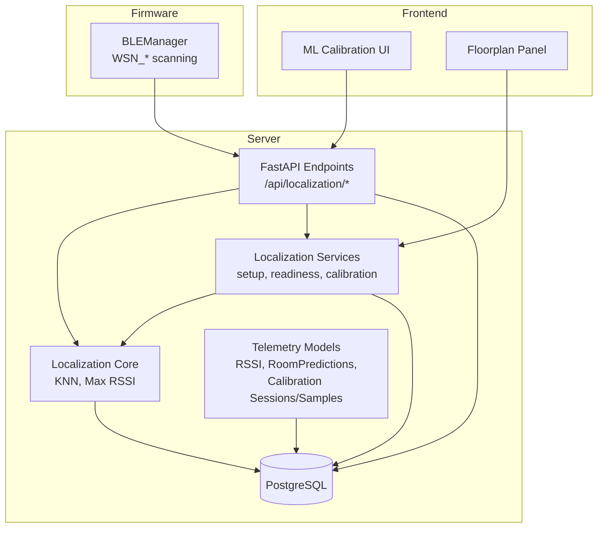
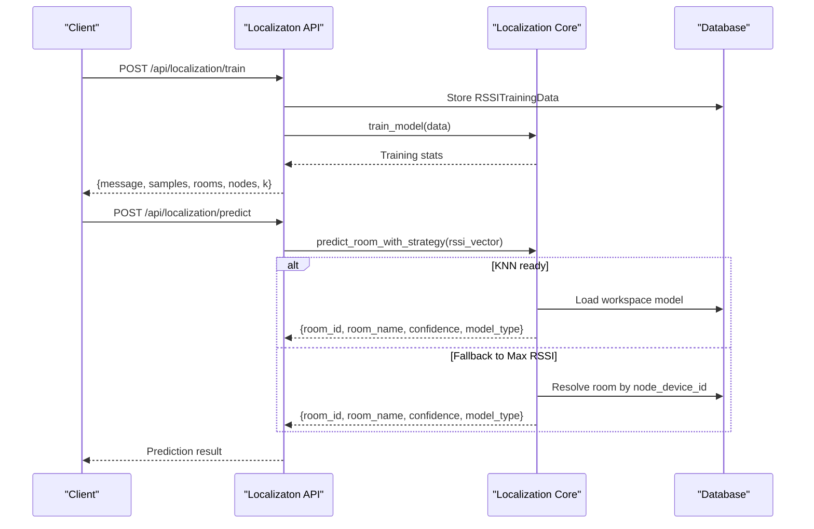
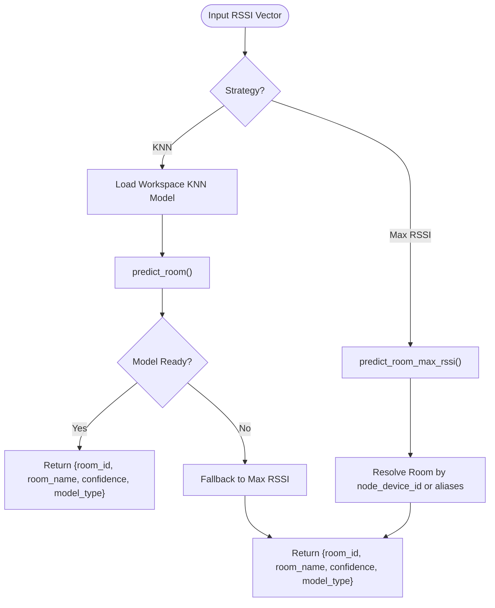
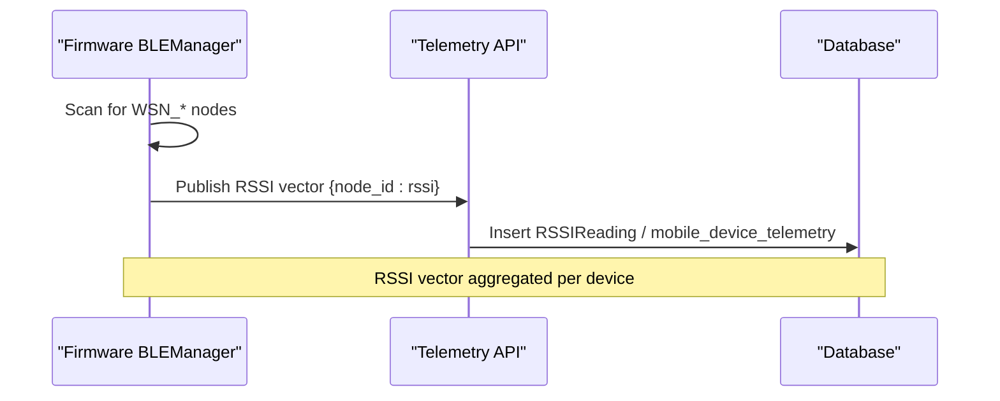
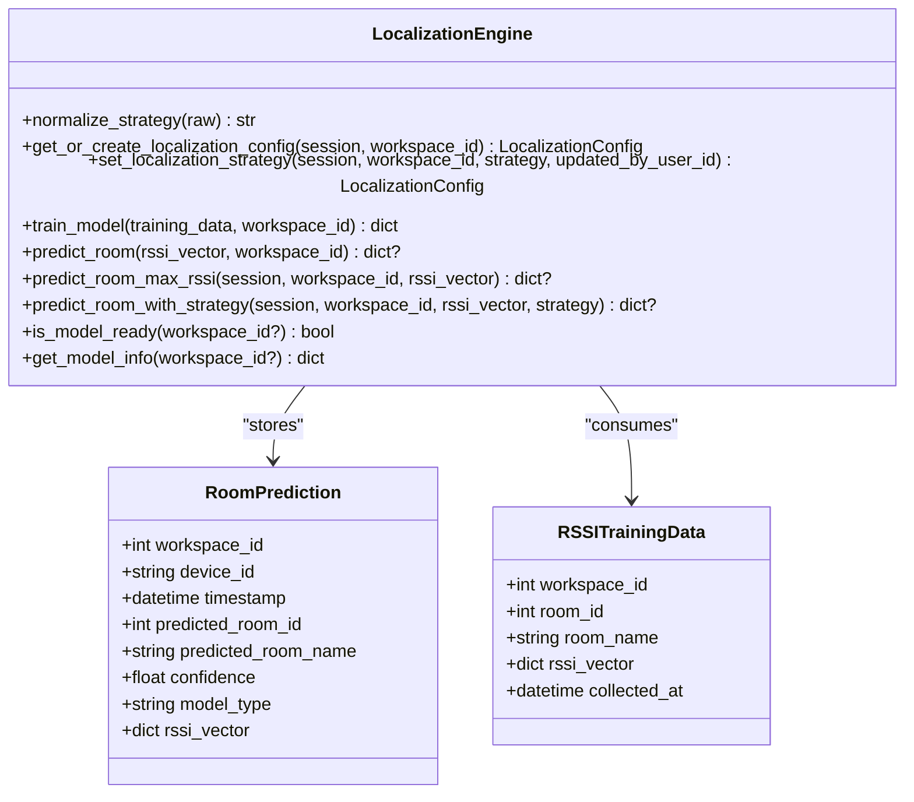
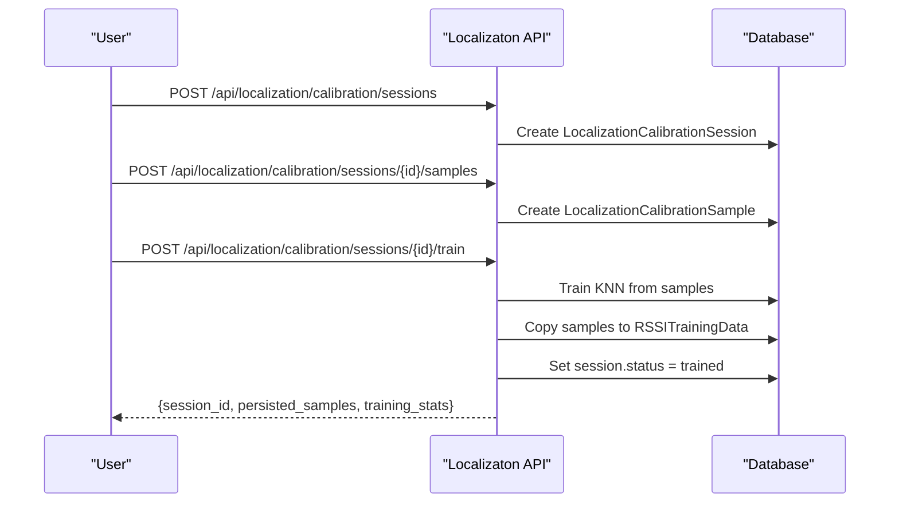
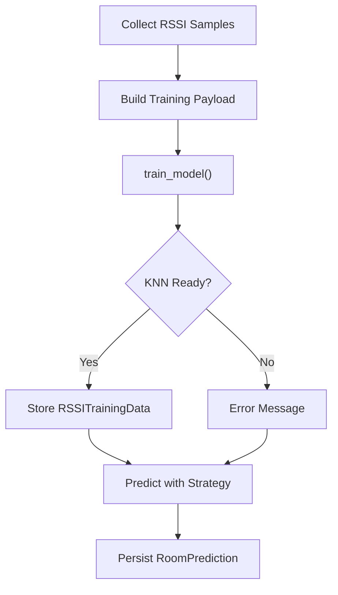
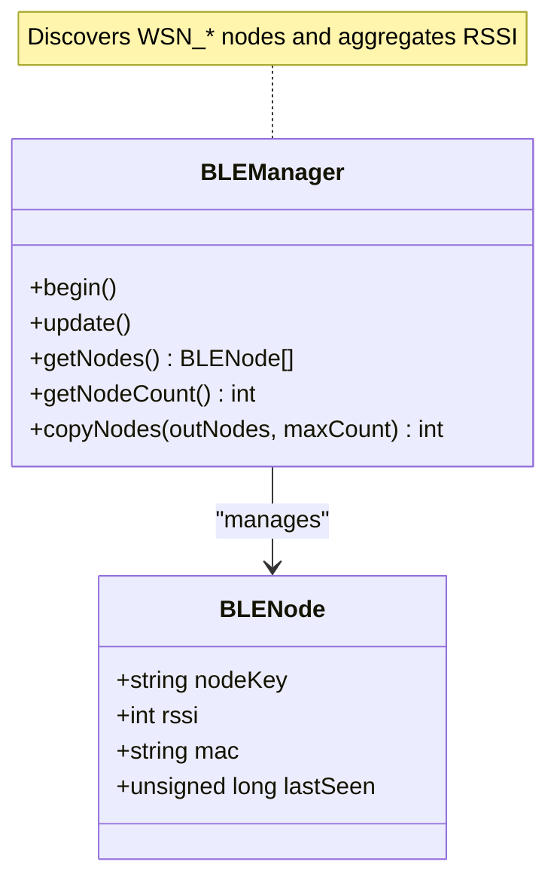
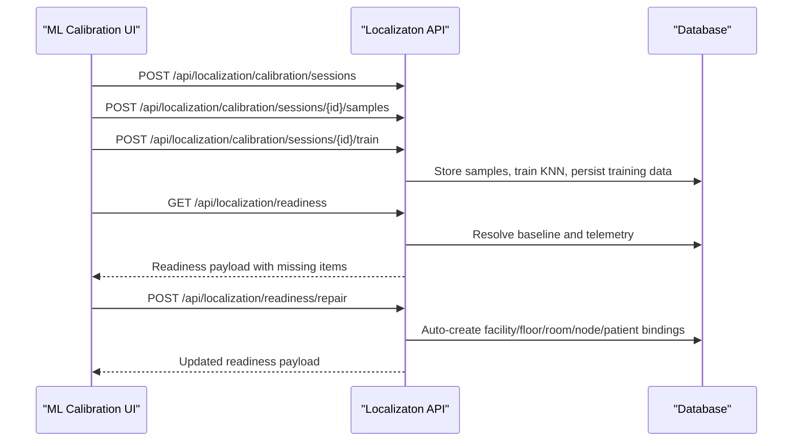
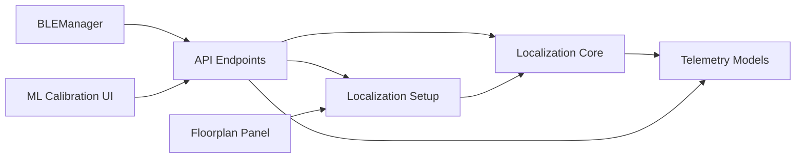

# Localization System

<cite>
**Referenced Files in This Document**
- [localization.py](file://server/app/localization.py)
- [localization.py](file://server/app/api/endpoints/localization.py)
- [localization.py](file://server/app/schemas/localization.py)
- [localization_setup.py](file://server/app/services/localization_setup.py)
- [telemetry.py](file://server/app/models/telemetry.py)
- [0004-configurable-localization-strategy.md](file://docs/adr/0004-configurable-localization-strategy.md)
- [q1r2s3t4u5v6_add_device_localization_runtime_tables.py](file://server/alembic/versions/q1r2s3t4u5v6_add_device_localization_runtime_tables.py)
- [test_localization.py](file://server/tests/test_localization.py)
- [BLEManager.cpp](file://firmware/M5StickCPlus2/src/managers/BLEManager.cpp)
- [BLEManager.h](file://firmware/M5StickCPlus2/src/managers/BLEManager.h)
- [FloorplansPanel.tsx](file://frontend/components/admin/FloorplansPanel.tsx)
- [floorplanLayout.ts](file://frontend/lib/floorplanLayout.ts)
- [nodeDeviceRoomKey.ts](file://frontend/lib/nodeDeviceRoomKey.ts)
- [MlCalibrationClient.tsx](file://frontend/app/admin/ml-calibration/MlCalibrationClient.tsx)
</cite>

## Table of Contents
1. [Introduction](#introduction)
2. [Project Structure](#project-structure)
3. [Core Components](#core-components)
4. [Architecture Overview](#architecture-overview)
5. [Detailed Component Analysis](#detailed-component-analysis)
6. [Dependency Analysis](#dependency-analysis)
7. [Performance Considerations](#performance-considerations)
8. [Troubleshooting Guide](#troubleshooting-guide)
9. [Conclusion](#conclusion)
10. [Appendices](#appendices)

## Introduction
This document describes the WheelSense Platform localization system with a focus on RSSI-based room positioning. It covers:
- RSSI-based room prediction using two strategies: KNN (fingerprinting) and Max RSSI (simplest signal).
- Calibration workflows for building and retraining the KNN model.
- Room prediction model, confidence scoring, and accuracy validation surfaces.
- BLE/Wi-Fi node device management and WSN_* beacon handling.
- Localization configuration, thresholds, and environmental impacts.
- Multi-room scenarios, edge cases, and fallback mechanisms.
- Examples of localization queries, calibration workflows, and integration with floorplan visualization.

## Project Structure
The localization system spans backend services, database models, firmware, and frontend UI:
- Backend: localization engine, API endpoints, readiness and calibration services, and telemetry models.
- Firmware: BLE scanning and node discovery for WSN_* beacons.
- Frontend: ML calibration UI and floorplan integration.

**Diagram sources**
- [localization.py:1-321](file://server/app/localization.py#L1-L321)
- [localization.py:1-396](file://server/app/api/endpoints/localization.py#L1-L396)
- [localization_setup.py:1-678](file://server/app/services/localization_setup.py#L1-L678)
- [telemetry.py:1-222](file://server/app/models/telemetry.py#L1-L222)
- [BLEManager.cpp:1-78](file://firmware/M5StickCPlus2/src/managers/BLEManager.cpp#L1-L78)
- [BLEManager.h:1-54](file://firmware/M5StickCPlus2/src/managers/BLEManager.h#L1-L54)

**Section sources**
- [localization.py:1-321](file://server/app/localization.py#L1-L321)
- [localization.py:1-396](file://server/app/api/endpoints/localization.py#L1-L396)
- [localization_setup.py:1-678](file://server/app/services/localization_setup.py#L1-L678)
- [telemetry.py:1-222](file://server/app/models/telemetry.py#L1-L222)
- [BLEManager.cpp:1-78](file://firmware/M5StickCPlus2/src/managers/BLEManager.cpp#L1-L78)
- [BLEManager.h:1-54](file://firmware/M5StickCPlus2/src/managers/BLEManager.h#L1-L54)

## Core Components
- Localization Engine: KNN fingerprinting and Max RSSI prediction with a configurable strategy per workspace.
- Calibration Pipeline: Sessions and samples to collect RSSI fingerprints and train the KNN model.
- Readiness & Setup: Automated detection and repair of dependencies for localization (rooms, nodes, assignments, floorplans).
- Telemetry Models: Storage for RSSI readings, training data, room predictions, and calibration artifacts.
- Firmware BLE Scanner: Discovers WSN_* nodes and builds RSSI vectors for prediction.

Key capabilities:
- Predict room by RSSI vector using either KNN or Max RSSI.
- Train KNN model from stored calibration samples or ad-hoc requests.
- Inspect readiness and auto-repair missing bindings.
- Persist predictions and training data for validation and retraining.

**Section sources**
- [localization.py:22-321](file://server/app/localization.py#L22-L321)
- [localization.py:52-396](file://server/app/api/endpoints/localization.py#L52-L396)
- [localization_setup.py:124-678](file://server/app/services/localization_setup.py#L124-L678)
- [telemetry.py:42-222](file://server/app/models/telemetry.py#L42-L222)
- [BLEManager.cpp:33-62](file://firmware/M5StickCPlus2/src/managers/BLEManager.cpp#L33-L62)

## Architecture Overview
The system integrates real-time RSSI telemetry from mobile/wheelchair devices and BLE/Wi-Fi nodes to infer room presence. The backend exposes endpoints to configure strategy, train, predict, and manage calibration sessions. The frontend provides an ML calibration UI and floorplan visualization.

**Diagram sources**
- [localization.py:129-201](file://server/app/api/endpoints/localization.py#L129-L201)
- [localization.py:93-154](file://server/app/localization.py#L93-L154)
- [localization.py:268-291](file://server/app/localization.py#L268-L291)

**Section sources**
- [localization.py:129-201](file://server/app/api/endpoints/localization.py#L129-L201)
- [localization.py:93-154](file://server/app/localization.py#L93-L154)
- [localization.py:268-291](file://server/app/localization.py#L268-L291)

## Detailed Component Analysis

### RSSI-Based Room Positioning
Two strategies are supported:
- KNN (fingerprinting): Uses a trained model on RSSI vectors to predict rooms with confidence scores.
- Max RSSI: Assigns to the room bound to the node with the strongest RSSI.

**Diagram sources**
- [localization.py:268-291](file://server/app/localization.py#L268-L291)
- [localization.py:157-179](file://server/app/localization.py#L157-L179)
- [localization.py:215-265](file://server/app/localization.py#L215-L265)

**Section sources**
- [localization.py:22-321](file://server/app/localization.py#L22-L321)

### Signal Strength Analysis and Beacon Triangulation
- RSSI readings are ingested from mobile/wheelchair devices and BLE/Wi-Fi nodes.
- The firmware BLE scanner identifies WSN_* nodes and maintains RSSI samples per node.
- The system normalizes node identifiers and resolves aliases to bind nodes to rooms.

**Diagram sources**
- [BLEManager.cpp:33-62](file://firmware/M5StickCPlus2/src/managers/BLEManager.cpp#L33-L62)
- [telemetry.py:42-51](file://server/app/models/telemetry.py#L42-L51)
- [telemetry.py:132-153](file://server/app/models/telemetry.py#L132-L153)

**Section sources**
- [BLEManager.cpp:1-78](file://firmware/M5StickCPlus2/src/managers/BLEManager.cpp#L1-L78)
- [BLEManager.h:1-54](file://firmware/M5StickCPlus2/src/managers/BLEManager.h#L1-L54)
- [telemetry.py:42-153](file://server/app/models/telemetry.py#L42-L153)

### Room Prediction Model, Confidence Scoring, and Accuracy Validation
- KNN model:
  - Features: RSSI vector aligned to a canonical node order per workspace.
  - Labels: Room IDs encoded as “room_<id>”.
  - Confidence: Probability of the predicted class.
  - Metrics returned: samples, rooms, nodes, k, workspace_id.
- Max RSSI model:
  - Confidence derived from normalized RSSI: scaled from -100 dBm to -40 dBm to [0,1].
- Accuracy validation:
  - Use stored RoomPrediction entries to review historical predictions and confidence.
  - Retrain KNN using stored RSSITrainingData or calibration samples.

**Diagram sources**
- [localization.py:39-321](file://server/app/localization.py#L39-L321)
- [telemetry.py:53-74](file://server/app/models/telemetry.py#L53-L74)

**Section sources**
- [localization.py:93-154](file://server/app/localization.py#L93-L154)
- [localization.py:157-179](file://server/app/localization.py#L157-L179)
- [telemetry.py:53-74](file://server/app/models/telemetry.py#L53-L74)

### Localization Calibration Process, Sessions, and Sample Collection
- Calibration sessions capture labeled RSSI samples for rooms.
- Samples are stored in localization_calibration_samples and can be used to train the KNN model.
- Sessions support lifecycle: collecting → trained; training persists samples into RSSITrainingData.

**Diagram sources**
- [localization.py:233-396](file://server/app/api/endpoints/localization.py#L233-L396)
- [telemetry.py:178-221](file://server/app/models/telemetry.py#L178-L221)

**Section sources**
- [localization.py:233-396](file://server/app/api/endpoints/localization.py#L233-L396)
- [telemetry.py:178-221](file://server/app/models/telemetry.py#L178-L221)

### Room Prediction Model, Confidence Scoring, and Accuracy Validation
- KNN model:
  - Features: RSSI vector aligned to a canonical node order per workspace.
  - Labels: Room IDs encoded as “room_<id>”.
  - Confidence: Probability of the predicted class.
  - Metrics returned: samples, rooms, nodes, k, workspace_id.
- Max RSSI model:
  - Confidence derived from normalized RSSI: scaled from -100 dBm to -40 dBm to [0,1].
- Accuracy validation:
  - Use stored RoomPrediction entries to review historical predictions and confidence.
  - Retrain KNN using stored RSSITrainingData or calibration samples.

**Diagram sources**
- [localization.py:129-189](file://server/app/api/endpoints/localization.py#L129-L189)
- [localization.py:93-154](file://server/app/localization.py#L93-L154)
- [telemetry.py:53-74](file://server/app/models/telemetry.py#L53-L74)

**Section sources**
- [localization.py:93-154](file://server/app/localization.py#L93-L154)
- [localization.py:157-179](file://server/app/localization.py#L157-L179)
- [telemetry.py:53-74](file://server/app/models/telemetry.py#L53-L74)

### BLE Node Device Management, WSN_* Beacon Handling, and Node Discovery
- Firmware BLEManager scans for WSN_* prefixed names, normalizes to WSN_XXX, and tracks RSSI per node.
- Node MAC normalization and alias matching enable robust room binding even if identifiers vary.
- Node-to-room binding is validated and repaired by the readiness service.

**Diagram sources**
- [BLEManager.h:12-43](file://firmware/M5StickCPlus2/src/managers/BLEManager.h#L12-L43)
- [BLEManager.cpp:33-62](file://firmware/M5StickCPlus2/src/managers/BLEManager.cpp#L33-L62)

**Section sources**
- [BLEManager.cpp:1-78](file://firmware/M5StickCPlus2/src/managers/BLEManager.cpp#L1-L78)
- [BLEManager.h:1-54](file://firmware/M5StickCPlus2/src/managers/BLEManager.h#L1-L54)
- [localization_setup.py:198-213](file://server/app/services/localization_setup.py#L198-L213)

### Localization Configuration, Threshold Settings, and Environmental Factors Impact
- Strategy configuration: choose between “knn” and “max_rssi” per workspace.
- Thresholds:
  - Max RSSI confidence thresholding via RSSI range normalization.
  - KNN confidence from model probability.
- Environmental factors:
  - Reflections, multipath, and node placement affect RSSI quality.
  - KNN fingerprints mitigate some variability but require representative training data.

**Section sources**
- [localization.py:39-45](file://server/app/localization.py#L39-L45)
- [localization.py:256-265](file://server/app/localization.py#L256-L265)
- [0004-configurable-localization-strategy.md:1-46](file://docs/adr/0004-configurable-localization-strategy.md#L1-L46)

### Multi-Room Scenarios, Edge Cases, and Fallback Mechanisms
- Multi-room inference: KNN predicts the most likely room; Max RSSI assigns to the room bound to the strongest node.
- Edge cases:
  - No RSSI observations: prediction fails gracefully with an error.
  - No trained model: fallback to Max RSSI prediction.
  - Unbound nodes or rooms: readiness service repairs bindings and floorplan entries.
- Fallback mechanism:
  - When KNN is requested but not trained, the system falls back to Max RSSI with a fallback reason.

**Section sources**
- [localization.py:268-291](file://server/app/localization.py#L268-L291)
- [localization_setup.py:444-678](file://server/app/services/localization_setup.py#L444-L678)

### Examples of Localization Queries, Calibration Workflows, and Floorplan Integration
- Example: Predict room for a device’s latest RSSI vector.
- Example: Train KNN from stored samples.
- Example: Create a calibration session, add samples, and train.
- Example: Repair readiness and update floorplan room entries.

**Diagram sources**
- [MlCalibrationClient.tsx:318-358](file://frontend/app/admin/ml-calibration/MlCalibrationClient.tsx#L318-L358)
- [localization.py:233-396](file://server/app/api/endpoints/localization.py#L233-L396)
- [localization_setup.py:434-678](file://server/app/services/localization_setup.py#L434-L678)

**Section sources**
- [MlCalibrationClient.tsx:318-358](file://frontend/app/admin/ml-calibration/MlCalibrationClient.tsx#L318-L358)
- [localization.py:191-231](file://server/app/api/endpoints/localization.py#L191-L231)
- [localization.py:233-396](file://server/app/api/endpoints/localization.py#L233-L396)
- [localization_setup.py:434-678](file://server/app/services/localization_setup.py#L434-L678)

## Dependency Analysis
The localization system has clear module boundaries:
- API layer depends on core localization and services.
- Services depend on core localization and database models.
- Firmware provides RSSI telemetry consumed by the API.
- Frontend UI interacts with API for calibration and readiness.

**Diagram sources**
- [localization.py:1-396](file://server/app/api/endpoints/localization.py#L1-L396)
- [localization.py:1-321](file://server/app/localization.py#L1-L321)
- [localization_setup.py:1-678](file://server/app/services/localization_setup.py#L1-L678)
- [telemetry.py:1-222](file://server/app/models/telemetry.py#L1-L222)
- [BLEManager.cpp:1-78](file://firmware/M5StickCPlus2/src/managers/BLEManager.cpp#L1-L78)
- [FloorplansPanel.tsx:44-239](file://frontend/components/admin/FloorplansPanel.tsx#L44-L239)

**Section sources**
- [localization.py:1-396](file://server/app/api/endpoints/localization.py#L1-L396)
- [localization.py:1-321](file://server/app/localization.py#L1-L321)
- [localization_setup.py:1-678](file://server/app/services/localization_setup.py#L1-L678)
- [telemetry.py:1-222](file://server/app/models/telemetry.py#L1-L222)
- [BLEManager.cpp:1-78](file://firmware/M5StickCPlus2/src/managers/BLEManager.cpp#L1-L78)
- [FloorplansPanel.tsx:44-239](file://frontend/components/admin/FloorplansPanel.tsx#L44-L239)

## Performance Considerations
- KNN training:
  - Feature matrix size grows with number of nodes; keep node sets stable across sessions.
  - Use a reasonable k (≤ min(5, samples)) to balance bias/variance.
- Prediction latency:
  - KNN prediction is O(n_neighbors × n_features); precompute node order per workspace.
- RSSI ingestion:
  - Aggregate latest RSSI per node per device to reduce cardinality.
- Memory:
  - Model caching per workspace; avoid frequent re-instantiation.

[No sources needed since this section provides general guidance]

## Troubleshooting Guide
Common issues and resolutions:
- No model trained:
  - Use KNN training endpoints or calibration sessions to build a model.
- Predictions fail with no RSSI:
  - Ensure telemetry is being published and RSSI vectors are non-empty.
- Incorrect room assignment:
  - Verify node-to-room binding and alias resolution; use readiness repair.
- Floorplan room not visible:
  - Ensure the floorplan layout contains the room and labels match.

Operational checks:
- Readiness inspection: confirms missing items (facility, floor, room, node, patient, assignments, floorplan).
- Strategy mismatch: confirm active strategy via configuration endpoint.
- Historical accuracy: review RoomPrediction entries for confidence trends.

**Section sources**
- [localization.py:268-291](file://server/app/localization.py#L268-L291)
- [localization.py:52-231](file://server/app/api/endpoints/localization.py#L52-L231)
- [localization_setup.py:434-678](file://server/app/services/localization_setup.py#L434-L678)
- [test_localization.py:1-84](file://server/tests/test_localization.py#L1-L84)

## Conclusion
The WheelSense localization system provides a flexible, configurable approach to RSSI-based room positioning. By combining KNN fingerprinting with a simple Max RSSI fallback, it balances accuracy and immediate deployability. Robust calibration workflows, readiness inspection/repair, and floorplan integration streamline deployment and maintenance. Proper node placement, representative training data, and consistent aliasing are key to achieving reliable accuracy.

[No sources needed since this section summarizes without analyzing specific files]

## Appendices

### API Reference Highlights
- Get localization info: GET /api/localization
- Get/set strategy: GET /api/localization/config, PUT /api/localization/config
- Train model: POST /api/localization/train
- Retrain from DB: POST /api/localization/retrain
- Predict: POST /api/localization/predict
- List predictions: GET /api/localization/predictions
- Create calibration session: POST /api/localization/calibration/sessions
- Add sample: POST /api/localization/calibration/sessions/{session_id}/samples
- Train from session: POST /api/localization/calibration/sessions/{session_id}/train
- Readiness: GET /api/localization/readiness
- Repair readiness: POST /api/localization/readiness/repair

**Section sources**
- [localization.py:52-396](file://server/app/api/endpoints/localization.py#L52-L396)
- [localization.py:11-93](file://server/app/schemas/localization.py#L11-L93)

### Database Schema Notes
- LocalizationConfig: per-workspace strategy.
- RSSIReading: raw RSSI per node per device.
- RSSITrainingData: labeled fingerprints for training.
- RoomPrediction: historical predictions with confidence.
- LocalizationCalibrationSession and Sample: calibration artifacts.

**Section sources**
- [q1r2s3t4u5v6_add_device_localization_runtime_tables.py:68-152](file://server/alembic/versions/q1r2s3t4u5v6_add_device_localization_runtime_tables.py#L68-L152)
- [telemetry.py:42-222](file://server/app/models/telemetry.py#L42-L222)

### Frontend Integration Notes
- ML Calibration UI drives calibration sessions and strategy updates.
- Floorplan panel merges room and node device associations for visualization.

**Section sources**
- [MlCalibrationClient.tsx:318-358](file://frontend/app/admin/ml-calibration/MlCalibrationClient.tsx#L318-L358)
- [FloorplansPanel.tsx:44-239](file://frontend/components/admin/FloorplansPanel.tsx#L44-L239)
- [floorplanLayout.ts:1-103](file://frontend/lib/floorplanLayout.ts#L1-L103)
- [nodeDeviceRoomKey.ts:28-43](file://frontend/lib/nodeDeviceRoomKey.ts#L28-L43)