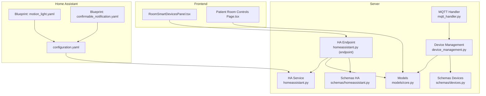
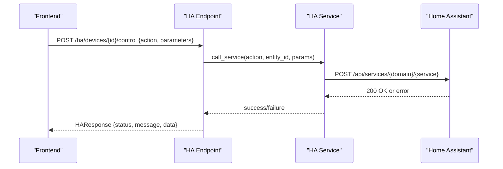
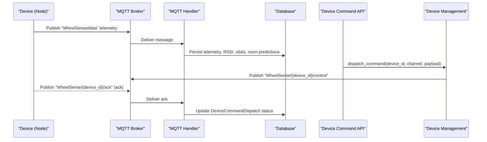
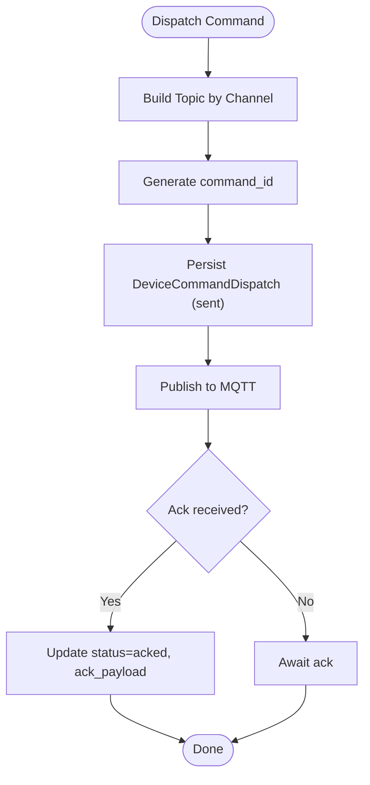
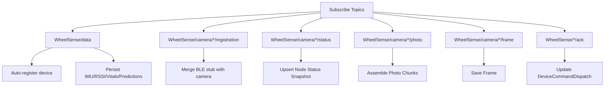
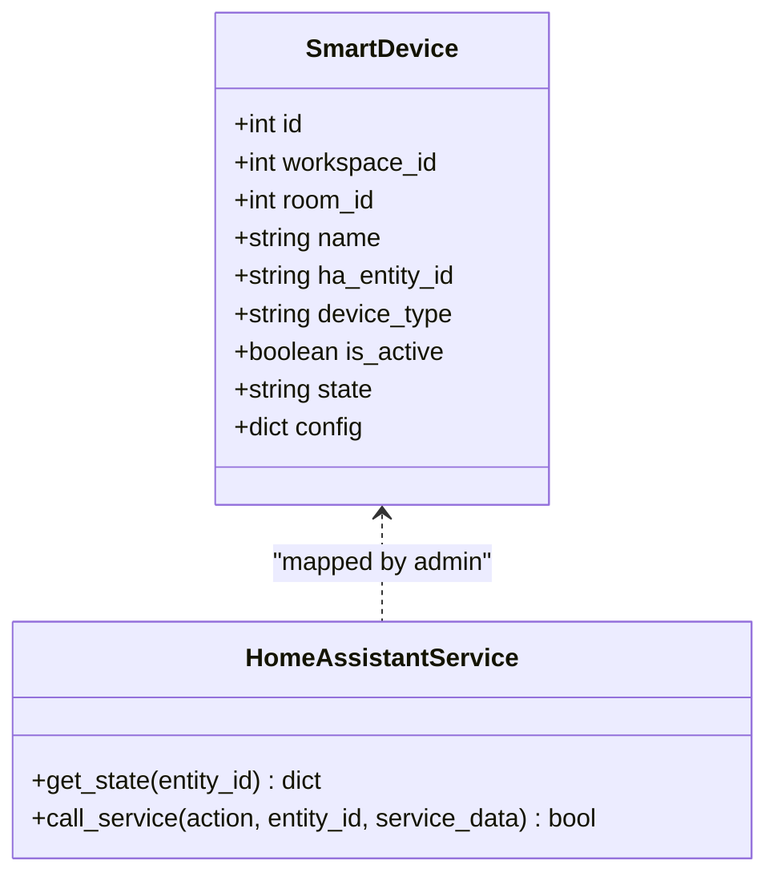
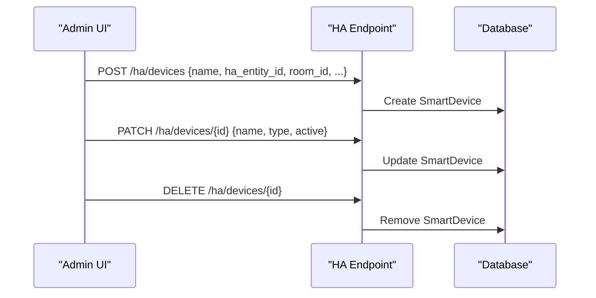
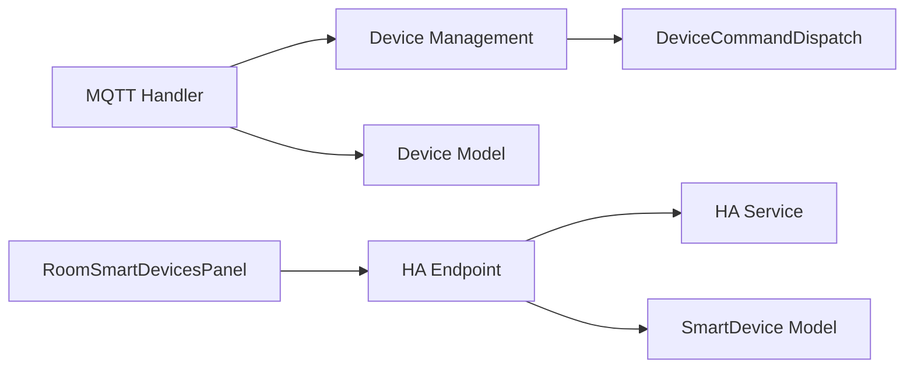

# Smart Device Integration

<cite>
**Referenced Files in This Document**
- [device_management.py](file://server/app/services/device_management.py)
- [mqtt_handler.py](file://server/app/mqtt_handler.py)
- [homeassistant.py](file://server/app/services/homeassistant.py)
- [homeassistant.py (endpoint)](file://server/app/api/endpoints/homeassistant.py)
- [models/core.py](file://server/app/models/core.py)
- [schemas/devices.py](file://server/app/schemas/devices.py)
- [schemas/homeassistant.py](file://server/app/schemas/homeassistant.py)
- [configuration.yaml](file://server/homeassistant/configuration.yaml)
- [motion_light.yaml](file://server/homeassistant/blueprints/automation/homeassistant/motion_light.yaml)
- [confirmable_notification.yaml](file://server/homeassistant/blueprints/script/homeassistant/confirmable_notification.yaml)
- [RoomSmartDevicesPanel.tsx](file://frontend/components/admin/monitoring/RoomSmartDevicesPanel.tsx)
- [page.tsx (patient room controls)](file://frontend/app/patient/room-controls/page.tsx)
- [test_mqtt_handler.py](file://server/tests/test_mqtt_handler.py)
</cite>

## Table of Contents
1. [Introduction](#introduction)
2. [Project Structure](#project-structure)
3. [Core Components](#core-components)
4. [Architecture Overview](#architecture-overview)
5. [Detailed Component Analysis](#detailed-component-analysis)
6. [Dependency Analysis](#dependency-analysis)
7. [Performance Considerations](#performance-considerations)
8. [Troubleshooting Guide](#troubleshooting-guide)
9. [Conclusion](#conclusion)
10. [Appendices](#appendices)

## Introduction
This document explains how the WheelSense Platform integrates smart home devices through a Home Assistant bridge and MQTT-based device control. It covers:
- Bidirectional communication: MQTT for device telemetry and control, and Home Assistant HTTP API for room device control
- Room control management and device status monitoring
- Device provisioning, authentication, and security considerations
- Discovery and pairing workflows, capability mapping, and state synchronization
- Command queuing, retry logic, and error handling
- Integration with Home Assistant automations, scripts, and blueprints
- Examples of custom integrations and troubleshooting connectivity issues

## Project Structure
The smart device integration spans backend services, MQTT ingestion, Home Assistant bridge, and frontend UIs:
- Backend services manage device registries, MQTT publishing, and Home Assistant API calls
- MQTT handler subscribes to topics, ingests telemetry, persists data, and handles acknowledgments
- Home Assistant endpoint exposes APIs to control and query mapped smart devices
- Frontend panels enable administrators to map and control HA entities per room

**Diagram sources**
- [device_management.py:1312-1367](file://server/app/services/device_management.py#L1312-L1367)
- [mqtt_handler.py:73-137](file://server/app/mqtt_handler.py#L73-L137)
- [homeassistant.py (endpoint):65-255](file://server/app/api/endpoints/homeassistant.py#L65-L255)
- [homeassistant.py:11-76](file://server/app/services/homeassistant.py#L11-L76)
- [models/core.py:27-124](file://server/app/models/core.py#L27-L124)
- [schemas/devices.py:26-42](file://server/app/schemas/devices.py#L26-L42)
- [schemas/homeassistant.py:7-46](file://server/app/schemas/homeassistant.py#L7-L46)
- [configuration.yaml:1-62](file://server/homeassistant/configuration.yaml#L1-L62)
- [motion_light.yaml:1-58](file://server/homeassistant/blueprints/automation/homeassistant/motion_light.yaml#L1-L58)
- [confirmable_notification.yaml:1-51](file://server/homeassistant/blueprints/script/homeassistant/confirmable_notification.yaml#L1-L51)
- [RoomSmartDevicesPanel.tsx:16-174](file://frontend/components/admin/monitoring/RoomSmartDevicesPanel.tsx#L16-L174)
- [page.tsx (patient room controls):156-387](file://frontend/app/patient/room-controls/page.tsx#L156-L387)

**Section sources**
- [device_management.py:1312-1367](file://server/app/services/device_management.py#L1312-L1367)
- [mqtt_handler.py:73-137](file://server/app/mqtt_handler.py#L73-L137)
- [homeassistant.py (endpoint):65-255](file://server/app/api/endpoints/homeassistant.py#L65-L255)
- [homeassistant.py:11-76](file://server/app/services/homeassistant.py#L11-L76)
- [models/core.py:27-124](file://server/app/models/core.py#L27-L124)
- [schemas/devices.py:26-42](file://server/app/schemas/devices.py#L26-L42)
- [schemas/homeassistant.py:7-46](file://server/app/schemas/homeassistant.py#L7-L46)
- [configuration.yaml:1-62](file://server/homeassistant/configuration.yaml#L1-L62)
- [motion_light.yaml:1-58](file://server/homeassistant/blueprints/automation/homeassistant/motion_light.yaml#L1-L58)
- [confirmable_notification.yaml:1-51](file://server/homeassistant/blueprints/script/homeassistant/confirmable_notification.yaml#L1-L51)
- [RoomSmartDevicesPanel.tsx:16-174](file://frontend/components/admin/monitoring/RoomSmartDevicesPanel.tsx#L16-L174)
- [page.tsx (patient room controls):156-387](file://frontend/app/patient/room-controls/page.tsx#L156-L387)

## Core Components
- Device registry and MQTT command dispatch:
  - Publishes control commands to MQTT topics and maintains audit records
  - Supports camera and wheelchair channels with distinct topics
- MQTT ingestion pipeline:
  - Subscribes to telemetry, registration, status, photo, and ack topics
  - Auto-registers devices, merges BLE stubs with camera devices, and persists snapshots
- Home Assistant bridge:
  - Exposes endpoints to list, create, update, delete, control, and query mapped smart devices
  - Uses HA HTTP API with token-based authentication
- Frontend panels:
  - Administrators map HA entities to rooms and control them
  - Patients can view room controls and device summaries

**Section sources**
- [device_management.py:1312-1367](file://server/app/services/device_management.py#L1312-L1367)
- [mqtt_handler.py:73-137](file://server/app/mqtt_handler.py#L73-L137)
- [homeassistant.py (endpoint):65-255](file://server/app/api/endpoints/homeassistant.py#L65-L255)
- [RoomSmartDevicesPanel.tsx:16-174](file://frontend/components/admin/monitoring/RoomSmartDevicesPanel.tsx#L16-L174)
- [page.tsx (patient room controls):156-387](file://frontend/app/patient/room-controls/page.tsx#L156-L387)

## Architecture Overview
The system implements a bidirectional integration:
- Outbound: Backend publishes device control commands to MQTT topics and HA HTTP API
- Inbound: MQTT handler ingests telemetry and acks; HA endpoint queries and controls mapped devices
- State synchronization: Device command dispatches are audited and updated upon acks; HA state can be cached locally

**Diagram sources**
- [homeassistant.py (endpoint):187-223](file://server/app/api/endpoints/homeassistant.py#L187-L223)
- [homeassistant.py:42-73](file://server/app/services/homeassistant.py#L42-L73)

**Diagram sources**
- [mqtt_handler.py:108-125](file://server/app/mqtt_handler.py#L108-L125)
- [device_management.py:1312-1367](file://server/app/services/device_management.py#L1312-L1367)
- [models/core.py:65-84](file://server/app/models/core.py#L65-L84)

## Detailed Component Analysis

### MQTT Command Dispatch and Acknowledgment
- Publishing control commands:
  - Selects topic based on channel and device type
  - Assigns a UUID command_id and persists a DeviceCommandDispatch row
  - Publishes to MQTT and updates status on exceptions
- Acknowledgment handling:
  - Listener decodes ack payloads and updates dispatch rows atomically
  - Maintains ack_at and ack_payload for auditability

**Diagram sources**
- [device_management.py:1312-1367](file://server/app/services/device_management.py#L1312-L1367)
- [models/core.py:65-84](file://server/app/models/core.py#L65-L84)
- [mqtt_handler.py:575-588](file://server/app/mqtt_handler.py#L575-L588)

**Section sources**
- [device_management.py:1312-1367](file://server/app/services/device_management.py#L1312-L1367)
- [device_management.py:1441-1454](file://server/app/services/device_management.py#L1441-L1454)
- [models/core.py:65-84](file://server/app/models/core.py#L65-L84)
- [mqtt_handler.py:575-588](file://server/app/mqtt_handler.py#L575-L588)
- [test_mqtt_handler.py:596-636](file://server/tests/test_mqtt_handler.py#L596-L636)

### MQTT Ingestion Pipeline
- Subscriptions:
  - Telemetry: WheelSense/data
  - Registration/status/photo/frame: WheelSense/camera/{id}/registration|status|photo|frame
  - Device ack: WheelSense/+/{device_id}/ack and WheelSense/camera/+/{device_id}/ack
- Responsibilities:
  - Auto-register devices on telemetry or camera registration/status
  - Merge BLE discovery stubs with camera devices when MAC matches
  - Persist telemetry, vitals, room predictions, and photo chunks
  - Upsert node status snapshots and maintain camera_status in device config

**Diagram sources**
- [mqtt_handler.py:73-137](file://server/app/mqtt_handler.py#L73-L137)
- [mqtt_handler.py:139-278](file://server/app/mqtt_handler.py#L139-L278)
- [mqtt_handler.py:590-667](file://server/app/mqtt_handler.py#L590-L667)

**Section sources**
- [mqtt_handler.py:73-137](file://server/app/mqtt_handler.py#L73-L137)
- [mqtt_handler.py:139-278](file://server/app/mqtt_handler.py#L139-L278)
- [mqtt_handler.py:590-667](file://server/app/mqtt_handler.py#L590-L667)

### Home Assistant Bridge Integration
- Device mapping:
  - Admin creates SmartDevice entries linking HA entity_id to rooms
  - Supports caching of last known state
- Control and state:
  - POST /ha/devices/{id}/control invokes HA service calls
  - GET /ha/devices/{id}/state fetches and caches HA state
- Authentication:
  - Requires HA base URL and access token configured in settings
  - Token is validated before requests; failures return 502

**Diagram sources**
- [models/core.py:104-124](file://server/app/models/core.py#L104-L124)
- [homeassistant.py:11-76](file://server/app/services/homeassistant.py#L11-L76)

**Section sources**
- [homeassistant.py (endpoint):65-255](file://server/app/api/endpoints/homeassistant.py#L65-L255)
- [homeassistant.py:11-76](file://server/app/services/homeassistant.py#L11-L76)
- [models/core.py:104-124](file://server/app/models/core.py#L104-L124)

### Frontend Device Provisioning and Control
- RoomSmartDevicesPanel:
  - Lists all HA devices, filters by room, and supports add/update/delete
  - Calls backend HA endpoints to manage mappings
- Patient Room Controls:
  - Displays device summaries and allows bulk refresh
  - Integrates with backend device models for status and snapshots

**Diagram sources**
- [RoomSmartDevicesPanel.tsx:46-87](file://frontend/components/admin/monitoring/RoomSmartDevicesPanel.tsx#L46-L87)
- [homeassistant.py (endpoint):84-186](file://server/app/api/endpoints/homeassistant.py#L84-L186)

**Section sources**
- [RoomSmartDevicesPanel.tsx:16-174](file://frontend/components/admin/monitoring/RoomSmartDevicesPanel.tsx#L16-L174)
- [page.tsx (patient room controls):156-387](file://frontend/app/patient/room-controls/page.tsx#L156-L387)
- [homeassistant.py (endpoint):65-255](file://server/app/api/endpoints/homeassistant.py#L65-L255)

### Home Assistant Blueprints and Automations
- Blueprints included:
  - motion_light.yaml: turn on a light on motion detection and turn off after delay
  - confirmable_notification.yaml: actionable notification with confirm/dismiss actions
- These enable low-code automation scenarios for room control and alerts

**Section sources**
- [motion_light.yaml:1-58](file://server/homeassistant/blueprints/automation/homeassistant/motion_light.yaml#L1-L58)
- [confirmable_notification.yaml:1-51](file://server/homeassistant/blueprints/script/homeassistant/confirmable_notification.yaml#L1-L51)
- [configuration.yaml:53-58](file://server/homeassistant/configuration.yaml#L53-L58)

## Dependency Analysis
- DeviceCommandDispatch depends on Device and Workspace for scoping and auditing
- MQTT handler depends on device management services for auto-registration and BLE merge
- HA endpoint depends on HA service for HTTP operations and on SmartDevice model for mapping
- Frontend components depend on backend endpoints for CRUD and control operations

**Diagram sources**
- [models/core.py:65-84](file://server/app/models/core.py#L65-L84)
- [models/core.py:27-45](file://server/app/models/core.py#L27-L45)
- [models/core.py:104-124](file://server/app/models/core.py#L104-L124)
- [device_management.py:1312-1367](file://server/app/services/device_management.py#L1312-L1367)
- [mqtt_handler.py:590-667](file://server/app/mqtt_handler.py#L590-L667)
- [homeassistant.py (endpoint):65-255](file://server/app/api/endpoints/homeassistant.py#L65-L255)
- [homeassistant.py:11-76](file://server/app/services/homeassistant.py#L11-L76)
- [RoomSmartDevicesPanel.tsx:16-174](file://frontend/components/admin/monitoring/RoomSmartDevicesPanel.tsx#L16-L174)

**Section sources**
- [models/core.py:27-124](file://server/app/models/core.py#L27-L124)
- [device_management.py:1312-1367](file://server/app/services/device_management.py#L1312-L1367)
- [mqtt_handler.py:590-667](file://server/app/mqtt_handler.py#L590-L667)
- [homeassistant.py (endpoint):65-255](file://server/app/api/endpoints/homeassistant.py#L65-L255)
- [homeassistant.py:11-76](file://server/app/services/homeassistant.py#L11-L76)
- [RoomSmartDevicesPanel.tsx:16-174](file://frontend/components/admin/monitoring/RoomSmartDevicesPanel.tsx#L16-L174)

## Performance Considerations
- MQTT batching and chunked photo assembly prevent memory spikes during large payloads
- Database writes are batched per message to reduce transaction overhead
- Frontend polling intervals and stale times are configurable to balance freshness and load
- HA API calls are short-lived with timeouts to avoid blocking

## Troubleshooting Guide
Common issues and resolutions:
- MQTT connection drops:
  - The listener retries with exponential backoff; verify broker credentials and TLS settings
- Device not responding to commands:
  - Check DeviceCommandDispatch status and ack payloads; ensure device topic matches registry
- HA control failures:
  - Verify HA base URL and access token; ensure entity_id exists and service is supported
- Camera registration mismatches:
  - Confirm BLE MAC alignment; the system merges BLE stubs with camera devices when MAC matches
- Photo capture not appearing:
  - Ensure photo chunks are complete and persisted; check camera status snapshot updates

**Section sources**
- [mqtt_handler.py:73-137](file://server/app/mqtt_handler.py#L73-L137)
- [device_management.py:1312-1367](file://server/app/services/device_management.py#L1312-L1367)
- [homeassistant.py:20-41](file://server/app/services/homeassistant.py#L20-L41)
- [test_mqtt_handler.py:638-650](file://server/tests/test_mqtt_handler.py#L638-L650)

## Conclusion
The WheelSense Platform provides a robust, bidirectional integration for smart home devices:
- MQTT enables real-time telemetry, control, and acknowledgment
- Home Assistant bridge offers flexible control and state caching
- Frontend panels streamline provisioning and room-centric control
- Built-in discovery, pairing, and error handling improve reliability and operability

## Appendices

### Security and Authentication
- Non-public device configuration keys are excluded from frontend exposure
- HA integration requires a valid access token; missing tokens cause early warnings and failures
- Device command dispatches are workspace-scoped and audited

**Section sources**
- [device_management.py:50-68](file://server/app/services/device_management.py#L50-L68)
- [homeassistant.py:20-24](file://server/app/services/homeassistant.py#L20-L24)

### Device Capability Mapping
- SmartDevice model supports arbitrary config for features and capabilities
- Device types include light, switch, climate, fan, etc., enabling flexible room control

**Section sources**
- [models/core.py:104-124](file://server/app/models/core.py#L104-L124)
- [schemas/homeassistant.py:8-34](file://server/app/schemas/homeassistant.py#L8-L34)

### Command Queuing and Retry Logic
- DeviceCommandDispatch tracks sent/acked/failed states and error messages
- MQTT publish failures mark dispatch as failed and surface errors to callers
- HA service calls return immediate feedback; higher-level retries can be implemented at the caller level

**Section sources**
- [models/core.py:65-84](file://server/app/models/core.py#L65-L84)
- [device_management.py:1357-1364](file://server/app/services/device_management.py#L1357-L1364)
- [homeassistant.py:42-73](file://server/app/services/homeassistant.py#L42-L73)