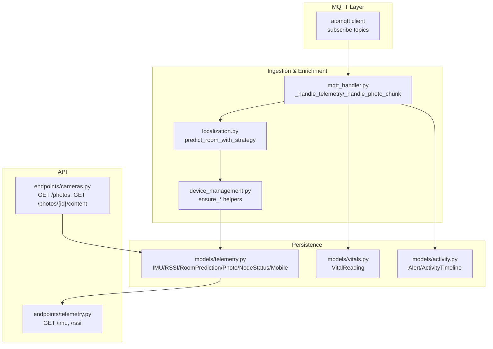
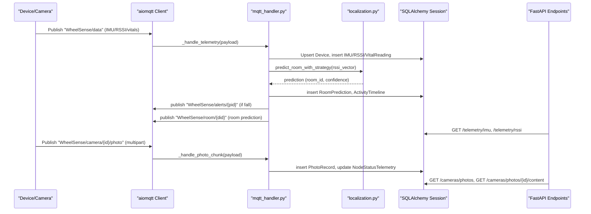
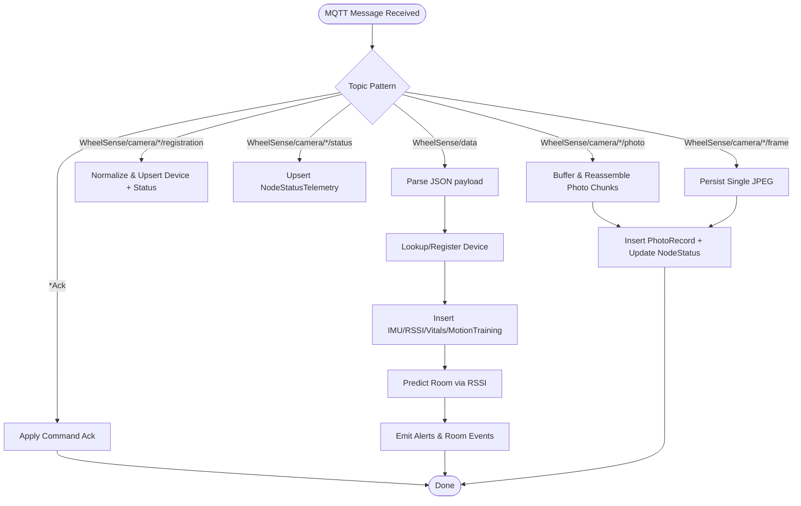
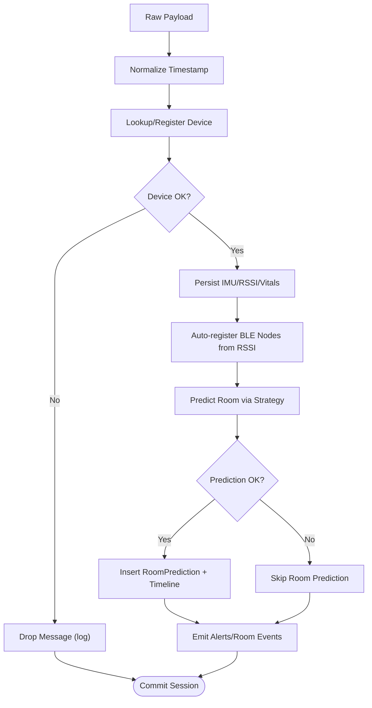
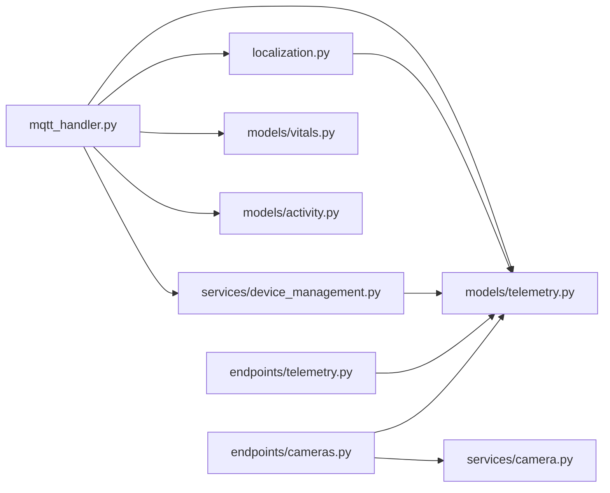

# Telemetry Processing

<cite>
**Referenced Files in This Document**
- [mqtt_handler.py](file://server/app/mqtt_handler.py)
- [localization.py](file://server/app/localization.py)
- [device_management.py](file://server/app/services/device_management.py)
- [telemetry.py](file://server/app/models/telemetry.py)
- [vitals.py](file://server/app/models/vitals.py)
- [activity.py](file://server/app/models/activity.py)
- [telemetry.py (API)](file://server/app/api/endpoints/telemetry.py)
- [cameras.py (API)](file://server/app/api/endpoints/cameras.py)
- [camera.py (schemas)](file://server/app/schemas/camera.py)
- [camera.py (service)](file://server/app/services/camera.py)
- [devices.py (schemas)](file://server/app/schemas/devices.py)
</cite>

## Table of Contents
1. [Introduction](#introduction)
2. [Project Structure](#project-structure)
3. [Core Components](#core-components)
4. [Architecture Overview](#architecture-overview)
5. [Detailed Component Analysis](#detailed-component-analysis)
6. [Dependency Analysis](#dependency-analysis)
7. [Performance Considerations](#performance-considerations)
8. [Troubleshooting Guide](#troubleshooting-guide)
9. [Conclusion](#conclusion)
10. [Appendices](#appendices)

## Introduction
This document describes the telemetry processing pipeline for the WheelSense Platform, from raw device messages to structured database storage and downstream analytics. It covers ingestion of IMU, RSSI, vital signs, camera photos, and mobile telemetry; transformation and validation; enrichment with localization and patient context; real-time alerting and health reporting; storage models and indexing; data quality assurance; error handling and retries; and scaling and performance considerations. It also provides examples of ingestion workflows and guidance for integrating custom telemetry types.

## Project Structure
The telemetry pipeline spans MQTT ingestion, device registry and normalization, localization, and persistence into domain models. The API layer exposes read endpoints for IMU and RSSI, and camera photo retrieval.

**Diagram sources**
- [mqtt_handler.py:73-137](file://server/app/mqtt_handler.py#L73-L137)
- [localization.py:268-290](file://server/app/localization.py#L268-L290)
- [device_management.py:127-214](file://server/app/services/device_management.py#L127-L214)
- [telemetry.py:20-154](file://server/app/models/telemetry.py#L20-L154)
- [vitals.py:24-56](file://server/app/models/vitals.py#L24-L56)
- [activity.py:14-89](file://server/app/models/activity.py#L14-L89)
- [telemetry.py (API):15-72](file://server/app/api/endpoints/telemetry.py#L15-L72)
- [cameras.py (API):19-91](file://server/app/api/endpoints/cameras.py#L19-L91)

**Section sources**
- [mqtt_handler.py:73-137](file://server/app/mqtt_handler.py#L73-L137)
- [telemetry.py (API):15-72](file://server/app/api/endpoints/telemetry.py#L15-L72)
- [cameras.py (API):19-91](file://server/app/api/endpoints/cameras.py#L19-L91)

## Core Components
- MQTT listener and dispatcher: Subscribes to device and camera topics, dispatches to handlers for telemetry, acknowledgements, registrations, status, photos, and frames.
- Telemetry ingestion: Parses incoming payloads, validates device registration, normalizes timestamps, persists IMU/motion/battery, RSSI, optional vital readings, and optionally motion training samples.
- Localization and room prediction: Uses RSSI vectors to predict rooms via configured strategy (KNN or max-RSSI), tracks transitions, and emits room events.
- Alerts and activity: Detects falls, creates alerts, and logs activity timeline events.
- Camera ingestion: Assembles multipart photo payloads, persists metadata, and updates node status snapshots.
- Persistence models: SQLAlchemy models for IMU telemetry, RSSI, room predictions, motion training, photos, node status, mobile telemetry, and vitals.
- API endpoints: Expose queries for recent IMU and RSSI, and photo listing/content retrieval.

**Section sources**
- [mqtt_handler.py:139-325](file://server/app/mqtt_handler.py#L139-L325)
- [localization.py:268-290](file://server/app/localization.py#L268-L290)
- [telemetry.py:20-154](file://server/app/models/telemetry.py#L20-L154)
- [vitals.py:24-56](file://server/app/models/vitals.py#L24-L56)
- [activity.py:14-89](file://server/app/models/activity.py#L14-L89)
- [telemetry.py (API):15-72](file://server/app/api/endpoints/telemetry.py#L15-L72)
- [cameras.py (API):19-91](file://server/app/api/endpoints/cameras.py#L19-L91)

## Architecture Overview
The telemetry pipeline is event-driven and asynchronous. MQTT messages trigger ingestion handlers that validate and normalize payloads, enrich with device and patient context, persist structured records, and publish downstream events for alerts and room predictions.

**Diagram sources**
- [mqtt_handler.py:100-137](file://server/app/mqtt_handler.py#L100-L137)
- [mqtt_handler.py:139-325](file://server/app/mqtt_handler.py#L139-L325)
- [localization.py:268-290](file://server/app/localization.py#L268-L290)
- [telemetry.py (API):15-72](file://server/app/api/endpoints/telemetry.py#L15-L72)
- [cameras.py (API):19-91](file://server/app/api/endpoints/cameras.py#L19-L91)

## Detailed Component Analysis

### MQTT Message Handling Pipeline
- Topics subscribed:
  - "WheelSense/data": primary telemetry payload containing device_id, IMU, motion, battery, RSSI list, optional polar HR, session_id, and is_recording flag.
  - "WheelSense/camera/{id}/registration": camera registration with device metadata.
  - "WheelSense/camera/{id}/status": periodic node status snapshots.
  - "WheelSense/camera/{id}/photo": multipart photo chunks.
  - "WheelSense/camera/{id}/frame": single-frame JPEG.
  - "WheelSense/+/ack" and "WheelSense/camera/+/ack": device/command acknowledgements.
- Dispatch logic:
  - _handle_telemetry parses and persists IMU/motion/battery, RSSI, optional vitals, and motion training samples.
  - _handle_photo_chunk buffers and reassembles multipart JPEGs; _handle_camera_frame persists single-frame JPEGs.
  - _handle_camera_registration and _handle_camera_status normalize and upsert node status, and update device metadata.
  - _handle_device_ack applies command acknowledgements.

**Diagram sources**
- [mqtt_handler.py:100-137](file://server/app/mqtt_handler.py#L100-L137)
- [mqtt_handler.py:139-325](file://server/app/mqtt_handler.py#L139-L325)
- [mqtt_handler.py:485-540](file://server/app/mqtt_handler.py#L485-L540)
- [mqtt_handler.py:566-573](file://server/app/mqtt_handler.py#L566-L573)
- [mqtt_handler.py:575-588](file://server/app/mqtt_handler.py#L575-L588)
- [mqtt_handler.py:590-631](file://server/app/mqtt_handler.py#L590-L631)
- [mqtt_handler.py:640-667](file://server/app/mqtt_handler.py#L640-L667)

**Section sources**
- [mqtt_handler.py:73-137](file://server/app/mqtt_handler.py#L73-L137)
- [mqtt_handler.py:139-325](file://server/app/mqtt_handler.py#L139-L325)
- [mqtt_handler.py:485-540](file://server/app/mqtt_handler.py#L485-L540)
- [mqtt_handler.py:566-573](file://server/app/mqtt_handler.py#L566-L573)
- [mqtt_handler.py:575-588](file://server/app/mqtt_handler.py#L575-L588)
- [mqtt_handler.py:590-631](file://server/app/mqtt_handler.py#L590-L631)
- [mqtt_handler.py:640-667](file://server/app/mqtt_handler.py#L640-L667)

### Telemetry Ingestion Workflows

#### IMU, RSSI, Motion, Battery, and Optional Vitals
- Device lookup or auto-registration is performed based on settings and payload device_type/hardware_type.
- IMU fields (acceleration, angular velocity) and motion metrics (distance, velocity, acceleration) are persisted.
- RSSI readings are normalized and inserted; BLE node devices are auto-created from RSSI beacons.
- Optional Polar HR payload is ingested as vitals if a patient is linked to the device.
- Motion training samples are conditionally stored when recording flag is set.

**Section sources**
- [mqtt_handler.py:139-277](file://server/app/mqtt_handler.py#L139-L277)
- [device_management.py:162-214](file://server/app/services/device_management.py#L162-L214)
- [device_management.py:306-387](file://server/app/services/device_management.py#L306-L387)
- [vitals.py:24-56](file://server/app/models/vitals.py#L24-L56)

#### Camera Photos and Frames
- Multipart photos: _handle_photo_chunk buffers by photo_id and reassembles when all chunks received; persisted as PhotoRecord with filesystem path and metadata.
- Single-frame frames: _handle_camera_frame writes a single JPEG with a generated photo_id.
- Node status snapshots are updated with capture counts and snapshot identifiers.

**Section sources**
- [mqtt_handler.py:542-573](file://server/app/mqtt_handler.py#L542-L573)
- [mqtt_handler.py:485-540](file://server/app/mqtt_handler.py#L485-L540)
- [telemetry.py:95-104](file://server/app/models/telemetry.py#L95-L104)
- [camera.py (service):14-31](file://server/app/services/camera.py#L14-L31)
- [cameras.py (API):19-91](file://server/app/api/endpoints/cameras.py#L19-L91)

#### Mobile Telemetry Integration
- Mobile telemetry schema supports battery, steps, Polar connectivity, linked person, and RSSI observations.
- This enables ingestion of mobile-derived RSSI and vitals for proximity-based localization and patient monitoring.

**Section sources**
- [devices.py (schemas):69-93](file://server/app/schemas/devices.py#L69-L93)
- [telemetry.py:132-153](file://server/app/models/telemetry.py#L132-L153)

### Telemetry Data Transformation, Validation, and Enrichment
- Timestamp normalization: Falls back to UTC now if payload timestamp is missing or invalid.
- Device normalization: Ensures device exists or auto-registers based on settings; normalizes hardware types for MQTT compatibility.
- BLE node auto-registration: Creates or updates node registry rows from RSSI beacon data; prunes duplicates and merges BLE stubs with canonical camera rows when MAC matches.
- Localization enrichment: Predicts room from RSSI vector using configured strategy; logs room transitions and emits room prediction events.
- Alerting: Fall detection uses thresholds on vertical acceleration and velocity; emits critical alerts and timeline events.

**Diagram sources**
- [mqtt_handler.py:139-277](file://server/app/mqtt_handler.py#L139-L277)
- [device_management.py:306-387](file://server/app/services/device_management.py#L306-L387)
- [localization.py:268-290](file://server/app/localization.py#L268-L290)
- [mqtt_handler.py:327-366](file://server/app/mqtt_handler.py#L327-L366)

**Section sources**
- [mqtt_handler.py:139-277](file://server/app/mqtt_handler.py#L139-L277)
- [device_management.py:162-214](file://server/app/services/device_management.py#L162-L214)
- [device_management.py:306-387](file://server/app/services/device_management.py#L306-L387)
- [localization.py:268-290](file://server/app/localization.py#L268-L290)

### Real-Time Alert Generation and Health Reporting
- Fall detection: Threshold-based heuristic on vertical acceleration and velocity; enforces cooldown to avoid repeated alerts; creates Alert records and publishes alert events.
- Room transitions: Tracks previous room per device and emits enter/exit events to ActivityTimeline.
- Node status health: Updates NodeStatusTelemetry with battery, streaming, snapshots, heap, and IP address; stores full payload for diagnostics.

**Section sources**
- [mqtt_handler.py:246-310](file://server/app/mqtt_handler.py#L246-L310)
- [mqtt_handler.py:327-366](file://server/app/mqtt_handler.py#L327-L366)
- [mqtt_handler.py:369-429](file://server/app/mqtt_handler.py#L369-L429)
- [mqtt_handler.py:458-483](file://server/app/mqtt_handler.py#L458-L483)
- [activity.py:14-48](file://server/app/models/activity.py#L14-L48)
- [telemetry.py:107-129](file://server/app/models/telemetry.py#L107-L129)

### Telemetry Storage Models, Indexing, and Query Patterns
- IMU telemetry: Indexed by workspace_id, device_id, timestamp; stores acceleration, angular velocity, motion metrics, and battery state.
- RSSI readings: Indexed by workspace_id, device_id, timestamp; stores node_id, RSSI, and optional MAC.
- Room predictions: Indexed by workspace_id, device_id, timestamp; stores predicted room, confidence, model type, and RSSI vector.
- Motion training data: Indexed by workspace_id, session_id, device_id, timestamp; stores IMU and motion metrics for training.
- Photo records: Indexed by workspace_id, device_id, photo_id, timestamp; stores filesystem path and size.
- Node status telemetry: Indexed by workspace_id, device_id, timestamp; stores status, battery, streaming, snapshots, heap, IP, and payload.
- Mobile device telemetry: Indexed by workspace_id, device_id, timestamp; stores battery, steps, Polar connectivity, linked person, RSSI vector, and extra metadata.
- Vitals: Indexed by workspace_id, patient_id, device_id, timestamp; stores heart rate, RR interval, SpO2, sensor battery, and source.
- Alerts and ActivityTimeline: Indexed by workspace_id, patient_id/device_id, timestamp; support alert resolution and timeline event categorization.

```mermaid
erDiagram
IMU_TELEMETRY {
int id PK
int workspace_id FK
string device_id
timestamp timestamp
int seq
float ax
float ay
float az
float gx
float gy
float gz
float distance_m
float velocity_ms
float accel_ms2
smallint direction
smallint battery_pct
float battery_v
boolean charging
}
RSSI_READINGS {
int id PK
int workspace_id FK
string device_id
timestamp timestamp
string node_id
smallint rssi
string mac
}
ROOM_PREDICTIONS {
int id PK
int workspace_id FK
string device_id
timestamp timestamp
int predicted_room_id
string predicted_room_name
float confidence
string model_type
json rssi_vector
}
MOTION_TRAINING_DATA {
int id PK
int workspace_id FK
string session_id
string device_id
timestamp timestamp
string action_label
float ax
float ay
float az
float gx
float gy
float gz
float distance_m
float velocity_ms
float accel_ms2
}
PHOTO_RECORDS {
int id PK
int workspace_id FK
string device_id
string photo_id UK
string filepath
int file_size
timestamp timestamp
}
NODE_STATUS_TELEMETRY {
int id PK
int workspace_id FK
string device_id
timestamp timestamp
string status
smallint battery_pct
float battery_v
boolean charging
boolean stream_enabled
int frames_captured
int snapshots_captured
string last_snapshot_id
int heap
string ip_address
json payload
}
MOBILE_DEVICE_TELEMETRY {
int id PK
int workspace_id FK
string device_id
timestamp timestamp
smallint battery_pct
float battery_v
boolean charging
int steps
boolean polar_connected
string linked_person_type
int linked_person_id
json rssi_vector
string source
json extra
}
VITAL_READINGS {
int id PK
int workspace_id FK
int patient_id FK
string device_id
timestamp timestamp
smallint heart_rate_bpm
float rr_interval_ms
smallint spo2
smallint sensor_battery
string source
}
ALERTS {
int id PK
int workspace_id FK
int patient_id FK
string device_id
timestamp timestamp
string alert_type
string severity
string title
text description
json data
string status
}
ACTIVITY_TIMELINE {
int id PK
int workspace_id FK
int patient_id FK
timestamp timestamp
string event_type
int room_id FK
string room_name
text description
json data
string source
}
```

**Diagram sources**
- [telemetry.py:20-154](file://server/app/models/telemetry.py#L20-L154)
- [vitals.py:24-56](file://server/app/models/vitals.py#L24-L56)
- [activity.py:14-89](file://server/app/models/activity.py#L14-L89)

**Section sources**
- [telemetry.py:20-154](file://server/app/models/telemetry.py#L20-L154)
- [vitals.py:24-56](file://server/app/models/vitals.py#L24-L56)
- [activity.py:14-89](file://server/app/models/activity.py#L14-L89)

### Query Patterns and API Exposure
- IMU telemetry: GET /telemetry/imu with optional device_id and limit.
- RSSI readings: GET /telemetry/rssi with optional device_id and limit.
- Camera photos: GET /cameras/photos with pagination and filtering by device_id; GET /cameras/photos/{id}/content for binary retrieval.

**Section sources**
- [telemetry.py (API):15-72](file://server/app/api/endpoints/telemetry.py#L15-L72)
- [cameras.py (API):19-91](file://server/app/api/endpoints/cameras.py#L19-L91)

### Custom Telemetry Type Integration
To integrate a new telemetry type:
- Define a Pydantic schema under server/app/schemas/ (e.g., NewTelemetryIngest) and a SQLAlchemy model under server/app/models/telemetry.py.
- Extend the MQTT handler to parse and validate the new payload, and persist the new model alongside existing ones.
- Add API endpoints under server/app/api/endpoints/telemetry.py if exposing read access.
- Ensure proper indexing on workspace_id, device_id, and timestamp for query performance.
- Consider whether the new telemetry requires device auto-registration or localization enrichment.

[No sources needed since this section provides general guidance]

## Dependency Analysis
The telemetry pipeline exhibits clear separation of concerns:
- mqtt_handler.py depends on localization.py for room prediction, device_management.py for device registry and auto-registration, and SQLAlchemy models for persistence.
- localization.py depends on telemetry models for configuration and training data, and on Room/Device models for aliasing and mapping.
- device_management.py orchestrates device creation, auto-registration, and cleanup, and interacts with telemetry and vitals models.
- API endpoints depend on models for querying and on services for CRUD operations.

**Diagram sources**
- [mqtt_handler.py:139-325](file://server/app/mqtt_handler.py#L139-L325)
- [localization.py:268-290](file://server/app/localization.py#L268-L290)
- [device_management.py:127-214](file://server/app/services/device_management.py#L127-L214)
- [telemetry.py:20-154](file://server/app/models/telemetry.py#L20-L154)
- [vitals.py:24-56](file://server/app/models/vitals.py#L24-L56)
- [activity.py:14-89](file://server/app/models/activity.py#L14-L89)
- [telemetry.py (API):15-72](file://server/app/api/endpoints/telemetry.py#L15-L72)
- [cameras.py (API):19-91](file://server/app/api/endpoints/cameras.py#L19-L91)
- [camera.py (service):14-31](file://server/app/services/camera.py#L14-L31)

**Section sources**
- [mqtt_handler.py:139-325](file://server/app/mqtt_handler.py#L139-L325)
- [localization.py:268-290](file://server/app/localization.py#L268-L290)
- [device_management.py:127-214](file://server/app/services/device_management.py#L127-L214)
- [telemetry.py (API):15-72](file://server/app/api/endpoints/telemetry.py#L15-L72)
- [cameras.py (API):19-91](file://server/app/api/endpoints/cameras.py#L19-L91)

## Performance Considerations
- Asynchronous I/O: aiomqtt and SQLAlchemy async sessions minimize blocking during high-throughput ingestion.
- Batch writes: Group inserts per message (IMU, RSSI, vitals, room prediction) within a single transaction commit to reduce overhead.
- Indexing: Ensure workspace_id, device_id, and timestamp are indexed on frequently queried tables (IMU, RSSI, RoomPrediction, PhotoRecord, NodeStatusTelemetry, MobileDeviceTelemetry, VitalReading).
- Memory buffers: Photo chunk buffering is in-memory; consider persistence to temporary storage for very large images to avoid memory pressure.
- Model caching: Localization model cache avoids frequent retraining; pre-train KNN models with representative training data.
- Concurrency: Separate MQTT listener loop and handlers; avoid long-running operations inside message handlers.
- TLS and reconnections: Automatic reconnection with exponential backoff prevents downtime; tune reconnect interval based on broker stability.

[No sources needed since this section provides general guidance]

## Troubleshooting Guide
- Unregistered device drops: If a device is not found in the registry and auto-registration is disabled, telemetry is dropped with a warning. Enable MQTT auto-registration and ensure device_id validity.
- Duplicate BLE node stubs: BLE_<MAC> stubs are pruned when a canonical camera node claims the same MAC; verify device.config for ble_mac and node_id mappings.
- Camera registration/status races: After DB reset, status packets may arrive before registration; the handler attempts to merge BLE stubs via MAC; check logs for warnings and ensure device_id follows expected patterns.
- Photo ingestion failures: Verify photo buffer completeness and filesystem write permissions; ensure PHOTO_SAVE_DIR exists and is writable.
- Room prediction not emitted: Confirm RSSI vector is non-empty and localization strategy is configured; check model readiness and training data.
- Alert cooldown: Fall alerts are suppressed within a fixed cooldown window; adjust thresholds or cooldown if needed.

**Section sources**
- [device_management.py:162-214](file://server/app/services/device_management.py#L162-L214)
- [device_management.py:447-513](file://server/app/services/device_management.py#L447-L513)
- [mqtt_handler.py:590-631](file://server/app/mqtt_handler.py#L590-L631)
- [mqtt_handler.py:542-573](file://server/app/mqtt_handler.py#L542-L573)
- [localization.py:268-290](file://server/app/localization.py#L268-L290)

## Conclusion
The WheelSense telemetry pipeline provides a robust, extensible foundation for processing diverse device signals. It handles heterogeneous inputs (IMU, RSSI, vitals, camera photos, mobile telemetry), enriches data with localization and patient context, and persists structured records for analytics and alerting. With careful indexing, async processing, and clear extension points, the system scales to fleet-level deployments while maintaining real-time responsiveness.

## Appendices

### Example Ingestion Workflows

#### Ingest IMU and RSSI from Wheelchair
- Publish to "WheelSense/data" with fields: device_id, imu, motion, battery, rssi[], timestamp, firmware, session_id, is_recording, polar_hr.
- Handler validates device, persists IMU/motion/battery, inserts RSSI, auto-registers BLE nodes, optionally stores motion training samples, predicts room, and emits alerts/room events.

**Section sources**
- [mqtt_handler.py:139-277](file://server/app/mqtt_handler.py#L139-L277)
- [device_management.py:306-387](file://server/app/services/device_management.py#L306-L387)

#### Ingest Camera Photo
- Publish multipart to "WheelSense/camera/{id}/photo" with photo_id, device_id, chunk_index, total_chunks, base64-encoded data.
- Handler buffers chunks and reassembles; persists PhotoRecord and updates NodeStatusTelemetry snapshots.

**Section sources**
- [mqtt_handler.py:542-573](file://server/app/mqtt_handler.py#L542-L573)
- [mqtt_handler.py:485-540](file://server/app/mqtt_handler.py#L485-L540)

#### Ingest Mobile Telemetry
- Use MobileTelemetryIngest schema to send battery, steps, Polar connectivity, linked person, and RSSI observations.
- Store as MobileDeviceTelemetry for proximity-based localization and patient monitoring.

**Section sources**
- [devices.py (schemas):69-93](file://server/app/schemas/devices.py#L69-L93)
- [telemetry.py:132-153](file://server/app/models/telemetry.py#L132-L153)