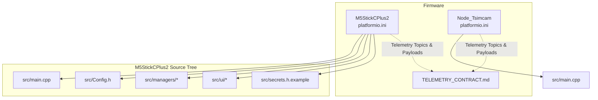
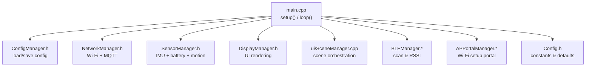
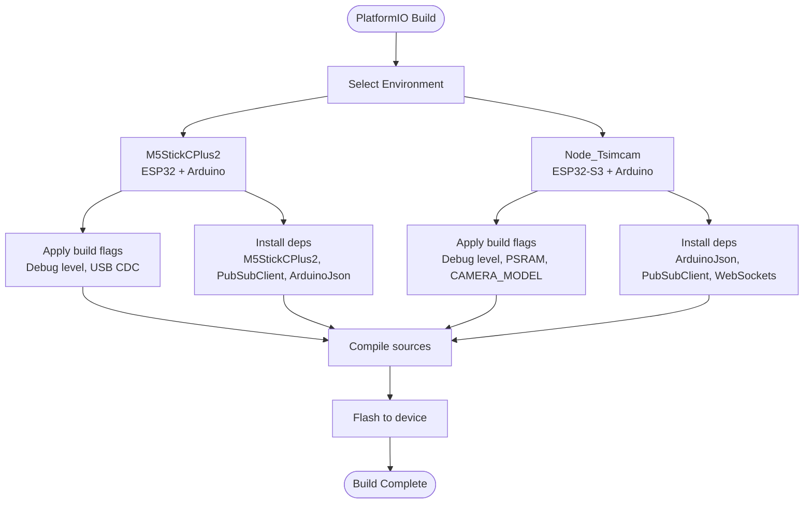
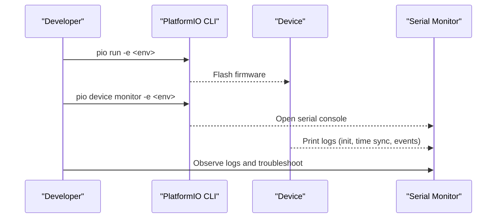
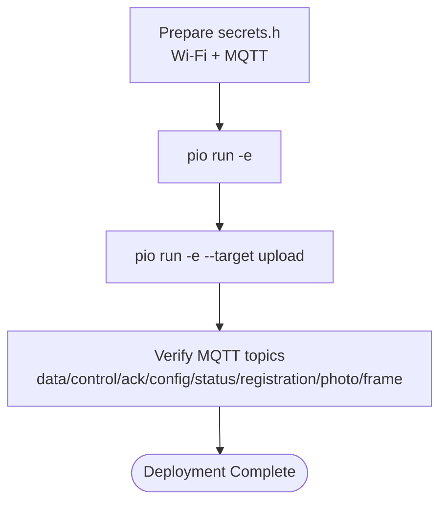
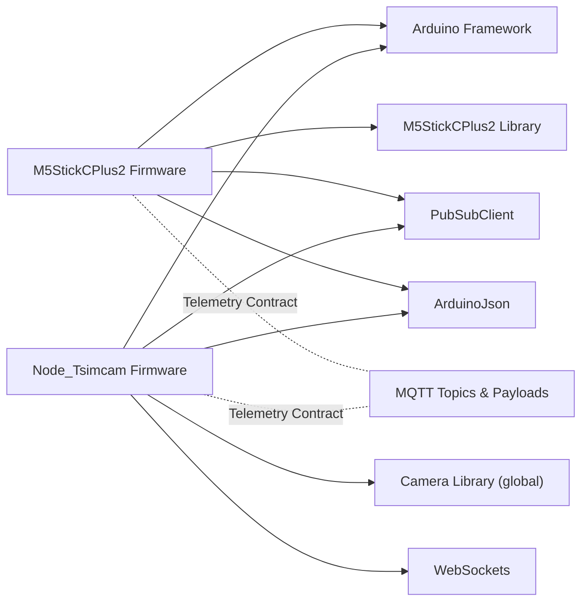

# Development & Build Workflow

<cite>
**Referenced Files in This Document**
- [platformio.ini (M5StickCPlus2)](file://firmware/M5StickCPlus2/platformio.ini)
- [platformio.ini (Node_Tsimcam)](file://firmware/Node_Tsimcam/platformio.ini)
- [TELEMETRY_CONTRACT.md](file://firmware/TELEMETRY_CONTRACT.md)
- [main.cpp (M5StickCPlus2)](file://firmware/M5StickCPlus2/src/main.cpp)
- [Config.h (M5StickCPlus2)](file://firmware/M5StickCPlus2/src/Config.h)
- [ConfigManager.h (M5StickCPlus2)](file://firmware/M5StickCPlus2/src/managers/ConfigManager.h)
- [NetworkManager.h (M5StickCPlus2)](file://firmware/M5StickCPlus2/src/managers/NetworkManager.h)
- [SensorManager.h (M5StickCPlus2)](file://firmware/M5StickCPlus2/src/managers/SensorManager.h)
- [DisplayManager.h (M5StickCPlus2)](file://firmware/M5StickCPlus2/src/ui/DisplayManager.h)
- [secrets.h.example (M5StickCPlus2)](file://firmware/M5StickCPlus2/src/secrets.h.example)
</cite>

## Table of Contents
1. [Introduction](#introduction)
2. [Project Structure](#project-structure)
3. [Core Components](#core-components)
4. [Architecture Overview](#architecture-overview)
5. [Detailed Component Analysis](#detailed-component-analysis)
6. [Dependency Analysis](#dependency-analysis)
7. [Performance Considerations](#performance-considerations)
8. [Troubleshooting Guide](#troubleshooting-guide)
9. [Conclusion](#conclusion)
10. [Appendices](#appendices)

## Introduction
This document provides a comprehensive development workflow for firmware development and deployment across two device targets: M5StickCPlus2 and Node_Tsimcam. It covers PlatformIO setup, project configuration, build system, compilation and dependency management, library integration, debugging workflows, deployment procedures, version control and release practices, continuous integration and quality assurance, security considerations, and practical development tasks. The content is grounded in the repository’s firmware configuration and source files.

## Project Structure
The firmware area is organized by device target with dedicated PlatformIO environments and per-target source trees. Each environment defines platform, board, framework, upload and monitor speeds, partitions, build flags, and library dependencies. The telemetry contract defines MQTT topics and payloads for both devices.

**Diagram sources**
- [platformio.ini (M5StickCPlus2)](file://firmware/M5StickCPlus2/platformio.ini)
- [platformio.ini (Node_Tsimcam)](file://firmware/Node_Tsimcam/platformio.ini)
- [TELEMETRY_CONTRACT.md](file://firmware/TELEMETRY_CONTRACT.md)
- [main.cpp (M5StickCPlus2)](file://firmware/M5StickCPlus2/src/main.cpp)

**Section sources**
- [platformio.ini (M5StickCPlus2)](file://firmware/M5StickCPlus2/platformio.ini)
- [platformio.ini (Node_Tsimcam)](file://firmware/Node_Tsimcam/platformio.ini)
- [TELEMETRY_CONTRACT.md](file://firmware/TELEMETRY_CONTRACT.md)

## Core Components
- PlatformIO Environments
  - M5StickCPlus2: Arduino framework on ESP32, USB CDC serial monitor, custom partitions, debug level, and explicit library dependencies.
  - Node_Tsimcam: Arduino framework on ESP32-S3, higher upload speed, PSRAM, camera model flag, and library dependencies.
- Telemetry Contract
  - Defines MQTT topics and payloads for data, control, ack, and configuration channels for both devices.
- Application Entry Point
  - Initializes subsystems, manages timing, power-saving modes, and periodic telemetry publishing.
- Configuration and Runtime
  - Centralized configuration via Preferences, Wi-Fi and MQTT connectivity, sensor fusion and motion computation, and UI rendering.

**Section sources**
- [platformio.ini (M5StickCPlus2)](file://firmware/M5StickCPlus2/platformio.ini)
- [platformio.ini (Node_Tsimcam)](file://firmware/Node_Tsimcam/platformio.ini)
- [TELEMETRY_CONTRACT.md](file://firmware/TELEMETRY_CONTRACT.md)
- [main.cpp (M5StickCPlus2)](file://firmware/M5StickCPlus2/src/main.cpp)
- [Config.h (M5StickCPlus2)](file://firmware/M5StickCPlus2/src/Config.h)
- [ConfigManager.h (M5StickCPlus2)](file://firmware/M5StickCPlus2/src/managers/ConfigManager.h)
- [NetworkManager.h (M5StickCPlus2)](file://firmware/M5StickCPlus2/src/managers/NetworkManager.h)
- [SensorManager.h (M5StickCPlus2)](file://firmware/M5StickCPlus2/src/managers/SensorManager.h)
- [DisplayManager.h (M5StickCPlus2)](file://firmware/M5StickCPlus2/src/ui/DisplayManager.h)

## Architecture Overview
The firmware architecture centers on a modular manager pattern with a main loop orchestrating sensors, network, BLE scanning, UI, and telemetry publishing. Configuration is persisted and loaded at boot. The telemetry contract governs MQTT messaging semantics.

**Diagram sources**
- [main.cpp (M5StickCPlus2)](file://firmware/M5StickCPlus2/src/main.cpp)
- [Config.h (M5StickCPlus2)](file://firmware/M5StickCPlus2/src/Config.h)
- [ConfigManager.h (M5StickCPlus2)](file://firmware/M5StickCPlus2/src/managers/ConfigManager.h)
- [NetworkManager.h (M5StickCPlus2)](file://firmware/M5StickCPlus2/src/managers/NetworkManager.h)
- [SensorManager.h (M5StickCPlus2)](file://firmware/M5StickCPlus2/src/managers/SensorManager.h)
- [DisplayManager.h (M5StickCPlus2)](file://firmware/M5StickCPlus2/src/ui/DisplayManager.h)

## Detailed Component Analysis

### PlatformIO Environment Setup and Build System
- M5StickCPlus2
  - Platform: Espressif ESP32
  - Board: M5StickC variant
  - Framework: Arduino
  - Monitor speed: 115200
  - Partitions: huge_app.csv
  - Build flags: debug level, USB CDC mode
  - Libraries: M5StickCPlus2, PubSubClient, ArduinoJson
  - Ignored libraries: DFRobot_GP8XXX
- Node_Tsimcam
  - Platform: Espressif ESP32 (older version in this env)
  - Board: ESP32-S3 Box
  - Framework: Arduino
  - Upload speed: 921600
  - Monitor speed: 115200
  - Partitions: default_16MB.csv
  - Build flags: debug level, PSRAM, camera model
  - Libraries: ArduinoJson, PubSubClient, WebSockets
  - Global lib dir: external camera library folder

**Diagram sources**
- [platformio.ini (M5StickCPlus2)](file://firmware/M5StickCPlus2/platformio.ini)
- [platformio.ini (Node_Tsimcam)](file://firmware/Node_Tsimcam/platformio.ini)

**Section sources**
- [platformio.ini (M5StickCPlus2)](file://firmware/M5StickCPlus2/platformio.ini)
- [platformio.ini (Node_Tsimcam)](file://firmware/Node_Tsimcam/platformio.ini)

### Compilation Process, Dependency Management, and Library Integration
- Dependencies are declared per environment and resolved by PlatformIO.
- ArduinoJson and PubSubClient are used for telemetry serialization and MQTT messaging.
- M5StickCPlus2 integrates M5 hardware libraries; Node_Tsimcam integrates a camera library via a global lib directory.
- Build flags enable debug logging and hardware-specific features (e.g., PSRAM, camera model).

**Section sources**
- [platformio.ini (M5StickCPlus2)](file://firmware/M5StickCPlus2/platformio.ini)
- [platformio.ini (Node_Tsimcam)](file://firmware/Node_Tsimcam/platformio.ini)

### Debugging Workflow
- Serial Monitoring
  - M5StickCPlus2: monitor speed 115200; logs include initialization steps, time sync, recording events, and telemetry publishing intervals.
  - Node_Tsimcam: monitor speed 115200; higher upload speed supports faster flashing and logging.
- Log Analysis
  - Look for initialization markers, NTP sync confirmation, recording start/stop, and MQTT publish attempts.
- Real-Time Debugging Techniques
  - Adjust CORE_DEBUG_LEVEL via build flags to increase verbosity.
  - Use minimal delays and targeted prints during development; revert to production-friendly intervals before release.

**Diagram sources**
- [platformio.ini (M5StickCPlus2)](file://firmware/M5StickCPlus2/platformio.ini)
- [platformio.ini (Node_Tsimcam)](file://firmware/Node_Tsimcam/platformio.ini)
- [main.cpp (M5StickCPlus2)](file://firmware/M5StickCPlus2/src/main.cpp)

**Section sources**
- [platformio.ini (M5StickCPlus2)](file://firmware/M5StickCPlus2/platformio.ini)
- [platformio.ini (Node_Tsimcam)](file://firmware/Node_Tsimcam/platformio.ini)
- [main.cpp (M5StickCPlus2)](file://firmware/M5StickCPlus2/src/main.cpp)

### Deployment Procedures
- M5StickCPlus2
  - Ensure secrets.h is configured with Wi-Fi and MQTT credentials.
  - Build and upload using the M5StickCPlus2 environment.
  - Verify telemetry on the data topic and control/ack/config subscriptions as defined in the telemetry contract.
- Node_Tsimcam
  - Configure camera model and PSRAM flags.
  - Build and upload using the Node_Tsimcam environment.
  - Validate camera registration, status, and photo transport topics per the telemetry contract.

**Diagram sources**
- [secrets.h.example (M5StickCPlus2)](file://firmware/M5StickCPlus2/src/secrets.h.example)
- [TELEMETRY_CONTRACT.md](file://firmware/TELEMETRY_CONTRACT.md)

**Section sources**
- [secrets.h.example (M5StickCPlus2)](file://firmware/M5StickCPlus2/src/secrets.h.example)
- [TELEMETRY_CONTRACT.md](file://firmware/TELEMETRY_CONTRACT.md)

### Version Control Practices, Branching Strategies, and Release Management
- Use semantic versioning for firmware (e.g., MAJOR.MINOR.PATCH).
- Maintain separate branches for device families (e.g., m5stick, camera-node).
- Tag releases with annotated tags and include changelog entries.
- Store firmware versions in configuration headers for runtime identification.

**Section sources**
- [Config.h (M5StickCPlus2)](file://firmware/M5StickCPlus2/src/Config.h)

### Continuous Integration, Automated Testing, and Quality Assurance
- CI should compile both environments and run lint checks.
- Automated tests can validate MQTT topic payloads against the telemetry contract.
- Snapshot tests for camera firmware can compare photo transport behavior.

[No sources needed since this section provides general guidance]

### Development Environment Configuration, IDE Setup, and Debugging Tools
- PlatformIO IDE or VS Code with PlatformIO extension.
- Serial monitor configured per environment’s monitor speed.
- Use breakpoints and print statements judiciously; rely on logs for production builds.

**Section sources**
- [platformio.ini (M5StickCPlus2)](file://firmware/M5StickCPlus2/platformio.ini)
- [platformio.ini (Node_Tsimcam)](file://firmware/Node_Tsimcam/platformio.ini)

### Firmware Security Considerations, Signing, and Secure Deployment
- Store secrets securely; do not commit secrets.h.
- Use TLS-enabled MQTT brokers for production.
- Consider firmware signing and secure boot if supported by the platform.
- Limit exposure of debug logs and disable verbose logging in production.

**Section sources**
- [secrets.h.example (M5StickCPlus2)](file://firmware/M5StickCPlus2/src/secrets.h.example)
- [TELEMETRY_CONTRACT.md](file://firmware/TELEMETRY_CONTRACT.md)

### Practical Examples
- Build and flash M5StickCPlus2: run the M5StickCPlus2 environment; verify serial logs and MQTT data.
- Capture and analyze telemetry: subscribe to the data topic and inspect payload fields.
- Adjust publish frequency: tune intervals in configuration headers for power/performance trade-offs.

**Section sources**
- [main.cpp (M5StickCPlus2)](file://firmware/M5StickCPlus2/src/main.cpp)
- [Config.h (M5StickCPlus2)](file://firmware/M5StickCPlus2/src/Config.h)
- [TELEMETRY_CONTRACT.md](file://firmware/TELEMETRY_CONTRACT.md)

## Dependency Analysis
The M5StickCPlus2 firmware depends on Arduino, M5 hardware libraries, PubSubClient, and ArduinoJson. The Node_Tsimcam environment depends on ArduinoJson, PubSubClient, WebSockets, and an external camera library. Both share the telemetry contract for MQTT messaging.

**Diagram sources**
- [platformio.ini (M5StickCPlus2)](file://firmware/M5StickCPlus2/platformio.ini)
- [platformio.ini (Node_Tsimcam)](file://firmware/Node_Tsimcam/platformio.ini)
- [TELEMETRY_CONTRACT.md](file://firmware/TELEMETRY_CONTRACT.md)

**Section sources**
- [platformio.ini (M5StickCPlus2)](file://firmware/M5StickCPlus2/platformio.ini)
- [platformio.ini (Node_Tsimcam)](file://firmware/Node_Tsimcam/platformio.ini)
- [TELEMETRY_CONTRACT.md](file://firmware/TELEMETRY_CONTRACT.md)

## Performance Considerations
- Power-aware design: LCD brightness and sleep modes reduce power consumption.
- Adaptive rates: lower telemetry and sensor sampling when idle or LCD off.
- Efficient serialization: StaticJsonDocument and fixed-size buffers minimize heap usage.
- Motion detection: auto-stop recording when velocity remains below threshold for a period.

**Section sources**
- [main.cpp (M5StickCPlus2)](file://firmware/M5StickCPlus2/src/main.cpp)
- [Config.h (M5StickCPlus2)](file://firmware/M5StickCPlus2/src/Config.h)
- [SensorManager.h (M5StickCPlus2)](file://firmware/M5StickCPlus2/src/managers/SensorManager.h)

## Troubleshooting Guide
- Build Issues
  - Missing secrets.h: copy the example file and fill in credentials.
  - Partition mismatch: ensure the selected partition scheme matches the firmware size.
- Connectivity Problems
  - Wi-Fi not connecting: verify SSID/password and retry logic.
  - MQTT drops: check broker endpoint, credentials, and reconnect attempts.
- Telemetry Validation
  - Confirm device_id, timestamps, and payload fields align with the telemetry contract.
- Camera Node Issues
  - Photo transport failures: verify camera model flag and PSRAM availability.

**Section sources**
- [secrets.h.example (M5StickCPlus2)](file://firmware/M5StickCPlus2/src/secrets.h.example)
- [NetworkManager.h (M5StickCPlus2)](file://firmware/M5StickCPlus2/src/managers/NetworkManager.h)
- [TELEMETRY_CONTRACT.md](file://firmware/TELEMETRY_CONTRACT.md)

## Conclusion
This workflow document outlines a structured approach to developing, building, debugging, and deploying firmware for M5StickCPlus2 and Node_Tsimcam devices. By leveraging PlatformIO environments, adhering to the telemetry contract, and applying sound configuration and security practices, teams can maintain reliable, efficient, and secure firmware releases.

## Appendices

### Appendix A: Telemetry Topic Reference
- M5StickCPlus2
  - Publish: data topic
  - Subscribe: control, ack, config (per-device and all), room
- Node_Tsimcam
  - Subscribe: control, config (per-device and all)
  - Publish: registration, status, ack
  - Transport: photo (chunked JSON) and frame (raw JPEG)

**Section sources**
- [TELEMETRY_CONTRACT.md](file://firmware/TELEMETRY_CONTRACT.md)