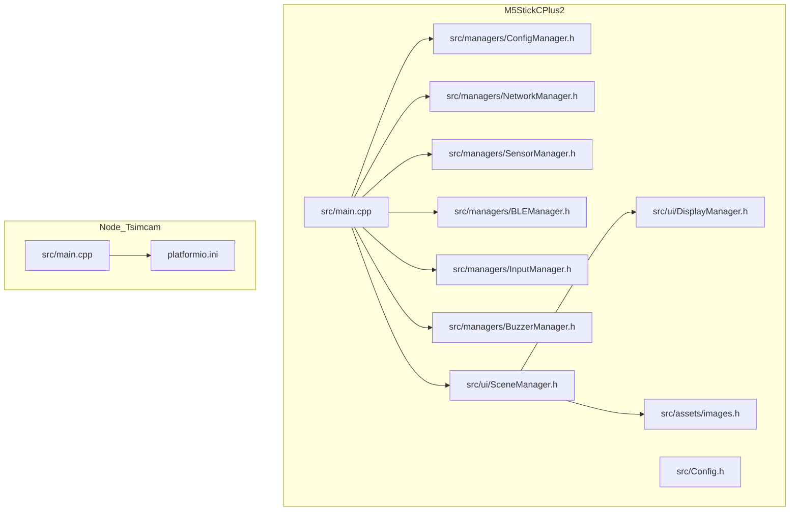
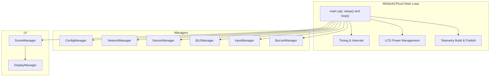
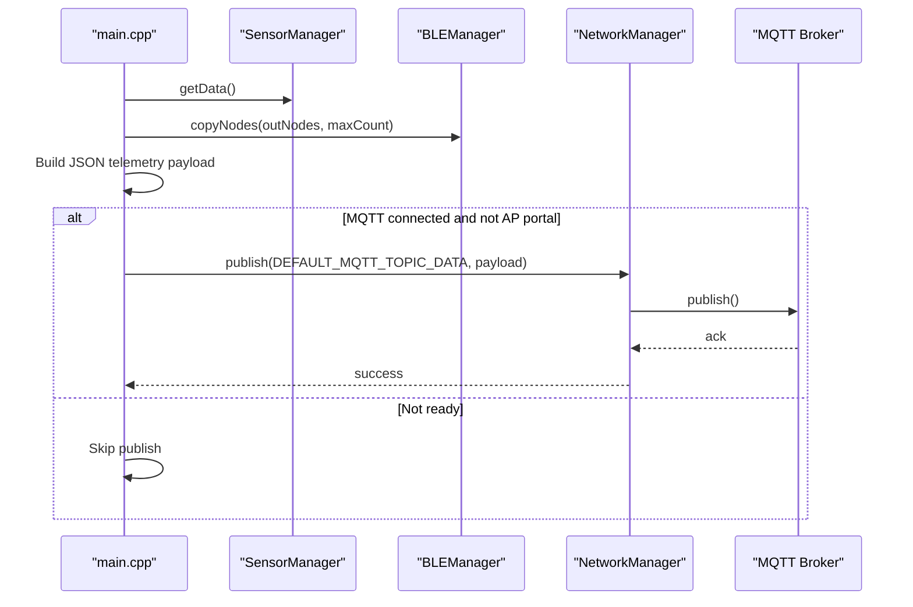
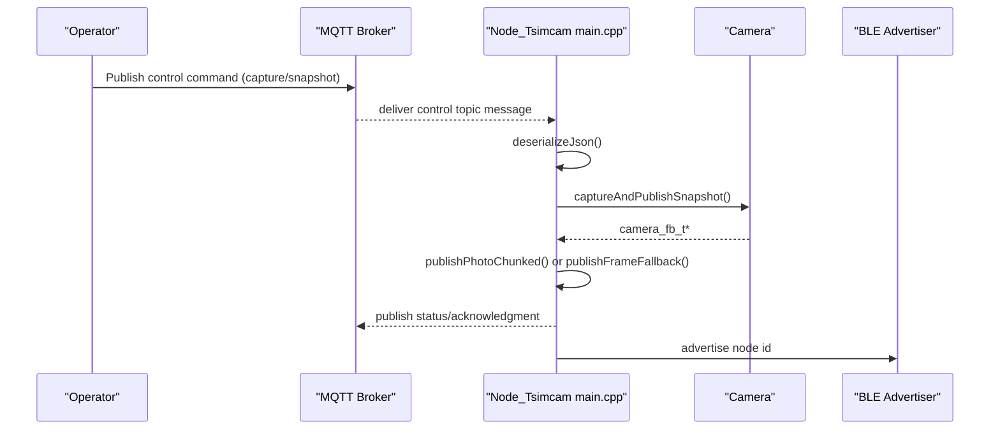
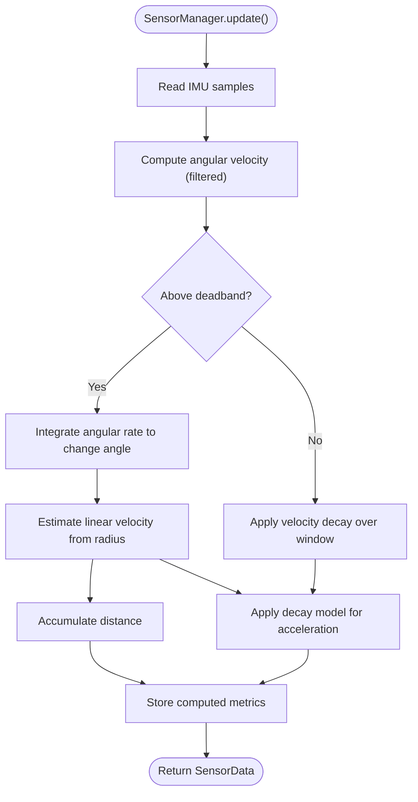
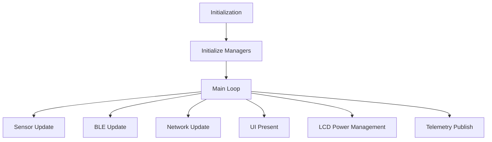
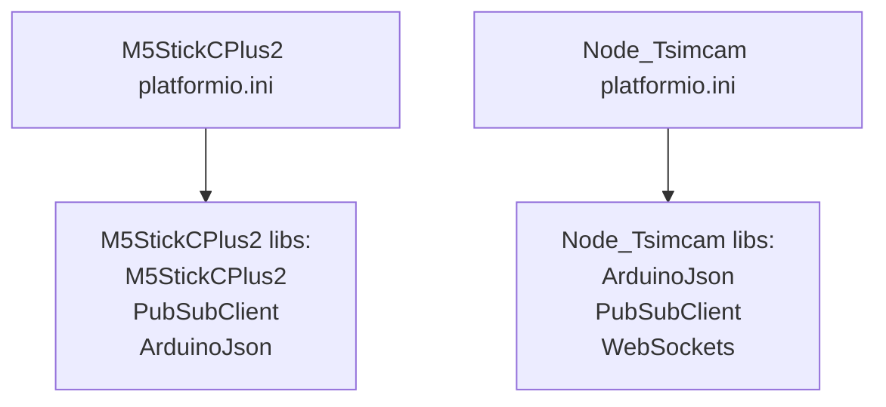

# Firmware & Embedded Systems

<cite>
**Referenced Files in This Document**
- [platformio.ini](file://firmware/M5StickCPlus2/platformio.ini)
- [main.cpp](file://firmware/M5StickCPlus2/src/main.cpp)
- [Config.h](file://firmware/M5StickCPlus2/src/Config.h)
- [TELEMETRY_CONTRACT.md](file://firmware/TELEMETRY_CONTRACT.md)
- [ConfigManager.h](file://firmware/M5StickCPlus2/src/managers/ConfigManager.h)
- [NetworkManager.h](file://firmware/M5StickCPlus2/src/managers/NetworkManager.h)
- [SensorManager.h](file://firmware/M5StickCPlus2/src/managers/SensorManager.h)
- [BLEManager.h](file://firmware/M5StickCPlus2/src/managers/BLEManager.h)
- [InputManager.h](file://firmware/M5StickCPlus2/src/managers/InputManager.h)
- [BuzzerManager.h](file://firmware/M5StickCPlus2/src/managers/BuzzerManager.h)
- [DisplayManager.h](file://firmware/M5StickCPlus2/src/ui/DisplayManager.h)
- [SceneManager.h](file://firmware/M5StickCPlus2/src/ui/SceneManager.h)
- [images.h](file://firmware/M5StickCPlus2/src/assets/images.h)
- [platformio.ini](file://firmware/Node_Tsimcam/platformio.ini)
- [main.cpp](file://firmware/Node_Tsimcam/src/main.cpp)
</cite>

## Table of Contents
1. [Introduction](#introduction)
2. [Project Structure](#project-structure)
3. [Core Components](#core-components)
4. [Architecture Overview](#architecture-overview)
5. [Detailed Component Analysis](#detailed-component-analysis)
6. [Dependency Analysis](#dependency-analysis)
7. [Performance Considerations](#performance-considerations)
8. [Troubleshooting Guide](#troubleshooting-guide)
9. [Conclusion](#conclusion)
10. [Appendices](#appendices)

## Introduction
This document provides comprehensive firmware and embedded systems documentation for the WheelSense Platform. It covers the Arduino-based firmware for two devices:
- M5StickCPlus2 wheelchair gateway: collects IMU and battery telemetry, performs BLE scanning, manages WiFi and MQTT connectivity, and renders a local UI.
- Node_Tsimcam camera/beacon device: acts as a BLE beacon, captures images via the ESP32-S3 camera module, and publishes telemetry and snapshots over MQTT with optional streaming.

It explains device initialization, sensor data computation, MQTT communication, manager classes, UI components, build configuration with PlatformIO, and practical guidance for power management, battery life optimization, device registration, OTA-like configuration via WiFi portal, and troubleshooting.

## Project Structure
The firmware is organized into two primary projects:
- M5StickCPlus2: gateway device with managers for configuration, input, buzzer, network, sensors, BLE, and UI scenes.
- Node_Tsimcam: camera/beacon device with camera initialization, BLE advertising, WiFi configuration portal, MQTT control, and snapshot publishing.

**Diagram sources**
- [main.cpp:123-151](file://firmware/M5StickCPlus2/src/main.cpp#L123-L151)
- [Config.h:1-78](file://firmware/M5StickCPlus2/src/Config.h#L1-L78)
- [ConfigManager.h:1-36](file://firmware/M5StickCPlus2/src/managers/ConfigManager.h#L1-L36)
- [NetworkManager.h:1-63](file://firmware/M5StickCPlus2/src/managers/NetworkManager.h#L1-L63)
- [SensorManager.h:1-76](file://firmware/M5StickCPlus2/src/managers/SensorManager.h#L1-L76)
- [BLEManager.h:1-55](file://firmware/M5StickCPlus2/src/managers/BLEManager.h#L1-L55)
- [InputManager.h:1-37](file://firmware/M5StickCPlus2/src/managers/InputManager.h#L1-L37)
- [BuzzerManager.h:1-30](file://firmware/M5StickCPlus2/src/managers/BuzzerManager.h#L1-L30)
- [SceneManager.h:1-127](file://firmware/M5StickCPlus2/src/ui/SceneManager.h#L1-L127)
- [DisplayManager.h:1-39](file://firmware/M5StickCPlus2/src/ui/DisplayManager.h#L1-L39)
- [images.h:1-20](file://firmware/M5StickCPlus2/src/assets/images.h#L1-L20)
- [main.cpp:1-120](file://firmware/Node_Tsimcam/src/main.cpp#L1-L120)
- [platformio.ini:1-27](file://firmware/Node_Tsimcam/platformio.ini#L1-L27)

**Section sources**
- [platformio.ini:1-22](file://firmware/M5StickCPlus2/platformio.ini#L1-L22)
- [main.cpp:123-151](file://firmware/M5StickCPlus2/src/main.cpp#L123-L151)
- [Config.h:1-78](file://firmware/M5StickCPlus2/src/Config.h#L1-L78)
- [main.cpp:1-120](file://firmware/Node_Tsimcam/src/main.cpp#L1-L120)
- [platformio.ini:1-27](file://firmware/Node_Tsimcam/platformio.ini#L1-L27)

## Core Components
This section outlines the key firmware components and their responsibilities.

- M5StickCPlus2
  - Initialization and timing: device boots, initializes managers, sets up WiFi power saving, and runs a main loop with adaptive intervals.
  - Managers:
    - ConfigManager: loads/stores persistent configuration (device name, WiFi credentials, MQTT broker/port/user/pass, wheel radius, display mode).
    - NetworkManager: WiFi connection, MQTT client lifecycle, topic subscriptions, and runtime status.
    - SensorManager: reads IMU and computes motion metrics (velocity, acceleration, distance), filters battery readings, and detects charging state.
    - BLEManager: BLE scanning with a dedicated task, maintains a list of nearby nodes, and exposes copies for telemetry.
    - InputManager: debounced button detection for A/B/C buttons.
    - BuzzerManager: audible feedback for UI actions and recording events.
    - SceneManager: orchestrates UI scenes (boot, dashboard, menus, keyboard, AP portal, recording).
    - DisplayManager: drawing primitives, gradients, and rendering helpers for the M5 display.
  - Telemetry: publishes structured JSON to MQTT with device metadata, IMU, computed motion, RSSI from BLE nodes, and battery metrics.

- Node_Tsimcam
  - Initialization: camera configuration, BLE beacon advertising, WiFi station mode, and optional AP configuration portal.
  - Control and configuration: subscribes to control topics for snapshot capture, stream control, resolution changes, and reconfiguration.
  - Publishing: registration, status, and snapshot transport (chunked JSON or raw JPEG), with acknowledgments and error reporting.

**Section sources**
- [main.cpp:123-151](file://firmware/M5StickCPlus2/src/main.cpp#L123-L151)
- [ConfigManager.h:1-36](file://firmware/M5StickCPlus2/src/managers/ConfigManager.h#L1-L36)
- [NetworkManager.h:1-63](file://firmware/M5StickCPlus2/src/managers/NetworkManager.h#L1-L63)
- [SensorManager.h:1-76](file://firmware/M5StickCPlus2/src/managers/SensorManager.h#L1-L76)
- [BLEManager.h:1-55](file://firmware/M5StickCPlus2/src/managers/BLEManager.h#L1-L55)
- [InputManager.h:1-37](file://firmware/M5StickCPlus2/src/managers/InputManager.h#L1-L37)
- [BuzzerManager.h:1-30](file://firmware/M5StickCPlus2/src/managers/BuzzerManager.h#L1-L30)
- [SceneManager.h:1-127](file://firmware/M5StickCPlus2/src/ui/SceneManager.h#L1-L127)
- [DisplayManager.h:1-39](file://firmware/M5StickCPlus2/src/ui/DisplayManager.h#L1-L39)
- [TELEMETRY_CONTRACT.md:1-68](file://firmware/TELEMETRY_CONTRACT.md#L1-L68)
- [main.cpp:105-140](file://firmware/Node_Tsimcam/src/main.cpp#L105-L140)
- [main.cpp:570-700](file://firmware/Node_Tsimcam/src/main.cpp#L570-L700)

## Architecture Overview
The M5StickCPlus2 device follows a modular manager pattern with a central main loop coordinating managers and UI. The Node_Tsimcam device integrates camera, BLE, WiFi, and MQTT in a single application with a configuration portal.

**Diagram sources**
- [main.cpp:123-341](file://firmware/M5StickCPlus2/src/main.cpp#L123-L341)
- [ConfigManager.h:1-36](file://firmware/M5StickCPlus2/src/managers/ConfigManager.h#L1-L36)
- [NetworkManager.h:1-63](file://firmware/M5StickCPlus2/src/managers/NetworkManager.h#L1-L63)
- [SensorManager.h:1-76](file://firmware/M5StickCPlus2/src/managers/SensorManager.h#L1-L76)
- [BLEManager.h:1-55](file://firmware/M5StickCPlus2/src/managers/BLEManager.h#L1-L55)
- [InputManager.h:1-37](file://firmware/M5StickCPlus2/src/managers/InputManager.h#L1-L37)
- [BuzzerManager.h:1-30](file://firmware/M5StickCPlus2/src/managers/BuzzerManager.h#L1-L30)
- [SceneManager.h:1-127](file://firmware/M5StickCPlus2/src/ui/SceneManager.h#L1-L127)
- [DisplayManager.h:1-39](file://firmware/M5StickCPlus2/src/ui/DisplayManager.h#L1-L39)

## Detailed Component Analysis

### M5StickCPlus2 Manager Classes
The manager classes encapsulate device capabilities and state transitions.

```mermaid
classDiagram
class ConfigManager {
+begin()
+loadConfig()
+saveConfig()
+getConfig() AppConfig&
+factoryReset()
-prefs : Preferences
-config : AppConfig
}
class NetworkManager {
+begin()
+update()
+isWiFiConnected() bool
+getIP() String
+scanNetworks() int
+getSSID(i) String
+getRSSI(i) int
+connect(ssid, pass) void
+disconnect() void
+isMQTTConnected() bool
+publish(topic, payload) void
+connectMQTT() bool
+reconfigureFromConfig(reconnectWifi) void
+getBrokerEndpoint() String
+getLatestRoomName() String
+getLatestRoomConfidence() float
+hasLatestRoomAssignment() bool
+getWiFiReconnectAttempts() uint32_t
+getMQTTReconnectAttempts() uint32_t
-connectWiFi() void
-onMQTTMessage(topic, payload, length) static void
-wifiClient : WiFiClient
-mqttClient : PubSubClient
-lastWiFiAttempt : unsigned long
-lastMQTTAttempt : unsigned long
-wifiRetryDelayMs : uint32_t
-mqttRetryDelayMs : uint32_t
-wifiReconnectAttempts : uint32_t
-mqttReconnectAttempts : uint32_t
-droppedPublishCount : uint32_t
-lastWiFiConnected : bool
-latestRoomName : String
-latestRoomConfidence : float
-hasLatestRoom : bool
}
class SensorManager {
+begin()
+update()
+getData() SensorData&
+recalibrate()
-data : SensorData
-updateIMU() void
-updateBattery() void
-mapBatteryPercentLiIon(mv) float
-updateChargingState(rawState, nowMs) bool
-lastImuReadMs : unsigned long
-winStartMs : unsigned long
-winDistanceM : float
-prevVelocityMs : float
-filteredGyroZ : float
-lastMotionMs : unsigned long
-gyroZOffset : float
-batteryFilterInit : bool
-filteredBatVoltageMv : float
-filteredBatPercent : float
-stableBatPercent : int
-lastBatterySampleMs : unsigned long
-chargeDebounceInit : bool
-chargingStableState : bool
-chargingCandidateState : bool
-chargingCandidateCount : uint8_t
-chargingLastSwitchMs : unsigned long
}
class BLEManager {
+begin()
+update()
+getNodes() BLENode*
+getNodeCount() int
+copyNodes(outNodes, maxCount) int
+lock()
+unlock()
-pBLEScan : BLEScan*
-nodes : BLENode[MAX_BLE_NODES]
-nodeCount : int
-mutex : SemaphoreHandle_t
-scanTaskHandle : TaskHandle_t
-scanCb : ScanCallback
}
class InputManager {
+begin()
+update()
+wasPressed(btn) bool
+peekPressed(btn) bool
+wasLongPressed(btn) bool
+isPressed(btn) bool
-pressed : volatile bool[3]
-longPressed : volatile bool[3]
-lastPressMs : unsigned long[3]
-longPressLatched : bool[3]
}
class BuzzerManager {
+begin()
+beep(freq, durationMs)
+beepButton()
+beepSuccess()
+beepError()
+beepStartRecord()
+beepStopRecord()
}
class SceneManager {
+begin()
+update()
+switchScene(scene) void
+getCurrentScene() SceneID
+isWiFiScanScene() bool
+isAPPortalActive() bool
-currentScene : SceneID
-lastScene : SceneID
-menuIndex : int
-dashboardPage : int
-wifiScanIndex : int
-wifiScanCount : int
-isScanning : bool
-scanFailed : bool
-bootStartMs : unsigned long
-deviceInfoIndex : int
-confirmContext : ConfirmContext
-needsRedraw : bool
-lastDrawMs : unsigned long
}
class DisplayManager {
+begin()
+present(force) void
+clear() void
+drawHeader(title) void
+drawFooter(left, center, right) void
+drawMenu(title, items, itemCount, selectedIndex, showGuideFooter) void
+drawMessage(title, msg, color) void
+drawKeyboard(title, buffer, maxLength) void
+getGfx() lgfx : : LovyanGFX&
+isSpriteEnabled() bool
-canvas : M5Canvas
-spriteReady : bool
-frameDirty : bool
-lastPresentMs : unsigned long
-mix565(c1, c2, t) uint16_t
-drawVerticalGradient(topColor, bottomColor) void
}
ConfigManager --> AppConfig
NetworkManager --> AppConfig
SensorManager --> AppConfig
BLEManager --> AppConfig
SceneManager --> AppConfig
DisplayManager --> AppConfig
```

**Diagram sources**
- [ConfigManager.h:1-36](file://firmware/M5StickCPlus2/src/managers/ConfigManager.h#L1-L36)
- [NetworkManager.h:1-63](file://firmware/M5StickCPlus2/src/managers/NetworkManager.h#L1-L63)
- [SensorManager.h:1-76](file://firmware/M5StickCPlus2/src/managers/SensorManager.h#L1-L76)
- [BLEManager.h:1-55](file://firmware/M5StickCPlus2/src/managers/BLEManager.h#L1-L55)
- [InputManager.h:1-37](file://firmware/M5StickCPlus2/src/managers/InputManager.h#L1-L37)
- [BuzzerManager.h:1-30](file://firmware/M5StickCPlus2/src/managers/BuzzerManager.h#L1-L30)
- [SceneManager.h:1-127](file://firmware/M5StickCPlus2/src/ui/SceneManager.h#L1-L127)
- [DisplayManager.h:1-39](file://firmware/M5StickCPlus2/src/ui/DisplayManager.h#L1-L39)

**Section sources**
- [ConfigManager.h:1-36](file://firmware/M5StickCPlus2/src/managers/ConfigManager.h#L1-L36)
- [NetworkManager.h:1-63](file://firmware/M5StickCPlus2/src/managers/NetworkManager.h#L1-L63)
- [SensorManager.h:1-76](file://firmware/M5StickCPlus2/src/managers/SensorManager.h#L1-L76)
- [BLEManager.h:1-55](file://firmware/M5StickCPlus2/src/managers/BLEManager.h#L1-L55)
- [InputManager.h:1-37](file://firmware/M5StickCPlus2/src/managers/InputManager.h#L1-L37)
- [BuzzerManager.h:1-30](file://firmware/M5StickCPlus2/src/managers/BuzzerManager.h#L1-L30)
- [SceneManager.h:1-127](file://firmware/M5StickCPlus2/src/ui/SceneManager.h#L1-L127)
- [DisplayManager.h:1-39](file://firmware/M5StickCPlus2/src/ui/DisplayManager.h#L1-L39)

### M5StickCPlus2 Telemetry Flow
The main loop builds and publishes telemetry periodically, incorporating IMU, computed motion, BLE RSSI, and battery metrics.

**Diagram sources**
- [main.cpp:265-336](file://firmware/M5StickCPlus2/src/main.cpp#L265-L336)
- [SensorManager.h:1-76](file://firmware/M5StickCPlus2/src/managers/SensorManager.h#L1-L76)
- [BLEManager.h:1-55](file://firmware/M5StickCPlus2/src/managers/BLEManager.h#L1-L55)
- [NetworkManager.h:1-63](file://firmware/M5StickCPlus2/src/managers/NetworkManager.h#L1-L63)
- [TELEMETRY_CONTRACT.md:7-23](file://firmware/TELEMETRY_CONTRACT.md#L7-L23)

**Section sources**
- [main.cpp:265-336](file://firmware/M5StickCPlus2/src/main.cpp#L265-L336)
- [TELEMETRY_CONTRACT.md:7-23](file://firmware/TELEMETRY_CONTRACT.md#L7-L23)

### Node_Tsimcam Camera and MQTT Flow
The Node_Tsimcam device handles configuration, camera capture, and snapshot publication with acknowledgments.

**Diagram sources**
- [main.cpp:570-700](file://firmware/Node_Tsimcam/src/main.cpp#L570-L700)
- [main.cpp:532-568](file://firmware/Node_Tsimcam/src/main.cpp#L532-L568)
- [main.cpp:190-210](file://firmware/Node_Tsimcam/src/main.cpp#L190-L210)

**Section sources**
- [main.cpp:570-700](file://firmware/Node_Tsimcam/src/main.cpp#L570-L700)
- [main.cpp:532-568](file://firmware/Node_Tsimcam/src/main.cpp#L532-L568)
- [main.cpp:190-210](file://firmware/Node_Tsimcam/src/main.cpp#L190-L210)

### Sensor Data Computation Flow
On-device motion estimation integrates gyroscope data to compute velocity, acceleration, and distance.

**Diagram sources**
- [SensorManager.h:39-71](file://firmware/M5StickCPlus2/src/managers/SensorManager.h#L39-L71)

**Section sources**
- [SensorManager.h:39-71](file://firmware/M5StickCPlus2/src/managers/SensorManager.h#L39-L71)

### Conceptual Overview
- Device initialization sequence ensures all subsystems are ready before entering the main loop.
- Power management keeps the display dim/off when idle and reduces WiFi polling during sleep.
- UI scenes provide interactive configuration and status views.
- Telemetry contract defines topics and payload semantics for both devices.

[No sources needed since this diagram shows conceptual workflow, not actual code structure]

## Dependency Analysis
- M5StickCPlus2 depends on Arduino framework, M5StickCPlus2 library, PubSubClient, and ArduinoJson. It also uses platform-specific build flags and partitions.
- Node_Tsimcam depends on ESP32-S3 camera libraries, BLE, WebServer, Preferences, DNS, and ArduinoJson. It uses PSRAM-aware camera configuration and a larger partition scheme.

**Diagram sources**
- [platformio.ini:15-21](file://firmware/M5StickCPlus2/platformio.ini#L15-L21)
- [platformio.ini:21-26](file://firmware/Node_Tsimcam/platformio.ini#L21-L26)

**Section sources**
- [platformio.ini:1-22](file://firmware/M5StickCPlus2/platformio.ini#L1-L22)
- [platformio.ini:1-27](file://firmware/Node_Tsimcam/platformio.ini#L1-L27)

## Performance Considerations
- Adaptive sampling rates: IMU sampling and MQTT publish intervals increase when the device is idle or LCD is off, reducing power consumption.
- WiFi power saving: enables sleep mode to lower idle current.
- BLE scanning: uses a dedicated task and controlled rest intervals to balance discovery speed and power.
- Camera memory: PSRAM-aware frame buffers and quality adjustments improve reliability on devices with PSRAM.
- UI rendering: canvas-based drawing minimizes redraw overhead and supports sprite-enabled rendering.

[No sources needed since this section provides general guidance]

## Troubleshooting Guide
Common issues and remedies:
- WiFi connection failures: verify SSID/password, ensure AP portal is not conflicting, and check retry delays and reconnect attempts exposed by the network manager.
- MQTT connectivity problems: confirm broker endpoint, credentials, and subscription topics; review reconnect counters and dropped publish counts.
- BLE scanning not discovering nodes: ensure scanning task is running, check stale node thresholds, and validate advertisement data.
- Display not responding: check LCD power management logic and button activity registration; confirm display mode settings.
- Camera capture errors: validate camera pin configuration, PSRAM availability, and frame size selection; inspect snapshot transport modes and error reporting.
- Battery readings inconsistent: review filtering logic and charging debounce thresholds.

**Section sources**
- [NetworkManager.h:37-38](file://firmware/M5StickCPlus2/src/managers/NetworkManager.h#L37-L38)
- [SensorManager.h:57-71](file://firmware/M5StickCPlus2/src/managers/SensorManager.h#L57-L71)
- [BLEManager.h:45-47](file://firmware/M5StickCPlus2/src/managers/BLEManager.h#L45-L47)
- [SceneManager.h:50-51](file://firmware/M5StickCPlus2/src/ui/SceneManager.h#L50-L51)
- [main.cpp:142-188](file://firmware/Node_Tsimcam/src/main.cpp#L142-L188)
- [main.cpp:532-568](file://firmware/Node_Tsimcam/src/main.cpp#L532-L568)

## Conclusion
The WheelSense firmware implements a robust, modular architecture for both the M5StickCPlus2 gateway and Node_Tsimcam camera/beacon. Managers encapsulate device capabilities, the main loop coordinates updates and power management, and the UI provides intuitive configuration and status views. The telemetry contract ensures interoperability with the backend. PlatformIO configurations enable reproducible builds across devices, and the design supports power-conscious operation suitable for battery-powered deployments.

[No sources needed since this section summarizes without analyzing specific files]

## Appendices

### Build Configuration and Deployment
- M5StickCPlus2
  - Platform: Espressif ESP32
  - Board: m5stick-c
  - Framework: Arduino
  - Libraries: M5StickCPlus2, PubSubClient, ArduinoJson
  - Partition scheme: huge_app.csv
  - Build flags: debug level, USB mode
  - Deployment: upload via serial with monitor speed 115200

- Node_Tsimcam
  - Platform: Espressif ESP32-S3
  - Board: esp32s3box
  - Framework: Arduino
  - Libraries: ArduinoJson, PubSubClient, WebSockets
  - Partition scheme: default_16MB.csv
  - Build flags: debug level, PSRAM, camera model define
  - Deployment: upload via serial with higher upload speed

**Section sources**
- [platformio.ini:1-22](file://firmware/M5StickCPlus2/platformio.ini#L1-L22)
- [platformio.ini:1-27](file://firmware/Node_Tsimcam/platformio.ini#L1-L27)

### Hardware Specifications and Power Management
- M5StickCPlus2
  - Display: 135x240, rotation 1
  - Buttons: A (front), B (side), C (power)
  - Power saving: LCD dim/off timeouts, WiFi sleep, adaptive intervals
  - Battery: filtered percentage/voltage with charging state debounce

- Node_Tsimcam
  - Camera: configurable frame sizes, PSRAM-aware buffering
  - BLE: advertising with node id
  - Power considerations: camera quality/frame size adjustments for power budget

**Section sources**
- [Config.h:27-76](file://firmware/M5StickCPlus2/src/Config.h#L27-L76)
- [SensorManager.h:57-71](file://firmware/M5StickCPlus2/src/managers/SensorManager.h#L57-L71)
- [main.cpp:142-188](file://firmware/Node_Tsimcam/src/main.cpp#L142-L188)

### Device Registration and Firmware Updates
- M5StickCPlus2
  - Telemetry topics and payload semantics are defined in the telemetry contract.
  - Provisioning note indicates auto-registration behavior when backend supports it.

- Node_Tsimcam
  - Registration payload includes device identity, IP, firmware, and optional BLE MAC.
  - Configuration can be pushed via MQTT config topics; optional sync-only mode avoids restart.

**Section sources**
- [TELEMETRY_CONTRACT.md:32-34](file://firmware/TELEMETRY_CONTRACT.md#L32-L34)
- [main.cpp:679-698](file://firmware/Node_Tsimcam/src/main.cpp#L679-L698)
- [main.cpp:638-652](file://firmware/Node_Tsimcam/src/main.cpp#L638-L652)

### Practical Examples and Custom Modifications
- Sensor integration
  - Extend SensorManager to incorporate additional IMU axes or external sensors.
  - Adjust deadband and LPF parameters for specific use cases.

- UI customization
  - Modify DisplayManager drawing primitives and gradients.
  - Extend SceneManager scenes to add new configuration panels.

- Camera enhancements (Node_Tsimcam)
  - Add resolution presets and dynamic quality adjustment.
  - Implement periodic snapshot scheduling with capture interval control.

[No sources needed since this section provides general guidance]