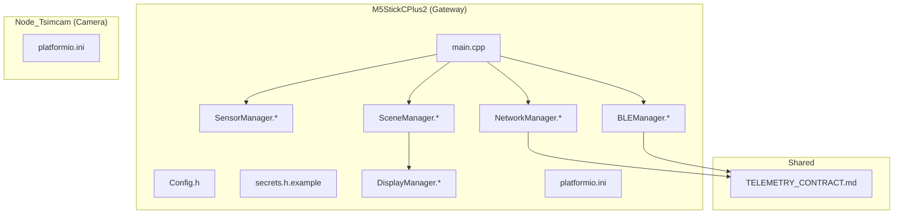
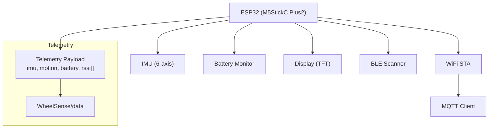
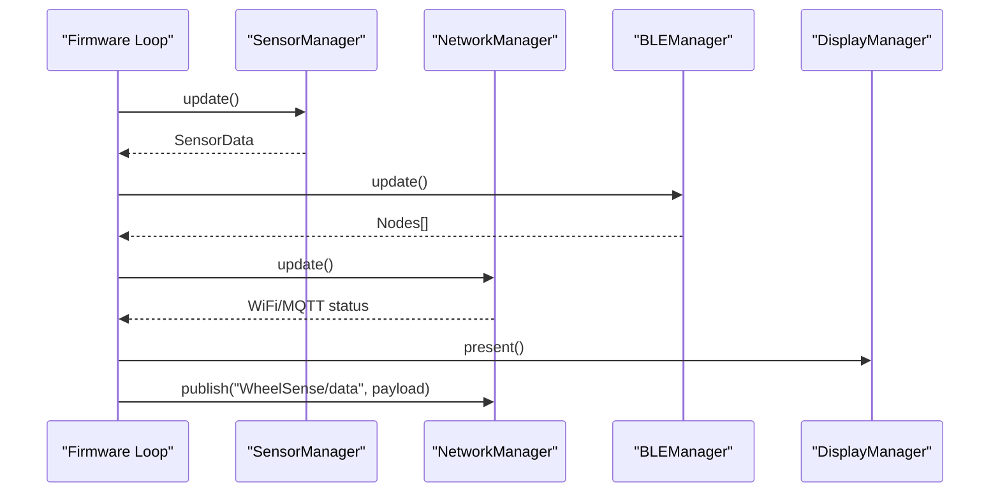
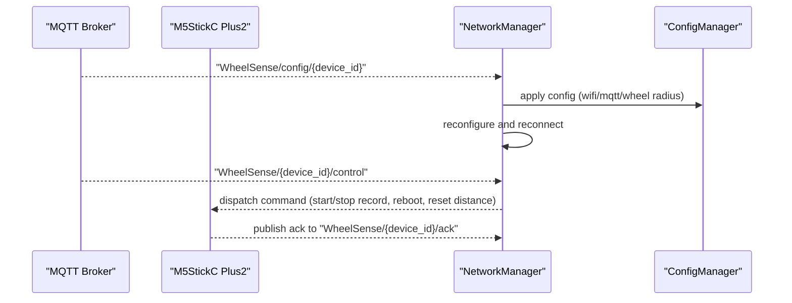
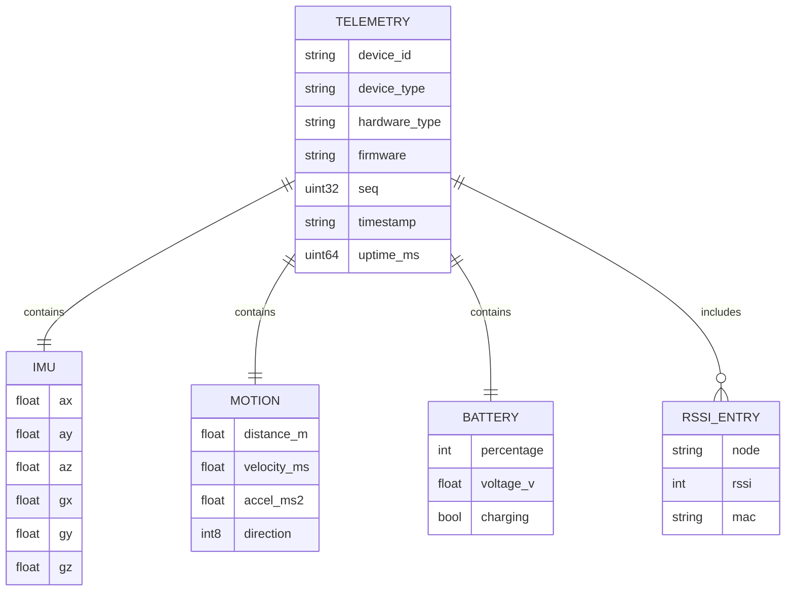
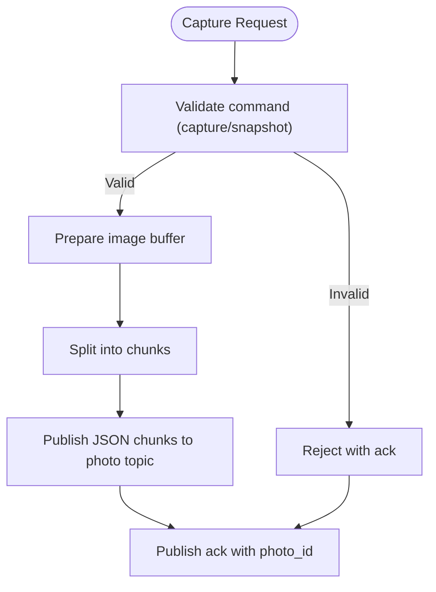
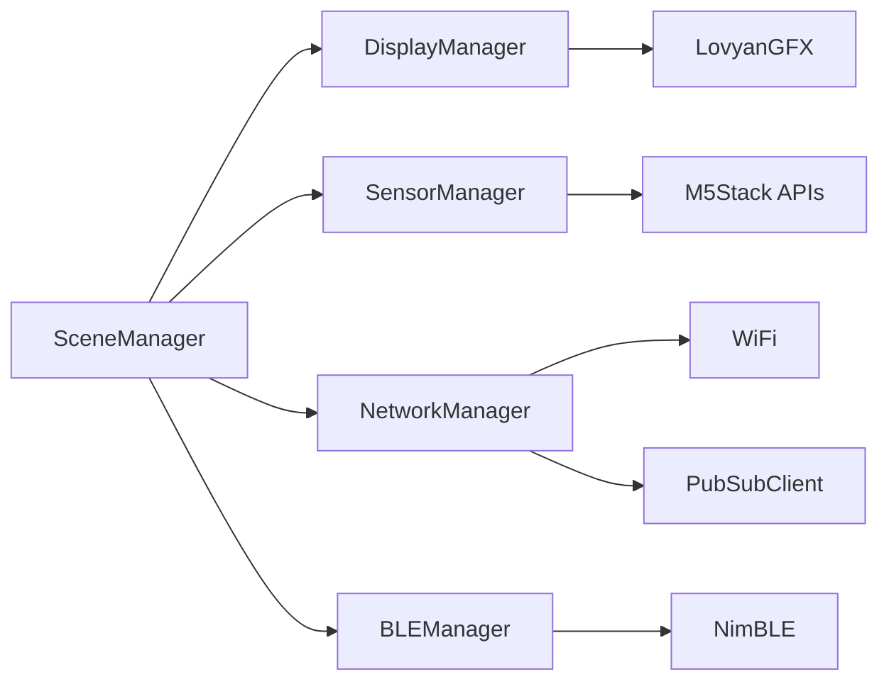

# Hardware Specifications & Components

<cite>
**Referenced Files in This Document**
- [firmware/M5StickCPlus2/src/main.cpp](file://firmware/M5StickCPlus2/src/main.cpp)
- [firmware/M5StickCPlus2/platformio.ini](file://firmware/M5StickCPlus2/platformio.ini)
- [firmware/M5StickCPlus2/src/Config.h](file://firmware/M5StickCPlus2/src/Config.h)
- [firmware/M5StickCPlus2/src/secrets.h.example](file://firmware/M5StickCPlus2/src/secrets.h.example)
- [firmware/M5StickCPlus2/src/managers/SensorManager.h](file://firmware/M5StickCPlus2/src/managers/SensorManager.h)
- [firmware/M5StickCPlus2/src/managers/SensorManager.cpp](file://firmware/M5StickCPlus2/src/managers/SensorManager.cpp)
- [firmware/M5StickCPlus2/src/managers/NetworkManager.h](file://firmware/M5StickCPlus2/src/managers/NetworkManager.h)
- [firmware/M5StickCPlus2/src/managers/NetworkManager.cpp](file://firmware/M5StickCPlus2/src/managers/NetworkManager.cpp)
- [firmware/M5StickCPlus2/src/managers/BLEManager.h](file://firmware/M5StickCPlus2/src/managers/BLEManager.h)
- [firmware/M5StickCPlus2/src/managers/BLEManager.cpp](file://firmware/M5StickCPlus2/src/managers/BLEManager.cpp)
- [firmware/M5StickCPlus2/src/ui/DisplayManager.h](file://firmware/M5StickCPlus2/src/ui/DisplayManager.h)
- [firmware/M5StickCPlus2/src/ui/DisplayManager.cpp](file://firmware/M5StickCPlus2/src/ui/DisplayManager.cpp)
- [firmware/M5StickCPlus2/src/ui/SceneManager.h](file://firmware/M5StickCPlus2/src/ui/SceneManager.h)
- [firmware/M5StickCPlus2/src/ui/SceneManager.cpp](file://firmware/M5StickCPlus2/src/ui/SceneManager.cpp)
- [firmware/Node_Tsimcam/platformio.ini](file://firmware/Node_Tsimcam/platformio.ini)
- [firmware/TELEMETRY_CONTRACT.md](file://firmware/TELEMETRY_CONTRACT.md)
</cite>

## Table of Contents
1. [Introduction](#introduction)
2. [Project Structure](#project-structure)
3. [Core Components](#core-components)
4. [Architecture Overview](#architecture-overview)
5. [Detailed Component Analysis](#detailed-component-analysis)
6. [Dependency Analysis](#dependency-analysis)
7. [Performance Considerations](#performance-considerations)
8. [Troubleshooting Guide](#troubleshooting-guide)
9. [Conclusion](#conclusion)
10. [Appendices](#appendices)

## Introduction
This document consolidates hardware specifications and component details for the WheelSense embedded devices, focusing on:
- M5StickC Plus2 gateway: ESP32-based device integrating IMU sensor fusion, battery monitoring, display, and wireless connectivity.
- Node_Tsimcam camera node: ESP32-S3-based device for photo capture and transport.
It also documents pin configurations, GPIO mappings, power characteristics, wireless capabilities, telemetry contract, and practical assembly and sourcing considerations derived from the firmware configuration and runtime behavior.

## Project Structure
The hardware-related implementation is primarily located under firmware/M5StickCPlus2 and firmware/Node_Tsimcam, with telemetry contract definitions under firmware/TELEMETRY_CONTRACT.md.

**Diagram sources**
- [firmware/M5StickCPlus2/src/main.cpp:123-151](file://firmware/M5StickCPlus2/src/main.cpp#L123-L151)
- [firmware/M5StickCPlus2/src/Config.h:23-42](file://firmware/M5StickCPlus2/src/Config.h#L23-L42)
- [firmware/M5StickCPlus2/src/managers/SensorManager.cpp:12-48](file://firmware/M5StickCPlus2/src/managers/SensorManager.cpp#L12-L48)
- [firmware/M5StickCPlus2/src/managers/NetworkManager.cpp:12-32](file://firmware/M5StickCPlus2/src/managers/NetworkManager.cpp#L12-L32)
- [firmware/M5StickCPlus2/src/managers/BLEManager.cpp:66-94](file://firmware/M5StickCPlus2/src/managers/BLEManager.cpp#L66-L94)
- [firmware/M5StickCPlus2/src/ui/DisplayManager.cpp:7-36](file://firmware/M5StickCPlus2/src/ui/DisplayManager.cpp#L7-L36)
- [firmware/M5StickCPlus2/src/ui/SceneManager.cpp:12-25](file://firmware/M5StickCPlus2/src/ui/SceneManager.cpp#L12-L25)
- [firmware/M5StickCPlus2/platformio.ini:4-22](file://firmware/M5StickCPlus2/platformio.ini#L4-L22)
- [firmware/Node_Tsimcam/platformio.ini:9-27](file://firmware/Node_Tsimcam/platformio.ini#L9-L27)
- [firmware/TELEMETRY_CONTRACT.md:1-68](file://firmware/TELEMETRY_CONTRACT.md#L1-L68)

**Section sources**
- [firmware/M5StickCPlus2/src/main.cpp:123-151](file://firmware/M5StickCPlus2/src/main.cpp#L123-L151)
- [firmware/M5StickCPlus2/platformio.ini:4-22](file://firmware/M5StickCPlus2/platformio.ini#L4-L22)
- [firmware/Node_Tsimcam/platformio.ini:9-27](file://firmware/Node_Tsimcam/platformio.ini#L9-L27)
- [firmware/TELEMETRY_CONTRACT.md:1-68](file://firmware/TELEMETRY_CONTRACT.md#L1-L68)

## Core Components
- ESP32 microcontroller (M5StickC Plus2): Arduino framework, M5Stack library, WiFi STA with modem-sleep, MQTT client, BLE scanning, IMU and battery APIs.
- IMU sensor array: 6-axis (accelerometer + gyroscope) fused onboard; wheel circumference-derived motion computed locally.
- Battery management: voltage sampling, charging detection, filtered percentage estimation with hysteresis and debouncing.
- Display: monochrome TFT with configurable brightness and auto-dimming; UI rendering optimized with off-screen sprites when memory allows.
- Wireless: WiFi STA with retry/backoff, MQTT publish/subscribe, BLE scanning for RSSI fingerprinting.
- Node_Tsimcam: ESP32-S3 with PSRAM, camera model selection, WebSocket and PubSubClient dependencies, partition scheme for larger flash.

**Section sources**
- [firmware/M5StickCPlus2/src/Config.h:23-76](file://firmware/M5StickCPlus2/src/Config.h#L23-L76)
- [firmware/M5StickCPlus2/src/managers/SensorManager.cpp:185-229](file://firmware/M5StickCPlus2/src/managers/SensorManager.cpp#L185-L229)
- [firmware/M5StickCPlus2/src/managers/NetworkManager.cpp:12-32](file://firmware/M5StickCPlus2/src/managers/NetworkManager.cpp#L12-L32)
- [firmware/M5StickCPlus2/src/managers/BLEManager.cpp:66-94](file://firmware/M5StickCPlus2/src/managers/BLEManager.cpp#L66-L94)
- [firmware/M5StickCPlus2/src/ui/DisplayManager.cpp:7-36](file://firmware/M5StickCPlus2/src/ui/DisplayManager.cpp#L7-L36)
- [firmware/Node_Tsimcam/platformio.ini:9-27](file://firmware/Node_Tsimcam/platformio.ini#L9-L27)

## Architecture Overview
The M5StickC Plus2 device orchestrates sensors, UI, networking, and BLE scanning, publishing telemetry to MQTT. Node_Tsimcam focuses on camera capture and transport.

**Diagram sources**
- [firmware/M5StickCPlus2/src/main.cpp:265-336](file://firmware/M5StickCPlus2/src/main.cpp#L265-L336)
- [firmware/M5StickCPlus2/src/managers/NetworkManager.cpp:115-133](file://firmware/M5StickCPlus2/src/managers/NetworkManager.cpp#L115-L133)
- [firmware/M5StickCPlus2/src/managers/BLEManager.cpp:109-121](file://firmware/M5StickCPlus2/src/managers/BLEManager.cpp#L109-L121)
- [firmware/TELEMETRY_CONTRACT.md:7-22](file://firmware/TELEMETRY_CONTRACT.md#L7-L22)

## Detailed Component Analysis

### M5StickC Plus2 Hardware and Interfaces
- Microcontroller and board: ESP32 via M5StickC board variant; Arduino framework; USB serial logging.
- Buttons: Button A (front), Button B (side) mapped for UI navigation and sleep control.
- Display: Screen width/height/rotation defined; brightness levels and auto-dimming policy; UI rendering uses off-screen sprite when sufficient heap is available.
- Power management: WiFi sleep enabled; LCD brightness controlled dynamically; idle delays adapt based on recording and sleep states.
- Sensors: IMU update interval and gyro-based motion computation; battery sampling interval and filtered percentage mapping; charging debounce and stabilization.
- Networking: WiFi connect/disconnect/retry; MQTT connect with keep-alive and socket timeout; subscribe to configuration and control topics; publish telemetry payload with timestamp and sequence.
- BLE: NimBLE-based scanning with active scan; advertisement parsing; RSSI collection; stale node pruning.

**Diagram sources**
- [firmware/M5StickCPlus2/src/main.cpp:153-340](file://firmware/M5StickCPlus2/src/main.cpp#L153-L340)
- [firmware/M5StickCPlus2/src/managers/SensorManager.cpp:50-53](file://firmware/M5StickCPlus2/src/managers/SensorManager.cpp#L50-L53)
- [firmware/M5StickCPlus2/src/managers/NetworkManager.cpp:58-94](file://firmware/M5StickCPlus2/src/managers/NetworkManager.cpp#L58-L94)
- [firmware/M5StickCPlus2/src/managers/BLEManager.cpp:96-108](file://firmware/M5StickCPlus2/src/managers/BLEManager.cpp#L96-L108)
- [firmware/M5StickCPlus2/src/ui/DisplayManager.cpp:38-46](file://firmware/M5StickCPlus2/src/ui/DisplayManager.cpp#L38-L46)

**Section sources**
- [firmware/M5StickCPlus2/src/Config.h:23-76](file://firmware/M5StickCPlus2/src/Config.h#L23-L76)
- [firmware/M5StickCPlus2/src/main.cpp:123-151](file://firmware/M5StickCPlus2/src/main.cpp#L123-L151)
- [firmware/M5StickCPlus2/src/managers/SensorManager.cpp:185-229](file://firmware/M5StickCPlus2/src/managers/SensorManager.cpp#L185-L229)
- [firmware/M5StickCPlus2/src/managers/NetworkManager.cpp:12-32](file://firmware/M5StickCPlus2/src/managers/NetworkManager.cpp#L12-L32)
- [firmware/M5StickCPlus2/src/managers/BLEManager.cpp:66-94](file://firmware/M5StickCPlus2/src/managers/BLEManager.cpp#L66-L94)
- [firmware/M5StickCPlus2/src/ui/DisplayManager.cpp:7-36](file://firmware/M5StickCPlus2/src/ui/DisplayManager.cpp#L7-L36)

### Pin Configurations and GPIO Mappings
- Button A: GPIO 37 (front)
- Button B: GPIO 39 (side)
- Display rotation and brightness controls are applied via M5Stack APIs; no explicit custom GPIO toggles are shown in the referenced files.

Note: These mappings are declared in the configuration header and used throughout the UI and power management logic.

**Section sources**
- [firmware/M5StickCPlus2/src/Config.h:24-25](file://firmware/M5StickCPlus2/src/Config.h#L24-L25)
- [firmware/M5StickCPlus2/src/main.cpp:164-175](file://firmware/M5StickCPlus2/src/main.cpp#L164-L175)

### Power Consumption and Battery Life Estimation
- Sampling and filtering:
  - IMU sampling interval: nominal 50 ms (20 Hz), reduced to 200 ms when idle.
  - Battery sampling interval: 2000 ms; filtered with EMA and stabilized with hysteresis; charging state debounced with minimum dwell time.
  - WiFi sleep enabled; LCD auto-dim/off after inactivity; main loop adapts idle delay when sleeping.
- Charge/debounce behavior:
  - Charging candidate detection with sample threshold and minimum switch time; prevents flicker around thresholds.
  - Filter alpha varies depending on charging state to smooth readings.
- Practical implications:
  - Reduced telemetry publish frequency when idle (5000 ms) and LCD off (longer idle delay).
  - Gyro-based motion integrates only above a deadband and decays over time to suppress drift.

These behaviors collectively minimize power draw during idle periods and optimize telemetry cadence.

**Section sources**
- [firmware/M5StickCPlus2/src/Config.h:44-71](file://firmware/M5StickCPlus2/src/Config.h#L44-L71)
- [firmware/M5StickCPlus2/src/managers/SensorManager.cpp:156-183](file://firmware/M5StickCPlus2/src/managers/SensorManager.cpp#L156-L183)
- [firmware/M5StickCPlus2/src/main.cpp:148-149](file://firmware/M5StickCPlus2/src/main.cpp#L148-L149)
- [firmware/M5StickCPlus2/src/main.cpp:218-219](file://firmware/M5StickCPlus2/src/main.cpp#L218-L219)

### Wireless Communication Specifications
- WiFi:
  - ESP32 WiFi STA mode; sleep mode enabled; automatic reconnect with exponential backoff.
  - Scans and connects to configured SSID/password; displays IP and connection status on UI.
- MQTT:
  - Client with keep-alive and socket timeout; subscribes to configuration, control, and room topics; publishes telemetry to WheelSense/data.
  - Acknowledgement sent on accepted commands.
- BLE:
  - NimBLE scanner with active scan; parses advertised device names to extract node keys; maintains RSSI and MAC lists; prunes stale entries.

**Diagram sources**
- [firmware/M5StickCPlus2/src/managers/NetworkManager.cpp:135-239](file://firmware/M5StickCPlus2/src/managers/NetworkManager.cpp#L135-L239)
- [firmware/M5StickCPlus2/src/managers/NetworkManager.cpp:115-133](file://firmware/M5StickCPlus2/src/managers/NetworkManager.cpp#L115-L133)
- [firmware/TELEMETRY_CONTRACT.md:7-13](file://firmware/TELEMETRY_CONTRACT.md#L7-L13)

**Section sources**
- [firmware/M5StickCPlus2/src/managers/NetworkManager.cpp:12-32](file://firmware/M5StickCPlus2/src/managers/NetworkManager.cpp#L12-L32)
- [firmware/M5StickCPlus2/src/managers/NetworkManager.cpp:58-94](file://firmware/M5StickCPlus2/src/managers/NetworkManager.cpp#L58-L94)
- [firmware/M5StickCPlus2/src/managers/BLEManager.cpp:33-62](file://firmware/M5StickCPlus2/src/managers/BLEManager.cpp#L33-L62)
- [firmware/TELEMETRY_CONTRACT.md:7-22](file://firmware/TELEMETRY_CONTRACT.md#L7-L22)

### Telemetry Contract and Data Formats
- Topics:
  - Publish: WheelSense/data
  - Subscribe: WheelSense/{device_id}/control, WheelSense/{device_id}/ack, WheelSense/config/{device_id}, WheelSense/config/all, WheelSense/room/{device_id}
- Payload highlights:
  - device_id, device_type, hardware_type, firmware, seq, timestamp, uptime_ms
  - imu: ax, ay, az, gx, gy, gz
  - motion: distance_m, velocity_ms, accel_ms2, direction
  - battery: percentage, voltage_v, charging
  - rssi[]: node, rssi, mac
- Command acknowledgements include command_id, device_id, status, command, and optional fields.

**Diagram sources**
- [firmware/M5StickCPlus2/src/main.cpp:275-321](file://firmware/M5StickCPlus2/src/main.cpp#L275-L321)
- [firmware/TELEMETRY_CONTRACT.md:15-31](file://firmware/TELEMETRY_CONTRACT.md#L15-L31)

**Section sources**
- [firmware/M5StickCPlus2/src/main.cpp:275-336](file://firmware/M5StickCPlus2/src/main.cpp#L275-L336)
- [firmware/TELEMETRY_CONTRACT.md:15-31](file://firmware/TELEMETRY_CONTRACT.md#L15-L31)

### Node_Tsimcam Hardware and Camera Module
- Board and framework: ESP32-S3 (ESP32S3Box) with PSRAM; Arduino framework; partition scheme optimized for camera storage.
- Dependencies: ArduinoJson, PubSubClient, WebSockets.
- Build flags: debug level, PSRAM enable, camera model selection macro.
- Transport: ADR-0005 compatible chunked JSON on a dedicated photo topic; fallback raw JPEG on a frame topic; supports snapshot capture commands.

**Diagram sources**
- [firmware/TELEMETRY_CONTRACT.md:45-67](file://firmware/TELEMETRY_CONTRACT.md#L45-L67)
- [firmware/Node_Tsimcam/platformio.ini:9-27](file://firmware/Node_Tsimcam/platformio.ini#L9-L27)

**Section sources**
- [firmware/Node_Tsimcam/platformio.ini:9-27](file://firmware/Node_Tsimcam/platformio.ini#L9-L27)
- [firmware/TELEMETRY_CONTRACT.md:35-67](file://firmware/TELEMETRY_CONTRACT.md#L35-L67)

## Dependency Analysis
- Firmware dependencies (M5StickC Plus2):
  - M5StickCPlus2 library for device APIs.
  - PubSubClient for MQTT.
  - ArduinoJson for payload serialization.
- Node_Tsimcam dependencies:
  - ArduinoJson, PubSubClient, WebSockets.
- Coupling:
  - SensorManager depends on M5Stack IMU and Power APIs.
  - NetworkManager depends on WiFi and PubSubClient.
  - BLEManager depends on NimBLE stack.
  - UI components depend on M5Stack GFX and display primitives.

**Diagram sources**
- [firmware/M5StickCPlus2/src/managers/SensorManager.cpp:35-40](file://firmware/M5StickCPlus2/src/managers/SensorManager.cpp#L35-L40)
- [firmware/M5StickCPlus2/src/managers/NetworkManager.cpp:4-6](file://firmware/M5StickCPlus2/src/managers/NetworkManager.cpp#L4-L6)
- [firmware/M5StickCPlus2/src/managers/BLEManager.cpp:4-7](file://firmware/M5StickCPlus2/src/managers/BLEManager.cpp#L4-L7)
- [firmware/M5StickCPlus2/src/ui/DisplayManager.h:4-5](file://firmware/M5StickCPlus2/src/ui/DisplayManager.h#L4-L5)
- [firmware/M5StickCPlus2/src/ui/SceneManager.h:4-10](file://firmware/M5StickCPlus2/src/ui/SceneManager.h#L4-L10)

**Section sources**
- [firmware/M5StickCPlus2/platformio.ini:15-21](file://firmware/M5StickCPlus2/platformio.ini#L15-L21)
- [firmware/Node_Tsimcam/platformio.ini:21-24](file://firmware/Node_Tsimcam/platformio.ini#L21-L24)

## Performance Considerations
- Sampling rates:
  - IMU: 20 Hz under normal operation; reduced to 5 Hz when idle or LCD off.
  - Telemetry publish: 1000 ms under normal operation; extended to 5000 ms when idle or LCD off.
  - Main loop idle delay increases when sleeping to further reduce CPU wake-ups.
- Memory and rendering:
  - Off-screen sprite rendering is conditionally enabled based on free heap; otherwise direct LCD writes are used to avoid contention with BLE.
- Power saving:
  - WiFi modem sleep enabled.
  - LCD brightness controlled dynamically; auto-dimming and auto-off timers reduce backlight power.
  - BLE scanning runs in a dedicated task with periodic rest intervals to balance discovery speed and power.

[No sources needed since this section provides general guidance]

## Troubleshooting Guide
- WiFi connectivity:
  - Automatic reconnect attempts with exponential backoff; UI indicates connection status; network scan failures trigger a retry prompt.
- MQTT connectivity:
  - Reconnect attempts with exponential backoff; keep-alive and socket timeouts configured; subscription to control and configuration topics occurs upon successful connection.
- BLE scanning:
  - Active scanning improves discovery; stale nodes are periodically removed; RSSI entries are included in telemetry.
- UI responsiveness:
  - Frame presentation is throttled to a minimum refresh interval; sprite rendering avoids frequent full-screen redraws.

**Section sources**
- [firmware/M5StickCPlus2/src/managers/NetworkManager.cpp:58-94](file://firmware/M5StickCPlus2/src/managers/NetworkManager.cpp#L58-L94)
- [firmware/M5StickCPlus2/src/ui/DisplayManager.cpp:38-46](file://firmware/M5StickCPlus2/src/ui/DisplayManager.cpp#L38-L46)
- [firmware/M5StickCPlus2/src/managers/BLEManager.cpp:96-121](file://firmware/M5StickCPlus2/src/managers/BLEManager.cpp#L96-L121)

## Conclusion
The M5StickC Plus2 gateway integrates IMU-based motion sensing, battery monitoring, a display, and robust wireless connectivity to deliver a compact, power-efficient telemetry solution. Node_Tsimcam complements it with camera capture and transport. The firmware’s adaptive sampling, dynamic power management, and structured telemetry contract enable reliable operation in real-world environments.

[No sources needed since this section summarizes without analyzing specific files]

## Appendices

### Physical Dimensions and Mounting
- Display dimensions: 135 x 240 pixels with rotation setting; mounting considerations should allow access to front and side buttons and accommodate the display orientation.
- No explicit enclosure dimensions are defined in the referenced files; mechanical constraints should align with the M5StickC form factor.

**Section sources**
- [firmware/M5StickCPlus2/src/Config.h:28-30](file://firmware/M5StickCPlus2/src/Config.h#L28-L30)
- [firmware/M5StickCPlus2/src/ui/DisplayManager.cpp:7-36](file://firmware/M5StickCPlus2/src/ui/DisplayManager.cpp#L7-L36)

### Environmental Ratings
- No explicit temperature/humidity ratings are defined in the referenced files; deployment should consider typical indoor healthcare environments.

[No sources needed since this section provides general guidance]

### Sourcing and Cost Considerations
- M5StickC Plus2 board and libraries are referenced via PlatformIO; costs vary by supplier and volume.
- Node_Tsimcam uses ESP32-S3 with PSRAM and camera model selection; sourcing should consider availability of the specific camera module and ESP32-S3 dev boards.
- Mass production considerations:
  - Use official M5Stack parts or equivalent ESP32 modules with identical pinouts.
  - Select PSRAM-enabled ESP32-S3 modules for camera nodes.
  - Account for antenna placement and PCB routing to optimize WiFi and BLE performance.

**Section sources**
- [firmware/M5StickCPlus2/platformio.ini:15-21](file://firmware/M5StickCPlus2/platformio.ini#L15-L21)
- [firmware/Node_Tsimcam/platformio.ini:9-27](file://firmware/Node_Tsimcam/platformio.ini#L9-L27)