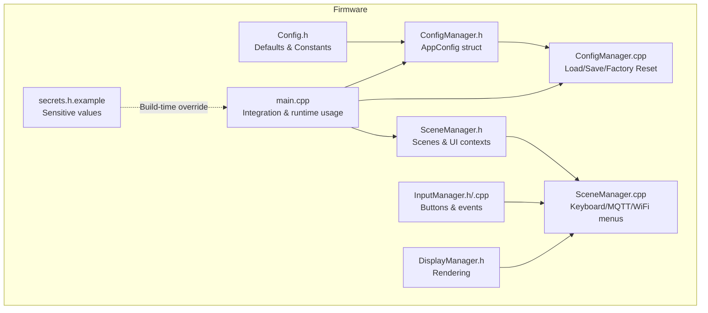
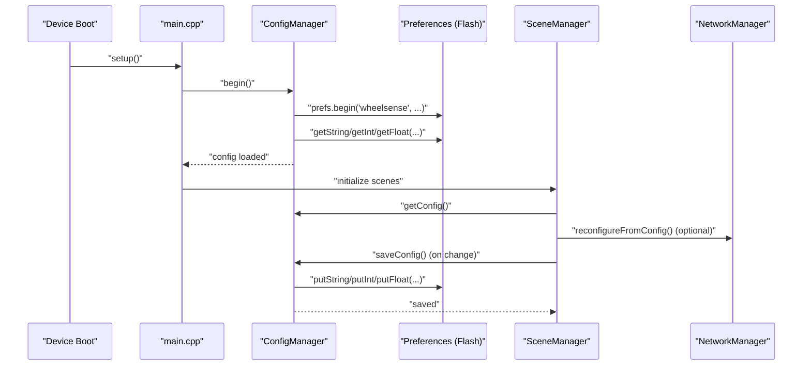
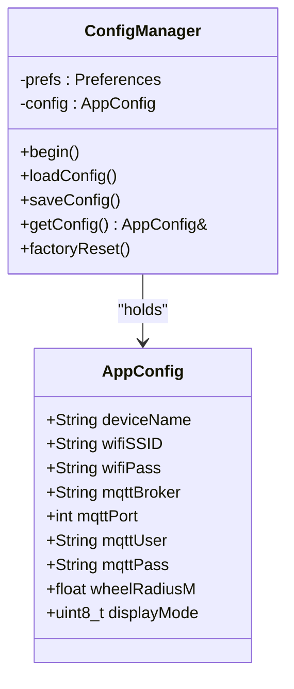
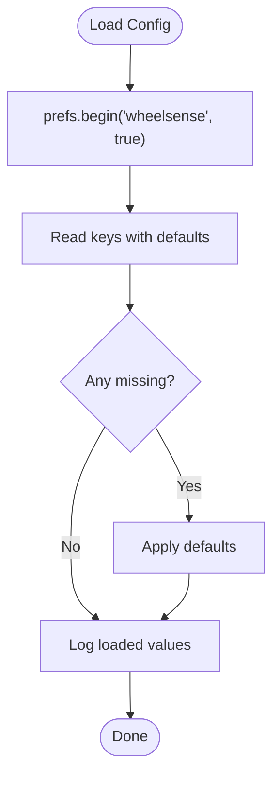
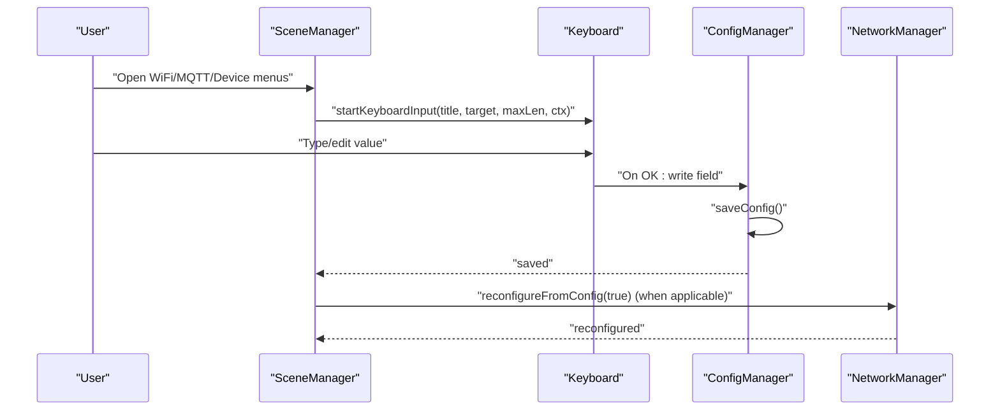
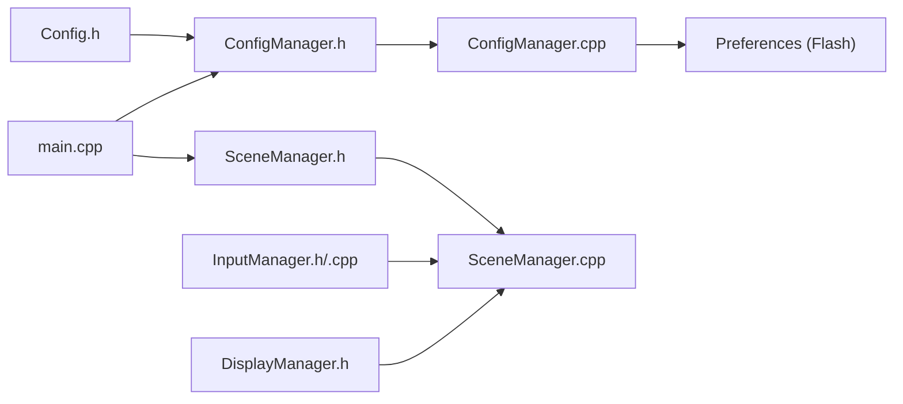

# Configuration & Storage

<cite>
**Referenced Files in This Document**
- [ConfigManager.h](file://firmware/M5StickCPlus2/src/managers/ConfigManager.h)
- [ConfigManager.cpp](file://firmware/M5StickCPlus2/src/managers/ConfigManager.cpp)
- [Config.h](file://firmware/M5StickCPlus2/src/Config.h)
- [main.cpp](file://firmware/M5StickCPlus2/src/main.cpp)
- [SceneManager.h](file://firmware/M5StickCPlus2/src/ui/SceneManager.h)
- [SceneManager.cpp](file://firmware/M5StickCPlus2/src/ui/SceneManager.cpp)
- [InputManager.h](file://firmware/M5StickCPlus2/src/managers/InputManager.h)
- [InputManager.cpp](file://firmware/M5StickCPlus2/src/managers/InputManager.cpp)
- [DisplayManager.h](file://firmware/M5StickCPlus2/src/ui/DisplayManager.h)
- [secrets.h.example](file://firmware/M5StickCPlus2/src/secrets.h.example)
</cite>

## Table of Contents
1. [Introduction](#introduction)
2. [Project Structure](#project-structure)
3. [Core Components](#core-components)
4. [Architecture Overview](#architecture-overview)
5. [Detailed Component Analysis](#detailed-component-analysis)
6. [Dependency Analysis](#dependency-analysis)
7. [Performance Considerations](#performance-considerations)
8. [Troubleshooting Guide](#troubleshooting-guide)
9. [Conclusion](#conclusion)
10. [Appendices](#appendices)

## Introduction
This document explains the configuration management and storage system for the device firmware. It covers the configuration data model, the ConfigManager class for loading, saving, and resetting configuration, persistent storage using flash memory, default values, validation and error recovery, secrets management, runtime parameter updates, and backup/restore procedures. Practical examples demonstrate customizing device settings, adding new parameters, migrating configurations, and troubleshooting corruption.

## Project Structure
The configuration system spans three primary areas:
- Configuration data model and defaults
- Persistent storage manager
- UI-driven configuration updates and runtime parameter changes

**Diagram sources**
- [Config.h:1-78](file://firmware/M5StickCPlus2/src/Config.h#L1-L78)
- [ConfigManager.h:1-36](file://firmware/M5StickCPlus2/src/managers/ConfigManager.h#L1-L36)
- [ConfigManager.cpp:1-57](file://firmware/M5StickCPlus2/src/managers/ConfigManager.cpp#L1-L57)
- [SceneManager.h:1-127](file://firmware/M5StickCPlus2/src/ui/SceneManager.h#L1-L127)
- [SceneManager.cpp:1-800](file://firmware/M5StickCPlus2/src/ui/SceneManager.cpp#L1-L800)
- [InputManager.h:1-37](file://firmware/M5StickCPlus2/src/managers/InputManager.h#L1-L37)
- [InputManager.cpp:1-82](file://firmware/M5StickCPlus2/src/managers/InputManager.cpp#L1-L82)
- [DisplayManager.h:1-39](file://firmware/M5StickCPlus2/src/ui/DisplayManager.h#L1-L39)
- [main.cpp:123-151](file://firmware/M5StickCPlus2/src/main.cpp#L123-L151)
- [secrets.h.example:1-21](file://firmware/M5StickCPlus2/src/secrets.h.example#L1-L21)

**Section sources**
- [Config.h:1-78](file://firmware/M5StickCPlus2/src/Config.h#L1-L78)
- [ConfigManager.h:1-36](file://firmware/M5StickCPlus2/src/managers/ConfigManager.h#L1-L36)
- [ConfigManager.cpp:1-57](file://firmware/M5StickCPlus2/src/managers/ConfigManager.cpp#L1-L57)
- [SceneManager.h:1-127](file://firmware/M5StickCPlus2/src/ui/SceneManager.h#L1-L127)
- [SceneManager.cpp:1-800](file://firmware/M5StickCPlus2/src/ui/SceneManager.cpp#L1-L800)
- [InputManager.h:1-37](file://firmware/M5StickCPlus2/src/managers/InputManager.h#L1-L37)
- [InputManager.cpp:1-82](file://firmware/M5StickCPlus2/src/managers/InputManager.cpp#L1-L82)
- [DisplayManager.h:1-39](file://firmware/M5StickCPlus2/src/ui/DisplayManager.h#L1-L39)
- [main.cpp:123-151](file://firmware/M5StickCPlus2/src/main.cpp#L123-L151)
- [secrets.h.example:1-21](file://firmware/M5StickCPlus2/src/secrets.h.example#L1-L21)

## Core Components
- AppConfig data model: device identity, network credentials, MQTT settings, operational parameters, and display preferences.
- ConfigManager: loads from and saves to non-volatile storage, exposes current config, and supports factory reset.
- Defaults and constants: centralized in Config.h.
- UI-driven configuration: managed via scenes and keyboard input, with immediate persistence and optional reconfiguration of connectivity.
- Runtime parameter updates: applied immediately and persisted when appropriate.

**Section sources**
- [ConfigManager.h:7-31](file://firmware/M5StickCPlus2/src/managers/ConfigManager.h#L7-L31)
- [ConfigManager.cpp:11-56](file://firmware/M5StickCPlus2/src/managers/ConfigManager.cpp#L11-L56)
- [Config.h:9-76](file://firmware/M5StickCPlus2/src/Config.h#L9-L76)
- [SceneManager.cpp:486-619](file://firmware/M5StickCPlus2/src/ui/SceneManager.cpp#L486-L619)
- [main.cpp:82-121](file://firmware/M5StickCPlus2/src/main.cpp#L82-L121)

## Architecture Overview
The configuration lifecycle integrates hardware initialization, persistent storage, and UI-driven updates.

**Diagram sources**
- [main.cpp:123-151](file://firmware/M5StickCPlus2/src/main.cpp#L123-L151)
- [ConfigManager.cpp:11-44](file://firmware/M5StickCPlus2/src/managers/ConfigManager.cpp#L11-L44)
- [SceneManager.cpp:509-530](file://firmware/M5StickCPlus2/src/ui/SceneManager.cpp#L509-L530)

## Detailed Component Analysis

### AppConfig Data Model
AppConfig encapsulates all device configuration fields:
- Device identification: deviceName
- WiFi credentials: wifiSSID, wifiPass
- MQTT settings: mqttBroker, mqttPort, mqttUser, mqttPass
- Operational parameters: wheelRadiusM
- Display preferences: displayMode

These fields are persisted and restored using Preferences keys.

**Section sources**
- [ConfigManager.h:7-17](file://firmware/M5StickCPlus2/src/managers/ConfigManager.h#L7-L17)

### ConfigManager Class
Responsibilities:
- Load configuration from flash with defaults for missing keys.
- Save configuration to flash.
- Expose current configuration to other subsystems.
- Factory reset by clearing stored preferences and reloading defaults.

Behavior highlights:
- Keys used for persistence include devName, wifiSSID, wifiPass, mqttBrkr, mqttPort, mqttUser, mqttPass, wheelR, dispMode.
- Factory reset clears all keys and reloads defaults.

**Diagram sources**
- [ConfigManager.h:19-31](file://firmware/M5StickCPlus2/src/managers/ConfigManager.h#L19-L31)
- [ConfigManager.cpp:5,11-56](file://firmware/M5StickCPlus2/src/managers/ConfigManager.cpp#L5,L11-L56)

**Section sources**
- [ConfigManager.cpp:11-56](file://firmware/M5StickCPlus2/src/managers/ConfigManager.cpp#L11-L56)
- [ConfigManager.h:19-31](file://firmware/M5StickCPlus2/src/managers/ConfigManager.h#L19-L31)

### Persistent Storage and Defaults
- Storage backend: Preferences (non-volatile flash).
- Defaults: defined centrally in Config.h for device name, WiFi, MQTT, timing, display modes, and other constants.
- Loading strategy: load with fallback to defaults for any missing key.

**Diagram sources**
- [ConfigManager.cpp:11-29](file://firmware/M5StickCPlus2/src/managers/ConfigManager.cpp#L11-L29)
- [Config.h:9-76](file://firmware/M5StickCPlus2/src/Config.h#L9-L76)

**Section sources**
- [ConfigManager.cpp:11-29](file://firmware/M5StickCPlus2/src/managers/ConfigManager.cpp#L11-L29)
- [Config.h:9-76](file://firmware/M5StickCPlus2/src/Config.h#L9-L76)

### Secrets Management
- Build-time secrets: define WiFi and MQTT credentials in a local header file copied from the example.
- Runtime behavior: the example header demonstrates the expected macro names for SSID/password and broker/port/credentials.
- Security note: keep the secrets header out of version control; only the example is committed.

Practical guidance:
- Copy the example to secrets.h and fill in real values.
- Rebuild and flash the firmware to include credentials.

**Section sources**
- [secrets.h.example:10-20](file://firmware/M5StickCPlus2/src/secrets.h.example#L10-L20)

### UI-Driven Configuration Updates
The UI enables interactive editing of configuration fields:
- WiFi selection: scans and writes wifiSSID/wifiPass.
- MQTT configuration: broker, port, user, password.
- Device name and wheel radius: editable via keyboard.
- Display mode: toggles between Always On and Auto Sleep; saved immediately.

**Diagram sources**
- [SceneManager.cpp:486-619](file://firmware/M5StickCPlus2/src/ui/SceneManager.cpp#L486-L619)
- [SceneManager.cpp:509-530](file://firmware/M5StickCPlus2/src/ui/SceneManager.cpp#L509-L530)
- [ConfigManager.cpp:31-44](file://firmware/M5StickCPlus2/src/managers/ConfigManager.cpp#L31-L44)

**Section sources**
- [SceneManager.cpp:294-391](file://firmware/M5StickCPlus2/src/ui/SceneManager.cpp#L294-L391)
- [SceneManager.cpp:486-619](file://firmware/M5StickCPlus2/src/ui/SceneManager.cpp#L486-L619)
- [SceneManager.cpp:621-655](file://firmware/M5StickCPlus2/src/ui/SceneManager.cpp#L621-L655)
- [SceneManager.cpp:657-724](file://firmware/M5StickCPlus2/src/ui/SceneManager.cpp#L657-L724)

### Runtime Parameter Modification
- Display power policy: updated continuously based on displayMode and recording state.
- Immediate effect: brightness and sleep timers react without restart.
- Persistence: toggling display mode and editing fields are saved immediately.

**Section sources**
- [main.cpp:82-121](file://firmware/M5StickCPlus2/src/main.cpp#L82-L121)
- [SceneManager.cpp:345-356](file://firmware/M5StickCPlus2/src/ui/SceneManager.cpp#L345-L356)

### Configuration Validation Rules
- MQTT port: edited as integer; conversion occurs before saving.
- Wheel radius: edited as float; conversion occurs before saving.
- WiFi and MQTT credentials: stored as strings; length constrained by keyboard buffer and target field capacity.
- Display mode: constrained to predefined constants.

Validation behavior:
- Integer/float conversions occur during keyboard OK action.
- No explicit range checks are performed in the UI; defaults and constants provide safe bounds.

**Section sources**
- [SceneManager.cpp:519-530](file://firmware/M5StickCPlus2/src/ui/SceneManager.cpp#L519-L530)
- [Config.h:74-75](file://firmware/M5StickCPlus2/src/Config.h#L74-L75)

### Error Recovery Procedures
- Factory reset: clears all stored keys and reloads defaults.
- AP portal mode: allows reconfiguration when Wi-Fi is unavailable.
- UI feedback: messages confirm successful changes and guide user actions.

**Section sources**
- [ConfigManager.cpp:50-56](file://firmware/M5StickCPlus2/src/managers/ConfigManager.cpp#L50-L56)
- [SceneManager.cpp:375-383](file://firmware/M5StickCPlus2/src/ui/SceneManager.cpp#L375-L383)
- [SceneManager.cpp:726-795](file://firmware/M5StickCPlus2/src/ui/SceneManager.cpp#L726-L795)

### Backup and Restore Functionality
- Backup: copy the Preferences namespace contents to another device or external storage for migration.
- Restore: flash the device, then either:
  - Use AP portal to re-enter settings via UI, or
  - Manually restore the Preferences namespace if supported by the platform.

Note: There is no dedicated backup/restore API in the code; use the built-in Preferences namespace and UI workflows.

**Section sources**
- [ConfigManager.cpp:11-29](file://firmware/M5StickCPlus2/src/managers/ConfigManager.cpp#L11-L29)
- [ConfigManager.cpp:50-56](file://firmware/M5StickCPlus2/src/managers/ConfigManager.cpp#L50-L56)
- [SceneManager.cpp:726-795](file://firmware/M5StickCPlus2/src/ui/SceneManager.cpp#L726-L795)

## Dependency Analysis
- ConfigManager depends on Preferences for persistence and on Config.h for defaults.
- main.cpp integrates ConfigManager and applies displayMode at runtime.
- SceneManager coordinates UI edits and triggers saves and reconfigurations.
- InputManager and DisplayManager support the UI layer.

**Diagram sources**
- [Config.h:1-78](file://firmware/M5StickCPlus2/src/Config.h#L1-L78)
- [ConfigManager.h:1-36](file://firmware/M5StickCPlus2/src/managers/ConfigManager.h#L1-L36)
- [ConfigManager.cpp:1-57](file://firmware/M5StickCPlus2/src/managers/ConfigManager.cpp#L1-L57)
- [main.cpp:123-151](file://firmware/M5StickCPlus2/src/main.cpp#L123-L151)
- [SceneManager.h:1-127](file://firmware/M5StickCPlus2/src/ui/SceneManager.h#L1-L127)
- [SceneManager.cpp:1-800](file://firmware/M5StickCPlus2/src/ui/SceneManager.cpp#L1-L800)
- [InputManager.h:1-37](file://firmware/M5StickCPlus2/src/managers/InputManager.h#L1-L37)
- [InputManager.cpp:1-82](file://firmware/M5StickCPlus2/src/managers/InputManager.cpp#L1-L82)
- [DisplayManager.h:1-39](file://firmware/M5StickCPlus2/src/ui/DisplayManager.h#L1-L39)

**Section sources**
- [ConfigManager.h:1-36](file://firmware/M5StickCPlus2/src/managers/ConfigManager.h#L1-L36)
- [ConfigManager.cpp:1-57](file://firmware/M5StickCPlus2/src/managers/ConfigManager.cpp#L1-L57)
- [main.cpp:123-151](file://firmware/M5StickCPlus2/src/main.cpp#L123-L151)
- [SceneManager.cpp:1-800](file://firmware/M5StickCPlus2/src/ui/SceneManager.cpp#L1-L800)

## Performance Considerations
- Flash writes: minimize frequency by batching UI changes and saving only on OK.
- Display power: auto-sleep reduces power consumption; Always On mode increases power draw.
- Idle rates: publishing and sensor intervals adapt to recording and display state.

[No sources needed since this section provides general guidance]

## Troubleshooting Guide
Common issues and resolutions:
- Configuration appears corrupted or missing:
  - Perform factory reset to restore defaults.
  - Verify Preferences namespace integrity and retry loading.
- WiFi not connecting after changes:
  - Re-enter credentials via UI; confirm saved and reconfigured.
  - Use AP portal mode to validate connection.
- MQTT not publishing:
  - Verify broker endpoint, port, and credentials.
  - Confirm network connectivity and AP portal is not active.
- Display not responding:
  - Toggle display mode via UI; ensure recording state does not override sleep.
  - Check power management thresholds and activity detection.

**Section sources**
- [ConfigManager.cpp:50-56](file://firmware/M5StickCPlus2/src/managers/ConfigManager.cpp#L50-L56)
- [SceneManager.cpp:375-383](file://firmware/M5StickCPlus2/src/ui/SceneManager.cpp#L375-L383)
- [SceneManager.cpp:726-795](file://firmware/M5StickCPlus2/src/ui/SceneManager.cpp#L726-L795)
- [main.cpp:82-121](file://firmware/M5StickCPlus2/src/main.cpp#L82-L121)

## Conclusion
The configuration system provides a robust, user-friendly mechanism for managing device identity, connectivity, and operational parameters. It leverages flash-backed persistence, centralized defaults, and an intuitive UI for editing. Factory reset and AP portal modes enable reliable recovery and reconfiguration. By following the guidelines in this document, you can safely customize settings, add new parameters, migrate configurations, and troubleshoot issues.

## Appendices

### Practical Examples

- Customize device settings
  - Change device name and wheel radius via Device Info menu; values are saved and reconfigured.
  - Adjust MQTT broker, port, user, and password via MQTT Config menu; saved and reconfigured.
  - Toggle display mode between Always On and Auto Sleep; saved immediately.

- Implement new configuration parameters
  - Define a new constant in Config.h with a default value.
  - Add a new field to AppConfig in ConfigManager.h.
  - Update loadConfig/saveConfig in ConfigManager.cpp to read/write the new key.
  - Wire UI scenes to edit the new field and persist changes.

- Migrate configuration between devices
  - Use AP portal on the target device to re-enter settings.
  - Alternatively, back up the Preferences namespace and restore on the new device.

- Troubleshoot configuration corruption
  - Use factory reset to restore defaults.
  - Validate WiFi and MQTT settings via UI menus.
  - Confirm display behavior aligns with selected mode and recording state.

**Section sources**
- [Config.h:9-76](file://firmware/M5StickCPlus2/src/Config.h#L9-L76)
- [ConfigManager.h:7-17](file://firmware/M5StickCPlus2/src/managers/ConfigManager.h#L7-L17)
- [ConfigManager.cpp:11-44](file://firmware/M5StickCPlus2/src/managers/ConfigManager.cpp#L11-L44)
- [SceneManager.cpp:486-619](file://firmware/M5StickCPlus2/src/ui/SceneManager.cpp#L486-L619)
- [ConfigManager.cpp:50-56](file://firmware/M5StickCPlus2/src/managers/ConfigManager.cpp#L50-L56)