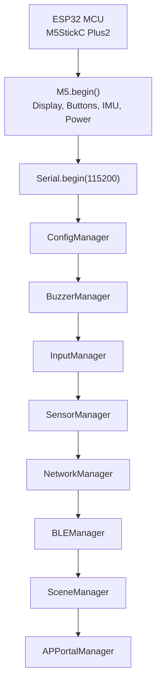
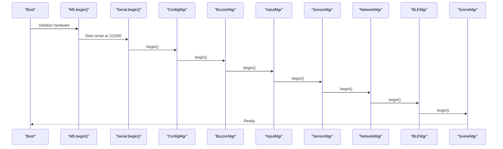
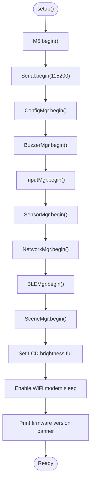
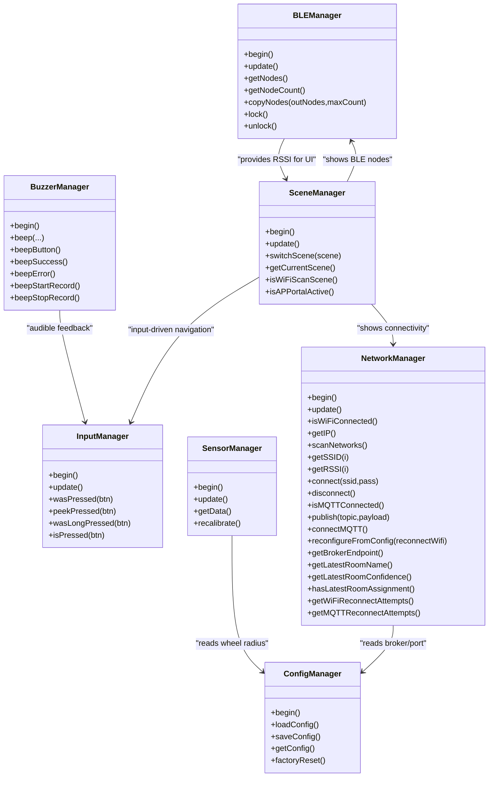
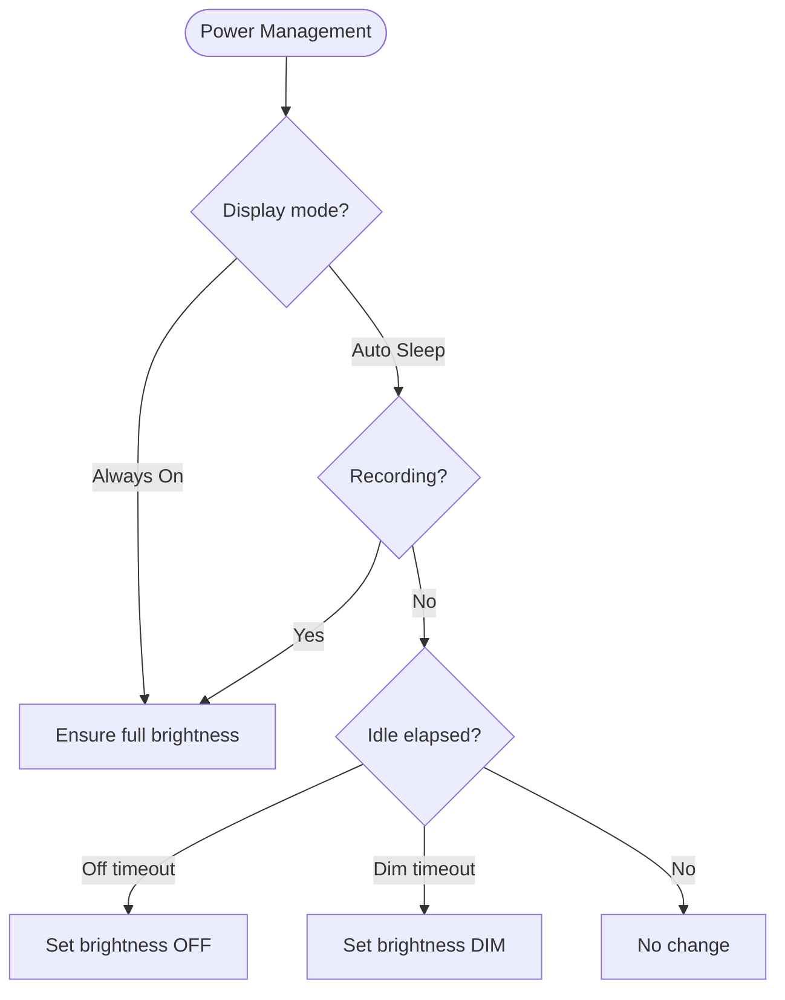
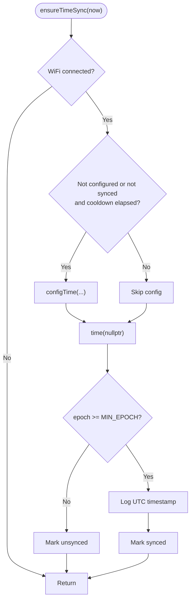
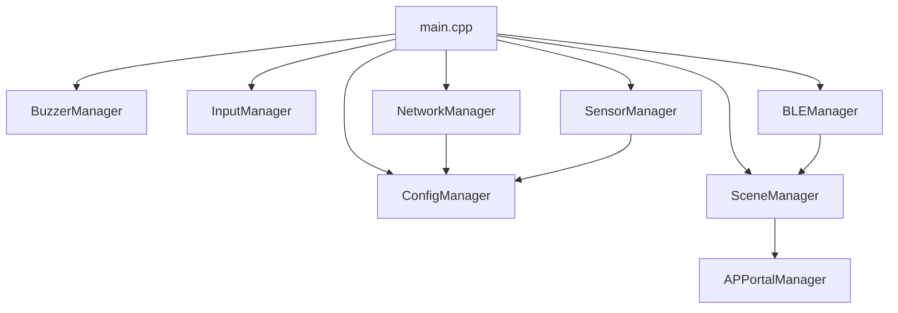

# Device Initialization & Main Loop

<cite>
**Referenced Files in This Document**
- [main.cpp](file://firmware/M5StickCPlus2/src/main.cpp)
- [Config.h](file://firmware/M5StickCPlus2/src/Config.h)
- [ConfigManager.h](file://firmware/M5StickCPlus2/src/managers/ConfigManager.h)
- [ConfigManager.cpp](file://firmware/M5StickCPlus2/src/managers/ConfigManager.cpp)
- [InputManager.h](file://firmware/M5StickCPlus2/src/managers/InputManager.h)
- [InputManager.cpp](file://firmware/M5StickCPlus2/src/managers/InputManager.cpp)
- [BuzzerManager.h](file://firmware/M5StickCPlus2/src/managers/BuzzerManager.h)
- [BuzzerManager.cpp](file://firmware/M5StickCPlus2/src/managers/BuzzerManager.cpp)
- [SensorManager.h](file://firmware/M5StickCPlus2/src/managers/SensorManager.h)
- [SensorManager.cpp](file://firmware/M5StickCPlus2/src/managers/SensorManager.cpp)
- [NetworkManager.h](file://firmware/M5StickCPlus2/src/managers/NetworkManager.h)
- [NetworkManager.cpp](file://firmware/M5StickCPlus2/src/managers/NetworkManager.cpp)
- [BLEManager.h](file://firmware/M5StickCPlus2/src/managers/BLEManager.h)
- [SceneManager.h](file://firmware/M5StickCPlus2/src/ui/SceneManager.h)
- [APPortalManager.h](file://firmware/M5StickCPlus2/src/managers/APPortalManager.h)
- [platformio.ini](file://firmware/M5StickCPlus2/platformio.ini)
</cite>

## Table of Contents
1. [Introduction](#introduction)
2. [Project Structure](#project-structure)
3. [Core Components](#core-components)
4. [Architecture Overview](#architecture-overview)
5. [Detailed Component Analysis](#detailed-component-analysis)
6. [Dependency Analysis](#dependency-analysis)
7. [Performance Considerations](#performance-considerations)
8. [Troubleshooting Guide](#troubleshooting-guide)
9. [Conclusion](#conclusion)

## Introduction
This document explains the M5StickCPlus2 device initialization sequence and main loop architecture for the WheelSense project. It details the setup() initialization order, component initialization sequence, main loop timing and update cycles, power management (WiFi sleep and LCD brightness), global timing variables for adaptive scheduling, NTP time synchronization with minimum epoch validation, and practical examples for lifecycle management, error handling, and debugging startup issues.

## Project Structure
The firmware is organized around a central main loop with modular managers and UI components. The M5 initialization and serial setup occur first, followed by ordered manager initialization. The main loop orchestrates input, sensors, networking, BLE, display, and power management with adaptive intervals.

**Diagram sources**
- [main.cpp:123-151](file://firmware/M5StickCPlus2/src/main.cpp#L123-L151)
- [ConfigManager.cpp:7-9](file://firmware/M5StickCPlus2/src/managers/ConfigManager.cpp#L7-L9)
- [BuzzerManager.cpp:7-10](file://firmware/M5StickCPlus2/src/managers/BuzzerManager.cpp#L7-L10)
- [InputManager.cpp:8-10](file://firmware/M5StickCPlus2/src/managers/InputManager.cpp#L8-L10)
- [SensorManager.cpp:12-27](file://firmware/M5StickCPlus2/src/managers/SensorManager.cpp#L12-L27)
- [NetworkManager.cpp:12-32](file://firmware/M5StickCPlus2/src/managers/NetworkManager.cpp#L12-L32)
- [BLEManager.h:26-35](file://firmware/M5StickCPlus2/src/managers/BLEManager.h#L26-L35)
- [SceneManager.h:46-48](file://firmware/M5StickCPlus2/src/ui/SceneManager.h#L46-L48)
- [APPortalManager.h:11-15](file://firmware/M5StickCPlus2/src/managers/APPortalManager.h#L11-L15)

**Section sources**
- [main.cpp:123-151](file://firmware/M5StickCPlus2/src/main.cpp#L123-L151)
- [platformio.ini:4-22](file://firmware/M5StickCPlus2/platformio.ini#L4-L22)

## Core Components
- M5 hardware initialization and serial communication setup
- Component manager initialization sequence
- Main loop with timing management and adaptive scheduling
- Power management for WiFi sleep and LCD brightness
- Global timing variables for publish/update cadence
- NTP time synchronization with minimum epoch validation
- Practical lifecycle management and debugging techniques

**Section sources**
- [main.cpp:123-151](file://firmware/M5StickCPlus2/src/main.cpp#L123-L151)
- [main.cpp:153-340](file://firmware/M5StickCPlus2/src/main.cpp#L153-L340)
- [Config.h:43-76](file://firmware/M5StickCPlus2/src/Config.h#L43-L76)

## Architecture Overview
The system follows a deterministic initialization order followed by a reactive main loop. Managers encapsulate hardware and protocol concerns, while the UI manager coordinates scenes and rendering. The main loop polls inputs, updates sensors and networks at configurable intervals, manages display power, and publishes telemetry with adaptive rates.

**Diagram sources**
- [main.cpp:123-151](file://firmware/M5StickCPlus2/src/main.cpp#L123-L151)
- [ConfigManager.cpp:7-9](file://firmware/M5StickCPlus2/src/managers/ConfigManager.cpp#L7-L9)
- [BuzzerManager.cpp:7-10](file://firmware/M5StickCPlus2/src/managers/BuzzerManager.cpp#L7-L10)
- [InputManager.cpp:8-10](file://firmware/M5StickCPlus2/src/managers/InputManager.cpp#L8-L10)
- [SensorManager.cpp:12-27](file://firmware/M5StickCPlus2/src/managers/SensorManager.cpp#L12-L27)
- [NetworkManager.cpp:12-32](file://firmware/M5StickCPlus2/src/managers/NetworkManager.cpp#L12-L32)
- [BLEManager.h:26-35](file://firmware/M5StickCPlus2/src/managers/BLEManager.h#L26-L35)
- [SceneManager.h:46-48](file://firmware/M5StickCPlus2/src/ui/SceneManager.h#L46-L48)

## Detailed Component Analysis

### Setup() Initialization Order
- M5 hardware initialization with board configuration
- Serial communication enabled at 115200 baud
- Component managers initialized in strict order:
  1) ConfigMgr
  2) BuzzerMgr
  3) InputMgr
  4) SensorMgr
  5) NetworkMgr
  6) BLEMgr
  7) SceneMgr
- Initial LCD brightness set to full
- WiFi power save enabled (modem sleep)
- Startup banner printed

**Diagram sources**
- [main.cpp:123-151](file://firmware/M5StickCPlus2/src/main.cpp#L123-L151)

**Section sources**
- [main.cpp:123-151](file://firmware/M5StickCPlus2/src/main.cpp#L123-L151)

### Component Initialization Sequence
- ConfigMgr: Loads persistent configuration from NVS and logs effective settings.
- BuzzerMgr: Initializes speaker and sets volume for power-conscious operation.
- InputMgr: Prepares debounced button state tracking; no explicit begin() action.
- SensorMgr: Calibrates gyroscope offset and initializes motion computation state.
- NetworkMgr: Sets WiFi mode to STA, enables modem sleep, connects using stored credentials, configures MQTT server and buffers.
- BLEMgr: Initializes BLE scanning infrastructure and semaphore.
- SceneMgr: Initializes UI state machine and rendering pipeline.

**Diagram sources**
- [ConfigManager.h:19-31](file://firmware/M5StickCPlus2/src/managers/ConfigManager.h#L19-L31)
- [BuzzerManager.h:6-25](file://firmware/M5StickCPlus2/src/managers/BuzzerManager.h#L6-L25)
- [InputManager.h:13-32](file://firmware/M5StickCPlus2/src/managers/InputManager.h#L13-L32)
- [SensorManager.h:28-71](file://firmware/M5StickCPlus2/src/managers/SensorManager.h#L28-L71)
- [NetworkManager.h:8-58](file://firmware/M5StickCPlus2/src/managers/NetworkManager.h#L8-L58)
- [BLEManager.h:19-50](file://firmware/M5StickCPlus2/src/managers/BLEManager.h#L19-L50)
- [SceneManager.h:25-118](file://firmware/M5StickCPlus2/src/ui/SceneManager.h#L25-L118)

**Section sources**
- [ConfigManager.cpp:7-44](file://firmware/M5StickCPlus2/src/managers/ConfigManager.cpp#L7-L44)
- [BuzzerManager.cpp:7-10](file://firmware/M5StickCPlus2/src/managers/BuzzerManager.cpp#L7-L10)
- [InputManager.cpp:8-10](file://firmware/M5StickCPlus2/src/managers/InputManager.cpp#L8-L10)
- [SensorManager.cpp:12-48](file://firmware/M5StickCPlus2/src/managers/SensorManager.cpp#L12-L48)
- [NetworkManager.cpp:12-32](file://firmware/M5StickCPlus2/src/managers/NetworkManager.cpp#L12-L32)
- [BLEManager.h:26-35](file://firmware/M5StickCPlus2/src/managers/BLEManager.h#L26-L35)
- [SceneManager.h:46-48](file://firmware/M5StickCPlus2/src/ui/SceneManager.h#L46-L48)

### Main Loop Structure and Timing Management
The main loop runs continuously, polling M5 hardware, input, and updating subsystems at controlled intervals. It manages:
- Activity registration and LCD power management
- Network updates with scene-aware skipping
- NTP time synchronization
- Sensor updates with adaptive intervals
- BLE updates
- UI updates when LCD is not off
- Telemetry publishing with adaptive intervals and NTP timestamping
- Motion recording state machine
- Adaptive idle delays for power savings

```mermaid
flowchart TD
Entry(["loop() start"]) --> Now["now = millis()"]
Now --> M5Update["M5.update()"]
M5Update --> InputUpdate["InputMgr.update()"]
InputUpdate --> ActivityCheck{"Button pressed?"}
ActivityCheck --> |Yes| RegisterAct["registerActivity(now)"]
ActivityCheck --> |No| SkipAct["Skip"]
RegisterAct --> SceneLogic["Scene logic (manual sleep, A-tap behavior)"]
SkipAct --> SceneLogic
SceneLogic --> NetUpdate{"Network interval elapsed<br/>and not scanning/AP?"}
NetUpdate --> |Yes| NetMgrUpdate["NetworkMgr.update()"]
NetUpdate --> |No| SkipNet["Skip network update"]
NetMgrUpdate --> TimeSync["ensureTimeSync(now)"]
SkipNet --> TimeSync
TimeSync --> SensorInt["Compute sensor interval<br/>(recording/idle)"]
SensorInt --> SensorUpdate{"Sensor interval elapsed?"}
SensorUpdate --> |Yes| SensorMgrUpdate["SensorMgr.update()"]
SensorUpdate --> |No| SkipSensor["Skip sensor update"]
SensorMgrUpdate --> BLEUpdate{"BLE interval elapsed?"}
SkipSensor --> BLEUpdate
BLEUpdate --> |Yes| BLEMgrUpdate["BLEMgr.update()"]
BLEUpdate --> |No| SkipBLE["Skip BLE update"]
BLEMgrUpdate --> DisplayCheck{"LCD off?"}
SkipBLE --> DisplayCheck
DisplayCheck --> |No| SceneMgrUpdate["SceneMgr.update()"]
DisplayCheck --> |Yes| SkipDisplay["Skip display update"]
SceneMgrUpdate --> LCDPM["updateLCDPower(now)"]
SkipDisplay --> LCDPM
LCDPM --> RecordSM{"Recording state machine"}
RecordSM --> PublishInt["Compute publish interval<br/>(recording/idle)"]
PublishInt --> PublishCheck{"Publish interval elapsed<br/>and MQTT connected<br/>and not AP portal?"}
PublishCheck --> |Yes| Telemetry["Build and publish telemetry"]
PublishCheck --> |No| SkipTelemetry["Skip publish"]
Telemetry --> IdleDelay["Adaptive delay<br/>(sleep/idle)"]
SkipTelemetry --> IdleDelay
IdleDelay --> Exit(["loop() end"])
```

**Diagram sources**
- [main.cpp:153-340](file://firmware/M5StickCPlus2/src/main.cpp#L153-L340)
- [Config.h:43-76](file://firmware/M5StickCPlus2/src/Config.h#L43-L76)

**Section sources**
- [main.cpp:153-340](file://firmware/M5StickCPlus2/src/main.cpp#L153-L340)
- [Config.h:43-76](file://firmware/M5StickCPlus2/src/Config.h#L43-L76)

### Power Management Initialization
- WiFi sleep mode: Enabled via WiFi modem sleep to reduce idle current.
- LCD power management:
  - Always-on mode bypasses auto-dimming/off.
  - During recording, LCD remains full brightness.
  - Auto-sleep logic dims after a timeout, turns off after another timeout.
  - Manual sleep request forces immediate off and anchors idle timer.
  - Brightness values and timeouts are configurable.

**Diagram sources**
- [main.cpp:82-121](file://firmware/M5StickCPlus2/src/main.cpp#L82-L121)
- [Config.h:61-76](file://firmware/M5StickCPlus2/src/Config.h#L61-L76)

**Section sources**
- [main.cpp:147-149](file://firmware/M5StickCPlus2/src/main.cpp#L147-L149)
- [main.cpp:82-121](file://firmware/M5StickCPlus2/src/main.cpp#L82-L121)
- [Config.h:61-76](file://firmware/M5StickCPlus2/src/Config.h#L61-L76)

### Global Timing Variables and Adaptive Scheduling
Global timing variables track last update/publish timestamps:
- lastPublish: controls telemetry publish cadence
- lastSensorUpdate: controls IMU/battery sampling
- lastNetworkUpdate: controls network stack polling
- lastBleUpdate: controls BLE scanning

Adaptive scheduling:
- Publish intervals adjust based on recording state and LCD power state.
- Sensor sampling adjusts based on recording and LCD power state.
- Network and BLE updates use fixed intervals gated by scene state.

**Section sources**
- [main.cpp:16-21](file://firmware/M5StickCPlus2/src/main.cpp#L16-L21)
- [main.cpp:190-211](file://firmware/M5StickCPlus2/src/main.cpp#L190-L211)
- [main.cpp:265-269](file://firmware/M5StickCPlus2/src/main.cpp#L265-L269)
- [main.cpp:199-205](file://firmware/M5StickCPlus2/src/main.cpp#L199-L205)
- [Config.h:43-50](file://firmware/M5StickCPlus2/src/Config.h#L43-L50)

### NTP Time Synchronization and Minimum Epoch Validation
- NTP servers configured when WiFi is connected.
- Time sync attempted periodically until successful.
- Minimum epoch threshold ensures valid time before enabling timestamps in telemetry.
- On first successful sync, UTC timestamp is logged.

**Diagram sources**
- [main.cpp:51-69](file://firmware/M5StickCPlus2/src/main.cpp#L51-L69)
- [main.cpp:283-290](file://firmware/M5StickCPlus2/src/main.cpp#L283-L290)

**Section sources**
- [main.cpp:51-69](file://firmware/M5StickCPlus2/src/main.cpp#L51-L69)
- [main.cpp:283-290](file://firmware/M5StickCPlus2/src/main.cpp#L283-L290)

### Practical Examples

#### Component Lifecycle Management
- Initialization: Each manager’s begin() performs self-setup (e.g., preferences, IMU calibration, WiFi connect).
- Update cycle: Managers expose update() methods polled at intervals in the main loop.
- Destruction: No explicit destructor calls are present; managers persist for device lifetime.

**Section sources**
- [ConfigManager.cpp:7-44](file://firmware/M5StickCPlus2/src/managers/ConfigManager.cpp#L7-L44)
- [SensorManager.cpp:12-48](file://firmware/M5StickCPlus2/src/managers/SensorManager.cpp#L12-L48)
- [NetworkManager.cpp:12-32](file://firmware/M5StickCPlus2/src/managers/NetworkManager.cpp#L12-L32)

#### Initialization Error Handling
- WiFi reconnection backoff with exponential increase up to a cap.
- MQTT reconnection backoff with exponential increase up to a cap.
- Network disconnection resets MQTT client and clears retry delays.
- Config updates received via MQTT trigger reconfiguration and optional WiFi reconnect.

**Section sources**
- [NetworkManager.cpp:58-94](file://firmware/M5StickCPlus2/src/managers/NetworkManager.cpp#L58-L94)
- [NetworkManager.cpp:34-56](file://firmware/M5StickCPlus2/src/managers/NetworkManager.cpp#L34-L56)

#### Debugging Startup Issues
- Enable serial output at 115200 baud during setup and runtime.
- Verify M5 hardware initialization completes.
- Confirm ConfigMgr loads defaults or saved values.
- Check WiFi SSID/password and broker endpoint via logs.
- Validate MQTT connection attempts and subscription topics.
- Use buzzer feedback to confirm button presses during early stages.

**Section sources**
- [main.cpp:126](file://firmware/M5StickCPlus2/src/main.cpp#L126)
- [ConfigManager.cpp:24-28](file://firmware/M5StickCPlus2/src/managers/ConfigManager.cpp#L24-L28)
- [NetworkManager.cpp:77](file://firmware/M5StickCPlus2/src/managers/NetworkManager.cpp#L77)
- [NetworkManager.cpp:116](file://firmware/M5StickCPlus2/src/managers/NetworkManager.cpp#L116)
- [InputManager.cpp:20](file://firmware/M5StickCPlus2/src/managers/InputManager.cpp#L20)

## Dependency Analysis
The main loop depends on managers for hardware and protocol operations. Managers depend on configuration and each other indirectly through UI and telemetry flows.

**Diagram sources**
- [main.cpp:123-151](file://firmware/M5StickCPlus2/src/main.cpp#L123-L151)
- [NetworkManager.cpp:12-32](file://firmware/M5StickCPlus2/src/managers/NetworkManager.cpp#L12-L32)
- [SensorManager.cpp:12-27](file://firmware/M5StickCPlus2/src/managers/SensorManager.cpp#L12-L27)
- [SceneManager.h:46-48](file://firmware/M5StickCPlus2/src/ui/SceneManager.h#L46-L48)

**Section sources**
- [main.cpp:123-151](file://firmware/M5StickCPlus2/src/main.cpp#L123-L151)
- [NetworkManager.cpp:12-32](file://firmware/M5StickCPlus2/src/managers/NetworkManager.cpp#L12-L32)
- [SensorManager.cpp:12-27](file://firmware/M5StickCPlus2/src/managers/SensorManager.cpp#L12-L27)
- [SceneManager.h:46-48](file://firmware/M5StickCPlus2/src/ui/SceneManager.h#L46-L48)

## Performance Considerations
- WiFi sleep reduces idle current; ensure sufficient wake-up latency for scans and MQTT keepalive.
- LCD power management reduces display power consumption; choose appropriate timeouts for user experience.
- Adaptive sensor and publish intervals lower power during idle and off states.
- BLE scanning uses periodic rest intervals to balance discovery speed and power.
- Battery filtering stabilizes readings and reduces UI jitter.

[No sources needed since this section provides general guidance]

## Troubleshooting Guide
Common startup and runtime issues:
- No serial output: verify monitor speed and wiring; ensure Serial.begin executes.
- WiFi fails to connect: check stored SSID/password; review reconnection attempts and delays.
- MQTT not connecting: verify broker endpoint and credentials; confirm subscriptions; inspect retry delays.
- IMU not updating: confirm gyroscope calibration; check IMU update calls and validity flags.
- BLE scanning stalls: verify scan task and mutex; ensure scan callbacks are registered.
- Display flickers or does not respond: check brightness transitions and manual sleep requests.

**Section sources**
- [main.cpp:126](file://firmware/M5StickCPlus2/src/main.cpp#L126)
- [NetworkManager.cpp:58-94](file://firmware/M5StickCPlus2/src/managers/NetworkManager.cpp#L58-L94)
- [SensorManager.cpp:55-72](file://firmware/M5StickCPlus2/src/managers/SensorManager.cpp#L55-L72)
- [BLEManager.h:38-49](file://firmware/M5StickCPlus2/src/managers/BLEManager.h#L38-L49)
- [main.cpp:82-121](file://firmware/M5StickCPlus2/src/main.cpp#L82-L121)

## Conclusion
The M5StickCPlus2 firmware implements a robust initialization sequence followed by a power-aware main loop. Managers encapsulate hardware and protocol concerns, while the UI coordinates scenes and user interactions. Adaptive timing, power management, and NTP synchronization enable reliable operation with minimal power consumption. Following the documented lifecycle and troubleshooting steps ensures smooth deployment and maintenance.