# M5StickCPlus2 Device Implementation

<cite>
**Referenced Files in This Document**
- [main.cpp](file://firmware/M5StickCPlus2/src/main.cpp)
- [Config.h](file://firmware/M5StickCPlus2/src/Config.h)
- [platformio.ini](file://firmware/M5StickCPlus2/platformio.ini)
- [ConfigManager.h](file://firmware/M5StickCPlus2/src/managers/ConfigManager.h)
- [ConfigManager.cpp](file://firmware/M5StickCPlus2/src/managers/ConfigManager.cpp)
- [InputManager.h](file://firmware/M5StickCPlus2/src/managers/InputManager.h)
- [InputManager.cpp](file://firmware/M5StickCPlus2/src/managers/InputManager.cpp)
- [BuzzerManager.h](file://firmware/M5StickCPlus2/src/managers/BuzzerManager.h)
- [BuzzerManager.cpp](file://firmware/M5StickCPlus2/src/managers/BuzzerManager.cpp)
- [NetworkManager.h](file://firmware/M5StickCPlus2/src/managers/NetworkManager.h)
- [NetworkManager.cpp](file://firmware/M5StickCPlus2/src/managers/NetworkManager.cpp)
- [SensorManager.h](file://firmware/M5StickCPlus2/src/managers/SensorManager.h)
- [SensorManager.cpp](file://firmware/M5StickCPlus2/src/managers/SensorManager.cpp)
- [BLEManager.h](file://firmware/M5StickCPlus2/src/managers/BLEManager.h)
- [BLEManager.cpp](file://firmware/M5StickCPlus2/src/managers/BLEManager.cpp)
</cite>

## Table of Contents
1. [Introduction](#introduction)
2. [Project Structure](#project-structure)
3. [Core Components](#core-components)
4. [Architecture Overview](#architecture-overview)
5. [Detailed Component Analysis](#detailed-component-analysis)
6. [Dependency Analysis](#dependency-analysis)
7. [Performance Considerations](#performance-considerations)
8. [Troubleshooting Guide](#troubleshooting-guide)
9. [Conclusion](#conclusion)
10. [Appendices](#appendices)

## Introduction
This document describes the M5StickCPlus2 wheelchair device implementation. It covers the firmware entry point, initialization sequence, component manager architecture, sensor data collection pipeline (IMU, motion calculations, battery monitoring), power management (LCD brightness control, sleep modes, adaptive intervals), motion recording state machine (start/stop logic and zero velocity detection), MQTT telemetry publishing (JSON payload structure, timestamps, sequence numbering), BLE scanning and RSSI data collection for localization, input handling (buttons, buzzer feedback, UI navigation), configuration management, network connectivity, and AP portal functionality. Practical examples and troubleshooting guidance are included for integrating sensors, making custom modifications, and resolving common hardware issues.

## Project Structure
The firmware is organized around a central main loop that orchestrates managers for configuration, input, buzzer, sensors, BLE, networking, and UI. Build configuration is defined in PlatformIO.

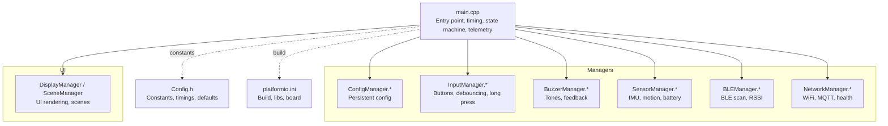

**Diagram sources**
- [main.cpp:123-151](file://firmware/M5StickCPlus2/src/main.cpp#L123-L151)
- [Config.h:1-78](file://firmware/M5StickCPlus2/src/Config.h#L1-L78)
- [platformio.ini:1-22](file://firmware/M5StickCPlus2/platformio.ini#L1-L22)

**Section sources**
- [main.cpp:123-151](file://firmware/M5StickCPlus2/src/main.cpp#L123-L151)
- [Config.h:1-78](file://firmware/M5StickCPlus2/src/Config.h#L1-L78)
- [platformio.ini:1-22](file://firmware/M5StickCPlus2/platformio.ini#L1-L22)

## Core Components
- Firmware entry point initializes hardware, managers, and sets up power-saving defaults.
- Managers encapsulate responsibilities: configuration persistence, input handling, buzzer feedback, sensor fusion, BLE scanning, network connectivity, and UI.
- Central loop coordinates timing, power management, state machine transitions, and telemetry publishing.

Key responsibilities:
- Initialization: begin() calls for each manager, Wi-Fi sleep mode, initial LCD brightness.
- Timing: global counters for publish, sensor, network, BLE, and activity tracking.
- Power management: LCD brightness control, manual sleep, and adaptive intervals.
- State machine: recording start/stop and zero velocity detection.
- Telemetry: JSON payload assembly and MQTT publication.
- BLE: background scanning, RSSI aggregation, and node normalization.

**Section sources**
- [main.cpp:123-151](file://firmware/M5StickCPlus2/src/main.cpp#L123-L151)
- [main.cpp:153-340](file://firmware/M5StickCPlus2/src/main.cpp#L153-L340)
- [Config.h:43-76](file://firmware/M5StickCPlus2/src/Config.h#L43-L76)

## Architecture Overview
The system follows a modular manager pattern with a central main loop coordinating periodic tasks and state transitions.

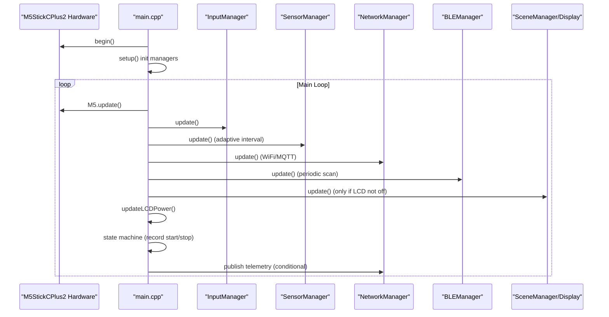

**Diagram sources**
- [main.cpp:123-151](file://firmware/M5StickCPlus2/src/main.cpp#L123-L151)
- [main.cpp:153-340](file://firmware/M5StickCPlus2/src/main.cpp#L153-L340)
- [InputManager.cpp:12-55](file://firmware/M5StickCPlus2/src/managers/InputManager.cpp#L12-L55)
- [SensorManager.cpp:50-53](file://firmware/M5StickCPlus2/src/managers/SensorManager.cpp#L50-L53)
- [NetworkManager.cpp:58-94](file://firmware/M5StickCPlus2/src/managers/NetworkManager.cpp#L58-L94)
- [BLEManager.cpp:96-108](file://firmware/M5StickCPlus2/src/managers/BLEManager.cpp#L96-L108)

## Detailed Component Analysis

### Firmware Entry Point and Initialization
- Initializes M5 hardware, serial debug, and begins all managers in order: Config, Buzzer, Input, Sensor, Network, BLE, Display.
- Sets initial LCD brightness and enables Wi-Fi modem sleep for power saving.
- Prints firmware version and starts the main loop.

Operational notes:
- Order matters: SensorManager requires wheel radius from ConfigManager.
- Wi-Fi sleep reduces idle current; network updates are skipped during AP portal or WiFi scans.

**Section sources**
- [main.cpp:123-151](file://firmware/M5StickCPlus2/src/main.cpp#L123-L151)
- [Config.h:61-71](file://firmware/M5StickCPlus2/src/Config.h#L61-L71)

### Component Manager Architecture
Managers expose begin/update/get APIs and maintain internal state. They are coordinated by the main loop with periodic scheduling and power-aware throttling.

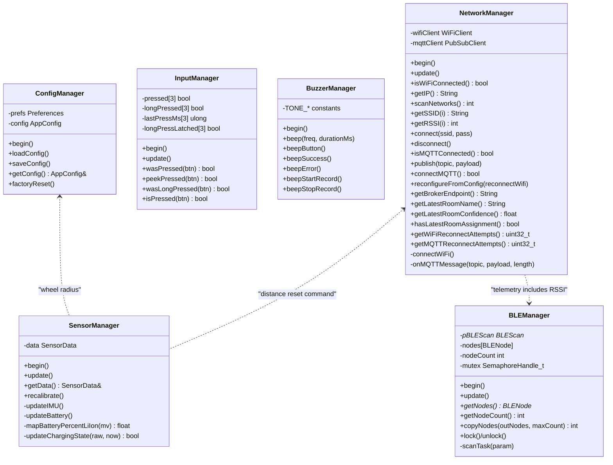

**Diagram sources**
- [ConfigManager.h:19-31](file://firmware/M5StickCPlus2/src/managers/ConfigManager.h#L19-L31)
- [InputManager.h:13-32](file://firmware/M5StickCPlus2/src/managers/InputManager.h#L13-L32)
- [BuzzerManager.h:6-25](file://firmware/M5StickCPlus2/src/managers/BuzzerManager.h#L6-L25)
- [SensorManager.h:28-71](file://firmware/M5StickCPlus2/src/managers/SensorManager.h#L28-L71)
- [BLEManager.h:19-50](file://firmware/M5StickCPlus2/src/managers/BLEManager.h#L19-L50)
- [NetworkManager.h:8-58](file://firmware/M5StickCPlus2/src/managers/NetworkManager.h#L8-L58)

**Section sources**
- [ConfigManager.cpp:7-29](file://firmware/M5StickCPlus2/src/managers/ConfigManager.cpp#L7-L29)
- [InputManager.cpp:8-55](file://firmware/M5StickCPlus2/src/managers/InputManager.cpp#L8-L55)
- [BuzzerManager.cpp:7-10](file://firmware/M5StickCPlus2/src/managers/BuzzerManager.cpp#L7-L10)
- [SensorManager.cpp:12-53](file://firmware/M5StickCPlus2/src/managers/SensorManager.cpp#L12-L53)
- [BLEManager.cpp:66-94](file://firmware/M5StickCPlus2/src/managers/BLEManager.cpp#L66-L94)
- [NetworkManager.cpp:12-32](file://firmware/M5StickCPlus2/src/managers/NetworkManager.cpp#L12-L32)

### Sensor Data Collection Pipeline (IMU, Motion, Battery)
- IMU update reads accelerometer/gyroscope, computes orientation (roll/pitch), applies gyro zero-rate offset, low-pass filters, deadbands, integrates angular velocity to wheel tangential distance, and computes sliding-window velocity and acceleration.
- Motion computation enforces maximum speed, applies velocity decay after inactivity, and snaps small velocities to zero.
- Battery monitoring samples voltage, maps to percentage using a piecewise linear curve, debounces charging state, and smooths measurements.

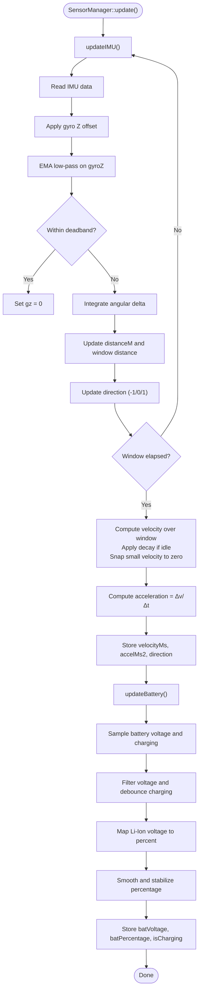

**Diagram sources**
- [SensorManager.cpp:55-132](file://firmware/M5StickCPlus2/src/managers/SensorManager.cpp#L55-L132)
- [SensorManager.cpp:185-229](file://firmware/M5StickCPlus2/src/managers/SensorManager.cpp#L185-L229)

**Section sources**
- [SensorManager.h:7-26](file://firmware/M5StickCPlus2/src/managers/SensorManager.h#L7-L26)
- [SensorManager.cpp:55-132](file://firmware/M5StickCPlus2/src/managers/SensorManager.cpp#L55-L132)
- [SensorManager.cpp:134-229](file://firmware/M5StickCPlus2/src/managers/SensorManager.cpp#L134-L229)

### Power Management System (LCD Brightness, Sleep Modes, Adaptive Intervals)
- Activity registration resets LCD brightness and clears sleep suppression flags.
- LCD power policy:
  - Always-on mode overrides auto-dimming/off.
  - During recording, keep screen on.
  - After inactivity thresholds: dim -> off.
- Adaptive intervals:
  - Off-screen idle: longer publish and sensor intervals, longer main loop delay.
  - Recording: higher telemetry frequency and sensor sampling.
- Wi-Fi sleep enabled to reduce idle current.

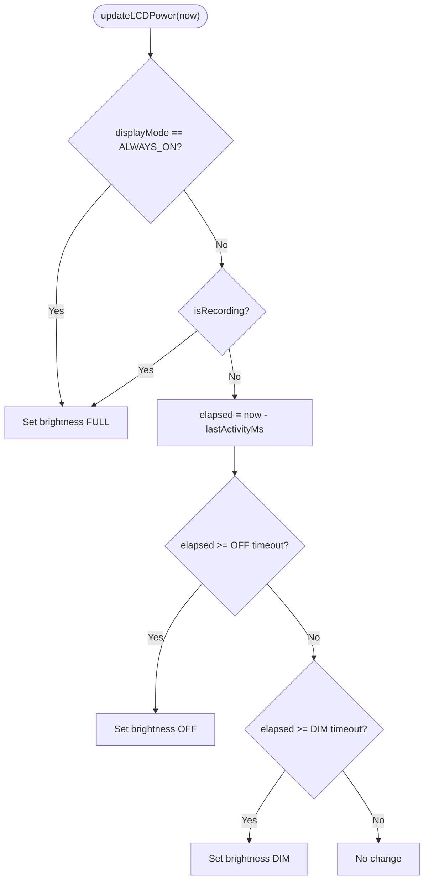

**Diagram sources**
- [main.cpp:82-121](file://firmware/M5StickCPlus2/src/main.cpp#L82-L121)
- [Config.h:61-71](file://firmware/M5StickCPlus2/src/Config.h#L61-L71)

**Section sources**
- [main.cpp:71-121](file://firmware/M5StickCPlus2/src/main.cpp#L71-L121)
- [Config.h:61-71](file://firmware/M5StickCPlus2/src/Config.h#L61-L71)

### Motion Recording State Machine (Start/Stop, Zero Velocity Detection)
- Requests originate from UI or MQTT control topic.
- Start: schedules recording start, plays start-beep, switches to recording scene, anchors activity.
- Stop: immediate stop if requested, plays stop-beep, returns to dashboard.
- Auto-stop: if velocity remains below threshold for 3 seconds, stop automatically and beep.

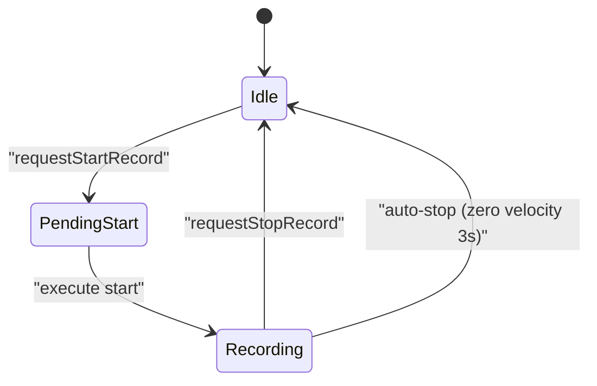

**Diagram sources**
- [main.cpp:221-263](file://firmware/M5StickCPlus2/src/main.cpp#L221-L263)
- [NetworkManager.cpp:198-214](file://firmware/M5StickCPlus2/src/managers/NetworkManager.cpp#L198-L214)
- [BuzzerManager.cpp:30-44](file://firmware/M5StickCPlus2/src/managers/BuzzerManager.cpp#L30-L44)

**Section sources**
- [main.cpp:221-263](file://firmware/M5StickCPlus2/src/main.cpp#L221-L263)
- [NetworkManager.cpp:198-214](file://firmware/M5StickCPlus2/src/managers/NetworkManager.cpp#L198-L214)

### MQTT Telemetry Publishing (JSON Payload, Timestamps, Sequence Numbering)
- Payload fields:
  - device_id, device_type, hardware_type, firmware, seq.
  - timestamp (UTC ISO format if NTP synced, else empty).
  - uptime_ms.
  - imu: ax, ay, az, gx, gy, gz.
  - motion: distance_m, velocity_ms, accel_ms2, direction.
  - is_recording and action_label when recording.
  - rssi: array of node entries with node, rssi, mac.
  - battery: percentage, voltage_v, charging.
- Publish conditions:
  - MQTT connected and not in AP portal.
  - Adaptive intervals based on recording and LCD state.
- Sequence number increments after successful publish.

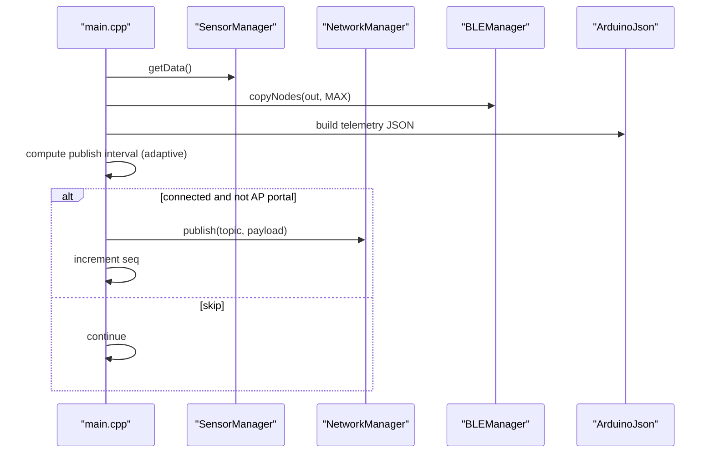

**Diagram sources**
- [main.cpp:265-336](file://firmware/M5StickCPlus2/src/main.cpp#L265-L336)
- [SensorManager.cpp:261-263](file://firmware/M5StickCPlus2/src/managers/SensorManager.cpp#L261-L263)
- [BLEManager.cpp:140-147](file://firmware/M5StickCPlus2/src/managers/BLEManager.cpp#L140-L147)
- [NetworkManager.cpp:276-282](file://firmware/M5StickCPlus2/src/managers/NetworkManager.cpp#L276-L282)

**Section sources**
- [main.cpp:265-336](file://firmware/M5StickCPlus2/src/main.cpp#L265-L336)

### BLE Scanning and RSSI Data Collection for Localization
- Background scanning task runs on core 0 with controlled intervals and windows.
- Advertisements parsed to extract node keys (normalized to WSN_XXX), RSSI, and MAC address.
- Staleness cleanup removes entries older than configured threshold.
- Nodes copied to telemetry payload for localization fingerprinting.

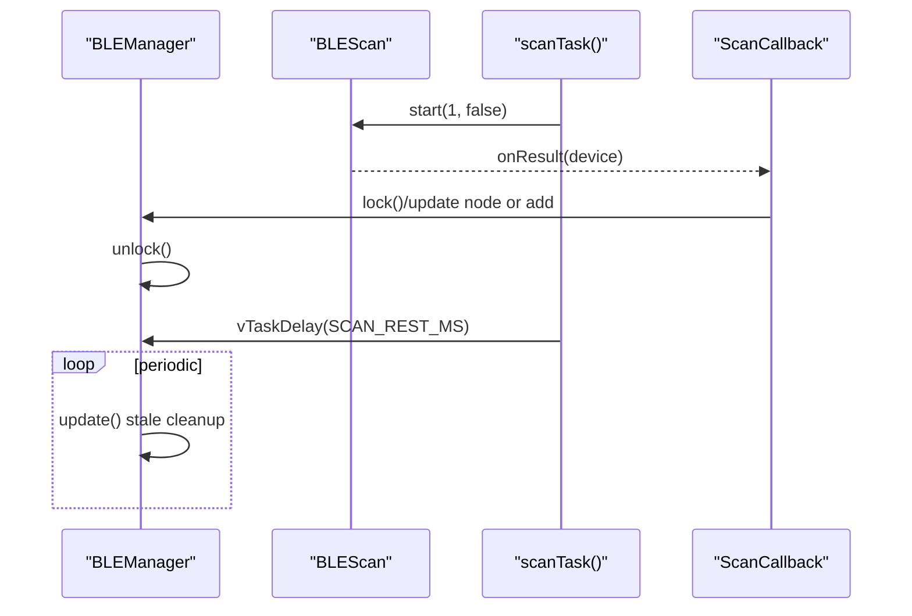

**Diagram sources**
- [BLEManager.cpp:110-121](file://firmware/M5StickCPlus2/src/managers/BLEManager.cpp#L110-L121)
- [BLEManager.cpp:33-62](file://firmware/M5StickCPlus2/src/managers/BLEManager.cpp#L33-L62)
- [BLEManager.cpp:96-108](file://firmware/M5StickCPlus2/src/managers/BLEManager.cpp#L96-L108)

**Section sources**
- [BLEManager.h:12-17](file://firmware/M5StickCPlus2/src/managers/BLEManager.h#L12-L17)
- [BLEManager.cpp:66-94](file://firmware/M5StickCPlus2/src/managers/BLEManager.cpp#L66-L94)
- [BLEManager.cpp:110-121](file://firmware/M5StickCPlus2/src/managers/BLEManager.cpp#L110-L121)

### Input Handling System (Buttons, Buzzer Feedback, UI Navigation)
- Debounce and long press detection with latch to prevent repeated triggers.
- Button A (front): enter/sleep on dashboard; button B (side): next/page; button C (power): back/menu.
- Buzzer provides tactile feedback for button presses and recording events.
- Activity registration brightens LCD and resets timers.

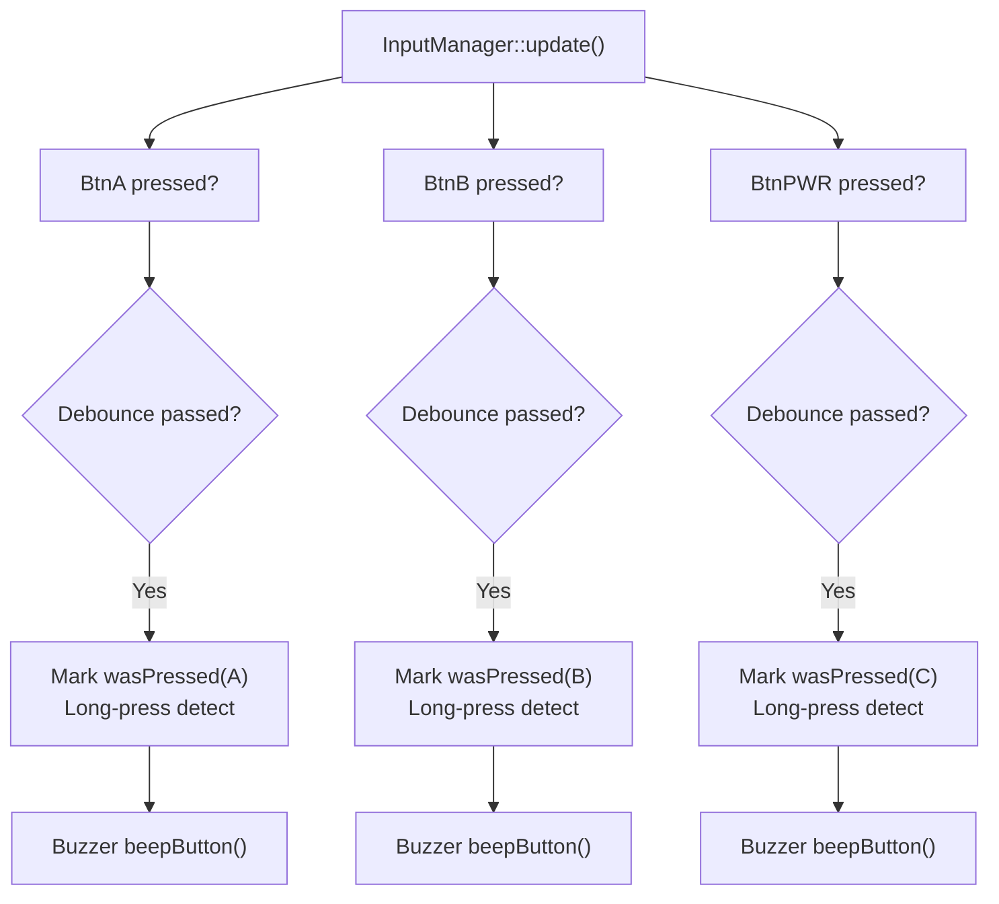

**Diagram sources**
- [InputManager.cpp:12-55](file://firmware/M5StickCPlus2/src/managers/InputManager.cpp#L12-L55)
- [BuzzerManager.cpp:16-18](file://firmware/M5StickCPlus2/src/managers/BuzzerManager.cpp#L16-L18)
- [main.cpp:164-175](file://firmware/M5StickCPlus2/src/main.cpp#L164-L175)

**Section sources**
- [InputManager.h:6-11](file://firmware/M5StickCPlus2/src/managers/InputManager.h#L6-L11)
- [InputManager.cpp:12-55](file://firmware/M5StickCPlus2/src/managers/InputManager.cpp#L12-L55)
- [BuzzerManager.cpp:16-18](file://firmware/M5StickCPlus2/src/managers/BuzzerManager.cpp#L16-L18)
- [main.cpp:164-175](file://firmware/M5StickCPlus2/src/main.cpp#L164-L175)

### Configuration Management, Network Connectivity, and AP Portal Functionality
- Configuration stored in NVS with Preferences; includes device name, WiFi credentials, MQTT endpoint, wheel radius, and display mode.
- NetworkManager manages Wi-Fi reconnection with exponential backoff and MQTT reconnection with subscription to config/control/room topics.
- AP portal scenes are detected to pause network updates and telemetry publishing.

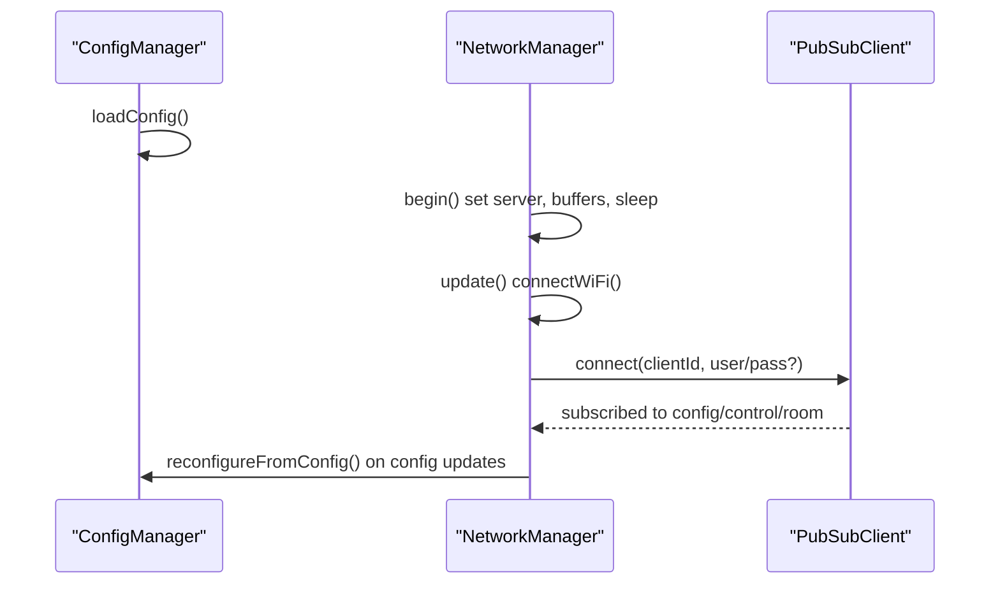

**Diagram sources**
- [ConfigManager.cpp:11-29](file://firmware/M5StickCPlus2/src/managers/ConfigManager.cpp#L11-L29)
- [NetworkManager.cpp:12-32](file://firmware/M5StickCPlus2/src/managers/NetworkManager.cpp#L12-L32)
- [NetworkManager.cpp:58-94](file://firmware/M5StickCPlus2/src/managers/NetworkManager.cpp#L58-L94)
- [NetworkManager.cpp:135-239](file://firmware/M5StickCPlus2/src/managers/NetworkManager.cpp#L135-L239)

**Section sources**
- [ConfigManager.h:7-17](file://firmware/M5StickCPlus2/src/managers/ConfigManager.h#L7-L17)
- [ConfigManager.cpp:11-44](file://firmware/M5StickCPlus2/src/managers/ConfigManager.cpp#L11-L44)
- [NetworkManager.h:8-58](file://firmware/M5StickCPlus2/src/managers/NetworkManager.h#L8-L58)
- [NetworkManager.cpp:58-94](file://firmware/M5StickCPlus2/src/managers/NetworkManager.cpp#L58-L94)
- [NetworkManager.cpp:135-239](file://firmware/M5StickCPlus2/src/managers/NetworkManager.cpp#L135-L239)

## Dependency Analysis
- main.cpp depends on managers for orchestration and data.
- SensorManager depends on ConfigManager for wheel radius and on M5 hardware APIs for IMU/battery.
- NetworkManager depends on PubSubClient and ArduinoJson for MQTT and payloads.
- BLEManager depends on NimBLE APIs and uses a dedicated scan task.
- InputManager and BuzzerManager depend on M5 hardware APIs.

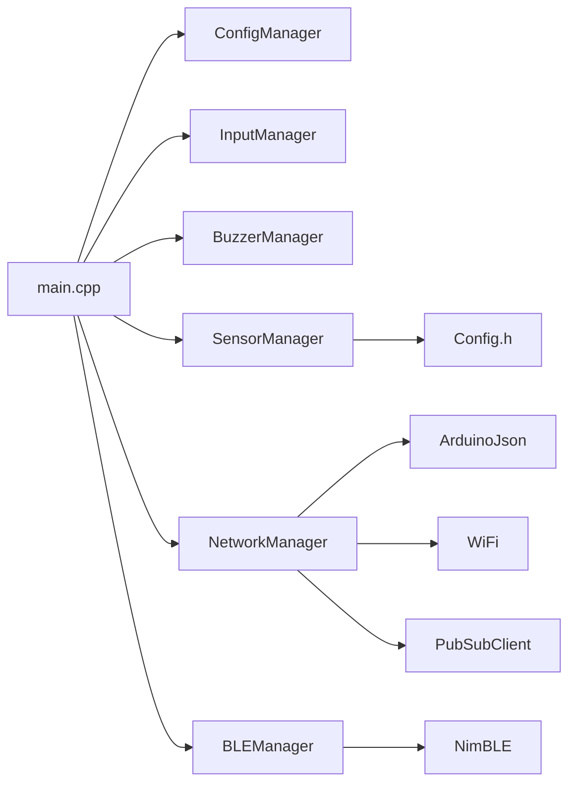

**Diagram sources**
- [main.cpp:1-15](file://firmware/M5StickCPlus2/src/main.cpp#L1-L15)
- [SensorManager.cpp:1-3](file://firmware/M5StickCPlus2/src/managers/SensorManager.cpp#L1-L3)
- [NetworkManager.cpp:1-4](file://firmware/M5StickCPlus2/src/managers/NetworkManager.cpp#L1-L4)
- [BLEManager.cpp:1-4](file://firmware/M5StickCPlus2/src/managers/BLEManager.cpp#L1-L4)

**Section sources**
- [main.cpp:1-15](file://firmware/M5StickCPlus2/src/main.cpp#L1-L15)
- [platformio.ini:15-18](file://firmware/M5StickCPlus2/platformio.ini#L15-L18)

## Performance Considerations
- Power-aware scheduling: longer delays and reduced intervals when LCD is off or device is idle.
- Wi-Fi sleep enabled to reduce idle current.
- EMA filtering and deadband on gyro minimize noise and unnecessary motion computation.
- Exponential backoff for Wi-Fi/MQTT reconnections prevents busy loops.
- BLE scan uses controlled intervals and a separate task to avoid blocking the main loop.

[No sources needed since this section provides general guidance]

## Troubleshooting Guide
Common issues and resolutions:
- No telemetry published:
  - Verify Wi-Fi connection and MQTT broker reachability.
  - Confirm device is not in AP portal scene.
  - Check publish interval logic and NTP sync for timestamps.
- Incorrect motion readings:
  - Recalibrate gyro via SensorManager recalibration.
  - Ensure wheel radius is set appropriately in configuration.
- BLE nodes not appearing:
  - Ensure BLE scan task is running and advertisements match WSN_XXX naming.
  - Verify scan intervals and staleness thresholds.
- LCD not responding to buttons:
  - Confirm activity registration is triggered by button presses.
  - Check display mode and sleep suppression flags.
- Battery percentage instability:
  - Allow filtering to settle; charging state debounce prevents flicker.

**Section sources**
- [main.cpp:265-336](file://firmware/M5StickCPlus2/src/main.cpp#L265-L336)
- [SensorManager.cpp:231-259](file://firmware/M5StickCPlus2/src/managers/SensorManager.cpp#L231-L259)
- [BLEManager.cpp:110-121](file://firmware/M5StickCPlus2/src/managers/BLEManager.cpp#L110-L121)
- [NetworkManager.cpp:58-94](file://firmware/M5StickCPlus2/src/managers/NetworkManager.cpp#L58-L94)

## Conclusion
The M5StickCPlus2 implementation provides a robust, power-efficient foundation for wheelchair telemetry. Its modular manager architecture cleanly separates concerns, while adaptive intervals and power-aware logic extend battery life. The sensor fusion pipeline delivers reliable motion metrics, and the telemetry system publishes structured JSON payloads enriched with BLE fingerprints. The state machine and input handling enable intuitive user control, and configuration management supports remote updates.

[No sources needed since this section summarizes without analyzing specific files]

## Appendices

### Practical Examples
- Integrating a new IMU axis:
  - Extend SensorData with the new field and update updateIMU() to populate it.
  - Include the field in telemetry payload assembly.
- Customizing buzzer tones:
  - Add new beep variants in BuzzerManager and trigger from input or state changes.
- Adjusting power thresholds:
  - Modify timeouts and brightness levels in Config.h and observe behavior in updateLCDPower().
- Remote control via MQTT:
  - Send control commands to the device-specific control topic to start/stop recording or trigger reboot.

[No sources needed since this section provides general guidance]