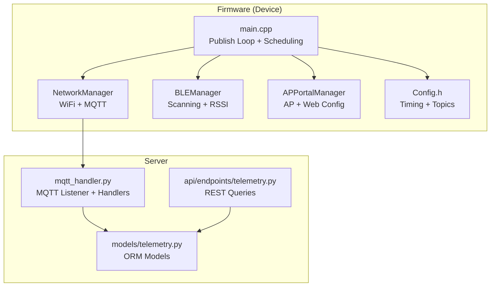
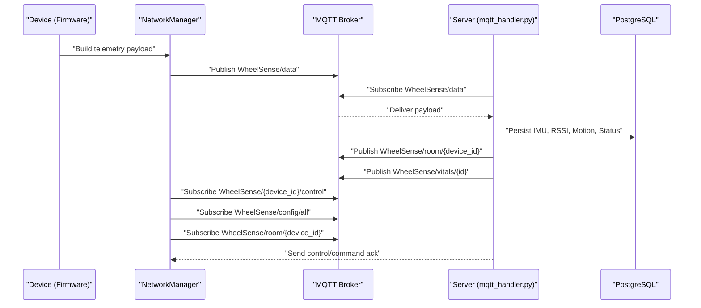
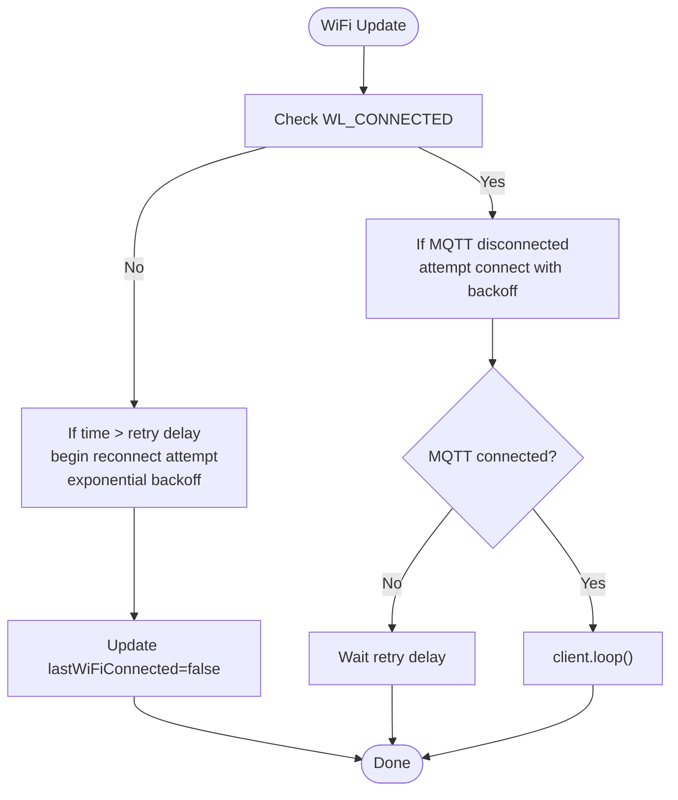
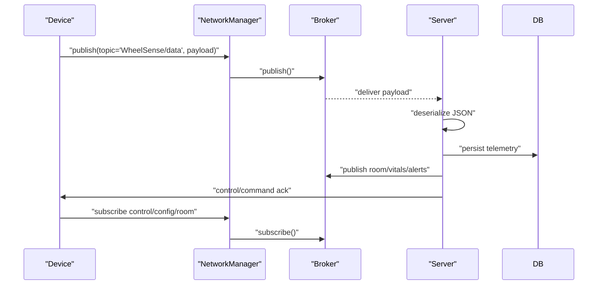
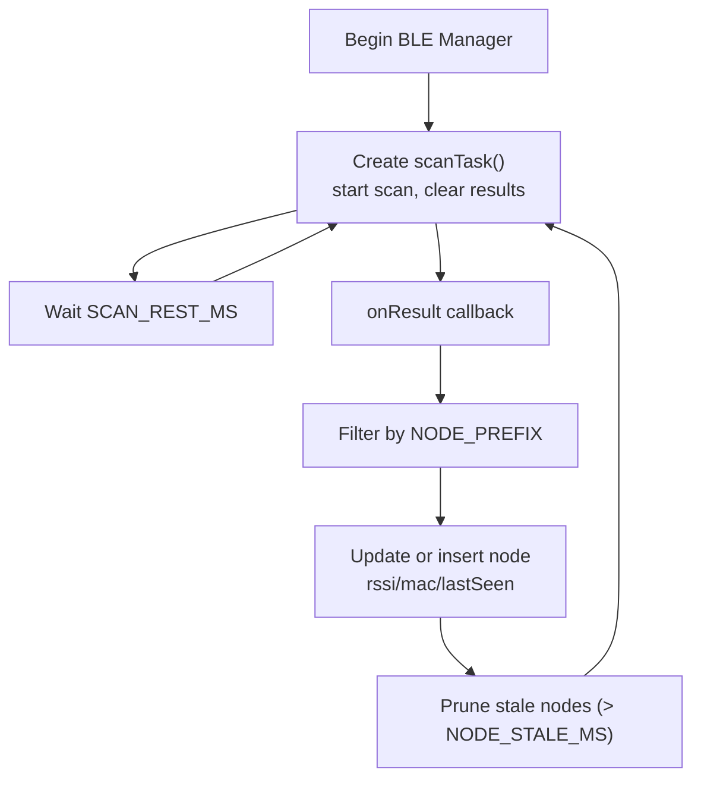
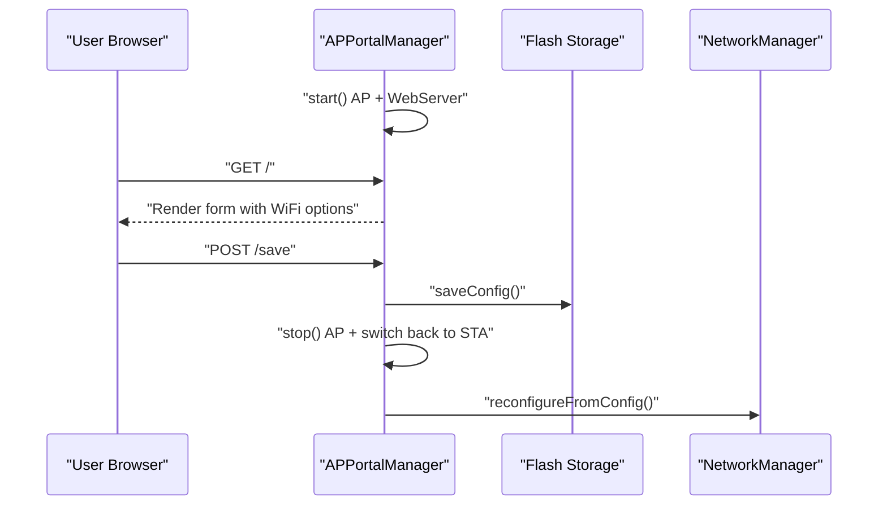
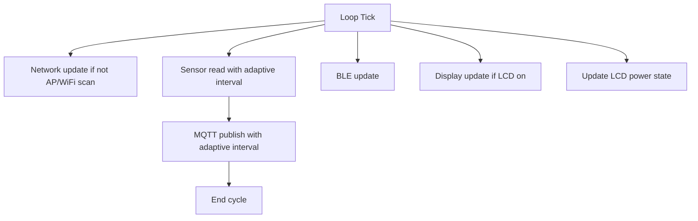
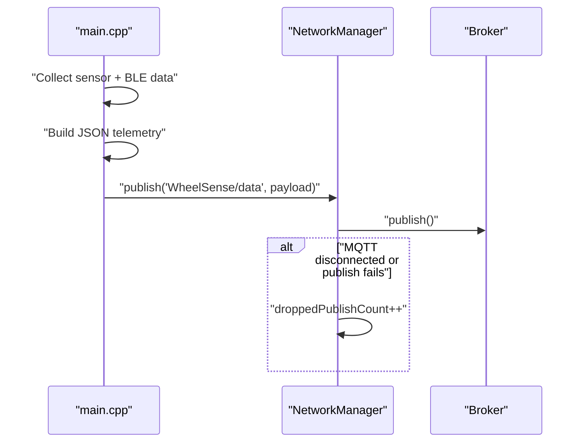
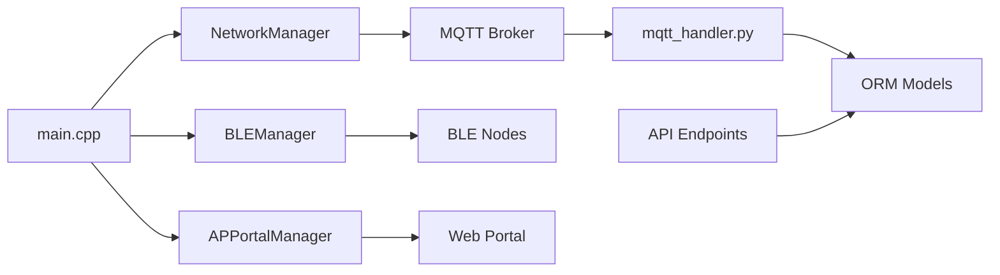

# Networking & Communication

<cite>
**Referenced Files in This Document**
- [NetworkManager.h](file://firmware/M5StickCPlus2/src/managers/NetworkManager.h)
- [NetworkManager.cpp](file://firmware/M5StickCPlus2/src/managers/NetworkManager.cpp)
- [BLEManager.h](file://firmware/M5StickCPlus2/src/managers/BLEManager.h)
- [BLEManager.cpp](file://firmware/M5StickCPlus2/src/managers/BLEManager.cpp)
- [APPortalManager.h](file://firmware/M5StickCPlus2/src/managers/APPortalManager.h)
- [APPortalManager.cpp](file://firmware/M5StickCPlus2/src/managers/APPortalManager.cpp)
- [Config.h](file://firmware/M5StickCPlus2/src/Config.h)
- [main.cpp](file://firmware/M5StickCPlus2/src/main.cpp)
- [TELEMETRY_CONTRACT.md](file://firmware/TELEMETRY_CONTRACT.md)
- [mqtt_handler.py](file://server/app/mqtt_handler.py)
- [telemetry.py](file://server/app/models/telemetry.py)
- [telemetry.py (API)](file://server/app/api/endpoints/telemetry.py)
</cite>

## Table of Contents
1. [Introduction](#introduction)
2. [Project Structure](#project-structure)
3. [Core Components](#core-components)
4. [Architecture Overview](#architecture-overview)
5. [Detailed Component Analysis](#detailed-component-analysis)
6. [Dependency Analysis](#dependency-analysis)
7. [Performance Considerations](#performance-considerations)
8. [Troubleshooting Guide](#troubleshooting-guide)
9. [Conclusion](#conclusion)
10. [Appendices](#appendices)

## Introduction
This document explains the networking and communication systems of the WheelSense platform. It covers WiFi connectivity management, MQTT telemetry publishing and control, BLE scanning for RSSI data and proximity tracking, the Access Point (AP) portal for device configuration, and the adaptive network update scheduling. It also documents the telemetry payload contract, error handling, and operational guidance for extending and troubleshooting the communication protocols.

## Project Structure
The networking stack spans two domains:
- Firmware (device): Implements WiFi, MQTT, BLE scanning, AP portal, and telemetry publishing.
- Server: Consumes MQTT telemetry, persists structured data, and publishes derived topics (e.g., room predictions, vitals).

**Diagram sources**
- [NetworkManager.cpp:12-32](file://firmware/M5StickCPlus2/src/managers/NetworkManager.cpp#L12-L32)
- [BLEManager.cpp:66-94](file://firmware/M5StickCPlus2/src/managers/BLEManager.cpp#L66-L94)
- [APPortalManager.cpp:120-171](file://firmware/M5StickCPlus2/src/managers/APPortalManager.cpp#L120-L171)
- [Config.h:44-76](file://firmware/M5StickCPlus2/src/Config.h#L44-L76)
- [main.cpp:153-340](file://firmware/M5StickCPlus2/src/main.cpp#L153-L340)
- [mqtt_handler.py:73-137](file://server/app/mqtt_handler.py#L73-L137)
- [telemetry.py:20-130](file://server/app/models/telemetry.py#L20-L130)
- [telemetry.py (API):15-73](file://server/app/api/endpoints/telemetry.py#L15-L73)

**Section sources**
- [NetworkManager.h:8-58](file://firmware/M5StickCPlus2/src/managers/NetworkManager.h#L8-L58)
- [BLEManager.h:19-50](file://firmware/M5StickCPlus2/src/managers/BLEManager.h#L19-L50)
- [APPortalManager.h:9-30](file://firmware/M5StickCPlus2/src/managers/APPortalManager.h#L9-L30)
- [Config.h:15-76](file://firmware/M5StickCPlus2/src/Config.h#L15-L76)
- [main.cpp:123-340](file://firmware/M5StickCPlus2/src/main.cpp#L123-L340)
- [mqtt_handler.py:73-137](file://server/app/mqtt_handler.py#L73-L137)
- [telemetry.py:20-130](file://server/app/models/telemetry.py#L20-L130)
- [telemetry.py (API):15-73](file://server/app/api/endpoints/telemetry.py#L15-L73)

## Core Components
- NetworkManager: Manages WiFi connection, MQTT client lifecycle, reconnection backoff, topic subscriptions, and telemetry publishing.
- BLEManager: Performs BLE scanning, filters nodes by a naming convention, aggregates RSSI samples, and exposes thread-safe node lists.
- APPortalManager: Starts an AP with a captive web portal, collects configuration, saves to persistent storage, and triggers reconfiguration.
- main loop: Orchestrates sensor reads, BLE updates, display power management, and MQTT publish scheduling with adaptive intervals.
- Server MQTT handler: Subscribes to topics, parses telemetry, persists structured data, and publishes derived topics (room, vitals, alerts).

**Section sources**
- [NetworkManager.cpp:58-94](file://firmware/M5StickCPlus2/src/managers/NetworkManager.cpp#L58-L94)
- [BLEManager.cpp:96-108](file://firmware/M5StickCPlus2/src/managers/BLEManager.cpp#L96-L108)
- [APPortalManager.cpp:120-196](file://firmware/M5StickCPlus2/src/managers/APPortalManager.cpp#L120-L196)
- [main.cpp:153-340](file://firmware/M5StickCPlus2/src/main.cpp#L153-L340)
- [mqtt_handler.py:73-137](file://server/app/mqtt_handler.py#L73-L137)

## Architecture Overview
The system follows a publish-subscribe pattern:
- Device publishes telemetry to a data topic and subscribes to control and configuration topics.
- Server consumes telemetry, persists it, and publishes room predictions and vitals.
- Device can receive control commands and configuration updates over MQTT and apply them dynamically.

**Diagram sources**
- [TELEMETRY_CONTRACT.md:7-13](file://firmware/TELEMETRY_CONTRACT.md#L7-L13)
- [NetworkManager.cpp:117-127](file://firmware/M5StickCPlus2/src/managers/NetworkManager.cpp#L117-L127)
- [mqtt_handler.py:100-125](file://server/app/mqtt_handler.py#L100-L125)
- [telemetry.py:20-130](file://server/app/models/telemetry.py#L20-L130)

## Detailed Component Analysis

### WiFi Connectivity Management
- Initialization sets station mode and applies sleep settings for power saving.
- Reconnection logic adapts retry delays with exponential backoff when disconnected.
- WiFi scan APIs are exposed for UI and AP portal to discover networks.
- Disconnect clears MQTT and WiFi state and resets retry timers.

**Diagram sources**
- [NetworkManager.cpp:58-94](file://firmware/M5StickCPlus2/src/managers/NetworkManager.cpp#L58-L94)

**Section sources**
- [NetworkManager.cpp:12-32](file://firmware/M5StickCPlus2/src/managers/NetworkManager.cpp#L12-L32)
- [NetworkManager.cpp:58-94](file://firmware/M5StickCPlus2/src/managers/NetworkManager.cpp#L58-L94)
- [NetworkManager.h:14-29](file://firmware/M5StickCPlus2/src/managers/NetworkManager.h#L14-L29)

### MQTT Communication Protocol
- Topics:
  - Publish: data topic for telemetry.
  - Subscribe: per-device control, config (per-device and broadcast), and room assignment.
- Message serialization uses JSON with ArduinoJson on the device and Python JSON on the server.
- Connection handling:
  - Client ID is derived from device name plus random suffix.
  - Authentication supported via user/password.
  - Keep-alive and socket timeout configured.
- Acknowledgement: device responds to control commands with an ack payload.

**Diagram sources**
- [TELEMETRY_CONTRACT.md:7-13](file://firmware/TELEMETRY_CONTRACT.md#L7-L13)
- [NetworkManager.cpp:96-133](file://firmware/M5StickCPlus2/src/managers/NetworkManager.cpp#L96-L133)
- [mqtt_handler.py:100-125](file://server/app/mqtt_handler.py#L100-L125)

**Section sources**
- [NetworkManager.cpp:96-133](file://firmware/M5StickCPlus2/src/managers/NetworkManager.cpp#L96-L133)
- [TELEMETRY_CONTRACT.md:7-13](file://firmware/TELEMETRY_CONTRACT.md#L7-L13)
- [mqtt_handler.py:139-325](file://server/app/mqtt_handler.py#L139-L325)

### BLE Scanning System
- BLE scanning runs continuously on a dedicated task with active scanning enabled.
- Advertisements are filtered by a naming prefix and normalized to a canonical node key.
- RSSI samples are aggregated into a fixed-size buffer with timestamps and MAC addresses.
- Stale entries are periodically pruned to maintain freshness.

**Diagram sources**
- [BLEManager.cpp:110-121](file://firmware/M5StickCPlus2/src/managers/BLEManager.cpp#L110-L121)
- [BLEManager.cpp:33-62](file://firmware/M5StickCPlus2/src/managers/BLEManager.cpp#L33-L62)
- [BLEManager.cpp:96-108](file://firmware/M5StickCPlus2/src/managers/BLEManager.cpp#L96-L108)

**Section sources**
- [BLEManager.h:19-50](file://firmware/M5StickCPlus2/src/managers/BLEManager.h#L19-L50)
- [BLEManager.cpp:66-94](file://firmware/M5StickCPlus2/src/managers/BLEManager.cpp#L66-L94)
- [BLEManager.cpp:110-121](file://firmware/M5StickCPlus2/src/managers/BLEManager.cpp#L110-L121)
- [BLEManager.cpp:140-147](file://firmware/M5StickCPlus2/src/managers/BLEManager.cpp#L140-L147)

### AP Portal Functionality
- Starts an AP with a generated SSID and serves a captive web portal.
- Scans WiFi networks and populates the form with discovered SSIDs.
- Accepts configuration submissions, saves to persistent storage, and triggers reconfiguration.
- Stops AP and returns to station mode after saving.

**Diagram sources**
- [APPortalManager.cpp:120-171](file://firmware/M5StickCPlus2/src/managers/APPortalManager.cpp#L120-L171)
- [APPortalManager.cpp:224-248](file://firmware/M5StickCPlus2/src/managers/APPortalManager.cpp#L224-L248)
- [APPortalManager.cpp:173-190](file://firmware/M5StickCPlus2/src/managers/APPortalManager.cpp#L173-L190)

**Section sources**
- [APPortalManager.h:9-30](file://firmware/M5StickCPlus2/src/managers/APPortalManager.h#L9-L30)
- [APPortalManager.cpp:120-196](file://firmware/M5StickCPlus2/src/managers/APPortalManager.cpp#L120-L196)
- [APPortalManager.cpp:224-248](file://firmware/M5StickCPlus2/src/managers/APPortalManager.cpp#L224-L248)

### Network Update Scheduling and Adaptive Intervals
- The main loop schedules:
  - Network updates (skipped during AP portal and WiFi scan scenes).
  - Sensor reads with adaptive rates based on recording state and display power mode.
  - BLE updates at a fixed interval.
  - MQTT publishes with adaptive intervals depending on recording and display state.
- Power-saving modes adjust sensor sampling and loop delays when idle or LCD is off.

**Diagram sources**
- [main.cpp:189-219](file://firmware/M5StickCPlus2/src/main.cpp#L189-L219)
- [main.cpp:265-269](file://firmware/M5StickCPlus2/src/main.cpp#L265-L269)
- [Config.h:68-76](file://firmware/M5StickCPlus2/src/Config.h#L68-L76)

**Section sources**
- [main.cpp:189-219](file://firmware/M5StickCPlus2/src/main.cpp#L189-L219)
- [main.cpp:265-269](file://firmware/M5StickCPlus2/src/main.cpp#L265-L269)
- [Config.h:44-76](file://firmware/M5StickCPlus2/src/Config.h#L44-L76)

### Telemetry Publishing System
- Payload structure includes device identity, firmware version, sequence number, timestamp, IMU, motion, recording state, RSSI list, and battery metrics.
- Timestamp handling uses UTC ISO format when NTP sync succeeds; otherwise omitted.
- Sequence numbering increments per publish.
- Error handling tracks dropped publishes when MQTT is disconnected or publish fails.

**Diagram sources**
- [main.cpp:275-333](file://firmware/M5StickCPlus2/src/main.cpp#L275-L333)
- [NetworkManager.cpp:276-282](file://firmware/M5StickCPlus2/src/managers/NetworkManager.cpp#L276-L282)
- [TELEMETRY_CONTRACT.md:15-23](file://firmware/TELEMETRY_CONTRACT.md#L15-L23)

**Section sources**
- [main.cpp:275-333](file://firmware/M5StickCPlus2/src/main.cpp#L275-L333)
- [NetworkManager.cpp:276-282](file://firmware/M5StickCPlus2/src/managers/NetworkManager.cpp#L276-L282)
- [TELEMETRY_CONTRACT.md:15-23](file://firmware/TELEMETRY_CONTRACT.md#L15-L23)

### Network State Management During AP Portal Activation and WiFi Scans
- Network updates are intentionally skipped while AP portal is active to avoid interfering with AP operation.
- WiFi scan scenes similarly pause network updates to ensure reliable scanning.

**Section sources**
- [main.cpp:189-195](file://firmware/M5StickCPlus2/src/main.cpp#L189-L195)

## Dependency Analysis
- Firmware dependencies:
  - NetworkManager depends on WiFiClient and PubSubClient for MQTT.
  - BLEManager depends on NimBLE scanning APIs and FreeRTOS primitives.
  - APPortalManager depends on WebServer and WiFi AP mode.
  - main orchestrates all managers and timing.
- Server dependencies:
  - mqtt_handler subscribes to topics and dispatches to handlers.
  - ORM models define persistence schema for telemetry and related entities.
  - API endpoints expose queries for IMU and RSSI data.

**Diagram sources**
- [main.cpp:123-151](file://firmware/M5StickCPlus2/src/main.cpp#L123-L151)
- [NetworkManager.cpp:8-10](file://firmware/M5StickCPlus2/src/managers/NetworkManager.cpp#L8-L10)
- [BLEManager.cpp:1-5](file://firmware/M5StickCPlus2/src/managers/BLEManager.cpp#L1-L5)
- [APPortalManager.cpp:1-5](file://firmware/M5StickCPlus2/src/managers/APPortalManager.cpp#L1-L5)
- [mqtt_handler.py:73-137](file://server/app/mqtt_handler.py#L73-L137)
- [telemetry.py:20-130](file://server/app/models/telemetry.py#L20-L130)
- [telemetry.py (API):15-73](file://server/app/api/endpoints/telemetry.py#L15-L73)

**Section sources**
- [NetworkManager.cpp:8-10](file://firmware/M5StickCPlus2/src/managers/NetworkManager.cpp#L8-L10)
- [BLEManager.cpp:1-5](file://firmware/M5StickCPlus2/src/managers/BLEManager.cpp#L1-L5)
- [APPortalManager.cpp:1-5](file://firmware/M5StickCPlus2/src/managers/APPortalManager.cpp#L1-L5)
- [mqtt_handler.py:73-137](file://server/app/mqtt_handler.py#L73-L137)
- [telemetry.py:20-130](file://server/app/models/telemetry.py#L20-L130)
- [telemetry.py (API):15-73](file://server/app/api/endpoints/telemetry.py#L15-L73)

## Performance Considerations
- Exponential backoff prevents network storms during repeated reconnections.
- Adaptive publish intervals reduce bandwidth and CPU when idle or LCD is off.
- BLE scanning uses active scanning and tuned intervals to balance discovery speed and power.
- Power-saving settings enable modem sleep and reduced display brightness.

[No sources needed since this section provides general guidance]

## Troubleshooting Guide
- WiFi connectivity issues:
  - Verify credentials and broker endpoint; check reconnection attempts and retry delays.
  - Use scan APIs to confirm network visibility and signal strength.
- MQTT problems:
  - Confirm subscription topics and client credentials.
  - Inspect dropped publish counts and MQTT state logs.
- BLE discovery:
  - Ensure advertisements use the expected naming prefix and are not filtered.
  - Check scan task status and mutex acquisition.
- AP portal:
  - Confirm AP SSID generation and captive portal routing.
  - Validate configuration save and reconfigureFromConfig behavior.

**Section sources**
- [NetworkManager.cpp:58-94](file://firmware/M5StickCPlus2/src/managers/NetworkManager.cpp#L58-L94)
- [NetworkManager.cpp:276-282](file://firmware/M5StickCPlus2/src/managers/NetworkManager.cpp#L276-L282)
- [BLEManager.cpp:110-121](file://firmware/M5StickCPlus2/src/managers/BLEManager.cpp#L110-L121)
- [APPortalManager.cpp:120-196](file://firmware/M5StickCPlus2/src/managers/APPortalManager.cpp#L120-L196)

## Conclusion
The networking stack integrates robust WiFi and MQTT connectivity, efficient BLE scanning, and a user-friendly AP portal for configuration. The server-side handler transforms raw telemetry into structured insights, enabling room prediction, vitals ingestion, and alerting. Adaptive scheduling and power-aware design ensure reliability and longevity in real-world deployments.

[No sources needed since this section summarizes without analyzing specific files]

## Appendices

### Practical Examples

- MQTT topic configuration
  - Data publishing: use the data topic defined in the telemetry contract.
  - Control and config subscriptions: subscribe to per-device control and broadcast config topics.
  - Room and vitals: listen for room predictions and vitals topics for downstream processing.

  **Section sources**
  - [TELEMETRY_CONTRACT.md:7-13](file://firmware/TELEMETRY_CONTRACT.md#L7-L13)
  - [NetworkManager.cpp:117-127](file://firmware/M5StickCPlus2/src/managers/NetworkManager.cpp#L117-L127)
  - [mqtt_handler.py:100-125](file://server/app/mqtt_handler.py#L100-L125)

- Customizing BLE scanning parameters
  - Adjust scan interval/window and rest period to trade off discovery latency vs. power.
  - Tune node staleness threshold to filter transient entries.

  **Section sources**
  - [BLEManager.cpp:88-91](file://firmware/M5StickCPlus2/src/managers/BLEManager.cpp#L88-L91)
  - [BLEManager.cpp:46-47](file://firmware/M5StickCPlus2/src/managers/BLEManager.cpp#L46-L47)

- Troubleshooting network connectivity issues
  - Monitor WiFi reconnection attempts and exponential backoff behavior.
  - Validate MQTT keep-alive and socket timeouts.
  - Temporarily disable AP portal and WiFi scan scenes to isolate issues.

  **Section sources**
  - [NetworkManager.cpp:58-94](file://firmware/M5StickCPlus2/src/managers/NetworkManager.cpp#L58-L94)
  - [Config.h:44-49](file://firmware/M5StickCPlus2/src/Config.h#L44-L49)

- Extending communication protocols
  - Add new MQTT topics and handlers on the server; update device subscriptions and publishers accordingly.
  - Define new telemetry fields and ensure both sides serialize/deserialize consistently.

  **Section sources**
  - [TELEMETRY_CONTRACT.md:15-23](file://firmware/TELEMETRY_CONTRACT.md#L15-L23)
  - [mqtt_handler.py:139-325](file://server/app/mqtt_handler.py#L139-L325)