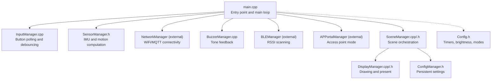
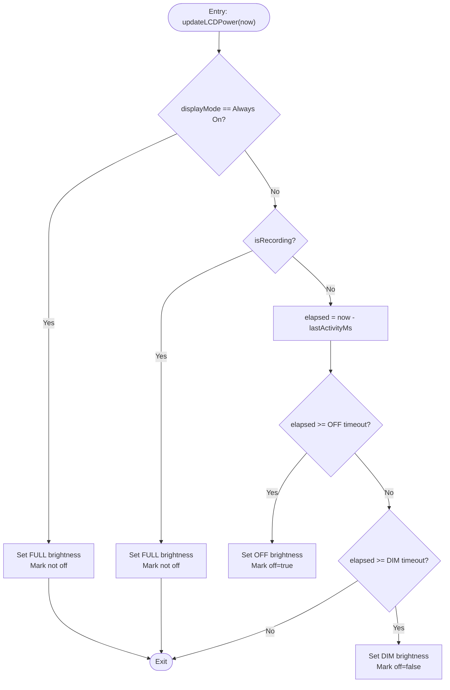
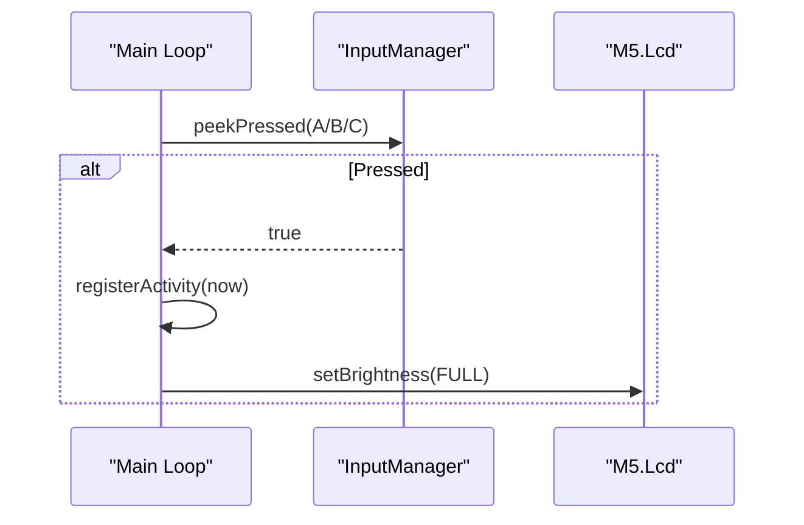
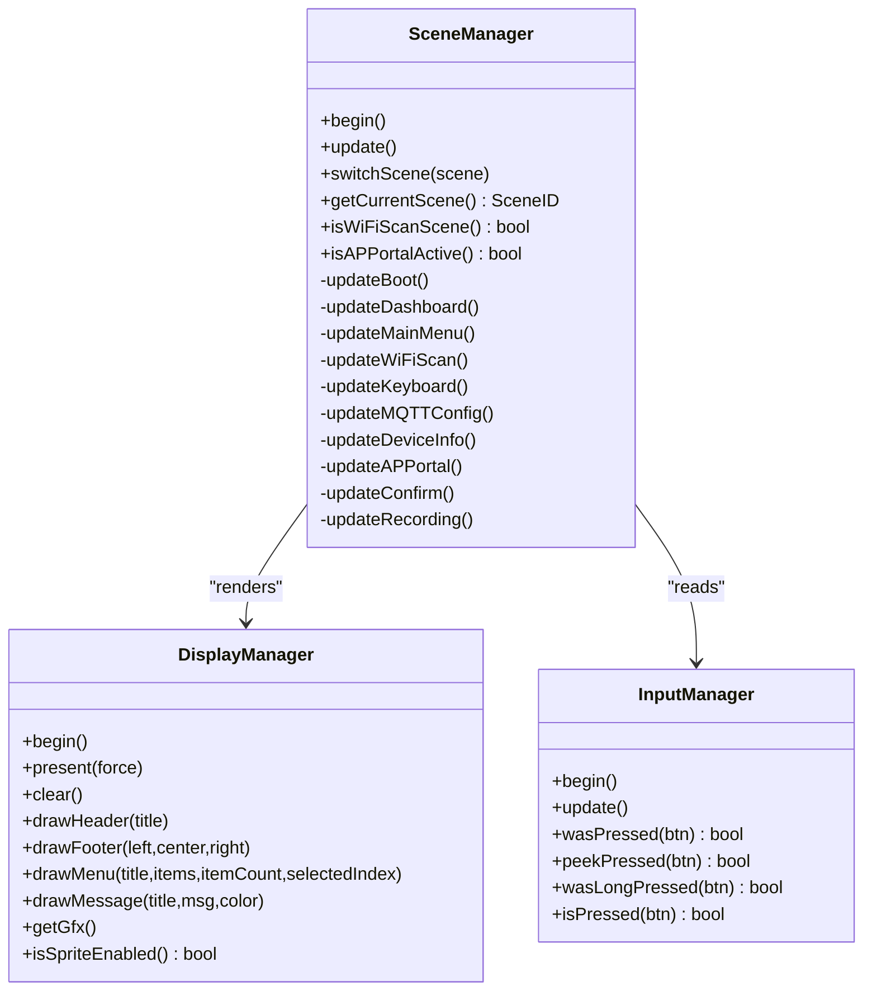
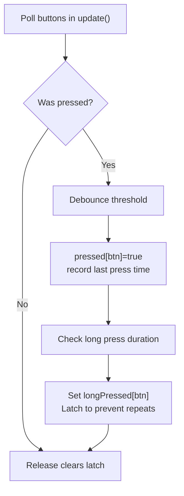
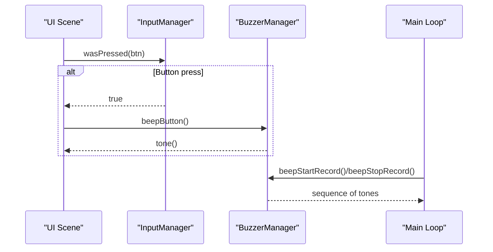
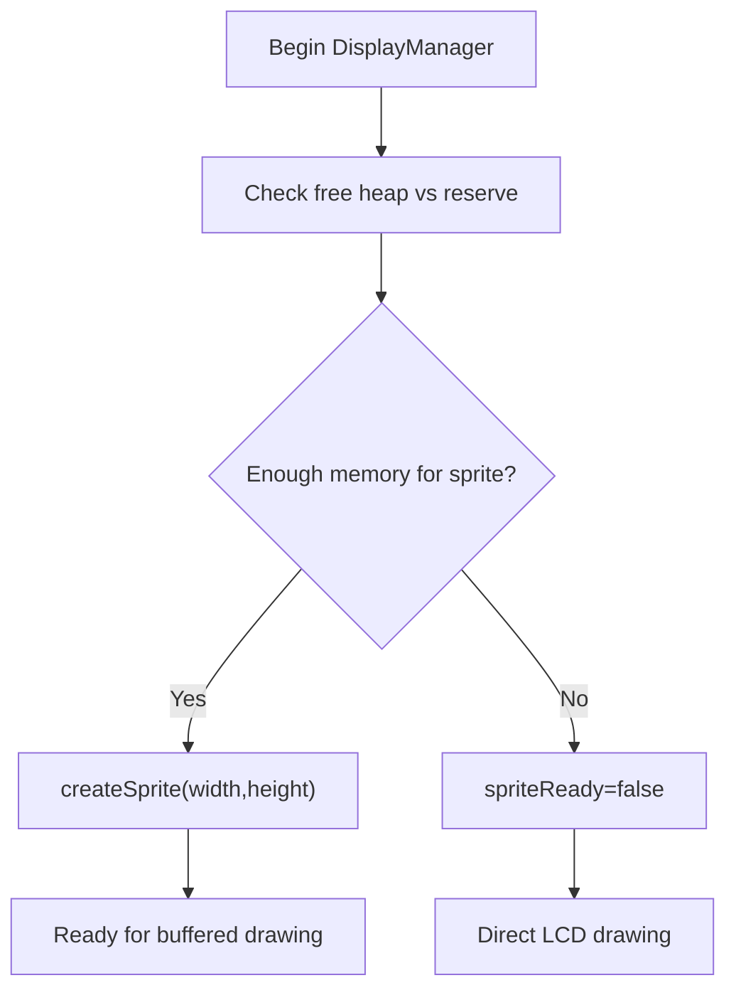
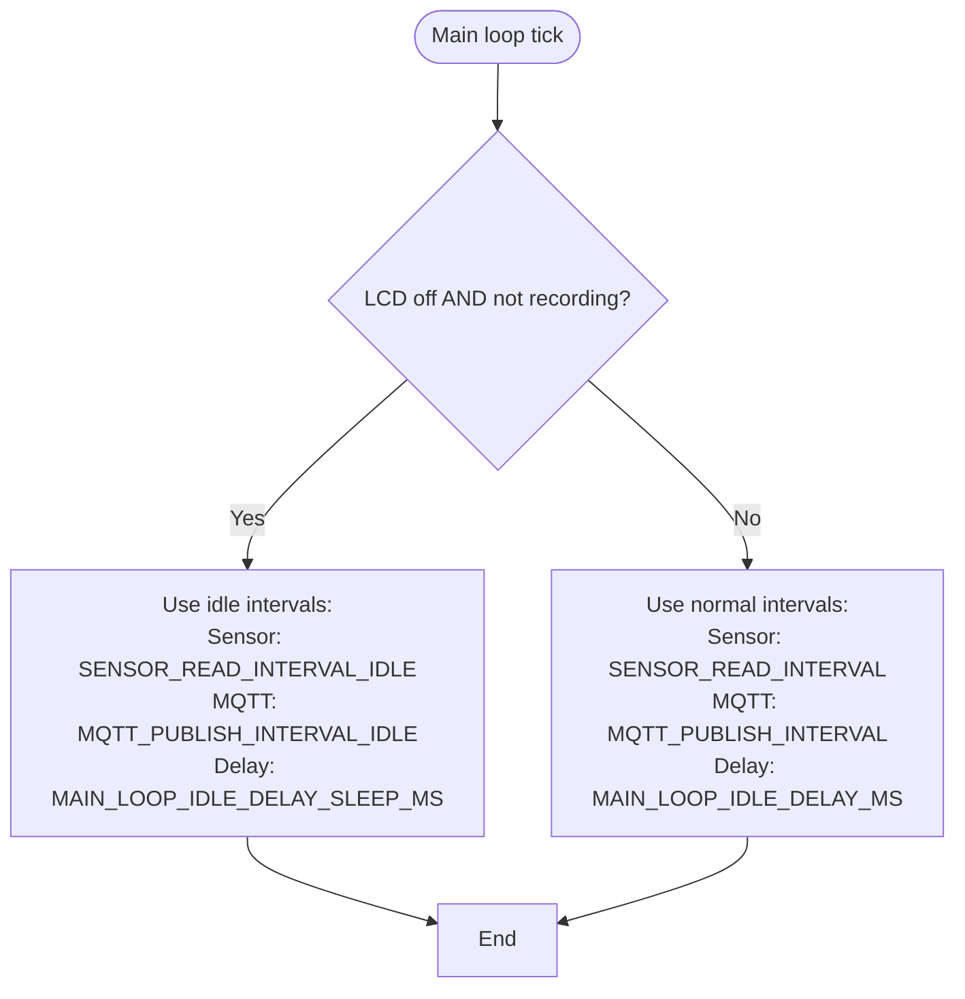
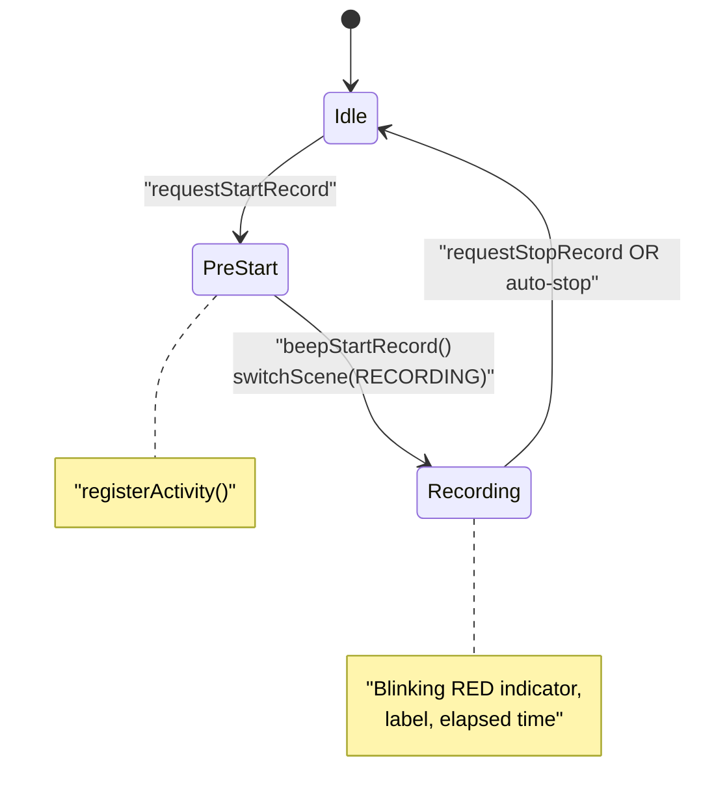
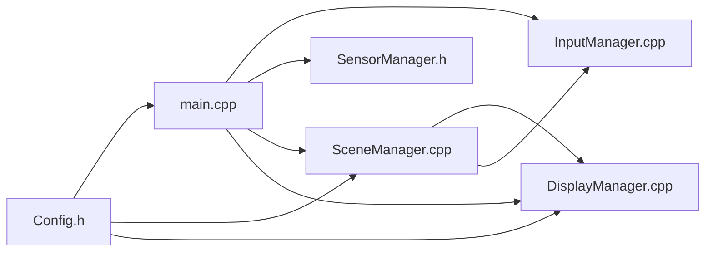

# Power Management & User Interface

<cite>
**Referenced Files in This Document**
- [main.cpp](file://firmware/M5StickCPlus2/src/main.cpp)
- [Config.h](file://firmware/M5StickCPlus2/src/Config.h)
- [DisplayManager.h](file://firmware/M5StickCPlus2/src/ui/DisplayManager.h)
- [DisplayManager.cpp](file://firmware/M5StickCPlus2/src/ui/DisplayManager.cpp)
- [SceneManager.h](file://firmware/M5StickCPlus2/src/ui/SceneManager.h)
- [SceneManager.cpp](file://firmware/M5StickCPlus2/src/ui/SceneManager.cpp)
- [InputManager.h](file://firmware/M5StickCPlus2/src/managers/InputManager.h)
- [InputManager.cpp](file://firmware/M5StickCPlus2/src/managers/InputManager.cpp)
- [BuzzerManager.h](file://firmware/M5StickCPlus2/src/managers/BuzzerManager.h)
- [BuzzerManager.cpp](file://firmware/M5StickCPlus2/src/managers/BuzzerManager.cpp)
- [ConfigManager.h](file://firmware/M5StickCPlus2/src/managers/ConfigManager.h)
- [SensorManager.h](file://firmware/M5StickCPlus2/src/managers/SensorManager.h)
</cite>

## Table of Contents
1. [Introduction](#introduction)
2. [Project Structure](#project-structure)
3. [Core Components](#core-components)
4. [Architecture Overview](#architecture-overview)
5. [Detailed Component Analysis](#detailed-component-analysis)
6. [Dependency Analysis](#dependency-analysis)
7. [Performance Considerations](#performance-considerations)
8. [Troubleshooting Guide](#troubleshooting-guide)
9. [Conclusion](#conclusion)
10. [Appendices](#appendices)

## Introduction
This document explains the power management and user interface systems of the device firmware. It covers LCD power management (brightness control, automatic dim/off timers, manual sleep), activity-based power management (lastActivityMs tracking and user interaction detection), scene management (dashboard, recording, and UI transitions), button input handling (A/B/C processing, long press detection, activity registration), buzzer feedback (recording start/stop and user feedback), display buffer management and static allocation strategies, and power optimization techniques (sleep modes, reduced update frequencies, adaptive delays). Practical examples are included for customizing power settings, modifying UI scenes, implementing custom button behaviors, and optimizing battery life.

## Project Structure
The firmware is organized around a main loop coordinating managers and UI scenes. Managers encapsulate hardware and protocol concerns (input, sensors, network, buzzer, configuration). The UI subsystem renders scenes and manages display buffers efficiently.



**Diagram sources**
- [main.cpp:123-151](file://firmware/M5StickCPlus2/src/main.cpp#L123-L151)
- [InputManager.cpp:12-55](file://firmware/M5StickCPlus2/src/managers/InputManager.cpp#L12-L55)
- [SensorManager.h:28-71](file://firmware/M5StickCPlus2/src/managers/SensorManager.h#L28-L71)
- [SceneManager.cpp:12-25](file://firmware/M5StickCPlus2/src/ui/SceneManager.cpp#L12-L25)
- [DisplayManager.cpp:7-36](file://firmware/M5StickCPlus2/src/ui/DisplayManager.cpp#L7-L36)
- [Config.h:43-76](file://firmware/M5StickCPlus2/src/Config.h#L43-L76)

**Section sources**
- [main.cpp:123-151](file://firmware/M5StickCPlus2/src/main.cpp#L123-L151)
- [Config.h:43-76](file://firmware/M5StickCPlus2/src/Config.h#L43-L76)

## Core Components
- Power management and activity tracking:
  - Activity registration via lastActivityMs and immediate brightness restoration.
  - LCD power policy controlled by displayMode and timeouts.
  - Manual sleep control from the dashboard.
- Scene management:
  - Dashboard, main menu, WiFi scan, keyboard, MQTT config, device info, AP portal, confirmation, and recording scenes.
  - UI state transitions driven by button events and external state.
- Button input handling:
  - Debounced presses, long press detection, and activity registration.
- Buzzer feedback:
  - Button, success/error, and recording start/stop tones.
- Display buffer management:
  - Static allocation to prevent stack overflow and dynamic sprite enablement based on heap availability.
- Power optimization:
  - WiFi sleep enabled, adaptive sensor and publish intervals, reduced main loop idle delay when sleeping.

**Section sources**
- [main.cpp:73-121](file://firmware/M5StickCPlus2/src/main.cpp#L73-L121)
- [SceneManager.h:12-23](file://firmware/M5StickCPlus2/src/ui/SceneManager.h#L12-L23)
- [InputManager.h:6-11](file://firmware/M5StickCPlus2/src/managers/InputManager.h#L6-L11)
- [BuzzerManager.cpp:16-44](file://firmware/M5StickCPlus2/src/managers/BuzzerManager.cpp#L16-L44)
- [DisplayManager.cpp:17-36](file://firmware/M5StickCPlus2/src/ui/DisplayManager.cpp#L17-L36)
- [Config.h:61-76](file://firmware/M5StickCPlus2/src/Config.h#L61-L76)

## Architecture Overview
The main loop orchestrates input, sensors, networking, and UI rendering. It applies power policies to control LCD brightness and update rates, and coordinates state machines for recording and scene transitions.

```mermaid
sequenceDiagram
participant Loop as "Main Loop"
participant Input as "InputManager"
participant Scene as "SceneManager"
participant Disp as "DisplayManager"
participant LCD as "M5.Lcd"
Loop->>Input : update()
alt Button pressed
Input-->>Loop : wasPressed(btn)
Loop->>Loop : registerActivity(now)
Loop->>LCD : setBrightness(FULL/DIM/OFF)
end
Loop->>Scene : update()
Scene->>Disp : present()
alt LCD off
Disp-->>Scene : skip expensive redraw
else LCD on
Scene->>Disp : draw header/footer/menu/message
end
Loop->>Loop : updateLCDPower(now)
alt Always On
Loop->>LCD : FULL
else Recording
Loop->>LCD : FULL
else Timeout reached
Loop->>LCD : OFF
else Dim timeout
Loop->>LCD : DIM
end
```

**Diagram sources**
- [main.cpp:153-220](file://firmware/M5StickCPlus2/src/main.cpp#L153-L220)
- [InputManager.cpp:12-55](file://firmware/M5StickCPlus2/src/managers/InputManager.cpp#L12-L55)
- [SceneManager.cpp:79-93](file://firmware/M5StickCPlus2/src/ui/SceneManager.cpp#L79-L93)
- [DisplayManager.cpp:38-46](file://firmware/M5StickCPlus2/src/ui/DisplayManager.cpp#L38-L46)

## Detailed Component Analysis

### LCD Power Management
- Brightness levels: FULL, DIM, OFF.
- Timers: dim after configured timeout, turn off after longer timeout.
- Modes:
  - Always On: override auto-dim/off.
  - Auto Sleep: apply dim/off logic based on inactivity and recording state.
- Manual sleep: dashboard button triggers immediate blanking and anchors idle timer.



**Diagram sources**
- [main.cpp:82-121](file://firmware/M5StickCPlus2/src/main.cpp#L82-L121)
- [Config.h:61-66](file://firmware/M5StickCPlus2/src/Config.h#L61-L66)

**Section sources**
- [main.cpp:73-121](file://firmware/M5StickCPlus2/src/main.cpp#L73-L121)
- [Config.h:61-76](file://firmware/M5StickCPlus2/src/Config.h#L61-L76)

### Activity-Based Power Management
- lastActivityMs tracks the latest user interaction or manual wake.
- registerActivity resets brightness to FULL and updates lastActivityMs.
- Suppresses unintended sleep when waking from DIM with A button on dashboard.



**Diagram sources**
- [main.cpp:164-175](file://firmware/M5StickCPlus2/src/main.cpp#L164-L175)
- [main.cpp:73-80](file://firmware/M5StickCPlus2/src/main.cpp#L73-L80)

**Section sources**
- [main.cpp:73-80](file://firmware/M5StickCPlus2/src/main.cpp#L73-L80)
- [main.cpp:164-175](file://firmware/M5StickCPlus2/src/main.cpp#L164-L175)

### Scene Management System
- Scenes: boot, dashboard, main menu, WiFi scan, keyboard, MQTT config, device info, AP portal, confirmation, recording.
- Transitions: initiated by button events, configuration changes, or external state (e.g., AP portal running).
- Dashboard:
  - Page cycling with B; sleep request with A; menu with C.
  - Footer hints reflect current behavior.
- Recording scene:
  - Blinking red indicator, label, elapsed time, battery percentage, stop on any button.



**Diagram sources**
- [SceneManager.h:25-118](file://firmware/M5StickCPlus2/src/ui/SceneManager.h#L25-L118)
- [DisplayManager.h:7-34](file://firmware/M5StickCPlus2/src/ui/DisplayManager.h#L7-L34)
- [InputManager.h:13-32](file://firmware/M5StickCPlus2/src/managers/InputManager.h#L13-L32)

**Section sources**
- [SceneManager.h:12-23](file://firmware/M5StickCPlus2/src/ui/SceneManager.h#L12-L23)
- [SceneManager.cpp:131-292](file://firmware/M5StickCPlus2/src/ui/SceneManager.cpp#L131-L292)
- [SceneManager.cpp:861-942](file://firmware/M5StickCPlus2/src/ui/SceneManager.cpp#L861-L942)

### Button Input Handling
- Buttons: A (front), B (side), C (power acts as C).
- Debounce and long press thresholds; latching prevents repeated long press events.
- Activity registration on press; button feedback via buzzer.



**Diagram sources**
- [InputManager.cpp:12-55](file://firmware/M5StickCPlus2/src/managers/InputManager.cpp#L12-L55)
- [InputManager.h:25-31](file://firmware/M5StickCPlus2/src/managers/InputManager.h#L25-L31)

**Section sources**
- [InputManager.h:6-11](file://firmware/M5StickCPlus2/src/managers/InputManager.h#L6-L11)
- [InputManager.cpp:12-55](file://firmware/M5StickCPlus2/src/managers/InputManager.cpp#L12-L55)

### Buzzer Feedback System
- Tones for button press, success, error, recording start/stop.
- Speaker volume tuned for power savings.



**Diagram sources**
- [InputManager.cpp:20-27](file://firmware/M5StickCPlus2/src/managers/InputManager.cpp#L20-L27)
- [BuzzerManager.cpp:16-44](file://firmware/M5StickCPlus2/src/managers/BuzzerManager.cpp#L16-L44)

**Section sources**
- [BuzzerManager.h:6-25](file://firmware/M5StickCPlus2/src/managers/BuzzerManager.h#L6-L25)
- [BuzzerManager.cpp:16-44](file://firmware/M5StickCPlus2/src/managers/BuzzerManager.cpp#L16-L44)

### Display Buffer Management and Static Allocation
- Static buffers for telemetry JSON and serialization to avoid stack overflow.
- Dynamic sprite creation guarded by heap availability; falls back to direct LCD drawing when memory is tight.
- Present throttled to minimum refresh interval and only when dirty.



**Diagram sources**
- [DisplayManager.cpp:17-36](file://firmware/M5StickCPlus2/src/ui/DisplayManager.cpp#L17-L36)
- [main.cpp:46-49](file://firmware/M5StickCPlus2/src/main.cpp#L46-L49)

**Section sources**
- [DisplayManager.cpp:17-46](file://firmware/M5StickCPlus2/src/ui/DisplayManager.cpp#L17-L46)
- [main.cpp:46-49](file://firmware/M5StickCPlus2/src/main.cpp#L46-L49)

### Power Optimization Techniques
- WiFi sleep enabled to reduce idle current.
- Adaptive sensor sampling frequency (higher during recording, lower when idle/LCD off).
- Reduced MQTT publish frequency when idle/LCD off.
- Longer main loop idle delay when sleeping.
- Reduced speaker volume and minimal tone durations.



**Diagram sources**
- [main.cpp:199-205](file://firmware/M5StickCPlus2/src/main.cpp#L199-L205)
- [main.cpp:266-269](file://firmware/M5StickCPlus2/src/main.cpp#L266-L269)
- [main.cpp:338-340](file://firmware/M5StickCPlus2/src/main.cpp#L338-L340)
- [Config.h:68-71](file://firmware/M5StickCPlus2/src/Config.h#L68-L71)

**Section sources**
- [main.cpp:147-148](file://firmware/M5StickCPlus2/src/main.cpp#L147-L148)
- [main.cpp:199-205](file://firmware/M5StickCPlus2/src/main.cpp#L199-L205)
- [main.cpp:266-269](file://firmware/M5StickCPlus2/src/main.cpp#L266-L269)
- [main.cpp:338-340](file://firmware/M5StickCPlus2/src/main.cpp#L338-L340)
- [Config.h:68-71](file://firmware/M5StickCPlus2/src/Config.h#L68-L71)

### Motion Recording State Machine
- Start recording with a pre-notification beep and transition to recording scene.
- Stop recording manually or automatically when velocity remains near zero for a period.
- Returns to dashboard and emits stop tone.



**Diagram sources**
- [main.cpp:222-243](file://firmware/M5StickCPlus2/src/main.cpp#L222-L243)
- [main.cpp:246-263](file://firmware/M5StickCPlus2/src/main.cpp#L246-L263)
- [SceneManager.cpp:861-942](file://firmware/M5StickCPlus2/src/ui/SceneManager.cpp#L861-L942)

**Section sources**
- [main.cpp:222-263](file://firmware/M5StickCPlus2/src/main.cpp#L222-L263)
- [SceneManager.cpp:861-942](file://firmware/M5StickCPlus2/src/ui/SceneManager.cpp#L861-L942)

## Dependency Analysis
- The main loop depends on managers for input, sensors, network, BLE, buzzer, and configuration.
- SceneManager depends on DisplayManager for rendering and InputManager for user input.
- Config defines global timing and power constants consumed by main loop and managers.



**Diagram sources**
- [Config.h:43-76](file://firmware/M5StickCPlus2/src/Config.h#L43-L76)
- [main.cpp:123-151](file://firmware/M5StickCPlus2/src/main.cpp#L123-L151)
- [SceneManager.cpp:12-25](file://firmware/M5StickCPlus2/src/ui/SceneManager.cpp#L12-L25)
- [DisplayManager.cpp:7-36](file://firmware/M5StickCPlus2/src/ui/DisplayManager.cpp#L7-L36)

**Section sources**
- [Config.h:43-76](file://firmware/M5StickCPlus2/src/Config.h#L43-L76)
- [main.cpp:123-151](file://firmware/M5StickCPlus2/src/main.cpp#L123-L151)
- [SceneManager.cpp:12-25](file://firmware/M5StickCPlus2/src/ui/SceneManager.cpp#L12-L25)

## Performance Considerations
- Prefer Always On mode for critical UI responsiveness; otherwise use Auto Sleep to conserve power.
- Reduce display update frequency by relying on present throttling and needsRedraw gating.
- Keep sensor and publish intervals adaptive to minimize CPU and radio duty cycles.
- Enable WiFi sleep to reduce idle current.
- Use static buffers for JSON serialization to avoid stack pressure and fragmentation.

## Troubleshooting Guide
- LCD does not wake on button press:
  - Verify registerActivity is invoked on button press and brightness is restored to FULL.
  - Check suppressDashboardSleepFromA logic for A-button behavior when waking from DIM.
- LCD remains off unexpectedly:
  - Confirm displayMode is not Always On and that inactivity exceeds timeouts.
  - Ensure manual sleep anchor logic updates lastActivityMs when blanking.
- Scenes not updating:
  - Ensure DisplayMgr.present() is called and not skipped when LCD is off.
  - Verify scene-specific redraw conditions (needsRedraw and lastDrawMs thresholds).
- Button feedback not audible:
  - Confirm BuzzerManager initialization and speaker volume settings.
  - Check debounce and long press thresholds to avoid missed events.

**Section sources**
- [main.cpp:73-80](file://firmware/M5StickCPlus2/src/main.cpp#L73-L80)
- [main.cpp:164-175](file://firmware/M5StickCPlus2/src/main.cpp#L164-L175)
- [main.cpp:213-216](file://firmware/M5StickCPlus2/src/main.cpp#L213-L216)
- [DisplayManager.cpp:38-46](file://firmware/M5StickCPlus2/src/ui/DisplayManager.cpp#L38-L46)
- [BuzzerManager.cpp:7-10](file://firmware/M5StickCPlus2/src/managers/BuzzerManager.cpp#L7-L10)
- [InputManager.cpp:12-55](file://firmware/M5StickCPlus2/src/managers/InputManager.cpp#L12-L55)

## Conclusion
The firmware implements robust power-aware UI with explicit control over LCD brightness, adaptive update rates, and efficient rendering. The scene system cleanly separates concerns, while input and buzzer provide responsive user feedback. Static allocation and heap-aware sprite management help maintain stability under memory pressure. These mechanisms collectively optimize battery life while preserving usability.

## Appendices

### Practical Examples

- Customize power settings
  - Adjust dim/off timeouts and brightness levels in configuration constants.
  - Choose Always On or Auto Sleep via displayMode in persistent configuration.
  - Reference: [Config.h:61-76](file://firmware/M5StickCPlus2/src/Config.h#L61-L76), [ConfigManager.h:7-17](file://firmware/M5StickCPlus2/src/managers/ConfigManager.h#L7-L17)

- Modify UI scenes
  - Add new scenes by extending SceneID and implementing update handlers.
  - Use DisplayManager primitives to render headers, footers, menus, and messages.
  - Reference: [SceneManager.h:12-23](file://firmware/M5StickCPlus2/src/ui/SceneManager.h#L12-L23), [DisplayManager.h:13-25](file://firmware/M5StickCPlus2/src/ui/DisplayManager.h#L13-L25)

- Implement custom button behaviors
  - Extend InputManager event checks and integrate with registerActivity for wake behavior.
  - Add new tones in BuzzerManager for custom feedback.
  - Reference: [InputManager.cpp:12-55](file://firmware/M5StickCPlus2/src/managers/InputManager.cpp#L12-L55), [BuzzerManager.cpp:16-44](file://firmware/M5StickCPlus2/src/managers/BuzzerManager.cpp#L16-L44)

- Optimize battery life
  - Enable WiFi sleep and reduce speaker volume.
  - Use idle intervals for sensors and MQTT publishes when LCD is off.
  - Reference: [main.cpp:147-148](file://firmware/M5StickCPlus2/src/main.cpp#L147-L148), [main.cpp:338-340](file://firmware/M5StickCPlus2/src/main.cpp#L338-L340), [Config.h:68-71](file://firmware/M5StickCPlus2/src/Config.h#L68-L71)