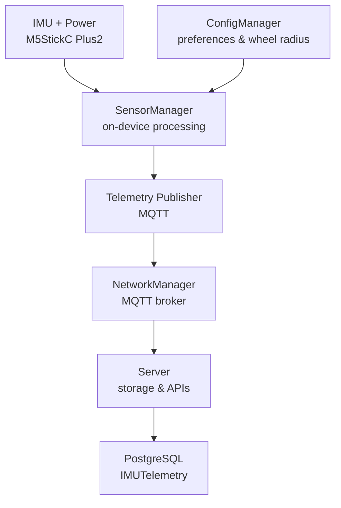
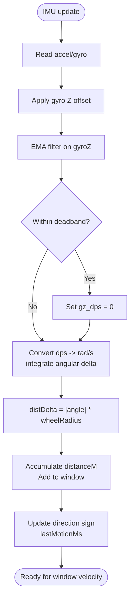
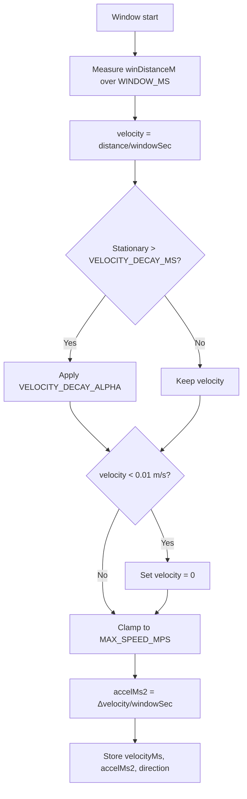
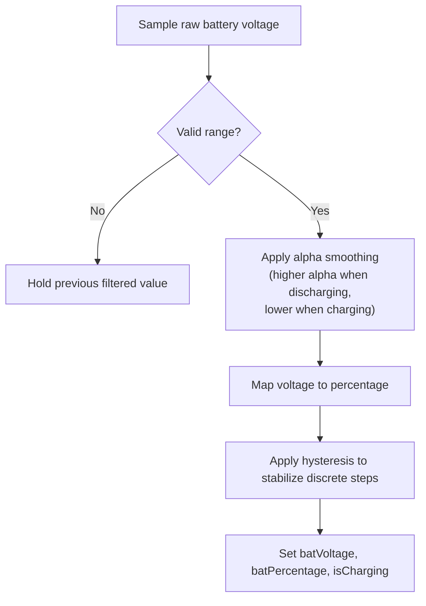
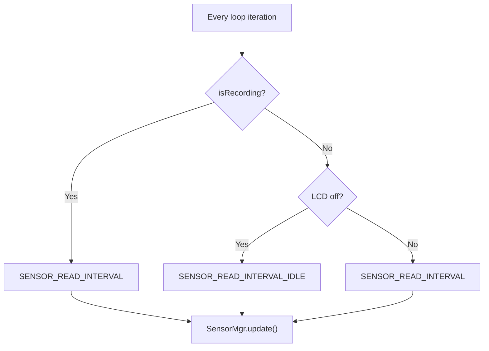
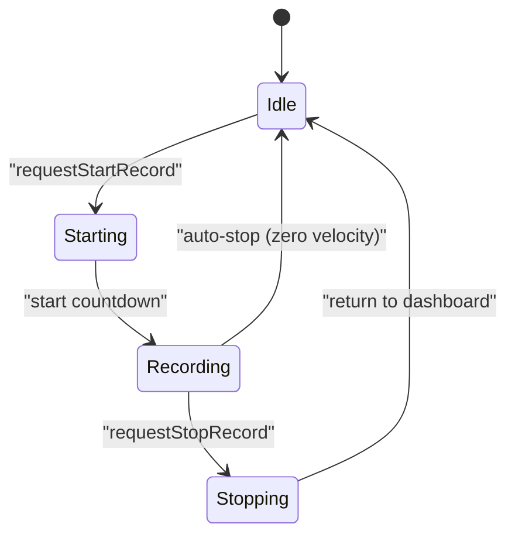
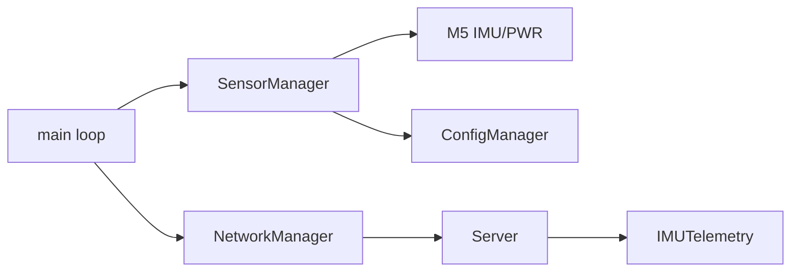

# Sensor Data Collection & Processing

<cite>
**Referenced Files in This Document**
- [SensorManager.h](file://firmware/M5StickCPlus2/src/managers/SensorManager.h)
- [SensorManager.cpp](file://firmware/M5StickCPlus2/src/managers/SensorManager.cpp)
- [Config.h](file://firmware/M5StickCPlus2/src/Config.h)
- [ConfigManager.h](file://firmware/M5StickCPlus2/src/managers/ConfigManager.h)
- [ConfigManager.cpp](file://firmware/M5StickCPlus2/src/managers/ConfigManager.cpp)
- [main.cpp](file://firmware/M5StickCPlus2/src/main.cpp)
- [TELEMETRY_CONTRACT.md](file://firmware/TELEMETRY_CONTRACT.md)
- [mqtt_handler.py](file://server/app/mqtt_handler.py)
</cite>

## Table of Contents
1. [Introduction](#introduction)
2. [Project Structure](#project-structure)
3. [Core Components](#core-components)
4. [Architecture Overview](#architecture-overview)
5. [Detailed Component Analysis](#detailed-component-analysis)
6. [Dependency Analysis](#dependency-analysis)
7. [Performance Considerations](#performance-considerations)
8. [Troubleshooting Guide](#troubleshooting-guide)
9. [Conclusion](#conclusion)
10. [Appendices](#appendices)

## Introduction
This document explains the sensor data collection and processing system for the WheelSense wheelchair device. It covers IMU integration (accelerometer and gyroscope), on-device motion computation (distance, velocity, acceleration, direction), battery monitoring (voltage, percentage, charging state), adaptive sampling rates, the SensorData structure, and the motion recording state machine with zero-velocity detection and auto-stop logic. Practical guidance is included for calibration, data interpretation, troubleshooting, and tuning motion detection thresholds.

## Project Structure
The sensor pipeline spans firmware and server layers:
- Firmware (M5StickC Plus2) reads IMU and battery sensors, computes motion, publishes telemetry, and manages recording state.
- Server receives telemetry, persists structured fields, and supports downstream analytics.



**Diagram sources**
- [SensorManager.cpp:50-53](file://firmware/M5StickCPlus2/src/managers/SensorManager.cpp#L50-L53)
- [ConfigManager.cpp:11-29](file://firmware/M5StickCPlus2/src/managers/ConfigManager.cpp#L11-L29)
- [main.cpp:265-336](file://firmware/M5StickCPlus2/src/main.cpp#L265-L336)
- [mqtt_handler.py:174-194](file://server/app/mqtt_handler.py#L174-L194)

**Section sources**
- [SensorManager.h:7-26](file://firmware/M5StickCPlus2/src/managers/SensorManager.h#L7-L26)
- [SensorManager.cpp:50-53](file://firmware/M5StickCPlus2/src/managers/SensorManager.cpp#L50-L53)
- [Config.h:43-51](file://firmware/M5StickCPlus2/src/Config.h#L43-L51)
- [main.cpp:199-205](file://firmware/M5StickCPlus2/src/main.cpp#L199-L205)
- [TELEMETRY_CONTRACT.md:15-22](file://firmware/TELEMETRY_CONTRACT.md#L15-L22)

## Core Components
- SensorManager: Reads IMU and battery, applies calibration and filtering, computes motion metrics, and exposes SensorData.
- ConfigManager: Stores persistent settings including wheel radius and display mode.
- main loop: Orchestrates adaptive sampling, recording state machine, and telemetry publishing.

Key responsibilities:
- IMU acquisition and orientation estimation from accelerometer.
- Gyro-based distance integration with EMA filtering and deadband.
- Sliding-window velocity and acceleration computation with decay and zero-snap.
- Battery voltage mapping to percentage with hysteresis and charging debounce.
- Adaptive sampling based on recording state and display power mode.

**Section sources**
- [SensorManager.h:7-26](file://firmware/M5StickCPlus2/src/managers/SensorManager.h#L7-L26)
- [SensorManager.cpp:55-132](file://firmware/M5StickCPlus2/src/managers/SensorManager.cpp#L55-L132)
- [SensorManager.cpp:185-229](file://firmware/M5StickCPlus2/src/managers/SensorManager.cpp#L185-L229)
- [ConfigManager.h:7-17](file://firmware/M5StickCPlus2/src/managers/ConfigManager.h#L7-L17)
- [ConfigManager.cpp:11-29](file://firmware/M5StickCPlus2/src/managers/ConfigManager.cpp#L11-L29)
- [main.cpp:221-263](file://firmware/M5StickCPlus2/src/main.cpp#L221-L263)

## Architecture Overview
The system integrates hardware sensors, on-device processing, and network publishing with adaptive rates.

```mermaid
sequenceDiagram
participant HW as "IMU/Battery"
participant SM as "SensorManager"
participant CFG as "ConfigManager"
participant LOOP as "main loop"
participant NET as "NetworkManager"
participant SVR as "Server"
HW->>SM : "update() returns latest readings"
SM->>CFG : "read wheelRadiusM"
SM->>SM : "filter gyroZ, compute distance/velocity/acceleration"
SM->>SM : "map battery voltage to percentage"
LOOP->>SM : "getData()"
LOOP->>NET : "publish telemetry payload"
NET-->>SVR : "deliver to broker"
SVR-->>SVR : "store IMUTelemetry"
```

**Diagram sources**
- [SensorManager.cpp:50-53](file://firmware/M5StickCPlus2/src/managers/SensorManager.cpp#L50-L53)
- [SensorManager.cpp:94-95](file://firmware/M5StickCPlus2/src/managers/SensorManager.cpp#L94-L95)
- [ConfigManager.cpp:20-21](file://firmware/M5StickCPlus2/src/managers/ConfigManager.cpp#L20-L21)
- [main.cpp:265-336](file://firmware/M5StickCPlus2/src/main.cpp#L265-L336)
- [mqtt_handler.py:174-194](file://server/app/mqtt_handler.py#L174-L194)

## Detailed Component Analysis

### SensorData Structure and Field Meanings
SensorData aggregates raw and computed sensor values. Fields include:
- Raw IMU: accelX/Y/Z (g), gyroX/Y/Z (dps), pitch/roll (degrees), imuValid (boolean).
- Computed motion: distanceM (meters), velocityMs (m/s), accelMs2 (m/s²), direction (-1 backward, 0 stop, 1 forward).
- Battery: batPercentage (0–100), batVoltage (V), isCharging (boolean), batRawMv/batFilteredMv (mV).

These fields are populated by SensorManager and published in the telemetry payload.

**Section sources**
- [SensorManager.h:7-26](file://firmware/M5StickCPlus2/src/managers/SensorManager.h#L7-L26)
- [TELEMETRY_CONTRACT.md:19-21](file://firmware/TELEMETRY_CONTRACT.md#L19-L21)
- [mqtt_handler.py:180-192](file://server/app/mqtt_handler.py#L180-L192)

### IMU Integration: Accelerometer and Gyroscope
- Accelerometer data is read and used to estimate roll and pitch angles.
- Gyroscope data is corrected by a calibrated Z-axis DC bias (gyroZOffset), filtered with an exponential moving average (EMA), and passed through a deadband to reject noise.
- Angular velocity is integrated over time with the wheel radius to compute incremental distance, which accumulates to total distance and contributes to the sliding-window velocity.



**Diagram sources**
- [SensorManager.cpp:55-108](file://firmware/M5StickCPlus2/src/managers/SensorManager.cpp#L55-L108)
- [SensorManager.cpp:94-95](file://firmware/M5StickCPlus2/src/managers/SensorManager.cpp#L94-L95)

**Section sources**
- [SensorManager.cpp:74-77](file://firmware/M5StickCPlus2/src/managers/SensorManager.cpp#L74-L77)
- [SensorManager.cpp:80-108](file://firmware/M5StickCPlus2/src/managers/SensorManager.cpp#L80-L108)
- [ConfigManager.cpp:20-21](file://firmware/M5StickCPlus2/src/managers/ConfigManager.cpp#L20-L21)

### Motion Calculation Algorithms
- Sliding window: Every WINDOW_MS, velocity is computed as winDistanceM divided by window duration. A decay factor reduces velocity when no motion is detected for VELOCITY_DECAY_MS. Sub-perceptual drift is eliminated via zero-snap threshold. Velocity is clamped to a maximum value. Acceleration is derived as the change in velocity over the window.
- Direction: Derived from the sign of filtered gyroZ when above deadband; otherwise zero.



**Diagram sources**
- [SensorManager.cpp:110-131](file://firmware/M5StickCPlus2/src/managers/SensorManager.cpp#L110-L131)

**Section sources**
- [SensorManager.cpp:110-131](file://firmware/M5StickCPlus2/src/managers/SensorManager.cpp#L110-L131)

### Battery Monitoring System
- Voltage measurement: Raw millivolt values are sampled periodically with a minimum interval.
- Percentage mapping: A piecewise linear lookup maps measured voltage to battery percentage.
- Filtering: Exponential smoothing adapts depending on charging state.
- Charging detection: Debounce logic stabilizes charging state transitions with counters and minimum dwell time.



**Diagram sources**
- [SensorManager.cpp:185-229](file://firmware/M5StickCPlus2/src/managers/SensorManager.cpp#L185-L229)

**Section sources**
- [SensorManager.cpp:136-154](file://firmware/M5StickCPlus2/src/managers/SensorManager.cpp#L136-L154)
- [SensorManager.cpp:156-183](file://firmware/M5StickCPlus2/src/managers/SensorManager.cpp#L156-L183)
- [SensorManager.cpp:185-229](file://firmware/M5StickCPlus2/src/managers/SensorManager.cpp#L185-L229)
- [Config.h:52-55](file://firmware/M5StickCPlus2/src/Config.h#L52-L55)

### Adaptive Sampling Rate System
- Sensor read interval adjusts based on recording state and display power mode:
  - When recording: frequent sampling for responsive motion metrics.
  - When idle (LCD off): reduced sampling and longer publish intervals to conserve power.
- The main loop also sleeps longer when the display is off and not recording.



**Diagram sources**
- [main.cpp:199-205](file://firmware/M5StickCPlus2/src/main.cpp#L199-L205)
- [Config.h:68-71](file://firmware/M5StickCPlus2/src/Config.h#L68-L71)

**Section sources**
- [main.cpp:199-205](file://firmware/M5StickCPlus2/src/main.cpp#L199-L205)
- [Config.h:44-51](file://firmware/M5StickCPlus2/src/Config.h#L44-L51)
- [Config.h:68-71](file://firmware/M5StickCPlus2/src/Config.h#L68-L71)

### Sensor Data Structure (SensorData)
- Raw IMU: accelX/Y/Z (g), gyroX/Y/Z (dps), pitch/roll (degrees), imuValid.
- Computed motion: distanceM (m), velocityMs (m/s), accelMs2 (m/s²), direction.
- Battery: batPercentage, batVoltage, isCharging, batRawMv, batFilteredMv.

Fields are populated by SensorManager and serialized into the telemetry payload.

**Section sources**
- [SensorManager.h:7-26](file://firmware/M5StickCPlus2/src/managers/SensorManager.h#L7-L26)
- [TELEMETRY_CONTRACT.md:19-21](file://firmware/TELEMETRY_CONTRACT.md#L19-L21)

### Motion Recording State Machine
The state machine controls recording lifecycle and auto-stop behavior:
- Start: A request flips the flag, recording begins after a short countdown, and UI switches to recording scene.
- Stop: Manual stop clears the flag and returns to dashboard.
- Auto-stop: If velocity remains below a small threshold for a sustained period, recording stops automatically.



**Diagram sources**
- [main.cpp:221-263](file://firmware/M5StickCPlus2/src/main.cpp#L221-L263)

**Section sources**
- [main.cpp:221-263](file://firmware/M5StickCPlus2/src/main.cpp#L221-L263)

## Dependency Analysis
- SensorManager depends on M5 hardware APIs for IMU and power, and on ConfigManager for wheel radius.
- main orchestrates timing, adaptive rates, and telemetry publishing.
- Server persists telemetry into IMUTelemetry with explicit field mapping.



**Diagram sources**
- [SensorManager.cpp:50-53](file://firmware/M5StickCPlus2/src/managers/SensorManager.cpp#L50-L53)
- [ConfigManager.cpp:20-21](file://firmware/M5StickCPlus2/src/managers/ConfigManager.cpp#L20-L21)
- [main.cpp:265-336](file://firmware/M5StickCPlus2/src/main.cpp#L265-L336)
- [mqtt_handler.py:174-194](file://server/app/mqtt_handler.py#L174-L194)

**Section sources**
- [SensorManager.h:28-71](file://firmware/M5StickCPlus2/src/managers/SensorManager.h#L28-L71)
- [ConfigManager.h:19-31](file://firmware/M5StickCPlus2/src/managers/ConfigManager.h#L19-L31)
- [main.cpp:265-336](file://firmware/M5StickCPlus2/src/main.cpp#L265-L336)
- [mqtt_handler.py:174-194](file://server/app/mqtt_handler.py#L174-L194)

## Performance Considerations
- Sampling frequency: 20 Hz during normal operation; reduced to ~5 Hz when idle and LCD off.
- Window size: 500 ms balances responsiveness and noise rejection for velocity estimation.
- Filtering: EMA on gyroZ and hysteresis on battery percentage reduce jitter.
- Power saving: Long idle delays when the display is off and not recording.

[No sources needed since this section provides general guidance]

## Troubleshooting Guide
Common issues and remedies:
- No motion detected despite movement:
  - Verify wheel radius setting is accurate; invalid values fall back to default.
  - Recalibrate gyroscope offset to remove DC bias.
- Erratic velocity spikes:
  - Confirm deadband threshold is appropriate for the device’s noise floor.
  - Ensure EMA alpha is sufficient to smooth gyroZ.
- Battery percentage jumps or stuck:
  - Check charging debounce settings and minimum dwell time.
  - Validate voltage mapping curve and raw measurements.
- Auto-stop triggers unexpectedly:
  - Increase zero-velocity threshold slightly or adjust auto-stop window.
- Telemetry missing:
  - Confirm MQTT connectivity and that the device is registered in the backend.

**Section sources**
- [SensorManager.cpp:94-95](file://firmware/M5StickCPlus2/src/managers/SensorManager.cpp#L94-L95)
- [SensorManager.cpp:231-259](file://firmware/M5StickCPlus2/src/managers/SensorManager.cpp#L231-L259)
- [Config.h:52-55](file://firmware/M5StickCPlus2/src/Config.h#L52-L55)
- [main.cpp:245-263](file://firmware/M5StickCPlus2/src/main.cpp#L245-L263)
- [TELEMETRY_CONTRACT.md:32-33](file://firmware/TELEMETRY_CONTRACT.md#L32-L33)

## Conclusion
The firmware implements a robust, on-device sensor pipeline that integrates IMU and battery telemetry, computes meaningful motion metrics, and adapts sampling to power constraints. The server consumes structured telemetry for persistence and analytics. Users can tune thresholds and parameters to optimize accuracy and reliability for real-world wheelchair motion monitoring.

[No sources needed since this section summarizes without analyzing specific files]

## Appendices

### Practical Examples

- Sensor calibration
  - Perform a 1-second gyro calibration at rest to compute Z-axis DC bias. Recalibration resets motion state and updates the offset.
  - Reference: [SensorManager.cpp:28-48](file://firmware/M5StickCPlus2/src/managers/SensorManager.cpp#L28-L48), [SensorManager.cpp:231-259](file://firmware/M5StickCPlus2/src/managers/SensorManager.cpp#L231-L259)

- Data interpretation
  - Use direction to infer travel orientation; distanceM is cumulative; velocityMs and accelMs2 reflect filtered motion over a short window.
  - Reference: [SensorManager.h:14-18](file://firmware/M5StickCPlus2/src/managers/SensorManager.h#L14-L18), [SensorManager.cpp:110-131](file://firmware/M5StickCPlus2/src/managers/SensorManager.cpp#L110-L131)

- Troubleshooting sensor issues
  - If readings are noisy, increase EMA alpha or deadband threshold.
  - If velocity decays too quickly, raise decay threshold or alpha.
  - Reference: [SensorManager.cpp:80-89](file://firmware/M5StickCPlus2/src/managers/SensorManager.cpp#L80-L89), [SensorManager.cpp:116-119](file://firmware/M5StickCPlus2/src/managers/SensorManager.cpp#L116-L119)

- Customizing motion detection thresholds
  - Adjust deadband, window size, decay parameters, and zero-snap threshold to suit user mobility patterns.
  - Reference: [SensorManager.h:43-48](file://firmware/M5StickCPlus2/src/managers/SensorManager.h#L43-L48), [SensorManager.cpp:110-122](file://firmware/M5StickCPlus2/src/managers/SensorManager.cpp#L110-L122)

- Telemetry contract mapping
  - IMU fields: ax/ay/az/gx/gy/gz.
  - Motion fields: distance_m/velocity_ms/accel_ms2/direction.
  - Battery fields: percentage/voltage_v/charging.
  - Reference: [TELEMETRY_CONTRACT.md:19-21](file://firmware/TELEMETRY_CONTRACT.md#L19-L21), [mqtt_handler.py:180-192](file://server/app/mqtt_handler.py#L180-L192)