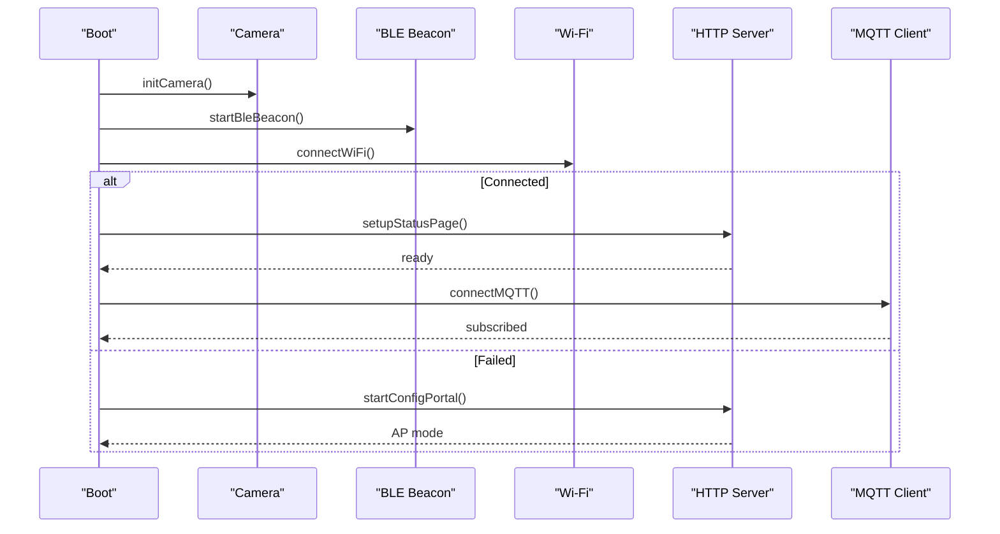
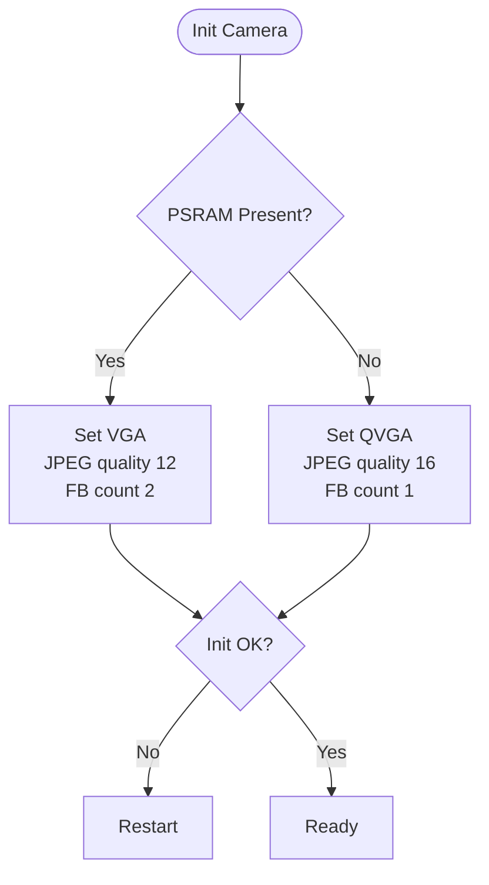
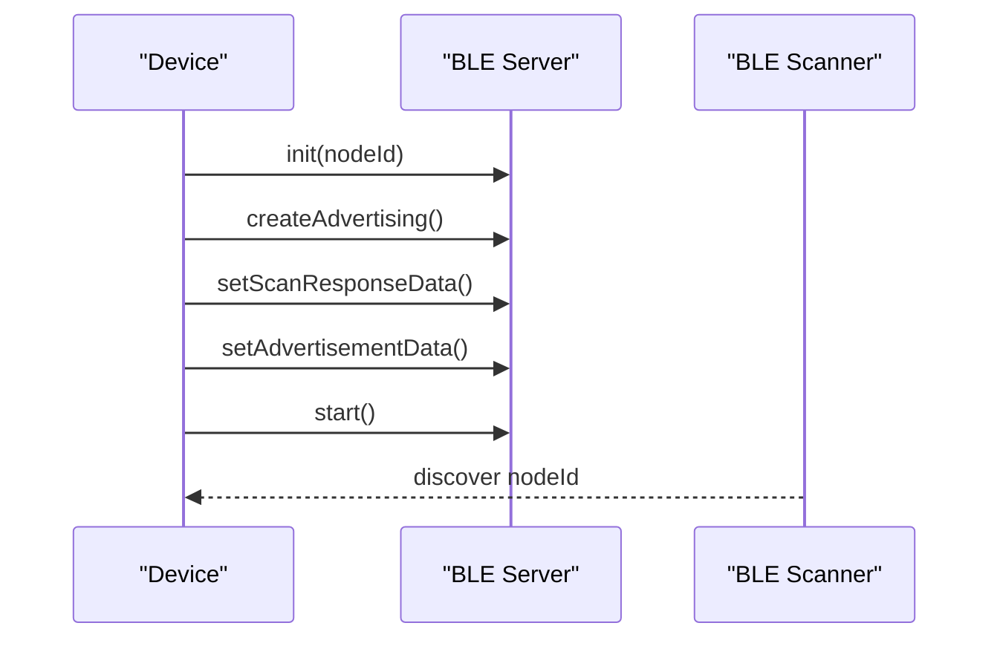
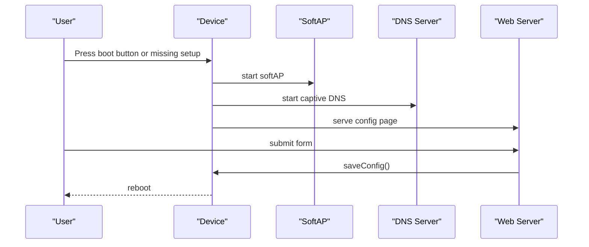
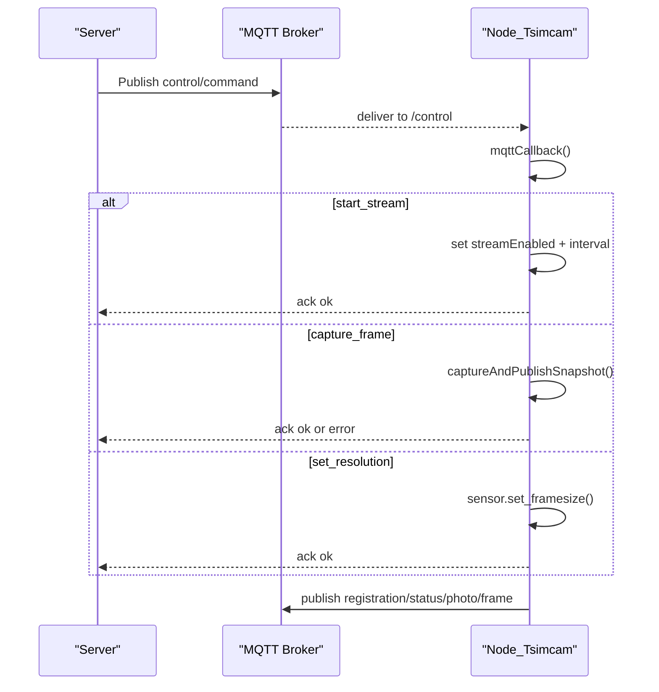
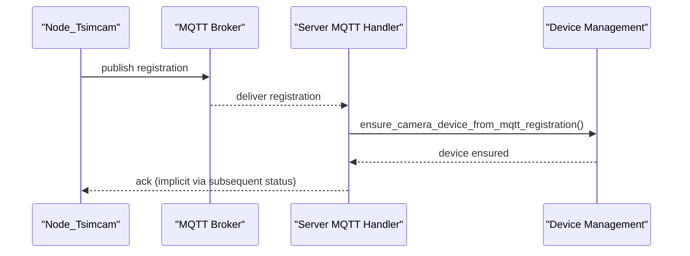
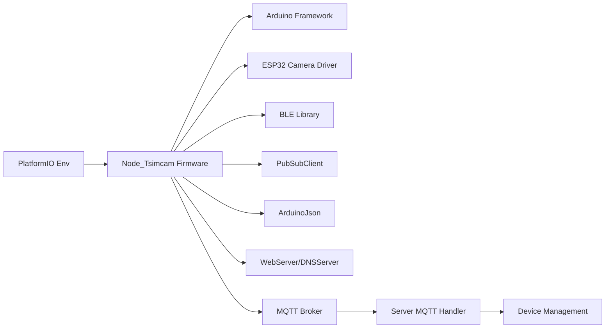

# Node_Tsimcam Device Implementation

<cite>
**Referenced Files in This Document**
- [main.cpp](file://firmware/Node_Tsimcam/src/main.cpp)
- [platformio.ini](file://firmware/Node_Tsimcam/platformio.ini)
- [BLEManager.cpp](file://firmware/M5StickCPlus2/src/managers/BLEManager.cpp)
- [BLEManager.h](file://firmware/M5StickCPlus2/src/managers/BLEManager.h)
- [mqtt_handler.py](file://server/app/mqtt_handler.py)
- [device_management.py](file://server/app/services/device_management.py)
- [0005-camera-photo-only-internet-independent.md](file://docs/adr/0005-camera-photo-only-internet-independent.md)
- [test_mqtt_handler.py](file://server/tests/test_mqtt_handler.py)
</cite>

## Table of Contents
1. [Introduction](#introduction)
2. [Project Structure](#project-structure)
3. [Core Components](#core-components)
4. [Architecture Overview](#architecture-overview)
5. [Detailed Component Analysis](#detailed-component-analysis)
6. [Dependency Analysis](#dependency-analysis)
7. [Performance Considerations](#performance-considerations)
8. [Troubleshooting Guide](#troubleshooting-guide)
9. [Conclusion](#conclusion)
10. [Appendices](#appendices)

## Introduction
The Node_Tsimcam is a BLE beacon and camera node in the WheelSense ecosystem. It integrates a camera module, BLE advertising for localization, Wi-Fi connectivity, and MQTT-based telemetry/control. The device captures JPEG snapshots, optionally streams frames, and publishes status telemetry. It supports remote configuration via an embedded HTTP portal and MQTT commands for control and calibration.

## Project Structure
The Node_Tsimcam firmware is organized around a single entry point and a set of integrated subsystems:
- Hardware abstraction and camera initialization
- BLE beacon advertising
- Wi-Fi and HTTP configuration portal
- MQTT control and telemetry publishing
- Power and status reporting

```mermaid
graph TB
subgraph "Node_Tsimcam Firmware"
MCU["ESP32-S3 MCU"]
CAM["OV2640 Camera Module"]
BLE["BLE Advertising"]
WIFI["Wi-Fi STA/AP"]
MQTT["MQTT Client"]
HTTP["Embedded Web Server"]
PREF["Preferences Storage"]
end
MCU --> CAM
MCU --> BLE
MCU --> WIFI
MCU --> MQTT
MCU --> HTTP
MCU --> PREF
subgraph "Server Side"
MQTT_S["MQTT Broker"]
HANDLER["MQTT Handler"]
DM["Device Management"]
end
MQTT <- --> MQTT_S
HANDLER --> MQTT_S
DM --> HANDLER
```

**Diagram sources**
- [main.cpp:803-850](file://firmware/Node_Tsimcam/src/main.cpp#L803-L850)
- [platformio.ini:9-27](file://firmware/Node_Tsimcam/platformio.ini#L9-L27)

**Section sources**
- [main.cpp:1-126](file://firmware/Node_Tsimcam/src/main.cpp#L1-L126)
- [platformio.ini:1-27](file://firmware/Node_Tsimcam/platformio.ini#L1-L27)

## Core Components
- Camera subsystem: Initializes the OV2640 via ESP32 camera driver, selects frame size and quality based on PSRAM availability, and captures JPEG frames.
- BLE beacon: Advertises the node name to enable localization and merging with BLE gateway data.
- Wi-Fi and HTTP: Connects to configured SSID or hosts an AP for initial configuration.
- MQTT control and telemetry: Subscribes to control topics, executes commands (start/stop stream, snapshot, resolution change), and publishes status and registration messages.
- Power and status: Reports battery level if available and tracks capture statistics.

**Section sources**
- [main.cpp:142-188](file://firmware/Node_Tsimcam/src/main.cpp#L142-L188)
- [main.cpp:190-210](file://firmware/Node_Tsimcam/src/main.cpp#L190-L210)
- [main.cpp:212-228](file://firmware/Node_Tsimcam/src/main.cpp#L212-L228)
- [main.cpp:570-700](file://firmware/Node_Tsimcam/src/main.cpp#L570-L700)
- [main.cpp:702-745](file://firmware/Node_Tsimcam/src/main.cpp#L702-L745)

## Architecture Overview
The Node_Tsimcam participates in a distributed telemetry/control pipeline:
- On boot, it initializes camera and BLE, attempts Wi-Fi connection, starts HTTP server, and connects to MQTT.
- It subscribes to control topics and publishes registration/status messages.
- Control commands trigger camera actions (snapshot/stream) or device configuration (resolution, reboot).
- Telemetry/status updates are published periodically and on-demand.



**Diagram sources**
- [main.cpp:803-850](file://firmware/Node_Tsimcam/src/main.cpp#L803-L850)

**Section sources**
- [main.cpp:803-916](file://firmware/Node_Tsimcam/src/main.cpp#L803-L916)

## Detailed Component Analysis

### Camera Initialization and Capture
- Frame size and quality adapt to PSRAM presence to balance memory usage and image quality.
- Capture path supports two transport modes:
  - Chunked photo over MQTT with Base64-encoded JPEG segments.
  - Direct frame publish when chunking is not feasible.



**Diagram sources**
- [main.cpp:142-188](file://firmware/Node_Tsimcam/src/main.cpp#L142-L188)

**Section sources**
- [main.cpp:142-188](file://firmware/Node_Tsimcam/src/main.cpp#L142-L188)
- [main.cpp:466-568](file://firmware/Node_Tsimcam/src/main.cpp#L466-L568)

### BLE Beacon Operation
- Initializes BLE server and starts advertising with the node name.
- Uses a minimal advertisement payload suitable for discovery and localization.



**Diagram sources**
- [main.cpp:190-210](file://firmware/Node_Tsimcam/src/main.cpp#L190-L210)

**Section sources**
- [main.cpp:92-102](file://firmware/Node_Tsimcam/src/main.cpp#L92-L102)
- [main.cpp:190-210](file://firmware/Node_Tsimcam/src/main.cpp#L190-L210)

### Wi-Fi and HTTP Configuration Portal
- On boot, checks a button or missing setup flag to enter configuration mode.
- Hosts an AP with captive DNS to present a configuration page.
- Saves credentials and MQTT settings to Preferences and restarts.



**Diagram sources**
- [main.cpp:334-410](file://firmware/Node_Tsimcam/src/main.cpp#L334-L410)
- [main.cpp:803-850](file://firmware/Node_Tsimcam/src/main.cpp#L803-L850)

**Section sources**
- [main.cpp:334-410](file://firmware/Node_Tsimcam/src/main.cpp#L334-L410)
- [main.cpp:105-140](file://firmware/Node_Tsimcam/src/main.cpp#L105-L140)

### MQTT Control and Telemetry
- Subscribes to device-specific control and global config topics.
- Executes commands: start/stop stream, snapshot, set resolution, reboot, enter config mode.
- Publishes registration, status, and photo/frame payloads.



**Diagram sources**
- [main.cpp:570-700](file://firmware/Node_Tsimcam/src/main.cpp#L570-L700)
- [mqtt_handler.py:108-136](file://server/app/mqtt_handler.py#L108-L136)

**Section sources**
- [main.cpp:570-700](file://firmware/Node_Tsimcam/src/main.cpp#L570-L700)
- [mqtt_handler.py:108-136](file://server/app/mqtt_handler.py#L108-L136)

### Server Integration and Device Registration
- Node publishes a registration message containing device identity, node ID, IP, firmware, and optional BLE MAC.
- Server handles registration, merges BLE stubs with camera records, and ensures device rows exist for ingestion.



**Diagram sources**
- [main.cpp:679-698](file://firmware/Node_Tsimcam/src/main.cpp#L679-L698)
- [mqtt_handler.py:590-604](file://server/app/mqtt_handler.py#L590-L604)
- [device_management.py:272-303](file://server/app/services/device_management.py#L272-L303)

**Section sources**
- [main.cpp:679-698](file://firmware/Node_Tsimcam/src/main.cpp#L679-L698)
- [mqtt_handler.py:590-604](file://server/app/mqtt_handler.py#L590-L604)
- [device_management.py:272-303](file://server/app/services/device_management.py#L272-L303)

### Camera Transport Strategies
- Hybrid upload strategy: chunked MQTT for smaller photos, fallback to direct frame publish when chunking is not feasible.
- Default quality and resolution are tuned for reliable public broker delivery.

**Section sources**
- [main.cpp:466-568](file://firmware/Node_Tsimcam/src/main.cpp#L466-L568)
- [0005-camera-photo-only-internet-independent.md:16-26](file://docs/adr/0005-camera-photo-only-internet-independent.md#L16-L26)

## Dependency Analysis
- Firmware dependencies:
  - Arduino framework, ESP32-CAM driver, BLE, PubSubClient, ArduinoJson, DNSServer, WebServer.
- Build configuration targets ESP32-S3 with PSRAM and partition scheme.
- Server-side MQTT handler subscribes to camera topics and processes registration/status/photo/frame.



**Diagram sources**
- [platformio.ini:9-27](file://firmware/Node_Tsimcam/platformio.ini#L9-L27)
- [main.cpp:6-20](file://firmware/Node_Tsimcam/src/main.cpp#L6-L20)
- [mqtt_handler.py:100-106](file://server/app/mqtt_handler.py#L100-L106)

**Section sources**
- [platformio.ini:9-27](file://firmware/Node_Tsimcam/platformio.ini#L9-L27)
- [main.cpp:6-20](file://firmware/Node_Tsimcam/src/main.cpp#L6-L20)
- [mqtt_handler.py:100-106](file://server/app/mqtt_handler.py#L100-L106)

## Performance Considerations
- Camera memory and quality:
  - PSRAM-aware frame size selection reduces memory pressure and improves reliability.
  - Lower JPEG quality and reduced frame buffers on non-PSRAM boards.
- Transport sizing:
  - Chunk size and payload guard prevent oversized packets on constrained networks.
- BLE advertising intervals:
  - Balanced min/max intervals optimize discovery while managing power.
- Status reporting cadence:
  - Fixed interval prevents excessive network traffic while keeping visibility.

[No sources needed since this section provides general guidance]

## Troubleshooting Guide

### Camera Focusing and Image Quality
- Verify camera initialization logs and retry on failure.
- Adjust resolution via MQTT to balance quality and bandwidth.
- Use HTTP endpoints to capture a single frame or start a short stream for verification.

**Section sources**
- [main.cpp:142-188](file://firmware/Node_Tsimcam/src/main.cpp#L142-L188)
- [main.cpp:611-622](file://firmware/Node_Tsimcam/src/main.cpp#L611-L622)
- [main.cpp:767-800](file://firmware/Node_Tsimcam/src/main.cpp#L767-L800)

### BLE Signal Strength and Localization
- Confirm BLE beacon is advertising with the expected node name.
- Validate server-side BLE scanning and node key parsing logic.
- Ensure the BLE MAC is included in registration for merging with camera records.

**Section sources**
- [main.cpp:190-210](file://firmware/Node_Tsimcam/src/main.cpp#L190-L210)
- [BLEManager.cpp:33-62](file://firmware/M5StickCPlus2/src/managers/BLEManager.cpp#L33-L62)
- [BLEManager.h:12-17](file://firmware/M5StickCPlus2/src/managers/BLEManager.h#L12-L17)
- [main.cpp:688-693](file://firmware/Node_Tsimcam/src/main.cpp#L688-L693)

### Network Connectivity and MQTT
- Check Wi-Fi connection status and IP address in status telemetry.
- Validate MQTT broker reachability and credentials.
- Confirm subscription to control and config topics.

**Section sources**
- [main.cpp:212-228](file://firmware/Node_Tsimcam/src/main.cpp#L212-L228)
- [main.cpp:654-700](file://firmware/Node_Tsimcam/src/main.cpp#L654-L700)
- [mqtt_handler.py:100-106](file://server/app/mqtt_handler.py#L100-L106)

### Practical Examples

- Trigger a snapshot:
  - Publish a control message with command "capture_frame".
  - Observe acknowledgment and photo payload on the broker.

- Tune beacon frequency:
  - Adjust advertisement min/max intervals in the BLE beacon setup routine.

- Optimize network:
  - Reduce capture interval during streaming to lower bandwidth usage.
  - Use HTTP endpoints for quick verification without MQTT overhead.

**Section sources**
- [main.cpp:587-610](file://firmware/Node_Tsimcam/src/main.cpp#L587-L610)
- [main.cpp:205-208](file://firmware/Node_Tsimcam/src/main.cpp#L205-L208)
- [main.cpp:587-591](file://firmware/Node_Tsimcam/src/main.cpp#L587-L591)
- [main.cpp:767-800](file://firmware/Node_Tsimcam/src/main.cpp#L767-L800)

## Conclusion
The Node_Tsimcam integrates camera capture, BLE beaconing, Wi-Fi provisioning, and MQTT control into a cohesive device for WheelSense. Its hybrid transport strategy and adaptive camera configuration ensure reliable operation across diverse environments. Server-side handlers manage device registration, localization, and ingestion, enabling seamless fleet operations.

[No sources needed since this section summarizes without analyzing specific files]

## Appendices

### Device Registration and Unique Identifiers
- Device ID defaults to a derived identifier from the Wi-Fi MAC if not configured.
- Node ID identifies the logical location/grouping of the device.
- BLE MAC is included in registration to merge with BLE gateway data.

**Section sources**
- [main.cpp:105-126](file://firmware/Node_Tsimcam/src/main.cpp#L105-L126)
- [main.cpp:688-693](file://firmware/Node_Tsimcam/src/main.cpp#L688-L693)

### Power Management and Battery Reporting
- Optional battery monitoring via ADC with configurable divider ratio.
- Status telemetry includes battery percentage and voltage when available.

**Section sources**
- [main.cpp:411-426](file://firmware/Node_Tsimcam/src/main.cpp#L411-L426)
- [main.cpp:702-745](file://firmware/Node_Tsimcam/src/main.cpp#L702-L745)

### Server-Side Validation and Tests
- Server validates incoming registration and merges BLE stubs with camera records.
- Tests confirm behavior for camera status ingestion and BLE device handling.

**Section sources**
- [mqtt_handler.py:590-604](file://server/app/mqtt_handler.py#L590-L604)
- [test_mqtt_handler.py:523-545](file://server/tests/test_mqtt_handler.py#L523-L545)