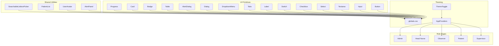
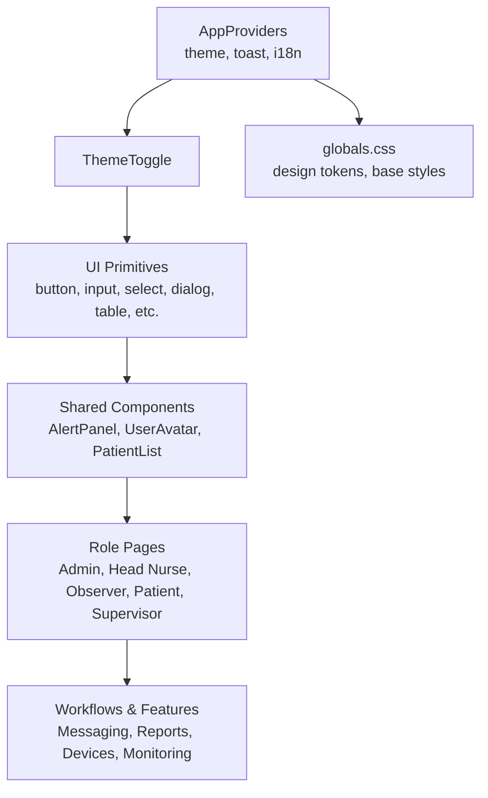
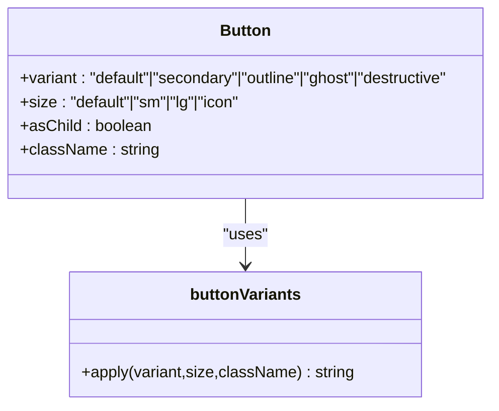
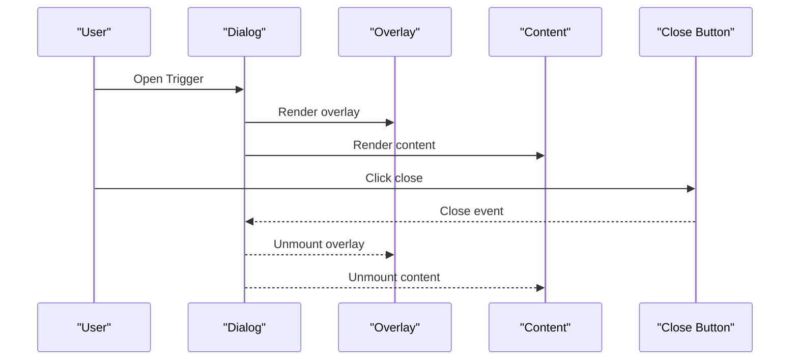
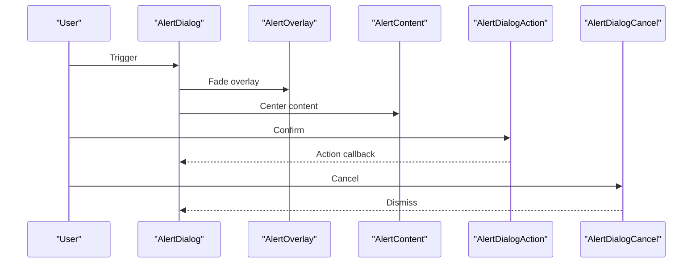
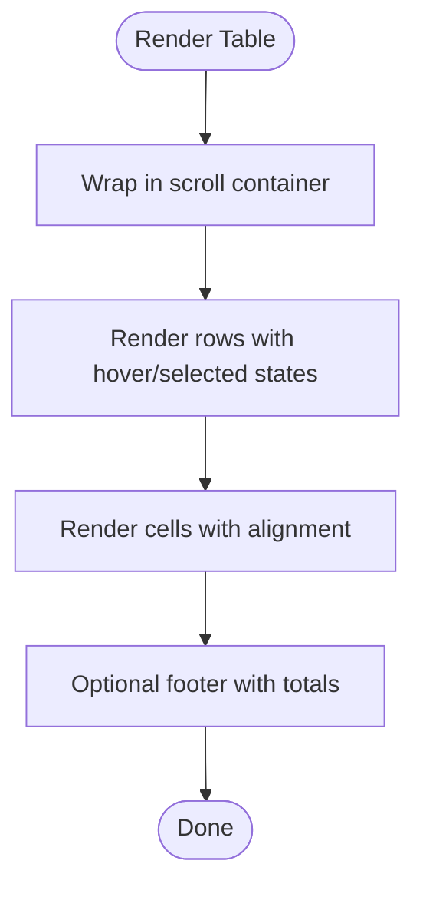
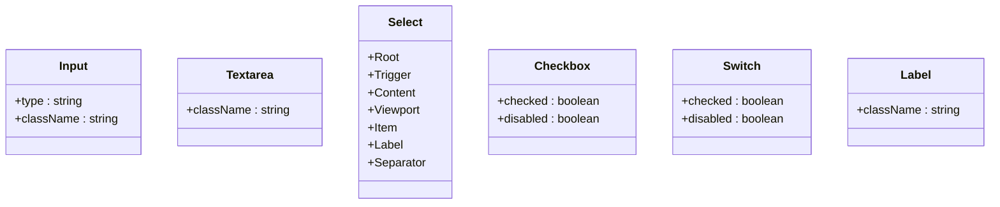
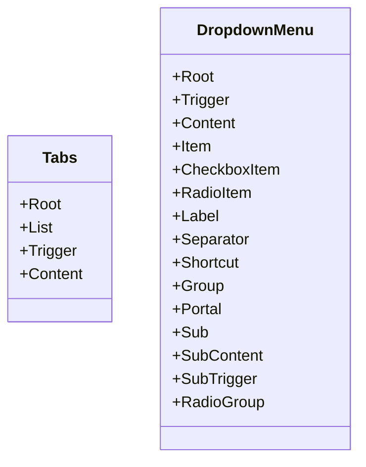
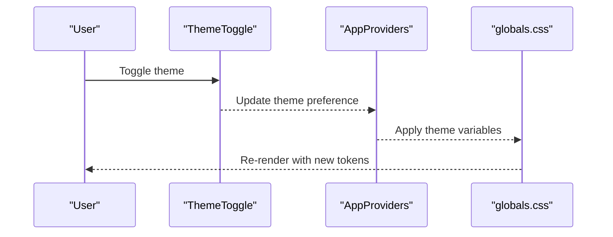
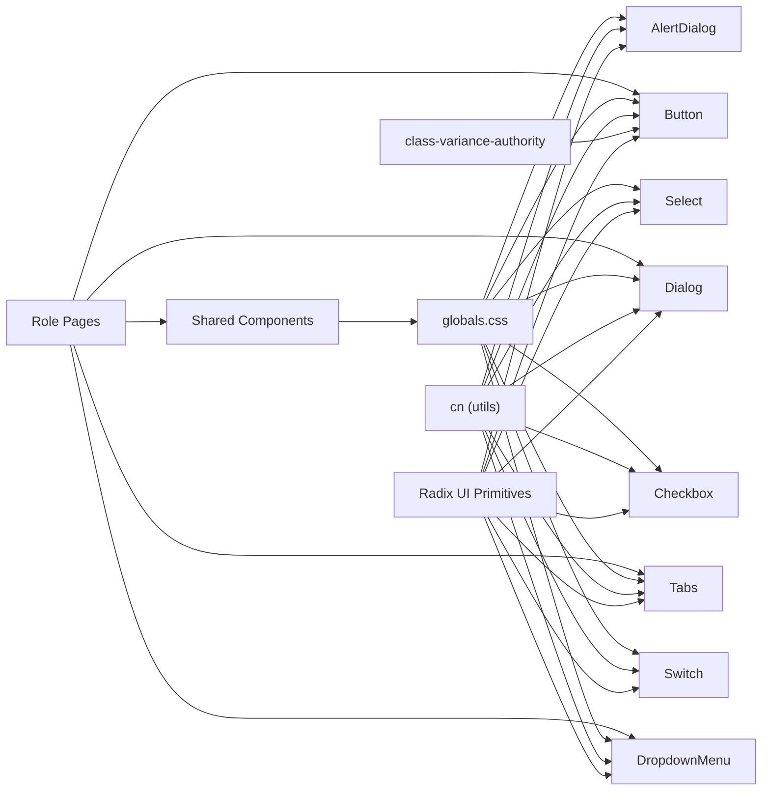

# Component Library

<cite>
**Referenced Files in This Document**
- [button.tsx](file://frontend/components/ui/button.tsx)
- [dialog.tsx](file://frontend/components/ui/dialog.tsx)
- [table.tsx](file://frontend/components/ui/table.tsx)
- [alert-dialog.tsx](file://frontend/components/ui/alert-dialog.tsx)
- [badge.tsx](file://frontend/components/ui/badge.tsx)
- [card.tsx](file://frontend/components/ui/card.tsx)
- [checkbox.tsx](file://frontend/components/ui/checkbox.tsx)
- [input.tsx](file://frontend/components/ui/input.tsx)
- [label.tsx](file://frontend/components/ui/label.tsx)
- [select.tsx](file://frontend/components/ui/select.tsx)
- [textarea.tsx](file://frontend/components/ui/textarea.tsx)
- [switch.tsx](file://frontend/components/ui/switch.tsx)
- [tabs.tsx](file://frontend/components/ui/tabs.tsx)
- [dropdown-menu.tsx](file://frontend/components/ui/dropdown-menu.tsx)
- [progress.tsx](file://frontend/components/ui/progress.tsx)
- [AlertPanel.tsx](file://frontend/components/shared/AlertPanel.tsx)
- [ThemeToggle.tsx](file://frontend/components/theme/ThemeToggle.tsx)
- [globals.css](file://frontend/app/globals.css)
- [AppProviders.tsx](file://frontend/components/providers/AppProviders.tsx)
- [RoleShell.tsx](file://frontend/components/RoleShell.tsx)
- [TopBar.tsx](file://frontend/components/TopBar.tsx)
- [RoleSidebar.tsx](file://frontend/components/RoleSidebar.tsx)
- [SonnerToaster.tsx](file://frontend/components/SonnerToaster.tsx)
- [NotificationBell.tsx](file://frontend/components/NotificationBell.tsx)
- [NotificationDrawer.tsx](file://frontend/components/NotificationDrawer.tsx)
- [EmptyState.tsx](file://frontend/components/EmptyState.tsx)
- [PatientList.tsx](file://frontend/components/shared/PatientList.tsx)
- [SearchableListboxPicker.tsx](file://frontend/components/shared/SearchableListboxPicker.tsx)
- [UserAvatar.tsx](file://frontend/components/shared/UserAvatar.tsx)
- [AdminAlertsTable.tsx](file://frontend/components/admin/alerts/AdminAlertsTable.tsx)
- [PatientsDataTable.tsx](file://frontend/components/admin/patients/PatientsDataTable.tsx)
- [AlertToastCard.tsx](file://frontend/components/notifications/AlertToastCard.tsx)
- [WorkflowMessageDetailDialog.tsx](file://frontend/components/messaging/WorkflowMessageDetailDialog.tsx)
- [AIChatPopup.tsx](file://frontend/components/ai/AIChatPopup.tsx)
- [ActionPlanPreview.tsx](file://frontend/components/ai/ActionPlanPreview.tsx)
- [ExecutionStepList.tsx](file://frontend/components/ai/ExecutionStepList.tsx)
- [DashboardFloorplanPanel.tsx](file://frontend/components/dashboard/DashboardFloorplanPanel.tsx)
- [WardTimelineEmbed.tsx](file://frontend/components/timeline/WardTimelineEmbed.tsx)
- [ShiftChecklistWorkspaceClient.tsx](file://frontend/components/shift-checklist/ShiftChecklistWorkspaceClient.tsx)
- [ReportPreviewTable.tsx](file://frontend/components/reports/ReportPreviewTable.tsx)
- [ReportIssueForm.tsx](file://frontend/components/support/ReportIssueForm.tsx)
- [WorkflowJobsPanel.tsx](file://frontend/components/workflow/WorkflowJobsPanel.tsx)
- [WorkflowTasksKanban.tsx](file://frontend/components/workflow/WorkflowTasksKanban.tsx)
- [WorkflowTasksHubContent.tsx](file://frontend/components/workflow/WorkflowTasksHubContent.tsx)
- [WorkflowJobCreateDialog.tsx](file://frontend/components/workflow/WorkflowJobCreateDialog.tsx)
- [ObserverTaskListPanel.tsx](file://frontend/components/workflow/ObserverTaskListPanel.tsx)
- [OperationsConsole.tsx](file://frontend/components/workflow/OperationsConsole.tsx)
- [FloorplanCanvas.tsx](file://frontend/components/floorplan/FloorplanCanvas.tsx)
- [FloorplanRoleViewer.tsx](file://frontend/components/floorplan/FloorplanRoleViewer.tsx)
- [DeviceDetailDrawer.tsx](file://frontend/components/admin/devices/DeviceDetailDrawer.tsx)
- [RoomDetailDrawer.tsx](file://frontend/components/admin/monitoring/RoomDetailDrawer.tsx)
- [FloorMapWorkspace.tsx](file://frontend/components/admin/monitoring/FloorMapWorkspace.tsx)
- [FacilityFloorToolbar.tsx](file://frontend/components/admin/monitoring/FacilityFloorToolbar.tsx)
- [AddCaregiverModal.tsx](file://frontend/components/admin/caregivers/AddCaregiverModal.tsx)
- [EditCaregiverModal.tsx](file://frontend/components/admin/caregivers/EditCaregiverModal.tsx)
- [CaregiverDetailPane.tsx](file://frontend/components/admin/caregivers/CaregiverDetailPane.tsx)
- [CaregiverCardGrid.tsx](file://frontend/components/admin/caregivers/CaregiverCardGrid.tsx)
- [StaffRoutineAndCalendarPanel.tsx](file://frontend/components/admin/caregivers/StaffRoutineAndCalendarPanel.tsx)
- [AddPatientModal.tsx](file://frontend/components/admin/patients/AddPatientModal.tsx)
- [PatientEditorModal.tsx](file://frontend/components/admin/patients/PatientEditorModal.tsx)
- [AdminPatientsQuickFind.tsx](file://frontend/components/admin/patients/AdminPatientsQuickFind.tsx)
- [RoomFormModal.tsx](file://frontend/components/admin/RoomFormModal.tsx)
- [SupportTicketList.tsx](file://frontend/components/admin/SupportTicketList.tsx)
- [AiSettingsPanel.tsx](file://frontend/components/admin/settings/AiSettingsPanel.tsx)
- [ServerSettingsPanel.tsx](file://frontend/components/admin/settings/ServerSettingsPanel.tsx)
- [DemoPanel.tsx](file://frontend/components/admin/demo-control/DemoPanel.tsx)
- [FacilitiesPanel.tsx](file://frontend/components/admin/FacilitiesPanel.tsx)
- [FloorplansPanel.tsx](file://frontend/components/admin/FloorplansPanel.tsx)
- [HeadNurseStaffMemberSheet.tsx](file://frontend/components/head-nurse/HeadNurseStaffMemberSheet.tsx)
- [PatientRoutineManager.tsx](file://frontend/components/head-nurse/tasks/PatientRoutineManager.tsx)
- [RoleTasksPage.tsx](file://frontend/components/head-nurse/tasks/RoleTasksPage.tsx)
- [RoutineTaskManager.tsx](file://frontend/components/head-nurse/tasks/RoutineTaskManager.tsx)
- [TaskCommandBar.tsx](file://frontend/components/head-nurse/tasks/TaskCommandBar.tsx)
- [TaskKanbanBoard.tsx](file://frontend/components/head-nurse/tasks/TaskKanbanBoard.tsx)
- [ObserverAlertsQueue.tsx](file://frontend/app/observer/alerts/ObserverAlertsQueue.tsx)
- [AdminWorkflowMailbox.tsx](file://frontend/components/messaging/AdminWorkflowMailbox.tsx)
- [PatientWorkflowMailbox.tsx](file://frontend/components/messaging/PatientWorkflowMailbox.tsx)
</cite>

## Table of Contents
1. [Introduction](#introduction)
2. [Project Structure](#project-structure)
3. [Core Components](#core-components)
4. [Architecture Overview](#architecture-overview)
5. [Detailed Component Analysis](#detailed-component-analysis)
6. [Dependency Analysis](#dependency-analysis)
7. [Performance Considerations](#performance-considerations)
8. [Troubleshooting Guide](#troubleshooting-guide)
9. [Conclusion](#conclusion)
10. [Appendices](#appendices)

## Introduction
This document describes the WheelSense Platform’s shared UI component library. It focuses on components built with Radix UI primitives, styled via a consistent design system, and composed to support cross-role experiences. The library covers foundational elements (buttons, inputs, forms), overlays (dialogs, alerts), data display (tables, cards), navigation (tabs, dropdowns), and shared utilities (alerts, modals, notifications). It also documents theming, dark mode, responsive patterns, accessibility, performance, and integration guidelines.

## Project Structure
The component library is primarily located under frontend/components/ui and frontend/components/shared, with role-specific components organized under dedicated namespaces. Styling is centralized in the global stylesheet and utility helpers.

**Diagram sources**
- [button.tsx:1-56](file://frontend/components/ui/button.tsx#L1-L56)
- [input.tsx:1-22](file://frontend/components/ui/input.tsx#L1-L22)
- [textarea.tsx:1-21](file://frontend/components/ui/textarea.tsx#L1-L21)
- [select.tsx:1-147](file://frontend/components/ui/select.tsx#L1-L147)
- [checkbox.tsx:1-30](file://frontend/components/ui/checkbox.tsx#L1-L30)
- [switch.tsx:1-30](file://frontend/components/ui/switch.tsx#L1-L30)
- [label.tsx:1-18](file://frontend/components/ui/label.tsx#L1-L18)
- [tabs.tsx:1-55](file://frontend/components/ui/tabs.tsx#L1-L55)
- [dropdown-menu.tsx:1-201](file://frontend/components/ui/dropdown-menu.tsx#L1-L201)
- [dialog.tsx:1-110](file://frontend/components/ui/dialog.tsx#L1-L110)
- [alert-dialog.tsx:1-142](file://frontend/components/ui/alert-dialog.tsx#L1-L142)
- [table.tsx:1-90](file://frontend/components/ui/table.tsx#L1-L90)
- [badge.tsx:1-31](file://frontend/components/ui/badge.tsx#L1-L31)
- [card.tsx:1-53](file://frontend/components/ui/card.tsx#L1-L53)
- [progress.tsx:1-35](file://frontend/components/ui/progress.tsx#L1-L35)
- [AlertPanel.tsx](file://frontend/components/shared/AlertPanel.tsx)
- [UserAvatar.tsx](file://frontend/components/shared/UserAvatar.tsx)
- [PatientList.tsx](file://frontend/components/shared/PatientList.tsx)
- [SearchableListboxPicker.tsx](file://frontend/components/shared/SearchableListboxPicker.tsx)
- [globals.css](file://frontend/app/globals.css)
- [ThemeToggle.tsx](file://frontend/components/theme/ThemeToggle.tsx)
- [AppProviders.tsx](file://frontend/components/providers/AppProviders.tsx)

**Section sources**
- [button.tsx:1-56](file://frontend/components/ui/button.tsx#L1-L56)
- [dialog.tsx:1-110](file://frontend/components/ui/dialog.tsx#L1-L110)
- [table.tsx:1-90](file://frontend/components/ui/table.tsx#L1-L90)
- [alert-dialog.tsx:1-142](file://frontend/components/ui/alert-dialog.tsx#L1-L142)
- [badge.tsx:1-31](file://frontend/components/ui/badge.tsx#L1-L31)
- [card.tsx:1-53](file://frontend/components/ui/card.tsx#L1-L53)
- [checkbox.tsx:1-30](file://frontend/components/ui/checkbox.tsx#L1-L30)
- [input.tsx:1-22](file://frontend/components/ui/input.tsx#L1-L22)
- [label.tsx:1-18](file://frontend/components/ui/label.tsx#L1-L18)
- [select.tsx:1-147](file://frontend/components/ui/select.tsx#L1-L147)
- [textarea.tsx:1-21](file://frontend/components/ui/textarea.tsx#L1-L21)
- [switch.tsx:1-30](file://frontend/components/ui/switch.tsx#L1-L30)
- [tabs.tsx:1-55](file://frontend/components/ui/tabs.tsx#L1-L55)
- [dropdown-menu.tsx:1-201](file://frontend/components/ui/dropdown-menu.tsx#L1-L201)
- [progress.tsx:1-35](file://frontend/components/ui/progress.tsx#L1-L35)
- [AlertPanel.tsx](file://frontend/components/shared/AlertPanel.tsx)
- [ThemeToggle.tsx](file://frontend/components/theme/ThemeToggle.tsx)
- [globals.css](file://frontend/app/globals.css)
- [AppProviders.tsx](file://frontend/components/providers/AppProviders.tsx)

## Core Components
This section summarizes the foundational UI primitives and shared utilities that form the backbone of the design system.

- Buttons
  - Variants: default, secondary, outline, ghost, destructive
  - Sizes: default, sm, lg, icon
  - Composition: supports asChild for semantic composition; integrates with icons
  - Accessibility: inherits native button semantics; focus-visible ring; disabled state
  - Styling: consistent typography, spacing, shadows, and color tokens

- Inputs and Forms
  - Input: base input with focus ring, placeholder, disabled state
  - Textarea: min-height constrained, focus ring, disabled state
  - Select: trigger, content, viewport, item, label, separator; scroll buttons; popper positioning
  - Checkbox: indicator with check mark; controlled via radix state
  - Switch: thumb animation; primary color on checked
  - Label: associated with form controls; disabled state handled via peer
  - Validation patterns: integrate with form libraries; disabled pointer-events on invalid states

- Overlays and Modals
  - Dialog: overlay, content, header/footer, title, description, close button; portal-based; animations
  - AlertDialog: action/cancel using button variants; centered modal; overlay fade
  - Sheet: Radix Sheet primitives (not shown here) used in drawers and panels

- Data Display
  - Table: wrapper with horizontal scrolling; header/body/footer/row/cell/caption; hover/selected states
  - Badge: colored variants for status; outline and secondary variants
  - Card: container with header/title/description/content/footer slots
  - Progress: percentage-based bar with smooth transitions

- Navigation
  - Tabs: list, trigger, content; active state styling; focus-visible rings
  - DropdownMenu: root, trigger, group, portal, sub (trigger/content), items (check/radio/label), separators, shortcuts

- Shared Utilities
  - AlertPanel: role-aware alert presentation
  - UserAvatar: avatar with initials fallback
  - PatientList: list rendering with selection and actions
  - SearchableListboxPicker: searchable selection component

**Section sources**
- [button.tsx:6-33](file://frontend/components/ui/button.tsx#L6-L33)
- [input.tsx:4-18](file://frontend/components/ui/input.tsx#L4-L18)
- [textarea.tsx:4-16](file://frontend/components/ui/textarea.tsx#L4-L16)
- [select.tsx:11-88](file://frontend/components/ui/select.tsx#L11-L88)
- [checkbox.tsx:8-26](file://frontend/components/ui/checkbox.tsx#L8-L26)
- [switch.tsx:8-26](file://frontend/components/ui/switch.tsx#L8-L26)
- [label.tsx:5-14](file://frontend/components/ui/label.tsx#L5-L14)
- [dialog.tsx:13-51](file://frontend/components/ui/dialog.tsx#L13-L51)
- [alert-dialog.tsx:15-46](file://frontend/components/ui/alert-dialog.tsx#L15-L46)
- [table.tsx:4-78](file://frontend/components/ui/table.tsx#L4-L78)
- [badge.tsx:5-22](file://frontend/components/ui/badge.tsx#L5-L22)
- [card.tsx:4-50](file://frontend/components/ui/card.tsx#L4-L50)
- [progress.tsx:11-31](file://frontend/components/ui/progress.tsx#L11-L31)
- [tabs.tsx:9-52](file://frontend/components/ui/tabs.tsx#L9-L52)
- [dropdown-menu.tsx:59-75](file://frontend/components/ui/dropdown-menu.tsx#L59-L75)
- [AlertPanel.tsx](file://frontend/components/shared/AlertPanel.tsx)
- [UserAvatar.tsx](file://frontend/components/shared/UserAvatar.tsx)
- [PatientList.tsx](file://frontend/components/shared/PatientList.tsx)
- [SearchableListboxPicker.tsx](file://frontend/components/shared/SearchableListboxPicker.tsx)

## Architecture Overview
The component library leverages Radix UI for accessibility and composability, class-variance-authority for variant-driven styling, and a global design system for consistent tokens. Providers manage theme state and global styles.

**Diagram sources**
- [AppProviders.tsx](file://frontend/components/providers/AppProviders.tsx)
- [ThemeToggle.tsx](file://frontend/components/theme/ThemeToggle.tsx)
- [globals.css](file://frontend/app/globals.css)
- [button.tsx:1-56](file://frontend/components/ui/button.tsx#L1-L56)
- [dialog.tsx:1-110](file://frontend/components/ui/dialog.tsx#L1-L110)
- [table.tsx:1-90](file://frontend/components/ui/table.tsx#L1-L90)
- [AlertPanel.tsx](file://frontend/components/shared/AlertPanel.tsx)
- [RoleShell.tsx](file://frontend/components/RoleShell.tsx)
- [TopBar.tsx](file://frontend/components/TopBar.tsx)
- [RoleSidebar.tsx](file://frontend/components/RoleSidebar.tsx)

## Detailed Component Analysis

### Buttons
- Purpose: Primary action affordances with consistent styling and behavior.
- Props and Variants:
  - variant: default, secondary, outline, ghost, destructive
  - size: default, sm, lg, icon
  - asChild: render as child element for semantic composition
  - Inherits native button attributes
- Styling Patterns:
  - Rounded corners, transitions, focus-visible ring
  - Color tokens from theme (primary, secondary, destructive)
  - Disabled state via pointer-events and opacity
- Accessibility:
  - Native button semantics preserved
  - Focus management via radix slot pattern
- Composition Guidelines:
  - Use icon size variants for compact actions
  - Combine with Badge for counts or status indicators

**Diagram sources**
- [button.tsx:6-33](file://frontend/components/ui/button.tsx#L6-L33)

**Section sources**
- [button.tsx:35-53](file://frontend/components/ui/button.tsx#L35-L53)

### Dialogs and Alerts
- Dialog:
  - Overlay with backdrop blur and fade
  - Content with fixed centering, max width, scrollable body
  - Header/Footer slots; Close button with screen-reader label
  - Portal-based rendering; animations for open/close
- AlertDialog:
  - Centered modal using alert primitive
  - Action and Cancel buttons inherit button variants
  - Overlay fade-in/out animations

**Diagram sources**
- [dialog.tsx:13-51](file://frontend/components/ui/dialog.tsx#L13-L51)

**Diagram sources**
- [alert-dialog.tsx:15-127](file://frontend/components/ui/alert-dialog.tsx#L15-L127)

**Section sources**
- [dialog.tsx:1-110](file://frontend/components/ui/dialog.tsx#L1-L110)
- [alert-dialog.tsx:1-142](file://frontend/components/ui/alert-dialog.tsx#L1-L142)

### Tables and Data Displays
- Table:
  - Scrollable container for large datasets
  - Hover and selected row states
  - Header/Footer/body with consistent borders and typography
- Badge:
  - Status-based variants (success, warning, destructive)
  - Secondary and outline variants for neutral/outline usage
- Card:
  - Flexible layout with header/title/description/content/footer
  - Consistent border and background tokens
- Progress:
  - Percentage calculation with clamping
  - Smooth width transition

**Diagram sources**
- [table.tsx:4-78](file://frontend/components/ui/table.tsx#L4-L78)

**Section sources**
- [table.tsx:1-90](file://frontend/components/ui/table.tsx#L1-L90)
- [badge.tsx:1-31](file://frontend/components/ui/badge.tsx#L1-L31)
- [card.tsx:1-53](file://frontend/components/ui/card.tsx#L1-L53)
- [progress.tsx:1-35](file://frontend/components/ui/progress.tsx#L1-L35)

### Forms and Controls
- Input and Textarea:
  - Consistent border, padding, focus ring, placeholder, disabled state
- Select:
  - Trigger with chevron icon; content with viewport and scroll buttons
  - Item with check indicator; label and separator
- Checkbox and Switch:
  - Indicator and thumb with transitions
- Label:
  - Peer-based disabled state handling

**Diagram sources**
- [input.tsx:4-18](file://frontend/components/ui/input.tsx#L4-L18)
- [textarea.tsx:4-16](file://frontend/components/ui/textarea.tsx#L4-L16)
- [select.tsx:8-146](file://frontend/components/ui/select.tsx#L8-L146)
- [checkbox.tsx:8-26](file://frontend/components/ui/checkbox.tsx#L8-L26)
- [switch.tsx:8-26](file://frontend/components/ui/switch.tsx#L8-L26)
- [label.tsx:5-14](file://frontend/components/ui/label.tsx#L5-L14)

**Section sources**
- [input.tsx:1-22](file://frontend/components/ui/input.tsx#L1-L22)
- [textarea.tsx:1-21](file://frontend/components/ui/textarea.tsx#L1-L21)
- [select.tsx:1-147](file://frontend/components/ui/select.tsx#L1-L147)
- [checkbox.tsx:1-30](file://frontend/components/ui/checkbox.tsx#L1-L30)
- [switch.tsx:1-30](file://frontend/components/ui/switch.tsx#L1-L30)
- [label.tsx:1-18](file://frontend/components/ui/label.tsx#L1-L18)

### Navigation Elements
- Tabs:
  - List with background; triggers with active state and focus rings
- DropdownMenu:
  - Root, trigger, content, items (with inset), submenus, separators, shortcuts

**Diagram sources**
- [tabs.tsx:7-52](file://frontend/components/ui/tabs.tsx#L7-L52)
- [dropdown-menu.tsx:9-200](file://frontend/components/ui/dropdown-menu.tsx#L9-L200)

**Section sources**
- [tabs.tsx:1-55](file://frontend/components/ui/tabs.tsx#L1-L55)
- [dropdown-menu.tsx:1-201](file://frontend/components/ui/dropdown-menu.tsx#L1-L201)

### Shared Components Used Across Roles
- AlertPanel: role-aware alert presentation
- UserAvatar: avatar with initials fallback
- PatientList: list rendering with selection and actions
- SearchableListboxPicker: searchable selection component

**Section sources**
- [AlertPanel.tsx](file://frontend/components/shared/AlertPanel.tsx)
- [UserAvatar.tsx](file://frontend/components/shared/UserAvatar.tsx)
- [PatientList.tsx](file://frontend/components/shared/PatientList.tsx)
- [SearchableListboxPicker.tsx](file://frontend/components/shared/SearchableListboxPicker.tsx)

### Theming, Dark Mode, and Responsive Patterns
- Design Tokens and Base Styles:
  - Centralized in the global stylesheet for consistent spacing, typography, and color tokens
- Theme Toggle:
  - Component toggles theme preference; integrated via providers
- Provider Composition:
  - AppProviders wraps the app to supply theme, toasts, and i18n
- Responsive Patterns:
  - Relative units and clamp-like utilities in base styles
  - Max widths and scroll containers for tables and dialogs
  - Breakpoint-free responsive adjustments via padding and spacing tokens

**Diagram sources**
- [ThemeToggle.tsx](file://frontend/components/theme/ThemeToggle.tsx)
- [AppProviders.tsx](file://frontend/components/providers/AppProviders.tsx)
- [globals.css](file://frontend/app/globals.css)

**Section sources**
- [ThemeToggle.tsx](file://frontend/components/theme/ThemeToggle.tsx)
- [AppProviders.tsx](file://frontend/components/providers/AppProviders.tsx)
- [globals.css](file://frontend/app/globals.css)

## Dependency Analysis
The UI primitives depend on Radix UI and shared utilities. Shared components depend on base styles and tokens. Role pages consume shared components and primitives.

**Diagram sources**
- [button.tsx:1-5](file://frontend/components/ui/button.tsx#L1-L5)
- [dialog.tsx:1-6](file://frontend/components/ui/dialog.tsx#L1-L6)
- [alert-dialog.tsx:1-7](file://frontend/components/ui/alert-dialog.tsx#L1-L7)
- [tabs.tsx:1-5](file://frontend/components/ui/tabs.tsx#L1-L5)
- [dropdown-menu.tsx:1-7](file://frontend/components/ui/dropdown-menu.tsx#L1-L7)
- [select.tsx:1-6](file://frontend/components/ui/select.tsx#L1-L6)
- [checkbox.tsx:1-6](file://frontend/components/ui/checkbox.tsx#L1-L6)
- [switch.tsx:1-6](file://frontend/components/ui/switch.tsx#L1-L6)
- [globals.css](file://frontend/app/globals.css)

**Section sources**
- [button.tsx:1-56](file://frontend/components/ui/button.tsx#L1-L56)
- [dialog.tsx:1-110](file://frontend/components/ui/dialog.tsx#L1-L110)
- [alert-dialog.tsx:1-142](file://frontend/components/ui/alert-dialog.tsx#L1-L142)
- [tabs.tsx:1-55](file://frontend/components/ui/tabs.tsx#L1-L55)
- [dropdown-menu.tsx:1-201](file://frontend/components/ui/dropdown-menu.tsx#L1-L201)
- [select.tsx:1-147](file://frontend/components/ui/select.tsx#L1-L147)
- [checkbox.tsx:1-30](file://frontend/components/ui/checkbox.tsx#L1-L30)
- [switch.tsx:1-30](file://frontend/components/ui/switch.tsx#L1-L30)
- [globals.css](file://frontend/app/globals.css)

## Performance Considerations
- Minimize re-renders by composing small, focused primitives and avoiding unnecessary prop drilling.
- Prefer lazy loading for heavy role pages and modals; use portals to avoid deep DOM nesting.
- Keep dialog and dropdown content lightweight; defer heavy computations to background threads or server.
- Use CSS transitions judiciously; leverage hardware acceleration via transform and opacity where possible.
- Optimize tables by virtualizing rows for large datasets and deferring image rendering until visible.

## Troubleshooting Guide
- Dialogs not closing:
  - Ensure Close button is present and accessible; verify portal rendering and overlay click handlers.
- Focus issues in forms:
  - Verify Label association via htmlFor or radix label component; ensure focus-visible rings appear.
- Select menu misalignment:
  - Confirm trigger height/width CSS variables are applied; adjust position prop if needed.
- Theme inconsistencies:
  - Check provider wrapping order and theme variable application in the global stylesheet.
- Accessibility warnings:
  - Confirm ARIA attributes (description, label) are set; ensure keyboard navigation works for menus and tabs.

**Section sources**
- [dialog.tsx:13-51](file://frontend/components/ui/dialog.tsx#L13-L51)
- [alert-dialog.tsx:15-46](file://frontend/components/ui/alert-dialog.tsx#L15-L46)
- [select.tsx:62-88](file://frontend/components/ui/select.tsx#L62-L88)
- [tabs.tsx:24-52](file://frontend/components/ui/tabs.tsx#L24-L52)
- [dropdown-menu.tsx:59-75](file://frontend/components/ui/dropdown-menu.tsx#L59-L75)
- [globals.css](file://frontend/app/globals.css)

## Conclusion
WheelSense Platform’s component library combines Radix UI primitives with a cohesive design system to deliver accessible, themeable, and performant UI across roles. The primitives, shared utilities, and role-specific components are structured for reuse, composition, and scalability. By adhering to the documented patterns—variants, composition, accessibility, and theming—you can confidently extend and integrate components across the platform.

## Appendices

### Component Categories and Usage Patterns
- Buttons
  - Use default for primary actions; secondary for secondary actions; destructive for dangerous actions; ghost for subtle actions; outline for low-emphasis actions.
  - Icon buttons for compact actions; ensure adequate touch targets.
- Forms
  - Group related fields with labels; apply validation states; use Select for choices; Checkbox/Switch for toggles.
- Dialogs and Alerts
  - Use Dialog for non-blocking overlays; AlertDialog for critical confirmations.
  - Provide clear action labels and cancel options.
- Tables
  - Use sticky headers and hover states; paginate or virtualize large lists.
  - Include sorting affordances and filters where appropriate.
- Navigation
  - Tabs for content sections; DropdownMenu for contextual actions and settings.
- Shared Utilities
  - AlertPanel for role-specific notifications; UserAvatar for identity; PatientList for selection; SearchableListboxPicker for searchable selections.

### Integration Patterns
- RoleShell and TopBar/RoleSidebar:
  - Compose role-aware layouts with shared navigation and alerts.
- AppProviders:
  - Wrap the application to enable theme switching, toast notifications, and internationalization.
- Notifications:
  - Use SonnerToaster for global toasts; NotificationBell and NotificationDrawer for in-app notification hubs.
- Workflows:
  - Integrate dialogs for creation/editing; tables for listings; cards for summaries.

**Section sources**
- [RoleShell.tsx](file://frontend/components/RoleShell.tsx)
- [TopBar.tsx](file://frontend/components/TopBar.tsx)
- [RoleSidebar.tsx](file://frontend/components/RoleSidebar.tsx)
- [AppProviders.tsx](file://frontend/components/providers/AppProviders.tsx)
- [SonnerToaster.tsx](file://frontend/components/SonnerToaster.tsx)
- [NotificationBell.tsx](file://frontend/components/NotificationBell.tsx)
- [NotificationDrawer.tsx](file://frontend/components/NotificationDrawer.tsx)