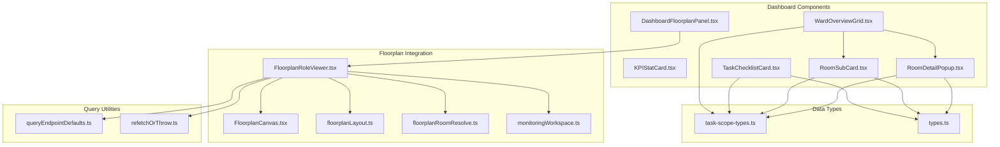
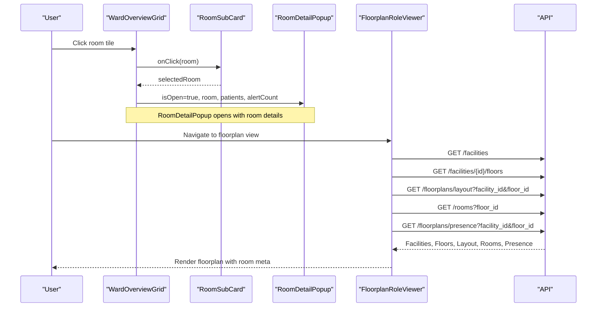
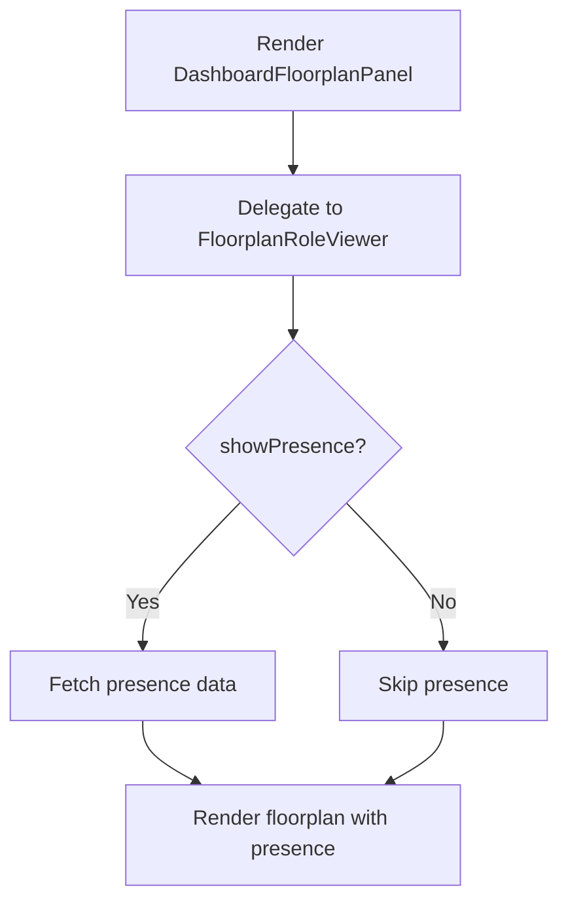
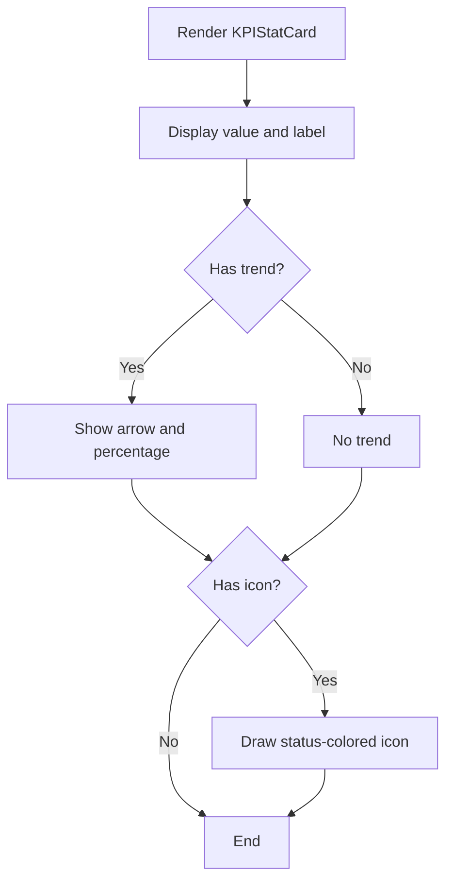
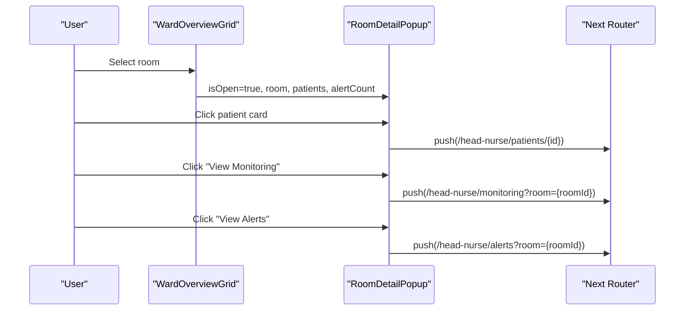
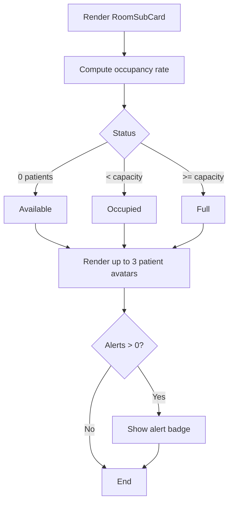
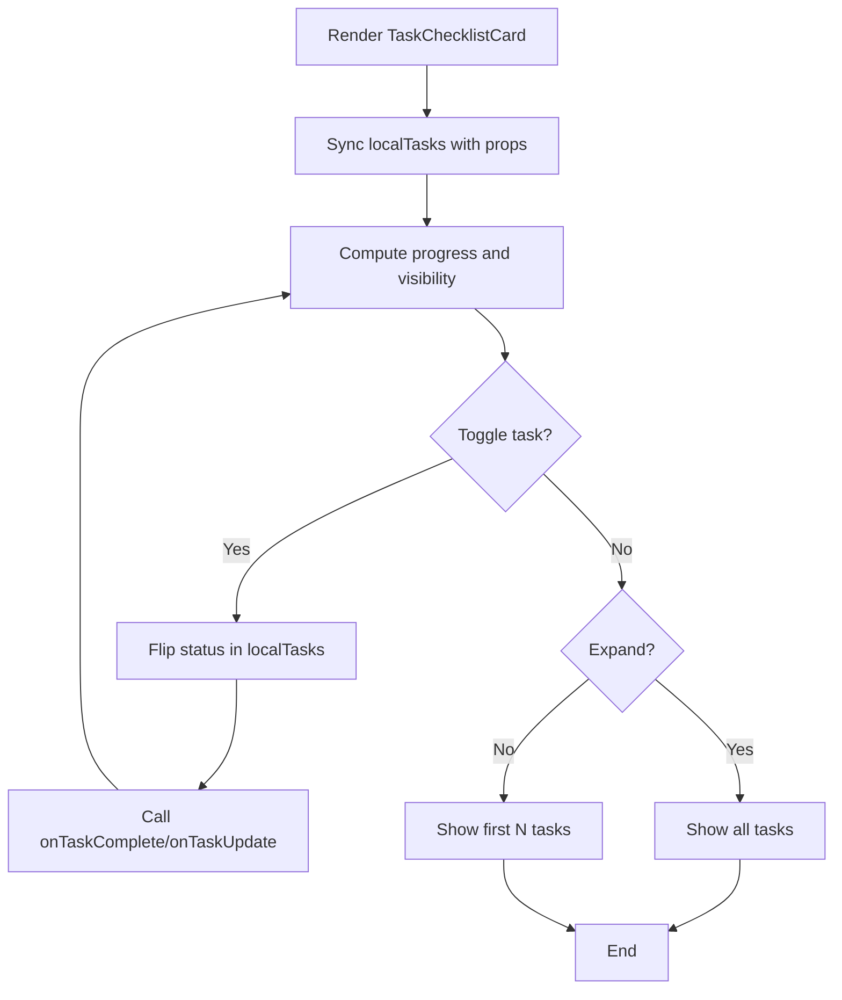
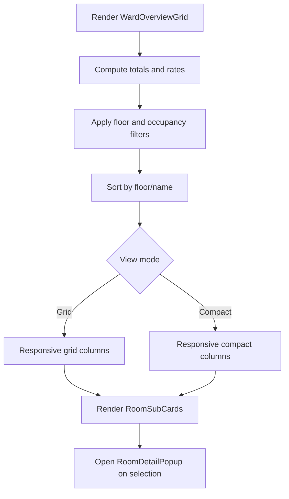
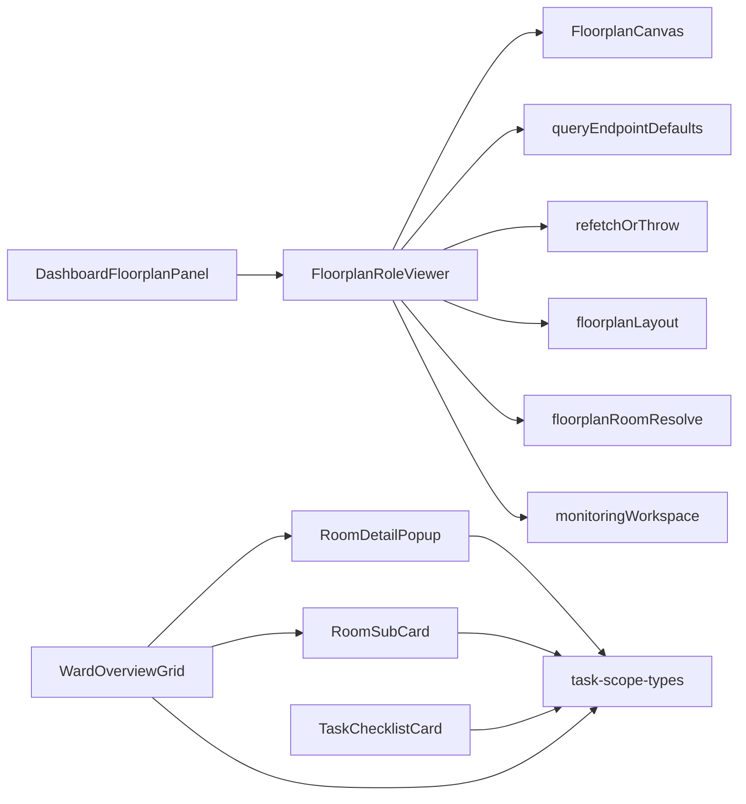
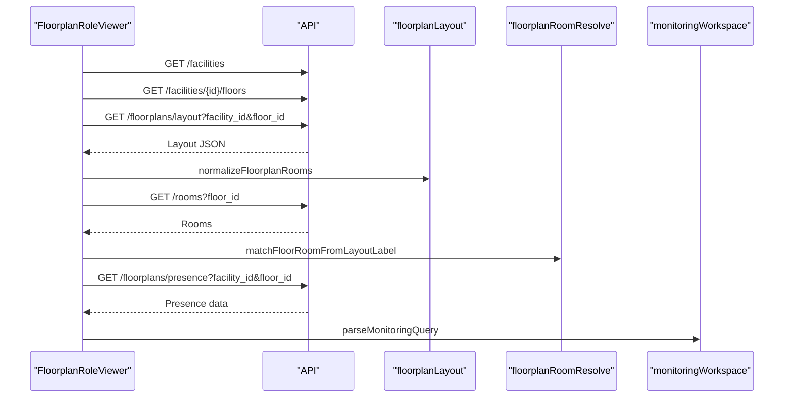

# Dashboard Components

<cite>
**Referenced Files in This Document**
- [DashboardFloorplanPanel.tsx](file://frontend/components/dashboard/DashboardFloorplanPanel.tsx)
- [KPIStatCard.tsx](file://frontend/components/dashboard/KPIStatCard.tsx)
- [RoomDetailPopup.tsx](file://frontend/components/dashboard/RoomDetailPopup.tsx)
- [RoomSubCard.tsx](file://frontend/components/dashboard/RoomSubCard.tsx)
- [TaskChecklistCard.tsx](file://frontend/components/dashboard/TaskChecklistCard.tsx)
- [WardOverviewGrid.tsx](file://frontend/components/dashboard/WardOverviewGrid.tsx)
- [FloorplanRoleViewer.tsx](file://frontend/components/floorplan/FloorplanRoleViewer.tsx)
- [FloorplanCanvas.tsx](file://frontend/components/floorplan/FloorplanCanvas.tsx)
- [floorplanLayout.ts](file://frontend/lib/floorplanLayout.ts)
- [floorplanRoomResolve.ts](file://frontend/lib/floorplanRoomResolve.ts)
- [monitoringWorkspace.ts](file://frontend/lib/monitoringWorkspace.ts)
- [task-scope-types.ts](file://frontend/lib/api/task-scope-types.ts)
- [types.ts](file://frontend/lib/types.ts)
- [queryEndpointDefaults.ts](file://frontend/lib/queryEndpointDefaults.ts)
- [refetchOrThrow.ts](file://frontend/lib/refetchOrThrow.ts)
</cite>

## Table of Contents
1. [Introduction](#introduction)
2. [Project Structure](#project-structure)
3. [Core Components](#core-components)
4. [Architecture Overview](#architecture-overview)
5. [Detailed Component Analysis](#detailed-component-analysis)
6. [Dependency Analysis](#dependency-analysis)
7. [Performance Considerations](#performance-considerations)
8. [Troubleshooting Guide](#troubleshooting-guide)
9. [Conclusion](#conclusion)
10. [Appendices](#appendices)

## Introduction
This document explains the WheelSense Platform dashboard components focused on visualization and operational insights. It covers:
- DashboardFloorplanPanel for floorplan visualization
- KPIStatCard for key performance indicators
- RoomDetailPopup for room information display
- RoomSubCard for room summaries
- TaskChecklistCard for task management
- WardOverviewGrid for ward-wide views

It details how these components integrate with real-time data flows and workspace context, including data binding, event handling, update mechanisms, responsive design, and performance optimizations for dashboard-heavy interfaces.

## Project Structure
The dashboard components are located under frontend/components/dashboard and leverage shared floorplan and data utilities under frontend/components/floorplan and frontend/lib respectively. They rely on TanStack Query for reactive data fetching and UI primitives from a shared component library.

**Diagram sources**
- [DashboardFloorplanPanel.tsx:1-30](file://frontend/components/dashboard/DashboardFloorplanPanel.tsx#L1-L30)
- [KPIStatCard.tsx:1-104](file://frontend/components/dashboard/KPIStatCard.tsx#L1-L104)
- [RoomDetailPopup.tsx:1-276](file://frontend/components/dashboard/RoomDetailPopup.tsx#L1-L276)
- [RoomSubCard.tsx:1-138](file://frontend/components/dashboard/RoomSubCard.tsx#L1-L138)
- [TaskChecklistCard.tsx:1-261](file://frontend/components/dashboard/TaskChecklistCard.tsx#L1-L261)
- [WardOverviewGrid.tsx:1-269](file://frontend/components/dashboard/WardOverviewGrid.tsx#L1-L269)
- [FloorplanRoleViewer.tsx:1-800](file://frontend/components/floorplan/FloorplanRoleViewer.tsx#L1-L800)
- [FloorplanCanvas.tsx:1-617](file://frontend/components/floorplan/FloorplanCanvas.tsx#L1-L617)
- [floorplanLayout.ts:1-103](file://frontend/lib/floorplanLayout.ts#L1-L103)
- [floorplanRoomResolve.ts:1-108](file://frontend/lib/floorplanRoomResolve.ts#L1-L108)
- [monitoringWorkspace.ts:1-146](file://frontend/lib/monitoringWorkspace.ts#L1-L146)
- [task-scope-types.ts:1-406](file://frontend/lib/api/task-scope-types.ts#L1-L406)
- [types.ts:1-482](file://frontend/lib/types.ts#L1-L482)
- [queryEndpointDefaults.ts:1-22](file://frontend/lib/queryEndpointDefaults.ts#L1-L22)
- [refetchOrThrow.ts:1-11](file://frontend/lib/refetchOrThrow.ts#L1-L11)

**Section sources**
- [DashboardFloorplanPanel.tsx:1-30](file://frontend/components/dashboard/DashboardFloorplanPanel.tsx#L1-L30)
- [WardOverviewGrid.tsx:1-269](file://frontend/components/dashboard/WardOverviewGrid.tsx#L1-L269)

## Core Components
- DashboardFloorplanPanel: Thin wrapper delegating to FloorplanRoleViewer with optional presence rendering and initial selection props.
- KPIStatCard: A self-contained stat card with optional trend indicator, status coloring, and click handler.
- RoomDetailPopup: Modal dialog displaying room summary, patient list, device status, and quick actions.
- RoomSubCard: Compact room summary card with occupancy status, patient avatars, and alert indicator.
- TaskChecklistCard: Interactive task list with completion toggles, due-time calculation, and expand/collapse.
- WardOverviewGrid: Grid of RoomSubCards with filtering, sorting, and a RoomDetailPopup for details.

**Section sources**
- [DashboardFloorplanPanel.tsx:1-30](file://frontend/components/dashboard/DashboardFloorplanPanel.tsx#L1-L30)
- [KPIStatCard.tsx:1-104](file://frontend/components/dashboard/KPIStatCard.tsx#L1-L104)
- [RoomDetailPopup.tsx:1-276](file://frontend/components/dashboard/RoomDetailPopup.tsx#L1-L276)
- [RoomSubCard.tsx:1-138](file://frontend/components/dashboard/RoomSubCard.tsx#L1-L138)
- [TaskChecklistCard.tsx:1-261](file://frontend/components/dashboard/TaskChecklistCard.tsx#L1-L261)
- [WardOverviewGrid.tsx:1-269](file://frontend/components/dashboard/WardOverviewGrid.tsx#L1-L269)

## Architecture Overview
The dashboard integrates floorplan presence data via FloorplanRoleViewer, which fetches facilities, floors, room layouts, and presence telemetry. RoomSubCard composes per-room summaries, and WardOverviewGrid orchestrates filtering, sorting, and selection into a RoomDetailPopup. TaskChecklistCard consumes care task data, and KPIStatCard renders aggregated metrics.

**Diagram sources**
- [WardOverviewGrid.tsx:114-117](file://frontend/components/dashboard/WardOverviewGrid.tsx#L114-L117)
- [RoomDetailPopup.tsx:53-64](file://frontend/components/dashboard/RoomDetailPopup.tsx#L53-L64)
- [FloorplanRoleViewer.tsx:596-702](file://frontend/components/floorplan/FloorplanRoleViewer.tsx#L596-L702)

## Detailed Component Analysis

### DashboardFloorplanPanel
- Purpose: Provide a dashboard-friendly floorplan viewer by delegating to FloorplanRoleViewer.
- Props: className, showPresence, initialFacilityId, initialFloorId, initialRoomName.
- Behavior: Passes through props to FloorplanRoleViewer; presence rendering controlled by showPresence.

**Diagram sources**
- [DashboardFloorplanPanel.tsx:13-29](file://frontend/components/dashboard/DashboardFloorplanPanel.tsx#L13-L29)
- [FloorplanRoleViewer.tsx:567-574](file://frontend/components/floorplan/FloorplanRoleViewer.tsx#L567-L574)

**Section sources**
- [DashboardFloorplanPanel.tsx:1-30](file://frontend/components/dashboard/DashboardFloorplanPanel.tsx#L1-L30)
- [FloorplanRoleViewer.tsx:567-574](file://frontend/components/floorplan/FloorplanRoleViewer.tsx#L567-L574)

### KPIStatCard
- Purpose: Display a single metric with optional trend, icon, and status coloring.
- Props: value, label, trend, icon, status, onClick, className.
- Behavior: Renders a card with value and label; trend arrow and percentage; colored status chip; optional icon; click handler.

**Diagram sources**
- [KPIStatCard.tsx:36-103](file://frontend/components/dashboard/KPIStatCard.tsx#L36-L103)

**Section sources**
- [KPIStatCard.tsx:1-104](file://frontend/components/dashboard/KPIStatCard.tsx#L1-L104)

### RoomDetailPopup
- Purpose: Modal dialog showing room details, patient list, device status, and quick actions.
- Props: isOpen, onClose, room, patients, devices, alertCount.
- Behavior: Computes online/offline device counts, renders patient cards with navigation, lists devices with status badges and battery, and provides buttons to view monitoring and alerts.

**Diagram sources**
- [WardOverviewGrid.tsx:114-117](file://frontend/components/dashboard/WardOverviewGrid.tsx#L114-L117)
- [RoomDetailPopup.tsx:143-194](file://frontend/components/dashboard/RoomDetailPopup.tsx#L143-L194)
- [RoomDetailPopup.tsx:257-269](file://frontend/components/dashboard/RoomDetailPopup.tsx#L257-L269)

**Section sources**
- [RoomDetailPopup.tsx:1-276](file://frontend/components/dashboard/RoomDetailPopup.tsx#L1-L276)

### RoomSubCard
- Purpose: Compact room summary with occupancy status, patient avatars, and alert indicator.
- Props: room, patients, alertCount, onClick, className.
- Behavior: Calculates occupancy rate, selects status color, displays up to three patient avatars with remaining count, and shows alert badge.

**Diagram sources**
- [RoomSubCard.tsx:22-58](file://frontend/components/dashboard/RoomSubCard.tsx#L22-L58)
- [RoomSubCard.tsx:105-133](file://frontend/components/dashboard/RoomSubCard.tsx#L105-L133)

**Section sources**
- [RoomSubCard.tsx:1-138](file://frontend/components/dashboard/RoomSubCard.tsx#L1-L138)

### TaskChecklistCard
- Purpose: Display and manage care tasks with completion toggles and due-time hints.
- Props: tasks, onTaskComplete, onTaskUpdate, className, showHeader, maxDisplay.
- Behavior: Maintains local state synchronized with incoming props, computes progress, supports expand/collapse, and navigates to task detail on click.

**Diagram sources**
- [TaskChecklistCard.tsx:76-118](file://frontend/components/dashboard/TaskChecklistCard.tsx#L76-L118)
- [TaskChecklistCard.tsx:235-254](file://frontend/components/dashboard/TaskChecklistCard.tsx#L235-L254)

**Section sources**
- [TaskChecklistCard.tsx:1-261](file://frontend/components/dashboard/TaskChecklistCard.tsx#L1-L261)

### WardOverviewGrid
- Purpose: Grid of RoomSubCards with filters, sorting, and a RoomDetailPopup.
- Props: rooms, onRoomClick, className, showFilters.
- Behavior: Computes stats, filters by floor and occupancy, sorts by floor/name, toggles view mode, and opens RoomDetailPopup on selection.

**Diagram sources**
- [WardOverviewGrid.tsx:94-112](file://frontend/components/dashboard/WardOverviewGrid.tsx#L94-L112)
- [WardOverviewGrid.tsx:59-91](file://frontend/components/dashboard/WardOverviewGrid.tsx#L59-L91)
- [WardOverviewGrid.tsx:240-254](file://frontend/components/dashboard/WardOverviewGrid.tsx#L240-L254)
- [WardOverviewGrid.tsx:258-265](file://frontend/components/dashboard/WardOverviewGrid.tsx#L258-L265)

**Section sources**
- [WardOverviewGrid.tsx:1-269](file://frontend/components/dashboard/WardOverviewGrid.tsx#L1-L269)

## Dependency Analysis
- DashboardFloorplanPanel depends on FloorplanRoleViewer and passes through props for initial selection and presence rendering.
- FloorplanRoleViewer integrates TanStack Query to fetch facilities, floors, room layouts, rooms, and presence data. It computes room meta (occupancy, alerts, device summaries) and feeds FloorplanCanvas.
- RoomDetailPopup and RoomSubCard consume typed patient and alert data from task-scope-types and shared types.
- TaskChecklistCard consumes care task types and provides callbacks for task updates.
- WardOverviewGrid composes RoomSubCard and RoomDetailPopup, and manages filtering and sorting.

**Diagram sources**
- [DashboardFloorplanPanel.tsx:3-28](file://frontend/components/dashboard/DashboardFloorplanPanel.tsx#L3-L28)
- [FloorplanRoleViewer.tsx:20-40](file://frontend/components/floorplan/FloorplanRoleViewer.tsx#L20-L40)
- [queryEndpointDefaults.ts:1-22](file://frontend/lib/queryEndpointDefaults.ts#L1-L22)
- [refetchOrThrow.ts:1-11](file://frontend/lib/refetchOrThrow.ts#L1-L11)
- [floorplanLayout.ts:1-103](file://frontend/lib/floorplanLayout.ts#L1-L103)
- [floorplanRoomResolve.ts:1-108](file://frontend/lib/floorplanRoomResolve.ts#L1-L108)
- [monitoringWorkspace.ts:1-146](file://frontend/lib/monitoringWorkspace.ts#L1-L146)
- [RoomDetailPopup.tsx:30-60](file://frontend/components/dashboard/RoomDetailPopup.tsx#L30-L60)
- [RoomSubCard.tsx:7-28](file://frontend/components/dashboard/RoomSubCard.tsx#L7-L28)
- [TaskChecklistCard.tsx:22-31](file://frontend/components/dashboard/TaskChecklistCard.tsx#L22-L31)
- [WardOverviewGrid.tsx:11-13](file://frontend/components/dashboard/WardOverviewGrid.tsx#L11-L13)

**Section sources**
- [DashboardFloorplanPanel.tsx:1-30](file://frontend/components/dashboard/DashboardFloorplanPanel.tsx#L1-L30)
- [FloorplanRoleViewer.tsx:1-800](file://frontend/components/floorplan/FloorplanRoleViewer.tsx#L1-L800)
- [RoomDetailPopup.tsx:1-276](file://frontend/components/dashboard/RoomDetailPopup.tsx#L1-L276)
- [RoomSubCard.tsx:1-138](file://frontend/components/dashboard/RoomSubCard.tsx#L1-L138)
- [TaskChecklistCard.tsx:1-261](file://frontend/components/dashboard/TaskChecklistCard.tsx#L1-L261)
- [WardOverviewGrid.tsx:1-269](file://frontend/components/dashboard/WardOverviewGrid.tsx#L1-L269)

## Performance Considerations
- Data polling and staleness: FloorplanRoleViewer uses endpoint-aware polling and stale times to balance freshness and load. Adjust intervals for presence and HA devices to reduce API pressure.
- Memoization: WardOverviewGrid uses useMemo for filtered rooms and stats to avoid unnecessary recomputation during filtering and sorting.
- Local state synchronization: TaskChecklistCard maintains local state and syncs with props to prevent redundant renders.
- Rendering thresholds: TaskChecklistCard truncates long lists and provides expand/collapse to limit DOM nodes.
- Canvas performance: FloorplanCanvas clamps zoom and pan, snaps rooms to grid, and limits presence dots per room in compact mode.

Recommendations:
- Tune polling intervals per endpoint using queryEndpointDefaults.
- Debounce filter changes in WardOverviewGrid for rapid filter toggles.
- Virtualize long lists in TaskChecklistCard if task volumes grow large.
- Prefer shallow prop comparisons and memoized selectors for frequently changing datasets.

[No sources needed since this section provides general guidance]

## Troubleshooting Guide
Common issues and resolutions:
- Presence data not updating: Verify FloorplanRoleViewer’s presence endpoint and polling interval. Use refetchOrThrow after mutations to ensure fresh data.
- Room meta mismatch: Confirm floorplan layout normalization and room resolution logic align with DB room names and numeric IDs.
- Task completion callbacks not firing: Ensure onTaskComplete and onTaskUpdate handlers are passed and invoked with correct task IDs.
- Navigation failures: Validate routing paths for patient and task detail pages; ensure room IDs are properly encoded in query strings.

**Section sources**
- [FloorplanRoleViewer.tsx:687-702](file://frontend/components/floorplan/FloorplanRoleViewer.tsx#L687-L702)
- [refetchOrThrow.ts:4-10](file://frontend/lib/refetchOrThrow.ts#L4-L10)
- [floorplanRoomResolve.ts:63-82](file://frontend/lib/floorplanRoomResolve.ts#L63-L82)
- [TaskChecklistCard.tsx:100-114](file://frontend/components/dashboard/TaskChecklistCard.tsx#L100-L114)

## Conclusion
The dashboard components form a cohesive, data-driven system. DashboardFloorplanPanel delegates to FloorplanRoleViewer for real-time floorplan insights. RoomSubCard and WardOverviewGrid provide efficient room summaries and filtering. RoomDetailPopup consolidates room details and quick actions. TaskChecklistCard enables interactive task management. KPIStatCard communicates key metrics. Together, they leverage TanStack Query, typed data contracts, and responsive design to deliver a performant, maintainable dashboard experience.

[No sources needed since this section summarizes without analyzing specific files]

## Appendices

### Real-time Data Flow and Workspace Context
- Facilities and Floors: Fetched to populate facility and floor pickers; drives layout and room queries.
- Floor Layout: Normalized from saved layout JSON or bootstrapped from DB rooms.
- Presence Telemetry: Periodically polled to compute room meta (occupancy, alerts, device summaries).
- Workspace Query: Monitoring workspace query parsing and redirects support legacy tabs and URL-driven navigation.

**Diagram sources**
- [FloorplanRoleViewer.tsx:596-702](file://frontend/components/floorplan/FloorplanRoleViewer.tsx#L596-L702)
- [floorplanLayout.ts:55-72](file://frontend/lib/floorplanLayout.ts#L55-L72)
- [floorplanRoomResolve.ts:24-58](file://frontend/lib/floorplanRoomResolve.ts#L24-L58)
- [monitoringWorkspace.ts:33-42](file://frontend/lib/monitoringWorkspace.ts#L33-L42)