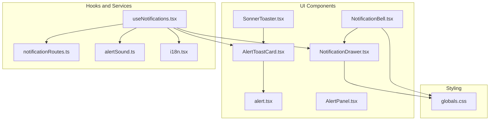
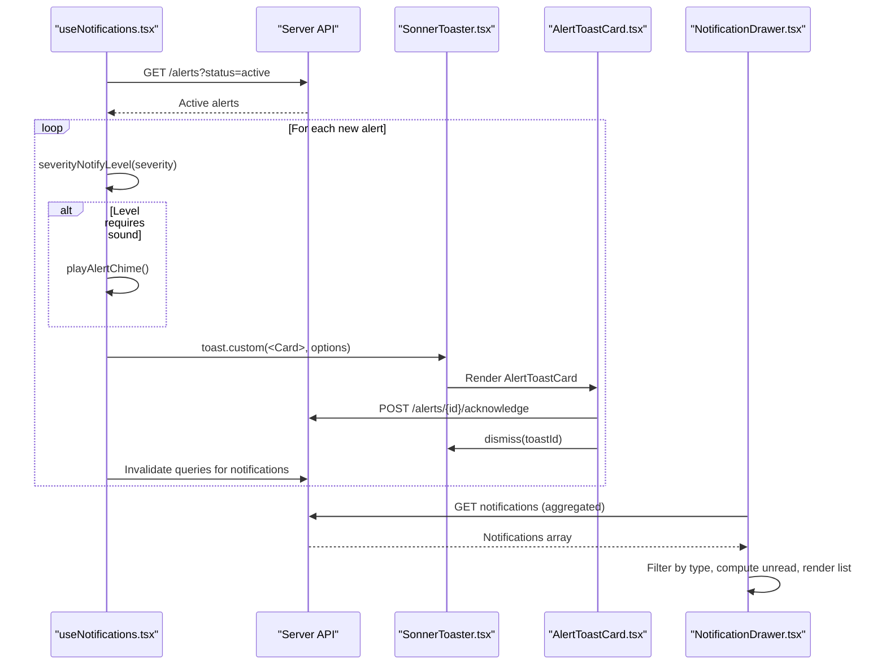
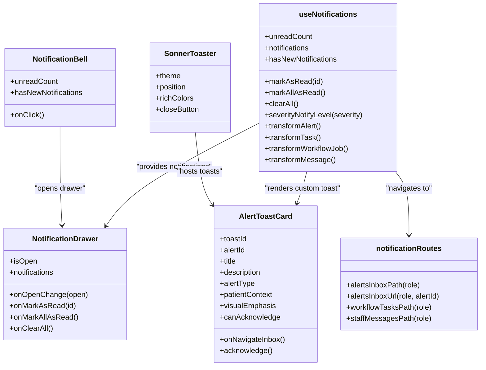
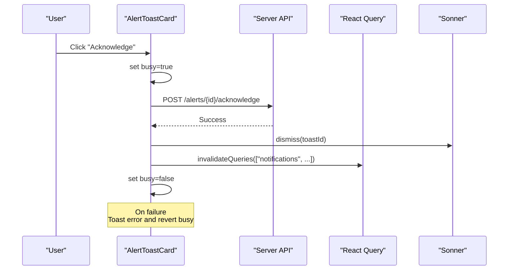
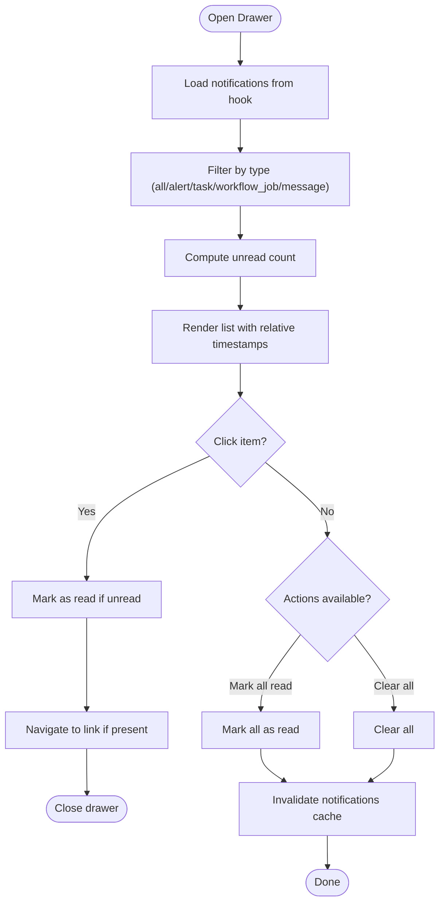
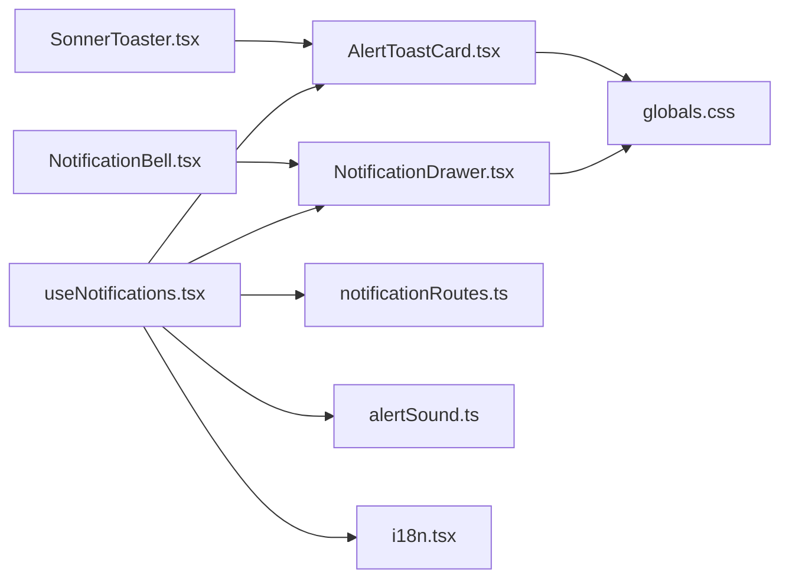

# Notification Components

<cite>
**Referenced Files in This Document**
- [AlertToastCard.tsx](file://frontend/components/notifications/AlertToastCard.tsx)
- [NotificationBell.tsx](file://frontend/components/NotificationBell.tsx)
- [NotificationDrawer.tsx](file://frontend/components/NotificationDrawer.tsx)
- [useNotifications.tsx](file://frontend/hooks/useNotifications.tsx)
- [SonnerToaster.tsx](file://frontend/components/SonnerToaster.tsx)
- [notificationRoutes.ts](file://frontend/lib/notificationRoutes.ts)
- [alert.tsx](file://frontend/components/ui/alert.tsx)
- [AlertPanel.tsx](file://frontend/components/shared/AlertPanel.tsx)
- [globals.css](file://frontend/app/globals.css)
- [alertSound.ts](file://frontend/lib/alertSound.ts)
- [i18n.tsx](file://frontend/lib/i18n.tsx)
</cite>

## Table of Contents
1. [Introduction](#introduction)
2. [Project Structure](#project-structure)
3. [Core Components](#core-components)
4. [Architecture Overview](#architecture-overview)
5. [Detailed Component Analysis](#detailed-component-analysis)
6. [Dependency Analysis](#dependency-analysis)
7. [Performance Considerations](#performance-considerations)
8. [Troubleshooting Guide](#troubleshooting-guide)
9. [Conclusion](#conclusion)
10. [Appendices](#appendices)

## Introduction
This document explains the WheelSense Platform notification and alert system with a focus on three UI components:
- AlertToastCard: Inline toast notifications for real-time alert events
- NotificationBell: Bell-shaped trigger for opening the centralized notification drawer
- NotificationDrawer: Centralized drawer for browsing, filtering, and managing notifications

It covers the notification lifecycle, priority handling, user interaction patterns, integration with the alert system, real-time streams, dismissal handling, notification history management, accessibility and keyboard navigation, screen reader support, theming, and customization options.

## Project Structure
The notification system spans UI components, a central hook for fetching and transforming notifications, routing helpers, theming, and accessibility utilities.

**Diagram sources**
- [AlertToastCard.tsx:1-122](file://frontend/components/notifications/AlertToastCard.tsx#L1-L122)
- [NotificationBell.tsx:1-47](file://frontend/components/NotificationBell.tsx#L1-L47)
- [NotificationDrawer.tsx:1-281](file://frontend/components/NotificationDrawer.tsx#L1-L281)
- [SonnerToaster.tsx:1-20](file://frontend/components/SonnerToaster.tsx#L1-L20)
- [useNotifications.tsx:1-423](file://frontend/hooks/useNotifications.tsx#L1-L423)
- [notificationRoutes.ts:1-62](file://frontend/lib/notificationRoutes.ts#L1-L62)
- [alert.tsx:1-59](file://frontend/components/ui/alert.tsx#L1-L59)
- [AlertPanel.tsx:1-152](file://frontend/components/shared/AlertPanel.tsx#L1-L152)
- [globals.css:1-326](file://frontend/app/globals.css#L1-L326)
- [alertSound.ts:1-49](file://frontend/lib/alertSound.ts#L1-L49)
- [i18n.tsx:1-800](file://frontend/lib/i18n.tsx#L1-L800)

**Section sources**
- [AlertToastCard.tsx:1-122](file://frontend/components/notifications/AlertToastCard.tsx#L1-L122)
- [NotificationBell.tsx:1-47](file://frontend/components/NotificationBell.tsx#L1-L47)
- [NotificationDrawer.tsx:1-281](file://frontend/components/NotificationDrawer.tsx#L1-L281)
- [useNotifications.tsx:1-423](file://frontend/hooks/useNotifications.tsx#L1-L423)
- [SonnerToaster.tsx:1-20](file://frontend/components/SonnerToaster.tsx#L1-L20)
- [notificationRoutes.ts:1-62](file://frontend/lib/notificationRoutes.ts#L1-L62)
- [alert.tsx:1-59](file://frontend/components/ui/alert.tsx#L1-L59)
- [AlertPanel.tsx:1-152](file://frontend/components/shared/AlertPanel.tsx#L1-L152)
- [globals.css:1-326](file://frontend/app/globals.css#L1-L326)
- [alertSound.ts:1-49](file://frontend/lib/alertSound.ts#L1-L49)
- [i18n.tsx:1-800](file://frontend/lib/i18n.tsx#L1-L800)

## Core Components
- AlertToastCard: Renders a single alert toast with title, description, optional patient context, type label, and action buttons. Supports acknowledgment and navigation to the alert inbox. Uses Sonner toasts and integrates with React Query invalidation to keep UI in sync.
- NotificationBell: A bell icon button that displays an unread count badge and optional pulsing animation for new notifications. Provides an accessible aria-label and supports keyboard activation.
- NotificationDrawer: A sliding drawer that lists notifications with filtering by type, relative timestamps, priority badges, read/unread indicators, and actions to mark as read or clear. Integrates with routing helpers to navigate to relevant pages.

**Section sources**
- [AlertToastCard.tsx:13-122](file://frontend/components/notifications/AlertToastCard.tsx#L13-L122)
- [NotificationBell.tsx:8-47](file://frontend/components/NotificationBell.tsx#L8-L47)
- [NotificationDrawer.tsx:24-281](file://frontend/components/NotificationDrawer.tsx#L24-L281)

## Architecture Overview
The notification architecture combines real-time polling, transformed notification entities, and UI components orchestrated by a central hook.

**Diagram sources**
- [useNotifications.tsx:203-297](file://frontend/hooks/useNotifications.tsx#L203-L297)
- [SonnerToaster.tsx:6-19](file://frontend/components/SonnerToaster.tsx#L6-L19)
- [AlertToastCard.tsx:43-62](file://frontend/components/notifications/AlertToastCard.tsx#L43-L62)
- [NotificationDrawer.tsx:100-122](file://frontend/components/NotificationDrawer.tsx#L100-L122)

## Detailed Component Analysis

### AlertToastCard
Purpose:
- Display a single alert as a toast with contextual information and actions.
- Allow acknowledgment and navigation to the alert inbox.

Key behaviors:
- Acknowledgment flow:
  - Calls the server endpoint to acknowledge the alert.
  - Dismisses the toast immediately upon success.
  - Invalidates multiple React Query caches to refresh related views.
  - Shows an error toast on failure.
- Visual emphasis:
  - Applies a special “interrupt” style for observer role with high-severity alerts.
- Patient context:
  - Resolves patient name and room location asynchronously when available.

Accessibility and UX:
- Uses translated labels for buttons and content.
- Responsive layout with appropriate spacing and typography.

Integration points:
- Consumed by the central hook via Sonner’s custom toast renderer.
- Navigates to role-specific alert inbox via routing helpers.

**Section sources**
- [AlertToastCard.tsx:13-122](file://frontend/components/notifications/AlertToastCard.tsx#L13-L122)
- [useNotifications.tsx:268-288](file://frontend/hooks/useNotifications.tsx#L268-L288)
- [notificationRoutes.ts:23-28](file://frontend/lib/notificationRoutes.ts#L23-L28)

### NotificationBell
Purpose:
- Provide a quick, accessible trigger to open the notification drawer.
- Indicate unread count and highlight new notifications.

Key behaviors:
- Unread count badge updates based on unread notifications.
- Optional pulsing animation when new notifications arrive.
- Accessible label for screen readers.

Keyboard and screen reader support:
- Button is keyboard-focusable and activated via Enter/Space.
- aria-label provides meaningful context.

**Section sources**
- [NotificationBell.tsx:8-47](file://frontend/components/NotificationBell.tsx#L8-L47)

### NotificationDrawer
Purpose:
- Centralized hub for viewing, filtering, and managing notifications.

Key behaviors:
- Filtering:
  - Tabs to filter by notification type (alert, task, workflow_job, message).
  - Per-type unread counts displayed inline.
- Sorting and presentation:
  - Sorts notifications by timestamp (newest first).
  - Relative timestamps computed per locale.
- Actions:
  - Mark all as read.
  - Clear all notifications.
  - Mark individual items as read on click.
  - Navigate to linked destination when clicking an item.
- Priority badges:
  - Low, medium, high, urgent mapped to themed badges.

Accessibility and UX:
- Hover/focus states for actionable items.
- Read/unread visual cues.
- Empty state with icon and text.

**Section sources**
- [NotificationDrawer.tsx:24-281](file://frontend/components/NotificationDrawer.tsx#L24-L281)

### Central Hook: useNotifications
Purpose:
- Fetch, poll, transform, and manage notifications across multiple domains (alerts, tasks, workflow jobs, messages).
- Drive real-time toast notifications and drawer content.

Key responsibilities:
- Real-time polling:
  - Alerts: 10 seconds.
  - Tasks, workflow jobs, messages: 30 seconds.
- Severity-to-toast mapping:
  - Low/info/informational → no toast.
  - Medium/moderate → toast.
  - Other → toast with sound.
- Alert toast composition:
  - Builds patient context (name and room) when applicable.
  - Applies “interrupt” emphasis for observer with high-severity alerts.
  - Plays alert chime when appropriate.
  - Uses Sonner’s custom renderer with a unique toast id.
- Notification aggregation:
  - Transforms domain-specific entities into a unified Notification[].
  - Computes unread state and “has new notifications” flag.
- Drawer operations:
  - Mark as read (client-side cache + server call for messages).
  - Mark all as read (client-side cache + server calls for messages).
  - Clear all (client-side cache + cache invalidation).

Priority handling:
- Alerts: severity mapped to priority (low/medium/high/urgent).
- Tasks: priority field carried over.
- Workflow jobs: fixed medium priority.
- Messages: fixed medium priority.

Dismissal handling:
- Individual mark-as-read toggles unread state and calls server for messages.
- Mark all as read updates client-side state and server state for unread messages.
- Clear all marks all as read and invalidates the notifications cache.

Notification history management:
- Maintains a signature map for workflow jobs to detect changes and emit updates.
- Keeps a set of acknowledged alert toast ids to avoid duplicate toasts.

Integration with alert system:
- Routes to role-specific alert inbox and task pages.
- Integrates with Sonner for toasts and with React Query for cache invalidation.

**Section sources**
- [useNotifications.tsx:56-61](file://frontend/hooks/useNotifications.tsx#L56-L61)
- [useNotifications.tsx:102-184](file://frontend/hooks/useNotifications.tsx#L102-L184)
- [useNotifications.tsx:231-351](file://frontend/hooks/useNotifications.tsx#L231-L351)
- [useNotifications.tsx:353-422](file://frontend/hooks/useNotifications.tsx#L353-L422)
- [notificationRoutes.ts:6-61](file://frontend/lib/notificationRoutes.ts#L6-L61)

### SonnerToaster
Purpose:
- Configure global toast appearance and behavior.

Key behaviors:
- Theme selection based on resolved theme (light/dark).
- Rich colors and close buttons.
- Position at top-right.
- Font consistency for toast content.

**Section sources**
- [SonnerToaster.tsx:6-19](file://frontend/components/SonnerToaster.tsx#L6-L19)

### UI Alert Component
Purpose:
- Base alert panel component used elsewhere in the platform.

Key behaviors:
- Variants: default and destructive.
- Accessibility: role="alert" on the container.

**Section sources**
- [alert.tsx:21-32](file://frontend/components/ui/alert.tsx#L21-L32)

### Alert Panel (Shared)
Purpose:
- Shared alert list and status management panel.

Key behaviors:
- Filters by status (all, active, acknowledged, resolved).
- Severity-based coloring.
- Acknowledge/resolve actions for supported statuses.

**Section sources**
- [AlertPanel.tsx:19-152](file://frontend/components/shared/AlertPanel.tsx#L19-L152)

## Architecture Overview

**Diagram sources**
- [AlertToastCard.tsx:28-122](file://frontend/components/notifications/AlertToastCard.tsx#L28-L122)
- [NotificationBell.tsx:14-47](file://frontend/components/NotificationBell.tsx#L14-L47)
- [NotificationDrawer.tsx:73-281](file://frontend/components/NotificationDrawer.tsx#L73-L281)
- [useNotifications.tsx:186-422](file://frontend/hooks/useNotifications.tsx#L186-L422)
- [SonnerToaster.tsx:6-19](file://frontend/components/SonnerToaster.tsx#L6-L19)
- [notificationRoutes.ts:5-61](file://frontend/lib/notificationRoutes.ts#L5-L61)

## Detailed Component Analysis

### AlertToastCard: Acknowledgment Flow

**Diagram sources**
- [AlertToastCard.tsx:43-62](file://frontend/components/notifications/AlertToastCard.tsx#L43-L62)
- [useNotifications.tsx:48-56](file://frontend/hooks/useNotifications.tsx#L48-L56)

**Section sources**
- [AlertToastCard.tsx:43-62](file://frontend/components/notifications/AlertToastCard.tsx#L43-L62)

### NotificationDrawer: Filtering and Actions

**Diagram sources**
- [NotificationDrawer.tsx:100-162](file://frontend/components/NotificationDrawer.tsx#L100-L162)
- [useNotifications.tsx:387-412](file://frontend/hooks/useNotifications.tsx#L387-L412)

**Section sources**
- [NotificationDrawer.tsx:100-162](file://frontend/components/NotificationDrawer.tsx#L100-L162)
- [useNotifications.tsx:387-412](file://frontend/hooks/useNotifications.tsx#L387-L412)

### Real-Time Streams and Polling
- Alerts: polled every 10 seconds; new active alerts trigger toasts with optional sound.
- Tasks, workflow jobs, messages: polled every 30 seconds; drawer aggregates all types.
- Severity mapping determines whether to show a toast and whether to play a sound.

**Section sources**
- [useNotifications.tsx:30-31](file://frontend/hooks/useNotifications.tsx#L30-L31)
- [useNotifications.tsx:203-229](file://frontend/hooks/useNotifications.tsx#L203-L229)
- [useNotifications.tsx:241-297](file://frontend/hooks/useNotifications.tsx#L241-L297)

### Priority Handling
- Alerts: severity mapped to priority (low/medium/high/urgent).
- Tasks: carry priority from source.
- Workflow jobs: fixed medium priority.
- Messages: fixed medium priority.
- Drawer displays priority badges with themed colors.

**Section sources**
- [useNotifications.tsx:102-184](file://frontend/hooks/useNotifications.tsx#L102-L184)
- [NotificationDrawer.tsx:59-71](file://frontend/components/NotificationDrawer.tsx#L59-L71)

### Dismissal Handling
- Individual items: mark as read on click; unread state persists until server confirms for messages.
- Mark all as read: updates client-side state and calls server for unread messages.
- Clear all: marks all as read and invalidates the notifications cache.

**Section sources**
- [useNotifications.tsx:387-412](file://frontend/hooks/useNotifications.tsx#L387-L412)

### Notification History Management
- Alert toast ids set tracks active alerts to prevent duplicates.
- Workflow job signature map detects changes and emits updates.
- Drawer maintains a processed list combining multiple sources.

**Section sources**
- [useNotifications.tsx:198-201](file://frontend/hooks/useNotifications.tsx#L198-L201)
- [useNotifications.tsx:299-351](file://frontend/hooks/useNotifications.tsx#L299-L351)
- [useNotifications.tsx:353-373](file://frontend/hooks/useNotifications.tsx#L353-L373)

### Accessibility and Keyboard Navigation
- NotificationBell:
  - aria-label for screen readers.
  - Keyboard focusable and activatable.
- AlertToastCard:
  - Buttons use semantic sizes and variants.
  - Busy state prevents re-click during acknowledgment.
- NotificationDrawer:
  - Interactive elements have hover/focus affordances.
  - Relative timestamps improve readability.
- SonnerToaster:
  - Global toast options configured for usability.

**Section sources**
- [NotificationBell.tsx:28-42](file://frontend/components/NotificationBell.tsx#L28-L42)
- [AlertToastCard.tsx:94-117](file://frontend/components/notifications/AlertToastCard.tsx#L94-L117)
- [NotificationDrawer.tsx:125-279](file://frontend/components/NotificationDrawer.tsx#L125-L279)
- [SonnerToaster.tsx:10-17](file://frontend/components/SonnerToaster.tsx#L10-L17)

### Screen Reader Support
- Role attributes on alert containers.
- Descriptive labels and translated strings for interactive elements.
- Relative time labels aid comprehension.

**Section sources**
- [alert.tsx:27-30](file://frontend/components/ui/alert.tsx#L27-L30)
- [i18n.tsx:189-189](file://frontend/lib/i18n.tsx#L189-L189)

### Theming Options and Customization
- CSS variables define primary, secondary, destructive, and surface colors for both light and dark themes.
- NotificationDrawer and AlertToastCard use themed colors for type icons and priority badges.
- Urgent toasts and “interrupt” styles leverage CSS classes for high-contrast visuals.
- SonnerToaster selects theme based on resolved theme value.

**Section sources**
- [globals.css:4-78](file://frontend/app/globals.css#L4-L78)
- [globals.css:310-325](file://frontend/app/globals.css#L310-L325)
- [NotificationDrawer.tsx:40-71](file://frontend/components/NotificationDrawer.tsx#L40-L71)
- [SonnerToaster.tsx:7-8](file://frontend/components/SonnerToaster.tsx#L7-L8)

## Dependency Analysis

**Diagram sources**
- [useNotifications.tsx:1-18](file://frontend/hooks/useNotifications.tsx#L1-L18)
- [AlertToastCard.tsx:1-10](file://frontend/components/notifications/AlertToastCard.tsx#L1-L10)
- [NotificationDrawer.tsx:1-22](file://frontend/components/NotificationDrawer.tsx#L1-L22)
- [notificationRoutes.ts:1-16](file://frontend/lib/notificationRoutes.ts#L1-L16)
- [alertSound.ts:1-11](file://frontend/lib/alertSound.ts#L1-L11)
- [i18n.tsx:1-10](file://frontend/lib/i18n.tsx#L1-L10)
- [SonnerToaster.tsx:1-5](file://frontend/components/SonnerToaster.tsx#L1-L5)
- [NotificationBell.tsx:1-6](file://frontend/components/NotificationBell.tsx#L1-L6)
- [globals.css:1-326](file://frontend/app/globals.css#L1-L326)

**Section sources**
- [useNotifications.tsx:1-18](file://frontend/hooks/useNotifications.tsx#L1-L18)
- [AlertToastCard.tsx:1-10](file://frontend/components/notifications/AlertToastCard.tsx#L1-L10)
- [NotificationDrawer.tsx:1-22](file://frontend/components/NotificationDrawer.tsx#L1-L22)
- [notificationRoutes.ts:1-16](file://frontend/lib/notificationRoutes.ts#L1-L16)
- [alertSound.ts:1-11](file://frontend/lib/alertSound.ts#L1-L11)
- [i18n.tsx:1-10](file://frontend/lib/i18n.tsx#L1-L10)
- [SonnerToaster.tsx:1-5](file://frontend/components/SonnerToaster.tsx#L1-L5)
- [NotificationBell.tsx:1-6](file://frontend/components/NotificationBell.tsx#L1-L6)
- [globals.css:1-326](file://frontend/app/globals.css#L1-L326)

## Performance Considerations
- Polling intervals:
  - Alerts: 10 seconds to balance responsiveness and server load.
  - Tasks, workflow jobs, messages: 30 seconds for lower urgency.
- Toast rendering:
  - Custom renderer minimizes overhead; dismiss on acknowledgment reduces DOM churn.
- Cache invalidation:
  - Targeted invalidation keys reduce unnecessary refetches.
- Drawer virtualization:
  - Large lists are paginated implicitly by limiting fetched items; consider virtualization for very large histories.

## Troubleshooting Guide
Common issues and resolutions:
- Acknowledgment failures:
  - Symptom: Error toast appears after clicking acknowledge.
  - Resolution: Verify network connectivity and server availability; retry.
- No new toasts despite active alerts:
  - Symptom: Alerts remain active but no toast appears.
  - Resolution: Check severity mapping; ensure polling is enabled and user is authenticated.
- Drawer not updating:
  - Symptom: New notifications do not appear in the drawer.
  - Resolution: Confirm cache invalidation and that the hook is enabled when user is ready.
- Sound not playing:
  - Symptom: High-severity alerts do not play sound.
  - Resolution: Enable alert sound preference and ensure user gesture priming.

**Section sources**
- [AlertToastCard.tsx:57-58](file://frontend/components/notifications/AlertToastCard.tsx#L57-L58)
- [useNotifications.tsx:253-255](file://frontend/hooks/useNotifications.tsx#L253-L255)
- [alertSound.ts:26-48](file://frontend/lib/alertSound.ts#L26-L48)

## Conclusion
The WheelSense notification system provides a cohesive, accessible, and responsive experience for real-time alerts and general notifications. It balances urgency with user control, integrates seamlessly with the alert system, and offers robust customization through theming and priority handling. The components are modular, maintainable, and designed for scalability across roles and notification types.

## Appendices

### Notification Composition Examples
- Alert toast composition:
  - Title and description derived from alert payload.
  - Optional patient context resolved asynchronously.
  - Role-based visual emphasis for observer with high-severity alerts.
- Drawer composition:
  - Unified list of alerts, tasks, workflow jobs, and messages.
  - Relative timestamps and priority badges.
  - Type-specific icons and colors.

**Section sources**
- [useNotifications.tsx:250-288](file://frontend/hooks/useNotifications.tsx#L250-L288)
- [NotificationDrawer.tsx:199-275](file://frontend/components/NotificationDrawer.tsx#L199-L275)

### Dismissal and History Management
- Acknowledgment:
  - Immediate dismissal and cache invalidation.
- Mark as read:
  - Client-side state plus server call for messages.
- Clear all:
  - Marks all as read and invalidates cache.

**Section sources**
- [AlertToastCard.tsx:47-56](file://frontend/components/notifications/AlertToastCard.tsx#L47-L56)
- [useNotifications.tsx:387-412](file://frontend/hooks/useNotifications.tsx#L387-L412)

### Accessibility and Internationalization
- Accessibility:
  - Buttons, labels, and roles support screen readers and keyboard navigation.
- Internationalization:
  - All user-facing strings are translated via the i18n module.

**Section sources**
- [NotificationBell.tsx:28-28](file://frontend/components/NotificationBell.tsx#L28-L28)
- [i18n.tsx:189-189](file://frontend/lib/i18n.tsx#L189-L189)