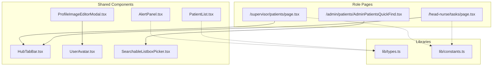
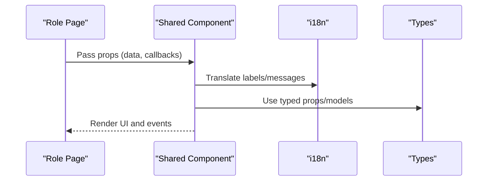
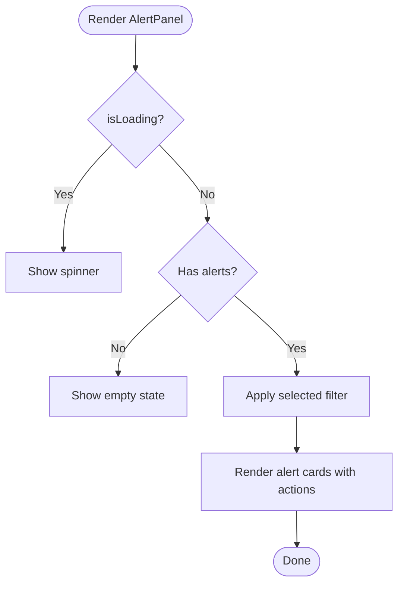
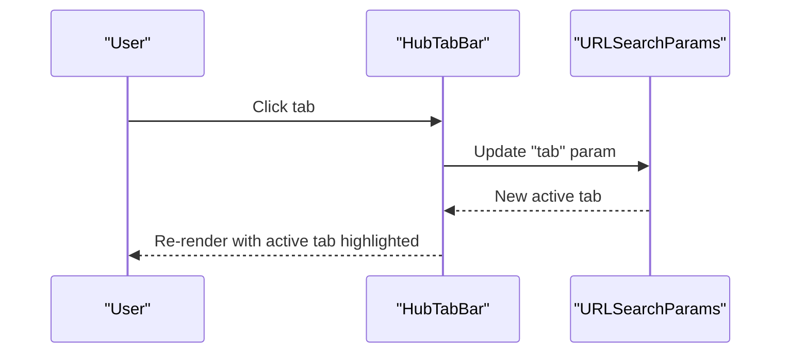
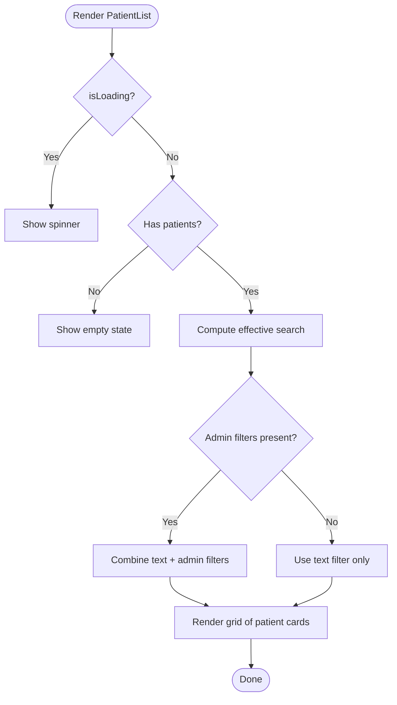
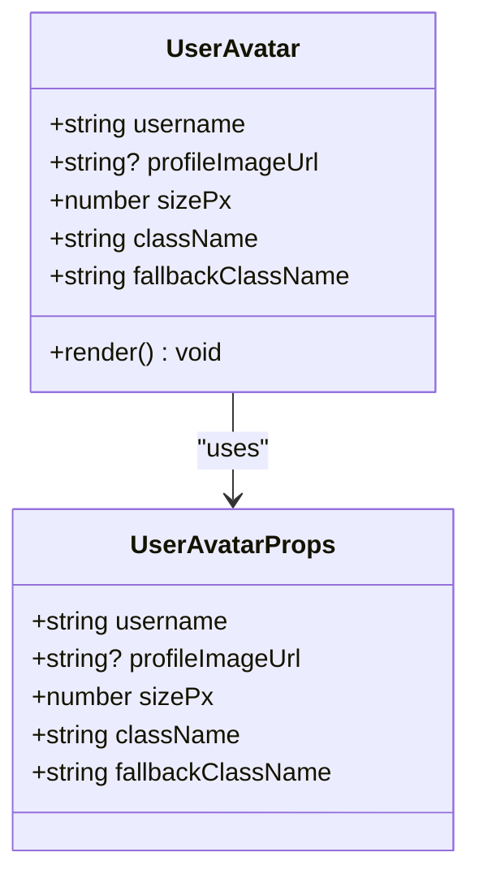
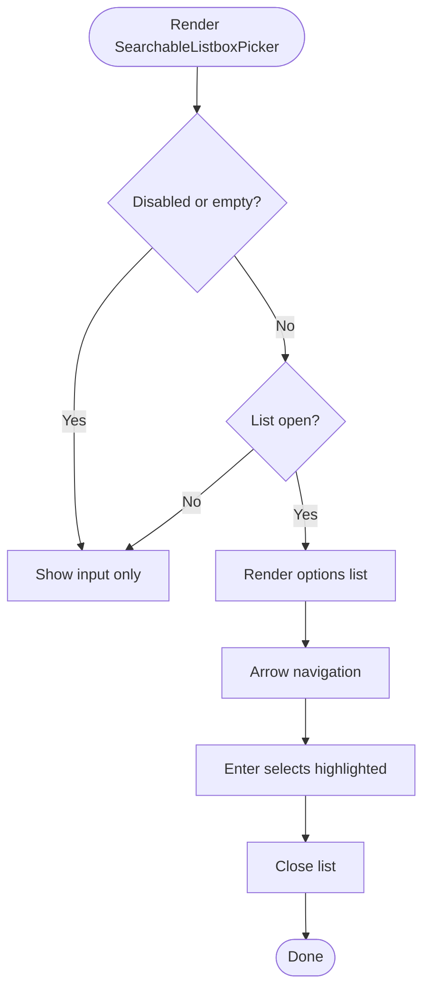
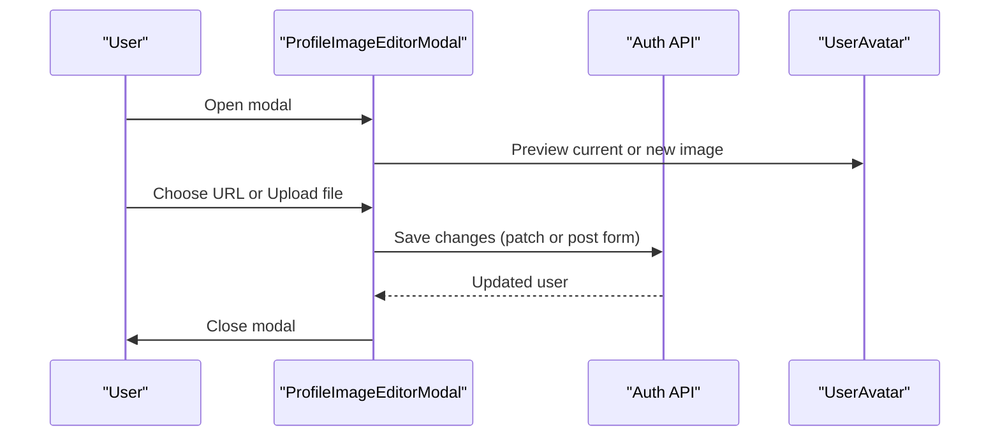
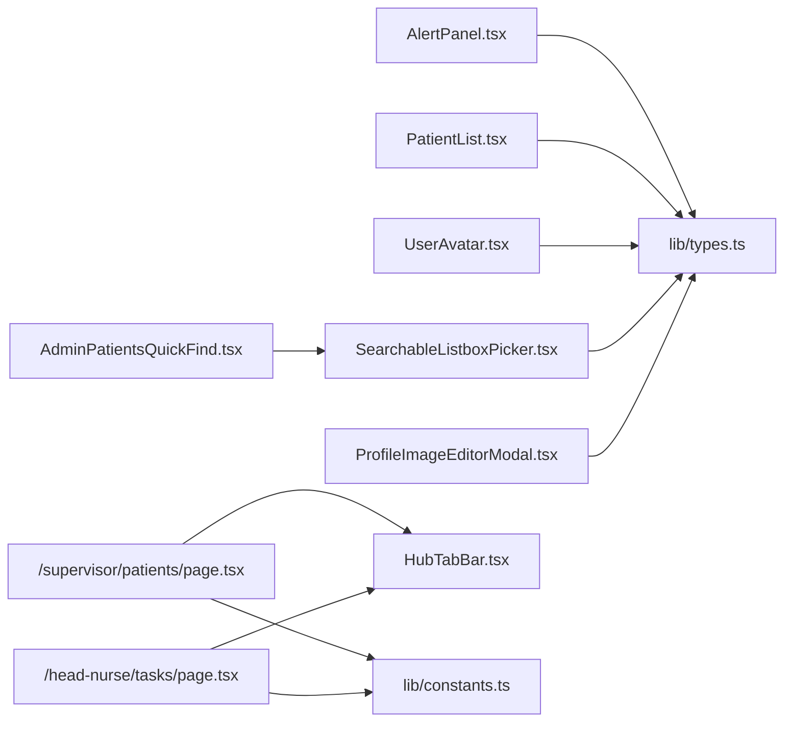

# Shared Components

<cite>
**Referenced Files in This Document**
- [AlertPanel.tsx](file://frontend/components/shared/AlertPanel.tsx)
- [HubTabBar.tsx](file://frontend/components/shared/HubTabBar.tsx)
- [PatientList.tsx](file://frontend/components/shared/PatientList.tsx)
- [UserAvatar.tsx](file://frontend/components/shared/UserAvatar.tsx)
- [SearchableListboxPicker.tsx](file://frontend/components/shared/SearchableListboxPicker.tsx)
- [ProfileImageEditorModal.tsx](file://frontend/components/shared/ProfileImageEditorModal.tsx)
- [AdminPatientsQuickFind.tsx](file://frontend/components/admin/patients/AdminPatientsQuickFind.tsx)
- [page.tsx](file://frontend/app/supervisor/patients/page.tsx)
- [page.tsx](file://frontend/app/head-nurse/tasks/page.tsx)
- [types.ts](file://frontend/lib/types.ts)
- [constants.ts](file://frontend/lib/constants.ts)
</cite>

## Table of Contents
1. [Introduction](#introduction)
2. [Project Structure](#project-structure)
3. [Core Components](#core-components)
4. [Architecture Overview](#architecture-overview)
5. [Detailed Component Analysis](#detailed-component-analysis)
6. [Dependency Analysis](#dependency-analysis)
7. [Performance Considerations](#performance-considerations)
8. [Accessibility Features](#accessibility-features)
9. [Responsive Behavior](#responsive-behavior)
10. [Customization Options](#customization-options)
11. [Integration Patterns with Role-Based Dashboards](#integration-patterns-with-role-based-dashboards)
12. [Usage Examples](#usage-examples)
13. [Troubleshooting Guide](#troubleshooting-guide)
14. [Conclusion](#conclusion)

## Introduction
This document describes the WheelSense Platform shared components used across multiple roles and pages. It focuses on AlertPanel, HubTabBar, PatientList, UserAvatar, SearchableListboxPicker, and ProfileImageEditorModal. For each component, we explain props, event handlers, state management, accessibility, responsiveness, customization, and integration patterns with role-based dashboards and workspace scoping. We also provide usage examples showing how these components compose within larger layouts.

## Project Structure
The shared components live under frontend/components/shared and are consumed by role-specific pages and administrative utilities. They integrate with:
- Role dashboards (admin, head-nurse, supervisor, observer, patient)
- Workspace-scoped APIs and routing constants
- i18n translation keys for labels and messages
- React Query for data fetching and caching

**Diagram sources**
- [HubTabBar.tsx:29-73](file://frontend/components/shared/HubTabBar.tsx#L29-L73)
- [page.tsx:20-34](file://frontend/app/supervisor/patients/page.tsx#L20-L34)
- [page.tsx:14-33](file://frontend/app/head-nurse/tasks/page.tsx#L14-L33)
- [AdminPatientsQuickFind.tsx:19-38](file://frontend/components/admin/patients/AdminPatientsQuickFind.tsx#L19-L38)
- [types.ts:12-78](file://frontend/lib/types.ts#L12-L78)
- [constants.ts:4-26](file://frontend/lib/constants.ts#L4-L26)

**Section sources**
- [HubTabBar.tsx:29-73](file://frontend/components/shared/HubTabBar.tsx#L29-L73)
- [page.tsx:20-34](file://frontend/app/supervisor/patients/page.tsx#L20-L34)
- [page.tsx:14-33](file://frontend/app/head-nurse/tasks/page.tsx#L14-L33)
- [AdminPatientsQuickFind.tsx:19-38](file://frontend/components/admin/patients/AdminPatientsQuickFind.tsx#L19-L38)
- [types.ts:12-78](file://frontend/lib/types.ts#L12-L78)
- [constants.ts:4-26](file://frontend/lib/constants.ts#L4-L26)

## Core Components
- AlertPanel: Displays and manages alert notifications with filtering and acknowledgment/resolution actions.
- HubTabBar: Navigation tabs for hub-style pages using URL query parameters to maintain active state.
- PatientList: Grid/list of patients with optional search, admin filters, and quick-find integration.
- UserAvatar: Renders a user’s avatar image or initials with fallback styling.
- SearchableListboxPicker: Accessible combobox/listbox for selecting from a searchable list of options.
- ProfileImageEditorModal: Modal editor for changing profile images via URL or uploaded file.

**Section sources**
- [AlertPanel.tsx:10-17](file://frontend/components/shared/AlertPanel.tsx#L10-L17)
- [HubTabBar.tsx:16-23](file://frontend/components/shared/HubTabBar.tsx#L16-L23)
- [PatientList.tsx:21-38](file://frontend/components/shared/PatientList.tsx#L21-L38)
- [UserAvatar.tsx:5-12](file://frontend/components/shared/UserAvatar.tsx#L5-L12)
- [SearchableListboxPicker.tsx:21-59](file://frontend/components/shared/SearchableListboxPicker.tsx#L21-L59)
- [ProfileImageEditorModal.tsx:15-18](file://frontend/components/shared/ProfileImageEditorModal.tsx#L15-L18)

## Architecture Overview
These shared components are designed for composability and reuse across roles. They rely on:
- i18n for labels and messages
- React state hooks for local UI state
- Controlled/uncontrolled patterns for interactive inputs
- Accessibility attributes and roles for screen readers
- Workspace-aware routing and constants

**Diagram sources**
- [AlertPanel.tsx:27-27](file://frontend/components/shared/AlertPanel.tsx#L27-L27)
- [HubTabBar.tsx:30-30](file://frontend/components/shared/HubTabBar.tsx#L30-L30)
- [PatientList.tsx:75-75](file://frontend/components/shared/PatientList.tsx#L75-L75)
- [UserAvatar.tsx:34-34](file://frontend/components/shared/UserAvatar.tsx#L34-L34)
- [SearchableListboxPicker.tsx:65-65](file://frontend/components/shared/SearchableListboxPicker.tsx#L65-L65)
- [ProfileImageEditorModal.tsx:24-24](file://frontend/components/shared/ProfileImageEditorModal.tsx#L24-L24)
- [types.ts:12-78](file://frontend/lib/types.ts#L12-L78)

## Detailed Component Analysis

### AlertPanel
- Purpose: Display and manage alerts with filtering and status updates.
- Props:
  - alerts: array of alerts or null/undefined
  - isLoading: boolean
  - filter: "all" | "active" | "acknowledged" | "resolved"
  - onFilterChange: handler receiving new filter
  - onUpdateStatus: handler receiving alert id and target status
  - canAcknowledge: boolean flag controlling action visibility
- State management:
  - Local computed filtered list derived from props
  - No internal state for data; relies on controlled props
- Events:
  - Button clicks trigger onFilterChange and onUpdateStatus
- Accessibility:
  - Uses semantic icons and localized labels
  - Status badges convey meaning via color and text
- Responsive behavior:
  - Flex/wrap layout adapts to narrow screens
- Customization:
  - Uses translation keys for labels
  - Severity and status colors are theme-aware

**Diagram sources**
- [AlertPanel.tsx:29-148](file://frontend/components/shared/AlertPanel.tsx#L29-L148)

**Section sources**
- [AlertPanel.tsx:10-17](file://frontend/components/shared/AlertPanel.tsx#L10-L17)
- [AlertPanel.tsx:29-148](file://frontend/components/shared/AlertPanel.tsx#L29-L148)

### HubTabBar
- Purpose: Provide an underline-style tab bar for hub pages; maintains active tab via URL query parameter.
- Props:
  - tabs: array of HubTab with key, label, icon, optional badge
  - currentTab: optional override for active tab
  - className: optional extra CSS classes
  - ariaLabel: optional override for nav aria-label
- State management:
  - Reads URL search params; sets active tab from URL or defaults to first tab
- Events:
  - Clicking a tab updates URL query parameter
- Accessibility:
  - Proper aria-label and aria-current
  - Keyboard-friendly links
- Responsive behavior:
  - Horizontal scrolling container for overflow tabs
- Customization:
  - Optional badge indicator per tab
  - Tailwind classes for styling

**Diagram sources**
- [HubTabBar.tsx:29-73](file://frontend/components/shared/HubTabBar.tsx#L29-L73)

**Section sources**
- [HubTabBar.tsx:16-23](file://frontend/components/shared/HubTabBar.tsx#L16-L23)
- [HubTabBar.tsx:29-73](file://frontend/components/shared/HubTabBar.tsx#L29-L73)

### PatientList
- Purpose: Render a grid/list of patients with optional search and admin filters.
- Props:
  - patients: array of patients or null/undefined
  - isLoading: boolean
  - basePath: string used to construct patient detail links
  - patientHrefSuffix: optional suffix appended to each patient link
  - searchPlaceholderKey: translation key for search placeholder
  - emptyMessageKey: translation key for empty state
  - showSearchInput: whether to render inline search (default true)
  - textFilter: client-side filter when showSearchInput is false
  - adminFilters: optional AdminPatientListFilters for care level, status, and room
- State management:
  - Internal search state when showSearchInput is true
  - Memoized filtered list based on patients, search, and admin filters
- Events:
  - onChange handlers for admin filter selects
  - Link navigation to patient detail pages
- Accessibility:
  - Proper labels for filter regions
  - Clear empty state messaging
- Responsive behavior:
  - Grid layout adjusts columns by breakpoint
  - Scrollable area for long lists
- Customization:
  - Translation keys for placeholders and messages
  - Optional admin filter toolbar

**Diagram sources**
- [PatientList.tsx:74-244](file://frontend/components/shared/PatientList.tsx#L74-L244)

**Section sources**
- [PatientList.tsx:21-38](file://frontend/components/shared/PatientList.tsx#L21-L38)
- [PatientList.tsx:74-244](file://frontend/components/shared/PatientList.tsx#L74-L244)
- [types.ts:54-78](file://frontend/lib/types.ts#L54-L78)

### UserAvatar
- Purpose: Display a user’s avatar image or initials with fallback styling.
- Props:
  - username: string used to compute initials
  - profileImageUrl: optional image URL
  - sizePx: avatar size in pixels (default 32)
  - className: additional CSS classes
  - fallbackClassName: CSS classes for initials fallback
- State management:
  - Tracks failed image source to fall back to initials
- Events:
  - onError callback updates failedSrc
- Accessibility:
  - Initials rendered as a div with aria-hidden
- Responsive behavior:
  - Fixed square sizing via inline styles
- Customization:
  - Size and fallback classes configurable

**Diagram sources**
- [UserAvatar.tsx:5-33](file://frontend/components/shared/UserAvatar.tsx#L5-L33)

**Section sources**
- [UserAvatar.tsx:5-12](file://frontend/components/shared/UserAvatar.tsx#L5-L12)
- [UserAvatar.tsx:27-67](file://frontend/components/shared/UserAvatar.tsx#L27-L67)
- [types.ts:12-26](file://frontend/lib/types.ts#L12-L26)

### SearchableListboxPicker
- Purpose: Accessible combobox/listbox for selecting an option from a searchable list.
- Props:
  - options: array of SearchableListboxOption
  - search: controlled search string
  - onSearchChange: handler for search input
  - searchPlaceholder: placeholder text
  - selectedOptionId: currently selected option id
  - onSelectOption: handler for option selection
  - disabled: boolean
  - listboxAriaLabel: aria-label for listbox
  - noMatchMessage: message when no options match
  - emptyStateMessage: optional message when options empty
  - inputId, listboxId: ids for accessibility
  - emptyNoMatch: allow opening list when options empty
  - listPresentation: "inline" or "portal"
  - listboxZIndex: z-index for portal
  - listOpen/onListOpenChange: controlled visibility
  - inputType/enterKeyHint/ariaLabelledBy/spellCheck
  - showTrailingClear/onTrailingClear/trailingClearAriaLabel
- State management:
  - Internal listOpen when not controlled
  - Highlight index for keyboard navigation
  - Placement calculation for portal mode
- Events:
  - Arrow keys, Enter, Escape for navigation
  - Click outside to close
  - Clear button clears search and closes list
- Accessibility:
  - Proper roles and aria-* attributes
  - Active descendant for focused option
- Responsive behavior:
  - Portal mode repositions list relative to viewport
- Customization:
  - Inline vs portal presentation
  - Controlled or uncontrolled list visibility

**Diagram sources**
- [SearchableListboxPicker.tsx:65-364](file://frontend/components/shared/SearchableListboxPicker.tsx#L65-L364)

**Section sources**
- [SearchableListboxPicker.tsx:21-59](file://frontend/components/shared/SearchableListboxPicker.tsx#L21-L59)
- [SearchableListboxPicker.tsx:65-364](file://frontend/components/shared/SearchableListboxPicker.tsx#L65-L364)

### ProfileImageEditorModal
- Purpose: Modal for changing profile image via URL or uploaded file.
- Props:
  - open: boolean controlling visibility
  - onClose: handler invoked when closing
- State management:
  - Manages URL input, pending JPEG blob, local preview URL, file label, error, saving
  - Revokes object URLs on unmount or change
- Events:
  - File selection triggers resizing and preview
  - Save persists changes via API and refreshes user
  - Remove photo clears URL and saves null
- Accessibility:
  - Dialog role with aria-modal and labelled-by
  - Close on backdrop click
- Responsive behavior:
  - Centered modal with max-width
- Customization:
  - Uses translation keys for labels and messages
  - Integrates with UserAvatar for preview

**Diagram sources**
- [ProfileImageEditorModal.tsx:20-307](file://frontend/components/shared/ProfileImageEditorModal.tsx#L20-L307)

**Section sources**
- [ProfileImageEditorModal.tsx:15-18](file://frontend/components/shared/ProfileImageEditorModal.tsx#L15-L18)
- [ProfileImageEditorModal.tsx:20-307](file://frontend/components/shared/ProfileImageEditorModal.tsx#L20-L307)

## Dependency Analysis
- Shared components depend on:
  - i18n for labels and messages
  - Types for props and models
  - Routing constants for navigation
  - React Query for data fetching in consumers
- Consumers:
  - Role pages import shared components and pass props
  - Admin quick-find composes SearchableListboxPicker with queries

**Diagram sources**
- [types.ts:12-78](file://frontend/lib/types.ts#L12-L78)
- [constants.ts:4-26](file://frontend/lib/constants.ts#L4-L26)
- [HubTabBar.tsx:29-73](file://frontend/components/shared/HubTabBar.tsx#L29-L73)
- [page.tsx:20-34](file://frontend/app/supervisor/patients/page.tsx#L20-L34)
- [page.tsx:14-33](file://frontend/app/head-nurse/tasks/page.tsx#L14-L33)
- [AdminPatientsQuickFind.tsx:19-38](file://frontend/components/admin/patients/AdminPatientsQuickFind.tsx#L19-L38)

**Section sources**
- [types.ts:12-78](file://frontend/lib/types.ts#L12-L78)
- [constants.ts:4-26](file://frontend/lib/constants.ts#L4-L26)
- [HubTabBar.tsx:29-73](file://frontend/components/shared/HubTabBar.tsx#L29-L73)
- [page.tsx:20-34](file://frontend/app/supervisor/patients/page.tsx#L20-L34)
- [page.tsx:14-33](file://frontend/app/head-nurse/tasks/page.tsx#L14-L33)
- [AdminPatientsQuickFind.tsx:19-38](file://frontend/components/admin/patients/AdminPatientsQuickFind.tsx#L19-L38)

## Performance Considerations
- Use controlled props where appropriate to avoid unnecessary re-renders.
- Memoize derived data (e.g., filtered lists) to prevent heavy recomputation.
- For large lists, prefer virtualization or pagination in consumers.
- Debounce search inputs to reduce API calls.
- Revoke object URLs promptly to free memory.

## Accessibility Features
- All interactive components expose proper ARIA attributes:
  - Roles: combobox, listbox, option
  - Attributes: aria-expanded, aria-controls, aria-autocomplete, aria-labelledby, aria-activedescendant, aria-current
- Focus management:
  - Keyboard navigation (ArrowUp/ArrowDown/Enter/Escape)
  - Click-outside to close dropdowns
- Labels and messages:
  - Translated via i18n keys
  - Empty states and no-match messages assistive

## Responsive Behavior
- Flexible layouts adapt to screen sizes:
  - Grid-based patient list adjusts columns by breakpoint
  - Tab bar supports horizontal scrolling for overflow
  - Modals center and constrain widths on small screens
- Portal mode positions dropdowns relative to viewport for fixed containers.

## Customization Options
- Theming and classes:
  - Tailwind utility classes for colors, spacing, and shadows
  - Fallback classes for avatars and badges
- Internationalization:
  - Translation keys for labels, placeholders, and messages
- Behavior toggles:
  - showSearchInput, showTrailingClear, listPresentation, listOpen control
  - Admin filters for patient list

## Integration Patterns with Role-Based Dashboards
- HubTabBar:
  - Used in supervisor and head-nurse pages to keep sidebar active across tabs via URL query parameter.
- PatientList:
  - Integrated in role pages to display patient grids with optional admin filters and quick-find.
- SearchableListboxPicker:
  - Admin quick-find leverages this picker to search and select patients with debounced API calls.
- Workspace scoping:
  - Route constants define role-specific paths; shared components consume these routes for navigation.

**Section sources**
- [HubTabBar.tsx:29-73](file://frontend/components/shared/HubTabBar.tsx#L29-L73)
- [page.tsx:20-34](file://frontend/app/supervisor/patients/page.tsx#L20-L34)
- [page.tsx:14-33](file://frontend/app/head-nurse/tasks/page.tsx#L14-L33)
- [AdminPatientsQuickFind.tsx:19-38](file://frontend/components/admin/patients/AdminPatientsQuickFind.tsx#L19-L38)
- [constants.ts:4-26](file://frontend/lib/constants.ts#L4-L26)

## Usage Examples
- Supervisor patients hub:
  - Compose HubTabBar with tabs for patients and prescriptions; use useHubTab to derive active tab from URL.
- Admin quick-find:
  - Wrap SearchableListboxPicker with a query hook to fetch matching patients; onSelectOption navigates to detail.
- Profile image editor:
  - Render ProfileImageEditorModal conditionally; pass open and onClose; UserAvatar previews current or new image.

**Section sources**
- [page.tsx:20-34](file://frontend/app/supervisor/patients/page.tsx#L20-L34)
- [AdminPatientsQuickFind.tsx:19-38](file://frontend/components/admin/patients/AdminPatientsQuickFind.tsx#L19-L38)
- [ProfileImageEditorModal.tsx:20-307](file://frontend/components/shared/ProfileImageEditorModal.tsx#L20-L307)

## Troubleshooting Guide
- Alerts not updating:
  - Ensure onUpdateStatus prop is passed and triggers a data refresh.
- Tab not sticking:
  - Verify URL query parameter is updated and currentTab prop is not overriding it unintentionally.
- Patient list empty:
  - Confirm patients prop is populated; check textFilter and admin filters for overly restrictive conditions.
- Avatar not showing:
  - Check profileImageUrl validity and network accessibility; onError will force initials fallback.
- Picker not opening:
  - Ensure listOpen is not disabled and options are non-empty; verify controlled vs uncontrolled visibility.
- Image editor save fails:
  - Inspect error state and API response; ensure allowed URL scheme or valid file type.

**Section sources**
- [AlertPanel.tsx:14-16](file://frontend/components/shared/AlertPanel.tsx#L14-L16)
- [HubTabBar.tsx:30-32](file://frontend/components/shared/HubTabBar.tsx#L30-L32)
- [PatientList.tsx:74-88](file://frontend/components/shared/PatientList.tsx#L74-L88)
- [UserAvatar.tsx:34-41](file://frontend/components/shared/UserAvatar.tsx#L34-L41)
- [SearchableListboxPicker.tsx:123-126](file://frontend/components/shared/SearchableListboxPicker.tsx#L123-L126)
- [ProfileImageEditorModal.tsx:172-182](file://frontend/components/shared/ProfileImageEditorModal.tsx#L172-L182)

## Conclusion
The shared components provide a consistent, accessible, and customizable foundation across WheelSense roles. Their controlled props, i18n integration, and responsive designs enable seamless composition in role dashboards while supporting workspace scoping and efficient data flows.