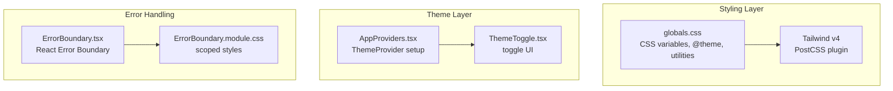
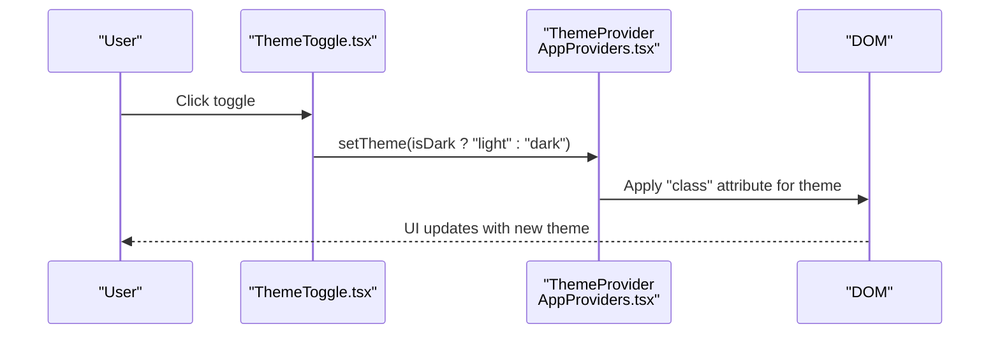
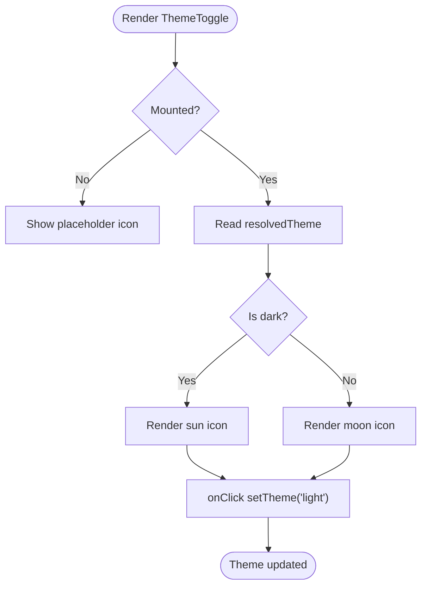
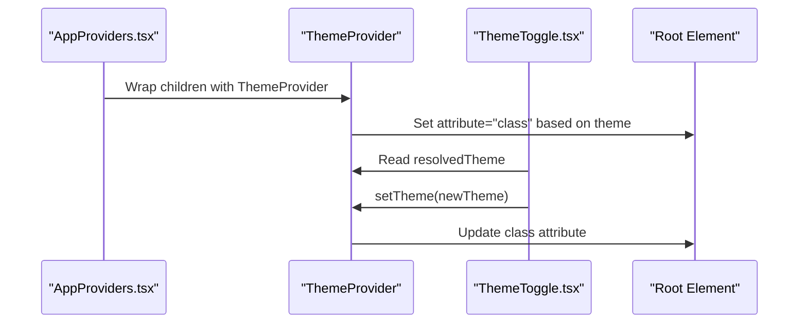
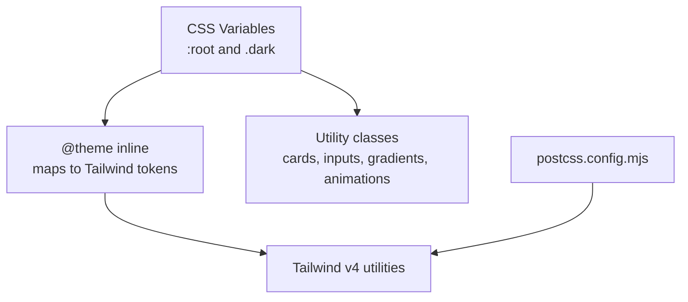
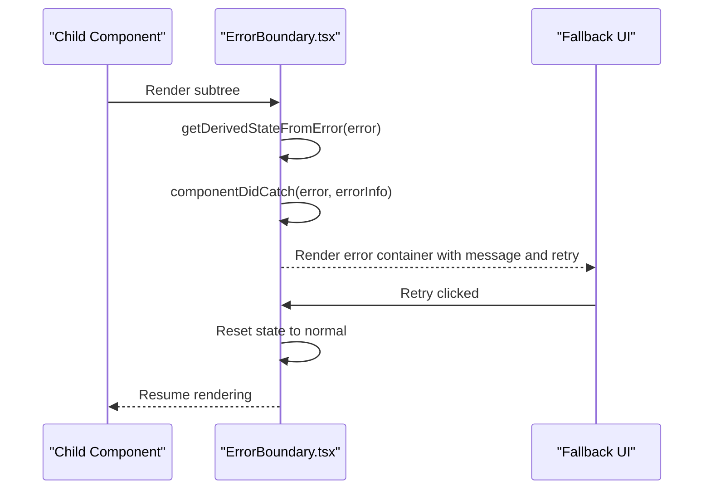
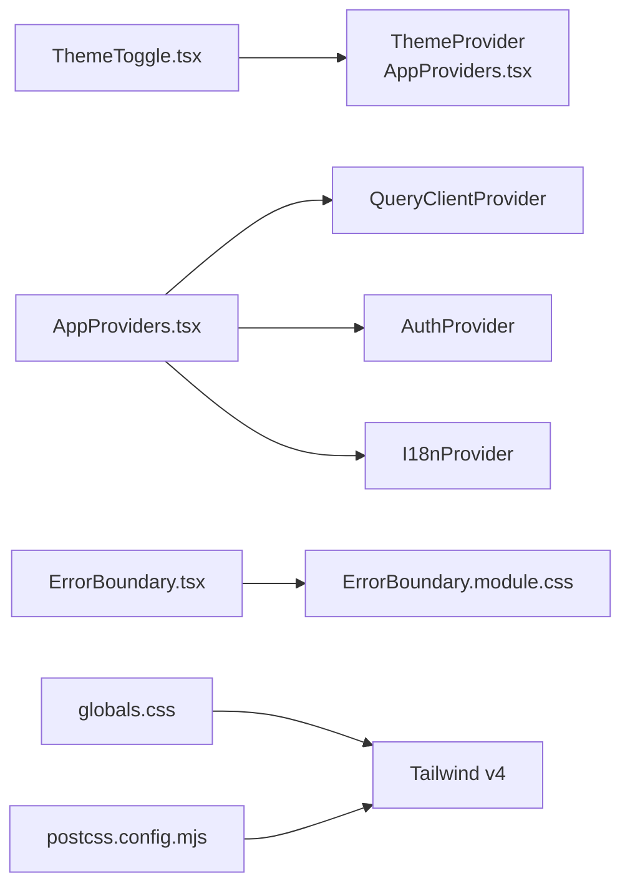

# Theme System

<cite>
**Referenced Files in This Document**
- [ThemeToggle.tsx](file://frontend/components/theme/ThemeToggle.tsx)
- [AppProviders.tsx](file://frontend/components/providers/AppProviders.tsx)
- [globals.css](file://frontend/app/globals.css)
- [ErrorBoundary.tsx](file://frontend/components/ui/ErrorBoundary.tsx)
- [ErrorBoundary.module.css](file://frontend/components/ui/ErrorBoundary.module.css)
- [package.json](file://frontend/package.json)
- [postcss.config.mjs](file://frontend/postcss.config.mjs)
- [next.config.ts](file://frontend/next.config.ts)
</cite>

## Table of Contents
1. [Introduction](#introduction)
2. [Project Structure](#project-structure)
3. [Core Components](#core-components)
4. [Architecture Overview](#architecture-overview)
5. [Detailed Component Analysis](#detailed-component-analysis)
6. [Dependency Analysis](#dependency-analysis)
7. [Performance Considerations](#performance-considerations)
8. [Troubleshooting Guide](#troubleshooting-guide)
9. [Conclusion](#conclusion)

## Introduction
This document explains the WheelSense Platform theme system and styling architecture. It covers the ThemeToggle component for light/dark mode switching, global CSS variables and styling patterns, and error boundary components for graceful degradation. It also documents design tokens, color schemes, typography, spacing conventions, CSS-in-JS patterns, styled-components usage, Tailwind CSS integration, theme customization examples, component theming, responsive design considerations, accessibility guidelines, and build-time optimizations.

## Project Structure
The styling system spans three primary areas:
- Global CSS variables and Tailwind integration via a single stylesheet
- Theme provider and toggle logic
- Error boundary component for graceful degradation

**Diagram sources**
- [globals.css:1-326](file://frontend/app/globals.css#L1-L326)
- [postcss.config.mjs:1-8](file://frontend/postcss.config.mjs#L1-L8)
- [AppProviders.tsx:10-41](file://frontend/components/providers/AppProviders.tsx#L10-L41)
- [ThemeToggle.tsx:8-37](file://frontend/components/theme/ThemeToggle.tsx#L8-L37)
- [ErrorBoundary.tsx:16-51](file://frontend/components/ui/ErrorBoundary.tsx#L16-L51)
- [ErrorBoundary.module.css:1-38](file://frontend/components/ui/ErrorBoundary.module.css#L1-L38)

**Section sources**
- [globals.css:1-326](file://frontend/app/globals.css#L1-L326)
- [postcss.config.mjs:1-8](file://frontend/postcss.config.mjs#L1-L8)
- [AppProviders.tsx:10-41](file://frontend/components/providers/AppProviders.tsx#L10-L41)
- [ThemeToggle.tsx:8-37](file://frontend/components/theme/ThemeToggle.tsx#L8-L37)
- [ErrorBoundary.tsx:16-51](file://frontend/components/ui/ErrorBoundary.tsx#L16-L51)
- [ErrorBoundary.module.css:1-38](file://frontend/components/ui/ErrorBoundary.module.css#L1-L38)

## Core Components
- ThemeToggle: A client-side UI component that switches between light and dark themes using a theme-aware hook and renders appropriate icons.
- AppProviders: Wraps the app with ThemeProvider to manage theme persistence and system preference, and integrates other providers.
- globals.css: Defines CSS custom properties for design tokens, a Tailwind v4 theme block, and reusable utility classes.
- ErrorBoundary: A React class component that catches rendering errors and displays a friendly fallback UI.

**Section sources**
- [ThemeToggle.tsx:8-37](file://frontend/components/theme/ThemeToggle.tsx#L8-L37)
- [AppProviders.tsx:10-41](file://frontend/components/providers/AppProviders.tsx#L10-L41)
- [globals.css:4-139](file://frontend/app/globals.css#L4-L139)
- [ErrorBoundary.tsx:16-51](file://frontend/components/ui/ErrorBoundary.tsx#L16-L51)

## Architecture Overview
The theme system combines CSS custom properties, a theme provider, and a toggle component. Tailwind v4 is integrated via a PostCSS plugin. The error boundary ensures graceful degradation when components fail.

**Diagram sources**
- [ThemeToggle.tsx:26-36](file://frontend/components/theme/ThemeToggle.tsx#L26-L36)
- [AppProviders.tsx:26-31](file://frontend/components/providers/AppProviders.tsx#L26-L31)
- [globals.css:44-78](file://frontend/app/globals.css#L44-L78)

## Detailed Component Analysis

### ThemeToggle Component
- Purpose: Toggle between light and dark modes with an icon that reflects the current theme.
- Behavior:
  - Uses a theme-aware hook to read the resolved theme and update it.
  - Uses a mount guard to avoid hydration mismatches.
  - Renders sun/moon icons depending on the current theme.
- Accessibility: Uses an aria-label for screen readers.

**Diagram sources**
- [ThemeToggle.tsx:10-36](file://frontend/components/theme/ThemeToggle.tsx#L10-L36)

**Section sources**
- [ThemeToggle.tsx:8-37](file://frontend/components/theme/ThemeToggle.tsx#L8-L37)

### Theme Provider and System Integration
- Provider: ThemeProvider wraps the app and manages theme persistence and system preference.
- Configuration:
  - attribute: "class" applied to the root element to reflect theme.
  - defaultTheme: "system".
  - enableSystem: allows system preference.
  - disableTransitionOnChange: disables theme transition flashes during SSR-to-CSR hydration.
- Integration: ThemeToggle reads and writes the theme state managed by the provider.

**Diagram sources**
- [AppProviders.tsx:26-31](file://frontend/components/providers/AppProviders.tsx#L26-L31)
- [ThemeToggle.tsx:9-9](file://frontend/components/theme/ThemeToggle.tsx#L9-L9)

**Section sources**
- [AppProviders.tsx:10-41](file://frontend/components/providers/AppProviders.tsx#L10-L41)
- [ThemeToggle.tsx:8-37](file://frontend/components/theme/ThemeToggle.tsx#L8-L37)

### Global CSS Variables and Tailwind Integration
- Design Tokens:
  - CSS custom properties define semantic tokens for backgrounds, foregrounds, surfaces, borders, rings, and semantic colors (primary, secondary, muted, accent, destructive, success, warning, info, critical).
  - Dark mode overrides are defined under a dedicated class selector.
- Tailwind v4:
  - A theme block maps CSS variables to Tailwind-compatible tokens.
  - PostCSS plugin enables Tailwind v4 processing.
- Utilities:
  - Reusable classes for cards, inputs, gradients, glass effects, shadows, and toast overrides.
  - Scrollbar styling and smooth transitions/animations.

**Diagram sources**
- [globals.css:4-78](file://frontend/app/globals.css#L4-L78)
- [globals.css:80-139](file://frontend/app/globals.css#L80-L139)
- [postcss.config.mjs:1-8](file://frontend/postcss.config.mjs#L1-L8)

**Section sources**
- [globals.css:4-139](file://frontend/app/globals.css#L4-L139)
- [postcss.config.mjs:1-8](file://frontend/postcss.config.mjs#L1-L8)

### Error Boundary Component
- Purpose: Gracefully handle rendering errors in subtrees.
- Behavior:
  - Catches errors via static method and componentDidCatch.
  - Displays an icon, message, and a retry button.
  - Resets state on retry to restore normal rendering.
- Styling: Scoped module CSS uses design tokens for surface, critical, and primary colors.

**Diagram sources**
- [ErrorBoundary.tsx:22-49](file://frontend/components/ui/ErrorBoundary.tsx#L22-L49)
- [ErrorBoundary.module.css:1-38](file://frontend/components/ui/ErrorBoundary.module.css#L1-L38)

**Section sources**
- [ErrorBoundary.tsx:16-51](file://frontend/components/ui/ErrorBoundary.tsx#L16-L51)
- [ErrorBoundary.module.css:1-38](file://frontend/components/ui/ErrorBoundary.module.css#L1-L38)

## Dependency Analysis
- ThemeToggle depends on:
  - ThemeProvider (from AppProviders) for theme state.
  - UI button component for consistent styling.
- AppProviders composes:
  - ThemeProvider for theming.
  - QueryClientProvider for data fetching.
  - AuthProvider and I18nProvider for runtime concerns.
- globals.css integrates:
  - Tailwind v4 via PostCSS plugin.
  - CSS variables and utility classes.
- ErrorBoundary depends on:
  - Module CSS for styling.
  - Lucide icon for visual feedback.

**Diagram sources**
- [ThemeToggle.tsx:3-6](file://frontend/components/theme/ThemeToggle.tsx#L3-L6)
- [AppProviders.tsx:3-8](file://frontend/components/providers/AppProviders.tsx#L3-L8)
- [ErrorBoundary.tsx:4-5](file://frontend/components/ui/ErrorBoundary.tsx#L4-L5)
- [globals.css:1-2](file://frontend/app/globals.css#L1-L2)
- [postcss.config.mjs:1-8](file://frontend/postcss.config.mjs#L1-L8)

**Section sources**
- [ThemeToggle.tsx:3-6](file://frontend/components/theme/ThemeToggle.tsx#L3-L6)
- [AppProviders.tsx:3-8](file://frontend/components/providers/AppProviders.tsx#L3-L8)
- [ErrorBoundary.tsx:4-5](file://frontend/components/ui/ErrorBoundary.tsx#L4-L5)
- [globals.css:1-2](file://frontend/app/globals.css#L1-L2)
- [postcss.config.mjs:1-8](file://frontend/postcss.config.mjs#L1-L8)

## Performance Considerations
- Hydration stability:
  - Theme provider disables theme transition on change to prevent visible flashes during SSR-to-CSR hydration.
- Build-time optimizations:
  - Tailwind v4 is enabled via a PostCSS plugin, allowing efficient utility generation.
  - Next.js compiler is enabled for improved runtime performance.
- CSS delivery:
  - Centralized global stylesheet reduces duplication and improves caching.
- Error boundaries:
  - Limit error propagation and reduce re-renders by isolating failing components.

**Section sources**
- [AppProviders.tsx:30-30](file://frontend/components/providers/AppProviders.tsx#L30-L30)
- [postcss.config.mjs:1-8](file://frontend/postcss.config.mjs#L1-L8)
- [next.config.ts:5-5](file://frontend/next.config.ts#L5-L5)

## Troubleshooting Guide
- Theme does not switch:
  - Verify ThemeProvider is wrapping the app and attribute is set to "class".
  - Confirm ThemeToggle invokes setTheme with valid values ("light" or "dark").
- Hydration mismatch warnings:
  - Ensure ThemeToggle uses a mount guard to avoid SSR vs CSR differences.
- Tailwind utilities missing:
  - Confirm Tailwind v4 PostCSS plugin is configured and included in the build pipeline.
- Error boundary not triggering:
  - Ensure the boundary is placed above the failing component and that errors are thrown during render.
- Accessibility:
  - Provide aria-labels for interactive elements.
  - Maintain sufficient color contrast against backgrounds and ensure focus indicators are visible.

**Section sources**
- [AppProviders.tsx:26-31](file://frontend/components/providers/AppProviders.tsx#L26-L31)
- [ThemeToggle.tsx:10-14](file://frontend/components/theme/ThemeToggle.tsx#L10-L14)
- [postcss.config.mjs:1-8](file://frontend/postcss.config.mjs#L1-L8)
- [ErrorBoundary.tsx:22-28](file://frontend/components/ui/ErrorBoundary.tsx#L22-L28)

## Conclusion
The WheelSense Platform employs a clean, maintainable theme system centered on CSS custom properties, a robust theme provider, and a minimal toggle component. Tailwind v4 integration streamlines utility classes while preserving design token consistency. The error boundary ensures graceful degradation. Together, these components deliver a scalable, accessible, and performant styling architecture suitable for healthcare environments requiring reliable UI experiences.