# UI Primitives

<cite>
**Referenced Files in This Document**
- [button.tsx](file://frontend/components/ui/button.tsx)
- [input.tsx](file://frontend/components/ui/input.tsx)
- [dialog.tsx](file://frontend/components/ui/dialog.tsx)
- [card.tsx](file://frontend/components/ui/card.tsx)
- [table.tsx](file://frontend/components/ui/table.tsx)
- [tabs.tsx](file://frontend/components/ui/tabs.tsx)
- [badge.tsx](file://frontend/components/ui/badge.tsx)
- [alert.tsx](file://frontend/components/ui/alert.tsx)
- [checkbox.tsx](file://frontend/components/ui/checkbox.tsx)
- [select.tsx](file://frontend/components/ui/select.tsx)
- [textarea.tsx](file://frontend/components/ui/textarea.tsx)
- [switch.tsx](file://frontend/components/ui/switch.tsx)
- [dropdown-menu.tsx](file://frontend/components/ui/dropdown-menu.tsx)
- [separator.tsx](file://frontend/components/ui/separator.tsx)
- [progress.tsx](file://frontend/components/ui/progress.tsx)
- [sheet.tsx](file://frontend/components/ui/sheet.tsx)
- [label.tsx](file://frontend/components/ui/label.tsx)
- [alert-dialog.tsx](file://frontend/components/ui/alert-dialog.tsx)
</cite>

## Table of Contents
1. [Introduction](#introduction)
2. [Project Structure](#project-structure)
3. [Core Components](#core-components)
4. [Architecture Overview](#architecture-overview)
5. [Detailed Component Analysis](#detailed-component-analysis)
6. [Dependency Analysis](#dependency-analysis)
7. [Performance Considerations](#performance-considerations)
8. [Troubleshooting Guide](#troubleshooting-guide)
9. [Conclusion](#conclusion)
10. [Appendices](#appendices)

## Introduction
This document describes the WheelSense Platform UI primitive components built on Radix UI. It covers Button, Input, Dialog, Card, Table, Tabs, Badge, Alert, Checkbox, Select, Textarea, Switch, DropdownMenu, Separator, Progress, Sheet, AlertDialog, and Label. For each component, we explain props, variants, sizes, styling options, accessibility features, and integration with the design system and theming tokens. We also provide usage patterns, composition guidelines, customization tips, and best practices for responsive and accessible UI across interaction states.

## Project Structure
The UI primitives live under frontend/components/ui and wrap Radix UI primitives with consistent design tokens and Tailwind-based styles. Each component exports a forwardRef’d React component with optional variants and a consistent className merging pattern via cn.

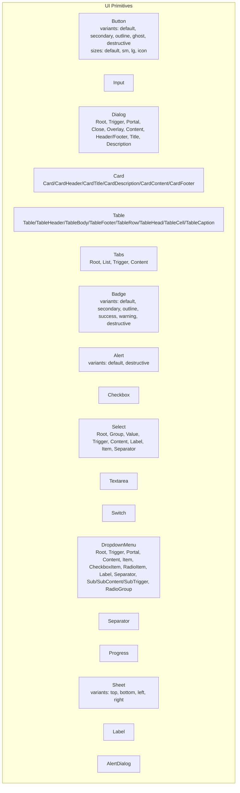

**Diagram sources**
- [button.tsx:1-56](file://frontend/components/ui/button.tsx#L1-L56)
- [input.tsx:1-22](file://frontend/components/ui/input.tsx#L1-L22)
- [dialog.tsx:1-110](file://frontend/components/ui/dialog.tsx#L1-L110)
- [card.tsx:1-53](file://frontend/components/ui/card.tsx#L1-L53)
- [table.tsx:1-90](file://frontend/components/ui/table.tsx#L1-L90)
- [tabs.tsx:1-55](file://frontend/components/ui/tabs.tsx#L1-L55)
- [badge.tsx:1-31](file://frontend/components/ui/badge.tsx#L1-L31)
- [alert.tsx:1-59](file://frontend/components/ui/alert.tsx#L1-L59)
- [checkbox.tsx:1-30](file://frontend/components/ui/checkbox.tsx#L1-L30)
- [select.tsx:1-147](file://frontend/components/ui/select.tsx#L1-L147)
- [textarea.tsx:1-21](file://frontend/components/ui/textarea.tsx#L1-L21)
- [switch.tsx:1-30](file://frontend/components/ui/switch.tsx#L1-L30)
- [dropdown-menu.tsx:1-201](file://frontend/components/ui/dropdown-menu.tsx#L1-L201)
- [separator.tsx:1-26](file://frontend/components/ui/separator.tsx#L1-L26)
- [progress.tsx:1-35](file://frontend/components/ui/progress.tsx#L1-L35)
- [sheet.tsx:1-111](file://frontend/components/ui/sheet.tsx#L1-L111)
- [label.tsx](file://frontend/components/ui/label.tsx)
- [alert-dialog.tsx](file://frontend/components/ui/alert-dialog.tsx)

**Section sources**
- [button.tsx:1-56](file://frontend/components/ui/button.tsx#L1-L56)
- [input.tsx:1-22](file://frontend/components/ui/input.tsx#L1-L22)
- [dialog.tsx:1-110](file://frontend/components/ui/dialog.tsx#L1-L110)
- [card.tsx:1-53](file://frontend/components/ui/card.tsx#L1-L53)
- [table.tsx:1-90](file://frontend/components/ui/table.tsx#L1-L90)
- [tabs.tsx:1-55](file://frontend/components/ui/tabs.tsx#L1-L55)
- [badge.tsx:1-31](file://frontend/components/ui/badge.tsx#L1-L31)
- [alert.tsx:1-59](file://frontend/components/ui/alert.tsx#L1-L59)
- [checkbox.tsx:1-30](file://frontend/components/ui/checkbox.tsx#L1-L30)
- [select.tsx:1-147](file://frontend/components/ui/select.tsx#L1-L147)
- [textarea.tsx:1-21](file://frontend/components/ui/textarea.tsx#L1-L21)
- [switch.tsx:1-30](file://frontend/components/ui/switch.tsx#L1-L30)
- [dropdown-menu.tsx:1-201](file://frontend/components/ui/dropdown-menu.tsx#L1-L201)
- [separator.tsx:1-26](file://frontend/components/ui/separator.tsx#L1-L26)
- [progress.tsx:1-35](file://frontend/components/ui/progress.tsx#L1-L35)
- [sheet.tsx:1-111](file://frontend/components/ui/sheet.tsx#L1-L111)
- [label.tsx](file://frontend/components/ui/label.tsx)
- [alert-dialog.tsx](file://frontend/components/ui/alert-dialog.tsx)

## Core Components
- Button: Variants and sizes, with asChild support via @radix-ui/react-slot and class-variance-authority.
- Input: Styled text input with focus and disabled states.
- Dialog: Root, Trigger, Portal, Close, Overlay, Content, Header/Footer, Title, Description.
- Card: Card container plus header, footer, title, description, and content slots.
- Table: Wrapper with scroll container and styled Table/Head/Body/Footer/Row/Cell/Caption.
- Tabs: Root, List, Trigger, Content.
- Badge: Variants for semantic emphasis.
- Alert: Alert box with title and description.
- Checkbox: Radix Checkbox with indicator.
- Select: Full-featured select with Trigger, Content, Viewport, Items, Label, Separator.
- Textarea: Styled textarea with focus and disabled states.
- Switch: Radix Switch with thumb animation.
- DropdownMenu: Menu with items, checkboxes, radios, labels, separators, submenus.
- Separator: Horizontal or vertical divider.
- Progress: Determinate progress bar with percentage calculation.
- Sheet: Drawer-like panel with side variants (top, bottom, left, right).
- Label: Accessible label primitive.
- AlertDialog: Dialog variant for destructive actions.

**Section sources**
- [button.tsx:35-56](file://frontend/components/ui/button.tsx#L35-L56)
- [input.tsx:4-22](file://frontend/components/ui/input.tsx#L4-L22)
- [dialog.tsx:8-110](file://frontend/components/ui/dialog.tsx#L8-L110)
- [card.tsx:4-53](file://frontend/components/ui/card.tsx#L4-L53)
- [table.tsx:4-90](file://frontend/components/ui/table.tsx#L4-L90)
- [tabs.tsx:7-55](file://frontend/components/ui/tabs.tsx#L7-L55)
- [badge.tsx:24-31](file://frontend/components/ui/badge.tsx#L24-L31)
- [alert.tsx:21-59](file://frontend/components/ui/alert.tsx#L21-L59)
- [checkbox.tsx:8-30](file://frontend/components/ui/checkbox.tsx#L8-L30)
- [select.tsx:8-147](file://frontend/components/ui/select.tsx#L8-L147)
- [textarea.tsx:4-21](file://frontend/components/ui/textarea.tsx#L4-L21)
- [switch.tsx:8-30](file://frontend/components/ui/switch.tsx#L8-L30)
- [dropdown-menu.tsx:9-201](file://frontend/components/ui/dropdown-menu.tsx#L9-L201)
- [separator.tsx:7-26](file://frontend/components/ui/separator.tsx#L7-L26)
- [progress.tsx:11-35](file://frontend/components/ui/progress.tsx#L11-L35)
- [sheet.tsx:9-111](file://frontend/components/ui/sheet.tsx#L9-L111)
- [label.tsx](file://frontend/components/ui/label.tsx)
- [alert-dialog.tsx](file://frontend/components/ui/alert-dialog.tsx)

## Architecture Overview
WheelSense UI primitives are thin wrappers around Radix UI primitives. They:
- Import Radix UI components and icons from lucide-react.
- Apply design tokens via Tailwind classes and cn.
- Use class-variance-authority for variant-driven styling.
- Expose consistent props and forward refs for composability.
- Provide accessibility attributes out of the box (e.g., aria-* roles and labels).

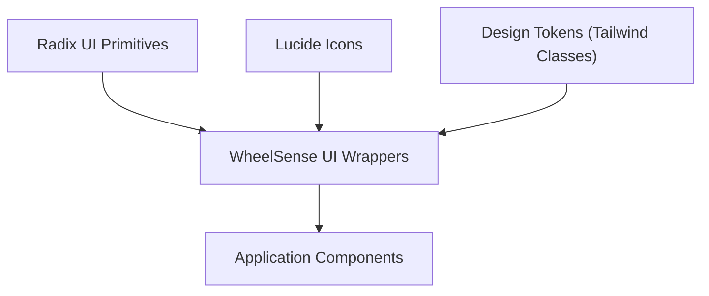

[No sources needed since this diagram shows conceptual workflow, not actual code structure]

## Detailed Component Analysis

### Button
- Purpose: Primary action surfaces with consistent spacing, shadows, and focus rings.
- Props:
  - variant: default, secondary, outline, ghost, destructive
  - size: default, sm, lg, icon
  - asChild: render as child element via @radix-ui/react-slot
  - Inherits button attributes
- Accessibility: Focus-visible ring, disabled states, pointer-events disabled.
- Composition: Use asChild to render links or other elements as buttons.

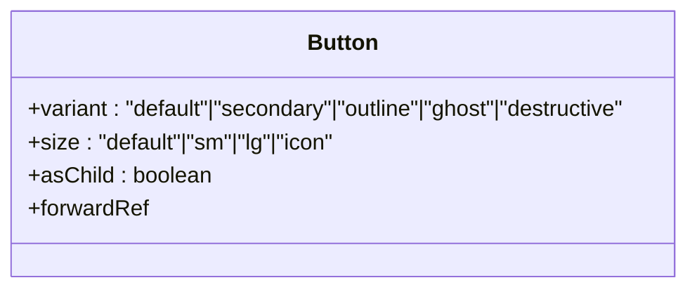

**Diagram sources**
- [button.tsx:6-33](file://frontend/components/ui/button.tsx#L6-L33)
- [button.tsx:35-56](file://frontend/components/ui/button.tsx#L35-L56)

**Section sources**
- [button.tsx:6-33](file://frontend/components/ui/button.tsx#L6-L33)
- [button.tsx:35-56](file://frontend/components/ui/button.tsx#L35-L56)

### Input
- Purpose: Text input with consistent border, padding, focus ring, and disabled state.
- Props: Inherits input attributes; className merged with defaults.
- Accessibility: Uses native input semantics.

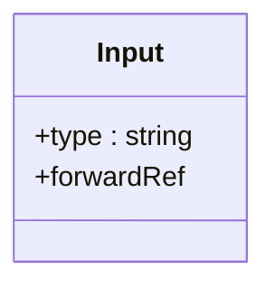

**Diagram sources**
- [input.tsx:4-22](file://frontend/components/ui/input.tsx#L4-L22)

**Section sources**
- [input.tsx:4-22](file://frontend/components/ui/input.tsx#L4-L22)

### Dialog
- Purpose: Modal overlay with animated content, close button, and structured header/footer/title/description.
- Components: Root, Trigger, Portal, Close, Overlay, Content, Header, Footer, Title, Description.
- Accessibility: Overlay and content receive proper animations; close button includes screen-reader label.

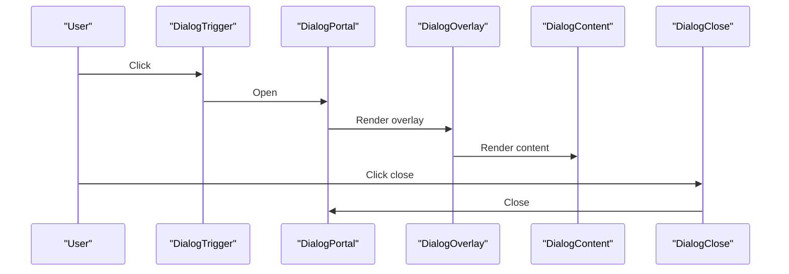

**Diagram sources**
- [dialog.tsx:8-51](file://frontend/components/ui/dialog.tsx#L8-L51)

**Section sources**
- [dialog.tsx:8-110](file://frontend/components/ui/dialog.tsx#L8-L110)

### Card
- Purpose: Container for grouped content with header, title, description, content, and footer.
- Components: Card, CardHeader, CardTitle, CardDescription, CardContent, CardFooter.

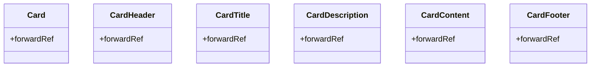

**Diagram sources**
- [card.tsx:4-53](file://frontend/components/ui/card.tsx#L4-L53)

**Section sources**
- [card.tsx:4-53](file://frontend/components/ui/card.tsx#L4-L53)

### Table
- Purpose: Scrollable table container with styled rows, cells, and headers.
- Components: Table, TableHeader, TableBody, TableFooter, TableRow, TableHead, TableCell, TableCaption.

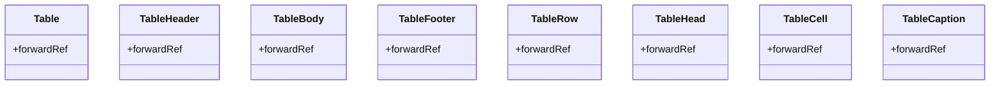

**Diagram sources**
- [table.tsx:4-90](file://frontend/components/ui/table.tsx#L4-L90)

**Section sources**
- [table.tsx:4-90](file://frontend/components/ui/table.tsx#L4-L90)

### Tabs
- Purpose: Tabbed content navigation with active state styling and focus rings.
- Components: Tabs, TabsList, TabsTrigger, TabsContent.

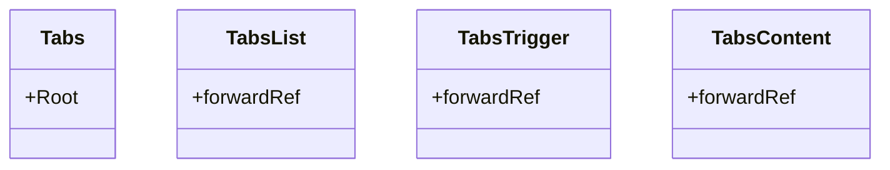

**Diagram sources**
- [tabs.tsx:7-55](file://frontend/components/ui/tabs.tsx#L7-L55)

**Section sources**
- [tabs.tsx:7-55](file://frontend/components/ui/tabs.tsx#L7-L55)

### Badge
- Purpose: Lightweight status or metadata label with semantic variants.
- Props: variant: default, secondary, outline, success, warning, destructive.

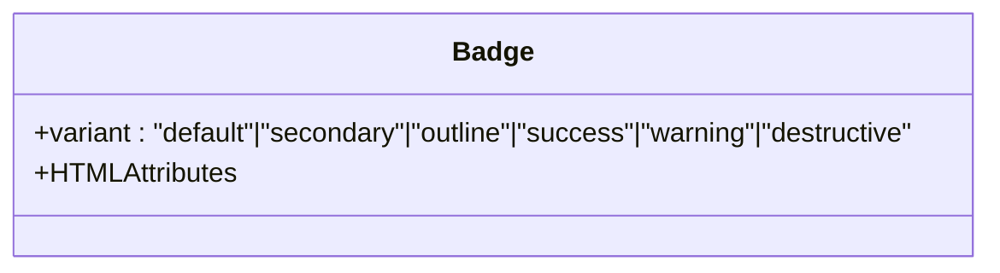

**Diagram sources**
- [badge.tsx:5-31](file://frontend/components/ui/badge.tsx#L5-L31)

**Section sources**
- [badge.tsx:5-31](file://frontend/components/ui/badge.tsx#L5-L31)

### Alert
- Purpose: Callout for informational or error-related messages.
- Components: Alert, AlertTitle, AlertDescription.
- Props: variant: default, destructive.

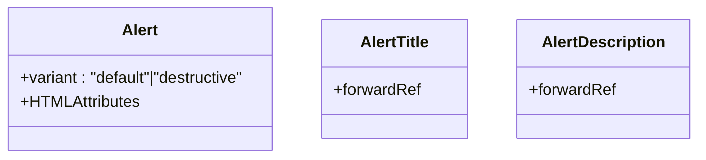

**Diagram sources**
- [alert.tsx:5-59](file://frontend/components/ui/alert.tsx#L5-L59)

**Section sources**
- [alert.tsx:5-59](file://frontend/components/ui/alert.tsx#L5-L59)

### Checkbox
- Purpose: Binary selection with visible indicator.
- Props: Inherits Radix Checkbox attributes.

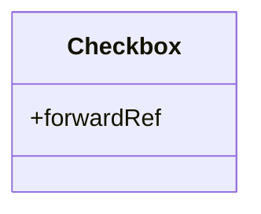

**Diagram sources**
- [checkbox.tsx:8-30](file://frontend/components/ui/checkbox.tsx#L8-L30)

**Section sources**
- [checkbox.tsx:8-30](file://frontend/components/ui/checkbox.tsx#L8-L30)

### Select
- Purpose: Expandable list of options with keyboard navigation and viewport scrolling.
- Components: Select, SelectGroup, SelectValue, SelectTrigger, SelectContent, SelectLabel, SelectItem, SelectSeparator.

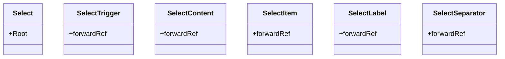

**Diagram sources**
- [select.tsx:8-147](file://frontend/components/ui/select.tsx#L8-L147)

**Section sources**
- [select.tsx:8-147](file://frontend/components/ui/select.tsx#L8-L147)

### Textarea
- Purpose: Multi-line text input with consistent focus and disabled states.
- Props: Inherits textarea attributes.

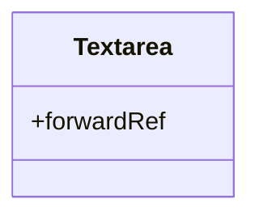

**Diagram sources**
- [textarea.tsx:4-21](file://frontend/components/ui/textarea.tsx#L4-L21)

**Section sources**
- [textarea.tsx:4-21](file://frontend/components/ui/textarea.tsx#L4-L21)

### Switch
- Purpose: Toggle control with animated thumb.
- Props: Inherits Radix Switch attributes.

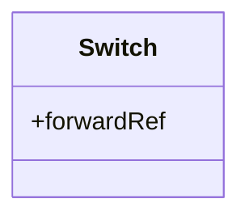

**Diagram sources**
- [switch.tsx:8-30](file://frontend/components/ui/switch.tsx#L8-L30)

**Section sources**
- [switch.tsx:8-30](file://frontend/components/ui/switch.tsx#L8-L30)

### DropdownMenu
- Purpose: Contextual menu with nested submenus, checkboxes, radios, and shortcuts.
- Components: DropdownMenu, DropdownMenuTrigger, DropdownMenuPortal, DropdownMenuContent, DropdownMenuItem, DropdownMenuCheckboxItem, DropdownMenuRadioItem, DropdownMenuLabel, DropdownMenuSeparator, DropdownMenuShortcut, DropdownMenuGroup, DropdownMenuSub, DropdownMenuSubContent, DropdownMenuSubTrigger, DropdownMenuRadioGroup.

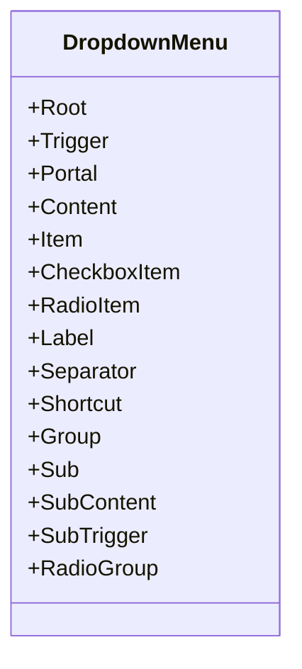

**Diagram sources**
- [dropdown-menu.tsx:9-201](file://frontend/components/ui/dropdown-menu.tsx#L9-L201)

**Section sources**
- [dropdown-menu.tsx:9-201](file://frontend/components/ui/dropdown-menu.tsx#L9-L201)

### Separator
- Purpose: Visual divider, horizontal or vertical.
- Props: orientation: horizontal | vertical, decorative, className.

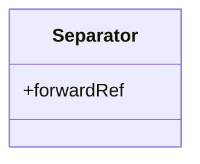

**Diagram sources**
- [separator.tsx:7-26](file://frontend/components/ui/separator.tsx#L7-L26)

**Section sources**
- [separator.tsx:7-26](file://frontend/components/ui/separator.tsx#L7-L26)

### Progress
- Purpose: Determinate progress indicator with percentage clamping.
- Props: value: number, max: number.

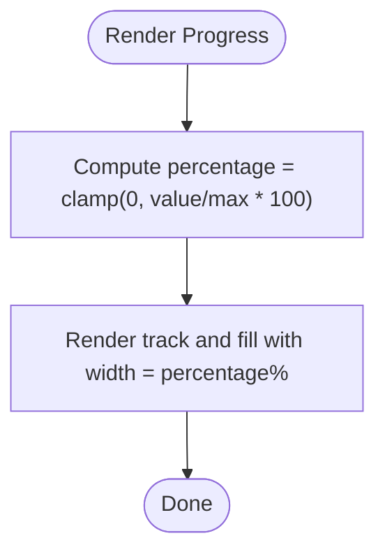

**Diagram sources**
- [progress.tsx:11-35](file://frontend/components/ui/progress.tsx#L11-L35)

**Section sources**
- [progress.tsx:11-35](file://frontend/components/ui/progress.tsx#L11-L35)

### Sheet
- Purpose: Slide-in panel from a given side (top, bottom, left, right) with overlay and close button.
- Components: Sheet, SheetTrigger, SheetClose, SheetPortal, SheetOverlay, SheetContent, SheetHeader, SheetTitle, SheetDescription.
- Props: side: top | bottom | left | right.

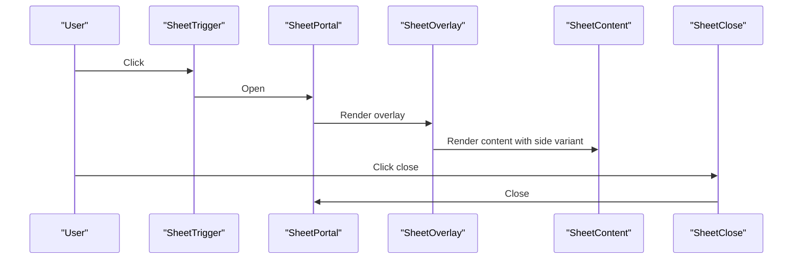

**Diagram sources**
- [sheet.tsx:9-70](file://frontend/components/ui/sheet.tsx#L9-L70)

**Section sources**
- [sheet.tsx:9-111](file://frontend/components/ui/sheet.tsx#L9-L111)

### Label
- Purpose: Associates text with form controls for accessibility.
- Implementation: Exposed as-is; ensure pairing with input/textarea/select/checkbox/switch.

[No sources needed since this section doesn't analyze specific files]

### AlertDialog
- Purpose: Confirmation dialogs for destructive actions.
- Implementation: Built on Dialog primitives; use for confirm/cancel flows.

[No sources needed since this section doesn't analyze specific files]

## Dependency Analysis
- All components depend on:
  - Radix UI primitives (@radix-ui/react-*) for behavior and accessibility.
  - Lucide icons for visual indicators.
  - Tailwind classes and cn for styling.
  - class-variance-authority for variant composition.
- Coupling:
  - Low to moderate; each component wraps a single Radix primitive.
  - No circular dependencies observed among UI primitives.
- External integrations:
  - Theming relies on Tailwind tokens (e.g., primary, secondary, muted, destructive, ring, card, popover, border).
  - Focus-visible outlines and ring tokens are consistently applied.

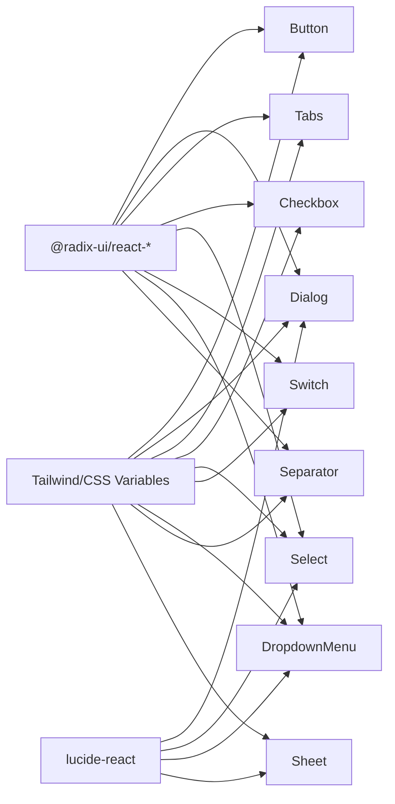

**Diagram sources**
- [button.tsx:1-5](file://frontend/components/ui/button.tsx#L1-L5)
- [dialog.tsx:3-6](file://frontend/components/ui/dialog.tsx#L3-L6)
- [tabs.tsx:3-5](file://frontend/components/ui/tabs.tsx#L3-L5)
- [checkbox.tsx:3-6](file://frontend/components/ui/checkbox.tsx#L3-L6)
- [select.tsx:3-6](file://frontend/components/ui/select.tsx#L3-L6)
- [switch.tsx:3-7](file://frontend/components/ui/switch.tsx#L3-L7)
- [dropdown-menu.tsx:3-8](file://frontend/components/ui/dropdown-menu.tsx#L3-L8)
- [separator.tsx:3-6](file://frontend/components/ui/separator.tsx#L3-L6)
- [sheet.tsx:3-8](file://frontend/components/ui/sheet.tsx#L3-L8)

**Section sources**
- [button.tsx:1-5](file://frontend/components/ui/button.tsx#L1-L5)
- [dialog.tsx:3-6](file://frontend/components/ui/dialog.tsx#L3-L6)
- [tabs.tsx:3-5](file://frontend/components/ui/tabs.tsx#L3-L5)
- [checkbox.tsx:3-6](file://frontend/components/ui/checkbox.tsx#L3-L6)
- [select.tsx:3-6](file://frontend/components/ui/select.tsx#L3-L6)
- [switch.tsx:3-7](file://frontend/components/ui/switch.tsx#L3-L7)
- [dropdown-menu.tsx:3-8](file://frontend/components/ui/dropdown-menu.tsx#L3-L8)
- [separator.tsx:3-6](file://frontend/components/ui/separator.tsx#L3-L6)
- [sheet.tsx:3-8](file://frontend/components/ui/sheet.tsx#L3-L8)

## Performance Considerations
- Prefer lightweight wrappers: Components avoid heavy computations; most logic is presentational.
- Use asChild where appropriate: Button’s asChild reduces DOM nodes for semantic correctness.
- Keep portals scoped: Dialog and Sheet portals render only when open to minimize reflows.
- Avoid unnecessary re-renders: Use variant props and className merging to prevent style churn.
- Responsive sizing: Use size variants thoughtfully; avoid excessive icon-only buttons on small screens.

[No sources needed since this section provides general guidance]

## Troubleshooting Guide
- Focus rings not visible:
  - Ensure focus-visible ring classes are not overridden by global styles.
- Disabled states not applying:
  - Verify disabled prop is passed and pointer-events disabled classes are intact.
- Select/Menu items not highlighting:
  - Confirm data-[highlighted] classes are not overridden and viewport is sized correctly.
- Dialog/Sheet not closing:
  - Ensure DialogClose or SheetClose is rendered and reachable via keyboard.
- Progress percentage overflow:
  - The component clamps values; verify value and max are numeric and max > 0.

**Section sources**
- [button.tsx:7-8](file://frontend/components/ui/button.tsx#L7-L8)
- [select.tsx:62-88](file://frontend/components/ui/select.tsx#L62-L88)
- [progress.tsx:13-13](file://frontend/components/ui/progress.tsx#L13-L13)
- [dialog.tsx:44-47](file://frontend/components/ui/dialog.tsx#L44-L47)
- [sheet.tsx:62-66](file://frontend/components/ui/sheet.tsx#L62-L66)

## Conclusion
WheelSense UI primitives provide a cohesive, accessible, and theme-friendly set of building blocks for the platform. By leveraging Radix UI primitives and Tailwind tokens, components remain consistent, customizable, and easy to compose. Follow the documented props, variants, and accessibility notes to ensure reliable cross-role and cross-screen experiences.

[No sources needed since this section summarizes without analyzing specific files]

## Appendices

### Design System and Theming Notes
- Tokens used across components:
  - Primary palette: primary, primary-foreground
  - Secondary palette: secondary, secondary-foreground
  - Backgrounds: background, card, popover
  - Borders: border, input, muted, ring
  - States: destructive, ring/opacity variants
- Guidelines:
  - Prefer semantic variants for status (Badge, Alert).
  - Use size variants sparingly; default is recommended for most cases.
  - Combine asChild with semantic anchors for accessible button patterns.

[No sources needed since this section provides general guidance]