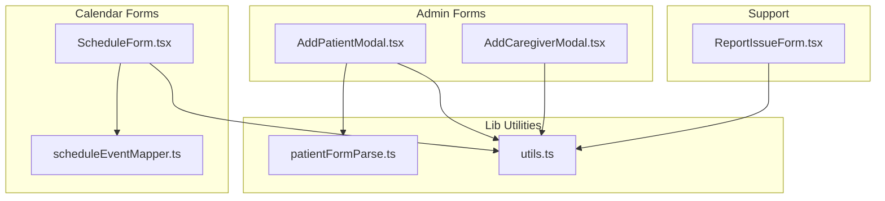
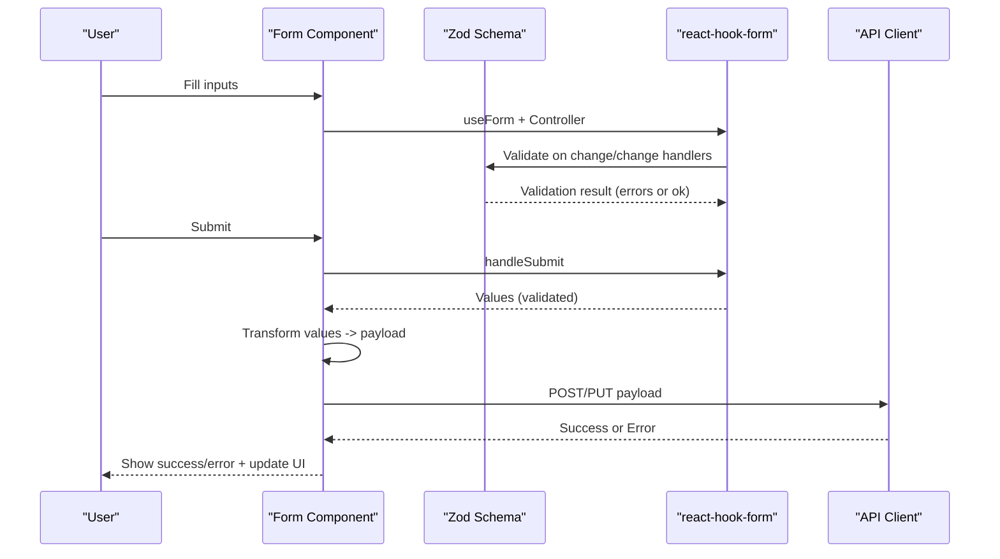
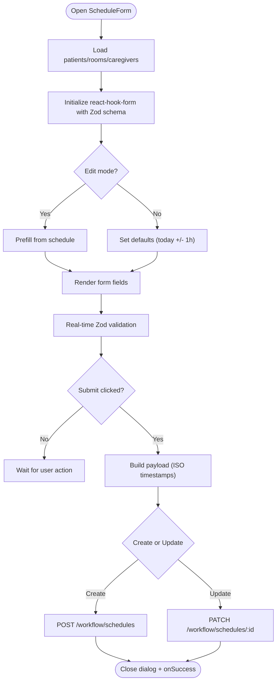
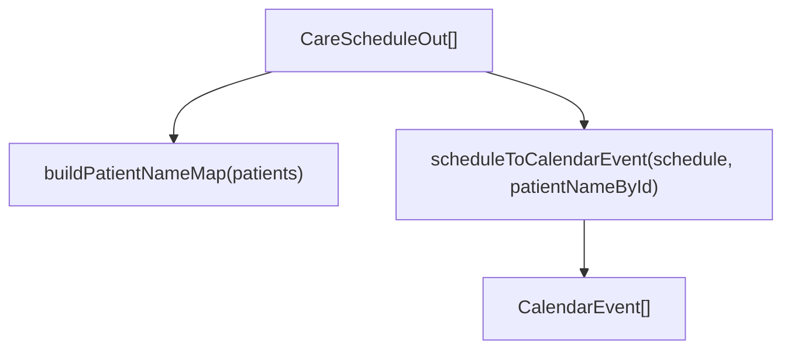
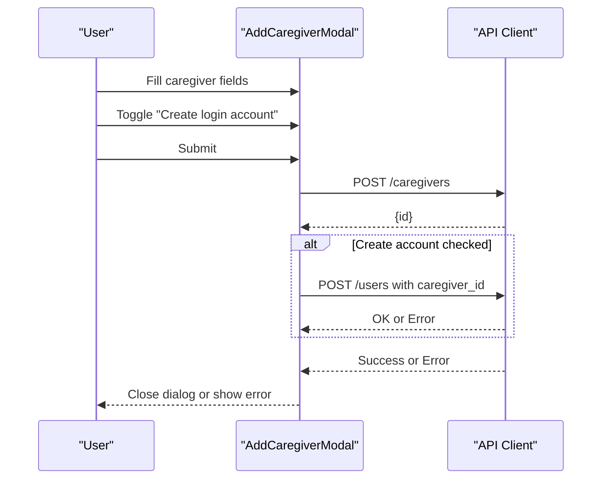
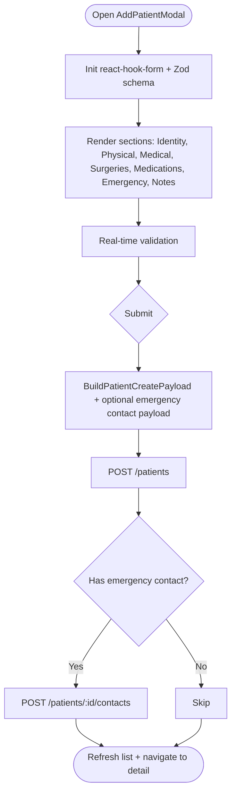
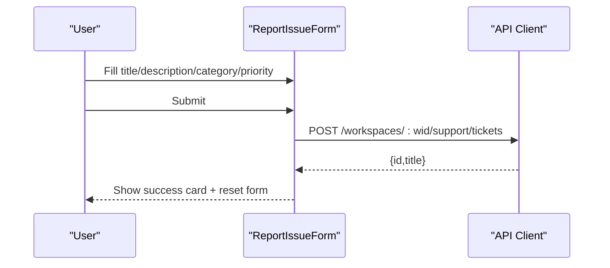
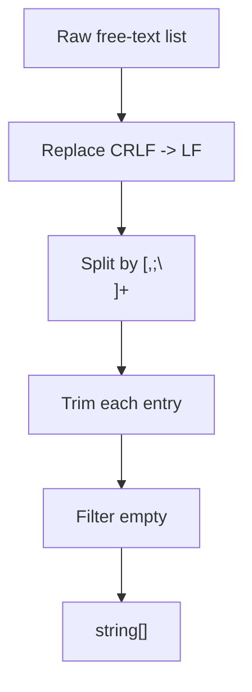
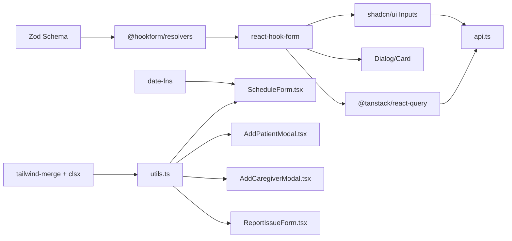

# Forms & Validation

<cite>
**Referenced Files in This Document**
- [ScheduleForm.tsx](file://frontend/components/calendar/ScheduleForm.tsx)
- [scheduleEventMapper.ts](file://frontend/components/calendar/scheduleEventMapper.ts)
- [AddCaregiverModal.tsx](file://frontend/components/admin/caregivers/AddCaregiverModal.tsx)
- [AddPatientModal.tsx](file://frontend/components/admin/patients/AddPatientModal.tsx)
- [ReportIssueForm.tsx](file://frontend/components/support/ReportIssueForm.tsx)
- [patientFormParse.ts](file://frontend/lib/patientFormParse.ts)
- [utils.ts](file://frontend/lib/utils.ts)
</cite>

## Table of Contents
1. [Introduction](#introduction)
2. [Project Structure](#project-structure)
3. [Core Components](#core-components)
4. [Architecture Overview](#architecture-overview)
5. [Detailed Component Analysis](#detailed-component-analysis)
6. [Dependency Analysis](#dependency-analysis)
7. [Performance Considerations](#performance-considerations)
8. [Troubleshooting Guide](#troubleshooting-guide)
9. [Conclusion](#conclusion)

## Introduction
This document explains the forms and validation systems used across the WheelSense Platform. It covers form handling patterns, validation strategies, error management, and user feedback mechanisms. It documents the form component architecture (controlled components), validation libraries integration (Zod with react-hook-form), custom parsing utilities, data transformation functions, and input sanitization. It also details calendar scheduling forms, patient registration forms, and administrative data entry forms, including real-time validation, error display, submission handling, loading states, and success/error state management.

## Project Structure
The forms and validation logic is primarily implemented in the frontend under components and lib directories. Key areas:
- Calendar scheduling forms: ScheduleForm and schedule event mapping utilities
- Administrative forms: AddCaregiverModal and AddPatientModal
- Support issue reporting: ReportIssueForm
- Utilities: patientFormParse for custom parsing and utils for class merging

**Diagram sources**
- [ScheduleForm.tsx:1-587](file://frontend/components/calendar/ScheduleForm.tsx#L1-L587)
- [scheduleEventMapper.ts:1-60](file://frontend/components/calendar/scheduleEventMapper.ts#L1-L60)
- [AddCaregiverModal.tsx:1-294](file://frontend/components/admin/caregivers/AddCaregiverModal.tsx#L1-L294)
- [AddPatientModal.tsx:1-543](file://frontend/components/admin/patients/AddPatientModal.tsx#L1-L543)
- [ReportIssueForm.tsx:1-201](file://frontend/components/support/ReportIssueForm.tsx#L1-L201)
- [patientFormParse.ts:1-12](file://frontend/lib/patientFormParse.ts#L1-L12)
- [utils.ts:1-7](file://frontend/lib/utils.ts#L1-L7)

**Section sources**
- [ScheduleForm.tsx:1-587](file://frontend/components/calendar/ScheduleForm.tsx#L1-L587)
- [AddCaregiverModal.tsx:1-294](file://frontend/components/admin/caregivers/AddCaregiverModal.tsx#L1-L294)
- [AddPatientModal.tsx:1-543](file://frontend/components/admin/patients/AddPatientModal.tsx#L1-L543)
- [ReportIssueForm.tsx:1-201](file://frontend/components/support/ReportIssueForm.tsx#L1-L201)
- [patientFormParse.ts:1-12](file://frontend/lib/patientFormParse.ts#L1-L12)
- [utils.ts:1-7](file://frontend/lib/utils.ts#L1-L7)

## Core Components
- Controlled components: All inputs are controlled via react-hook-form’s useForm and Controller, ensuring centralized state and deterministic validation.
- Validation library: Zod schemas with @hookform/resolvers provide compile-time and runtime validation.
- Real-time validation: Errors surface immediately as users edit fields; submission is blocked until validation passes.
- Error management: Centralized error state per form; API errors are normalized into user-friendly messages.
- Loading states: Disabled UI during submission; spinner indicators where appropriate.
- Data transformation: Payload builders transform form values into backend-compatible shapes; date/time parsing and normalization occur before submission.
- Input sanitization: Zod trim and min/max constraints; free-text lists are parsed and normalized.

**Section sources**
- [ScheduleForm.tsx:57-81](file://frontend/components/calendar/ScheduleForm.tsx#L57-L81)
- [AddPatientModal.tsx:61-64](file://frontend/components/admin/patients/AddPatientModal.tsx#L61-L64)
- [ReportIssueForm.tsx:56-64](file://frontend/components/support/ReportIssueForm.tsx#L56-L64)
- [patientFormParse.ts:5-11](file://frontend/lib/patientFormParse.ts#L5-L11)

## Architecture Overview
The forms follow a consistent pattern:
- Define a Zod schema for validation
- Initialize react-hook-form with zodResolver
- Render inputs as controlled components
- On submit, transform values into a payload and call API
- Manage loading and error states, then close dialogs or redirect

**Diagram sources**
- [ScheduleForm.tsx:179-248](file://frontend/components/calendar/ScheduleForm.tsx#L179-L248)
- [AddPatientModal.tsx:97-130](file://frontend/components/admin/patients/AddPatientModal.tsx#L97-L130)
- [ReportIssueForm.tsx:66-87](file://frontend/components/support/ReportIssueForm.tsx#L66-L87)

## Detailed Component Analysis

### Calendar Scheduling Form
- Purpose: Create or edit care schedules with patient, room, assignee, date/time, recurrence, and notes.
- Validation: Zod enforces presence and length constraints; a refine ensures end time is after start time.
- Controlled inputs: Uses Controller for selects and inputs; watch enables dependent UI (e.g., selected patient/room display).
- Data fetching: Queries patients, rooms, and caregivers via React Query with polling and caching defaults.
- Submission: Builds ISO timestamps; handles create vs update; displays API errors; disables controls while submitting.
- Error UX: Dedicated error banner with icon; field-level labels show destructively styled error text.

**Diagram sources**
- [ScheduleForm.tsx:116-136](file://frontend/components/calendar/ScheduleForm.tsx#L116-L136)
- [ScheduleForm.tsx:179-248](file://frontend/components/calendar/ScheduleForm.tsx#L179-L248)

**Section sources**
- [ScheduleForm.tsx:57-81](file://frontend/components/calendar/ScheduleForm.tsx#L57-L81)
- [ScheduleForm.tsx:116-136](file://frontend/components/calendar/ScheduleForm.tsx#L116-L136)
- [ScheduleForm.tsx:179-248](file://frontend/components/calendar/ScheduleForm.tsx#L179-L248)
- [ScheduleForm.tsx:255-564](file://frontend/components/calendar/ScheduleForm.tsx#L255-L564)

### Calendar Event Mapping Utilities
- Purpose: Convert backend schedule records into calendar events for rendering.
- Features: Safe fallback duration, status mapping, patient name lookup map, and event array conversion.

**Diagram sources**
- [scheduleEventMapper.ts:16-51](file://frontend/components/calendar/scheduleEventMapper.ts#L16-L51)

**Section sources**
- [scheduleEventMapper.ts:16-51](file://frontend/components/calendar/scheduleEventMapper.ts#L16-L51)

### Administrative Caregiver Registration Form
- Purpose: Add a new caregiver and optionally create a login account.
- Validation: Client-side gating based on required fields; optional account requires minimum username/password lengths.
- Submission: Posts to /caregivers; conditionally posts to /users if requested; rollback on partial failure.
- Error UX: Single banner error; spinner and disabled states during submission.

**Diagram sources**
- [AddCaregiverModal.tsx:52-93](file://frontend/components/admin/caregivers/AddCaregiverModal.tsx#L52-L93)

**Section sources**
- [AddCaregiverModal.tsx:35-50](file://frontend/components/admin/caregivers/AddCaregiverModal.tsx#L35-L50)
- [AddCaregiverModal.tsx:52-93](file://frontend/components/admin/caregivers/AddCaregiverModal.tsx#L52-L93)

### Patient Registration Form
- Purpose: Comprehensive patient intake with identity, physical metrics, medical history, surgeries, medications, emergency contact, and notes.
- Validation: Zod schema with zodResolver; field arrays for dynamic entries (surgeries and medications).
- Controlled inputs: TextField and SelectField wrappers around Controller; EMPTY_SELECT_VALUE handling for optional selections.
- Submission: Builds normalized payloads; creates patient, then optional emergency contact; rollback on partial failure; navigates to patient detail.
- Error UX: Field-level labels and a consolidated error banner; disabled inputs during submission.

**Diagram sources**
- [AddPatientModal.tsx:61-64](file://frontend/components/admin/patients/AddPatientModal.tsx#L61-L64)
- [AddPatientModal.tsx:97-130](file://frontend/components/admin/patients/AddPatientModal.tsx#L97-L130)

**Section sources**
- [AddPatientModal.tsx:61-64](file://frontend/components/admin/patients/AddPatientModal.tsx#L61-L64)
- [AddPatientModal.tsx:97-130](file://frontend/components/admin/patients/AddPatientModal.tsx#L97-L130)
- [AddPatientModal.tsx:132-450](file://frontend/components/admin/patients/AddPatientModal.tsx#L132-L450)

### Support Issue Reporting Form
- Purpose: Report bugs/general/device issues with category and priority.
- Validation: Zod schema with trim and enum constraints; default values initialized.
- Submission: Posts to workspace-scoped /support/tickets; resets form on success; shows success card.

**Diagram sources**
- [ReportIssueForm.tsx:66-87](file://frontend/components/support/ReportIssueForm.tsx#L66-L87)

**Section sources**
- [ReportIssueForm.tsx:45-54](file://frontend/components/support/ReportIssueForm.tsx#L45-L54)
- [ReportIssueForm.tsx:66-87](file://frontend/components/support/ReportIssueForm.tsx#L66-L87)

### Custom Parsing and Data Transformation Utilities
- Free-text list parsing: Splits comma, semicolon, or newline-separated lists; trims and filters empty entries.
- Utility class merging: Tailwind class merging helper for composing conditional styles.

**Diagram sources**
- [patientFormParse.ts:5-11](file://frontend/lib/patientFormParse.ts#L5-L11)

**Section sources**
- [patientFormParse.ts:5-11](file://frontend/lib/patientFormParse.ts#L5-L11)
- [utils.ts:4-6](file://frontend/lib/utils.ts#L4-L6)

## Dependency Analysis
- Validation stack: Zod + @hookform/resolvers
- State and forms: react-hook-form
- UI primitives: shadcn/ui components (Button, Input, Label, Select, Textarea, Dialog, Card)
- Data fetching: @tanstack/react-query
- Date/time: date-fns
- Class merging: tailwind-merge + clsx
- API client: local api wrapper with typed endpoints and ApiError handling

**Diagram sources**
- [ScheduleForm.tsx:3-31](file://frontend/components/calendar/ScheduleForm.tsx#L3-L31)
- [AddPatientModal.tsx:1-22](file://frontend/components/admin/patients/AddPatientModal.tsx#L1-L22)
- [AddCaregiverModal.tsx:1-7](file://frontend/components/admin/caregivers/AddCaregiverModal.tsx#L1-L7)
- [ReportIssueForm.tsx:1-15](file://frontend/components/support/ReportIssueForm.tsx#L1-L15)
- [utils.ts:1-7](file://frontend/lib/utils.ts#L1-L7)

**Section sources**
- [ScheduleForm.tsx:3-31](file://frontend/components/calendar/ScheduleForm.tsx#L3-L31)
- [AddPatientModal.tsx:1-22](file://frontend/components/admin/patients/AddPatientModal.tsx#L1-L22)
- [AddCaregiverModal.tsx:1-7](file://frontend/components/admin/caregivers/AddCaregiverModal.tsx#L1-L7)
- [ReportIssueForm.tsx:1-15](file://frontend/components/support/ReportIssueForm.tsx#L1-L15)
- [utils.ts:1-7](file://frontend/lib/utils.ts#L1-L7)

## Performance Considerations
- Memoization: defaultValues and schema are memoized to avoid unnecessary re-renders.
- Controlled components: Centralized state reduces redundant renders; only touched fields trigger validation.
- Query caching: React Query provides staleTime and polling defaults to minimize network load.
- Payload building: Minimal transformations and direct mapping reduce CPU overhead.
- UI updates: Disabled states and spinners prevent repeated submissions and improve perceived responsiveness.

[No sources needed since this section provides general guidance]

## Troubleshooting Guide
- Validation not triggering:
  - Ensure useForm is initialized with zodResolver and schema is provided.
  - Confirm Controller wraps each input and registers are applied for direct inputs.
- End time before start time:
  - The refine enforces end > start; adjust inputs to satisfy the constraint.
- API errors:
  - Errors are normalized into a single formError state; check the banner for details.
  - For partial failures (e.g., caregiver created but user account failed), rollback attempts are best-effort.
- Workspace-scoped endpoints:
  - Some forms require a valid workspace; ensure user context is present before submission.
- Loading states:
  - Buttons are disabled during submission; avoid rapid successive clicks.

**Section sources**
- [ScheduleForm.tsx:57-81](file://frontend/components/calendar/ScheduleForm.tsx#L57-L81)
- [ScheduleForm.tsx:222-248](file://frontend/components/calendar/ScheduleForm.tsx#L222-L248)
- [AddCaregiverModal.tsx:81-93](file://frontend/components/admin/caregivers/AddCaregiverModal.tsx#L81-L93)
- [ReportIssueForm.tsx:66-87](file://frontend/components/support/ReportIssueForm.tsx#L66-L87)

## Conclusion
The WheelSense Platform employs a robust, consistent forms and validation architecture centered on Zod and react-hook-form. Controlled components, real-time validation, and clear error UX ensure reliable data entry across calendar scheduling, patient registration, administrative staff management, and support reporting. Utilities provide safe parsing and class composition, while React Query and date-fns streamline data fetching and temporal logic. The patterns documented here enable maintainable, scalable form implementations across roles and use cases.