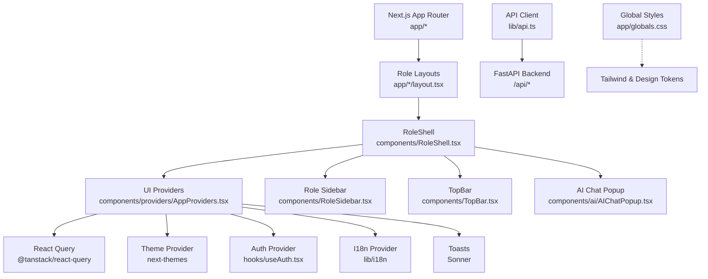
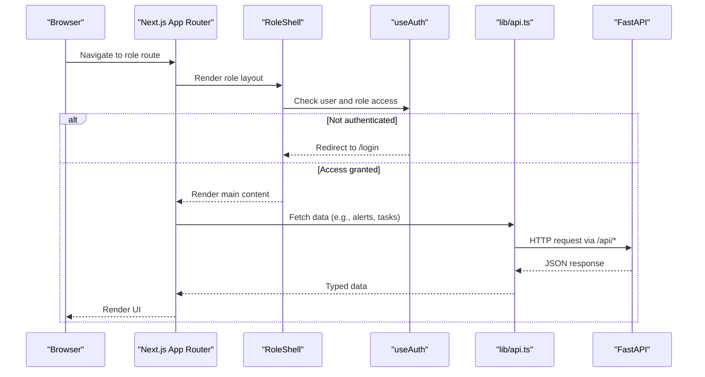
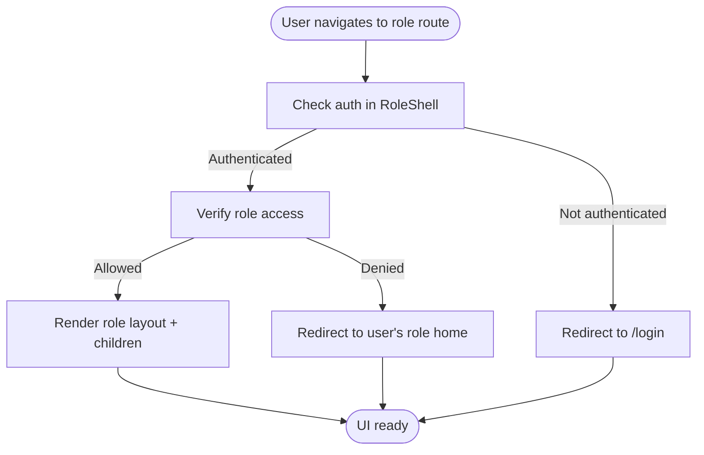
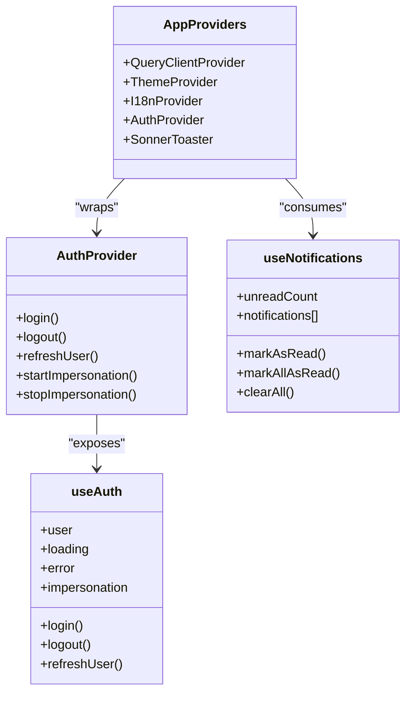
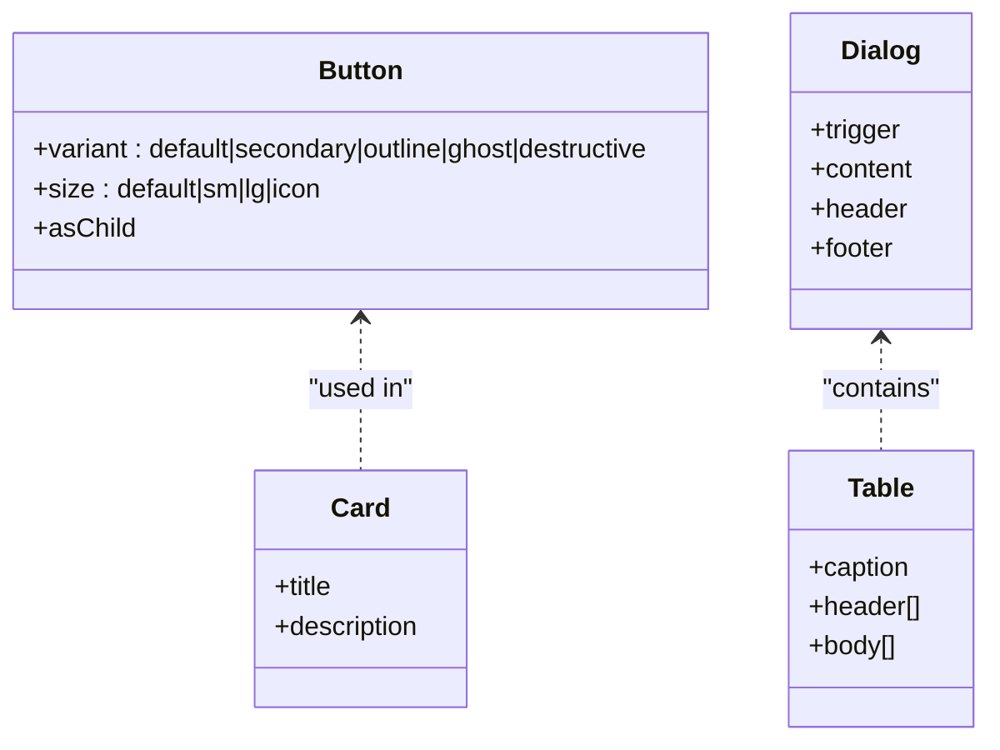
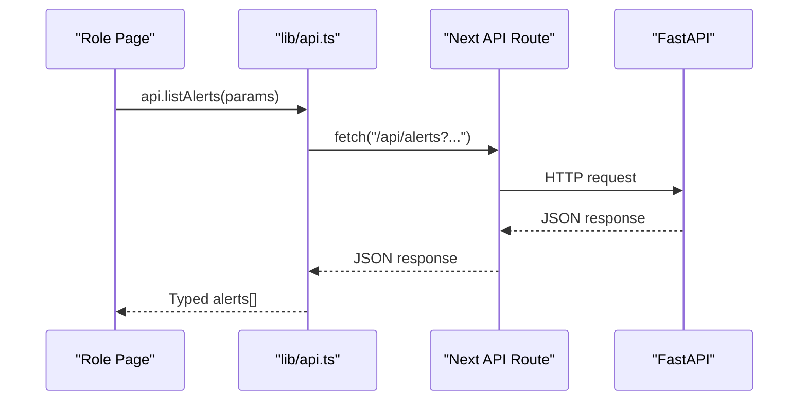
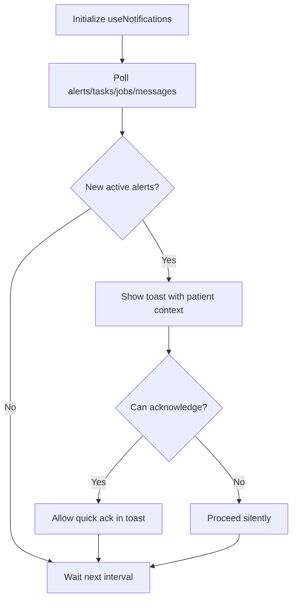
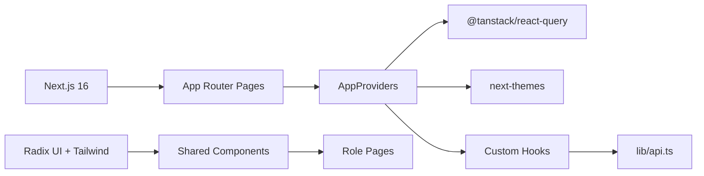

# Frontend Application

<cite>
**Referenced Files in This Document**
- [package.json](file://frontend/package.json)
- [next.config.ts](file://frontend/next.config.ts)
- [app/layout.tsx](file://frontend/app/layout.tsx)
- [components/providers/AppProviders.tsx](file://frontend/components/providers/AppProviders.tsx)
- [lib/types.ts](file://frontend/lib/types.ts)
- [lib/constants.ts](file://frontend/lib/constants.ts)
- [lib/permissions.ts](file://frontend/lib/permissions.ts)
- [lib/sidebarConfig.ts](file://frontend/lib/sidebarConfig.ts)
- [lib/api.ts](file://frontend/lib/api.ts)
- [hooks/useAuth.tsx](file://frontend/hooks/useAuth.tsx)
- [hooks/useNotifications.tsx](file://frontend/hooks/useNotifications.tsx)
- [components/RoleShell.tsx](file://frontend/components/RoleShell.tsx)
- [app/admin/layout.tsx](file://frontend/app/admin/layout.tsx)
- [app/head-nurse/layout.tsx](file://frontend/app/head-nurse/layout.tsx)
- [app/supervisor/layout.tsx](file://frontend/app/supervisor/layout.tsx)
- [app/observer/layout.tsx](file://frontend/app/observer/layout.tsx)
- [app/patient/layout.tsx](file://frontend/app/patient/layout.tsx)
- [components/ui/button.tsx](file://frontend/components/ui/button.tsx)
</cite>

## Table of Contents
1. [Introduction](#introduction)
2. [Project Structure](#project-structure)
3. [Core Components](#core-components)
4. [Architecture Overview](#architecture-overview)
5. [Detailed Component Analysis](#detailed-component-analysis)
6. [Dependency Analysis](#dependency-analysis)
7. [Performance Considerations](#performance-considerations)
8. [Troubleshooting Guide](#troubleshooting-guide)
9. [Conclusion](#conclusion)
10. [Appendices](#appendices)

## Introduction
This document describes the WheelSense Platform frontend built with Next.js 16. It explains the application’s routing model, role-based dashboards, component library and design system, state management patterns, form handling and validation, theming and responsiveness, accessibility, backend integration, real-time notifications, and operational best practices. Practical usage and customization patterns are included for each major area.

## Project Structure
The frontend is organized as a Next.js App Router application under the frontend directory. Key areas:
- app: Page-based routes per role (/admin, /head-nurse, /supervisor, /observer, /patient)
- components: Shared UI and role-specific components
- hooks: Client-side providers and reusable logic (auth, notifications)
- lib: Types, constants, permissions, API client, and utilities
- public: Static assets
- styles: Global CSS and Tailwind-based design tokens

**Diagram sources**
- [app/layout.tsx:1-24](file://frontend/app/layout.tsx#L1-L24)
- [components/providers/AppProviders.tsx:1-43](file://frontend/components/providers/AppProviders.tsx#L1-L43)
- [components/RoleShell.tsx:1-102](file://frontend/components/RoleShell.tsx#L1-L102)
- [lib/api.ts:1-120](file://frontend/lib/api.ts#L1-L120)

**Section sources**
- [package.json:1-58](file://frontend/package.json#L1-L58)
- [next.config.ts:1-30](file://frontend/next.config.ts#L1-L30)
- [app/layout.tsx:1-24](file://frontend/app/layout.tsx#L1-L24)

## Core Components
- AppProviders: Central provider container enabling theme switching, internationalization, authentication, React Query caching, and toast notifications.
- RoleShell: Role-aware shell that enforces authentication and role access, renders sidebar and top bar, and injects AI chat.
- API Client: Typed HTTP client wrapping fetch with JWT handling, timeouts, and standardized error responses.
- Permissions and Routes: Capability-driven role navigation and access guards.
- UI Library: Radix primitives and Tailwind-based components with variant-driven design system.

**Section sources**
- [components/providers/AppProviders.tsx:1-43](file://frontend/components/providers/AppProviders.tsx#L1-L43)
- [components/RoleShell.tsx:1-102](file://frontend/components/RoleShell.tsx#L1-L102)
- [lib/api.ts:118-297](file://frontend/lib/api.ts#L118-L297)
- [lib/permissions.ts:1-111](file://frontend/lib/permissions.ts#L1-L111)
- [lib/sidebarConfig.ts:1-300](file://frontend/lib/sidebarConfig.ts#L1-L300)

## Architecture Overview
The frontend composes role-specific dashboards behind unified guards. Authentication and role checks occur in the RoleShell, while global providers manage theme, i18n, and state. The API client proxies requests to the backend via the Next.js app API route.

**Diagram sources**
- [components/RoleShell.tsx:37-66](file://frontend/components/RoleShell.tsx#L37-L66)
- [hooks/useAuth.tsx:88-97](file://frontend/hooks/useAuth.tsx#L88-L97)
- [lib/api.ts:209-297](file://frontend/lib/api.ts#L209-L297)
- [next.config.ts:25-27](file://frontend/next.config.ts#L25-L27)

## Detailed Component Analysis

### Role-Based Dashboards and Routing
- Each role has a dedicated layout that wraps content with RoleShell, ensuring consistent guards and UI.
- Redirects normalize legacy staff paths to canonical role paths.
- Route roots and common paths are centralized in constants for consistency.

**Diagram sources**
- [components/RoleShell.tsx:37-66](file://frontend/components/RoleShell.tsx#L37-L66)
- [lib/permissions.ts:107-109](file://frontend/lib/permissions.ts#L107-L109)
- [next.config.ts:6-24](file://frontend/next.config.ts#L6-L24)
- [lib/constants.ts:4-26](file://frontend/lib/constants.ts#L4-L26)

**Section sources**
- [app/admin/layout.tsx:1-12](file://frontend/app/admin/layout.tsx#L1-L12)
- [app/head-nurse/layout.tsx:1-12](file://frontend/app/head-nurse/layout.tsx#L1-L12)
- [app/supervisor/layout.tsx:1-12](file://frontend/app/supervisor/layout.tsx#L1-L12)
- [app/observer/layout.tsx:1-12](file://frontend/app/observer/layout.tsx#L1-L12)
- [app/patient/layout.tsx:1-24](file://frontend/app/patient/layout.tsx#L1-L24)
- [next.config.ts:6-24](file://frontend/next.config.ts#L6-L24)
- [lib/constants.ts:4-26](file://frontend/lib/constants.ts#L4-L26)

### State Management Patterns
- Providers: AppProviders composes ThemeProvider, QueryClientProvider, I18nProvider, AuthProvider, and SonnerToaster.
- React Query: Centralized caching with retry, refetch on window focus/reconnect, and a short staleness policy.
- Auth Store: Zustand-backed store for user state, impersonation, and loading/error states.
- Notifications: Polling for alerts, tasks, workflow jobs, and messages; toast integration with severity-based UX.

**Diagram sources**
- [components/providers/AppProviders.tsx:10-42](file://frontend/components/providers/AppProviders.tsx#L10-L42)
- [hooks/useAuth.tsx:88-183](file://frontend/hooks/useAuth.tsx#L88-L183)
- [hooks/useNotifications.tsx:186-422](file://frontend/hooks/useNotifications.tsx#L186-L422)

**Section sources**
- [components/providers/AppProviders.tsx:10-42](file://frontend/components/providers/AppProviders.tsx#L10-L42)
- [hooks/useAuth.tsx:88-183](file://frontend/hooks/useAuth.tsx#L88-L183)
- [hooks/useNotifications.tsx:186-422](file://frontend/hooks/useNotifications.tsx#L186-L422)

### Form Handling and Validation
- Validation library: Zod is used alongside React Hook Form for robust form validation.
- UI primitives: Radix UI components (Dialog, Select, Checkbox, Switch, Tabs, etc.) provide accessible controls.
- Pattern: Define Zod schemas, integrate with React Hook Form resolvers, and render UI components with controlled state and error feedback.

Practical usage pattern:
- Define a Zod schema for the form shape.
- Use React Hook Form with the Zod resolver.
- Render Radix UI inputs and attach field handlers.
- Display field-level errors and handle submission via the API client.

**Section sources**
- [package.json:16-44](file://frontend/package.json#L16-L44)
- [components/ui/button.tsx:1-56](file://frontend/components/ui/button.tsx#L1-L56)

### Component Library and Design System
- Base components: Button, Card, Dialog, Dropdown Menu, Input, Label, Progress, Select, Separator, Sheet, Switch, Table, Tabs, Textarea, and more.
- Variants: Class Variance Authority (CVA) powers variant composition for size and variant props.
- Styling: Tailwind-based with design tokens and consistent spacing, typography, and color usage.

**Diagram sources**
- [components/ui/button.tsx:6-33](file://frontend/components/ui/button.tsx#L6-L33)

**Section sources**
- [components/ui/button.tsx:1-56](file://frontend/components/ui/button.tsx#L1-L56)

### Theming System and Responsive Design
- ThemeProvider: Supports light, dark, and system themes with opt-out of transition on change for instant switching.
- Responsive layout: RoleShell and role layouts apply padding, widths, and shadows appropriate for desktop and tablet breakpoints.
- Accessibility: Focus-visible outlines, semantic markup, and keyboard navigation supported by Radix UI.

**Section sources**
- [components/providers/AppProviders.tsx:26-31](file://frontend/components/providers/AppProviders.tsx#L26-L31)
- [app/patient/layout.tsx:10-22](file://frontend/app/patient/layout.tsx#L10-L22)

### Accessibility Compliance
- Radix UI primitives ensure ARIA-compliant interactions.
- Focus management: Focus-visible rings and outline resets are applied consistently.
- Semantic HTML and proper labeling via Label components.

**Section sources**
- [components/ui/button.tsx:41-52](file://frontend/components/ui/button.tsx#L41-L52)
- [app/patient/layout.tsx:13-21](file://frontend/app/patient/layout.tsx#L13-L21)

### Integration with Backend APIs
- API base: All requests are prefixed with /api and proxied to the backend.
- Typed client: Strongly typed endpoints for alerts, patients, devices, workflow tasks/jobs, rooms, and more.
- Error handling: Centralized ApiError with 401 redirection and structured error messages.
- Authentication: Session hydration, login, impersonation, and logout flows.

**Diagram sources**
- [lib/api.ts:491-498](file://frontend/lib/api.ts#L491-L498)
- [next.config.ts:25-27](file://frontend/next.config.ts#L25-L27)

**Section sources**
- [lib/constants.ts:1-2](file://frontend/lib/constants.ts#L1-L2)
- [lib/api.ts:118-297](file://frontend/lib/api.ts#L118-L297)

### Real-Time Updates and Notifications
- Polling: Alerts, tasks, workflow jobs, and messages are polled at intervals.
- Severity-based UX: Toasts with optional sound for urgent alerts; info toasts for less severe events.
- Navigation: Clicking a toast navigates to the relevant inbox or task list.

**Diagram sources**
- [hooks/useNotifications.tsx:203-297](file://frontend/hooks/useNotifications.tsx#L203-L297)
- [hooks/useNotifications.tsx:299-351](file://frontend/hooks/useNotifications.tsx#L299-L351)

**Section sources**
- [hooks/useNotifications.tsx:186-422](file://frontend/hooks/useNotifications.tsx#L186-L422)

### Offline Capabilities
- The application relies on network connectivity for backend access and does not implement a service worker or offline-first caching strategy.
- Recommendations:
  - Introduce a lightweight cache via React Query for read-heavy lists.
  - Use background sync patterns for write operations if needed.
  - Consider a minimal offline indicator UI.

[No sources needed since this section provides general guidance]

### Role-Specific Interfaces
- Admin: Personnel, Devices, Facilities, Settings, Tasks, Messages.
- Head Nurse: Dashboard, Patients/Staff/Specialists, Tasks, Messages, Reports, Support, Settings.
- Supervisor: Dashboard, Patients/Prescriptions, Tasks, Messages, Support, Settings.
- Observer: Dashboard, My Patients/Prescriptions, Tasks, Messages, Support, Settings.
- Patient: Dashboard, My Care (Schedule/Services/Pharmacy), Messages, Support, Settings.

Navigation is driven by capability filters and role-specific configs.

**Section sources**
- [lib/sidebarConfig.ts:60-275](file://frontend/lib/sidebarConfig.ts#L60-L275)
- [lib/permissions.ts:26-93](file://frontend/lib/permissions.ts#L26-L93)

## Dependency Analysis
External libraries and their roles:
- Next.js 16: App Router, static generation, and runtime features.
- @tanstack/react-query: Data fetching, caching, and synchronization.
- next-themes: Theme switching with system preference.
- Radix UI: Accessible UI primitives.
- Tailwind: Utility-first styling and design tokens.
- React Hook Form + Zod: Form validation and control.
- Sonner: Toast notifications.

**Diagram sources**
- [package.json:13-44](file://frontend/package.json#L13-L44)
- [components/providers/AppProviders.tsx:3-40](file://frontend/components/providers/AppProviders.tsx#L3-L40)

**Section sources**
- [package.json:13-44](file://frontend/package.json#L13-L44)

## Performance Considerations
- React Compiler: Enabled in Next config for improved rendering performance.
- Query caching: Short stale time and automatic refetch policies reduce redundant network calls.
- Lazy loading: Load heavy components on demand; split bundles by route.
- Image optimization: Use Next/image for optimized media delivery.
- Bundle analysis: Monitor with Next.js analyzer to identify large dependencies.

**Section sources**
- [next.config.ts:5](file://frontend/next.config.ts#L5)
- [components/providers/AppProviders.tsx:14-22](file://frontend/components/providers/AppProviders.tsx#L14-L22)

## Troubleshooting Guide
Common issues and resolutions:
- Unauthorized access: 401 triggers a redirect to /login; verify session hydration and backend auth.
- Role access denied: RoleShell redirects to user’s home; check permissions mapping.
- API timeouts: Requests abort after a fixed timeout; retry logic is handled in the API client.
- Toast interruptions: Urgent alerts trigger sound and persistent toasts; use actions to navigate to relevant views.

**Section sources**
- [lib/api.ts:251-286](file://frontend/lib/api.ts#L251-L286)
- [components/RoleShell.tsx:44-66](file://frontend/components/RoleShell.tsx#L44-L66)
- [hooks/useNotifications.tsx:253-288](file://frontend/hooks/useNotifications.tsx#L253-L288)

## Conclusion
The WheelSense frontend leverages Next.js 16’s App Router to deliver role-focused, accessible, and responsive dashboards. A cohesive provider stack, strong typing, and capability-driven navigation ensure maintainability and scalability. Integrating real-time notifications and a robust API client enables timely, actionable insights across roles.

## Appendices

### Practical Examples and Customization Patterns
- Customizing a Button variant:
  - Use the Button component with variant and size props to match design tokens.
  - Extend CVA variants sparingly and document new options centrally.
  - Reference: [components/ui/button.tsx:6-33](file://frontend/components/ui/button.tsx#L6-L33)

- Adding a new role navigation item:
  - Extend the role’s NavGroup in sidebarConfig with a new NavItem.
  - Optionally add a capability requirement and badge.
  - Reference: [lib/sidebarConfig.ts:22-45](file://frontend/lib/sidebarConfig.ts#L22-L45)

- Implementing a new role dashboard:
  - Create a new page under the role’s directory in app/.
  - Wrap with RoleShell via a layout if needed.
  - Reference: [app/admin/layout.tsx:10](file://frontend/app/admin/layout.tsx#L10)

- Extending the API client:
  - Add a new typed endpoint in lib/api.ts following the existing request pattern.
  - Export a convenience method and type-safe response.
  - Reference: [lib/api.ts:342-383](file://frontend/lib/api.ts#L342-L383)