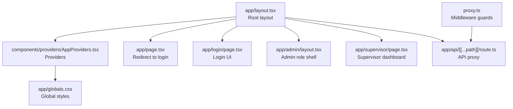
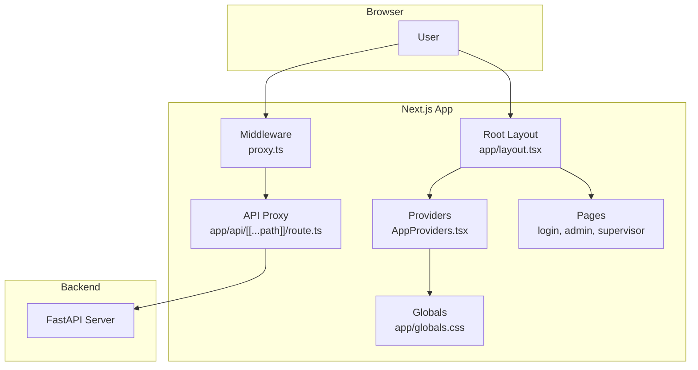
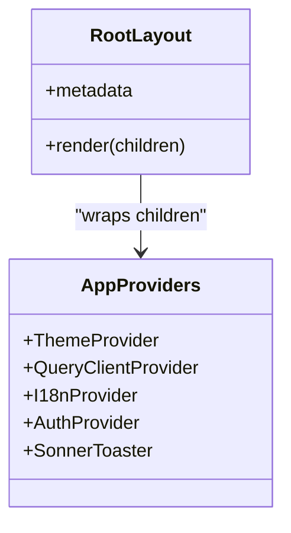
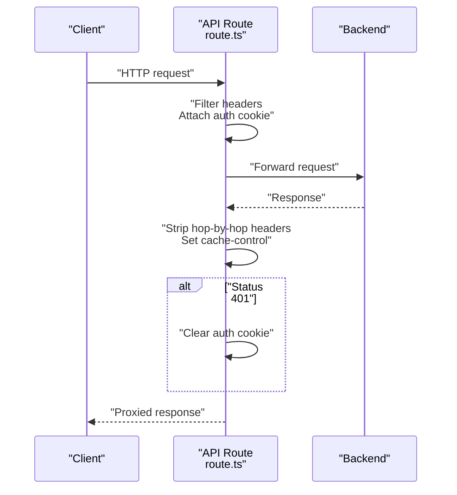
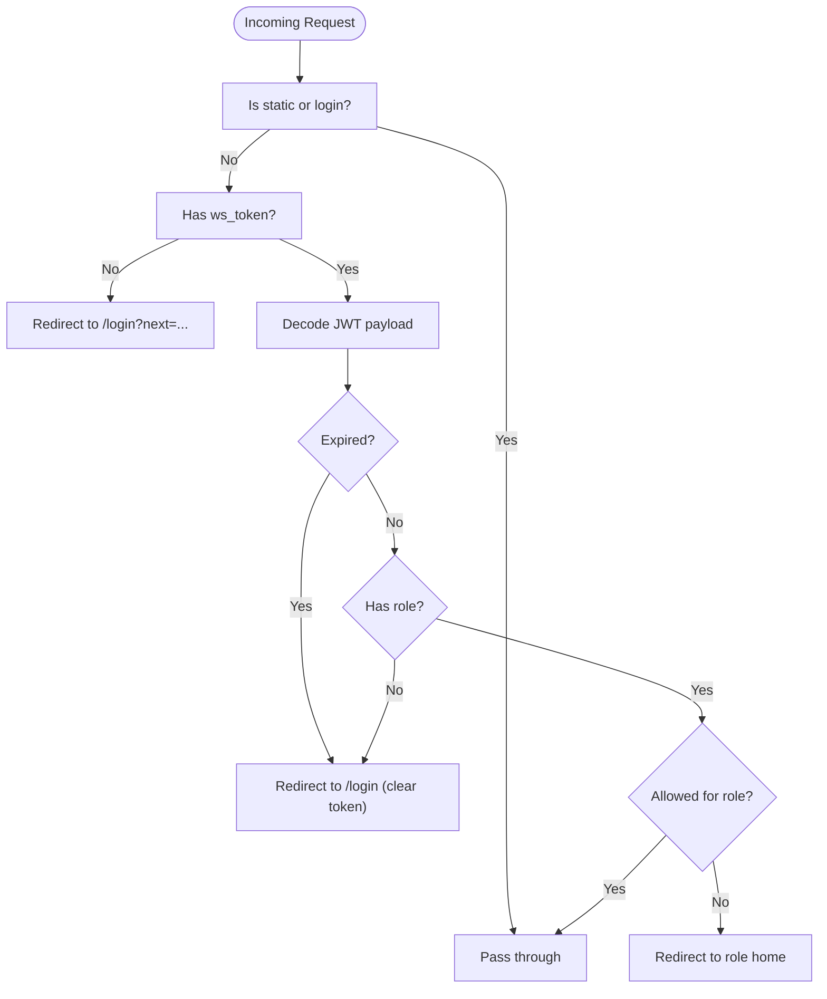
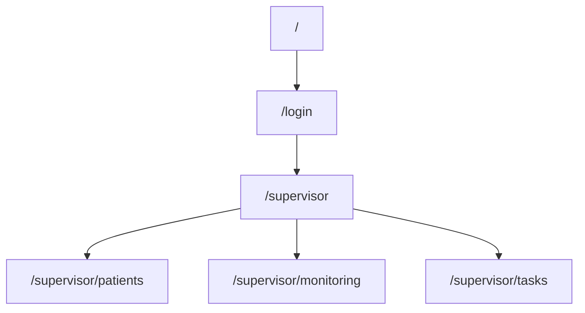
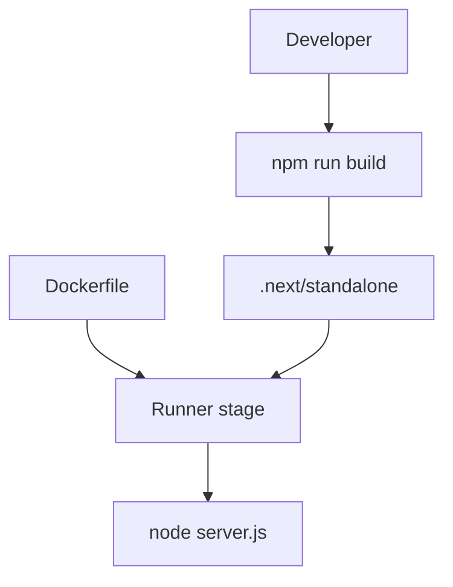
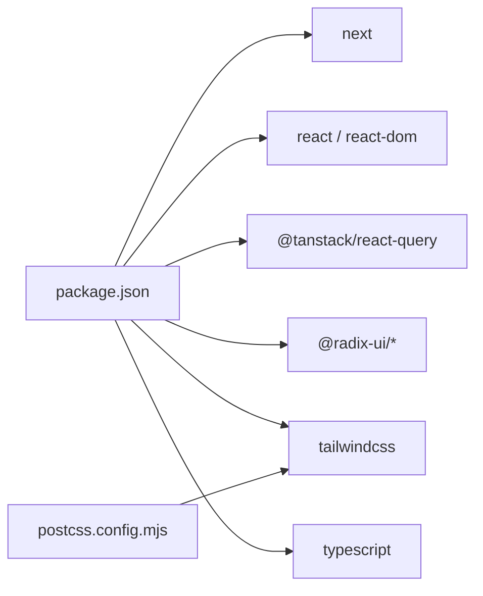

# Next.js Application

<cite>
**Referenced Files in This Document**
- [next.config.ts](file://frontend/next.config.ts)
- [package.json](file://frontend/package.json)
- [tsconfig.json](file://frontend/tsconfig.json)
- [app/layout.tsx](file://frontend/app/layout.tsx)
- [app/globals.css](file://frontend/app/globals.css)
- [components/providers/AppProviders.tsx](file://frontend/components/providers/AppProviders.tsx)
- [app/api/[[...path]]/route.ts](file://frontend/app/api/[[...path]]/route.ts)
- [app/page.tsx](file://frontend/app/page.tsx)
- [proxy.ts](file://frontend/proxy.ts)
- [app/admin/layout.tsx](file://frontend/app/admin/layout.tsx)
- [app/supervisor/page.tsx](file://frontend/app/supervisor/page.tsx)
- [app/login/page.tsx](file://frontend/app/login/page.tsx)
- [postcss.config.mjs](file://frontend/postcss.config.mjs)
- [Dockerfile](file://frontend/Dockerfile)
- [.dockerignore](file://frontend/.dockerignore)
- [components/RoleShell.tsx](file://frontend/components/RoleShell.tsx)
</cite>

## Table of Contents
1. [Introduction](#introduction)
2. [Project Structure](#project-structure)
3. [Core Components](#core-components)
4. [Architecture Overview](#architecture-overview)
5. [Detailed Component Analysis](#detailed-component-analysis)
6. [Dependency Analysis](#dependency-analysis)
7. [Performance Considerations](#performance-considerations)
8. [Troubleshooting Guide](#troubleshooting-guide)
9. [Conclusion](#conclusion)
10. [Appendices](#appendices)

## Introduction
This document describes the Next.js application powering the WheelSense Platform frontend. It explains the app directory structure, routing patterns, configuration for Next.js 16, provider setup, global styles, API routing, and build/runtime characteristics. It also covers development workflow, hot reloading, and production deployment using a standalone output mode.

## Project Structure
The frontend is organized under the Next.js app directory with:
- Root layout and global CSS
- Role-based application shells and pages
- API routes that proxy to the backend
- Providers for state and theming
- Tailwind CSS via PostCSS and a modern TypeScript configuration

**Diagram sources**
- [app/layout.tsx:1-24](file://frontend/app/layout.tsx#L1-L24)
- [components/providers/AppProviders.tsx:1-43](file://frontend/components/providers/AppProviders.tsx#L1-L43)
- [app/globals.css:1-326](file://frontend/app/globals.css#L1-L326)
- [app/page.tsx:1-6](file://frontend/app/page.tsx#L1-L6)
- [app/login/page.tsx:1-251](file://frontend/app/login/page.tsx#L1-L251)
- [app/admin/layout.tsx:1-12](file://frontend/app/admin/layout.tsx#L1-L12)
- [app/supervisor/page.tsx:1-394](file://frontend/app/supervisor/page.tsx#L1-L394)
- [app/api/[[...path]]/route.ts](file://frontend/app/api/[[...path]]/route.ts#L1-L328)
- [proxy.ts:1-93](file://frontend/proxy.ts#L1-L93)

**Section sources**
- [app/layout.tsx:1-24](file://frontend/app/layout.tsx#L1-L24)
- [app/globals.css:1-326](file://frontend/app/globals.css#L1-L326)
- [app/page.tsx:1-6](file://frontend/app/page.tsx#L1-L6)
- [app/login/page.tsx:1-251](file://frontend/app/login/page.tsx#L1-L251)
- [app/admin/layout.tsx:1-12](file://frontend/app/admin/layout.tsx#L1-L12)
- [app/supervisor/page.tsx:1-394](file://frontend/app/supervisor/page.tsx#L1-L394)
- [app/api/[[...path]]/route.ts](file://frontend/app/api/[[...path]]/route.ts#L1-L328)
- [proxy.ts:1-93](file://frontend/proxy.ts#L1-L93)

## Core Components
- Root layout and metadata define the HTML shell and global imports.
- Providers encapsulate theme switching, React Query caching, internationalization, authentication, and toast notifications.
- Global CSS defines design tokens, themes, and reusable utilities.
- API route proxies requests to the backend, manages auth cookies, and handles fallbacks.
- Middleware enforces role-based access and login redirection.
- Role shells wrap role-specific pages with navigation and guards.

**Section sources**
- [app/layout.tsx:1-24](file://frontend/app/layout.tsx#L1-L24)
- [components/providers/AppProviders.tsx:1-43](file://frontend/components/providers/AppProviders.tsx#L1-L43)
- [app/globals.css:1-326](file://frontend/app/globals.css#L1-L326)
- [app/api/[[...path]]/route.ts](file://frontend/app/api/[[...path]]/route.ts#L1-L328)
- [proxy.ts:1-93](file://frontend/proxy.ts#L1-L93)
- [components/RoleShell.tsx:1-102](file://frontend/components/RoleShell.tsx#L1-L102)

## Architecture Overview
The frontend uses Next.js app directory routing with:
- Root layout importing global CSS and providers
- Role-specific layouts and pages
- API routes that act as a proxy to the backend
- Middleware for authentication and role checks
- Standalone output mode for production containers

**Diagram sources**
- [app/layout.tsx:1-24](file://frontend/app/layout.tsx#L1-L24)
- [components/providers/AppProviders.tsx:1-43](file://frontend/components/providers/AppProviders.tsx#L1-L43)
- [app/globals.css:1-326](file://frontend/app/globals.css#L1-L326)
- [proxy.ts:1-93](file://frontend/proxy.ts#L1-L93)
- [app/api/[[...path]]/route.ts](file://frontend/app/api/[[...path]]/route.ts#L1-L328)
- [app/login/page.tsx:1-251](file://frontend/app/login/page.tsx#L1-L251)
- [app/admin/layout.tsx:1-12](file://frontend/app/admin/layout.tsx#L1-L12)
- [app/supervisor/page.tsx:1-394](file://frontend/app/supervisor/page.tsx#L1-L394)

## Detailed Component Analysis

### Next.js Configuration (next.config.ts)
- Output mode: standalone for minimal container deployments.
- React Compiler: enabled for improved performance.
- Redirects: remaps legacy staff paths to canonical role paths.
- Notes: API traffic is proxied by the API route to ensure reliable HTTP methods reach the backend.

**Section sources**
- [next.config.ts:1-30](file://frontend/next.config.ts#L1-L30)

### TypeScript Setup (tsconfig.json)
- Strict mode enabled with no emit.
- Bundler module resolution and JSX runtime configured for Next.js.
- Path aliases mapped via tsconfig paths for clean imports.
- Incremental builds and isolated modules for fast dev feedback.

**Section sources**
- [tsconfig.json:1-35](file://frontend/tsconfig.json#L1-L35)

### Root Layout and Providers (app/layout.tsx, components/providers/AppProviders.tsx)
- Root layout sets metadata, imports global CSS, and wraps children in providers.
- Providers configure:
  - Theme switching with next-themes
  - React Query with retry, refetch policies, and a short stale time
  - Internationalization and authentication contexts
  - Toast notifications via Sonner

**Diagram sources**
- [app/layout.tsx:1-24](file://frontend/app/layout.tsx#L1-L24)
- [components/providers/AppProviders.tsx:1-43](file://frontend/components/providers/AppProviders.tsx#L1-L43)

**Section sources**
- [app/layout.tsx:1-24](file://frontend/app/layout.tsx#L1-L24)
- [components/providers/AppProviders.tsx:1-43](file://frontend/components/providers/AppProviders.tsx#L1-L43)

### Global Styles (app/globals.css)
- Imports Inter font and Tailwind directives.
- Defines CSS custom properties for light/dark themes.
- Exposes theme tokens and surface/background variants.
- Includes reusable utility classes for cards, inputs, animations, and toasts.

**Section sources**
- [app/globals.css:1-326](file://frontend/app/globals.css#L1-L326)

### API Proxy Routing (app/api/[[...path]]/route.ts)
- Runtime: Node.js.
- Proxies requests to the backend origin with header filtering and hop-by-hop removal.
- Honors authorization via cookie and forwards body for non-GET methods.
- Applies strict cache-control headers and no-store semantics.
- Handles login/logout/impersonation flows by setting/clearing auth cookies.
- Provides fallback responses for AI model endpoints when backend is unreachable.
- Returns 502 with a detailed message on proxy failures.

**Diagram sources**
- [app/api/[[...path]]/route.ts](file://frontend/app/api/[[...path]]/route.ts#L1-L328)

**Section sources**
- [app/api/[[...path]]/route.ts](file://frontend/app/api/[[...path]]/route.ts#L1-L328)

### Middleware Guards (proxy.ts)
- Enforces authentication and role-based access for protected routes.
- Redirects unauthenticated users to login with a next parameter.
- Validates JWT expiration and role presence.
- Restricts access to role-specific paths except special allowances.
- Uses a matcher to apply guards to role and account routes.

**Diagram sources**
- [proxy.ts:1-93](file://frontend/proxy.ts#L1-L93)

**Section sources**
- [proxy.ts:1-93](file://frontend/proxy.ts#L1-L93)

### Role Shell and Navigation (components/RoleShell.tsx)
- Provides unified role shell with:
  - Auth guard (redirects to login)
  - Role guard (redirects to role home if unauthorized)
  - Sidebar and top bar
  - AI chat popup
- Includes special-case allowance for staff to edit their own profile.

**Section sources**
- [components/RoleShell.tsx:1-102](file://frontend/components/RoleShell.tsx#L1-L102)

### Routing Patterns and Entry Points
- Root page redirects to login.
- Role-specific pages and dashboards are rendered client-side with data fetching via React Query.
- Dynamic segments like [id] are supported under role paths.

**Diagram sources**
- [app/page.tsx:1-6](file://frontend/app/page.tsx#L1-L6)
- [app/supervisor/page.tsx:1-394](file://frontend/app/supervisor/page.tsx#L1-L394)

**Section sources**
- [app/page.tsx:1-6](file://frontend/app/page.tsx#L1-L6)
- [app/supervisor/page.tsx:1-394](file://frontend/app/supervisor/page.tsx#L1-L394)

### Build and Deployment Configuration
- Build script runs Next.js build.
- Standalone output mode produces a self-contained .next/standalone directory suitable for containers.
- Dockerfile stages:
  - deps: installs dependencies
  - builder: builds the app and prepares static assets
  - runner: copies standalone and static assets, sets non-root user, exposes port, and starts server
- Telemetry disabled in Docker builds.

**Diagram sources**
- [package.json:1-58](file://frontend/package.json#L1-L58)
- [Dockerfile:1-31](file://frontend/Dockerfile#L1-L31)

**Section sources**
- [package.json:1-58](file://frontend/package.json#L1-L58)
- [Dockerfile:1-31](file://frontend/Dockerfile#L1-L31)
- [.dockerignore:1-8](file://frontend/.dockerignore#L1-L8)

## Dependency Analysis
- Frontend dependencies include Next.js 16, React 19, TanStack Query, Radix UI, Tailwind, and others.
- Dev dependencies include ESLint, Tailwind PostCSS plugin, and TypeScript.
- PostCSS integrates Tailwind directives for CSS generation.
- Middleware and API routes depend on environment variables for backend origin.

**Diagram sources**
- [package.json:1-58](file://frontend/package.json#L1-L58)
- [postcss.config.mjs:1-8](file://frontend/postcss.config.mjs#L1-L8)

**Section sources**
- [package.json:1-58](file://frontend/package.json#L1-L58)
- [postcss.config.mjs:1-8](file://frontend/postcss.config.mjs#L1-L8)

## Performance Considerations
- React Compiler enabled in Next.js config improves component compilation performance.
- React Query defaults:
  - Retry attempts: 1
  - Refetch on window focus/reconnect
  - Stale time: 15 seconds
- Cache-control headers on proxied responses enforce no-store semantics for API traffic.
- Tailwind CSS via PostCSS ensures efficient CSS generation.
- Standalone output reduces container image size and startup overhead.

[No sources needed since this section provides general guidance]

## Troubleshooting Guide
- Authentication failures:
  - Verify ws_token cookie presence and validity.
  - On 401 responses, the API proxy clears the auth cookie automatically.
- Backend unavailability:
  - GET requests receive a retry and may return fallback responses for AI endpoints.
  - Non-GET requests return a structured 502 message when the backend is unreachable.
- Role access issues:
  - Middleware redirects to login if token is missing/expired or role is invalid.
  - Role guards redirect to the user’s role home if attempting to access another role’s path.

**Section sources**
- [app/api/[[...path]]/route.ts](file://frontend/app/api/[[...path]]/route.ts#L170-L206)
- [proxy.ts:60-81](file://frontend/proxy.ts#L60-L81)

## Conclusion
The WheelSense Platform frontend leverages Next.js 16 with a modern app directory structure, robust provider stack, and a dedicated API proxy to integrate with the backend. The standalone output mode and containerized build streamline production deployment, while middleware and role shells ensure secure, role-aware navigation. The configuration emphasizes performance, maintainability, and a consistent developer experience.

## Appendices

### Development Workflow
- Development server supports both Webpack and Turbopack modes.
- Hot reloading is enabled by default in Next.js dev server.
- Linting via ESLint and TypeScript checking are integrated into the toolchain.

**Section sources**
- [package.json:1-58](file://frontend/package.json#L1-L58)

### Production Deployment Notes
- Use standalone output for minimal container images.
- Ensure environment variables for backend origin are configured in production.
- Disable telemetry in production builds as shown in Dockerfile.

**Section sources**
- [next.config.ts:1-30](file://frontend/next.config.ts#L1-L30)
- [Dockerfile:1-31](file://frontend/Dockerfile#L1-L31)