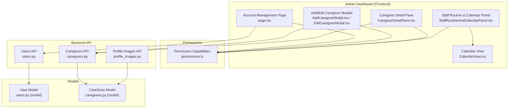
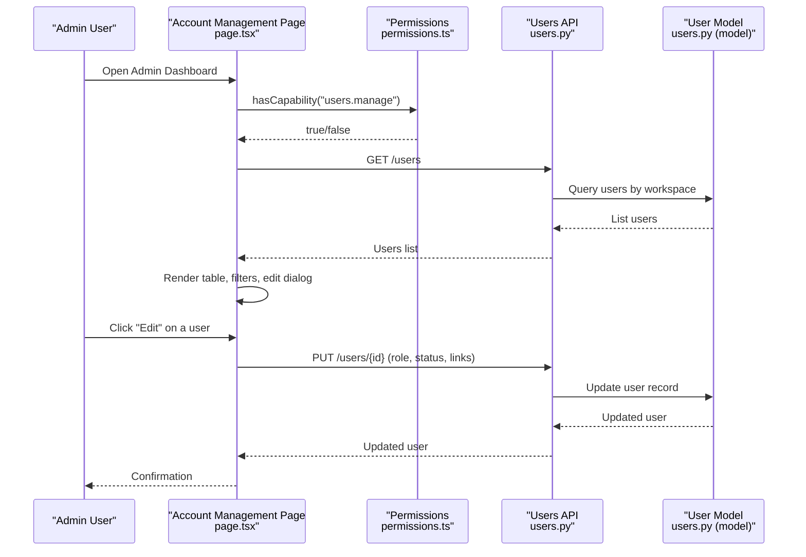
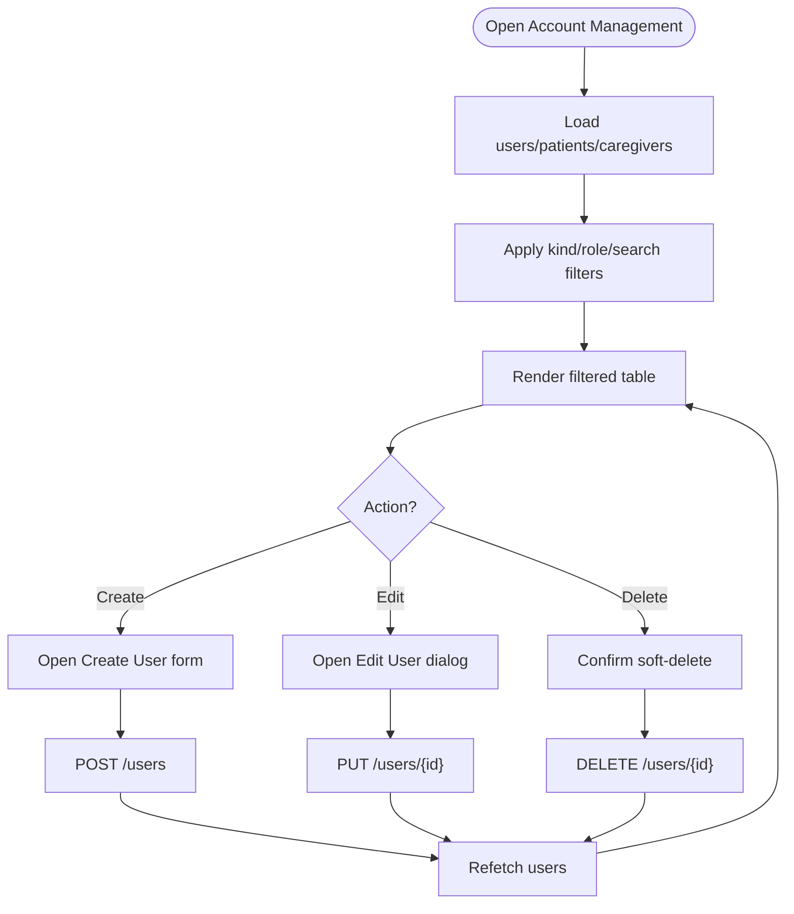
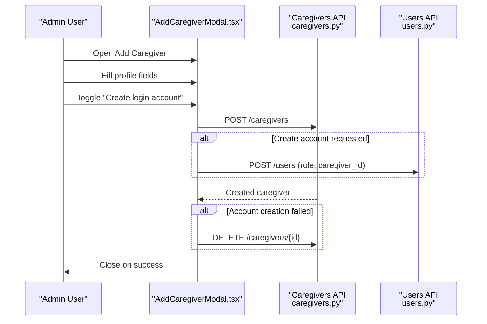
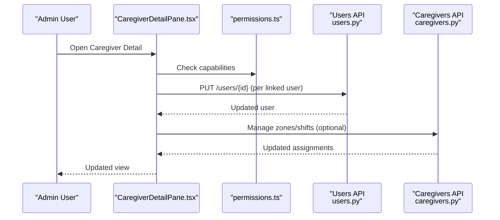
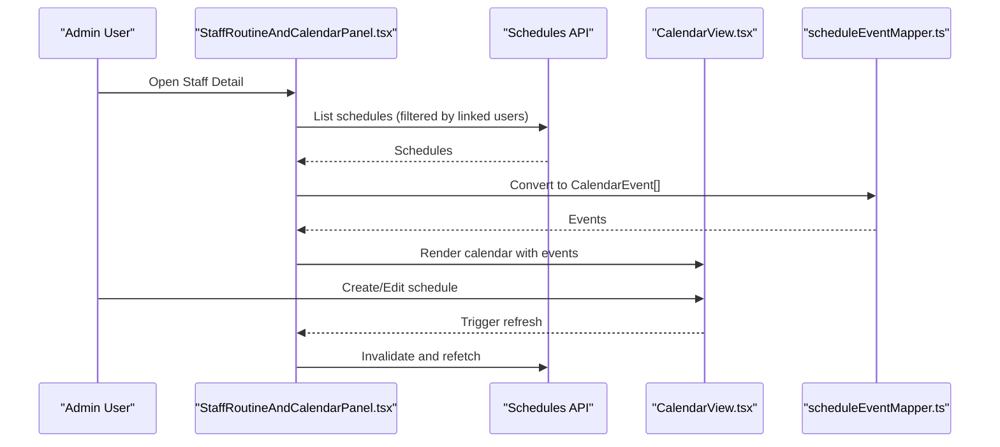
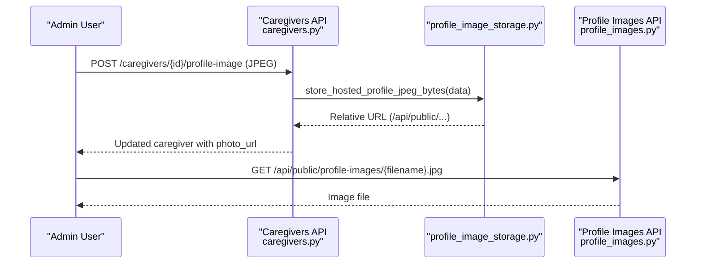
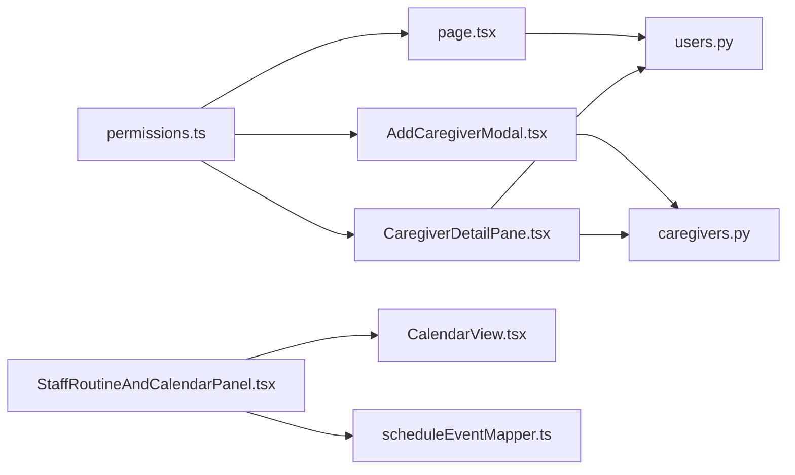

# Account Management

<cite>
**Referenced Files in This Document**
- [page.tsx](file://frontend/app/admin/account-management/page.tsx)
- [AddCaregiverModal.tsx](file://frontend/components/admin/caregivers/AddCaregiverModal.tsx)
- [EditCaregiverModal.tsx](file://frontend/components/admin/caregivers/EditCaregiverModal.tsx)
- [CaregiverCardGrid.tsx](file://frontend/components/admin/caregivers/CaregiverCardGrid.tsx)
- [CaregiverDetailPane.tsx](file://frontend/components/admin/caregivers/CaregiverDetailPane.tsx)
- [StaffRoutineAndCalendarPanel.tsx](file://frontend/components/admin/caregivers/StaffRoutineAndCalendarPanel.tsx)
- [CalendarView.tsx](file://frontend/components/calendar/CalendarView.tsx)
- [scheduleEventMapper.ts](file://frontend/components/calendar/scheduleEventMapper.ts)
- [permissions.ts](file://frontend/lib/permissions.ts)
- [users.py](file://server/app/api/endpoints/users.py)
- [caregivers.py](file://server/app/api/endpoints/caregivers.py)
- [profile_images.py](file://server/app/api/endpoints/profile_images.py)
- [profile_image_storage.py](file://server/app/services/profile_image_storage.py)
- [users.py (model)](file://server/app/models/users.py)
- [caregivers.py (model)](file://server/app/models/caregivers.py)
</cite>

## Table of Contents
1. [Introduction](#introduction)
2. [Project Structure](#project-structure)
3. [Core Components](#core-components)
4. [Architecture Overview](#architecture-overview)
5. [Detailed Component Analysis](#detailed-component-analysis)
6. [Dependency Analysis](#dependency-analysis)
7. [Performance Considerations](#performance-considerations)
8. [Troubleshooting Guide](#troubleshooting-guide)
9. [Conclusion](#conclusion)

## Introduction
This document describes the Account Management functionality in the Admin Dashboard, covering user provisioning and management, caregiver onboarding, profile editing, role assignment, account status management, and permission enforcement. It also documents caregiver-specific features including staff routine management, calendar integration, and care team coordination. The guide includes practical admin workflows for adding users, editing accounts, resetting passwords, and managing permissions across roles and workspaces.

## Project Structure
The Account Management feature spans frontend pages and components, plus backend API endpoints and models:
- Frontend Admin Account Management page orchestrates filtering, searching, and editing users.
- Caregiver onboarding and editing modals manage staff profiles and optional user account creation.
- Care team coordination integrates with scheduling, calendar, and shift management.
- Backend APIs enforce role-based access control and provide CRUD operations for users and caregivers.
- Profile image storage supports JPEG uploads and retrieval for both users and caregivers.

**Diagram sources**
- [page.tsx:68-800](file://frontend/app/admin/account-management/page.tsx#L68-L800)
- [AddCaregiverModal.tsx:17-93](file://frontend/components/admin/caregivers/AddCaregiverModal.tsx#L17-L93)
- [EditCaregiverModal.tsx:205-466](file://frontend/components/admin/caregivers/EditCaregiverModal.tsx#L205-L466)
- [CaregiverDetailPane.tsx:741-800](file://frontend/components/admin/caregivers/CaregiverDetailPane.tsx#L741-L800)
- [StaffRoutineAndCalendarPanel.tsx:38-314](file://frontend/components/admin/caregivers/StaffRoutineAndCalendarPanel.tsx#L38-L314)
- [CalendarView.tsx:74-496](file://frontend/components/calendar/CalendarView.tsx#L74-L496)
- [permissions.ts:103-111](file://frontend/lib/permissions.ts#L103-L111)
- [users.py:23-99](file://server/app/api/endpoints/users.py#L23-L99)
- [caregivers.py:100-269](file://server/app/api/endpoints/caregivers.py#L100-L269)
- [profile_images.py:28-34](file://server/app/api/endpoints/profile_images.py#L28-L34)
- [users.py (model):9-57](file://server/app/models/users.py#L9-L57)
- [caregivers.py (model):22-166](file://server/app/models/caregivers.py#L22-L166)

**Section sources**
- [page.tsx:68-800](file://frontend/app/admin/account-management/page.tsx#L68-L800)
- [permissions.ts:103-111](file://frontend/lib/permissions.ts#L103-L111)
- [users.py:23-99](file://server/app/api/endpoints/users.py#L23-L99)
- [caregivers.py:100-269](file://server/app/api/endpoints/caregivers.py#L100-L269)

## Core Components
- Admin Account Management page: Lists users, filters by kind and role, searches by text, and edits user attributes including role, status, and caregiver/patient linkage. Supports creating new users and soft-deleting accounts.
- Caregiver onboarding modal: Adds staff profiles and optionally creates a login account for the caregiver with username/password.
- Caregiver editing modal: Edits staff identity, work profile, contact, emergency contacts, and activation status.
- Caregiver detail pane: Shows linked users, manages user updates per linked account, and exposes schedule and calendar panels.
- Staff routine and calendar panel: Displays shift checklist progress and integrates with a calendar for supplementary schedules.
- Permissions module: Enforces capability-based access control for user management, caregiver management, and schedule management.
- Backend APIs: Provide user CRUD, caregiver CRUD, zone/shift management, and profile image storage.

**Section sources**
- [page.tsx:68-800](file://frontend/app/admin/account-management/page.tsx#L68-L800)
- [AddCaregiverModal.tsx:17-93](file://frontend/components/admin/caregivers/AddCaregiverModal.tsx#L17-L93)
- [EditCaregiverModal.tsx:205-466](file://frontend/components/admin/caregivers/EditCaregiverModal.tsx#L205-L466)
- [CaregiverDetailPane.tsx:741-800](file://frontend/components/admin/caregivers/CaregiverDetailPane.tsx#L741-L800)
- [StaffRoutineAndCalendarPanel.tsx:38-314](file://frontend/components/admin/caregivers/StaffRoutineAndCalendarPanel.tsx#L38-L314)
- [permissions.ts:103-111](file://frontend/lib/permissions.ts#L103-L111)
- [users.py:23-99](file://server/app/api/endpoints/users.py#L23-L99)
- [caregivers.py:100-269](file://server/app/api/endpoints/caregivers.py#L100-L269)

## Architecture Overview
The Admin Dashboard enforces capabilities to gate actions. The frontend composes queries and mutations against backend endpoints. Backend endpoints validate roles and workspace scoping, persist changes, and return normalized data.

**Diagram sources**
- [page.tsx:68-323](file://frontend/app/admin/account-management/page.tsx#L68-L323)
- [permissions.ts:103-111](file://frontend/lib/permissions.ts#L103-L111)
- [users.py:35-86](file://server/app/api/endpoints/users.py#L35-L86)
- [users.py (model):9-57](file://server/app/models/users.py#L9-L57)

## Detailed Component Analysis

### Admin Account Management Page
- Responsibilities:
  - Fetch users, patients, and caregivers via React Query.
  - Filter and search users by kind (staff/patient), role, and free text.
  - Create new users with role, optional caregiver/patient linkage, and initial password.
  - Edit existing users: change username, role, status, and caregiver/patient linkage; optionally reset password by providing a new value.
  - Soft-delete users by deactivating and unlinking identity associations.
- Key UI elements:
  - Stats cards for visible accounts, active count, staff, and patients.
  - Filters for kind, role, and search box.
  - Edit dialog with form fields for user attributes and linkage pickers.
- Permission gating:
  - Uses capability check for "users.manage" to enable editing controls.

**Diagram sources**
- [page.tsx:68-388](file://frontend/app/admin/account-management/page.tsx#L68-L388)
- [users.py:23-99](file://server/app/api/endpoints/users.py#L23-L99)

**Section sources**
- [page.tsx:68-800](file://frontend/app/admin/account-management/page.tsx#L68-L800)
- [users.py:23-99](file://server/app/api/endpoints/users.py#L23-L99)

### Caregiver Onboarding Modal
- Responsibilities:
  - Create a new caregiver profile with personal and professional details.
  - Optionally create a login account for the caregiver with username and password.
  - Roll back partial failures by deleting the created caregiver if account creation fails.
- Validation:
  - Requires first and last name; optional account creation requires minimum username and password length.

**Diagram sources**
- [AddCaregiverModal.tsx:52-93](file://frontend/components/admin/caregivers/AddCaregiverModal.tsx#L52-L93)
- [caregivers.py:110-117](file://server/app/api/endpoints/caregivers.py#L110-L117)
- [users.py:23-33](file://server/app/api/endpoints/users.py#L23-L33)

**Section sources**
- [AddCaregiverModal.tsx:17-93](file://frontend/components/admin/caregivers/AddCaregiverModal.tsx#L17-L93)
- [caregivers.py:110-117](file://server/app/api/endpoints/caregivers.py#L110-L117)
- [users.py:23-33](file://server/app/api/endpoints/users.py#L23-L33)

### Caregiver Editing Modal
- Responsibilities:
  - Edit caregiver identity, role, department, employment type, specialty, license, contact info, emergency contacts, photo URL, and activation status.
  - Persist changes via PATCH to the caregiver endpoint.
- UX:
  - Multi-section form with validation and error feedback.

**Section sources**
- [EditCaregiverModal.tsx:205-466](file://frontend/components/admin/caregivers/EditCaregiverModal.tsx#L205-L466)
- [caregivers.py:205-231](file://server/app/api/endpoints/caregivers.py#L205-L231)

### Caregiver Detail Pane
- Responsibilities:
  - Display linked users and allow editing each linked account (username, role, status, links, optional password reset).
  - Expose capability checks for schedule management, patient access management, and user account management.
  - Integrate with staff routine and calendar panel for schedule and calendar views.
- Queries:
  - Rooms, shifts, zones, and patients endpoints are fetched for contextual data.

**Diagram sources**
- [CaregiverDetailPane.tsx:533-737](file://frontend/components/admin/caregivers/CaregiverDetailPane.tsx#L533-L737)
- [permissions.ts:103-111](file://frontend/lib/permissions.ts#L103-L111)
- [users.py:74-86](file://server/app/api/endpoints/users.py#L74-L86)
- [caregivers.py:272-367](file://server/app/api/endpoints/caregivers.py#L272-L367)

**Section sources**
- [CaregiverDetailPane.tsx:741-800](file://frontend/components/admin/caregivers/CaregiverDetailPane.tsx#L741-L800)
- [permissions.ts:103-111](file://frontend/lib/permissions.ts#L103-L111)
- [users.py:74-86](file://server/app/api/endpoints/users.py#L74-L86)
- [caregivers.py:272-367](file://server/app/api/endpoints/caregivers.py#L272-L367)

### Staff Routine and Calendar Panel
- Responsibilities:
  - Show shift checklist progress for linked users.
  - Integrate with calendar to display schedules and allow creating/editing schedules.
  - Filter schedules by assigned users and map to calendar events.
- UX:
  - Routine panel displays progress bars and checklist items.
  - Calendar supports month/week/day views and agenda.

**Diagram sources**
- [StaffRoutineAndCalendarPanel.tsx:38-314](file://frontend/components/admin/caregivers/StaffRoutineAndCalendarPanel.tsx#L38-L314)
- [CalendarView.tsx:74-496](file://frontend/components/calendar/CalendarView.tsx#L74-L496)
- [scheduleEventMapper.ts:25-58](file://frontend/components/calendar/scheduleEventMapper.ts#L25-L58)

**Section sources**
- [StaffRoutineAndCalendarPanel.tsx:38-314](file://frontend/components/admin/caregivers/StaffRoutineAndCalendarPanel.tsx#L38-L314)
- [CalendarView.tsx:74-496](file://frontend/components/calendar/CalendarView.tsx#L74-L496)
- [scheduleEventMapper.ts:25-58](file://frontend/components/calendar/scheduleEventMapper.ts#L25-L58)

### Profile Image Upload Handling
- Caregiver profile images:
  - Endpoint accepts JPEG uploads and stores them under a secure directory.
  - Returns a hosted relative URL for the image.
  - Removes previous hosted image files when replacing.
- Public profile image serving:
  - Validates filenames and serves files from configured storage directory.

**Diagram sources**
- [caregivers.py:234-256](file://server/app/api/endpoints/caregivers.py#L234-L256)
- [profile_image_storage.py:16-30](file://server/app/services/profile_image_storage.py#L16-L30)
- [profile_images.py:28-34](file://server/app/api/endpoints/profile_images.py#L28-L34)

**Section sources**
- [caregivers.py:234-256](file://server/app/api/endpoints/caregivers.py#L234-L256)
- [profile_image_storage.py:16-30](file://server/app/services/profile_image_storage.py#L16-L30)
- [profile_images.py:28-34](file://server/app/api/endpoints/profile_images.py#L28-L34)

## Dependency Analysis
- Frontend permission gating depends on capability definitions and role-to-capability mappings.
- Admin Account Management depends on Users API for listing, creating, updating, and soft-deleting users.
- Caregiver modals depend on Caregivers API for CRUD and profile image uploads.
- Caregiver detail pane depends on Users API for linked account updates and Caregivers API for zones/shifts.
- Calendar integration depends on schedule data mapping and calendar rendering components.

**Diagram sources**
- [permissions.ts:103-111](file://frontend/lib/permissions.ts#L103-L111)
- [page.tsx:68-323](file://frontend/app/admin/account-management/page.tsx#L68-L323)
- [AddCaregiverModal.tsx:52-93](file://frontend/components/admin/caregivers/AddCaregiverModal.tsx#L52-L93)
- [CaregiverDetailPane.tsx:741-800](file://frontend/components/admin/caregivers/CaregiverDetailPane.tsx#L741-L800)
- [users.py:23-99](file://server/app/api/endpoints/users.py#L23-L99)
- [caregivers.py:110-269](file://server/app/api/endpoints/caregivers.py#L110-L269)
- [StaffRoutineAndCalendarPanel.tsx:38-314](file://frontend/components/admin/caregivers/StaffRoutineAndCalendarPanel.tsx#L38-L314)
- [CalendarView.tsx:74-496](file://frontend/components/calendar/CalendarView.tsx#L74-L496)
- [scheduleEventMapper.ts:25-58](file://frontend/components/calendar/scheduleEventMapper.ts#L25-L58)

**Section sources**
- [permissions.ts:103-111](file://frontend/lib/permissions.ts#L103-L111)
- [users.py:23-99](file://server/app/api/endpoints/users.py#L23-L99)
- [caregivers.py:110-269](file://server/app/api/endpoints/caregivers.py#L110-L269)
- [CalendarView.tsx:74-496](file://frontend/components/calendar/CalendarView.tsx#L74-L496)
- [scheduleEventMapper.ts:25-58](file://frontend/components/calendar/scheduleEventMapper.ts#L25-L58)

## Performance Considerations
- Client-side caching and stale-time configuration reduce redundant network requests for lists and detail panels.
- Filtering and search are computed client-side on loaded datasets; avoid excessive limits and leverage pagination where appropriate.
- Calendar rendering and schedule mapping should be memoized to prevent unnecessary recalculations.
- Profile image uploads validate size and format on the server to avoid large payloads and invalid files.

## Troubleshooting Guide
- Capability denied:
  - Symptom: Edit controls disabled or save errors.
  - Cause: Current role lacks required capability (e.g., "users.manage").
  - Resolution: Verify role-to-capability mapping and ensure the user has the correct role.
- User creation validation:
  - Symptom: Create button disabled or error after submission.
  - Cause: Username/password length constraints or missing caregiver/patient selection for selected role.
  - Resolution: Ensure minimum lengths and correct linkage for role.
- Soft-delete behavior:
  - Symptom: User disappears after deletion.
  - Cause: Soft-delete sets inactive and clears identity links.
  - Resolution: Re-activate and re-link as needed.
- Caregiver profile image errors:
  - Symptom: Upload fails with validation error.
  - Cause: Non-JPEG file or oversized image.
  - Resolution: Use JPEG under the size limit; previous hosted files are removed on successful replacement.

**Section sources**
- [permissions.ts:103-111](file://frontend/lib/permissions.ts#L103-L111)
- [page.tsx:341-388](file://frontend/app/admin/account-management/page.tsx#L341-L388)
- [caregivers.py:234-256](file://server/app/api/endpoints/caregivers.py#L234-L256)
- [profile_image_storage.py:16-30](file://server/app/services/profile_image_storage.py#L16-L30)

## Conclusion
The Account Management feature provides a comprehensive, capability-gated interface for provisioning and managing users, onboarding caregivers, and coordinating care teams. The frontend integrates seamlessly with backend APIs to support role assignment, account status management, and caregiver-specific workflows including scheduling and calendar integration. Adhering to capability checks and following the documented admin workflows ensures safe and efficient administration across roles and workspaces.