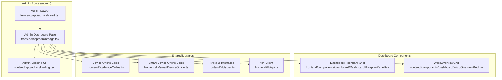
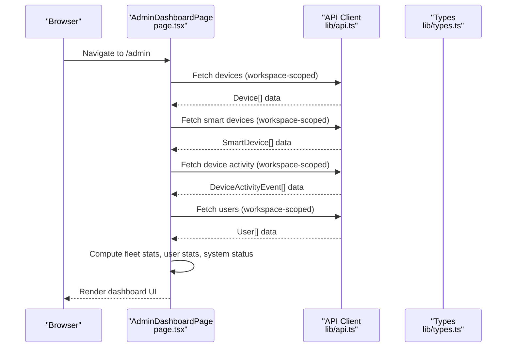
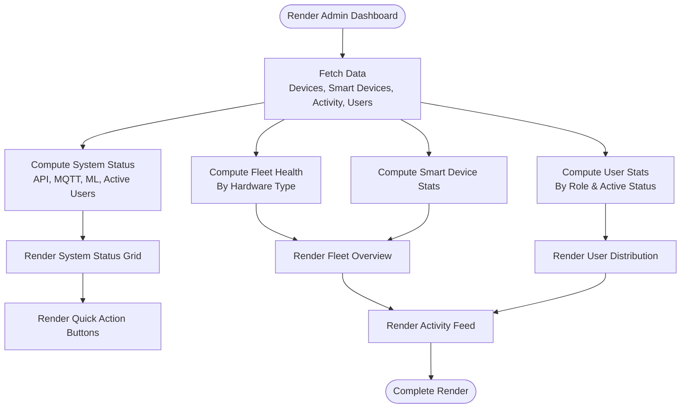
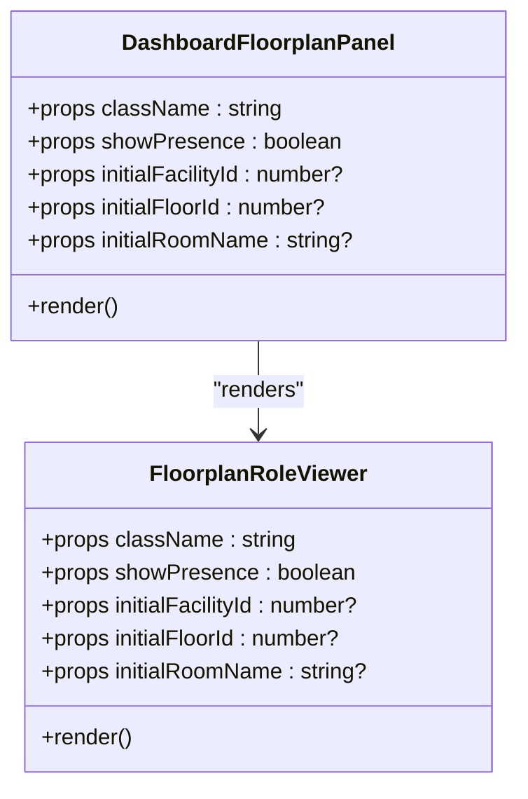
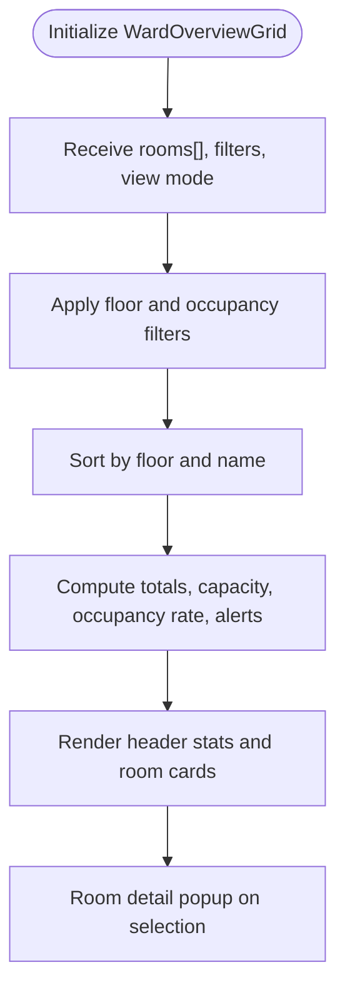
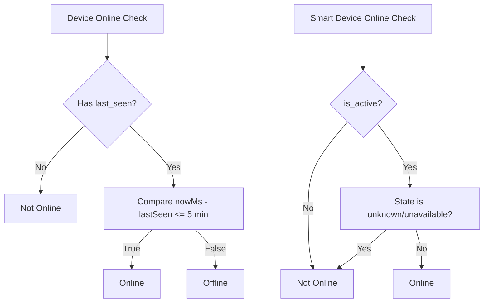
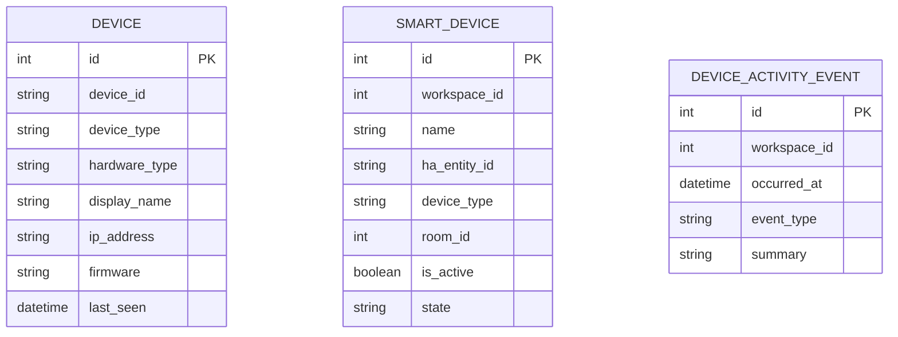
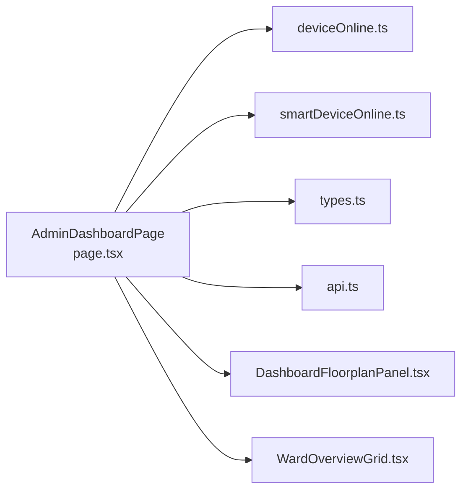

# Admin Dashboard Overview

<cite>
**Referenced Files in This Document**
- [frontend/app/admin/page.tsx](file://frontend/app/admin/page.tsx)
- [frontend/app/admin/layout.tsx](file://frontend/app/admin/layout.tsx)
- [frontend/app/admin/loading.tsx](file://frontend/app/admin/loading.tsx)
- [frontend/components/dashboard/DashboardFloorplanPanel.tsx](file://frontend/components/dashboard/DashboardFloorplanPanel.tsx)
- [frontend/components/dashboard/WardOverviewGrid.tsx](file://frontend/components/dashboard/WardOverviewGrid.tsx)
- [frontend/lib/deviceOnline.ts](file://frontend/lib/deviceOnline.ts)
- [frontend/lib/smartDeviceOnline.ts](file://frontend/lib/smartDeviceOnline.ts)
- [frontend/lib/types.ts](file://frontend/lib/types.ts)
- [frontend/lib/api.ts](file://frontend/lib/api.ts)
</cite>

## Table of Contents
1. [Introduction](#introduction)
2. [Project Structure](#project-structure)
3. [Core Components](#core-components)
4. [Architecture Overview](#architecture-overview)
5. [Detailed Component Analysis](#detailed-component-analysis)
6. [Dependency Analysis](#dependency-analysis)
7. [Performance Considerations](#performance-considerations)
8. [Troubleshooting Guide](#troubleshooting-guide)
9. [Conclusion](#conclusion)

## Introduction
This document describes the Admin Dashboard overview interface in the WheelSense Platform. It provides system-wide visibility and control for administrators, featuring real-time monitoring, fleet health metrics, user statistics, recent activity, and quick navigation to administrative functions. The dashboard consolidates operational insights at a glance, enabling rapid assessment of system health and immediate access to key administrative tools.

## Project Structure
The Admin Dashboard is implemented as a Next.js client-side page under the admin route (`/admin`). It integrates reusable dashboard components and leverages shared libraries for device status logic and API access. The layout wraps the page content with role-specific shell behavior.

**Diagram sources**
- [frontend/app/admin/layout.tsx:1-12](file://frontend/app/admin/layout.tsx#L1-L12)
- [frontend/app/admin/page.tsx:1-488](file://frontend/app/admin/page.tsx#L1-L488)
- [frontend/app/admin/loading.tsx:1-18](file://frontend/app/admin/loading.tsx#L1-L18)
- [frontend/components/dashboard/DashboardFloorplanPanel.tsx:1-30](file://frontend/components/dashboard/DashboardFloorplanPanel.tsx#L1-L30)
- [frontend/components/dashboard/WardOverviewGrid.tsx:1-269](file://frontend/components/dashboard/WardOverviewGrid.tsx#L1-L269)
- [frontend/lib/deviceOnline.ts:1-8](file://frontend/lib/deviceOnline.ts#L1-L8)
- [frontend/lib/smartDeviceOnline.ts:1-11](file://frontend/lib/smartDeviceOnline.ts#L1-L11)
- [frontend/lib/types.ts:1-482](file://frontend/lib/types.ts#L1-L482)
- [frontend/lib/api.ts:1-800](file://frontend/lib/api.ts#L1-L800)

**Section sources**
- [frontend/app/admin/layout.tsx:1-12](file://frontend/app/admin/layout.tsx#L1-L12)
- [frontend/app/admin/page.tsx:1-488](file://frontend/app/admin/page.tsx#L1-L488)
- [frontend/app/admin/loading.tsx:1-18](file://frontend/app/admin/loading.tsx#L1-L18)

## Core Components
The Admin Dashboard page orchestrates multiple data sources and UI sections:

- Real-time system status indicators (API, MQTT, ML pipeline, active users)
- Device fleet health by hardware type and smart device integration statistics
- User distribution and account activity
- Recent activity feed with categorized events
- Quick action buttons for navigation to monitoring, devices, settings, and device health
- Floorplan panel for live presence visualization

Key implementation highlights:
- Uses React Query to fetch devices, smart devices, activity, and users with workspace-scoped endpoints
- Computes fleet health and user stats client-side
- Determines MQTT health based on device fleet presence and recent activity
- Renders a floorplan panel for live ward overview

**Section sources**
- [frontend/app/admin/page.tsx:46-208](file://frontend/app/admin/page.tsx#L46-L208)
- [frontend/app/admin/page.tsx:218-488](file://frontend/app/admin/page.tsx#L218-L488)

## Architecture Overview
The dashboard follows a client-side rendering pattern with data fetching via a typed API client. It composes reusable dashboard components and applies role-aware routing through the admin layout.

**Diagram sources**
- [frontend/app/admin/page.tsx:69-95](file://frontend/app/admin/page.tsx#L69-L95)
- [frontend/lib/api.ts:577-589](file://frontend/lib/api.ts#L577-L589)
- [frontend/lib/types.ts:92-137](file://frontend/lib/types.ts#L92-L137)

## Detailed Component Analysis

### Admin Dashboard Page
The main dashboard page coordinates data fetching, computation, and rendering of all dashboard sections. It defines:
- Workspace-scoped endpoints for devices, smart devices, activity, and users
- Fleet health breakdown by hardware type and smart device online status
- User statistics by role and account status
- System status indicators (API, MQTT, ML pipeline, active users)
- Recent activity feed with event-type-specific icons
- Quick navigation buttons to monitoring, devices, settings, and device health

**Diagram sources**
- [frontend/app/admin/page.tsx:69-163](file://frontend/app/admin/page.tsx#L69-L163)
- [frontend/app/admin/page.tsx:218-488](file://frontend/app/admin/page.tsx#L218-L488)

**Section sources**
- [frontend/app/admin/page.tsx:46-208](file://frontend/app/admin/page.tsx#L46-L208)
- [frontend/app/admin/page.tsx:218-488](file://frontend/app/admin/page.tsx#L218-L488)

### DashboardFloorplanPanel
A lightweight wrapper around the floorplan role viewer, enabling live presence visualization on the dashboard. It accepts optional initial facility, floor, and room parameters.

**Diagram sources**
- [frontend/components/dashboard/DashboardFloorplanPanel.tsx:5-29](file://frontend/components/dashboard/DashboardFloorplanPanel.tsx#L5-L29)

**Section sources**
- [frontend/components/dashboard/DashboardFloorplanPanel.tsx:1-30](file://frontend/components/dashboard/DashboardFloorplanPanel.tsx#L1-L30)

### WardOverviewGrid
Provides a filtered, sortable grid of rooms with occupancy and alert summaries, supporting grid and compact views, floor filtering, and occupancy filters. It calculates derived statistics such as occupancy rate and total alerts.

**Diagram sources**
- [frontend/components/dashboard/WardOverviewGrid.tsx:58-112](file://frontend/components/dashboard/WardOverviewGrid.tsx#L58-L112)
- [frontend/components/dashboard/WardOverviewGrid.tsx:155-266](file://frontend/components/dashboard/WardOverviewGrid.tsx#L155-L266)

**Section sources**
- [frontend/components/dashboard/WardOverviewGrid.tsx:1-269](file://frontend/components/dashboard/WardOverviewGrid.tsx#L1-L269)

### Device and Smart Device Online Logic
- Device online detection uses a fixed window to determine whether a device is considered online based on its last-seen timestamp.
- Smart device online detection checks activation status and state validity against Home Assistant mappings.

**Diagram sources**
- [frontend/lib/deviceOnline.ts:1-8](file://frontend/lib/deviceOnline.ts#L1-L8)
- [frontend/lib/smartDeviceOnline.ts:1-11](file://frontend/lib/smartDeviceOnline.ts#L1-L11)

**Section sources**
- [frontend/lib/deviceOnline.ts:1-8](file://frontend/lib/deviceOnline.ts#L1-L8)
- [frontend/lib/smartDeviceOnline.ts:1-11](file://frontend/lib/smartDeviceOnline.ts#L1-L11)

### Data Types and API Contracts
The dashboard relies on strongly typed interfaces for devices, smart devices, and activity events. The API client exposes typed methods for fetching lists and details.

**Diagram sources**
- [frontend/lib/types.ts:100-137](file://frontend/lib/types.ts#L100-L137)

**Section sources**
- [frontend/lib/types.ts:92-137](file://frontend/lib/types.ts#L92-L137)
- [frontend/lib/api.ts:577-589](file://frontend/lib/api.ts#L577-L589)

## Dependency Analysis
The Admin Dashboard page depends on:
- Shared device and smart device online utilities
- Typed data models for devices, smart devices, and activity events
- A typed API client for workspace-scoped endpoints
- Reusable dashboard components for floorplan and ward overview

**Diagram sources**
- [frontend/app/admin/page.tsx:12-17](file://frontend/app/admin/page.tsx#L12-L17)
- [frontend/lib/deviceOnline.ts:1-8](file://frontend/lib/deviceOnline.ts#L1-L8)
- [frontend/lib/smartDeviceOnline.ts:1-11](file://frontend/lib/smartDeviceOnline.ts#L1-L11)
- [frontend/lib/types.ts:92-137](file://frontend/lib/types.ts#L92-L137)
- [frontend/lib/api.ts:577-589](file://frontend/lib/api.ts#L577-L589)
- [frontend/components/dashboard/DashboardFloorplanPanel.tsx:1-30](file://frontend/components/dashboard/DashboardFloorplanPanel.tsx#L1-L30)
- [frontend/components/dashboard/WardOverviewGrid.tsx:1-269](file://frontend/components/dashboard/WardOverviewGrid.tsx#L1-L269)

**Section sources**
- [frontend/app/admin/page.tsx:12-17](file://frontend/app/admin/page.tsx#L12-L17)
- [frontend/lib/deviceOnline.ts:1-8](file://frontend/lib/deviceOnline.ts#L1-L8)
- [frontend/lib/smartDeviceOnline.ts:1-11](file://frontend/lib/smartDeviceOnline.ts#L1-L11)
- [frontend/lib/types.ts:92-137](file://frontend/lib/types.ts#L92-L137)
- [frontend/lib/api.ts:577-589](file://frontend/lib/api.ts#L577-L589)
- [frontend/components/dashboard/DashboardFloorplanPanel.tsx:1-30](file://frontend/components/dashboard/DashboardFloorplanPanel.tsx#L1-L30)
- [frontend/components/dashboard/WardOverviewGrid.tsx:1-269](file://frontend/components/dashboard/WardOverviewGrid.tsx#L1-L269)

## Performance Considerations
- Polling and stale times: Device and smart device queries use workspace-scoped endpoints with polling intervals configured via helper utilities. Activity and user queries use shorter stale times to keep data fresh without excessive polling.
- Computation offloading: Fleet health and user statistics are computed client-side using memoized computations to avoid unnecessary re-renders.
- Conditional fetching: Queries are enabled only when workspace context is available, preventing redundant network calls during navigation.
- Component composition: Dashboard components encapsulate their own logic and rendering, keeping the main page focused on orchestration.

**Section sources**
- [frontend/app/admin/page.tsx:69-95](file://frontend/app/admin/page.tsx#L69-L95)

## Troubleshooting Guide
Common issues and resolutions:
- Unauthorized access: If API requests fail with unauthorized responses, the API client redirects to the login page. Verify authentication state and session validity.
- Timeout errors: Requests are bounded by a default timeout. If endpoints are slow, consider adjusting polling intervals or caching strategies.
- Missing data: Ensure workspace context is present before enabling queries. Absent workspace IDs prevent device and user queries from firing.
- MQTT status confusion: MQTT is considered healthy if there is a device fleet or recent activity within the online window. If both are absent, the status may show warning.

**Section sources**
- [frontend/lib/api.ts:209-297](file://frontend/lib/api.ts#L209-L297)
- [frontend/app/admin/page.tsx:142-163](file://frontend/app/admin/page.tsx#L142-L163)

## Conclusion
The Admin Dashboard provides a comprehensive, real-time overview of the WheelSense Platform’s operational state. Administrators can quickly assess system health, monitor device and smart device fleets, review user statistics, and stay informed about recent activity. The modular design and typed APIs enable maintainability and scalability while ensuring a responsive user experience.