# Admin Dashboard

<cite>
**Referenced Files in This Document**
- [frontend/app/admin/layout.tsx](file://frontend/app/admin/layout.tsx)
- [frontend/app/admin/page.tsx](file://frontend/app/admin/page.tsx)
- [frontend/components/admin/FacilitiesPanel.tsx](file://frontend/components/admin/FacilitiesPanel.tsx)
- [frontend/components/admin/FloorplansPanel.tsx](file://frontend/components/admin/FloorplansPanel.tsx)
- [frontend/components/admin/RoomFormModal.tsx](file://frontend/components/admin/RoomFormModal.tsx)
- [frontend/components/admin/SupportTicketList.tsx](file://frontend/components/admin/SupportTicketList.tsx)
- [frontend/app/admin/account-management/page.tsx](file://frontend/app/admin/account-management/page.tsx)
- [frontend/app/admin/devices/page.tsx](file://frontend/app/admin/devices/page.tsx)
- [frontend/app/admin/patients/page.tsx](file://frontend/app/admin/patients/page.tsx)
- [frontend/app/admin/personnel/page.tsx](file://frontend/app/admin/personnel/page.tsx)
</cite>

## Table of Contents
1. [Introduction](#introduction)
2. [Project Structure](#project-structure)
3. [Core Components](#core-components)
4. [Architecture Overview](#architecture-overview)
5. [Detailed Component Analysis](#detailed-component-analysis)
6. [Dependency Analysis](#dependency-analysis)
7. [Performance Considerations](#performance-considerations)
8. [Troubleshooting Guide](#troubleshooting-guide)
9. [Conclusion](#conclusion)
10. [Appendices](#appendices)

## Introduction
This document describes the Admin Dashboard interface in the WheelSense Platform. It covers the administrative control panel’s comprehensive capabilities, including account management, device fleet oversight, facility administration, patient registry management, personnel coordination, and system settings. It also documents admin-only navigation patterns, data management interfaces, and workspace administration features such as facilities and floorplans panels, room creation/editing modals, and support ticket management. Finally, it outlines practical admin workflows for onboarding users, managing device fleets, configuring facilities, and handling system maintenance tasks.

## Project Structure
The Admin Dashboard is implemented under the frontend application routing for the /admin path. It leverages shared admin components and integrates with the backend API for data retrieval and mutations. The admin shell enforces role-based access and provides a unified navigation surface for administrators.

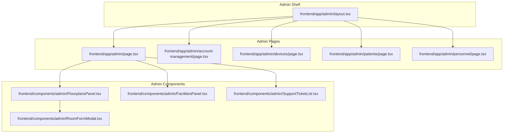

**Diagram sources**
- [frontend/app/admin/layout.tsx:1-12](file://frontend/app/admin/layout.tsx#L1-L12)
- [frontend/app/admin/page.tsx:1-488](file://frontend/app/admin/page.tsx#L1-L488)
- [frontend/components/admin/FloorplansPanel.tsx:1-800](file://frontend/components/admin/FloorplansPanel.tsx#L1-L800)
- [frontend/components/admin/FacilitiesPanel.tsx:1-228](file://frontend/components/admin/FacilitiesPanel.tsx#L1-L228)
- [frontend/components/admin/RoomFormModal.tsx:1-608](file://frontend/components/admin/RoomFormModal.tsx#L1-L608)
- [frontend/components/admin/SupportTicketList.tsx:1-331](file://frontend/components/admin/SupportTicketList.tsx#L1-L331)

**Section sources**
- [frontend/app/admin/layout.tsx:1-12](file://frontend/app/admin/layout.tsx#L1-L12)

## Core Components
- Admin Dashboard overview page: Provides system status, device fleet health, user distribution, recent activity, and quick actions.
- Facilities Panel: Lists, creates, edits, and deletes facilities; supports search and real-time refresh.
- Floorplans Panel: Manages facilities/floors, loads floor layouts, assigns rooms to nodes and smart devices, captures camera snapshots, and handles patient-room assignments.
- Room Form Modal: Creates or edits rooms with facility/floor selection, room type presets, and optional node device linkage.
- Support Ticket List: Renders a paginated, filterable, sortable table of support tickets with read/unread indicators and status badges.

**Section sources**
- [frontend/app/admin/page.tsx:46-488](file://frontend/app/admin/page.tsx#L46-L488)
- [frontend/components/admin/FacilitiesPanel.tsx:25-228](file://frontend/components/admin/FacilitiesPanel.tsx#L25-L228)
- [frontend/components/admin/FloorplansPanel.tsx:86-775](file://frontend/components/admin/FloorplansPanel.tsx#L86-L775)
- [frontend/components/admin/RoomFormModal.tsx:51-608](file://frontend/components/admin/RoomFormModal.tsx#L51-L608)
- [frontend/components/admin/SupportTicketList.tsx:59-331](file://frontend/components/admin/SupportTicketList.tsx#L59-L331)

## Architecture Overview
The Admin Dashboard is a client-driven React application integrated with a typed API layer. It uses TanStack Query for caching, polling, and optimistic updates. Admin pages orchestrate multiple queries for devices, users, facilities, rooms, and smart devices. Shared admin components encapsulate complex UI logic (e.g., floorplan editing, room creation) and coordinate with backend endpoints.

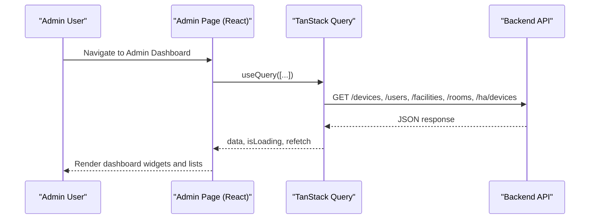

**Diagram sources**
- [frontend/app/admin/page.tsx:69-95](file://frontend/app/admin/page.tsx#L69-L95)
- [frontend/app/admin/devices/page.tsx:87-100](file://frontend/app/admin/devices/page.tsx#L87-L100)
- [frontend/app/admin/patients/page.tsx:135-148](file://frontend/app/admin/patients/page.tsx#L135-L148)

## Detailed Component Analysis

### Facilities Panel
Manages facilities with create/update/delete operations, search, and real-time refresh. It fetches facilities via a dedicated endpoint, supports inline editing, and triggers refetch callbacks on changes.

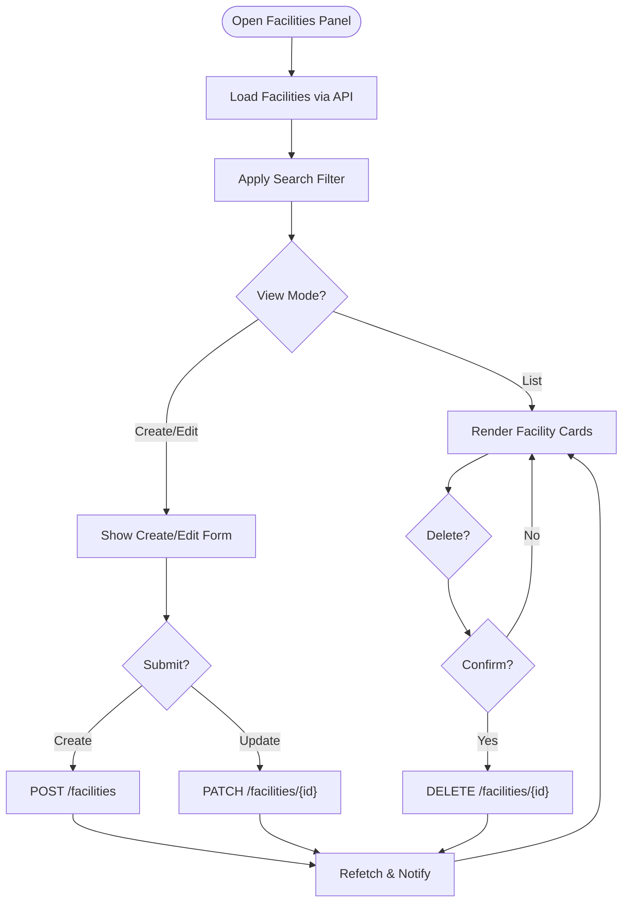

**Diagram sources**
- [frontend/components/admin/FacilitiesPanel.tsx:27-107](file://frontend/components/admin/FacilitiesPanel.tsx#L27-L107)

**Section sources**
- [frontend/components/admin/FacilitiesPanel.tsx:25-228](file://frontend/components/admin/FacilitiesPanel.tsx#L25-L228)

### Floorplans Panel
Provides a comprehensive floorplan editor with facility and floor scoping, room node assignment, smart device linking, patient-room assignment, and camera snapshot capture. It merges layout shapes with existing rooms, provisions unmapped nodes, and normalizes room IDs.

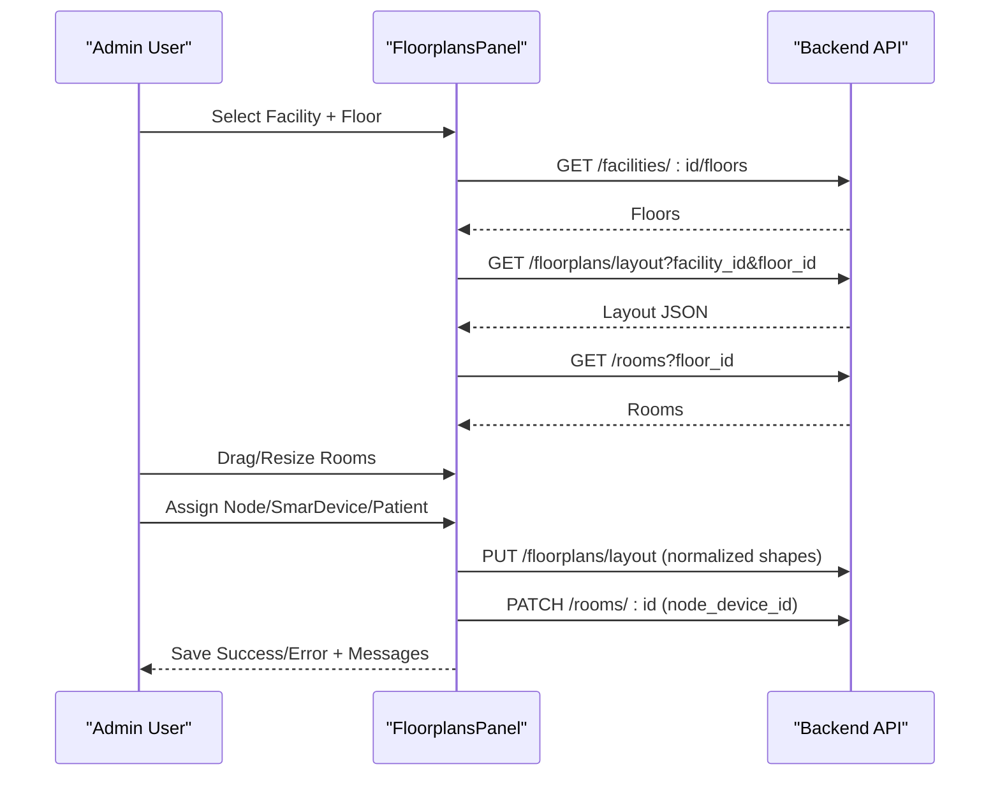

**Diagram sources**
- [frontend/components/admin/FloorplansPanel.tsx:100-153](file://frontend/components/admin/FloorplansPanel.tsx#L100-L153)
- [frontend/components/admin/FloorplansPanel.tsx:469-555](file://frontend/components/admin/FloorplansPanel.tsx#L469-L555)

**Section sources**
- [frontend/components/admin/FloorplansPanel.tsx:86-775](file://frontend/components/admin/FloorplansPanel.tsx#L86-L775)

### Room Form Modal
Allows creating or editing rooms with facility/floor selection, room type presets, and optional node device linkage. It validates inputs and persists changes via POST or PATCH.

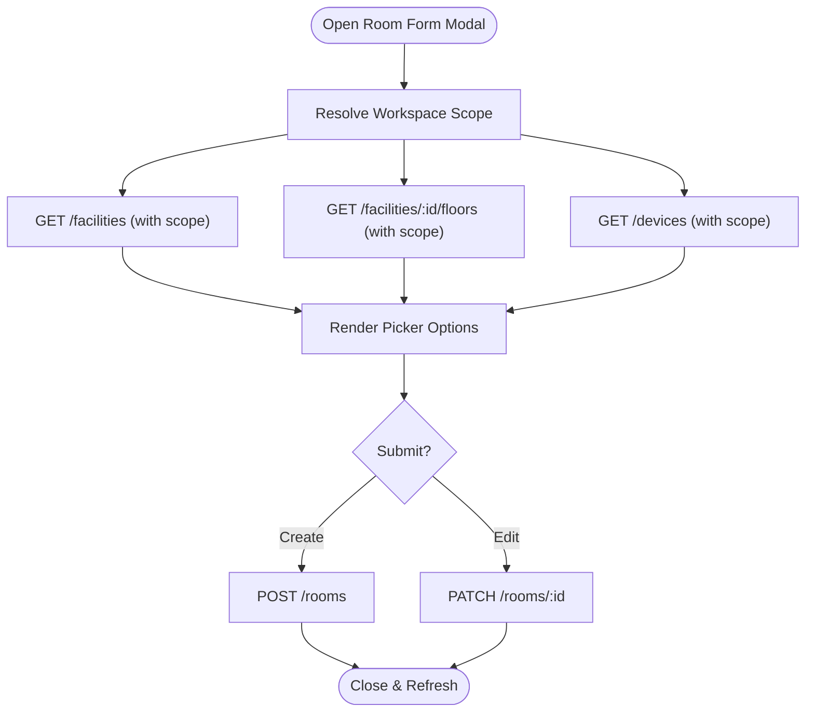

**Diagram sources**
- [frontend/components/admin/RoomFormModal.tsx:93-129](file://frontend/components/admin/RoomFormModal.tsx#L93-L129)
- [frontend/components/admin/RoomFormModal.tsx:291-342](file://frontend/components/admin/RoomFormModal.tsx#L291-L342)

**Section sources**
- [frontend/components/admin/RoomFormModal.tsx:51-608](file://frontend/components/admin/RoomFormModal.tsx#L51-L608)

### Support Ticket List
Displays a paginated, filterable, and sortable table of support tickets with status and priority badges, and a click handler for opening ticket details.

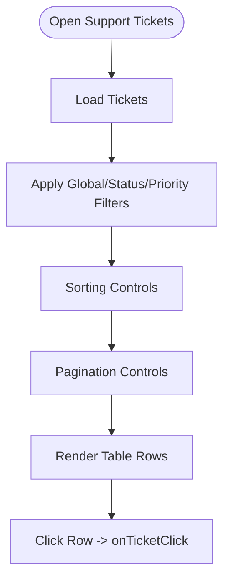

**Diagram sources**
- [frontend/components/admin/SupportTicketList.tsx:59-207](file://frontend/components/admin/SupportTicketList.tsx#L59-L207)

**Section sources**
- [frontend/components/admin/SupportTicketList.tsx:59-331](file://frontend/components/admin/SupportTicketList.tsx#L59-L331)

### Admin Dashboard Overview
The dashboard aggregates system health, device fleet statistics, user metrics, recent activity, and quick links to monitoring, devices, settings, and device health.

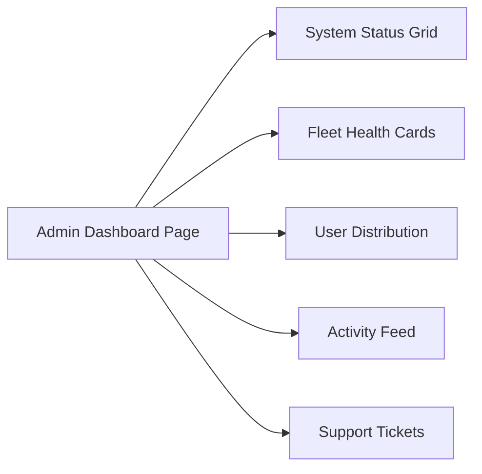

**Diagram sources**
- [frontend/app/admin/page.tsx:46-488](file://frontend/app/admin/page.tsx#L46-L488)

**Section sources**
- [frontend/app/admin/page.tsx:46-488](file://frontend/app/admin/page.tsx#L46-L488)

### Account Management
Enables creating and editing user accounts, filtering by kind (staff/patient) and role, searching by username or linked identities, and soft-deactivating accounts. It integrates with caregivers and patients lists.

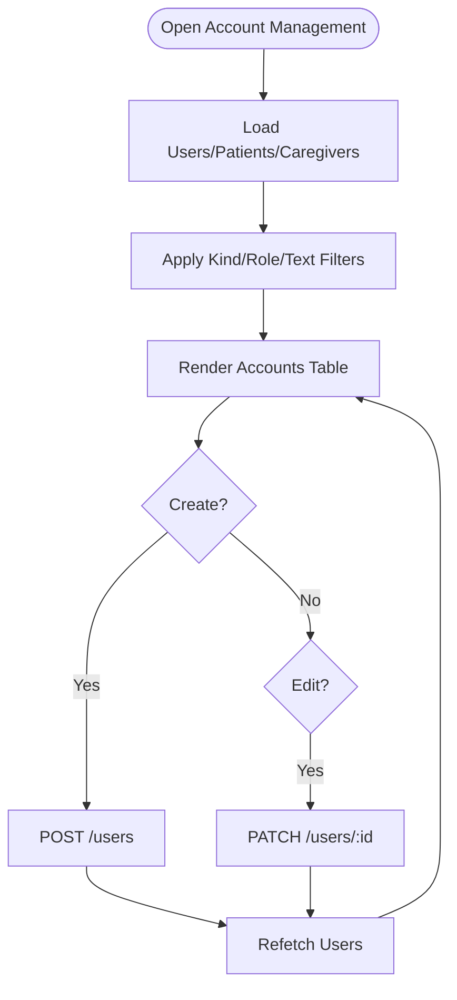

**Diagram sources**
- [frontend/app/admin/account-management/page.tsx:76-88](file://frontend/app/admin/account-management/page.tsx#L76-L88)
- [frontend/app/admin/account-management/page.tsx:302-339](file://frontend/app/admin/account-management/page.tsx#L302-L339)

**Section sources**
- [frontend/app/admin/account-management/page.tsx:68-838](file://frontend/app/admin/account-management/page.tsx#L68-L838)

### Device Fleet Management
Provides device fleet views by hardware type, online/offline statistics, and a drawer for detailed device inspection. Supports tab switching and search.

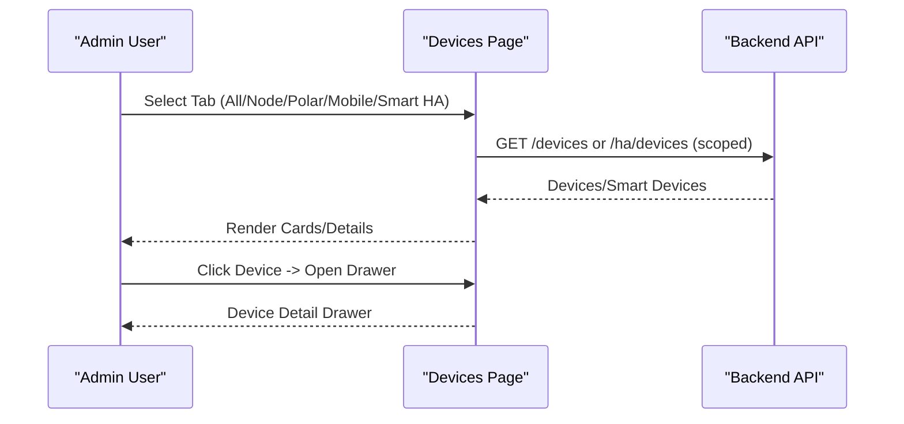

**Diagram sources**
- [frontend/app/admin/devices/page.tsx:54-100](file://frontend/app/admin/devices/page.tsx#L54-L100)
- [frontend/app/admin/devices/page.tsx:334-341](file://frontend/app/admin/devices/page.tsx#L334-L341)

**Section sources**
- [frontend/app/admin/devices/page.tsx:54-383](file://frontend/app/admin/devices/page.tsx#L54-L383)

### Patient Registry Management
Manages the patient roster, quick filters (all/critical/unassigned/recent), search, and tabs for patients and routines. Includes a delete confirmation flow.

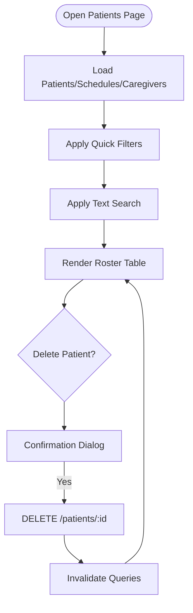

**Diagram sources**
- [frontend/app/admin/patients/page.tsx:135-148](file://frontend/app/admin/patients/page.tsx#L135-L148)
- [frontend/app/admin/patients/page.tsx:126-132](file://frontend/app/admin/patients/page.tsx#L126-L132)

**Section sources**
- [frontend/app/admin/patients/page.tsx:116-743](file://frontend/app/admin/patients/page.tsx#L116-L743)

### Personnel Coordination
Coordinates staff, patients, and accounts in a unified view with role-based filtering, status filtering, and search. Supports provisioning new staff and patients with optional account creation.

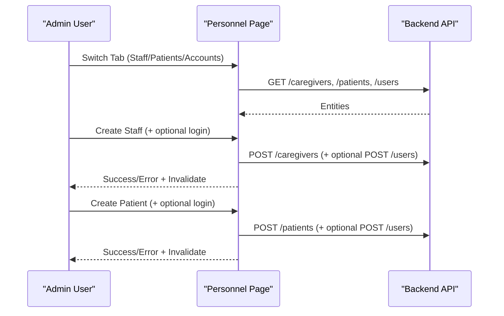

**Diagram sources**
- [frontend/app/admin/personnel/page.tsx:121-136](file://frontend/app/admin/personnel/page.tsx#L121-L136)
- [frontend/app/admin/personnel/page.tsx:192-256](file://frontend/app/admin/personnel/page.tsx#L192-L256)
- [frontend/app/admin/personnel/page.tsx:258-327](file://frontend/app/admin/personnel/page.tsx#L258-L327)

**Section sources**
- [frontend/app/admin/personnel/page.tsx:70-916](file://frontend/app/admin/personnel/page.tsx#L70-L916)

## Dependency Analysis
- Admin shell enforces role-based access and wraps child pages.
- Dashboard orchestrates multiple queries for devices, users, activities, and smart devices.
- Facilities/Floorplans/Room Form components depend on shared APIs for facilities, floors, rooms, devices, and smart devices.
- Support Ticket List depends on table utilities and i18n for rendering.
- Account Management coordinates users, caregivers, and patients.
- Device Management depends on device hardware tabs and online status helpers.
- Personnel Management coordinates caregivers, patients, and users with capability checks.

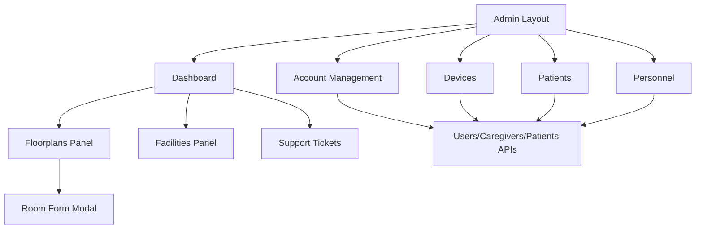

**Diagram sources**
- [frontend/app/admin/layout.tsx:1-12](file://frontend/app/admin/layout.tsx#L1-L12)
- [frontend/app/admin/page.tsx:46-488](file://frontend/app/admin/page.tsx#L46-L488)
- [frontend/components/admin/FloorplansPanel.tsx:86-775](file://frontend/components/admin/FloorplansPanel.tsx#L86-L775)
- [frontend/components/admin/FacilitiesPanel.tsx:25-228](file://frontend/components/admin/FacilitiesPanel.tsx#L25-L228)
- [frontend/components/admin/SupportTicketList.tsx:59-331](file://frontend/components/admin/SupportTicketList.tsx#L59-L331)
- [frontend/app/admin/account-management/page.tsx:68-838](file://frontend/app/admin/account-management/page.tsx#L68-L838)
- [frontend/app/admin/devices/page.tsx:54-383](file://frontend/app/admin/devices/page.tsx#L54-L383)
- [frontend/app/admin/patients/page.tsx:116-743](file://frontend/app/admin/patients/page.tsx#L116-L743)
- [frontend/app/admin/personnel/page.tsx:70-916](file://frontend/app/admin/personnel/page.tsx#L70-L916)

**Section sources**
- [frontend/app/admin/layout.tsx:1-12](file://frontend/app/admin/layout.tsx#L1-L12)
- [frontend/app/admin/page.tsx:46-488](file://frontend/app/admin/page.tsx#L46-L488)

## Performance Considerations
- Polling and stale times are configured per endpoint to balance freshness and bandwidth.
- Device online status is computed client-side using timestamps to avoid frequent network requests.
- Large lists (patients, caregivers, users) are fetched with limits and filtered client-side for responsiveness.
- TanStack Query refetch orchestration ensures minimal re-renders after mutations.

[No sources needed since this section provides general guidance]

## Troubleshooting Guide
- Facilities Panel: Errors during save/delete are surfaced as user-facing messages; confirm dialogs precede destructive actions.
- Floorplans Panel: Saving merges layout shapes with DB rooms, provisions unmapped nodes, and normalizes IDs; partial failures are reported with messages.
- Room Form Modal: Validation prevents empty names; device pools are filtered by hardware type; errors are shown with localized messages.
- Support Ticket List: Filtering and pagination are handled client-side; empty states render helpful guidance.
- Account Management: Soft-delete deactivates accounts and removes identity links; creation requires minimum credentials for logins.
- Device Management: Tab switching and search reduce render overhead; drawer opens only for registry devices.
- Personnel Management: Capability checks gate provisioning; batch invalidation refreshes related lists after mutations.

**Section sources**
- [frontend/components/admin/FacilitiesPanel.tsx:97-107](file://frontend/components/admin/FacilitiesPanel.tsx#L97-L107)
- [frontend/components/admin/FloorplansPanel.tsx:469-555](file://frontend/components/admin/FloorplansPanel.tsx#L469-L555)
- [frontend/components/admin/RoomFormModal.tsx:291-342](file://frontend/components/admin/RoomFormModal.tsx#L291-L342)
- [frontend/components/admin/SupportTicketList.tsx:173-187](file://frontend/components/admin/SupportTicketList.tsx#L173-L187)
- [frontend/app/admin/account-management/page.tsx:325-339](file://frontend/app/admin/account-management/page.tsx#L325-L339)
- [frontend/app/admin/devices/page.tsx:132-137](file://frontend/app/admin/devices/page.tsx#L132-L137)
- [frontend/app/admin/personnel/page.tsx:192-256](file://frontend/app/admin/personnel/page.tsx#L192-L256)

## Conclusion
The Admin Dashboard consolidates operational oversight and administrative controls into a cohesive interface. It leverages shared components for facilities and floorplans, robust data management for accounts and devices, and intuitive workflows for personnel and patient coordination. The modular design and strong separation of concerns enable maintainability and scalability across roles and domains.

[No sources needed since this section summarizes without analyzing specific files]

## Appendices

### Admin Navigation Patterns
- Use the admin shell to navigate across dashboards, device management, facilities, patients, personnel, and settings.
- Quick action buttons on the dashboard open monitoring, device health, and settings directly.

**Section sources**
- [frontend/app/admin/page.tsx:192-206](file://frontend/app/admin/page.tsx#L192-L206)

### Admin Workflows Examples
- Onboard a new user:
  - Navigate to Account Management, fill the create form, optionally link to a staff or patient record, and submit.
  - Alternatively, use Personnel to create a staff or patient and optionally provision a login.
- Manage device fleets:
  - Use Devices page to filter by hardware type, search by device identifiers, and inspect details via the drawer.
- Configure facilities:
  - Use Facilities Panel to add or edit buildings; Floorplans Panel to manage floors, rooms, and device/smart device assignments.
- Handle system maintenance:
  - Use the dashboard’s system status cards and activity feed to monitor health and recent events; open settings and device health pages for deeper diagnostics.

**Section sources**
- [frontend/app/admin/account-management/page.tsx:341-388](file://frontend/app/admin/account-management/page.tsx#L341-L388)
- [frontend/app/admin/personnel/page.tsx:192-327](file://frontend/app/admin/personnel/page.tsx#L192-L327)
- [frontend/app/admin/devices/page.tsx:54-100](file://frontend/app/admin/devices/page.tsx#L54-L100)
- [frontend/components/admin/FacilitiesPanel.tsx:49-95](file://frontend/components/admin/FacilitiesPanel.tsx#L49-L95)
- [frontend/components/admin/FloorplansPanel.tsx:469-555](file://frontend/components/admin/FloorplansPanel.tsx#L469-L555)