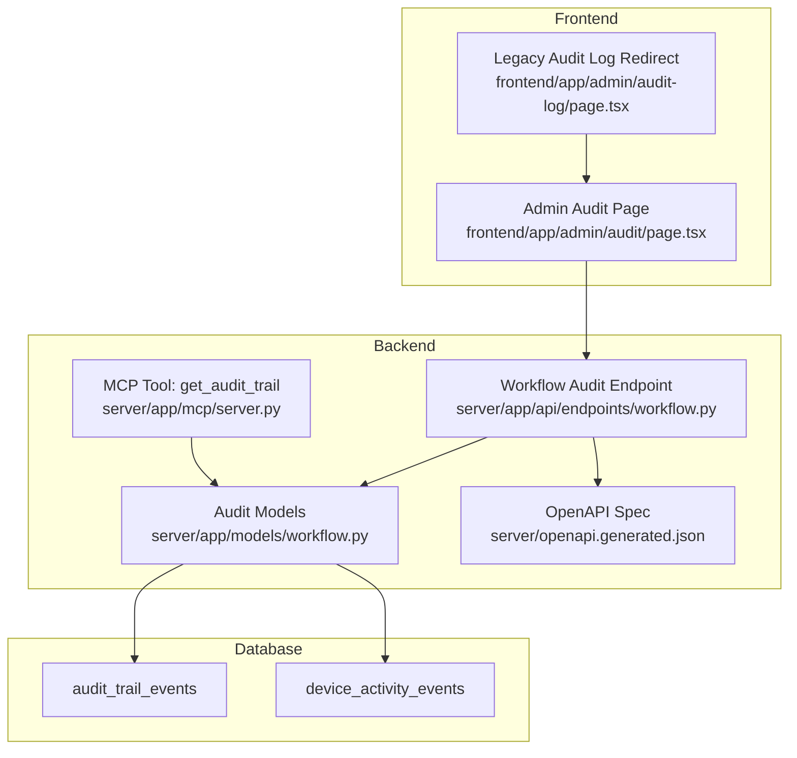
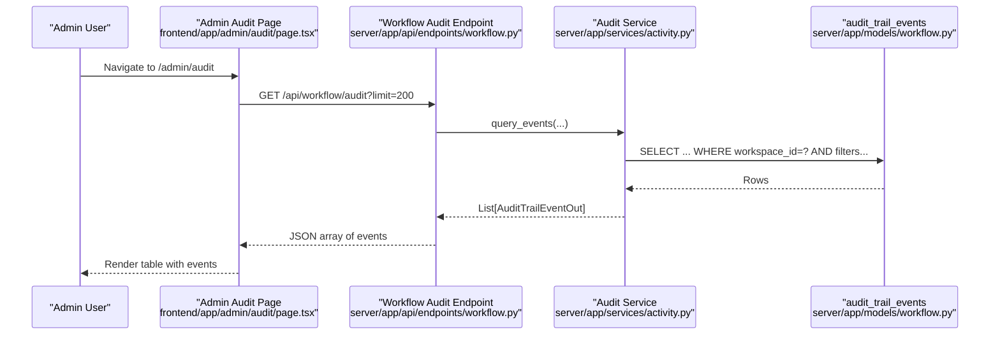
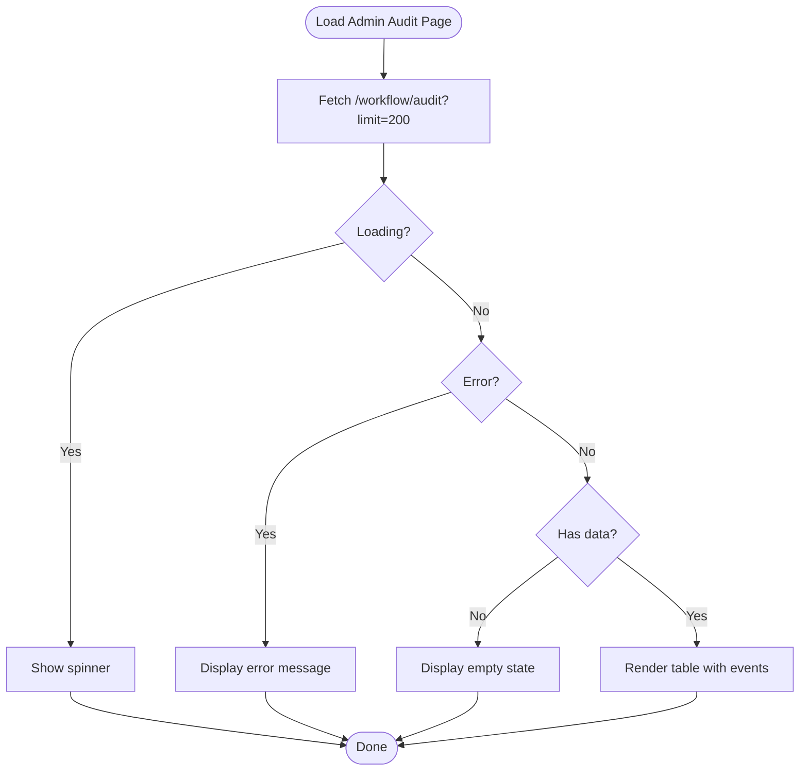
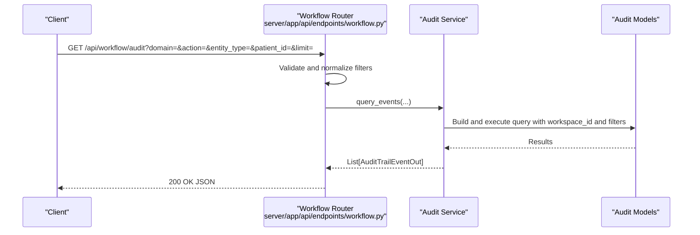
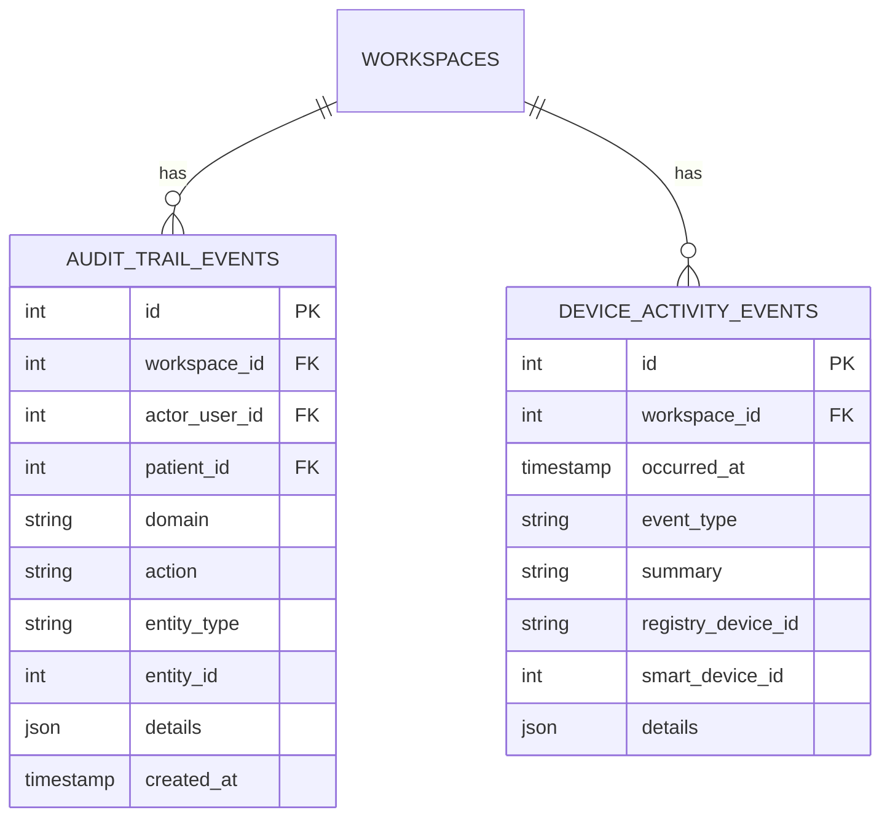
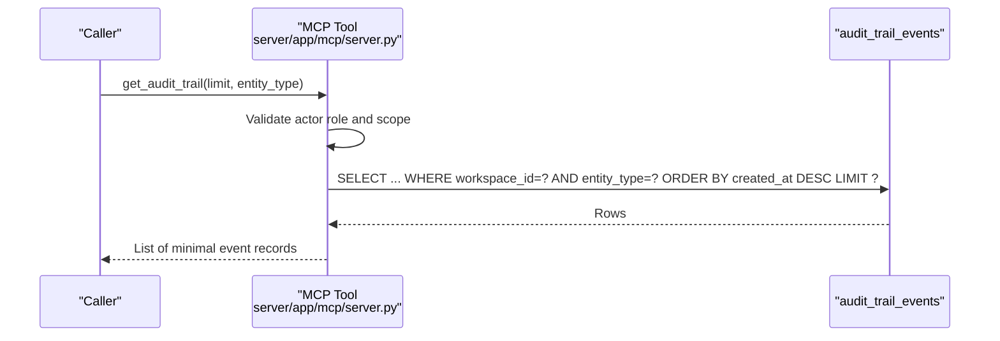
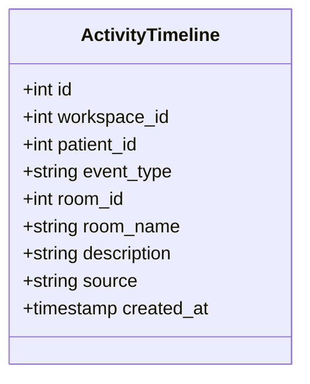
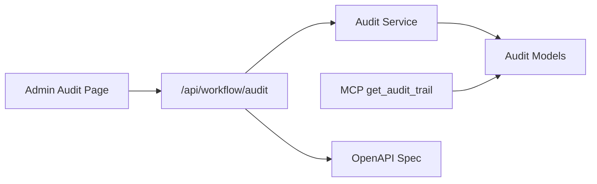

# Audit Trail & Compliance

<cite>
**Referenced Files in This Document**
- [page.tsx](file://frontend/app/admin/audit/page.tsx)
- [page.tsx](file://frontend/app/admin/audit-log/page.tsx)
- [workflow.py](file://server/app/api/endpoints/workflow.py)
- [server.py](file://server/app/mcp/server.py)
- [f1a2b3c4d5e6_add_device_activity_events.py](file://server/alembic/versions/f1a2b3c4d5e6_add_device_activity_events.py)
- [9a6b3f4d2c10_add_workflow_domain_tables.py](file://server/alembic/versions/9a6b3f4d2c10_add_workflow_domain_tables.py)
- [workflow.py](file://server/app/models/workflow.py)
- [openapi.generated.json](file://server/openapi.generated.json)
- [page.tsx](file://frontend/app/admin/audit/page.tsx)
- [page.tsx](file://frontend/app/admin/audit-log/page.tsx)
</cite>

## Table of Contents
1. [Introduction](#introduction)
2. [Project Structure](#project-structure)
3. [Core Components](#core-components)
4. [Architecture Overview](#architecture-overview)
5. [Detailed Component Analysis](#detailed-component-analysis)
6. [Dependency Analysis](#dependency-analysis)
7. [Performance Considerations](#performance-considerations)
8. [Troubleshooting Guide](#troubleshooting-guide)
9. [Conclusion](#conclusion)
10. [Appendices](#appendices)

## Introduction
This document describes the Audit Trail and Compliance functionality in the Admin Dashboard. It covers the audit log interface, activity tracking, compliance monitoring, regulatory reporting capabilities, filtering, and access control logging. It also explains the activity timeline implementation, event categorization, and outlines data retention and security monitoring features. Finally, it provides example admin workflows for reviewing system activities, generating compliance reports, investigating security incidents, and maintaining regulatory compliance documentation.

## Project Structure
The Audit Trail feature spans the frontend and backend:

- Frontend Admin Audit Page renders a paginated, filterable audit log grid.
- Backend exposes a REST endpoint to query audit trail events with domain/action/entity filters.
- Database models define audit trail and device activity event schemas.
- OpenAPI documents the endpoint contract and parameters.
- An MCP tool provides programmatic access to audit trail data for admin actors.

**Diagram sources**
- [page.tsx:1-85](file://frontend/app/admin/audit/page.tsx#L1-L85)
- [page.tsx:1-7](file://frontend/app/admin/audit-log/page.tsx#L1-L7)
- [workflow.py:521-544](file://server/app/api/endpoints/workflow.py#L521-L544)
- [server.py:1757-1769](file://server/app/mcp/server.py#L1757-L1769)
- [workflow.py:180-196](file://server/app/models/workflow.py#L180-L196)
- [openapi.generated.json:7662-7778](file://server/openapi.generated.json#L7662-L7778)

**Section sources**
- [page.tsx:1-85](file://frontend/app/admin/audit/page.tsx#L1-L85)
- [page.tsx:1-7](file://frontend/app/admin/audit-log/page.tsx#L1-L7)
- [workflow.py:521-544](file://server/app/api/endpoints/workflow.py#L521-L544)
- [server.py:1757-1769](file://server/app/mcp/server.py#L1757-L1769)
- [workflow.py:180-196](file://server/app/models/workflow.py#L180-L196)
- [openapi.generated.json:7662-7778](file://server/openapi.generated.json#L7662-L7778)

## Core Components
- Admin Audit Page (frontend): Fetches and displays recent audit events with pagination and basic filtering via URL query parameters. Renders a table with timestamp, domain, action, entity, and details.
- Workflow Audit Endpoint (backend): Provides a REST API to query audit trail events with optional filters for domain, action, entity_type, patient_id, and limit.
- Audit Models (database): Defines audit_trail_events and device_activity_events tables with indexed fields for efficient querying and compliance reporting.
- MCP Tool (backend): Exposes a read-only tool to fetch audit trail records for admin actors with entity-type scoping and limit controls.
- OpenAPI Contract: Documents the endpoint parameters, defaults, and response schema.

**Section sources**
- [page.tsx:18-24](file://frontend/app/admin/audit/page.tsx#L18-L24)
- [workflow.py:521-544](file://server/app/api/endpoints/workflow.py#L521-L544)
- [workflow.py:180-196](file://server/app/models/workflow.py#L180-L196)
- [server.py:1757-1769](file://server/app/mcp/server.py#L1757-L1769)
- [openapi.generated.json:7662-7778](file://server/openapi.generated.json#L7662-L7778)

## Architecture Overview
The audit trail architecture integrates frontend, backend, and database layers to support compliance and security monitoring.

**Diagram sources**
- [page.tsx:18-24](file://frontend/app/admin/audit/page.tsx#L18-L24)
- [workflow.py:521-544](file://server/app/api/endpoints/workflow.py#L521-L544)
- [workflow.py:180-196](file://server/app/models/workflow.py#L180-L196)

## Detailed Component Analysis

### Admin Audit Page (Frontend)
- Purpose: Display recent audit events in a responsive table with localized headers.
- Data fetching: Uses React Query to fetch up to 200 events from the workflow audit endpoint.
- Rendering: Shows time, domain, action, entity, and details; falls back to loading, error, or empty states.
- Filtering: Supports URL query parameters for domain, action, entity_type, patient_id, and limit.

**Diagram sources**
- [page.tsx:18-84](file://frontend/app/admin/audit/page.tsx#L18-L84)

**Section sources**
- [page.tsx:1-85](file://frontend/app/admin/audit/page.tsx#L1-L85)

### Workflow Audit Endpoint (Backend)
- Endpoint: GET /api/workflow/audit
- Filters:
  - domain: String or null
  - action: String or null
  - entity_type: String or null
  - patient_id: Integer or null
  - limit: Integer, min 1, max 500, default 100
- Access control: Requires ROLE_AUDIT_QUERY; if patient_id is provided, validates access to the patient record.
- Response: Array of AuditTrailEventOut objects.

**Diagram sources**
- [workflow.py:521-544](file://server/app/api/endpoints/workflow.py#L521-L544)
- [openapi.generated.json:7662-7778](file://server/openapi.generated.json#L7662-L7778)

**Section sources**
- [workflow.py:521-544](file://server/app/api/endpoints/workflow.py#L521-L544)
- [openapi.generated.json:7662-7778](file://server/openapi.generated.json#L7662-L7778)

### Audit Models (Database)
- audit_trail_events:
  - Keys: id, workspace_id, actor_user_id, patient_id, domain, action, entity_type, entity_id, details, created_at
  - Indexed for workspace/domain/timestamp and actor/patient/entity lookup
  - JSON/JSONB details field for structured event metadata
- device_activity_events:
  - Keys: id, workspace_id, occurred_at, event_type, summary, registry_device_id, smart_device_id, details
  - Indexed for workspace, occurred_at, event_type, registry_device_id, smart_device_id

**Diagram sources**
- [workflow.py:180-196](file://server/app/models/workflow.py#L180-L196)
- [f1a2b3c4d5e6_add_device_activity_events.py:26-38](file://server/alembic/versions/f1a2b3c4d5e6_add_device_activity_events.py#L26-L38)
- [9a6b3f4d2c10_add_workflow_domain_tables.py:180-191](file://server/alembic/versions/9a6b3f4d2c10_add_workflow_domain_tables.py#L180-L191)

**Section sources**
- [workflow.py:180-196](file://server/app/models/workflow.py#L180-L196)
- [f1a2b3c4d5e6_add_device_activity_events.py:21-78](file://server/alembic/versions/f1a2b3c4d5e6_add_device_activity_events.py#L21-L78)
- [9a6b3f4d2c10_add_workflow_domain_tables.py:180-200](file://server/alembic/versions/9a6b3f4d2c10_add_workflow_domain_tables.py#L180-L200)

### MCP Tool: get_audit_trail
- Purpose: Programmatic retrieval of audit trail events for admin actors.
- Parameters: limit (default 50), entity_type (optional)
- Access control: Requires role admin and scope audit.read; filters by workspace_id.
- Output: Minimalized event records suitable for compliance tooling.

**Diagram sources**
- [server.py:1757-1769](file://server/app/mcp/server.py#L1757-L1769)

**Section sources**
- [server.py:1757-1769](file://server/app/mcp/server.py#L1757-L1769)

### Activity Timeline Implementation
- Timeline events are modeled by ActivityTimeline entries with fields such as event_type, room_id, room_name, description, and source.
- These events support activity timelines and can be combined with audit trail events for comprehensive incident investigations.

**Diagram sources**
- [page.tsx:547-570](file://server/tests/test_models.py#L547-L570)

**Section sources**
- [page.tsx:547-570](file://server/tests/test_models.py#L547-L570)

### Compliance Monitoring and Regulatory Reporting
- Event categorization: domain, action, entity_type, entity_id enable categorization for compliance domains (e.g., directives, care plans).
- Access control logging: actor_user_id and patient_id enable attribution of actions to users and patients for audits.
- Filtering: domain, action, entity_type, patient_id, and limit support targeted compliance queries.
- Retention: Data retention policies can leverage indexed timestamps and workspace scoping for lifecycle management.

**Section sources**
- [workflow.py:180-196](file://server/app/models/workflow.py#L180-L196)
- [workflow.py:521-544](file://server/app/api/endpoints/workflow.py#L521-L544)
- [openapi.generated.json:7662-7778](file://server/openapi.generated.json#L7662-L7778)

## Dependency Analysis
- Frontend depends on the backend audit endpoint and OpenAPI spec for type safety.
- Backend endpoint depends on audit models and services for querying and access control.
- MCP tool depends on audit models and actor context for secure retrieval.
- Database migrations define the schema and indexes supporting audit queries.

**Diagram sources**
- [page.tsx:18-24](file://frontend/app/admin/audit/page.tsx#L18-L24)
- [workflow.py:521-544](file://server/app/api/endpoints/workflow.py#L521-L544)
- [server.py:1757-1769](file://server/app/mcp/server.py#L1757-L1769)
- [openapi.generated.json:7662-7778](file://server/openapi.generated.json#L7662-L7778)

**Section sources**
- [page.tsx:1-85](file://frontend/app/admin/audit/page.tsx#L1-L85)
- [workflow.py:521-544](file://server/app/api/endpoints/workflow.py#L521-L544)
- [server.py:1757-1769](file://server/app/mcp/server.py#L1757-L1769)
- [openapi.generated.json:7662-7778](file://server/openapi.generated.json#L7662-L7778)

## Performance Considerations
- Indexing: audit_trail_events and device_activity_events include strategic indexes on workspace_id, timestamps, and event_type to optimize filtering and sorting.
- Pagination: The default limit is 100 with a maximum of 500 per request to balance responsiveness and completeness.
- Caching: Frontend uses a short stale time for near-real-time updates while preventing excessive polling.
- Query construction: Backend composes queries with workspace scoping and optional filters to minimize result sets.

**Section sources**
- [9a6b3f4d2c10_add_workflow_domain_tables.py:180-191](file://server/alembic/versions/9a6b3f4d2c10_add_workflow_domain_tables.py#L180-L191)
- [f1a2b3c4d5e6_add_device_activity_events.py:39-68](file://server/alembic/versions/f1a2b3c4d5e6_add_device_activity_events.py#L39-L68)
- [workflow.py:521-544](file://server/app/api/endpoints/workflow.py#L521-L544)
- [page.tsx:20-24](file://frontend/app/admin/audit/page.tsx#L20-L24)

## Troubleshooting Guide
- Endpoint returns validation errors: Verify query parameters against the OpenAPI spec (domain, action, entity_type, patient_id, limit).
- No results despite existing data: Confirm workspace scoping and that the current user has access to the requested patient (when patient_id is set).
- Access denied: Ensure the user has ROLE_AUDIT_QUERY and that MCP tool is invoked by an admin with audit.read scope.
- Legacy URL: Requests to the old audit log URL are redirected to the canonical audit page.

**Section sources**
- [openapi.generated.json:7662-7778](file://server/openapi.generated.json#L7662-L7778)
- [workflow.py:521-544](file://server/app/api/endpoints/workflow.py#L521-L544)
- [server.py:1757-1769](file://server/app/mcp/server.py#L1757-L1769)
- [page.tsx:1-7](file://frontend/app/admin/audit-log/page.tsx#L1-L7)

## Conclusion
The Audit Trail and Compliance feature provides a robust, workspace-scoped audit log with flexible filtering, access control logging, and programmatic access for admins. The frontend offers a responsive interface for reviewing activities, while the backend enforces security and scalability through indexing, limits, and role-based access. Together, these components support compliance monitoring, regulatory reporting, and incident investigation workflows.

## Appendices

### Example Admin Workflows
- Review system activities:
  - Navigate to the Admin Audit page, adjust limit and filters, and review recent events grouped by domain and action.
- Generate compliance reports:
  - Export filtered results by domain and date range; use entity_type and patient_id to scope to relevant workflows.
- Investigate security incidents:
  - Filter by action (e.g., create/update/delete), entity_type (e.g., directive), and actor_user_id; correlate with timeline events for context.
- Maintain regulatory compliance documentation:
  - Use access control logging (actor_user_id, patient_id) and structured details to support audit trails and documentation.

[No sources needed since this section provides general guidance]