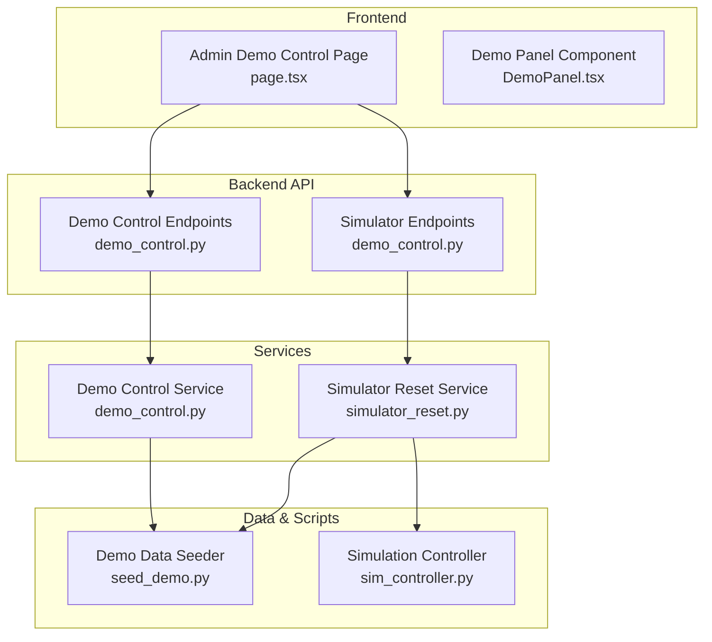
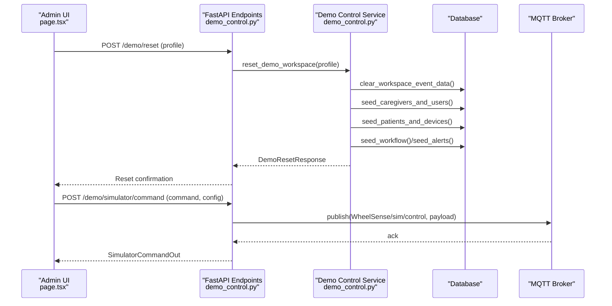
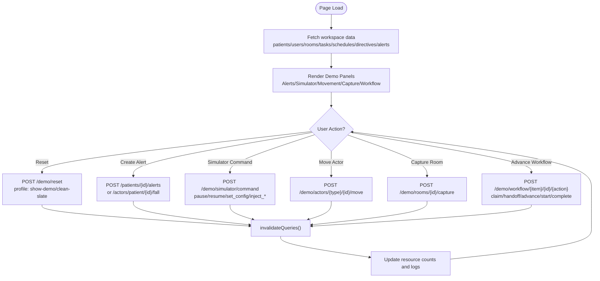
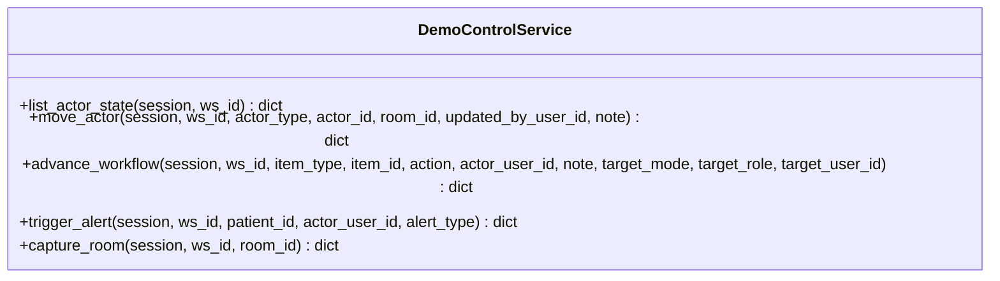
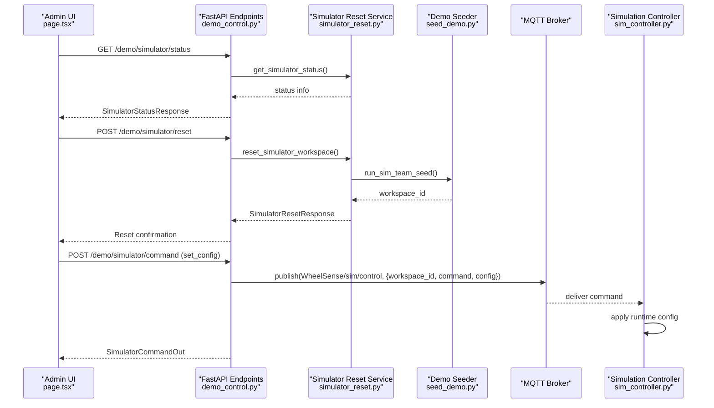
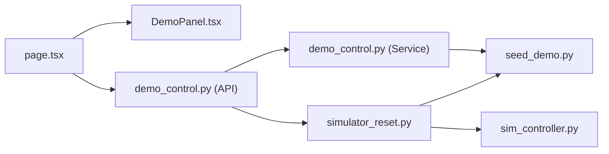

# Demo Environment Control

<cite>
**Referenced Files in This Document**
- [page.tsx](file://frontend/app/admin/demo-control/page.tsx)
- [DemoPanel.tsx](file://frontend/components/admin/demo-control/DemoPanel.tsx)
- [demo_control.py](file://server/app/api/endpoints/demo_control.py)
- [demo_control.py](file://server/app/services/demo_control.py)
- [demo_control.py](file://server/app/schemas/demo_control.py)
- [simulator_reset.py](file://server/app/services/simulator_reset.py)
- [seed_demo.py](file://server/scripts/seed_demo.py)
- [sim_controller.py](file://server/sim_controller.py)
</cite>

## Table of Contents
1. [Introduction](#introduction)
2. [Project Structure](#project-structure)
3. [Core Components](#core-components)
4. [Architecture Overview](#architecture-overview)
5. [Detailed Component Analysis](#detailed-component-analysis)
6. [Dependency Analysis](#dependency-analysis)
7. [Performance Considerations](#performance-considerations)
8. [Troubleshooting Guide](#troubleshooting-guide)
9. [Conclusion](#conclusion)

## Introduction
This document describes the Demo Environment Control functionality in the Admin Dashboard. It covers the demonstration environment management interface, including demo data generation, environment reset procedures, and simulation control features. The Admin Dashboard provides comprehensive controls for triggering manual testing events, moving actors, capturing room snapshots, advancing workflows, and managing the simulator environment. These capabilities support training, demonstrations, and automated testing workflows.

## Project Structure
The Demo Environment Control spans three layers:
- Frontend Admin Dashboard: Provides the user interface and orchestrates requests to backend endpoints.
- Backend API Layer: Exposes endpoints for demo control, workflow advancement, actor movement, room capture, and simulator management.
- Services and Scripts: Implement demo data seeding, simulator reset, and real-time simulation orchestration.

**Diagram sources**
- [page.tsx:1-804](file://frontend/app/admin/demo-control/page.tsx#L1-804)
- [DemoPanel.tsx:1-52](file://frontend/components/admin/demo-control/DemoPanel.tsx#L1-52)
- [demo_control.py:1-345](file://server/app/api/endpoints/demo_control.py#L1-345)
- [demo_control.py:1-860](file://server/app/services/demo_control.py#L1-860)
- [simulator_reset.py:1-228](file://server/app/services/simulator_reset.py#L1-228)
- [seed_demo.py:1458-1549](file://server/scripts/seed_demo.py#L1458-1549)
- [sim_controller.py:1-1472](file://server/sim_controller.py#L1-1472)

**Section sources**
- [page.tsx:1-804](file://frontend/app/admin/demo-control/page.tsx#L1-804)
- [DemoPanel.tsx:1-52](file://frontend/components/admin/demo-control/DemoPanel.tsx#L1-52)
- [demo_control.py:1-345](file://server/app/api/endpoints/demo_control.py#L1-345)
- [demo_control.py:1-860](file://server/app/services/demo_control.py#L1-860)
- [simulator_reset.py:1-228](file://server/app/services/simulator_reset.py#L1-228)
- [seed_demo.py:1458-1549](file://server/scripts/seed_demo.py#L1458-1549)
- [sim_controller.py:1-1472](file://server/sim_controller.py#L1-1472)

## Core Components
- Admin Demo Control Page: Renders the main control surface with panels for alerts, simulator, actor movement, room snapshots, and workflow advancement. It fetches live data and logs actions.
- Demo Panel Component: A reusable container for grouping controls with badges, titles, descriptions, and optional action icons.
- Demo Control Service: Implements actor state listing, movement, alert triggering, workflow advancement, and room capture.
- Simulator Management: Provides endpoints to reset simulator environments, query status, and publish MQTT commands to the simulation controller.
- Demo Data Seeder: Seeds a complete demonstration workspace with facilities, rooms, patients, devices, workflows, and sample data.

**Section sources**
- [page.tsx:82-804](file://frontend/app/admin/demo-control/page.tsx#L82-804)
- [DemoPanel.tsx:17-52](file://frontend/components/admin/demo-control/DemoPanel.tsx#L17-52)
- [demo_control.py:63-800](file://server/app/services/demo_control.py#L63-800)
- [demo_control.py:47-345](file://server/app/api/endpoints/demo_control.py#L47-345)
- [simulator_reset.py:93-228](file://server/app/services/simulator_reset.py#L93-228)
- [seed_demo.py:1458-1549](file://server/scripts/seed_demo.py#L1458-1549)

## Architecture Overview
The Demo Environment Control follows a layered architecture:
- UI Layer: React components with TanStack Query for data fetching and state management.
- API Layer: FastAPI endpoints enforcing role-based access and validating payloads.
- Service Layer: Business logic encapsulated in services for demo control and simulator reset.
- Data Layer: SQLAlchemy models and seed scripts populate and manage demo data.
- Simulation Layer: MQTT-driven simulation controller publishes telemetry and alerts.

**Diagram sources**
- [page.tsx:256-263](file://frontend/app/admin/demo-control/page.tsx#L256-263)
- [demo_control.py:56-76](file://server/app/api/endpoints/demo_control.py#L56-76)
- [demo_control.py:308-344](file://server/app/api/endpoints/demo_control.py#L308-344)
- [demo_control.py:1458-1507](file://server/app/services/demo_control.py#L1458-1507)
- [sim_controller.py:783-798](file://server/sim_controller.py#L783-798)

## Detailed Component Analysis

### Admin Demo Control Page
The Admin Demo Control Page is the central interface for managing demonstration environments. It:
- Fetches and displays live workspace resources (patients, staff, rooms, alerts).
- Provides a "Clean Slate (Reset)" button to re-seed the demo workspace.
- Offers an Alert Injection panel to create alerts with configurable types, severity, and BPM.
- Presents a Simulator panel with runtime controls (vital interval, alert probability, HR thresholds) and injection buttons for abnormal HR and falls.
- Includes Actor Movement controls to place patients or staff in rooms.
- Provides Room Snapshot capture controls to trigger hardware snapshots.
- Supports Workflow advancement with role-based or user-based targets.
- Maintains a command log for recent actions.

**Diagram sources**
- [page.tsx:87-120](file://frontend/app/admin/demo-control/page.tsx#L87-120)
- [page.tsx:171-180](file://frontend/app/admin/demo-control/page.tsx#L171-180)
- [page.tsx:256-263](file://frontend/app/admin/demo-control/page.tsx#L256-263)
- [page.tsx:377-381](file://frontend/app/admin/demo-control/page.tsx#L377-381)
- [page.tsx:425-474](file://frontend/app/admin/demo-control/page.tsx#L425-474)
- [page.tsx:581-595](file://frontend/app/admin/demo-control/page.tsx#L581-595)
- [page.tsx:617-627](file://frontend/app/admin/demo-control/page.tsx#L617-627)
- [page.tsx:707-726](file://frontend/app/admin/demo-control/page.tsx#L707-726)

**Section sources**
- [page.tsx:82-804](file://frontend/app/admin/demo-control/page.tsx#L82-804)

### Demo Panel Component
The Demo Panel Component provides a consistent layout for each control group:
- Accepts title, description, optional badge, action icon, and children.
- Renders a bordered card with gradient header and optional footer.

**Section sources**
- [DemoPanel.tsx:17-52](file://frontend/components/admin/demo-control/DemoPanel.tsx#L17-52)

### Demo Control Service
The Demo Control Service implements core demo operations:
- List Actor State: Aggregates patients and staff positions across rooms.
- Move Actor: Updates patient or staff room assignments and logs audit trail events.
- Advance Workflow: Handles task, schedule, and directive lifecycle transitions with role/user targeting.
- Trigger Alert: Creates alerts for patients with configurable types and severity.
- Capture Room: Requests hardware snapshots for a given room.

**Diagram sources**
- [demo_control.py:63-800](file://server/app/services/demo_control.py#L63-800)

**Section sources**
- [demo_control.py:63-800](file://server/app/services/demo_control.py#L63-800)

### Simulator Management
The simulator management provides:
- Reset Simulator Environment: Clears dynamic data and re-seeds baseline simulator data.
- Simulator Status: Returns environment mode, workspace existence, and statistics.
- Simulator Commands: Publishes MQTT control messages to the simulation controller with workspace scoping.

**Diagram sources**
- [demo_control.py:284-305](file://server/app/api/endpoints/demo_control.py#L284-305)
- [demo_control.py:253-281](file://server/app/api/endpoints/demo_control.py#L253-281)
- [demo_control.py:308-344](file://server/app/api/endpoints/demo_control.py#L308-344)
- [simulator_reset.py:93-148](file://server/app/services/simulator_reset.py#L93-148)
- [seed_demo.py:1408-1455](file://server/scripts/seed_demo.py#L1408-1455)
- [sim_controller.py:600-626](file://server/sim_controller.py#L600-626)

**Section sources**
- [demo_control.py:251-345](file://server/app/api/endpoints/demo_control.py#L251-345)
- [simulator_reset.py:93-228](file://server/app/services/simulator_reset.py#L93-228)
- [seed_demo.py:1408-1455](file://server/scripts/seed_demo.py#L1408-1455)
- [sim_controller.py:600-626](file://server/sim_controller.py#L600-626)

### Demo Data Seeding
The demo data seeder:
- Ensures workspace exists and optionally resets it.
- Seeds facilities, rooms, floorplans, caregivers, users, patients, devices, and assignments.
- Generates vitals, activity timelines, alerts, workflows, actor positions, photos, and future domains.
- Provides a minimal simulator team seed for MQTT-driven simulation.

**Section sources**
- [seed_demo.py:1458-1549](file://server/scripts/seed_demo.py#L1458-1549)

## Dependency Analysis
The Demo Environment Control integrates several modules with clear separation of concerns:
- Frontend depends on API endpoints and TanStack Query for data synchronization.
- API endpoints depend on services for business logic and SQLAlchemy for persistence.
- Services depend on seed scripts for data population and MQTT for simulator control.
- Simulator controller depends on MQTT for control commands and database for workspace context.

**Diagram sources**
- [page.tsx:1-804](file://frontend/app/admin/demo-control/page.tsx#L1-804)
- [DemoPanel.tsx:1-52](file://frontend/components/admin/demo-control/DemoPanel.tsx#L1-52)
- [demo_control.py:1-345](file://server/app/api/endpoints/demo_control.py#L1-345)
- [demo_control.py:1-860](file://server/app/services/demo_control.py#L1-860)
- [simulator_reset.py:1-228](file://server/app/services/simulator_reset.py#L1-228)
- [seed_demo.py:1458-1549](file://server/scripts/seed_demo.py#L1458-1549)
- [sim_controller.py:1-1472](file://server/sim_controller.py#L1-1472)

**Section sources**
- [page.tsx:1-804](file://frontend/app/admin/demo-control/page.tsx#L1-804)
- [demo_control.py:1-345](file://server/app/api/endpoints/demo_control.py#L1-345)
- [demo_control.py:1-860](file://server/app/services/demo_control.py#L1-860)
- [simulator_reset.py:1-228](file://server/app/services/simulator_reset.py#L1-228)
- [seed_demo.py:1458-1549](file://server/scripts/seed_demo.py#L1458-1549)
- [sim_controller.py:1-1472](file://server/sim_controller.py#L1-1472)

## Performance Considerations
- Data Fetching: The page uses TanStack Query with workspace-scoped keys to cache and invalidate data efficiently during resets and operations.
- Batch Operations: Resetting the workspace clears event data and re-seeds deterministically, minimizing stale data impact.
- Simulator Throughput: The simulation controller publishes telemetry and alerts at configurable intervals; adjust vital_update_interval and enable flags to balance realism and performance.
- Audit Trail: Operations log events; ensure audit tables are indexed appropriately for large workspaces.

## Troubleshooting Guide
Common issues and resolutions:
- Reset Fails: Verify the workspace name and that the reset profile is supported. Check backend logs for SQL exceptions.
- Simulator Commands Not Applied: Confirm the environment is in simulator mode and the MQTT broker is reachable. Validate that the workspace_id in the command matches the current workspace.
- Actor Movement Errors: Ensure the room and actor belong to the current workspace and the actor type is valid.
- Workflow Advancement Failures: Confirm the item exists and the target mode/user combination is valid.
- Room Capture Errors: Ensure the room has a mapped node device.

**Section sources**
- [demo_control.py:56-76](file://server/app/api/endpoints/demo_control.py#L56-76)
- [demo_control.py:308-344](file://server/app/api/endpoints/demo_control.py#L308-344)
- [demo_control.py:155-263](file://server/app/services/demo_control.py#L155-263)
- [demo_control.py:265-450](file://server/app/services/demo_control.py#L265-450)

## Conclusion
The Demo Environment Control provides a comprehensive toolkit for administrators to prepare demonstration environments, reset demo data, control simulation parameters, and support training and testing workflows. The modular architecture ensures clear separation of concerns, while the simulator integration enables realistic, controllable demonstrations with configurable runtime parameters.