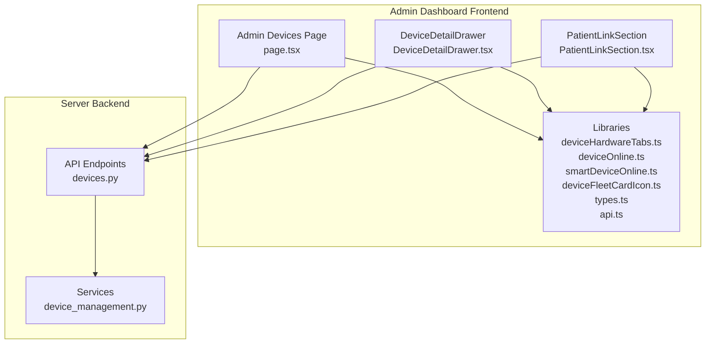
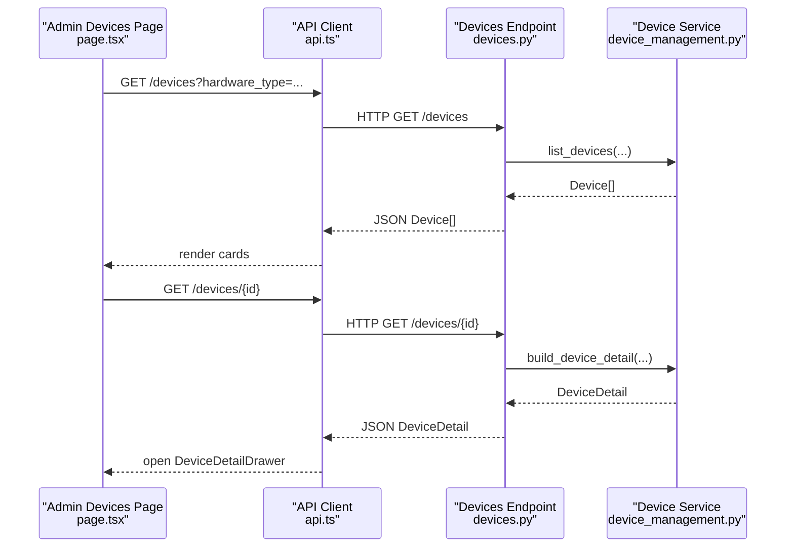
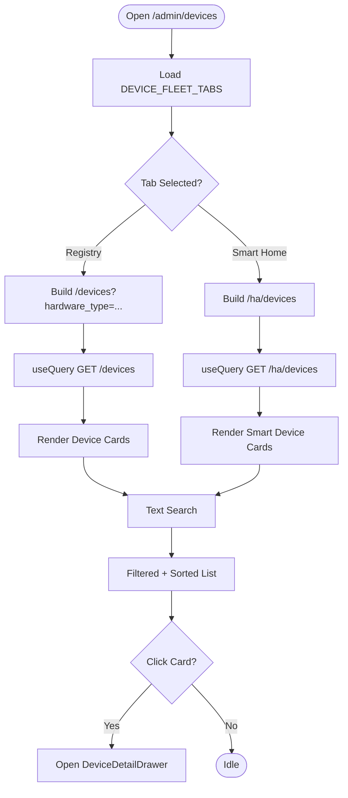
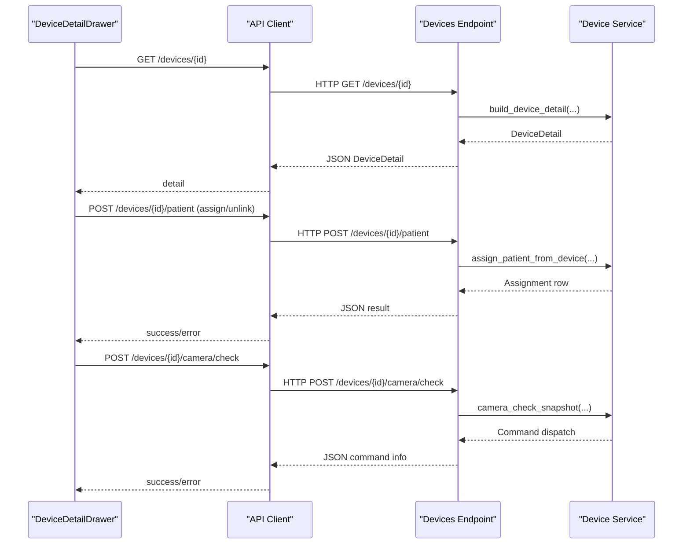
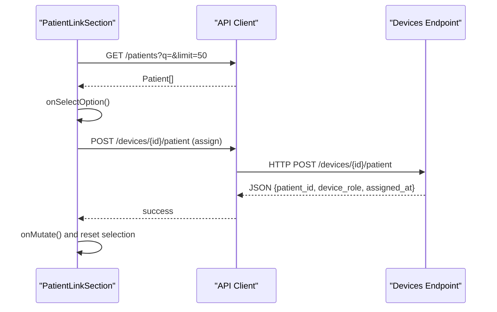
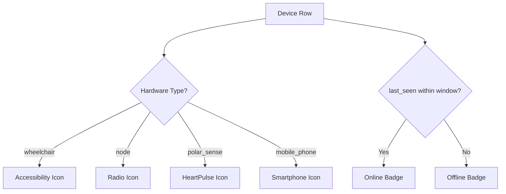
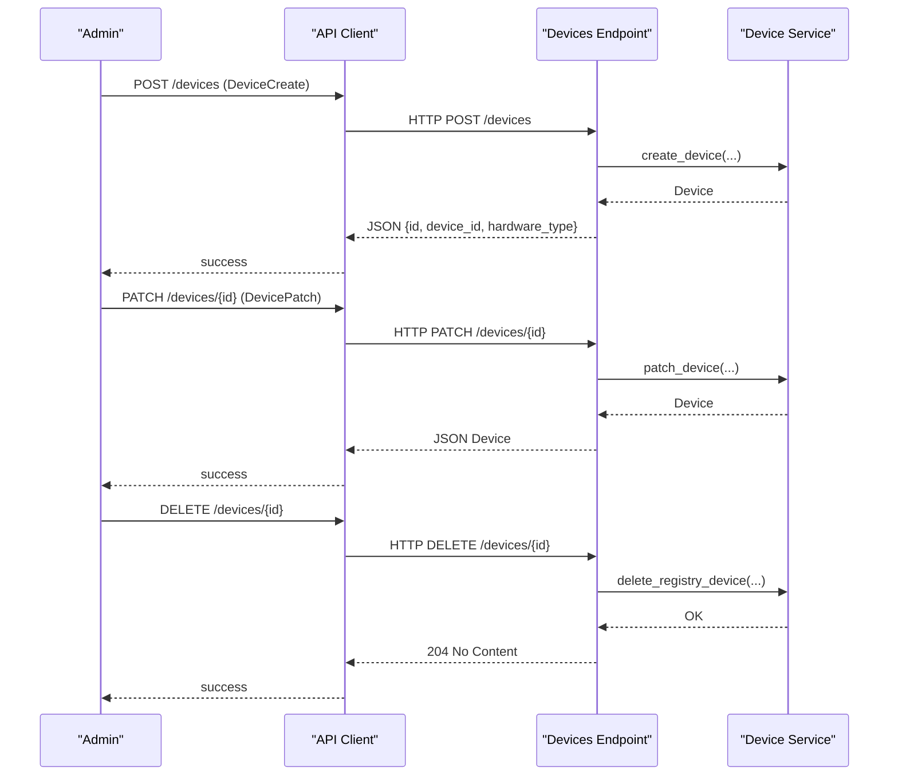
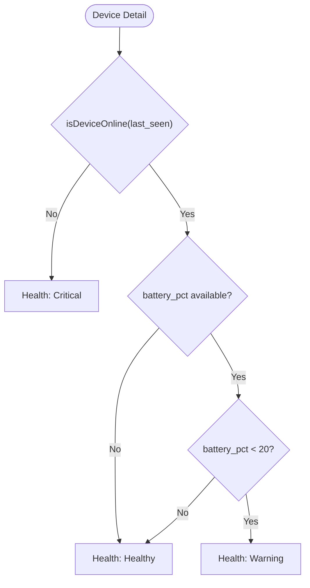
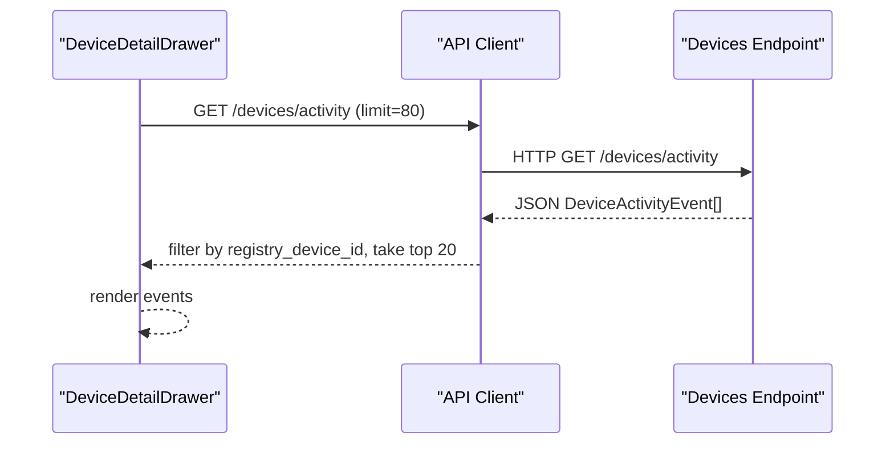
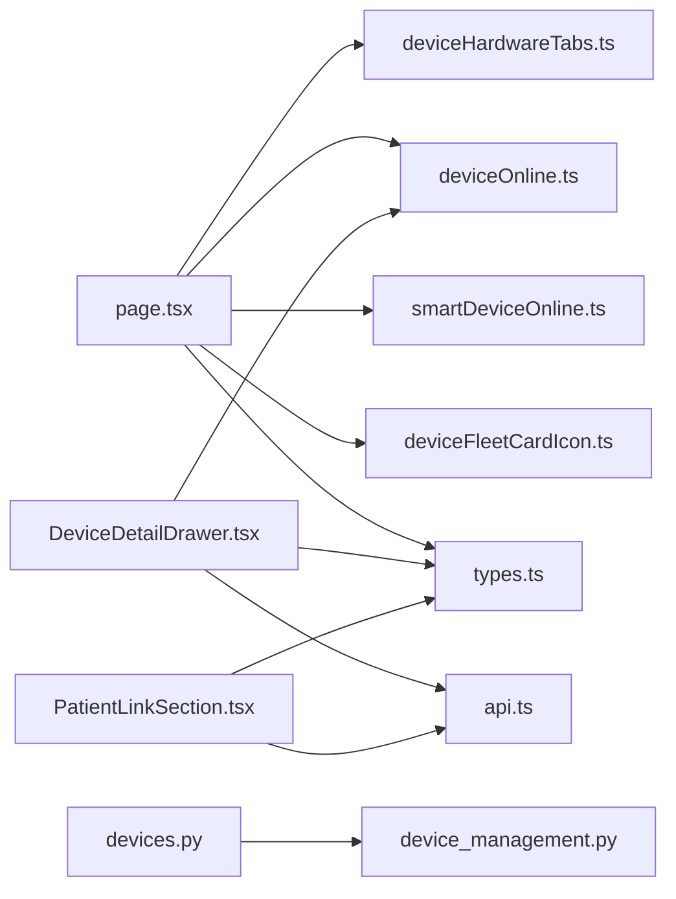

# Device Management

<cite>
**Referenced Files in This Document**
- [page.tsx](file://frontend/app/admin/devices/page.tsx)
- [DeviceDetailDrawer.tsx](file://frontend/components/admin/devices/DeviceDetailDrawer.tsx)
- [PatientLinkSection.tsx](file://frontend/components/admin/devices/PatientLinkSection.tsx)
- [deviceHardwareTabs.ts](file://frontend/lib/deviceHardwareTabs.ts)
- [deviceOnline.ts](file://frontend/lib/deviceOnline.ts)
- [smartDeviceOnline.ts](file://frontend/lib/smartDeviceOnline.ts)
- [deviceFleetCardIcon.ts](file://frontend/lib/deviceFleetCardIcon.ts)
- [types.ts](file://frontend/lib/types.ts)
- [api.ts](file://frontend/lib/api.ts)
- [devices.py](file://server/app/api/endpoints/devices.py)
- [device_management.py](file://server/app/services/device_management.py)
</cite>

## Table of Contents
1. [Introduction](#introduction)
2. [Project Structure](#project-structure)
3. [Core Components](#core-components)
4. [Architecture Overview](#architecture-overview)
5. [Detailed Component Analysis](#detailed-component-analysis)
6. [Dependency Analysis](#dependency-analysis)
7. [Performance Considerations](#performance-considerations)
8. [Troubleshooting Guide](#troubleshooting-guide)
9. [Conclusion](#conclusion)

## Introduction
This document describes the Device Management system in the Admin Dashboard, focusing on fleet oversight, device registration, status monitoring, patient-device assignment, and lifecycle management. It explains how the frontend presents device fleets, how device health is computed and displayed, and how administrators can manage assignments and troubleshoot issues. Backend APIs and services are summarized to clarify the data model and operations.

## Project Structure
The Device Management feature spans frontend pages, components, and libraries, along with backend API endpoints and services.

- Frontend
  - Page: Admin device fleet overview and filtering
  - Components: Device detail drawer, patient link panel
  - Libraries: Tabs, online detection, icons, types, API client
- Backend
  - API endpoints: Device listing, detail, commands, patient assignment, creation, deletion
  - Services: Device registry operations, command dispatch, activity logging

**Diagram sources**
- [page.tsx:54-344](file://frontend/app/admin/devices/page.tsx#L54-L344)
- [DeviceDetailDrawer.tsx:286-640](file://frontend/components/admin/devices/DeviceDetailDrawer.tsx#L286-L640)
- [PatientLinkSection.tsx:24-204](file://frontend/components/admin/devices/PatientLinkSection.tsx#L24-L204)
- [deviceHardwareTabs.ts:1-73](file://frontend/lib/deviceHardwareTabs.ts#L1-L73)
- [deviceOnline.ts:1-8](file://frontend/lib/deviceOnline.ts#L1-L8)
- [smartDeviceOnline.ts:1-11](file://frontend/lib/smartDeviceOnline.ts#L1-L11)
- [deviceFleetCardIcon.ts:1-72](file://frontend/lib/deviceFleetCardIcon.ts#L1-L72)
- [types.ts:92-195](file://frontend/lib/types.ts#L92-L195)
- [api.ts:1-200](file://frontend/lib/api.ts#L1-L200)
- [devices.py:63-240](file://server/app/api/endpoints/devices.py#L63-L240)
- [device_management.py:1-200](file://server/app/services/device_management.py#L1-L200)

**Section sources**
- [page.tsx:1-383](file://frontend/app/admin/devices/page.tsx#L1-L383)
- [DeviceDetailDrawer.tsx:1-800](file://frontend/components/admin/devices/DeviceDetailDrawer.tsx#L1-L800)
- [PatientLinkSection.tsx:1-204](file://frontend/components/admin/devices/PatientLinkSection.tsx#L1-L204)
- [deviceHardwareTabs.ts:1-73](file://frontend/lib/deviceHardwareTabs.ts#L1-L73)
- [deviceOnline.ts:1-8](file://frontend/lib/deviceOnline.ts#L1-L8)
- [smartDeviceOnline.ts:1-11](file://frontend/lib/smartDeviceOnline.ts#L1-L11)
- [deviceFleetCardIcon.ts:1-72](file://frontend/lib/deviceFleetCardIcon.ts#L1-L72)
- [types.ts:92-200](file://frontend/lib/types.ts#L92-L200)
- [api.ts:1-200](file://frontend/lib/api.ts#L1-L200)
- [devices.py:63-240](file://server/app/api/endpoints/devices.py#L63-L240)
- [device_management.py:1-200](file://server/app/services/device_management.py#L1-L200)

## Core Components
- Admin Devices Page
  - Presents device fleet cards grouped by hardware type and filtered by tab
  - Supports search, sorting, and quick stats for online/offline or reachable/inactive counts
  - Integrates with Home Assistant smart devices view
- Device Detail Drawer
  - Shows identity, health snapshot, and hardware-specific metrics
  - Provides controls to assign/unassign patients, link rooms for node devices, request camera snapshots, and rename devices
  - Displays recent device activity events
- Patient Link Section
  - Allows assigning or unlinking a patient to/from a compatible device
  - Uses a searchable picker to select a patient and posts to the backend
- Libraries and Types
  - Device fleet tabs, online detection heuristics, icon presentation, and shared types
  - API client wrappers for device endpoints

**Section sources**
- [page.tsx:54-344](file://frontend/app/admin/devices/page.tsx#L54-L344)
- [DeviceDetailDrawer.tsx:286-640](file://frontend/components/admin/devices/DeviceDetailDrawer.tsx#L286-L640)
- [PatientLinkSection.tsx:24-204](file://frontend/components/admin/devices/PatientLinkSection.tsx#L24-L204)
- [deviceHardwareTabs.ts:1-73](file://frontend/lib/deviceHardwareTabs.ts#L1-L73)
- [deviceOnline.ts:1-8](file://frontend/lib/deviceOnline.ts#L1-L8)
- [smartDeviceOnline.ts:1-11](file://frontend/lib/smartDeviceOnline.ts#L1-L11)
- [deviceFleetCardIcon.ts:1-72](file://frontend/lib/deviceFleetCardIcon.ts#L1-L72)
- [types.ts:92-195](file://frontend/lib/types.ts#L92-L195)
- [api.ts:1-200](file://frontend/lib/api.ts#L1-L200)

## Architecture Overview
The Admin Devices feature is a client-server system:
- Frontend queries device lists and details, renders cards and drawers, and triggers mutations
- Backend exposes REST endpoints for listing, creating, updating, deleting registry devices, assigning patients, sending commands, and camera snapshots
- Services handle device registry operations, command dispatch, and activity logging

**Diagram sources**
- [page.tsx:76-100](file://frontend/app/admin/devices/page.tsx#L76-L100)
- [api.ts:1-200](file://frontend/lib/api.ts#L1-L200)
- [devices.py:63-134](file://server/app/api/endpoints/devices.py#L63-L134)
- [device_management.py:1-200](file://server/app/services/device_management.py#L1-L200)

## Detailed Component Analysis

### Admin Devices Fleet View
- Filtering and tabs
  - Fleet tabs include all, wheelchair, node, polar_sense, mobile_phone, and smart_home
  - Tab selection updates query params and switches endpoint accordingly
- Device list rendering
  - Registry devices: cards show hardware type, firmware, last seen, and online status
  - Smart devices: cards show reachability and state
- Stats and search
  - Online/offline or reachable/inactive counts
  - Text search across identifiers and labels

**Diagram sources**
- [page.tsx:54-344](file://frontend/app/admin/devices/page.tsx#L54-L344)
- [deviceHardwareTabs.ts:1-73](file://frontend/lib/deviceHardwareTabs.ts#L1-L73)
- [deviceOnline.ts:1-8](file://frontend/lib/deviceOnline.ts#L1-L8)
- [smartDeviceOnline.ts:1-11](file://frontend/lib/smartDeviceOnline.ts#L1-L11)
- [deviceFleetCardIcon.ts:1-72](file://frontend/lib/deviceFleetCardIcon.ts#L1-L72)

**Section sources**
- [page.tsx:54-344](file://frontend/app/admin/devices/page.tsx#L54-L344)
- [deviceHardwareTabs.ts:1-73](file://frontend/lib/deviceHardwareTabs.ts#L1-L73)
- [deviceOnline.ts:1-8](file://frontend/lib/deviceOnline.ts#L1-L8)
- [smartDeviceOnline.ts:1-11](file://frontend/lib/smartDeviceOnline.ts#L1-L11)
- [deviceFleetCardIcon.ts:1-72](file://frontend/lib/deviceFleetCardIcon.ts#L1-L72)

### Device Detail Drawer
- Identity and health
  - Displays device identity, hardware type, last seen, and online status
  - Health snapshot computes status based on online and battery thresholds
- Metrics
  - Hardware-specific metrics (e.g., wheelchair acceleration/velocity/distance, polar vitals)
- Actions
  - Rename device (managed by admins)
  - Patient assignment/unlink (managed by patient managers)
  - Room assignment/unlink for node devices
  - Camera snapshot request
  - Delete registry device (managed by admins)
- Activity
  - Lists recent device activity events filtered by the selected device

**Diagram sources**
- [DeviceDetailDrawer.tsx:286-640](file://frontend/components/admin/devices/DeviceDetailDrawer.tsx#L286-L640)
- [devices.py:125-184](file://server/app/api/endpoints/devices.py#L125-L184)
- [device_management.py:1-200](file://server/app/services/device_management.py#L1-L200)
- [api.ts:1-200](file://frontend/lib/api.ts#L1-L200)

**Section sources**
- [DeviceDetailDrawer.tsx:286-640](file://frontend/components/admin/devices/DeviceDetailDrawer.tsx#L286-L640)
- [devices.py:125-184](file://server/app/api/endpoints/devices.py#L125-L184)
- [device_management.py:1-200](file://server/app/services/device_management.py#L1-L200)
- [api.ts:1-200](file://frontend/lib/api.ts#L1-L200)

### Patient Link Section
- Purpose
  - Assigns or unlinks a patient to/from a device when the device supports patient assignment
- Behavior
  - Searches patients with workspace scoping
  - Posts assignment with a default device role derived from hardware type
  - Clears selection after successful mutation

**Diagram sources**
- [PatientLinkSection.tsx:24-204](file://frontend/components/admin/devices/PatientLinkSection.tsx#L24-L204)
- [devices.py:146-184](file://server/app/api/endpoints/devices.py#L146-L184)
- [api.ts:1-200](file://frontend/lib/api.ts#L1-L200)

**Section sources**
- [PatientLinkSection.tsx:24-204](file://frontend/components/admin/devices/PatientLinkSection.tsx#L24-L204)
- [devices.py:146-184](file://server/app/api/endpoints/devices.py#L146-L184)
- [api.ts:1-200](file://frontend/lib/api.ts#L1-L200)

### Device Categories and Status Detection
- Categories
  - Hardware types supported: wheelchair, node, polar_sense, mobile_phone
  - Smart devices mapped from Home Assistant
- Online detection
  - Registry devices: considered online if last_seen within a fixed window
  - Smart devices: reachable if active and state is neither unknown nor unavailable
- Icons and visuals
  - Card icons and color themes vary by hardware type

**Diagram sources**
- [deviceHardwareTabs.ts:1-73](file://frontend/lib/deviceHardwareTabs.ts#L1-L73)
- [deviceFleetCardIcon.ts:1-72](file://frontend/lib/deviceFleetCardIcon.ts#L1-L72)
- [deviceOnline.ts:1-8](file://frontend/lib/deviceOnline.ts#L1-L8)
- [smartDeviceOnline.ts:1-11](file://frontend/lib/smartDeviceOnline.ts#L1-L11)

**Section sources**
- [deviceHardwareTabs.ts:1-73](file://frontend/lib/deviceHardwareTabs.ts#L1-L73)
- [deviceFleetCardIcon.ts:1-72](file://frontend/lib/deviceFleetCardIcon.ts#L1-L72)
- [deviceOnline.ts:1-8](file://frontend/lib/deviceOnline.ts#L1-L8)
- [smartDeviceOnline.ts:1-11](file://frontend/lib/smartDeviceOnline.ts#L1-L11)

### Device Lifecycle Management
- Registration
  - Create registry device via POST /devices
  - Logs activity event registry_created
- Updates
  - Patch registry device via PATCH /devices/{id}
  - Sanitized config fields exclude sensitive keys
- Deletion
  - DELETE /devices/{id}
  - Logs activity event registry_deleted

**Diagram sources**
- [devices.py:186-240](file://server/app/api/endpoints/devices.py#L186-L240)
- [device_management.py:1-200](file://server/app/services/device_management.py#L1-L200)

**Section sources**
- [devices.py:186-240](file://server/app/api/endpoints/devices.py#L186-L240)
- [device_management.py:1-200](file://server/app/services/device_management.py#L1-L200)

### Device Health Monitoring
- Real-time status
  - Online/offline computed from last_seen
  - Battery percentage sourced from the most specific metrics available
- Health status
  - Healthy: online and battery >= 20%
  - Warning: online and battery < 20%
  - Critical: offline
- Additional metrics
  - Wheelchair: acceleration, velocity, distance
  - Polar: heart rate, RR interval, SpO2, sensor battery
  - Node/mobile: battery, charging, steps (when available)

**Diagram sources**
- [DeviceDetailDrawer.tsx:624-637](file://frontend/components/admin/devices/DeviceDetailDrawer.tsx#L624-L637)
- [deviceOnline.ts:1-8](file://frontend/lib/deviceOnline.ts#L1-L8)
- [types.ts:164-187](file://frontend/lib/types.ts#L164-L187)

**Section sources**
- [DeviceDetailDrawer.tsx:624-637](file://frontend/components/admin/devices/DeviceDetailDrawer.tsx#L624-L637)
- [deviceOnline.ts:1-8](file://frontend/lib/deviceOnline.ts#L1-L8)
- [types.ts:164-187](file://frontend/lib/types.ts#L164-L187)

### Device Activity Tracking
- Endpoint
  - GET /devices/activity returns recent device activity events
- Drawer integration
  - DeviceDetailDrawer lists up to 20 recent events for the selected device
- Backend logging
  - Events logged for registry changes, pairing/unpairing, command dispatches, and camera snapshots

**Diagram sources**
- [DeviceDetailDrawer.tsx:321-331](file://frontend/components/admin/devices/DeviceDetailDrawer.tsx#L321-L331)
- [devices.py:53-61](file://server/app/api/endpoints/devices.py#L53-L61)

**Section sources**
- [DeviceDetailDrawer.tsx:321-331](file://frontend/components/admin/devices/DeviceDetailDrawer.tsx#L321-L331)
- [devices.py:53-61](file://server/app/api/endpoints/devices.py#L53-L61)

### Troubleshooting Workflows
- Investigating connectivity issues
  - Use DeviceDetailDrawer to check online status and last seen
  - For node devices, verify room assignment and node device key mapping
  - For cameras, request a snapshot to validate connectivity
- Managing assignments
  - Use PatientLinkSection to assign/unlink a patient when the device supports it
  - For node devices, use the room assignment controls to link to a room’s node device key
- Monitoring fleet health
  - Use the Admin Devices page to filter by hardware type and review online/offline stats
  - Switch to smart_home tab to review reachable/inactive smart devices

[No sources needed since this section synthesizes previously analyzed components]

## Dependency Analysis
- Frontend dependencies
  - page.tsx depends on deviceHardwareTabs, deviceOnline, smartDeviceOnline, deviceFleetCardIcon, and types
  - DeviceDetailDrawer depends on api.ts, permissions, datetime, and nodeDeviceRoomKey helpers
  - PatientLinkSection depends on api.ts and workspace scoping
- Backend dependencies
  - devices.py endpoints depend on device_management service and device_activity service
  - device_management service orchestrates DB operations, MQTT-related normalization, and sanitized config handling

**Diagram sources**
- [page.tsx:1-383](file://frontend/app/admin/devices/page.tsx#L1-L383)
- [DeviceDetailDrawer.tsx:1-800](file://frontend/components/admin/devices/DeviceDetailDrawer.tsx#L1-L800)
- [PatientLinkSection.tsx:1-204](file://frontend/components/admin/devices/PatientLinkSection.tsx#L1-L204)
- [deviceHardwareTabs.ts:1-73](file://frontend/lib/deviceHardwareTabs.ts#L1-L73)
- [deviceOnline.ts:1-8](file://frontend/lib/deviceOnline.ts#L1-L8)
- [smartDeviceOnline.ts:1-11](file://frontend/lib/smartDeviceOnline.ts#L1-L11)
- [deviceFleetCardIcon.ts:1-72](file://frontend/lib/deviceFleetCardIcon.ts#L1-L72)
- [types.ts:92-195](file://frontend/lib/types.ts#L92-L195)
- [api.ts:1-200](file://frontend/lib/api.ts#L1-L200)
- [devices.py:63-240](file://server/app/api/endpoints/devices.py#L63-L240)
- [device_management.py:1-200](file://server/app/services/device_management.py#L1-L200)

**Section sources**
- [page.tsx:1-383](file://frontend/app/admin/devices/page.tsx#L1-L383)
- [DeviceDetailDrawer.tsx:1-800](file://frontend/components/admin/devices/DeviceDetailDrawer.tsx#L1-L800)
- [PatientLinkSection.tsx:1-204](file://frontend/components/admin/devices/PatientLinkSection.tsx#L1-L204)
- [devices.py:63-240](file://server/app/api/endpoints/devices.py#L63-L240)
- [device_management.py:1-200](file://server/app/services/device_management.py#L1-L200)

## Performance Considerations
- Polling and caching
  - Queries use staleTime and refetchInterval tailored to endpoints to balance freshness and load
  - Fast polling windows are applied for device detail and activity after specific actions (e.g., snapshot requests)
- Rendering
  - Sorting and filtering are client-side on small to medium lists; consider virtualization for very large fleets
- Network
  - Workspace-scoped endpoints reduce cross-workspace overhead
  - Sanitized config prevents large credential payloads from being transmitted unnecessarily

[No sources needed since this section provides general guidance]

## Troubleshooting Guide
- Device appears offline despite recent activity
  - Confirm last_seen is within the online window
  - Check device logs and connectivity
- Cannot assign a patient
  - Verify the device hardware type supports patient assignment
  - Ensure the patient exists and is active
- Camera snapshot request fails
  - Retry the snapshot action; the drawer increases polling briefly after request
  - Confirm camera device is reachable and active
- Deleting a registry device
  - Use the drawer’s delete action; ensure no active assignments remain

**Section sources**
- [DeviceDetailDrawer.tsx:565-594](file://frontend/components/admin/devices/DeviceDetailDrawer.tsx#L565-L594)
- [deviceOnline.ts:1-8](file://frontend/lib/deviceOnline.ts#L1-L8)
- [devices.py:146-184](file://server/app/api/endpoints/devices.py#L146-L184)

## Conclusion
The Admin Dashboard’s Device Management provides a comprehensive fleet overview, actionable device detail, and robust assignment controls. Administrators can monitor device health, investigate connectivity issues, manage patient-device links, and oversee lifecycle operations through a unified interface backed by well-defined backend APIs and services.