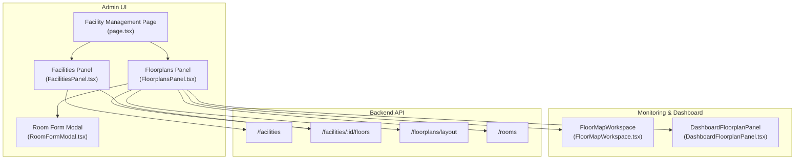
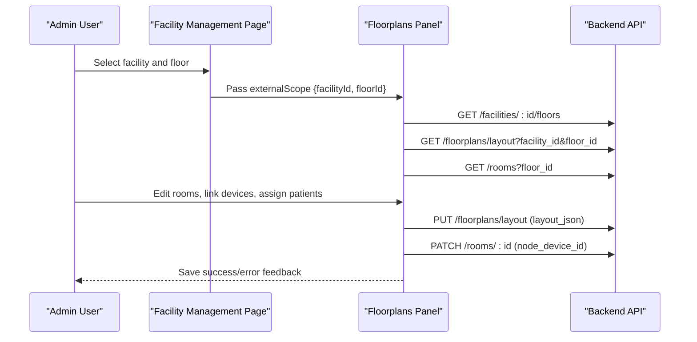
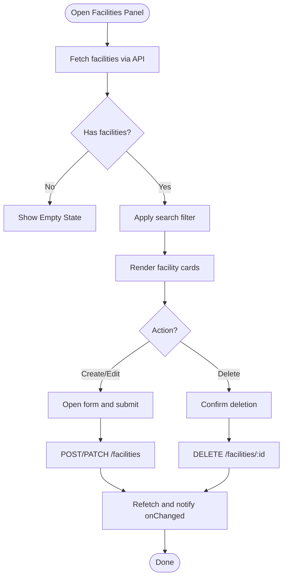
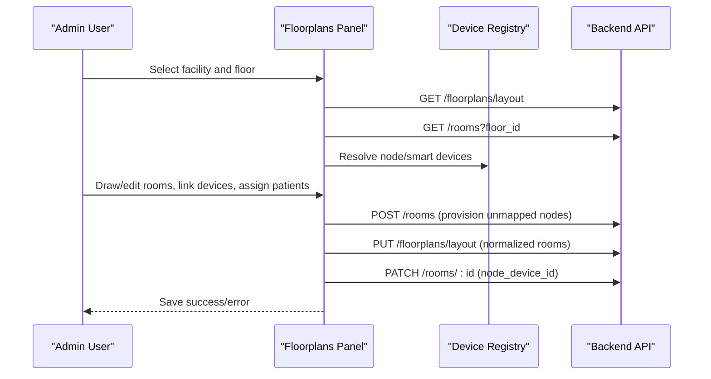
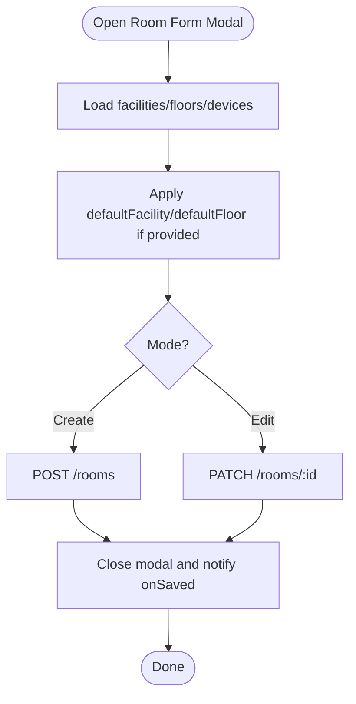
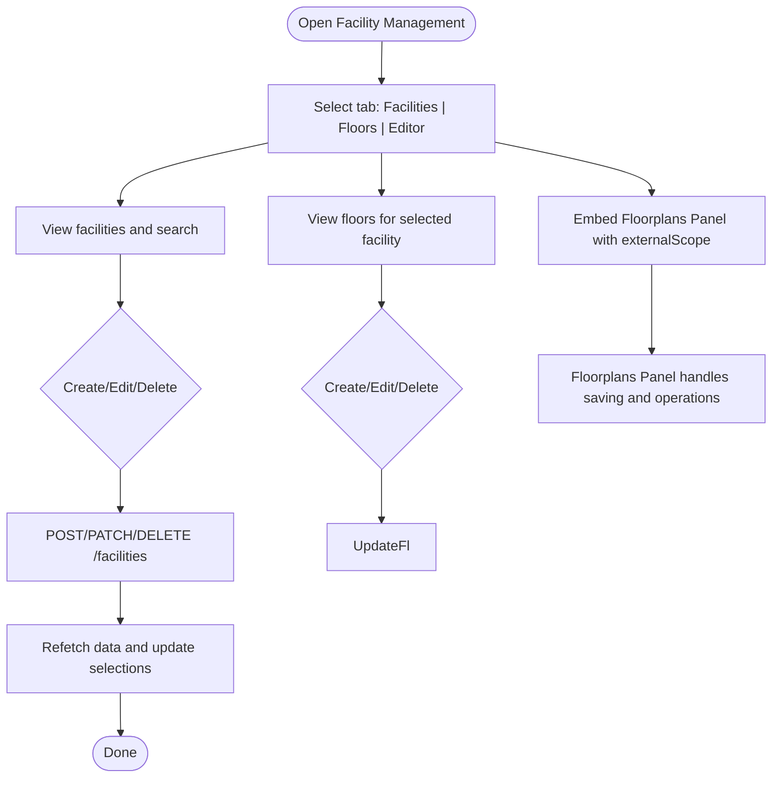
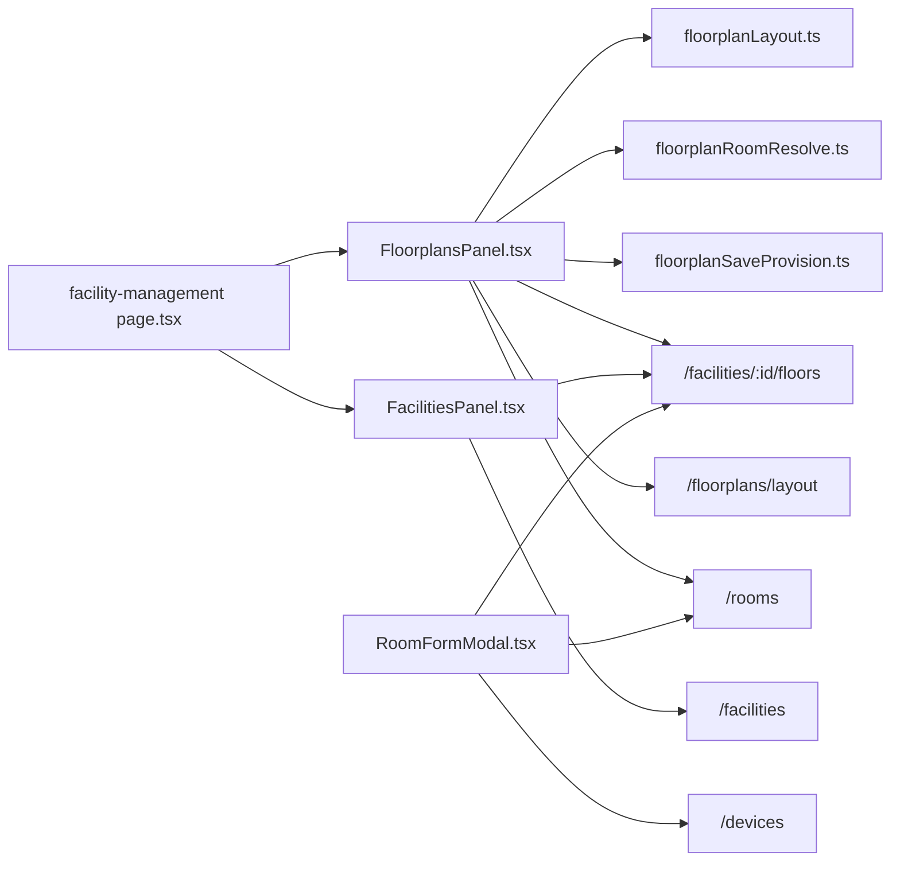

# Facility Administration

<cite>
**Referenced Files in This Document**
- [FacilitiesPanel.tsx](file://frontend/components/admin/FacilitiesPanel.tsx)
- [FloorplansPanel.tsx](file://frontend/components/admin/FloorplansPanel.tsx)
- [RoomFormModal.tsx](file://frontend/components/admin/RoomFormModal.tsx)
- [facility-management page.tsx](file://frontend/app/admin/facility-management/page.tsx)
- [FloorMapWorkspace.tsx](file://frontend/components/admin/monitoring/FloorMapWorkspace.tsx)
- [DashboardFloorplanPanel.tsx](file://frontend/components/dashboard/DashboardFloorplanPanel.tsx)
- [ARCHITECTURE.md](file://ARCHITECTURE.md)
- [README.md](file://frontend/README.md)
- [facilities.py](file://server/app/api/endpoints/facilities.py)
- [floorplans.py](file://server/app/api/endpoints/floorplans.py)
- [rooms.py](file://server/app/api/endpoints/rooms.py)
- [facility.py](file://server/app/models/facility.py)
- [floorplans.py](file://server/app/models/floorplans.py)
- [floorplanLayout.ts](file://frontend/lib/floorplanLayout.ts)
- [floorplanRoomResolve.ts](file://frontend/lib/floorplanRoomResolve.ts)
- [floorplanSaveProvision.ts](file://frontend/lib/floorplanSaveProvision.ts)
</cite>

## Table of Contents
1. [Introduction](#introduction)
2. [Project Structure](#project-structure)
3. [Core Components](#core-components)
4. [Architecture Overview](#architecture-overview)
5. [Detailed Component Analysis](#detailed-component-analysis)
6. [Dependency Analysis](#dependency-analysis)
7. [Performance Considerations](#performance-considerations)
8. [Troubleshooting Guide](#troubleshooting-guide)
9. [Conclusion](#conclusion)

## Introduction
This document describes the Facility Administration functionality in the Admin Dashboard, focusing on building and floor management, floor plan editing, room assignment, and facility-wide operational settings. It explains the Facilities Panel, Floorplans Panel, and Room Form Modal, and documents workspace scoping, hierarchy visualization, and spatial model configuration. It also provides practical admin workflows for creating facilities, configuring floor layouts, assigning rooms to departments, and managing facility-wide settings.

## Project Structure
The Facility Administration feature spans frontend React components and backend API endpoints:
- Frontend panels and modals: FacilitiesPanel, FloorplansPanel, RoomFormModal
- Admin page orchestrator: facility-management page
- Monitoring and dashboard integrations: FloorMapWorkspace, DashboardFloorplanPanel
- Backend endpoints: facilities, floorplans, rooms
- Shared spatial utilities: floorplanLayout, floorplanRoomResolve, floorplanSaveProvision

**Diagram sources**
- [facility-management page.tsx:38-576](file://frontend/app/admin/facility-management/page.tsx#L38-L576)
- [FloorplansPanel.tsx:86-775](file://frontend/components/admin/FloorplansPanel.tsx#L86-L775)
- [FacilitiesPanel.tsx:25-228](file://frontend/components/admin/FacilitiesPanel.tsx#L25-L228)
- [RoomFormModal.tsx:51-344](file://frontend/components/admin/RoomFormModal.tsx#L51-L344)
- [FloorMapWorkspace.tsx](file://frontend/components/admin/monitoring/FloorMapWorkspace.tsx)
- [DashboardFloorplanPanel.tsx](file://frontend/components/dashboard/DashboardFloorplanPanel.tsx)
- [facilities.py](file://server/app/api/endpoints/facilities.py)
- [floorplans.py](file://server/app/api/endpoints/floorplans.py)
- [rooms.py](file://server/app/api/endpoints/rooms.py)

**Section sources**
- [facility-management page.tsx:38-576](file://frontend/app/admin/facility-management/page.tsx#L38-L576)
- [FloorplansPanel.tsx:86-775](file://frontend/components/admin/FloorplansPanel.tsx#L86-L775)
- [FacilitiesPanel.tsx:25-228](file://frontend/components/admin/FacilitiesPanel.tsx#L25-L228)
- [RoomFormModal.tsx:51-344](file://frontend/components/admin/RoomFormModal.tsx#L51-L344)

## Core Components
- Facilities Panel: Lists, creates, edits, and deletes facilities; supports search and displays address/description.
- Floorplans Panel: Manages facility/floor scope, loads floor layouts, edits room shapes, links node/smart devices, assigns patients, captures snapshots, and saves layout updates.
- Room Form Modal: Creates or edits rooms with facility/floor scoping, room type selection, and optional node device linkage.
- Facility Management Page: Orchestrates Facilities and Floors tabs, and embeds Floorplans Panel with external scope.

**Section sources**
- [FacilitiesPanel.tsx:25-228](file://frontend/components/admin/FacilitiesPanel.tsx#L25-L228)
- [FloorplansPanel.tsx:86-775](file://frontend/components/admin/FloorplansPanel.tsx#L86-L775)
- [RoomFormModal.tsx:51-344](file://frontend/components/admin/RoomFormModal.tsx#L51-L344)
- [facility-management page.tsx:38-576](file://frontend/app/admin/facility-management/page.tsx#L38-L576)

## Architecture Overview
The admin UI integrates with backend endpoints to manage spatial hierarchy and room assignments. The Floorplans Panel centralizes floor editing and room operations, while the Facility Management Page coordinates scope selection and embedding.

**Diagram sources**
- [facility-management page.tsx:75-78](file://frontend/app/admin/facility-management/page.tsx#L75-L78)
- [FloorplansPanel.tsx:125-142](file://frontend/components/admin/FloorplansPanel.tsx#L125-L142)
- [FloorplansPanel.tsx:469-555](file://frontend/components/admin/FloorplansPanel.tsx#L469-L555)
- [floorplans.py](file://server/app/api/endpoints/floorplans.py)
- [rooms.py](file://server/app/api/endpoints/rooms.py)

**Section sources**
- [ARCHITECTURE.md:171-202](file://ARCHITECTURE.md#L171-L202)
- [README.md:186-192](file://frontend/README.md#L186-L192)

## Detailed Component Analysis

### Facilities Panel
Purpose:
- Manage facilities: create, update, delete, search.
- Display facility cards with name, address, description.
- Trigger refresh callbacks after mutations.

Key behaviors:
- Uses React Query to fetch facilities with polling and stale-time configuration.
- Supports search filtering.
- Form validation enforces non-empty name.
- Handles create/update/delete via API calls and refetches.

**Diagram sources**
- [FacilitiesPanel.tsx:27-107](file://frontend/components/admin/FacilitiesPanel.tsx#L27-L107)

**Section sources**
- [FacilitiesPanel.tsx:25-228](file://frontend/components/admin/FacilitiesPanel.tsx#L25-L228)

### Floorplans Panel
Purpose:
- Central floor plan editor with facility/floor scoping.
- Load and normalize layout JSON, merge with existing rooms, and render canvas.
- Link node devices to rooms, assign/unassign patients, capture snapshots, and save layout.

Key behaviors:
- Scope management: facilityId/floorId; supports external scope from parent.
- Layout loading: GET /floorplans/layout with facility_id and floor_id.
- Room operations: create, edit, delete rooms; link node devices; smart device linking; patient assignment.
- Save pipeline: provision unmapped nodes, normalize room IDs, align shapes to registry devices, PUT layout, PATCH room node_device_id.
- Capture flow: camera snapshot check and preview retrieval.

**Diagram sources**
- [FloorplansPanel.tsx:125-153](file://frontend/components/admin/FloorplansPanel.tsx#L125-L153)
- [FloorplansPanel.tsx:469-555](file://frontend/components/admin/FloorplansPanel.tsx#L469-L555)
- [floorplanSaveProvision.ts](file://frontend/lib/floorplanSaveProvision.ts)
- [floorplanRoomResolve.ts](file://frontend/lib/floorplanRoomResolve.ts)
- [floorplanLayout.ts](file://frontend/lib/floorplanLayout.ts)

**Section sources**
- [FloorplansPanel.tsx:86-775](file://frontend/components/admin/FloorplansPanel.tsx#L86-L775)
- [README.md:186-192](file://frontend/README.md#L186-L192)

### Room Form Modal
Purpose:
- Create or edit rooms scoped to facility and floor.
- Choose room type from presets or custom.
- Optionally link a node device.

Key behaviors:
- Workspace-scoped queries for facilities, floors, and devices.
- Preset room types with custom fallback.
- Validation ensures non-empty name.
- Submits to /rooms create or update endpoint.

**Diagram sources**
- [RoomFormModal.tsx:93-129](file://frontend/components/admin/RoomFormModal.tsx#L93-L129)
- [RoomFormModal.tsx:291-342](file://frontend/components/admin/RoomFormModal.tsx#L291-L342)

**Section sources**
- [RoomFormModal.tsx:51-344](file://frontend/components/admin/RoomFormModal.tsx#L51-L344)

### Facility Management Page
Purpose:
- Orchestrate Facilities, Floors, and Floor Plan tabs.
- Embed Floorplans Panel with external scope derived from selections.
- Provide stats and navigation between scopes.

Key behaviors:
- Maintains selectedFacilityId and selectedFloorId.
- Computes externalScope for Floorplans Panel.
- Tabs enable/disable based on selections.
- Dialogs for creating/updating facilities and floors.

**Diagram sources**
- [facility-management page.tsx:38-576](file://frontend/app/admin/facility-management/page.tsx#L38-L576)

**Section sources**
- [facility-management page.tsx:38-576](file://frontend/app/admin/facility-management/page.tsx#L38-L576)

## Dependency Analysis
- Frontend dependencies:
  - FacilitiesPanel depends on API endpoints for facilities and floors.
  - FloorplansPanel depends on Facilities/Floors for scope, Rooms for room registry, Devices for node/smart device linkage, and Floorplan utilities for normalization and provisioning.
  - RoomFormModal depends on workspace-scoped queries for facilities, floors, and devices.
- Backend dependencies:
  - Facilities endpoint manages building metadata.
  - Floors endpoint manages floor records under a facility.
  - Floorplans endpoint persists layout JSON with versioning.
  - Rooms endpoint manages room records and node device linkage.

**Diagram sources**
- [FloorplansPanel.tsx:11-29](file://frontend/components/admin/FloorplansPanel.tsx#L11-L29)
- [FacilitiesPanel.tsx:27-33](file://frontend/components/admin/FacilitiesPanel.tsx#L27-L33)
- [RoomFormModal.tsx:93-129](file://frontend/components/admin/RoomFormModal.tsx#L93-L129)
- [facility-management page.tsx:75-78](file://frontend/app/admin/facility-management/page.tsx#L75-L78)

**Section sources**
- [FloorplansPanel.tsx:11-29](file://frontend/components/admin/FloorplansPanel.tsx#L11-L29)
- [RoomFormModal.tsx:93-129](file://frontend/components/admin/RoomFormModal.tsx#L93-L129)
- [facility-management page.tsx:75-78](file://frontend/app/admin/facility-management/page.tsx#L75-L78)

## Performance Considerations
- Polling and caching: Facilities, Floors, and Floorplans use query stale times and polling intervals to balance freshness and performance.
- Canvas normalization: Room shapes are normalized and aligned to registry devices before save to minimize validation failures and reduce redundant updates.
- Provisioning: Unmapped floorplan nodes are provisioned into rooms before save to avoid incremental mismatches.
- Debounced search: Filtering for devices and patients reduces unnecessary API calls during typing.

[No sources needed since this section provides general guidance]

## Troubleshooting Guide
Common issues and resolutions:
- Save fails due to invalid room shapes or missing node device linkage:
  - Ensure node devices are registered and match hardware type.
  - Verify room shapes are normalized and aligned to registry devices before save.
- Patient assignment errors:
  - Confirm the selected room has a numeric facility room ID and the patient endpoint returns valid candidates.
- Device capture previews:
  - Snapshot checks require node hardware type; ensure the selected node is a node device and recent photos are available.
- Scope mismatch:
  - When editing rooms via Room Form Modal, ensure facility and floor selections are consistent with the current scope.

**Section sources**
- [FloorplansPanel.tsx:469-555](file://frontend/components/admin/FloorplansPanel.tsx#L469-L555)
- [FloorplansPanel.tsx:557-587](file://frontend/components/admin/FloorplansPanel.tsx#L557-L587)
- [RoomFormModal.tsx:291-342](file://frontend/components/admin/RoomFormModal.tsx#L291-L342)

## Conclusion
The Facility Administration module provides a cohesive admin experience for managing facilities, floors, and floor plans. The Facilities Panel offers straightforward building management, while the Floorplans Panel consolidates spatial editing, device linking, and patient assignment into a single, robust workflow. The Room Form Modal enables precise room creation and updates with workspace scoping. Together with the Facility Management Page orchestrator, administrators can efficiently configure the spatial model, assign rooms to departments, and maintain facility-wide settings.