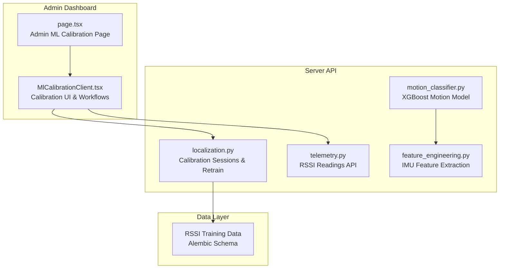
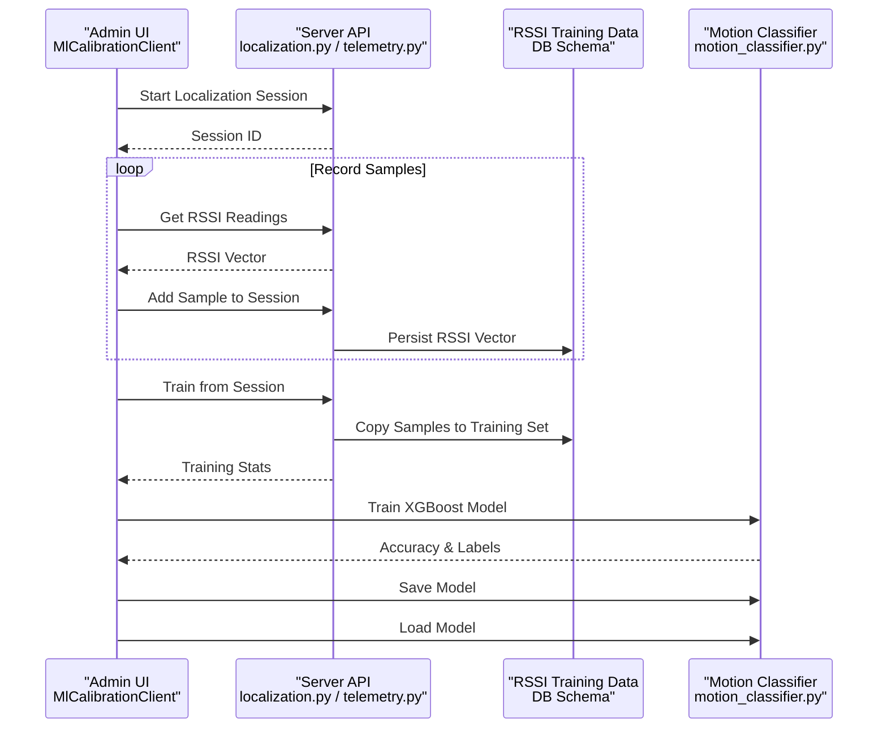
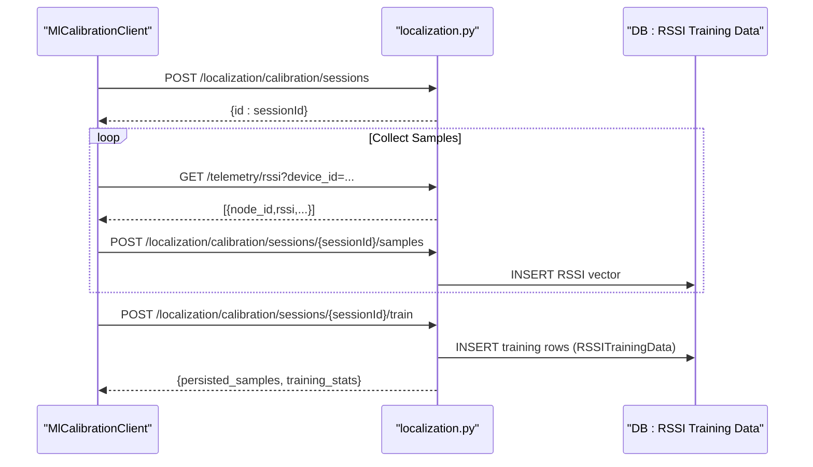
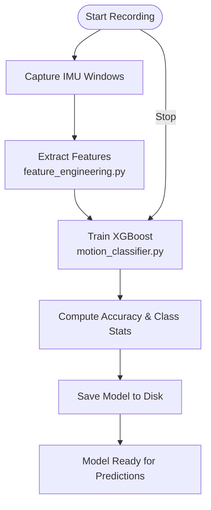
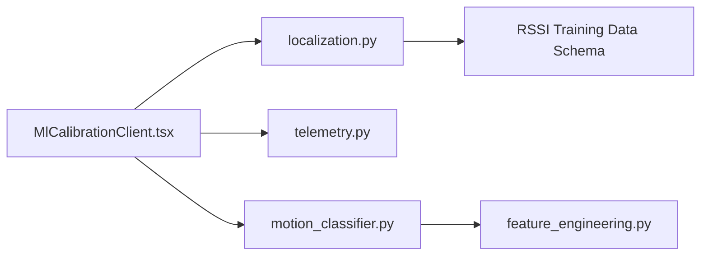

# Machine Learning Calibration

<cite>
**Referenced Files in This Document**
- [page.tsx](file://frontend/app/admin/ml-calibration/page.tsx)
- [MlCalibrationClient.tsx](file://frontend/app/admin/ml-calibration/MlCalibrationClient.tsx)
- [localization.py](file://server/app/api/endpoints/localization.py)
- [telemetry.py](file://server/app/api/endpoints/telemetry.py)
- [motion_classifier.py](file://server/app/motion_classifier.py)
- [feature_engineering.py](file://server/app/feature_engineering.py)
- [openapi.generated.json](file://server/openapi.generated.json)
- [openapi.generated.json](file://frontend/.openapi.json)
- [initial_workspace_schema.py](file://server/alembic/versions/7eb2ee25df34_initial_workspace_schema.py)
</cite>

## Table of Contents
1. [Introduction](#introduction)
2. [Project Structure](#project-structure)
3. [Core Components](#core-components)
4. [Architecture Overview](#architecture-overview)
5. [Detailed Component Analysis](#detailed-component-analysis)
6. [Dependency Analysis](#dependency-analysis)
7. [Performance Considerations](#performance-considerations)
8. [Troubleshooting Guide](#troubleshooting-guide)
9. [Conclusion](#conclusion)

## Introduction
This document describes the Machine Learning Calibration functionality in the Admin Dashboard. It covers the ML calibration interface for room localization and motion detection, including model training, calibration procedures, performance monitoring, and algorithm tuning. It also explains the client implementation, calibration data management, model validation processes, feature engineering integration, and workflow automation for calibration sessions.

## Project Structure
The ML Calibration feature spans the frontend Admin Dashboard and the backend server:
- Frontend: Admin page and client component that orchestrates calibration workflows and displays model status.
- Backend: API endpoints for localization calibration sessions, telemetry ingestion, motion model training and persistence, and localization model retraining.

**Diagram sources**
- [page.tsx:1-5](file://frontend/app/admin/ml-calibration/page.tsx#L1-L5)
- [MlCalibrationClient.tsx:1-974](file://frontend/app/admin/ml-calibration/MlCalibrationClient.tsx#L1-L974)
- [localization.py:233-395](file://server/app/api/endpoints/localization.py#L233-L395)
- [telemetry.py:49-72](file://server/app/api/endpoints/telemetry.py#L49-L72)
- [motion_classifier.py:61-246](file://server/app/motion_classifier.py#L61-L246)
- [feature_engineering.py:25-129](file://server/app/feature_engineering.py#L25-L129)
- [initial_workspace_schema.py:125-144](file://server/alembic/versions/7eb2ee25df34_initial_workspace_schema.py#L125-L144)

**Section sources**
- [page.tsx:1-5](file://frontend/app/admin/ml-calibration/page.tsx#L1-L5)
- [MlCalibrationClient.tsx:1-974](file://frontend/app/admin/ml-calibration/MlCalibrationClient.tsx#L1-L974)

## Core Components
- Admin Calibration UI (MlCalibrationClient): Provides tabbed controls for Localization and Motion calibration, device selection, session management, and model status monitoring.
- Localization Calibration API: Manages calibration sessions, collects RSSI samples, persists training data, and triggers model retraining.
- Telemetry API: Supplies recent RSSI readings for live sample collection during localization calibration.
- Motion Classification API: Trains XGBoost models from IMU feature vectors, saves/loads models, and exposes prediction capabilities.
- Feature Engineering: Converts IMU time-series windows into feature vectors suitable for motion classification.
- Data Schemas: Defines RSSI training data persistence and related indices.

**Section sources**
- [MlCalibrationClient.tsx:104-974](file://frontend/app/admin/ml-calibration/MlCalibrationClient.tsx#L104-L974)
- [localization.py:233-395](file://server/app/api/endpoints/localization.py#L233-L395)
- [telemetry.py:49-72](file://server/app/api/endpoints/telemetry.py#L49-L72)
- [motion_classifier.py:61-246](file://server/app/motion_classifier.py#L61-L246)
- [feature_engineering.py:25-129](file://server/app/feature_engineering.py#L25-L129)
- [initial_workspace_schema.py:125-144](file://server/alembic/versions/7eb2ee25df34_initial_workspace_schema.py#L125-L144)

## Architecture Overview
The Admin Dashboard drives two calibration workflows:
- Localization: Start a session, record RSSI samples from a wheelchair or mobile device, and train a model using collected fingerprints.
- Motion: Record labeled IMU windows, extract features, train an XGBoost classifier, and persist/load the model.

**Diagram sources**
- [MlCalibrationClient.tsx:265-433](file://frontend/app/admin/ml-calibration/MlCalibrationClient.tsx#L265-L433)
- [localization.py:233-395](file://server/app/api/endpoints/localization.py#L233-L395)
- [telemetry.py:49-72](file://server/app/api/endpoints/telemetry.py#L49-L72)
- [motion_classifier.py:61-246](file://server/app/motion_classifier.py#L61-L246)
- [initial_workspace_schema.py:125-144](file://server/alembic/versions/7eb2ee25df34_initial_workspace_schema.py#L125-L144)

## Detailed Component Analysis

### Localization Calibration Workflow
The frontend orchestrates a three-stage process:
1. Start a calibration session bound to a device and optional notes.
2. Record samples by fetching recent RSSI readings and submitting room-labeled fingerprints.
3. Train the localization model using the session’s samples and persist them to the training dataset.

Key behaviors:
- Session lifecycle validation prevents duplicate training or adding samples to non-collecting sessions.
- RSSI vectors are deduplicated by node_id and rounded to integers before submission.
- Training copies session samples into the RSSI training dataset and updates session status.

**Diagram sources**
- [MlCalibrationClient.tsx:265-329](file://frontend/app/admin/ml-calibration/MlCalibrationClient.tsx#L265-L329)
- [localization.py:233-395](file://server/app/api/endpoints/localization.py#L233-L395)
- [telemetry.py:49-72](file://server/app/api/endpoints/telemetry.py#L49-L72)
- [initial_workspace_schema.py:125-144](file://server/alembic/versions/7eb2ee25df34_initial_workspace_schema.py#L125-L144)

**Section sources**
- [MlCalibrationClient.tsx:265-329](file://frontend/app/admin/ml-calibration/MlCalibrationClient.tsx#L265-L329)
- [localization.py:233-395](file://server/app/api/endpoints/localization.py#L233-L395)
- [telemetry.py:49-72](file://server/app/api/endpoints/telemetry.py#L49-L72)

### Motion Classification Workflow
The motion workflow converts IMU windows into feature vectors, trains an XGBoost classifier, and manages model persistence.

Key behaviors:
- Feature extraction builds statistical and frequency-domain features from IMU windows.
- Training supports binary and multi-class classification with configurable parameters.
- Models are saved and loaded per workspace, enabling persistence across restarts.

**Diagram sources**
- [MlCalibrationClient.tsx:387-433](file://frontend/app/admin/ml-calibration/MlCalibrationClient.tsx#L387-L433)
- [motion_classifier.py:61-246](file://server/app/motion_classifier.py#L61-L246)
- [feature_engineering.py:25-129](file://server/app/feature_engineering.py#L25-L129)

**Section sources**
- [MlCalibrationClient.tsx:387-433](file://frontend/app/admin/ml-calibration/MlCalibrationClient.tsx#L387-L433)
- [motion_classifier.py:61-246](file://server/app/motion_classifier.py#L61-L246)
- [feature_engineering.py:25-129](file://server/app/feature_engineering.py#L25-L129)

### Admin Procedures and Controls
- Localization:
  - Start/Stop calibration sessions, record samples, and trigger retraining from the database.
  - Configure localization strategy (KNN fingerprinting vs. strongest RSSI node).
  - Repair readiness to validate and connect the baseline chain (wheelchair → node → room → patient).
- Motion:
  - Start/Stop recording sessions with labeled actions.
  - Train the XGBoost model and save/load models to/from disk.

**Section sources**
- [MlCalibrationClient.tsx:104-974](file://frontend/app/admin/ml-calibration/MlCalibrationClient.tsx#L104-L974)

### Data Management and Persistence
- RSSI training data is stored in a JSONB column with indexed workspace and device fields.
- Calibration sessions capture device context and room labels; training copies samples into the training dataset.

**Section sources**
- [initial_workspace_schema.py:125-144](file://server/alembic/versions/7eb2ee25df34_initial_workspace_schema.py#L125-L144)
- [localization.py:310-395](file://server/app/api/endpoints/localization.py#L310-L395)

## Dependency Analysis
- Frontend depends on server APIs for:
  - Localization calibration sessions and training.
  - Telemetry RSSI retrieval for live sample collection.
  - Motion model training, saving, and loading.
- Backend components:
  - Localization endpoints depend on database schemas for sessions and training data.
  - Motion classifier depends on feature engineering utilities and persists models to disk.

**Diagram sources**
- [MlCalibrationClient.tsx:1-974](file://frontend/app/admin/ml-calibration/MlCalibrationClient.tsx#L1-L974)
- [localization.py:233-395](file://server/app/api/endpoints/localization.py#L233-L395)
- [telemetry.py:49-72](file://server/app/api/endpoints/telemetry.py#L49-L72)
- [motion_classifier.py:61-246](file://server/app/motion_classifier.py#L61-L246)
- [feature_engineering.py:25-129](file://server/app/feature_engineering.py#L25-L129)
- [initial_workspace_schema.py:125-144](file://server/alembic/versions/7eb2ee25df34_initial_workspace_schema.py#L125-L144)

**Section sources**
- [MlCalibrationClient.tsx:1-974](file://frontend/app/admin/ml-calibration/MlCalibrationClient.tsx#L1-L974)
- [localization.py:233-395](file://server/app/api/endpoints/localization.py#L233-L395)
- [telemetry.py:49-72](file://server/app/api/endpoints/telemetry.py#L49-L72)
- [motion_classifier.py:61-246](file://server/app/motion_classifier.py#L61-L246)
- [feature_engineering.py:25-129](file://server/app/feature_engineering.py#L25-L129)
- [initial_workspace_schema.py:125-144](file://server/alembic/versions/7eb2ee25df34_initial_workspace_schema.py#L125-L144)

## Performance Considerations
- RSSI Sampling: Limit the number of RSSI readings fetched per sample to reduce payload size and latency.
- Training Batching: Prefer retraining from the database after sufficient samples are accumulated to avoid frequent small retraining cycles.
- Motion Training: Use adequate sample sizes per class and consider stratified splits for balanced evaluation.
- Model Persistence: Save models after successful training to minimize repeated training overhead.

## Troubleshooting Guide
Common issues and resolutions:
- No RSSI readings found: Ensure the device is online and publishing RSSI; verify device_id and limits.
- Session not in collecting state: Confirm the session exists and is not already trained.
- Validation errors on sample submission: Ensure rssi_vector is non-empty and room_id belongs to the current workspace.
- Motion model not trained: Verify sufficient labeled samples and correct labels; check class balance.
- Model load failures: Confirm model and encoder files exist on disk for the workspace.

**Section sources**
- [MlCalibrationClient.tsx:276-315](file://frontend/app/admin/ml-calibration/MlCalibrationClient.tsx#L276-L315)
- [localization.py:290-329](file://server/app/api/endpoints/localization.py#L290-L329)
- [motion_classifier.py:204-246](file://server/app/motion_classifier.py#L204-L246)

## Conclusion
The Admin Dashboard provides a comprehensive interface for ML calibration across localization and motion domains. It integrates with backend APIs to manage calibration sessions, collect and persist training data, and train or load models. The system supports automation via retraining from stored data and offers robust controls for strategy configuration, readiness validation, and performance monitoring.