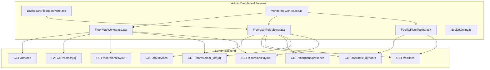
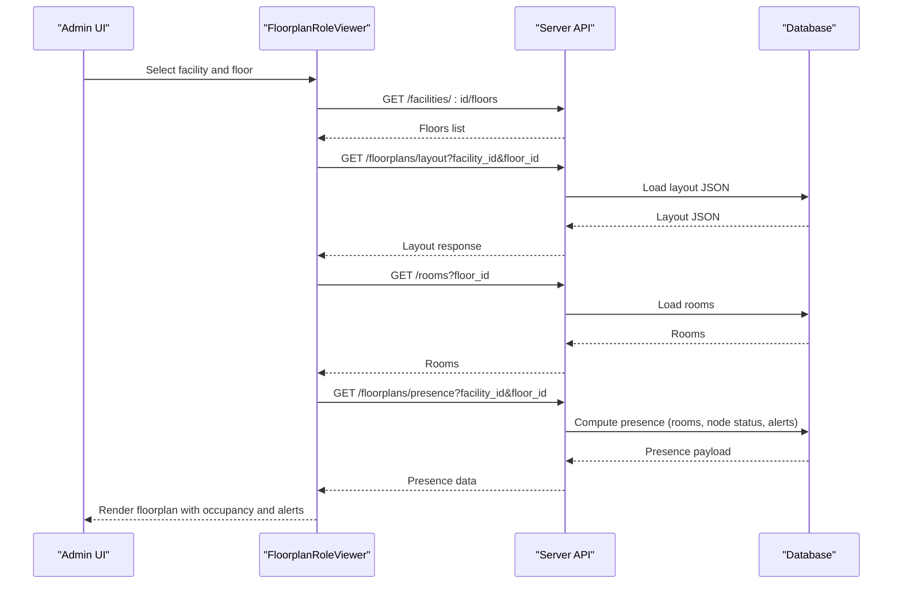
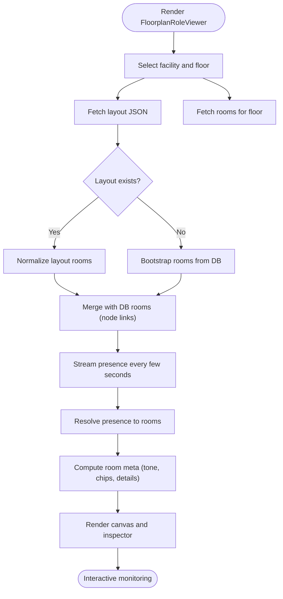
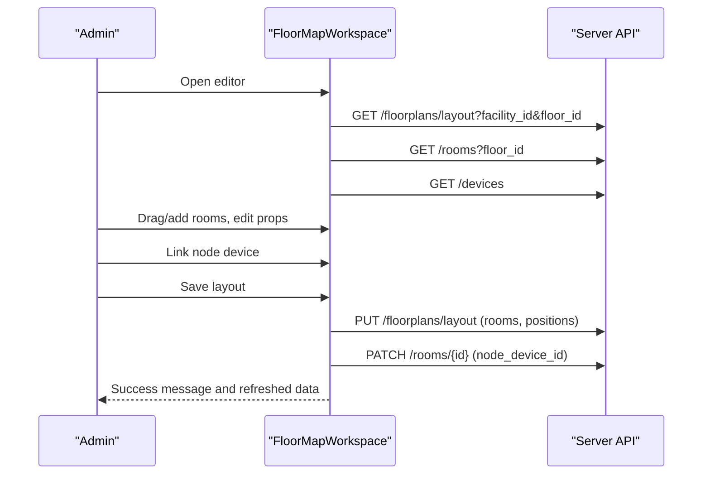
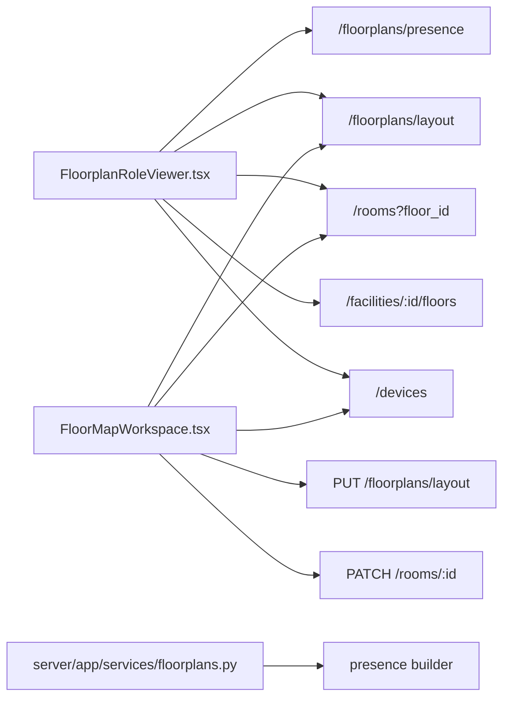

# Operations Monitoring

<cite>
**Referenced Files in This Document**
- [DashboardFloorplanPanel.tsx](file://frontend/components/dashboard/DashboardFloorplanPanel.tsx)
- [FloorMapWorkspace.tsx](file://frontend/components/admin/monitoring/FloorMapWorkspace.tsx)
- [FacilityFloorToolbar.tsx](file://frontend/components/admin/monitoring/FacilityFloorToolbar.tsx)
- [FloorplanRoleViewer.tsx](file://frontend/components/floorplan/FloorplanRoleViewer.tsx)
- [monitoringWorkspace.ts](file://frontend/lib/monitoringWorkspace.ts)
- [deviceOnline.ts](file://frontend/lib/deviceOnline.ts)
- [floorplans.py](file://server/app/services/floorplans.py)
- [page.tsx](file://frontend/app/admin/monitoring/page.tsx)
</cite>

## Table of Contents
1. [Introduction](#introduction)
2. [Project Structure](#project-structure)
3. [Core Components](#core-components)
4. [Architecture Overview](#architecture-overview)
5. [Detailed Component Analysis](#detailed-component-analysis)
6. [Dependency Analysis](#dependency-analysis)
7. [Performance Considerations](#performance-considerations)
8. [Troubleshooting Guide](#troubleshooting-guide)
9. [Conclusion](#conclusion)

## Introduction
This document describes the Operations Monitoring dashboard in the Admin Dashboard, focusing on the live floorplan monitoring interface. It explains real-time device presence tracking, room occupancy visualization, and system-wide operational status. It documents the dashboard floorplan panel implementation, real-time data updates, and spatial visualization techniques. It also covers the monitoring workspace integration, live data streaming, and alert visualization capabilities. Finally, it provides examples of admin procedures for monitoring facility operations, tracking device locations, identifying system issues, and coordinating operational responses in real-time.

## Project Structure
The monitoring dashboard spans React components in the frontend and backend services in the server. The frontend composes:
- A role-aware floorplan viewer that renders live presence and room metadata
- An admin-only floor map workspace for editing floor layouts and assigning devices
- A toolbar for selecting facility, floor, and view mode
- Utilities for parsing and building monitoring workspace URLs

The backend exposes endpoints for retrieving floorplan layouts, rooms, and presence data, and orchestrates presence computation for a facility/floor.

**Diagram sources**
- [DashboardFloorplanPanel.tsx:1-29](file://frontend/components/dashboard/DashboardFloorplanPanel.tsx#L1-L29)
- [FloorplanRoleViewer.tsx:567-702](file://frontend/components/floorplan/FloorplanRoleViewer.tsx#L567-L702)
- [FloorMapWorkspace.tsx:87-160](file://frontend/components/admin/monitoring/FloorMapWorkspace.tsx#L87-L160)
- [FacilityFloorToolbar.tsx:21-117](file://frontend/components/admin/monitoring/FacilityFloorToolbar.tsx#L21-L117)
- [monitoringWorkspace.ts:32-138](file://frontend/lib/monitoringWorkspace.ts#L32-L138)
- [deviceOnline.ts:1-7](file://frontend/lib/deviceOnline.ts#L1-L7)
- [floorplans.py:42-61](file://server/app/services/floorplans.py#L42-L61)

**Section sources**
- [DashboardFloorplanPanel.tsx:1-29](file://frontend/components/dashboard/DashboardFloorplanPanel.tsx#L1-L29)
- [FloorplanRoleViewer.tsx:567-702](file://frontend/components/floorplan/FloorplanRoleViewer.tsx#L567-L702)
- [FloorMapWorkspace.tsx:87-160](file://frontend/components/admin/monitoring/FloorMapWorkspace.tsx#L87-L160)
- [FacilityFloorToolbar.tsx:21-117](file://frontend/components/admin/monitoring/FacilityFloorToolbar.tsx#L21-L117)
- [monitoringWorkspace.ts:32-138](file://frontend/lib/monitoringWorkspace.ts#L32-L138)
- [deviceOnline.ts:1-7](file://frontend/lib/deviceOnline.ts#L1-L7)
- [floorplans.py:42-61](file://server/app/services/floorplans.py#L42-L61)

## Core Components
- DashboardFloorplanPanel: Thin wrapper around FloorplanRoleViewer, enabling presence rendering and optional initial selections.
- FloorplanRoleViewer: Reads facility/floor selection, fetches layout and rooms, streams presence, computes room metadata (occupancy, alerts, prediction chips), and renders a floorplan canvas with room cards and inspector.
- FloorMapWorkspace: Admin-only editor for floor layouts, devices, and room assignments; supports saving layout, linking node devices, and assigning patients to rooms.
- FacilityFloorToolbar: Provides facility and floor selectors and toggles between list and map views.
- monitoringWorkspace utilities: Parse and build monitoring workspace URL state; legacy tab redirection; room ID parsing helpers.
- deviceOnline: Defines the online window for device status.

**Section sources**
- [DashboardFloorplanPanel.tsx:13-29](file://frontend/components/dashboard/DashboardFloorplanPanel.tsx#L13-L29)
- [FloorplanRoleViewer.tsx:567-800](file://frontend/components/floorplan/FloorplanRoleViewer.tsx#L567-L800)
- [FloorMapWorkspace.tsx:77-160](file://frontend/components/admin/monitoring/FloorMapWorkspace.tsx#L77-L160)
- [FacilityFloorToolbar.tsx:21-117](file://frontend/components/admin/monitoring/FacilityFloorToolbar.tsx#L21-L117)
- [monitoringWorkspace.ts:32-145](file://frontend/lib/monitoringWorkspace.ts#L32-L145)
- [deviceOnline.ts:1-7](file://frontend/lib/deviceOnline.ts#L1-L7)

## Architecture Overview
The monitoring dashboard integrates three primary data streams:
- Layout and rooms: static or editable floor geometry and room registry
- Presence: live occupancy and device status per room
- Smart devices: Home Assistant device states linked to rooms

**Diagram sources**
- [FloorplanRoleViewer.tsx:616-702](file://frontend/components/floorplan/FloorplanRoleViewer.tsx#L616-L702)
- [floorplans.py:42-61](file://server/app/services/floorplans.py#L42-L61)

## Detailed Component Analysis

### DashboardFloorplanPanel
- Purpose: Provide a presence-enabled floorplan panel for dashboards by delegating to FloorplanRoleViewer.
- Behavior: Accepts initial facility, floor, and room parameters; passes them through to the role viewer.

**Section sources**
- [DashboardFloorplanPanel.tsx:13-29](file://frontend/components/dashboard/DashboardFloorplanPanel.tsx#L13-L29)

### FloorplanRoleViewer
- Responsibilities:
  - Manage facility and floor selection and derive effective IDs
  - Fetch layout and rooms; fallback to DB-backed rooms if layout is empty
  - Stream presence data at short intervals
  - Resolve presence to rooms via numeric IDs, node device IDs, or labels
  - Build room metadata (occupancy badges, alert counts, prediction chips, node status tone)
  - Render a floorplan canvas and a room inspector with occupancy lists, telemetry, smart devices, and camera snapshots
- Real-time updates:
  - Presence polling interval configured to a short cadence
  - Refetch on window focus and reconnect
- Spatial visualization:
  - Uses normalized room shapes from layout or DB bootstrap
  - Computes room meta for color tones and chips
- Alert visualization:
  - Critical tone when alerts exist or node is offline/unmapped
  - Warning tone for stale nodes
  - Success tone for occupied rooms

**Diagram sources**
- [FloorplanRoleViewer.tsx:616-702](file://frontend/components/floorplan/FloorplanRoleViewer.tsx#L616-L702)
- [FloorplanRoleViewer.tsx:722-780](file://frontend/components/floorplan/FloorplanRoleViewer.tsx#L722-L780)

**Section sources**
- [FloorplanRoleViewer.tsx:567-800](file://frontend/components/floorplan/FloorplanRoleViewer.tsx#L567-L800)
- [FloorplanRoleViewer.tsx:722-780](file://frontend/components/floorplan/FloorplanRoleViewer.tsx#L722-L780)

### FloorMapWorkspace (Admin)
- Purpose: Admin-only floor map editor for creating, editing, and saving room shapes; linking node devices; assigning patients; and provisioning unmapped rooms.
- Key flows:
  - Load layout and rooms; merge node device IDs from DB rooms into layout shapes
  - Save layout: normalize room IDs, align shapes to registered devices, PUT layout, PATCH room node_device_id fields
  - Provision unmapped nodes into rooms via a helper that creates missing rooms
  - Device assignment: filter devices by hardware category and search term; link selected device to room
  - Patient assignment: search and assign a patient to the selected room
- Real-time integration:
  - Polls devices, rooms, and facilities
  - Invalidates queries after save to refresh dependent panels

**Diagram sources**
- [FloorMapWorkspace.tsx:118-160](file://frontend/components/admin/monitoring/FloorMapWorkspace.tsx#L118-L160)
- [FloorMapWorkspace.tsx:355-441](file://frontend/components/admin/monitoring/FloorMapWorkspace.tsx#L355-L441)

**Section sources**
- [FloorMapWorkspace.tsx:77-160](file://frontend/components/admin/monitoring/FloorMapWorkspace.tsx#L77-L160)
- [FloorMapWorkspace.tsx:355-441](file://frontend/components/admin/monitoring/FloorMapWorkspace.tsx#L355-L441)

### FacilityFloorToolbar
- Purpose: Unified toolbar for facility and floor selection and view mode toggle (list/map).
- Behavior: Disables floor selector until facility is chosen; disables itself while loading; toggles view mode and persists in URL.

**Section sources**
- [FacilityFloorToolbar.tsx:21-117](file://frontend/components/admin/monitoring/FacilityFloorToolbar.tsx#L21-L117)

### Monitoring Workspace Utilities
- URL contract and helpers:
  - Parse monitoring query parameters (facility, floor, room, view)
  - Build monitoring search params and href
  - Legacy tab redirection logic
  - Room ID parsing helper for layout IDs

**Section sources**
- [monitoringWorkspace.ts:32-145](file://frontend/lib/monitoringWorkspace.ts#L32-L145)

### Device Online Window
- Defines the time window for considering a device “online” based on last-seen timestamps.

**Section sources**
- [deviceOnline.ts:1-7](file://frontend/lib/deviceOnline.ts#L1-L7)

## Dependency Analysis
- Frontend-to-backend dependencies:
  - Presence endpoint depends on facility and floor selection
  - Layout and rooms endpoints depend on floor selection
  - Admin save operations depend on device registry and room registry
- Backend presence computation:
  - Builds presence scoped to workspace and facility/floor
  - Aggregates room-level metrics (occupancy, alerts, staleness)

**Diagram sources**
- [FloorplanRoleViewer.tsx:616-702](file://frontend/components/floorplan/FloorplanRoleViewer.tsx#L616-L702)
- [FloorMapWorkspace.tsx:118-160](file://frontend/components/admin/monitoring/FloorMapWorkspace.tsx#L118-L160)
- [floorplans.py:42-61](file://server/app/services/floorplans.py#L42-L61)

**Section sources**
- [FloorplanRoleViewer.tsx:616-702](file://frontend/components/floorplan/FloorplanRoleViewer.tsx#L616-L702)
- [FloorMapWorkspace.tsx:118-160](file://frontend/components/admin/monitoring/FloorMapWorkspace.tsx#L118-L160)
- [floorplans.py:42-61](file://server/app/services/floorplans.py#L42-L61)

## Performance Considerations
- Polling intervals:
  - Presence is polled frequently to keep the interface responsive; adjust intervals based on backend load and network conditions.
- Staleness thresholds:
  - Node staleness is derived from staleness seconds; tune thresholds to balance responsiveness and noise.
- Query caching:
  - Use appropriate stale times for facility/floor lists and rooms to minimize redundant requests.
- Canvas normalization:
  - Normalizing room shapes and aligning to registry devices reduces layout inconsistencies and improves save performance.

## Troubleshooting Guide
- No layout shown:
  - If layout JSON is empty, the component falls back to DB-backed rooms; verify rooms exist for the selected floor.
- Stale or offline nodes:
  - Nodes marked stale or offline indicate telemetry gaps; check device connectivity and localization setup.
- Alerts present:
  - Rooms with alerts require immediate review; use the inspector to see alert counts and occupancy.
- Save failures:
  - Saving layout may partially succeed if room-node patching fails; inspect messages and retry.
- Device search yields no matches:
  - Narrow by hardware category or device type; ensure devices are registered and linked to rooms.

**Section sources**
- [FloorplanRoleViewer.tsx:123-140](file://frontend/components/floorplan/FloorplanRoleViewer.tsx#L123-L140)
- [FloorMapWorkspace.tsx:355-441](file://frontend/components/admin/monitoring/FloorMapWorkspace.tsx#L355-L441)

## Conclusion
The Operations Monitoring dashboard combines a role-aware floorplan viewer with admin capabilities to deliver live floorplan monitoring. It visualizes real-time device presence, room occupancy, and system-wide operational status, while enabling administrators to manage floor layouts, assign devices, and coordinate responses. The modular design separates concerns between read-only monitoring and write-enabled workspace editing, ensuring clarity and maintainability.