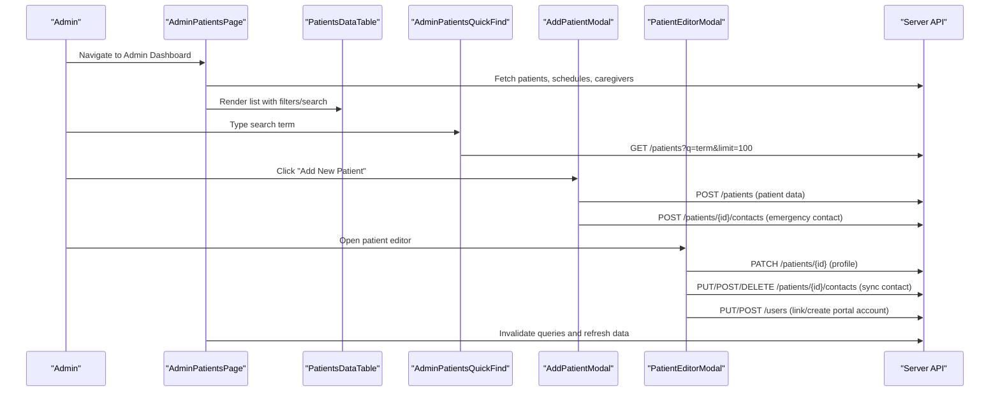
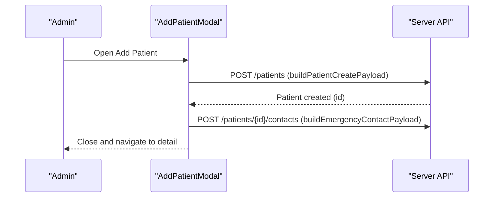
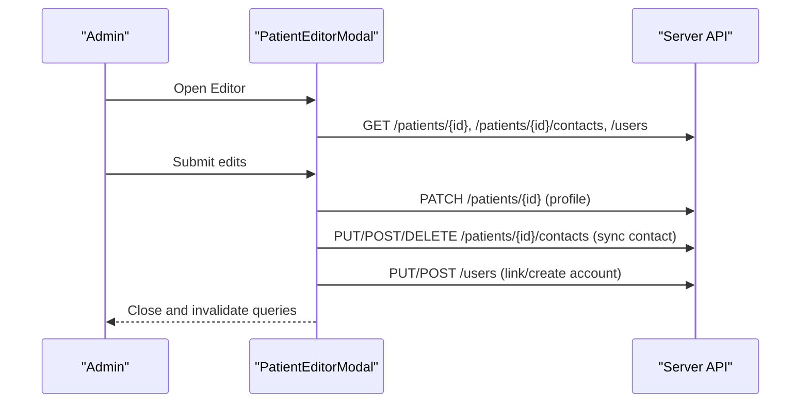
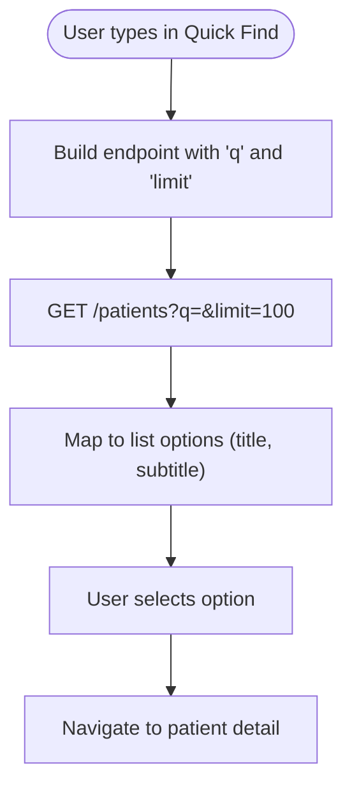
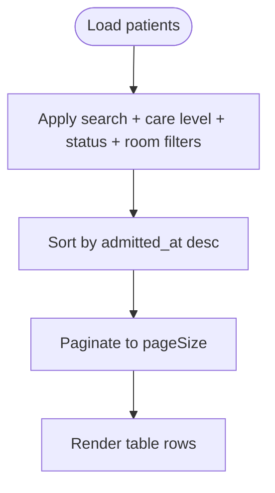
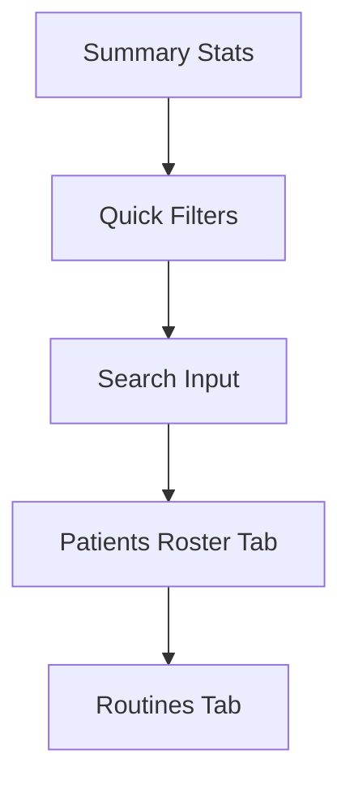
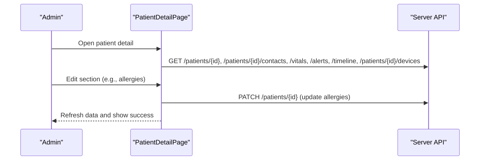
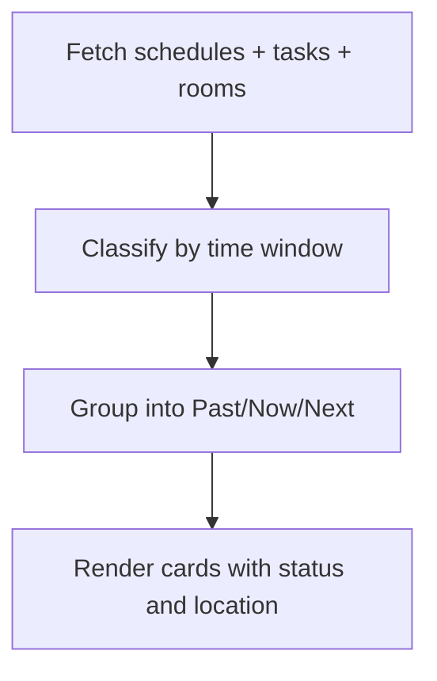
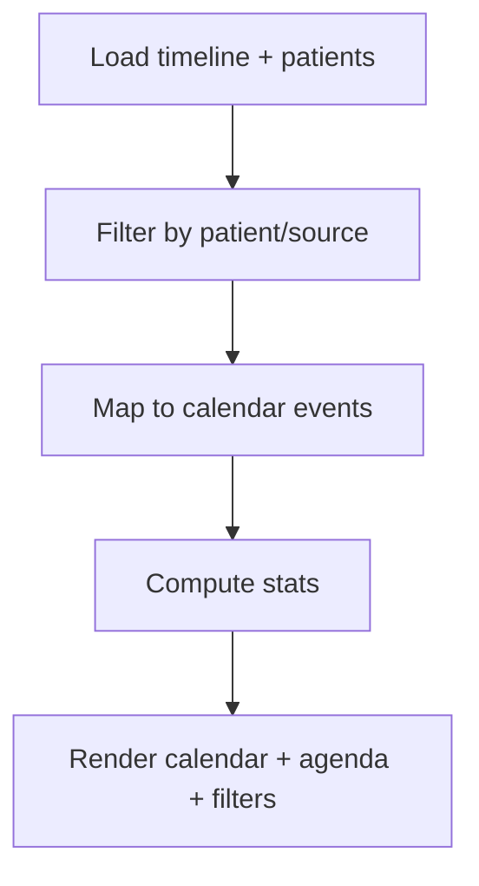
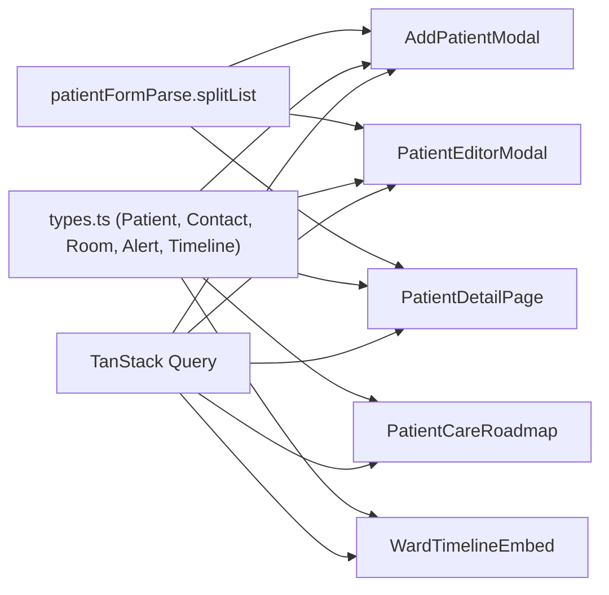

# Patient Registry Management

<cite>
**Referenced Files in This Document**
- [AddPatientModal.tsx](file://frontend/components/admin/patients/AddPatientModal.tsx)
- [PatientEditorModal.tsx](file://frontend/components/admin/patients/PatientEditorModal.tsx)
- [AdminPatientsQuickFind.tsx](file://frontend/components/admin/patients/AdminPatientsQuickFind.tsx)
- [PatientsDataTable.tsx](file://frontend/components/admin/patients/PatientsDataTable.tsx)
- [AdminPatientsPage.tsx](file://frontend/app/admin/patients/page.tsx)
- [PatientDetailPage.tsx](file://frontend/app/admin/patients/[id]/page.tsx)
- [PatientCareRoadmap.tsx](file://frontend/components/patient/PatientCareRoadmap.tsx)
- [WardTimelineEmbed.tsx](file://frontend/components/timeline/WardTimelineEmbed.tsx)
- [patientFormParse.ts](file://frontend/lib/patientFormParse.ts)
- [types.ts](file://frontend/lib/types.ts)
</cite>

## Table of Contents
1. [Introduction](#introduction)
2. [Project Structure](#project-structure)
3. [Core Components](#core-components)
4. [Architecture Overview](#architecture-overview)
5. [Detailed Component Analysis](#detailed-component-analysis)
6. [Dependency Analysis](#dependency-analysis)
7. [Performance Considerations](#performance-considerations)
8. [Troubleshooting Guide](#troubleshooting-guide)
9. [Conclusion](#conclusion)

## Introduction
This document describes the Patient Registry Management system within the Admin Dashboard. It covers the end-to-end lifecycle of patient records: onboarding new patients, editing profiles, linking emergency contacts, assigning rooms, and tracking patient status. It also documents advanced features such as quick find, search and filtering, care pathway coordination via the patient roadmap, and integration with the ward timeline. The goal is to provide both technical depth and practical guidance for administrators performing daily workflows.

## Project Structure
The Patient Registry Management system spans UI components, pages, and shared utilities:
- Admin-facing pages orchestrate queries, filters, and navigation
- Modal components encapsulate complex forms for creation and editing
- Shared utilities parse free-form lists and define typed data contracts
- Integrations expose care pathways and timeline views for coordinated care

```mermaid
graph TB
subgraph "Admin Dashboard"
AdminPage["AdminPatientsPage<br/>List + Filters + Rosters"]
DetailPage["PatientDetailPage<br/>Profile + Charts + Schedules"]
QuickFind["AdminPatientsQuickFind<br/>Quick Search"]
end
subgraph "Modals"
AddModal["AddPatientModal<br/>Registration Form"]
EditModal["PatientEditorModal<br/>Profile + Contact + Account"]
end
subgraph "Shared Components"
DataTable["PatientsDataTable<br/>Search + Sort + Pagination"]
Roadmap["PatientCareRoadmap<br/>Care Pathway"]
Timeline["WardTimelineEmbed<br/>Ward Activity"]
ParseUtils["patientFormParse<br/>List Splitter"]
end
subgraph "Types"
Types["types.ts<br/>Patient + Contact + Room + Alerts"]
end
AdminPage --> DataTable
AdminPage --> QuickFind
AdminPage --> AddModal
AdminPage --> EditModal
DetailPage --> Roadmap
DetailPage --> Timeline
AddModal --> ParseUtils
EditModal --> ParseUtils
DataTable --> Types
Roadmap --> Types
Timeline --> Types
```

**Diagram sources**
- [AdminPatientsPage.tsx:116-742](file://frontend/app/admin/patients/page.tsx#L116-L742)
- [PatientDetailPage.tsx:141-1426](file://frontend/app/admin/patients/[id]/page.tsx#L141-L1426)
- [AdminPatientsQuickFind.tsx:19-110](file://frontend/components/admin/patients/AdminPatientsQuickFind.tsx#L19-L110)
- [AddPatientModal.tsx:51-543](file://frontend/components/admin/patients/AddPatientModal.tsx#L51-L543)
- [PatientEditorModal.tsx:245-911](file://frontend/components/admin/patients/PatientEditorModal.tsx#L245-L911)
- [PatientsDataTable.tsx:60-282](file://frontend/components/admin/patients/PatientsDataTable.tsx#L60-L282)
- [PatientCareRoadmap.tsx:65-293](file://frontend/components/patient/PatientCareRoadmap.tsx#L65-L293)
- [WardTimelineEmbed.tsx:30-225](file://frontend/components/timeline/WardTimelineEmbed.tsx#L30-L225)
- [patientFormParse.ts:5-11](file://frontend/lib/patientFormParse.ts#L5-L11)
- [types.ts:54-90](file://frontend/lib/types.ts#L54-L90)

**Section sources**
- [AdminPatientsPage.tsx:116-742](file://frontend/app/admin/patients/page.tsx#L116-L742)
- [PatientDetailPage.tsx:141-1426](file://frontend/app/admin/patients/[id]/page.tsx#L141-L1426)
- [AdminPatientsQuickFind.tsx:19-110](file://frontend/components/admin/patients/AdminPatientsQuickFind.tsx#L19-L110)
- [AddPatientModal.tsx:51-543](file://frontend/components/admin/patients/AddPatientModal.tsx#L51-L543)
- [PatientEditorModal.tsx:245-911](file://frontend/components/admin/patients/PatientEditorModal.tsx#L245-L911)
- [PatientsDataTable.tsx:60-282](file://frontend/components/admin/patients/PatientsDataTable.tsx#L60-L282)
- [PatientCareRoadmap.tsx:65-293](file://frontend/components/patient/PatientCareRoadmap.tsx#L65-L293)
- [WardTimelineEmbed.tsx:30-225](file://frontend/components/timeline/WardTimelineEmbed.tsx#L30-L225)
- [patientFormParse.ts:5-11](file://frontend/lib/patientFormParse.ts#L5-L11)
- [types.ts:54-90](file://frontend/lib/types.ts#L54-L90)

## Core Components
- AddPatientModal: Full-featured patient registration form with identity, demographics, medical history, surgeries, medications, emergency contact, and notes. Uses Zod validation and React Hook Form with field arrays for dynamic rows.
- PatientEditorModal: Comprehensive editor for existing patients, supporting profile updates, emergency contact synchronization, and portal account linkage or creation.
- AdminPatientsQuickFind: Real-time quick search over patients with a searchable combobox, enabling rapid navigation to patient records.
- PatientsDataTable: Grid view with search, filtering by care level/status/room assignment, sorting, and pagination.
- AdminPatientsPage: Dashboard with statistics, quick filters, search, and tabs for patient roster and upcoming care routines.
- PatientDetailPage: Rich patient detail view with editable sections, vitals, alerts, timeline, devices, and integrated scheduling.
- PatientCareRoadmap: Care pathway visualization grouped into past, now, and next activities for the patient.
- WardTimelineEmbed: Ward-level timeline aggregation with filtering by patient and source, plus calendar/agenda views.

**Section sources**
- [AddPatientModal.tsx:51-543](file://frontend/components/admin/patients/AddPatientModal.tsx#L51-L543)
- [PatientEditorModal.tsx:245-911](file://frontend/components/admin/patients/PatientEditorModal.tsx#L245-L911)
- [AdminPatientsQuickFind.tsx:19-110](file://frontend/components/admin/patients/AdminPatientsQuickFind.tsx#L19-L110)
- [PatientsDataTable.tsx:60-282](file://frontend/components/admin/patients/PatientsDataTable.tsx#L60-L282)
- [AdminPatientsPage.tsx:116-742](file://frontend/app/admin/patients/page.tsx#L116-L742)
- [PatientDetailPage.tsx:141-1426](file://frontend/app/admin/patients/[id]/page.tsx#L141-L1426)
- [PatientCareRoadmap.tsx:65-293](file://frontend/components/patient/PatientCareRoadmap.tsx#L65-L293)
- [WardTimelineEmbed.tsx:30-225](file://frontend/components/timeline/WardTimelineEmbed.tsx#L30-L225)

## Architecture Overview
The system follows a layered pattern:
- UI Layer: Next.js app router pages and client components
- Forms Layer: React Hook Form + Zod for validation and controlled inputs
- Services Layer: TanStack Query for caching, invalidation, and optimistic updates
- API Layer: Strongly typed requests and responses via shared types
- Integration Layer: Room assignment, care schedules, timeline, and alerts



**Diagram sources**
- [AdminPatientsPage.tsx:134-187](file://frontend/app/admin/patients/page.tsx#L134-L187)
- [PatientsDataTable.tsx:74-84](file://frontend/components/admin/patients/PatientsDataTable.tsx#L74-L84)
- [AdminPatientsQuickFind.tsx:31-38](file://frontend/components/admin/patients/AdminPatientsQuickFind.tsx#L31-L38)
- [AddPatientModal.tsx:97-130](file://frontend/components/admin/patients/AddPatientModal.tsx#L97-L130)
- [PatientEditorModal.tsx:480-549](file://frontend/components/admin/patients/PatientEditorModal.tsx#L480-L549)
- [types.ts:54-90](file://frontend/lib/types.ts#L54-L90)

## Detailed Component Analysis

### AddPatientModal: Patient Registration
- Purpose: Capture standardized patient intake with identity, demographics, physical attributes, medical history, surgeries, medications, emergency contact, and notes.
- Validation: Zod schema enforces required fields and formats; React Hook Form manages state and errors.
- Dynamic Rows: Field arrays enable adding/removing multiple surgeries and medications.
- Emergency Contact: Built from form values and posted as a separate endpoint after patient creation.
- Cleanup: On failure, attempts to delete the partially created patient record.



**Diagram sources**
- [AddPatientModal.tsx:97-130](file://frontend/components/admin/patients/AddPatientModal.tsx#L97-L130)

**Section sources**
- [AddPatientModal.tsx:51-543](file://frontend/components/admin/patients/AddPatientModal.tsx#L51-L543)
- [patientFormParse.ts:5-11](file://frontend/lib/patientFormParse.ts#L5-L11)
- [types.ts:54-90](file://frontend/lib/types.ts#L54-L90)

### PatientEditorModal: Profile Editing and Room Assignment
- Purpose: Edit patient profile, manage emergency contact, and link/manage portal accounts.
- Multi-stage Save: Patient profile → Contact sync → Account sync, each stage validated independently.
- Room Assignment: Populated from room list; supports "no room" selection.
- Account Modes: Unlink, link existing, or create new portal account with role and credentials.
- Validation: Zod refinements enforce paired emergency contact fields and minimum length constraints.



**Diagram sources**
- [PatientEditorModal.tsx:299-549](file://frontend/components/admin/patients/PatientEditorModal.tsx#L299-L549)

**Section sources**
- [PatientEditorModal.tsx:245-911](file://frontend/components/admin/patients/PatientEditorModal.tsx#L245-L911)
- [types.ts:54-90](file://frontend/lib/types.ts#L54-L90)

### AdminPatientsQuickFind: Quick Find Capabilities
- Purpose: Provide instant search over patients with live suggestions and quick navigation.
- Behavior: Queries server with a search term and limit; presents selectable options with title/subtitle; opens selected patient detail on action.



**Diagram sources**
- [AdminPatientsQuickFind.tsx:24-38](file://frontend/components/admin/patients/AdminPatientsQuickFind.tsx#L24-L38)

**Section sources**
- [AdminPatientsQuickFind.tsx:19-110](file://frontend/components/admin/patients/AdminPatientsQuickFind.tsx#L19-L110)

### PatientsDataTable: Search, Filtering, and Room Assignment Tracking
- Purpose: Present a paginated, sortable table of patients with search and filter controls.
- Features: Search by name/id; filter by care level, active status, and room assignment (assigned/unassigned/all).
- Room Tracking: Displays room ID or "no room" indicator; badges reflect status.



**Diagram sources**
- [PatientsDataTable.tsx:74-195](file://frontend/components/admin/patients/PatientsDataTable.tsx#L74-L195)

**Section sources**
- [PatientsDataTable.tsx:60-282](file://frontend/components/admin/patients/PatientsDataTable.tsx#L60-L282)

### AdminPatientsPage: Dashboard, Stats, and Rosters
- Purpose: Admin overview with summary cards, quick filters, search, and tabs for patient roster and upcoming routines.
- Rosters: Displays patient rows with care level, room assignment, assigned caregivers, admission date, and status.
- Routines: Aggregates workflow schedules into upcoming and all categories with color-coded types.



**Diagram sources**
- [AdminPatientsPage.tsx:456-677](file://frontend/app/admin/patients/page.tsx#L456-L677)

**Section sources**
- [AdminPatientsPage.tsx:116-742](file://frontend/app/admin/patients/page.tsx#L116-L742)

### PatientDetailPage: Comprehensive Profile and Care Coordination
- Purpose: Single-patient view with editable sections, vitals, alerts, timeline, devices, and integrated scheduling.
- Editable Sections: About, chronic conditions, allergies, medications, emergency contact, notes.
- Emergency Contact: Editable inline; enforces paired name/phone validation.
- Devices and Alerts: Display latest readings and alerts.
- Timeline: Shows recent activity with filtering and calendar/agenda views.
- Scheduling: Calendar integration for creating/editing care schedules.



**Diagram sources**
- [PatientDetailPage.tsx:210-262](file://frontend/app/admin/patients/[id]/page.tsx#L210-L262)
- [PatientDetailPage.tsx:431-543](file://frontend/app/admin/patients/[id]/page.tsx#L431-L543)

**Section sources**
- [PatientDetailPage.tsx:141-1426](file://frontend/app/admin/patients/[id]/page.tsx#L141-L1426)
- [types.ts:54-90](file://frontend/lib/types.ts#L54-L90)

### PatientCareRoadmap: Care Pathway Coordination
- Purpose: Visualize care pathway across past, current, and upcoming activities for a patient.
- Data: Combines workflow schedules and tasks; classifies by time window; displays room and status.
- Integration: Consumes room metadata to label locations.



**Diagram sources**
- [PatientCareRoadmap.tsx:68-132](file://frontend/components/patient/PatientCareRoadmap.tsx#L68-L132)

**Section sources**
- [PatientCareRoadmap.tsx:65-293](file://frontend/components/patient/PatientCareRoadmap.tsx#L65-L293)
- [types.ts:54-90](file://frontend/lib/types.ts#L54-L90)

### WardTimelineEmbed: Ward-Level Timeline Integration
- Purpose: Aggregate timeline events across the ward with filtering by patient/source.
- Features: Stats cards, filter pickers, calendar view, and agenda view.
- Integration: Builds patient name map and event objects for calendar rendering.



**Diagram sources**
- [WardTimelineEmbed.tsx:37-96](file://frontend/components/timeline/WardTimelineEmbed.tsx#L37-L96)

**Section sources**
- [WardTimelineEmbed.tsx:30-225](file://frontend/components/timeline/WardTimelineEmbed.tsx#L30-L225)
- [types.ts:309-321](file://frontend/lib/types.ts#L309-L321)

## Dependency Analysis
- Form Parsing: Free-form list fields are split using a unified parser to normalize entries for storage.
- Type Safety: Shared types define patient, contact, room, alert, and timeline structures to prevent runtime mismatches.
- Query Dependencies: Modals and pages rely on TanStack Query for fetching, caching, and invalidating data after mutations.
- Room Assignment: Editor modal reads room options and supports "no room" selection; detail page surfaces room metadata.



**Diagram sources**
- [patientFormParse.ts:5-11](file://frontend/lib/patientFormParse.ts#L5-L11)
- [types.ts:54-90](file://frontend/lib/types.ts#L54-L90)
- [AddPatientModal.tsx:51-543](file://frontend/components/admin/patients/AddPatientModal.tsx#L51-L543)
- [PatientEditorModal.tsx:245-911](file://frontend/components/admin/patients/PatientEditorModal.tsx#L245-L911)
- [PatientDetailPage.tsx:141-1426](file://frontend/app/admin/patients/[id]/page.tsx#L141-L1426)
- [PatientCareRoadmap.tsx:65-293](file://frontend/components/patient/PatientCareRoadmap.tsx#L65-L293)
- [WardTimelineEmbed.tsx:30-225](file://frontend/components/timeline/WardTimelineEmbed.tsx#L30-L225)

**Section sources**
- [patientFormParse.ts:5-11](file://frontend/lib/patientFormParse.ts#L5-L11)
- [types.ts:54-90](file://frontend/lib/types.ts#L54-L90)
- [AddPatientModal.tsx:51-543](file://frontend/components/admin/patients/AddPatientModal.tsx#L51-L543)
- [PatientEditorModal.tsx:245-911](file://frontend/components/admin/patients/PatientEditorModal.tsx#L245-L911)
- [PatientDetailPage.tsx:141-1426](file://frontend/app/admin/patients/[id]/page.tsx#L141-L1426)
- [PatientCareRoadmap.tsx:65-293](file://frontend/components/patient/PatientCareRoadmap.tsx#L65-L293)
- [WardTimelineEmbed.tsx:30-225](file://frontend/components/timeline/WardTimelineEmbed.tsx#L30-L225)

## Performance Considerations
- Query Caching: Use appropriate stale times and polling intervals for real-time dashboards while avoiding excessive network load.
- Pagination: Prefer server-side limits and pagination to reduce payload sizes.
- Debouncing: Quick find should debounce search input to minimize API calls.
- Conditional Rendering: Lazy-load heavy sections (e.g., schedules, timeline) until needed.
- Batch Updates: Mutations should invalidate targeted query keys to avoid unnecessary refetches.

## Troubleshooting Guide
- Registration Failures: The add modal attempts cleanup by deleting a partially created patient if contact creation fails. Review error messages and confirm unique constraints.
- Validation Errors: Form sections display localized error messages; check required fields and paired emergency contact fields.
- Room Assignment Issues: Ensure room options are fetched and valid; "no room" is supported.
- Account Linking Problems: Verify user roles and availability; unlinking and relinking occurs atomically during save stages.
- Timeline/Alerts Not Updating: Confirm query keys and manual invalidation after edits; refresh intervals may delay updates.

**Section sources**
- [AddPatientModal.tsx:113-130](file://frontend/components/admin/patients/AddPatientModal.tsx#L113-L130)
- [PatientEditorModal.tsx:544-549](file://frontend/components/admin/patients/PatientEditorModal.tsx#L544-L549)
- [PatientDetailPage.tsx:536-543](file://frontend/app/admin/patients/[id]/page.tsx#L536-L543)

## Conclusion
The Patient Registry Management system provides a robust, validated, and integrated solution for managing patient records in the Admin Dashboard. It balances ease-of-use with strong data integrity through schema-driven forms, modular modals, and reactive data flows. Administrators can onboard patients, maintain accurate profiles, coordinate care across departments, and track timelines—all with responsive UIs and clear validation feedback.