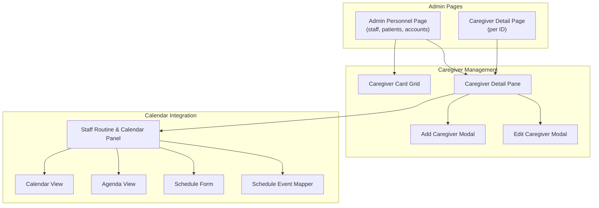
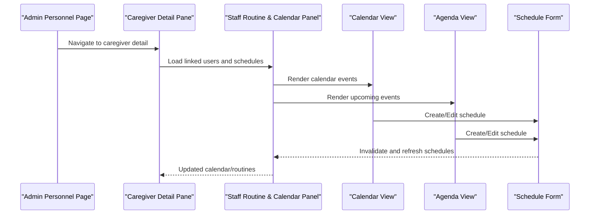
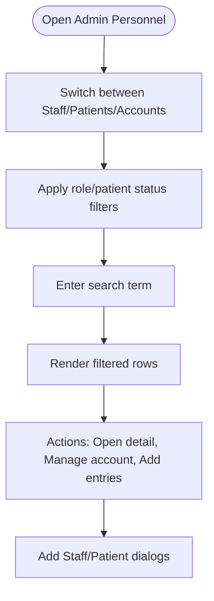
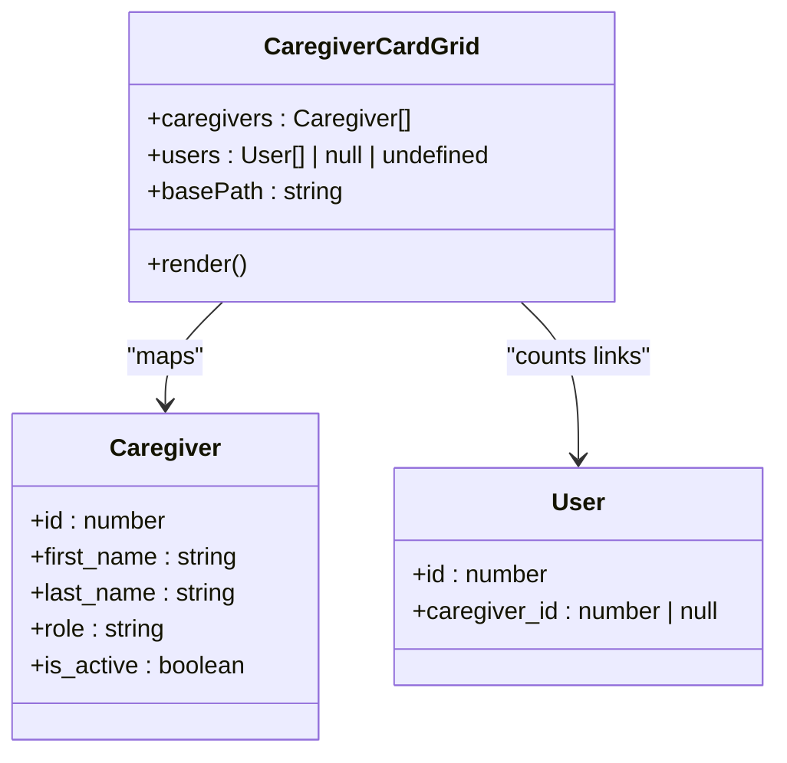
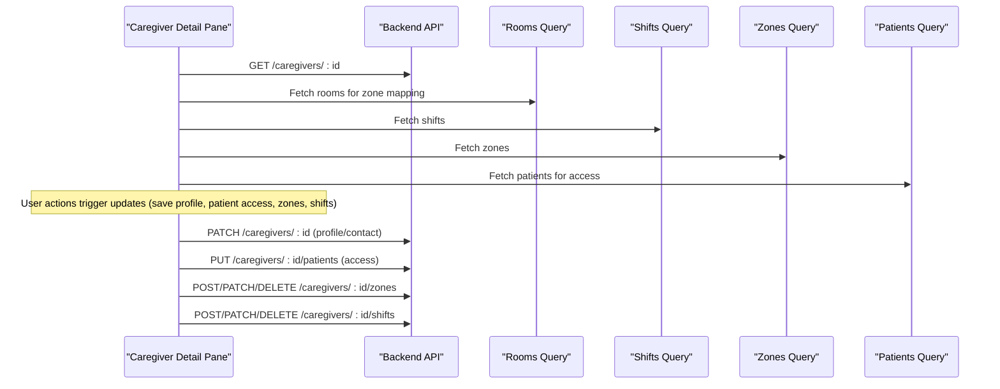
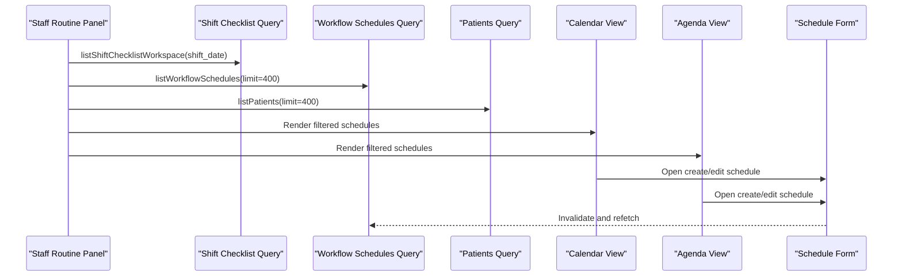
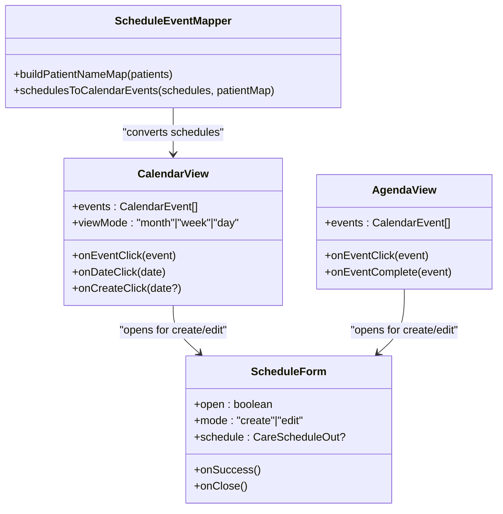
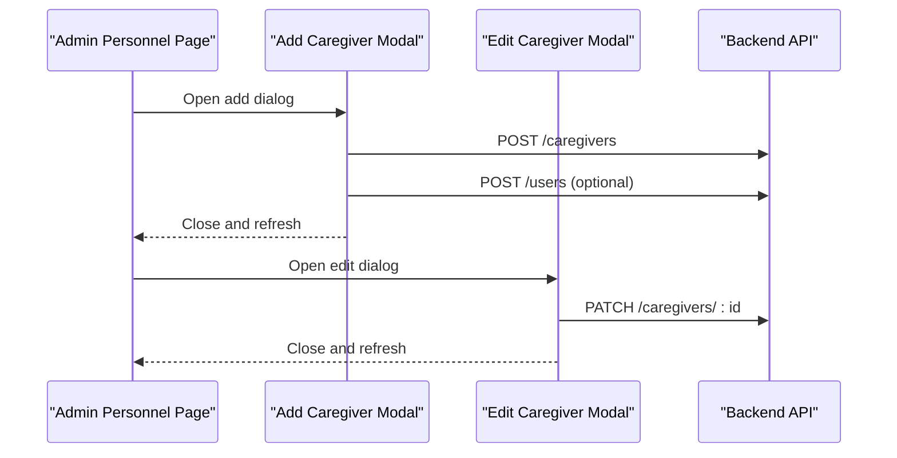
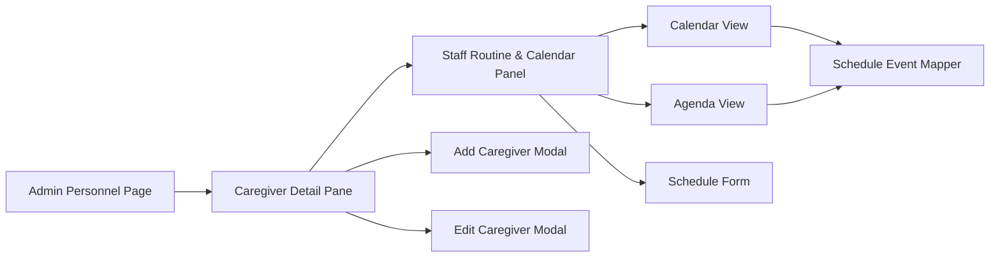

# Personnel Coordination

<cite>
**Referenced Files in This Document**
- [personnel page](file://frontend/app/admin/personnel/page.tsx)
- [caregiver detail page](file://frontend/app/admin/caregivers/[id]/page.tsx)
- [caregiver card grid](file://frontend/components/admin/caregivers/CaregiverCardGrid.tsx)
- [caregiver detail pane](file://frontend/components/admin/caregivers/CaregiverDetailPane.tsx)
- [staff routine and calendar panel](file://frontend/components/admin/caregivers/StaffRoutineAndCalendarPanel.tsx)
- [add caregiver modal](file://frontend/components/admin/caregivers/AddCaregiverModal.tsx)
- [edit caregiver modal](file://frontend/components/admin/caregivers/EditCaregiverModal.tsx)
- [calendar view](file://frontend/components/calendar/CalendarView.tsx)
- [agenda view](file://frontend/components/calendar/AgendaView.tsx)
- [schedule form](file://frontend/components/calendar/ScheduleForm.tsx)
- [schedule event mapper](file://frontend/components/calendar/scheduleEventMapper.ts)
</cite>

## Table of Contents
1. [Introduction](#introduction)
2. [Project Structure](#project-structure)
3. [Core Components](#core-components)
4. [Architecture Overview](#architecture-overview)
5. [Detailed Component Analysis](#detailed-component-analysis)
6. [Dependency Analysis](#dependency-analysis)
7. [Performance Considerations](#performance-considerations)
8. [Troubleshooting Guide](#troubleshooting-guide)
9. [Conclusion](#conclusion)

## Introduction
This document describes the Personnel Coordination functionality in the Admin Dashboard, focusing on staff management, caregiver assignment, schedule coordination, skill management, and team organization. It explains the caregiver card grid implementation, staff routine management, calendar integration, staff member detail pane, team assignment workflows, and personnel availability tracking. Practical administrative procedures for assigning staff to care teams, managing work schedules, coordinating staff rotations, and tracking personnel skills and certifications are included.

## Project Structure
Personnel Coordination spans several frontend components organized by responsibility:
- Administrative overview pages for staff, patients, and accounts
- Caregiver detail and management components
- Calendar and scheduling integration
- Shared calendar UI components

**Diagram sources**
- [personnel page:1-916](file://frontend/app/admin/personnel/page.tsx#L1-L916)
- [caregiver detail page:1-124](file://frontend/app/admin/caregivers/[id]/page.tsx#L1-L124)
- [caregiver card grid:1-64](file://frontend/components/admin/caregivers/CaregiverCardGrid.tsx#L1-L64)
- [caregiver detail pane:1-2004](file://frontend/components/admin/caregivers/CaregiverDetailPane.tsx#L1-L2004)
- [staff routine and calendar panel:1-314](file://frontend/components/admin/caregivers/StaffRoutineAndCalendarPanel.tsx#L1-L314)
- [calendar view:1-496](file://frontend/components/calendar/CalendarView.tsx#L1-L496)
- [agenda view:1-233](file://frontend/components/calendar/AgendaView.tsx#L1-L233)
- [schedule form:1-587](file://frontend/components/calendar/ScheduleForm.tsx#L1-L587)
- [schedule event mapper:1-60](file://frontend/components/calendar/scheduleEventMapper.ts#L1-L60)

**Section sources**
- [personnel page:1-916](file://frontend/app/admin/personnel/page.tsx#L1-L916)
- [caregiver detail page:1-124](file://frontend/app/admin/caregivers/[id]/page.tsx#L1-L124)

## Core Components
- Admin Personnel Page: Provides unified views for staff, patients, and accounts with filtering, searching, and quick actions.
- Caregiver Card Grid: Displays caregivers in a responsive grid with role, status, and linked account indicators.
- Caregiver Detail Pane: Comprehensive staff profile with patient access, zones, shifts, contacts, and linked accounts; integrates calendar and routines.
- Staff Routine and Calendar Panel: Shows daily/weekly routines and calendar events for linked users; supports adding/editing schedules.
- Calendar Components: Generic calendar view, agenda, and schedule form supporting recurring events and assignees.
- Add/Edit Caregiver Modals: Forms for creating and updating caregiver profiles with roles, departments, specialties, and contact info.

**Section sources**
- [personnel page:1-916](file://frontend/app/admin/personnel/page.tsx#L1-L916)
- [caregiver card grid:1-64](file://frontend/components/admin/caregivers/CaregiverCardGrid.tsx#L1-L64)
- [caregiver detail pane:1-2004](file://frontend/components/admin/caregivers/CaregiverDetailPane.tsx#L1-L2004)
- [staff routine and calendar panel:1-314](file://frontend/components/admin/caregivers/StaffRoutineAndCalendarPanel.tsx#L1-L314)
- [calendar view:1-496](file://frontend/components/calendar/CalendarView.tsx#L1-L496)
- [agenda view:1-233](file://frontend/components/calendar/AgendaView.tsx#L1-L233)
- [schedule form:1-587](file://frontend/components/calendar/ScheduleForm.tsx#L1-L587)
- [add caregiver modal:1-294](file://frontend/components/admin/caregivers/AddCaregiverModal.tsx#L1-L294)
- [edit caregiver modal:1-466](file://frontend/components/admin/caregivers/EditCaregiverModal.tsx#L1-L466)

## Architecture Overview
The Personnel Coordination feature follows a layered pattern:
- UI Pages orchestrate data fetching and present domain-specific views.
- Detail panes compose multiple functional panels (patient access, zones, shifts, calendar).
- Calendar integration reuses shared components for rendering and editing schedules.
- Permissions gate sensitive operations (schedule management, patient access, account edits).

**Diagram sources**
- [personnel page:1-916](file://frontend/app/admin/personnel/page.tsx#L1-L916)
- [caregiver detail pane:1-2004](file://frontend/components/admin/caregivers/CaregiverDetailPane.tsx#L1-L2004)
- [staff routine and calendar panel:1-314](file://frontend/components/admin/caregivers/StaffRoutineAndCalendarPanel.tsx#L1-L314)
- [calendar view:1-496](file://frontend/components/calendar/CalendarView.tsx#L1-L496)
- [agenda view:1-233](file://frontend/components/calendar/AgendaView.tsx#L1-L233)
- [schedule form:1-587](file://frontend/components/calendar/ScheduleForm.tsx#L1-L587)

## Detailed Component Analysis

### Admin Personnel Page
- Purpose: Central hub for managing staff, patients, and accounts with unified filtering and search.
- Key capabilities:
  - Tabbed interface for staff, patients, and accounts.
  - Role filters, patient status filters, and global search.
  - Quick links to create staff/patient accounts and manage accounts.
  - Inline dialogs for adding staff and patients with optional login creation.

**Diagram sources**
- [personnel page:1-916](file://frontend/app/admin/personnel/page.tsx#L1-L916)

**Section sources**
- [personnel page:1-916](file://frontend/app/admin/personnel/page.tsx#L1-L916)

### Caregiver Card Grid
- Purpose: Present caregivers in a responsive grid with avatar initials, role, and linked account count.
- Implementation highlights:
  - Responsive grid with scrollable container.
  - Links to individual caregiver detail pages.
  - Active/inactive status badges.
  - Counts linked accounts per caregiver.

**Diagram sources**
- [caregiver card grid:1-64](file://frontend/components/admin/caregivers/CaregiverCardGrid.tsx#L1-L64)

**Section sources**
- [caregiver card grid:1-64](file://frontend/components/admin/caregivers/CaregiverCardGrid.tsx#L1-L64)

### Caregiver Detail Pane
- Purpose: Single-pane view for comprehensive caregiver management including profile, patient access, zones, shifts, contacts, and linked accounts.
- Functional areas:
  - About section: editable profile (name, role, department, specialty, license, emergency contact, active status).
  - Patient Access: search and assign patients to a caregiver; displays current assignments.
  - Linked Patients: lists patients linked to assigned zones.
  - Head Nurse Guide: shows available head nurses for guidance (role-dependent).
  - Zones: assign rooms to zones with active/inactive toggle; supports edit/delete.
  - Shifts: add/edit/delete shifts with type and notes.
  - Contacts: editable phone/email; displays join date.
  - Linked Accounts: manage user accounts linked to the caregiver.
  - Work tab: calendar and routine integration via StaffRoutineAndCalendarPanel.

**Diagram sources**
- [caregiver detail pane:1-2004](file://frontend/components/admin/caregivers/CaregiverDetailPane.tsx#L1-L2004)

**Section sources**
- [caregiver detail pane:1-2004](file://frontend/components/admin/caregivers/CaregiverDetailPane.tsx#L1-L2004)

### Staff Routine and Calendar Panel
- Purpose: Display staff routines and integrate with calendar for schedule management.
- Features:
  - Routine panel: shows shift checklist progress for linked users on a selected date.
  - Calendar panel: month/week/day views with event click, date click, and create actions.
  - Agenda panel: upcoming events grouped by date.
  - Schedule form: create/edit schedules with patient/room/assignee/context.

**Diagram sources**
- [staff routine and calendar panel:1-314](file://frontend/components/admin/caregivers/StaffRoutineAndCalendarPanel.tsx#L1-L314)
- [calendar view:1-496](file://frontend/components/calendar/CalendarView.tsx#L1-L496)
- [agenda view:1-233](file://frontend/components/calendar/AgendaView.tsx#L1-L233)
- [schedule form:1-587](file://frontend/components/calendar/ScheduleForm.tsx#L1-L587)
- [schedule event mapper:1-60](file://frontend/components/calendar/scheduleEventMapper.ts#L1-L60)

**Section sources**
- [staff routine and calendar panel:1-314](file://frontend/components/admin/caregivers/StaffRoutineAndCalendarPanel.tsx#L1-L314)
- [calendar view:1-496](file://frontend/components/calendar/CalendarView.tsx#L1-L496)
- [agenda view:1-233](file://frontend/components/calendar/AgendaView.tsx#L1-L233)
- [schedule form:1-587](file://frontend/components/calendar/ScheduleForm.tsx#L1-L587)
- [schedule event mapper:1-60](file://frontend/components/calendar/scheduleEventMapper.ts#L1-L60)

### Calendar Integration Components
- Calendar View: Month/week/day modes with navigation, event rendering, and click handlers.
- Agenda View: Upcoming events grouped by day with status icons and optional completion actions.
- Schedule Form: Zod-validated form for creating/editing schedules with patient/room/assignee selection and recurrence.

**Diagram sources**
- [calendar view:1-496](file://frontend/components/calendar/CalendarView.tsx#L1-L496)
- [agenda view:1-233](file://frontend/components/calendar/AgendaView.tsx#L1-L233)
- [schedule form:1-587](file://frontend/components/calendar/ScheduleForm.tsx#L1-L587)
- [schedule event mapper:1-60](file://frontend/components/calendar/scheduleEventMapper.ts#L1-L60)

**Section sources**
- [calendar view:1-496](file://frontend/components/calendar/CalendarView.tsx#L1-L496)
- [agenda view:1-233](file://frontend/components/calendar/AgendaView.tsx#L1-L233)
- [schedule form:1-587](file://frontend/components/calendar/ScheduleForm.tsx#L1-L587)
- [schedule event mapper:1-60](file://frontend/components/calendar/scheduleEventMapper.ts#L1-L60)

### Caregiver Management Modals
- Add Caregiver Modal: Create caregiver records with optional linked login credentials.
- Edit Caregiver Modal: Update profile details, roles, departments, specialties, licenses, and contact info.

**Diagram sources**
- [add caregiver modal:1-294](file://frontend/components/admin/caregivers/AddCaregiverModal.tsx#L1-L294)
- [edit caregiver modal:1-466](file://frontend/components/admin/caregivers/EditCaregiverModal.tsx#L1-L466)

**Section sources**
- [add caregiver modal:1-294](file://frontend/components/admin/caregivers/AddCaregiverModal.tsx#L1-L294)
- [edit caregiver modal:1-466](file://frontend/components/admin/caregivers/EditCaregiverModal.tsx#L1-L466)

## Dependency Analysis
- Data fetching: TanStack Query manages caching, stale times, and polling for caregivers, patients, rooms, schedules, and checklist data.
- Permissions: Capability checks control visibility and actions (e.g., schedule management, patient access, account edits).
- Cross-component dependencies:
  - Caregiver Detail Pane depends on Calendar components for schedule visualization.
  - Staff Routine Panel depends on Schedule Form for creating/updating schedules.
  - Schedule Event Mapper converts backend schedule data into calendar events.

**Diagram sources**
- [personnel page:1-916](file://frontend/app/admin/personnel/page.tsx#L1-L916)
- [caregiver detail pane:1-2004](file://frontend/components/admin/caregivers/CaregiverDetailPane.tsx#L1-L2004)
- [staff routine and calendar panel:1-314](file://frontend/components/admin/caregivers/StaffRoutineAndCalendarPanel.tsx#L1-L314)
- [calendar view:1-496](file://frontend/components/calendar/CalendarView.tsx#L1-L496)
- [agenda view:1-233](file://frontend/components/calendar/AgendaView.tsx#L1-L233)
- [schedule form:1-587](file://frontend/components/calendar/ScheduleForm.tsx#L1-L587)
- [schedule event mapper:1-60](file://frontend/components/calendar/scheduleEventMapper.ts#L1-L60)
- [add caregiver modal:1-294](file://frontend/components/admin/caregivers/AddCaregiverModal.tsx#L1-L294)
- [edit caregiver modal:1-466](file://frontend/components/admin/caregivers/EditCaregiverModal.tsx#L1-L466)

**Section sources**
- [caregiver detail pane:1-2004](file://frontend/components/admin/caregivers/CaregiverDetailPane.tsx#L1-L2004)
- [staff routine and calendar panel:1-314](file://frontend/components/admin/caregivers/StaffRoutineAndCalendarPanel.tsx#L1-L314)

## Performance Considerations
- Query caching and polling: Queries use stale times and polling intervals to balance freshness and performance.
- Lazy loading: Detail panes load supporting data (rooms, shifts, zones, patients) on demand.
- Virtualization: Long lists (e.g., calendar day view) render only visible rows.
- Debounced search: Filtering reduces unnecessary re-renders during typing.
- Image optimization: Avatar uploads are resized and validated before upload.

## Troubleshooting Guide
Common issues and resolutions:
- Loading states: Use query loading flags to show spinners and skeleton layouts.
- Permission errors: Verify capability checks before enabling edit/save buttons.
- Validation errors: Display form errors returned from ScheduleForm and modals.
- API failures: Catch ApiError instances and surface user-friendly messages.
- Data sync: Use refetch callbacks to refresh dependent queries after mutations.

**Section sources**
- [caregiver detail pane:1-2004](file://frontend/components/admin/caregivers/CaregiverDetailPane.tsx#L1-L2004)
- [schedule form:1-587](file://frontend/components/calendar/ScheduleForm.tsx#L1-L587)
- [add caregiver modal:1-294](file://frontend/components/admin/caregivers/AddCaregiverModal.tsx#L1-L294)
- [edit caregiver modal:1-466](file://frontend/components/admin/caregivers/EditCaregiverModal.tsx#L1-L466)

## Conclusion
The Personnel Coordination module provides a comprehensive, permission-aware system for managing staff, assigning caregivers to zones and patients, coordinating schedules, and integrating with a flexible calendar. The modular component architecture enables maintainability and scalability, while shared calendar components promote consistency across the application.