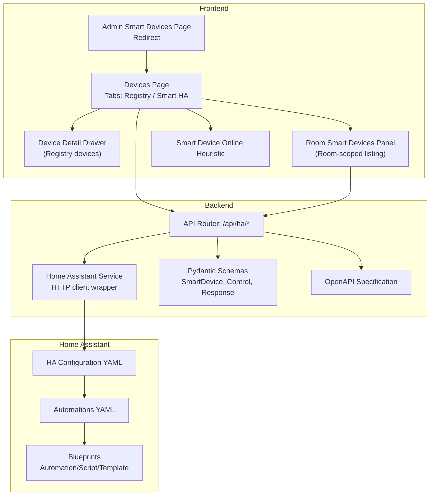
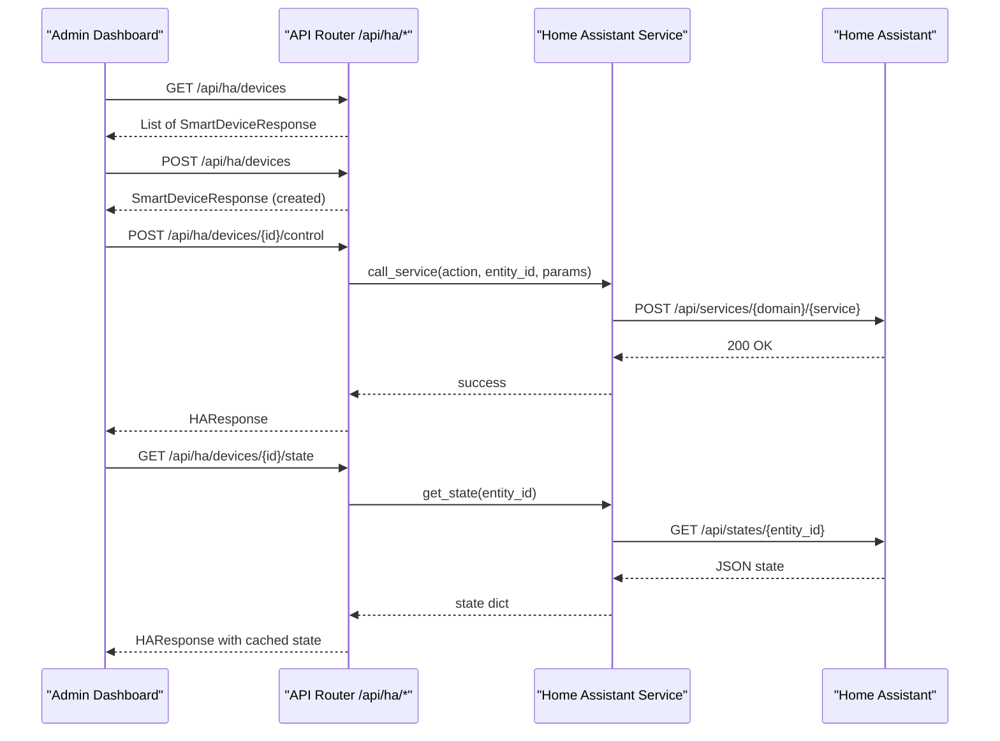
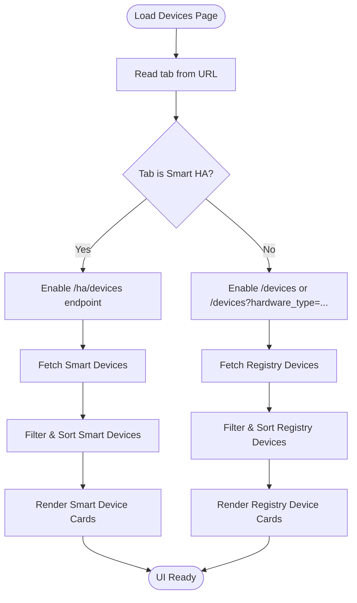
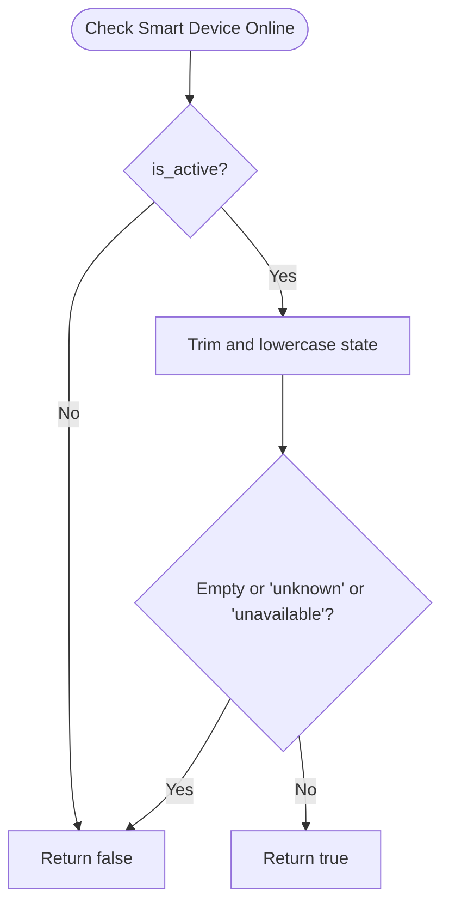
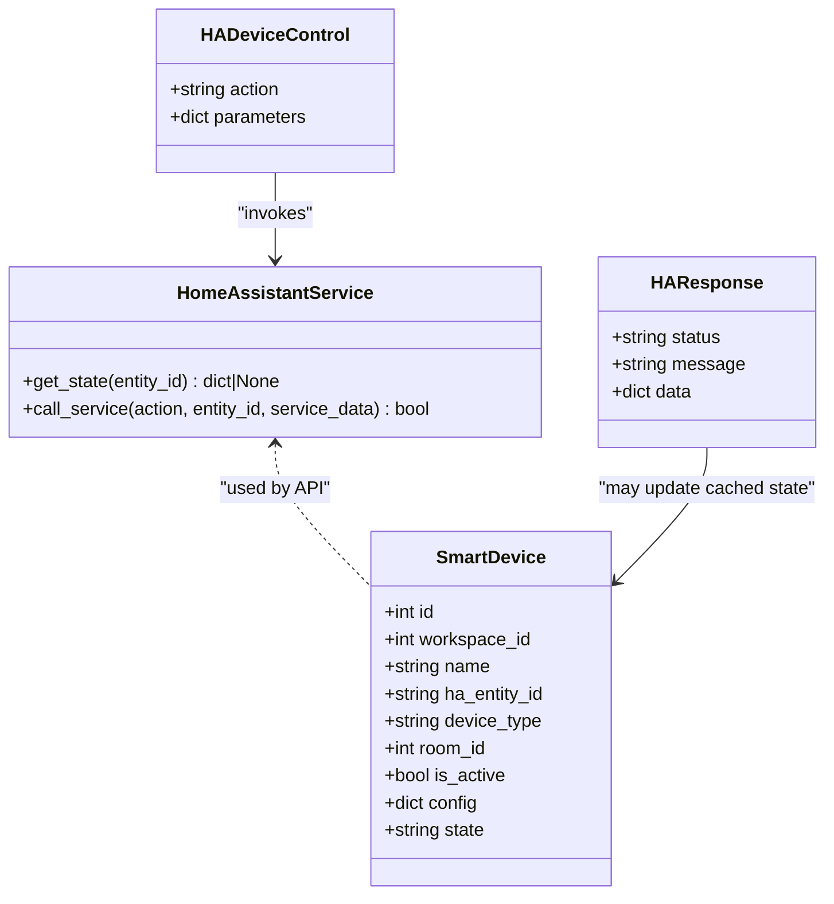
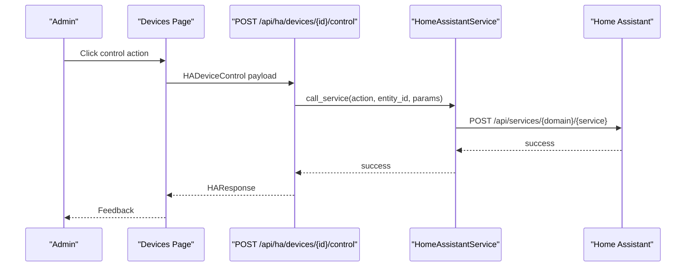
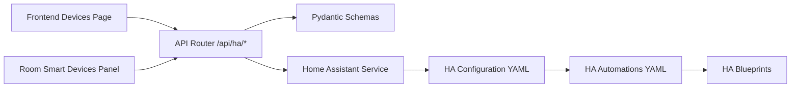

# Smart Device Integration

<cite>
**Referenced Files in This Document**
- [page.tsx](file://frontend/app/admin/smart-devices/page.tsx)
- [page.tsx](file://frontend/app/admin/devices/page.tsx)
- [DeviceDetailDrawer.tsx](file://frontend/components/admin/devices/DeviceDetailDrawer.tsx)
- [RoomSmartDevicesPanel.tsx](file://frontend/components/admin/monitoring/RoomSmartDevicesPanel.tsx)
- [smartDeviceOnline.ts](file://frontend/lib/smartDeviceOnline.ts)
- [homeassistant.py](file://server/app/api/endpoints/homeassistant.py)
- [homeassistant.py](file://server/app/services/homeassistant.py)
- [homeassistant.py](file://server/app/schemas/homeassistant.py)
- [configuration.yaml](file://server/homeassistant/configuration.yaml)
- [automations.yaml](file://server/homeassistant/automations.yaml)
- [motion_light.yaml](file://server/homeassistant/blueprints/automation/homeassistant/motion_light.yaml)
- [notify_leaving_zone.yaml](file://server/homeassistant/blueprints/automation/homeassistant/notify_leaving_zone.yaml)
- [confirmable_notification.yaml](file://server/homeassistant/blueprints/script/homeassistant/confirmable_notification.yaml)
- [inverted_binary_sensor.yaml](file://server/homeassistant/blueprints/template/inverted_binary_sensor.yaml)
- [openapi.generated.json](file://server/openapi.generated.json)
</cite>

## Table of Contents
1. [Introduction](#introduction)
2. [Project Structure](#project-structure)
3. [Core Components](#core-components)
4. [Architecture Overview](#architecture-overview)
5. [Detailed Component Analysis](#detailed-component-analysis)
6. [Dependency Analysis](#dependency-analysis)
7. [Performance Considerations](#performance-considerations)
8. [Troubleshooting Guide](#troubleshooting-guide)
9. [Conclusion](#conclusion)

## Introduction
This document explains the Smart Device Integration functionality in the Admin Dashboard, focusing on the Home Assistant bridge, device discovery, automation configuration, and device control. It covers the smart device panel implementation, device status monitoring, and integration with the broader IoT ecosystem. It also documents the Home Assistant bridge functionality, device pairing procedures, automation rule management, command execution, status tracking, and troubleshooting workflows. Examples of admin procedures for integrating new smart devices, configuring home automation rules, managing device relationships, and optimizing smart home integration are included.

## Project Structure
Smart device management spans the frontend Admin Dashboard and the backend API with Home Assistant integration:
- Frontend pages and panels:
  - Redirect page for legacy smart devices URL
  - Devices page with tabs for registry and smart HA devices
  - Device detail drawer for registry devices
  - Room smart devices panel for room-scoped device listing
  - Online status heuristic for smart devices
- Backend API and services:
  - Home Assistant endpoint router for listing, adding, updating, deleting, controlling, and querying device states
  - Home Assistant service wrapper for HA API calls
  - Pydantic schemas for smart device models and control payloads
  - OpenAPI specification for endpoints
- Home Assistant configuration and blueprints:
  - HA configuration YAML
  - Automation blueprints and templates

**Diagram sources**
- [page.tsx:1-7](file://frontend/app/admin/smart-devices/page.tsx#L1-L7)
- [page.tsx:1-383](file://frontend/app/admin/devices/page.tsx#L1-L383)
- [DeviceDetailDrawer.tsx:1-1228](file://frontend/components/admin/devices/DeviceDetailDrawer.tsx#L1-L1228)
- [RoomSmartDevicesPanel.tsx:1-34](file://frontend/components/admin/monitoring/RoomSmartDevicesPanel.tsx#L1-L34)
- [smartDeviceOnline.ts:1-10](file://frontend/lib/smartDeviceOnline.ts#L1-L10)
- [homeassistant.py:1-255](file://server/app/api/endpoints/homeassistant.py#L1-L255)
- [homeassistant.py:1-76](file://server/app/services/homeassistant.py#L1-L76)
- [homeassistant.py:1-46](file://server/app/schemas/homeassistant.py#L1-L46)
- [configuration.yaml:1-62](file://server/homeassistant/configuration.yaml#L1-L62)
- [automations.yaml](file://server/homeassistant/automations.yaml)
- [openapi.generated.json:5634-5867](file://server/openapi.generated.json#L5634-L5867)

**Section sources**
- [page.tsx:1-7](file://frontend/app/admin/smart-devices/page.tsx#L1-L7)
- [page.tsx:1-383](file://frontend/app/admin/devices/page.tsx#L1-L383)
- [DeviceDetailDrawer.tsx:1-1228](file://frontend/components/admin/devices/DeviceDetailDrawer.tsx#L1-L1228)
- [RoomSmartDevicesPanel.tsx:1-34](file://frontend/components/admin/monitoring/RoomSmartDevicesPanel.tsx#L1-L34)
- [smartDeviceOnline.ts:1-10](file://frontend/lib/smartDeviceOnline.ts#L1-L10)
- [homeassistant.py:1-255](file://server/app/api/endpoints/homeassistant.py#L1-L255)
- [homeassistant.py:1-76](file://server/app/services/homeassistant.py#L1-L76)
- [homeassistant.py:1-46](file://server/app/schemas/homeassistant.py#L1-L46)
- [configuration.yaml:1-62](file://server/homeassistant/configuration.yaml#L1-L62)
- [automations.yaml](file://server/homeassistant/automations.yaml)
- [openapi.generated.json:5634-5867](file://server/openapi.generated.json#L5634-L5867)

## Core Components
- Smart device model and control:
  - SmartDeviceCreate, SmartDeviceUpdate, SmartDeviceResponse define device metadata and state caching
  - HADeviceControl defines control payloads (action and parameters)
- Home Assistant bridge:
  - Endpoint router exposes list/add/update/delete/control/state APIs
  - Service wrapper performs HA HTTP calls and logs warnings/errors
- Frontend panels:
  - Devices page lists registry and smart HA devices with filtering and summaries
  - Device detail drawer supports registry device management
  - Room smart devices panel filters devices by room
  - Online heuristic determines smart device reachability

**Section sources**
- [homeassistant.py:1-46](file://server/app/schemas/homeassistant.py#L1-L46)
- [homeassistant.py:65-255](file://server/app/api/endpoints/homeassistant.py#L65-L255)
- [homeassistant.py:1-76](file://server/app/services/homeassistant.py#L1-L76)
- [page.tsx:54-178](file://frontend/app/admin/devices/page.tsx#L54-L178)
- [DeviceDetailDrawer.tsx:286-640](file://frontend/components/admin/devices/DeviceDetailDrawer.tsx#L286-L640)
- [RoomSmartDevicesPanel.tsx:16-34](file://frontend/components/admin/monitoring/RoomSmartDevicesPanel.tsx#L16-L34)
- [smartDeviceOnline.ts:1-10](file://frontend/lib/smartDeviceOnline.ts#L1-L10)

## Architecture Overview
The Admin Dashboard integrates with Home Assistant through a dedicated API layer. Admins manage smart devices by creating mappings to HA entities, controlling them via service calls, and monitoring their state. The system caches HA state in the database for display and filtering.

**Diagram sources**
- [homeassistant.py:65-255](file://server/app/api/endpoints/homeassistant.py#L65-L255)
- [homeassistant.py:20-73](file://server/app/services/homeassistant.py#L20-L73)
- [openapi.generated.json:5634-5867](file://server/openapi.generated.json#L5634-L5867)

## Detailed Component Analysis

### Smart Device Panel Implementation
The Devices page provides a unified view of device fleets with two tabs:
- Registry devices: physical devices tracked by the system
- Smart HA devices: logical mappings to Home Assistant entities

Key features:
- Tab switching updates URL query parameters and enables appropriate endpoints
- Filtering by name, entity ID, or device type for smart devices
- Summary cards for totals, reachable, and inactive smart devices
- Online status derived from device state and activation flag

**Diagram sources**
- [page.tsx:54-178](file://frontend/app/admin/devices/page.tsx#L54-L178)

**Section sources**
- [page.tsx:54-178](file://frontend/app/admin/devices/page.tsx#L54-L178)

### Device Status Monitoring
Smart device online status is determined by:
- Active flag (is_active)
- State field presence and validity (not unknown/unavailable)

This heuristic allows quick identification of reachable devices for operational dashboards.

**Diagram sources**
- [smartDeviceOnline.ts:1-10](file://frontend/lib/smartDeviceOnline.ts#L1-L10)

**Section sources**
- [smartDeviceOnline.ts:1-10](file://frontend/lib/smartDeviceOnline.ts#L1-L10)

### Home Assistant Bridge Functionality
The backend provides a Home Assistant bridge with:
- Listing smart devices scoped to the current workspace
- Adding/updating/deleting smart device mappings
- Controlling devices by invoking HA services
- Querying device state and caching it locally

**Diagram sources**
- [homeassistant.py:11-76](file://server/app/services/homeassistant.py#L11-L76)
- [homeassistant.py:8-46](file://server/app/schemas/homeassistant.py#L8-L46)

**Section sources**
- [homeassistant.py:65-255](file://server/app/api/endpoints/homeassistant.py#L65-L255)
- [homeassistant.py:11-76](file://server/app/services/homeassistant.py#L11-L76)
- [homeassistant.py:1-46](file://server/app/schemas/homeassistant.py#L1-L46)

### Device Pairing Procedures
Admins pair a Home Assistant entity to a smart device by:
- Navigating to the Devices page and selecting the Smart HA tab
- Using the add endpoint to create a SmartDevice mapping with:
  - name: human-readable device name
  - ha_entity_id: Home Assistant entity ID
  - device_type: category/type for UI and filtering
  - room_id: optional room association
  - is_active: enable/disable control
  - config: optional metadata

The operation logs an activity event and returns the created device.

**Section sources**
- [page.tsx:82-100](file://frontend/app/admin/devices/page.tsx#L82-L100)
- [homeassistant.py:84-116](file://server/app/api/endpoints/homeassistant.py#L84-L116)
- [homeassistant.py:16-26](file://server/app/schemas/homeassistant.py#L16-L26)

### Automation Rule Management
Home Assistant automations are managed via configuration and blueprints:
- Global configuration includes example lights and input booleans
- Automations and scripts are included from separate files
- Blueprints provide reusable automation and script templates (e.g., motion light, leaving zone notifications, confirmable notifications, inverted binary sensors)

Administrators can:
- Modify configuration.yaml to adjust global settings
- Extend or edit automations.yaml to add new rules
- Use blueprints to accelerate common automation setups

**Section sources**
- [configuration.yaml:1-62](file://server/homeassistant/configuration.yaml#L1-L62)
- [automations.yaml](file://server/homeassistant/automations.yaml)
- [motion_light.yaml](file://server/homeassistant/blueprints/automation/homeassistant/motion_light.yaml)
- [notify_leaving_zone.yaml](file://server/homeassistant/blueprints/automation/homeassistant/notify_leaving_zone.yaml)
- [confirmable_notification.yaml](file://server/homeassistant/blueprints/script/homeassistant/confirmable_notification.yaml)
- [inverted_binary_sensor.yaml](file://server/homeassistant/blueprints/template/inverted_binary_sensor.yaml)

### Smart Device Command Execution
Admins can control smart devices from the Devices page:
- Select a device card
- Trigger control actions (e.g., turn_on, turn_off, toggle, set_value)
- Provide parameters (e.g., brightness)
- The backend validates device scope and activation, invokes HA services, and returns a response

**Diagram sources**
- [page.tsx:222-269](file://frontend/app/admin/devices/page.tsx#L222-L269)
- [homeassistant.py:187-223](file://server/app/api/endpoints/homeassistant.py#L187-L223)
- [homeassistant.py:42-73](file://server/app/services/homeassistant.py#L42-L73)

**Section sources**
- [page.tsx:222-269](file://frontend/app/admin/devices/page.tsx#L222-L269)
- [homeassistant.py:187-223](file://server/app/api/endpoints/homeassistant.py#L187-L223)
- [homeassistant.py:42-73](file://server/app/services/homeassistant.py#L42-L73)

### Device Relationship Management
Room-scoped device listing:
- The Room Smart Devices Panel fetches all smart devices and filters by room_id
- Useful for operators to focus on devices within a specific room

Room assignment for registry devices:
- The Device Detail Drawer supports assigning/unlinking rooms to registry devices
- Room node device keys align registry identifiers with room.node_device_id

**Section sources**
- [RoomSmartDevicesPanel.tsx:16-34](file://frontend/components/admin/monitoring/RoomSmartDevicesPanel.tsx#L16-L34)
- [DeviceDetailDrawer.tsx:522-563](file://frontend/components/admin/devices/DeviceDetailDrawer.tsx#L522-L563)

### Status Tracking and Refresh
- State polling:
  - Smart devices are polled periodically with a stale time and refetch interval
  - State queries update the cached state field for display
- Registry device health:
  - Connectivity is derived from last_seen timestamps
  - Battery and motion metrics are shown for applicable hardware types

**Section sources**
- [page.tsx:94-100](file://frontend/app/admin/devices/page.tsx#L94-L100)
- [homeassistant.py:225-253](file://server/app/api/endpoints/homeassistant.py#L225-L253)
- [DeviceDetailDrawer.tsx:299-331](file://frontend/components/admin/devices/DeviceDetailDrawer.tsx#L299-L331)

## Dependency Analysis
The smart device integration exhibits clear separation of concerns:
- Frontend depends on API endpoints and OpenAPI definitions
- API endpoints depend on Home Assistant service and schemas
- Home Assistant service depends on configuration settings and HTTP client
- Home Assistant configuration depends on automations and blueprints

**Diagram sources**
- [page.tsx:82-100](file://frontend/app/admin/devices/page.tsx#L82-L100)
- [RoomSmartDevicesPanel.tsx:18-26](file://frontend/components/admin/monitoring/RoomSmartDevicesPanel.tsx#L18-L26)
- [homeassistant.py:1-255](file://server/app/api/endpoints/homeassistant.py#L1-L255)
- [homeassistant.py:1-46](file://server/app/schemas/homeassistant.py#L1-L46)
- [homeassistant.py:1-76](file://server/app/services/homeassistant.py#L1-L76)
- [configuration.yaml:1-62](file://server/homeassistant/configuration.yaml#L1-L62)
- [automations.yaml](file://server/homeassistant/automations.yaml)

**Section sources**
- [page.tsx:82-100](file://frontend/app/admin/devices/page.tsx#L82-L100)
- [RoomSmartDevicesPanel.tsx:18-26](file://frontend/components/admin/monitoring/RoomSmartDevicesPanel.tsx#L18-L26)
- [homeassistant.py:1-255](file://server/app/api/endpoints/homeassistant.py#L1-L255)
- [homeassistant.py:1-46](file://server/app/schemas/homeassistant.py#L1-L46)
- [homeassistant.py:1-76](file://server/app/services/homeassistant.py#L1-L76)
- [configuration.yaml:1-62](file://server/homeassistant/configuration.yaml#L1-L62)
- [automations.yaml](file://server/homeassistant/automations.yaml)

## Performance Considerations
- Polling intervals:
  - Smart devices use shorter intervals for timely state updates
  - Registry devices use longer intervals to reduce load
- Stale times:
  - Configure appropriate stale times per endpoint to balance freshness and performance
- Bulk operations:
  - Prefer server-side operations for fleet-wide changes to maintain auditability and consistency

## Troubleshooting Guide
Common issues and resolutions:
- Missing Home Assistant token:
  - Symptom: Control requests fail with gateway errors
  - Resolution: Configure HA access token and base URL in settings
- Entity not found:
  - Symptom: State queries return errors
  - Resolution: Verify entity_id exists in Home Assistant
- Device inactive:
  - Symptom: Control requests rejected
  - Resolution: Activate device in the smart device mapping
- Permission denied:
  - Symptom: Access restricted to certain roles
  - Resolution: Ensure user has required role (admin/head_nurse/supervisor/observer/patient)

Operational checks:
- Validate HA connectivity and service availability
- Confirm device mappings and room associations
- Review activity logs for device lifecycle events

**Section sources**
- [homeassistant.py:22-40](file://server/app/services/homeassistant.py#L22-L40)
- [homeassistant.py:201-216](file://server/app/api/endpoints/homeassistant.py#L201-L216)
- [homeassistant.py:238-243](file://server/app/api/endpoints/homeassistant.py#L238-L243)

## Conclusion
The Smart Device Integration provides a robust Admin Dashboard for managing Home Assistant-powered smart devices. Administrators can discover and pair devices, configure automation rules, control devices, and monitor status. The system’s design separates frontend UX, backend API, and Home Assistant integration, enabling scalable and maintainable smart home operations within the broader IoT ecosystem.