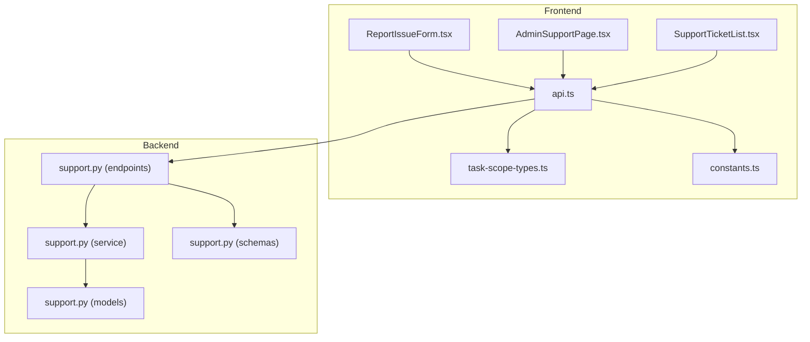
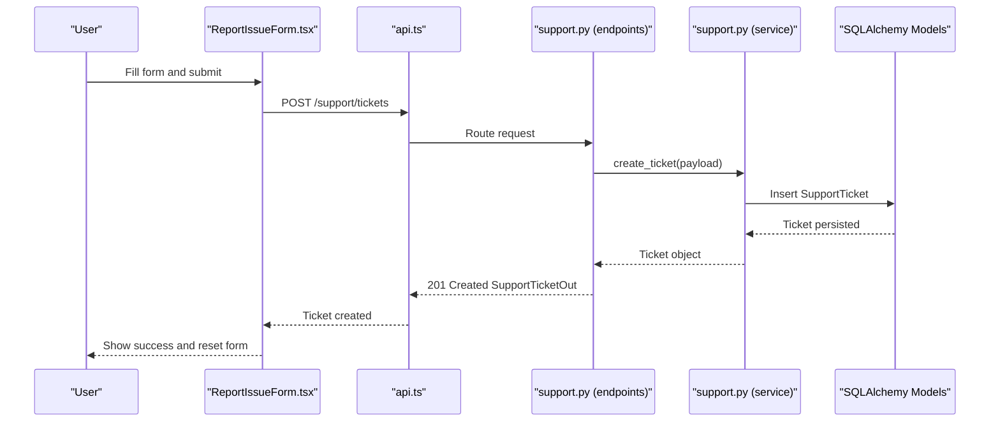
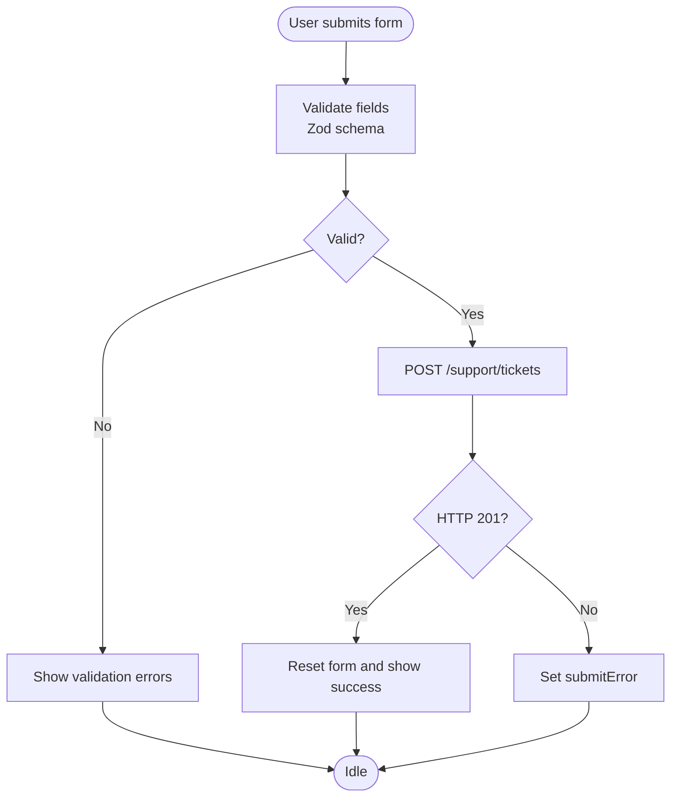
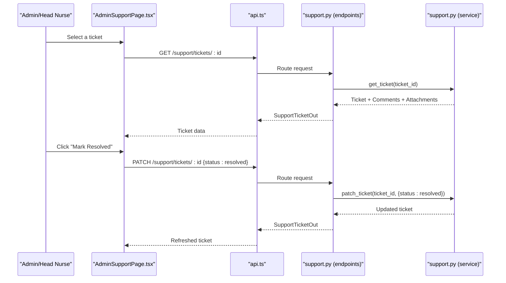
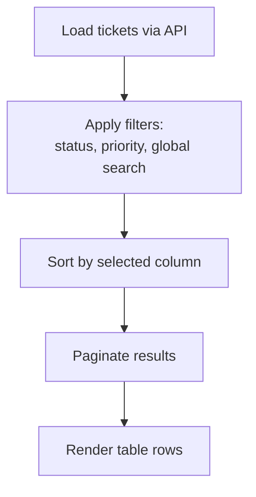
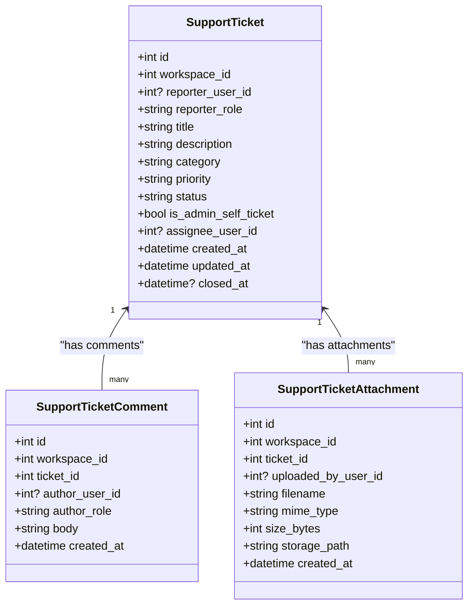
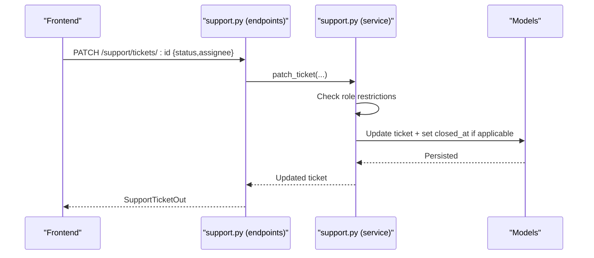
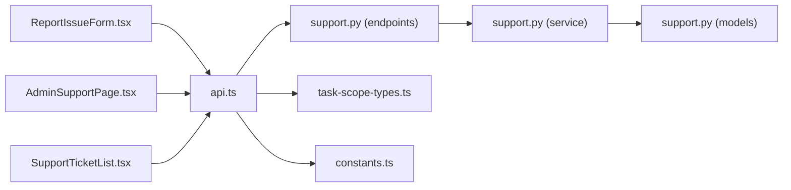

# Support Ticketing System

<cite>
**Referenced Files in This Document**
- [SupportTicketList.tsx](file://frontend/components/admin/SupportTicketList.tsx)
- [ReportIssueForm.tsx](file://frontend/components/support/ReportIssueForm.tsx)
- [AdminSupportPage.tsx](file://frontend/app/admin/support/page.tsx)
- [HeadNurseSupportPage.tsx](file://frontend/app/head-nurse/support/page.tsx)
- [SupervisorSupportPage.tsx](file://frontend/app/supervisor/support/page.tsx)
- [PatientSupportPage.tsx](file://frontend/app/patient/support/page.tsx)
- [support.py (models)](file://server/app/models/support.py)
- [support.py (schemas)](file://server/app/schemas/support.py)
- [support.py (endpoints)](file://server/app/api/endpoints/support.py)
- [support.py (service)](file://server/app/services/support.py)
- [api.ts](file://frontend/lib/api.ts)
- [task-scope-types.ts](file://frontend/lib/api/task-scope-types.ts)
- [constants.ts](file://frontend/lib/constants.ts)
</cite>

## Table of Contents
1. [Introduction](#introduction)
2. [Project Structure](#project-structure)
3. [Core Components](#core-components)
4. [Architecture Overview](#architecture-overview)
5. [Detailed Component Analysis](#detailed-component-analysis)
6. [Dependency Analysis](#dependency-analysis)
7. [Performance Considerations](#performance-considerations)
8. [Troubleshooting Guide](#troubleshooting-guide)
9. [Conclusion](#conclusion)

## Introduction
This document describes the Support Ticketing System integrated into the Admin Dashboard. It covers the end-to-end workflow for reporting issues, viewing and managing tickets, assigning ownership, updating status, adding comments and attachments, and resolving issues. It also documents the administrative controls available to administrators and head nurses, the data models, API endpoints, and the front-end components that implement the user interface.

## Project Structure
The Support Ticketing System spans three layers:
- Frontend (React/Next.js): UI components and pages for creating tickets, listing tickets, and managing ticket workflows.
- Backend (FastAPI): API endpoints, service layer, and SQLAlchemy models for tickets, comments, and attachments.
- Shared Types: Strongly typed API contracts and constants used by both frontend and backend.

**Diagram sources**
- [ReportIssueForm.tsx:1-201](file://frontend/components/support/ReportIssueForm.tsx#L1-L201)
- [AdminSupportPage.tsx:1-650](file://frontend/app/admin/support/page.tsx#L1-L650)
- [SupportTicketList.tsx:1-331](file://frontend/components/admin/SupportTicketList.tsx#L1-L331)
- [api.ts:465-490](file://frontend/lib/api.ts#L465-L490)
- [support.py (endpoints):62-170](file://server/app/api/endpoints/support.py#L62-L170)
- [support.py (service):124-292](file://server/app/services/support.py#L124-L292)
- [support.py (models):10-98](file://server/app/models/support.py#L10-L98)
- [support.py (schemas):10-76](file://server/app/schemas/support.py#L10-L76)
- [task-scope-types.ts:59-64](file://frontend/lib/api/task-scope-types.ts#L59-L64)
- [constants.ts:1-27](file://frontend/lib/constants.ts#L1-L27)

**Section sources**
- [ReportIssueForm.tsx:1-201](file://frontend/components/support/ReportIssueForm.tsx#L1-L201)
- [AdminSupportPage.tsx:1-650](file://frontend/app/admin/support/page.tsx#L1-L650)
- [SupportTicketList.tsx:1-331](file://frontend/components/admin/SupportTicketList.tsx#L1-L331)
- [api.ts:465-490](file://frontend/lib/api.ts#L465-L490)
- [support.py (endpoints):62-170](file://server/app/api/endpoints/support.py#L62-L170)
- [support.py (service):124-292](file://server/app/services/support.py#L124-L292)
- [support.py (models):10-98](file://server/app/models/support.py#L10-L98)
- [support.py (schemas):10-76](file://server/app/schemas/support.py#L10-L76)
- [task-scope-types.ts:59-64](file://frontend/lib/api/task-scope-types.ts#L59-L64)
- [constants.ts:1-27](file://frontend/lib/constants.ts#L1-L27)

## Core Components
- Report Issue Form: Allows authenticated users to submit tickets with title, description, category, and priority. Submissions are sent to the backend via a scoped endpoint.
- Admin Support Dashboard: Provides a dual-pane view for browsing tickets and managing selected tickets, including marking resolved, adding comments, and viewing attachments.
- Support Ticket List (Admin): A sortable, filterable, paginated table of tickets with status and priority badges, plus a global search.
- Backend Services: Manage ticket lifecycle, enforce role-based access, and handle comments and attachments.
- Data Models and Schemas: Define the structure of tickets, comments, attachments, and API contracts.

**Section sources**
- [ReportIssueForm.tsx:37-87](file://frontend/components/support/ReportIssueForm.tsx#L37-L87)
- [AdminSupportPage.tsx:128-247](file://frontend/app/admin/support/page.tsx#L128-L247)
- [SupportTicketList.tsx:59-331](file://frontend/components/admin/SupportTicketList.tsx#L59-L331)
- [support.py (service):124-206](file://server/app/services/support.py#L124-L206)
- [support.py (models):10-98](file://server/app/models/support.py#L10-L98)
- [support.py (schemas):10-76](file://server/app/schemas/support.py#L10-L76)

## Architecture Overview
The system follows a clean separation of concerns:
- Frontend components render UI and orchestrate API calls.
- API endpoints validate inputs, enforce authorization, and delegate to the service layer.
- The service layer performs business logic, applies role restrictions, and persists data.
- SQLAlchemy models define the persistence schema; Pydantic schemas define API contracts.

**Diagram sources**
- [ReportIssueForm.tsx:66-87](file://frontend/components/support/ReportIssueForm.tsx#L66-L87)
- [api.ts:465-471](file://frontend/lib/api.ts#L465-L471)
- [support.py (endpoints):89-98](file://server/app/api/endpoints/support.py#L89-L98)
- [support.py (service):154-177](file://server/app/services/support.py#L154-L177)
- [support.py (models):10-42](file://server/app/models/support.py#L10-L42)

**Section sources**
- [ReportIssueForm.tsx:37-87](file://frontend/components/support/ReportIssueForm.tsx#L37-L87)
- [api.ts:465-471](file://frontend/lib/api.ts#L465-L471)
- [support.py (endpoints):89-98](file://server/app/api/endpoints/support.py#L89-L98)
- [support.py (service):154-177](file://server/app/services/support.py#L154-L177)
- [support.py (models):10-42](file://server/app/models/support.py#L10-L42)

## Detailed Component Analysis

### Report Issue Form Implementation
- Purpose: Enable authenticated users to create support tickets with validation and error handling.
- Inputs: Title, description, category, priority.
- Validation: Zod schema enforces minimum length for title and allowed values for category and priority.
- Submission: Uses workspace-scoped endpoint; on success, clears form and displays a success message.

**Diagram sources**
- [ReportIssueForm.tsx:45-87](file://frontend/components/support/ReportIssueForm.tsx#L45-L87)
- [api.ts:465-471](file://frontend/lib/api.ts#L465-L471)

**Section sources**
- [ReportIssueForm.tsx:37-111](file://frontend/components/support/ReportIssueForm.tsx#L37-L111)
- [ReportIssueForm.tsx:112-199](file://frontend/components/support/ReportIssueForm.tsx#L112-L199)
- [api.ts:465-471](file://frontend/lib/api.ts#L465-L471)

### Admin Support Dashboard
- Purpose: Central place for administrators and head nurses to manage support tickets and related service requests.
- Features:
  - Left pane: List of tickets with selection capability.
  - Right pane: Selected ticket details, status badges, priority tag, creation time, description, attachments, and comments.
  - Actions: Mark ticket resolved, add comments, view attachments, and refresh data automatically.

**Diagram sources**
- [AdminSupportPage.tsx:181-220](file://frontend/app/admin/support/page.tsx#L181-L220)
- [api.ts:473-489](file://frontend/lib/api.ts#L473-L489)
- [support.py (endpoints):100-122](file://server/app/api/endpoints/support.py#L100-L122)
- [support.py (service):143-206](file://server/app/services/support.py#L143-L206)

**Section sources**
- [AdminSupportPage.tsx:128-247](file://frontend/app/admin/support/page.tsx#L128-L247)
- [AdminSupportPage.tsx:248-649](file://frontend/app/admin/support/page.tsx#L248-L649)
- [api.ts:473-489](file://frontend/lib/api.ts#L473-L489)
- [support.py (endpoints):100-122](file://server/app/api/endpoints/support.py#L100-L122)
- [support.py (service):143-206](file://server/app/services/support.py#L143-L206)

### Support Ticket List (Admin)
- Purpose: Provide a searchable, filterable, paginated table of tickets for quick navigation and triage.
- Filters: Status and priority dropdowns; global search across subject, body, and sender.
- Sorting: Sortable columns for priority, status, and created time.
- Pagination: Built-in pagination with previous/next controls.

**Diagram sources**
- [SupportTicketList.tsx:173-207](file://frontend/components/admin/SupportTicketList.tsx#L173-L207)
- [api.ts:465-471](file://frontend/lib/api.ts#L465-L471)

**Section sources**
- [SupportTicketList.tsx:59-331](file://frontend/components/admin/SupportTicketList.tsx#L59-L331)

### Backend Data Models and Schemas
- Models:
  - SupportTicket: workspace-scoped, reporter role, title, description, category, priority, status, assignee, timestamps, closed_at.
  - SupportTicketComment: workspace-scoped, ticket foreign key, author role, body, timestamps.
  - SupportTicketAttachment: workspace-scoped, ticket foreign key, uploader, filename, MIME type, size, storage path, timestamps.
- Schemas:
  - SupportTicketCreateIn: validation for create payload.
  - SupportTicketPatchIn: validation for updates (restricted fields for non-managers).
  - SupportTicketOut: response model including nested comments and attachments.

**Diagram sources**
- [support.py (models):10-98](file://server/app/models/support.py#L10-L98)

**Section sources**
- [support.py (models):10-98](file://server/app/models/support.py#L10-L98)
- [support.py (schemas):10-76](file://server/app/schemas/support.py#L10-L76)

### API Endpoints and Service Layer
- Endpoints:
  - GET /support/tickets: list tickets with optional status filter and limit.
  - POST /support/tickets: create a ticket.
  - GET /support/tickets/{ticket_id}: get a single ticket with comments and attachments.
  - PATCH /support/tickets/{ticket_id}: update ticket fields (with role restrictions).
  - POST /support/tickets/{ticket_id}/comments: add a comment.
  - POST /support/tickets/{ticket_id}/attachments: upload an attachment.
  - GET /support/tickets/{ticket_id}/attachments/{attachment_id}/content: download an attachment.
- Service Layer:
  - Enforces workspace scoping and visibility rules.
  - Role-based restrictions: only admin/head_nurse can update workflow fields (status, assignee).
  - Automatic closed_at timestamp management on status change.
  - Attachment storage with size limits and secure filenames.

**Diagram sources**
- [support.py (endpoints):111-122](file://server/app/api/endpoints/support.py#L111-L122)
- [support.py (service):180-206](file://server/app/services/support.py#L180-L206)

**Section sources**
- [support.py (endpoints):62-170](file://server/app/api/endpoints/support.py#L62-L170)
- [support.py (service):124-292](file://server/app/services/support.py#L124-L292)

### Role-Based Access and Escalation
- Visibility: Non-managers can only see their own tickets; managers (admin, head_nurse) can see all tickets in the workspace.
- Workflow Updates: Only managers can change status or assignee; regular users can add comments and attachments.
- Self-Tickets: Admins can create self-service tickets when flagged appropriately.

**Section sources**
- [support.py (service):68-79](file://server/app/services/support.py#L68-L79)
- [support.py (service):180-196](file://server/app/services/support.py#L180-L196)

## Dependency Analysis
- Frontend depends on:
  - API client for HTTP operations.
  - Typed contracts for request/response shapes.
  - Constants for base URLs.
- Backend depends on:
  - SQLAlchemy ORM for persistence.
  - Pydantic for serialization/validation.
  - Role-based authorization for access control.

**Diagram sources**
- [ReportIssueForm.tsx:1-201](file://frontend/components/support/ReportIssueForm.tsx#L1-L201)
- [AdminSupportPage.tsx:1-650](file://frontend/app/admin/support/page.tsx#L1-L650)
- [SupportTicketList.tsx:1-331](file://frontend/components/admin/SupportTicketList.tsx#L1-L331)
- [api.ts:465-490](file://frontend/lib/api.ts#L465-L490)
- [support.py (endpoints):62-170](file://server/app/api/endpoints/support.py#L62-L170)
- [support.py (service):124-292](file://server/app/services/support.py#L124-L292)
- [support.py (models):10-98](file://server/app/models/support.py#L10-L98)
- [task-scope-types.ts:59-64](file://frontend/lib/api/task-scope-types.ts#L59-L64)
- [constants.ts:1-27](file://frontend/lib/constants.ts#L1-L27)

**Section sources**
- [api.ts:465-490](file://frontend/lib/api.ts#L465-L490)
- [support.py (endpoints):62-170](file://server/app/api/endpoints/support.py#L62-L170)
- [support.py (service):124-292](file://server/app/services/support.py#L124-L292)
- [support.py (models):10-98](file://server/app/models/support.py#L10-L98)
- [task-scope-types.ts:59-64](file://frontend/lib/api/task-scope-types.ts#L59-L64)
- [constants.ts:1-27](file://frontend/lib/constants.ts#L1-L27)

## Performance Considerations
- Pagination and Limits: The list endpoint supports a configurable limit to prevent large payloads.
- Auto-refresh: The admin page refreshes ticket lists periodically to keep data fresh without manual reloads.
- Efficient Queries: Service layer builds targeted queries with filtering and ordering to minimize overhead.
- Attachment Storage: Files are stored under workspace- and ticket-scoped directories with secure filenames and size limits.

[No sources needed since this section provides general guidance]

## Troubleshooting Guide
Common issues and resolutions:
- Unauthorized Access: Non-managers attempting to update workflow fields receive a forbidden error; ensure only admin/head_nurse perform status/assignee changes.
- Missing or Empty Attachments: Uploading empty files or exceeding size limits triggers explicit errors; verify file presence and size.
- Ticket Not Found: Requests for non-existent tickets return not-found; confirm ticket ID and workspace scope.
- API Timeout or Network Errors: The API client surfaces timeouts and network failures; retry after checking connectivity.

**Section sources**
- [support.py (service):194-196](file://server/app/services/support.py#L194-L196)
- [support.py (service):243-247](file://server/app/services/support.py#L243-L247)
- [support.py (service):53-65](file://server/app/services/support.py#L53-L65)
- [api.ts:209-297](file://frontend/lib/api.ts#L209-L297)

## Conclusion
The Support Ticketing System integrates a robust frontend UI with a secure, role-aware backend. Administrators and head nurses can efficiently triage, assign, update, and resolve tickets while regular users can report issues and collaborate through comments and attachments. The system’s design emphasizes clarity, scalability, and maintainability through typed contracts, layered services, and strict access controls.