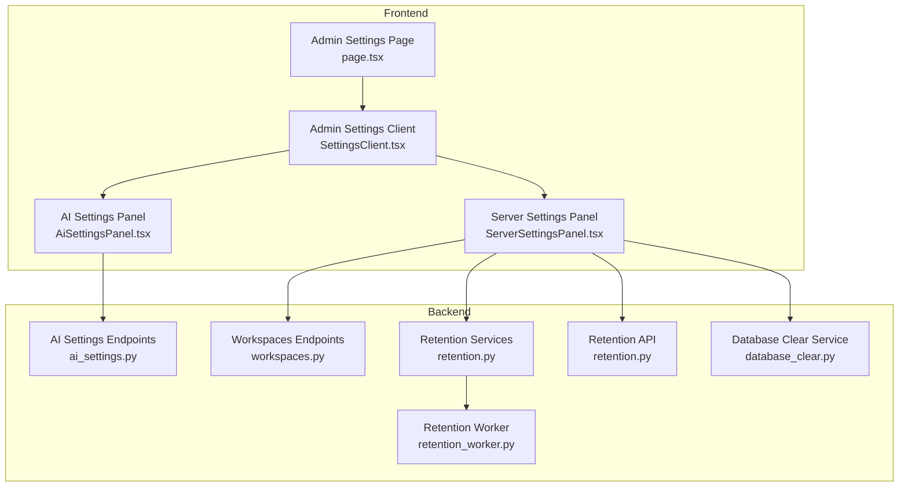
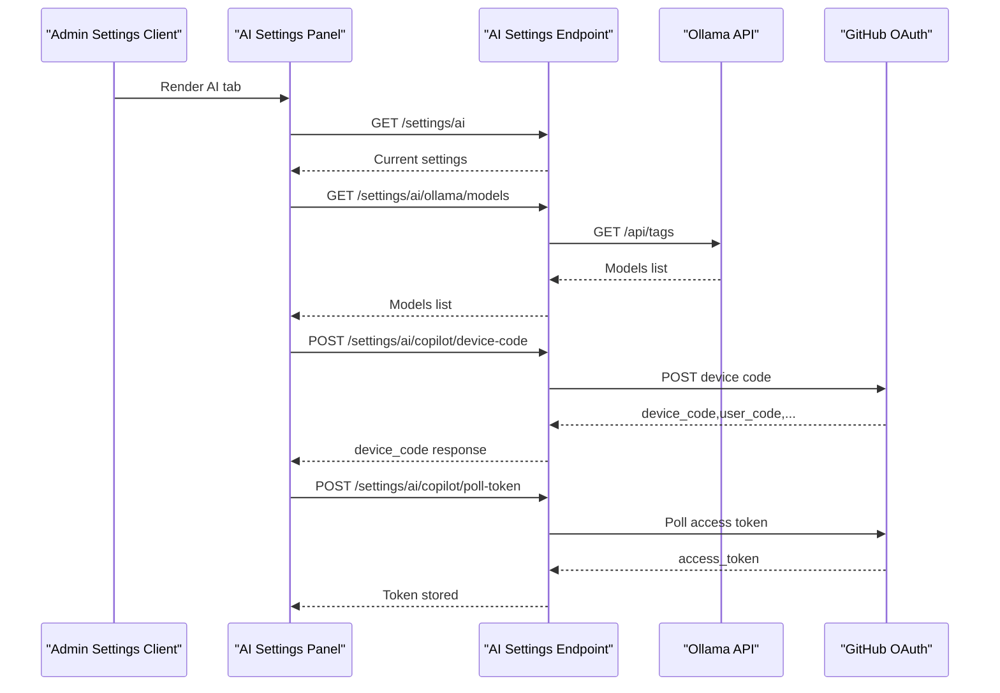
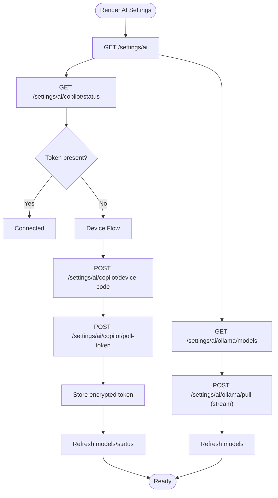
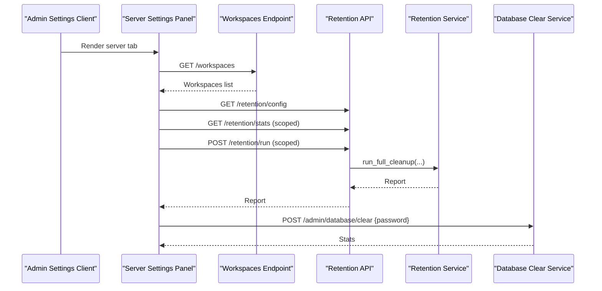
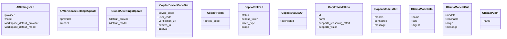
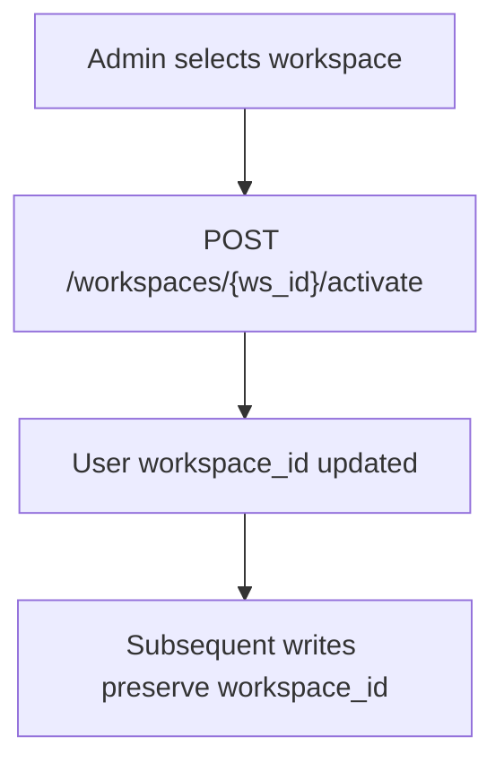
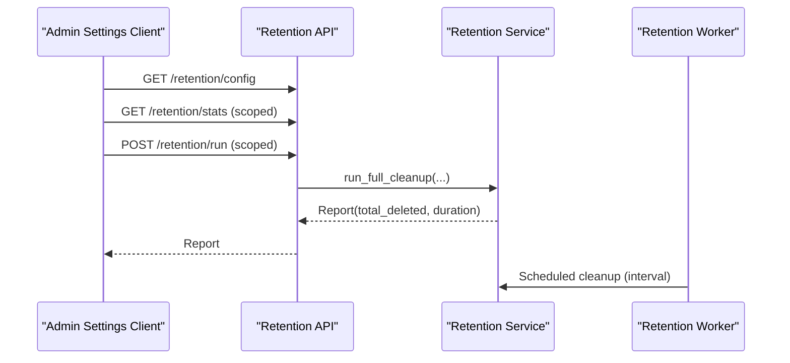
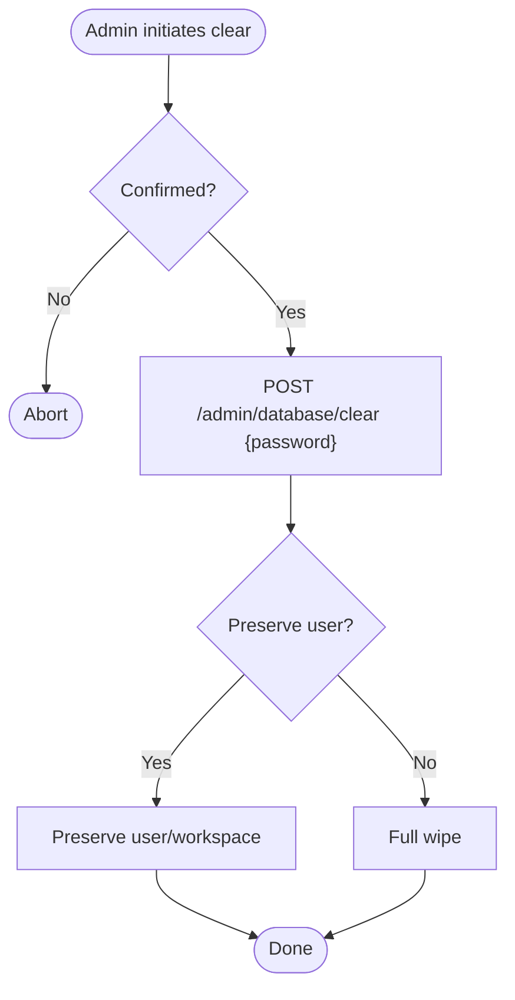
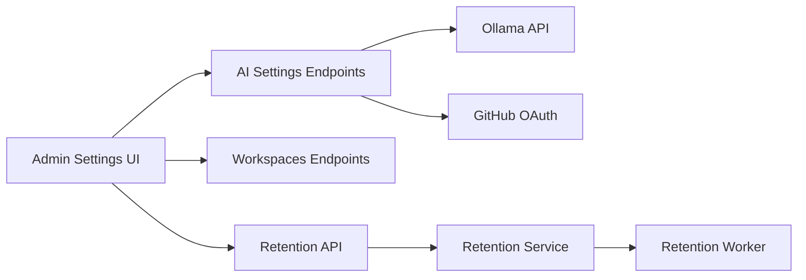

# System Settings & Configuration

<cite>
**Referenced Files in This Document**
- [page.tsx](file://frontend/app/admin/settings/page.tsx)
- [SettingsClient.tsx](file://frontend/app/admin/settings/SettingsClient.tsx)
- [AiSettingsPanel.tsx](file://frontend/components/admin/settings/AiSettingsPanel.tsx)
- [ServerSettingsPanel.tsx](file://frontend/components/admin/settings/ServerSettingsPanel.tsx)
- [ai_settings.py](file://server/app/api/endpoints/ai_settings.py)
- [ai_settings.py](file://server/app/schemas/ai_settings.py)
- [workspaces.py](file://server/app/api/endpoints/workspaces.py)
- [retention.py](file://server/app/services/retention.py)
- [retention_worker.py](file://server/app/workers/retention_worker.py)
- [retention.py](file://server/app/api/endpoints/retention.py)
- [database_clear.py](file://server/app/services/database_clear.py)
</cite>

## Table of Contents
1. [Introduction](#introduction)
2. [Project Structure](#project-structure)
3. [Core Components](#core-components)
4. [Architecture Overview](#architecture-overview)
5. [Detailed Component Analysis](#detailed-component-analysis)
6. [Dependency Analysis](#dependency-analysis)
7. [Performance Considerations](#performance-considerations)
8. [Troubleshooting Guide](#troubleshooting-guide)
9. [Conclusion](#conclusion)

## Introduction
This document describes the System Settings and Configuration functionality in the Admin Dashboard. It covers the administrative configuration interface for workspace settings, global system parameters, integration configurations, and platform-wide preferences. It documents the AI settings panel, server settings panel, and configuration validation processes. It also explains workspace-scoped settings management, system-wide parameter controls, and integration point configurations, including AI provider selection, Copilot device flow, Ollama model management, retention policies, simulator controls, and database clearing.

## Project Structure
The Admin Settings feature spans the frontend Next.js application and the FastAPI backend:
- Frontend pages and components render the settings UI and orchestrate queries and actions.
- Backend endpoints expose configuration APIs for AI settings, retention, simulator, and database operations.

**Diagram sources**
- [page.tsx:1-19](file://frontend/app/admin/settings/page.tsx#L1-L19)
- [SettingsClient.tsx:1-114](file://frontend/app/admin/settings/SettingsClient.tsx#L1-L114)
- [AiSettingsPanel.tsx:1-1098](file://frontend/components/admin/settings/AiSettingsPanel.tsx#L1-L1098)
- [ServerSettingsPanel.tsx:1-405](file://frontend/components/admin/settings/ServerSettingsPanel.tsx#L1-L405)
- [ai_settings.py:1-339](file://server/app/api/endpoints/ai_settings.py#L1-L339)
- [workspaces.py:1-58](file://server/app/api/endpoints/workspaces.py#L1-L58)
- [retention.py:106-147](file://server/app/services/retention.py#L106-L147)
- [retention_worker.py:42-87](file://server/app/workers/retention_worker.py#L42-L87)
- [retention.py:35-53](file://server/app/api/endpoints/retention.py#L35-L53)
- [database_clear.py:182-196](file://server/app/services/database_clear.py#L182-L196)

**Section sources**
- [page.tsx:1-19](file://frontend/app/admin/settings/page.tsx#L1-L19)
- [SettingsClient.tsx:1-114](file://frontend/app/admin/settings/SettingsClient.tsx#L1-L114)

## Core Components
- Admin Settings Page: Renders a suspense wrapper and mounts the client-side settings shell.
- Admin Settings Client: Manages tab navigation (profile, AI, server, audit, system), integrates with translations and routing, and renders the selected panel.
- AI Settings Panel: Displays effective AI settings, allows selecting workspace defaults, manages Copilot device flow, lists and pulls Ollama models, and deletes models.
- Server Settings Panel: Shows connection info, simulator controls, retention configuration and stats, ML calibration link, and database clearing.

**Section sources**
- [SettingsClient.tsx:15-111](file://frontend/app/admin/settings/SettingsClient.tsx#L15-L111)
- [AiSettingsPanel.tsx:311-1098](file://frontend/components/admin/settings/AiSettingsPanel.tsx#L311-L1098)
- [ServerSettingsPanel.tsx:64-405](file://frontend/components/admin/settings/ServerSettingsPanel.tsx#L64-L405)

## Architecture Overview
The Admin Dashboard delegates configuration concerns to backend endpoints. The AI settings panel communicates with AI endpoints for provider/model resolution, Copilot device flow, and Ollama model operations. The server settings panel coordinates with workspace endpoints, retention services, and database clearing.

**Diagram sources**
- [AiSettingsPanel.tsx:314-341](file://frontend/components/admin/settings/AiSettingsPanel.tsx#L314-L341)
- [ai_settings.py:62-96](file://server/app/api/endpoints/ai_settings.py#L62-L96)
- [ai_settings.py:245-281](file://server/app/api/endpoints/ai_settings.py#L245-L281)
- [ai_settings.py:172-200](file://server/app/api/endpoints/ai_settings.py#L172-L200)
- [ai_settings.py:202-243](file://server/app/api/endpoints/ai_settings.py#L202-L243)

## Detailed Component Analysis

### AI Settings Panel
The AI settings panel aggregates effective settings, workspace defaults, and provider-specific capabilities. It supports:
- Effective runtime summary: current provider, current model, runtime connectivity, and Ollama origin.
- Workspace defaults: choose provider and model, save globally for the workspace.
- Copilot device flow: request device code, poll token, and persist encrypted token.
- Ollama model management: list models, pull via streaming NDJSON, and delete models.

**Diagram sources**
- [AiSettingsPanel.tsx:314-341](file://frontend/components/admin/settings/AiSettingsPanel.tsx#L314-L341)
- [ai_settings.py:119-136](file://server/app/api/endpoints/ai_settings.py#L119-L136)
- [ai_settings.py:172-200](file://server/app/api/endpoints/ai_settings.py#L172-L200)
- [ai_settings.py:202-243](file://server/app/api/endpoints/ai_settings.py#L202-L243)
- [ai_settings.py:283-305](file://server/app/api/endpoints/ai_settings.py#L283-L305)

**Section sources**
- [AiSettingsPanel.tsx:311-1098](file://frontend/components/admin/settings/AiSettingsPanel.tsx#L311-L1098)
- [ai_settings.py:62-96](file://server/app/api/endpoints/ai_settings.py#L62-L96)
- [ai_settings.py:119-136](file://server/app/api/endpoints/ai_settings.py#L119-L136)
- [ai_settings.py:138-170](file://server/app/api/endpoints/ai_settings.py#L138-L170)
- [ai_settings.py:172-200](file://server/app/api/endpoints/ai_settings.py#L172-L200)
- [ai_settings.py:202-243](file://server/app/api/endpoints/ai_settings.py#L202-L243)
- [ai_settings.py:245-281](file://server/app/api/endpoints/ai_settings.py#L245-L281)
- [ai_settings.py:283-305](file://server/app/api/endpoints/ai_settings.py#L283-L305)
- [ai_settings.py:307-325](file://server/app/api/endpoints/ai_settings.py#L307-L325)

### Server Settings Panel
The server settings panel exposes:
- Connection info: current workspace and API proxy note.
- Simulator controls: reset simulator and show statistics when in simulator mode.
- Retention configuration: enable/disable, policy windows, and interval.
- Retention stats: per-table row counts and totals.
- Immediate retention run scoped to the active workspace.
- ML calibration link to the ML Calibration client.
- Database clearing with admin confirmation and password.

**Diagram sources**
- [ServerSettingsPanel.tsx:64-174](file://frontend/components/admin/settings/ServerSettingsPanel.tsx#L64-L174)
- [workspaces.py:15-23](file://server/app/api/endpoints/workspaces.py#L15-L23)
- [retention.py:35-53](file://server/app/api/endpoints/retention.py#L35-L53)
- [retention.py:134-147](file://server/app/services/retention.py#L134-L147)
- [database_clear.py:182-196](file://server/app/services/database_clear.py#L182-L196)

**Section sources**
- [ServerSettingsPanel.tsx:64-405](file://frontend/components/admin/settings/ServerSettingsPanel.tsx#L64-L405)
- [workspaces.py:15-23](file://server/app/api/endpoints/workspaces.py#L15-L23)
- [retention.py:35-53](file://server/app/api/endpoints/retention.py#L35-L53)
- [retention.py:106-147](file://server/app/services/retention.py#L106-L147)
- [database_clear.py:182-196](file://server/app/services/database_clear.py#L182-L196)

### AI Settings Backend Schema and Validation
The backend defines strict request/response models for AI settings, ensuring validated inputs and consistent outputs.

**Diagram sources**
- [ai_settings.py:10-73](file://server/app/schemas/ai_settings.py#L10-L73)

**Section sources**
- [ai_settings.py:10-73](file://server/app/schemas/ai_settings.py#L10-L73)

### Workspace-Scoped Settings Management
Workspace-scoped settings are enforced by backend services and panels:
- Workspace activation updates the current user’s active workspace.
- Base service prevents accidental workspace_id changes during updates.
- AI workspace defaults are persisted per workspace.

**Diagram sources**
- [workspaces.py:41-57](file://server/app/api/endpoints/workspaces.py#L41-L57)
- [base.py:76-78](file://server/app/services/base.py#L76-L78)

**Section sources**
- [workspaces.py:41-57](file://server/app/api/endpoints/workspaces.py#L41-L57)
- [base.py:76-78](file://server/app/services/base.py#L76-L78)

### Retention and Data Lifecycle Controls
Retention is configurable and can be scheduled or triggered manually:
- Configuration includes enable flag, per-table retention windows, and interval.
- Stats provide per-table counts and age range.
- Manual run triggers cleanup for the active workspace.

**Diagram sources**
- [retention.py:35-53](file://server/app/api/endpoints/retention.py#L35-L53)
- [retention.py:106-147](file://server/app/services/retention.py#L106-L147)
- [retention_worker.py:55-78](file://server/app/workers/retention_worker.py#L55-L78)

**Section sources**
- [retention.py:35-53](file://server/app/api/endpoints/retention.py#L35-L53)
- [retention.py:106-147](file://server/app/services/retention.py#L106-L147)
- [retention_worker.py:42-87](file://server/app/workers/retention_worker.py#L42-L87)

### Database Clearing and Backup/Restore Procedures
Database clearing requires explicit admin confirmation and password. The service supports preserving a user and workspace while wiping others, or a full wipe. There is no explicit backup/restore endpoint in the referenced files.

**Diagram sources**
- [ServerSettingsPanel.tsx:118-136](file://frontend/components/admin/settings/ServerSettingsPanel.tsx#L118-L136)
- [database_clear.py:182-196](file://server/app/services/database_clear.py#L182-L196)

**Section sources**
- [ServerSettingsPanel.tsx:118-136](file://frontend/components/admin/settings/ServerSettingsPanel.tsx#L118-L136)
- [database_clear.py:182-196](file://server/app/services/database_clear.py#L182-L196)

## Dependency Analysis
- Frontend depends on backend endpoints for AI settings, retention, simulator, and database operations.
- Backend enforces role-based access for sensitive operations (admin-only).
- Workspace scoping ensures data isolation across workspaces.
- AI settings integrate with external providers (Ollama, GitHub Copilot) via backend proxies.

**Diagram sources**
- [AiSettingsPanel.tsx:314-341](file://frontend/components/admin/settings/AiSettingsPanel.tsx#L314-L341)
- [ai_settings.py:245-281](file://server/app/api/endpoints/ai_settings.py#L245-L281)
- [ai_settings.py:172-200](file://server/app/api/endpoints/ai_settings.py#L172-L200)
- [workspaces.py:15-23](file://server/app/api/endpoints/workspaces.py#L15-L23)
- [retention.py:35-53](file://server/app/api/endpoints/retention.py#L35-L53)
- [retention_worker.py:55-78](file://server/app/workers/retention_worker.py#L55-L78)

**Section sources**
- [ai_settings.py:1-339](file://server/app/api/endpoints/ai_settings.py#L1-L339)
- [workspaces.py:1-58](file://server/app/api/endpoints/workspaces.py#L1-L58)
- [retention.py:35-53](file://server/app/api/endpoints/retention.py#L35-L53)
- [retention_worker.py:42-87](file://server/app/workers/retention_worker.py#L42-L87)

## Performance Considerations
- AI model listing and Ollama pulls are streamed to avoid blocking the UI; polling intervals adapt to slow-down signals.
- Retention runs are scoped to the active workspace and can be scheduled at configured intervals.
- Queries use appropriate stale times and polling intervals to balance freshness and load.

[No sources needed since this section provides general guidance]

## Troubleshooting Guide
- Copilot device flow failures: Check backend GitHub OAuth configuration and network connectivity; review error classification and status messages.
- Ollama unreachability: Verify Ollama origin configuration and network access; the UI surfaces reachability hints.
- Retention run failures: Inspect logs for exceptions and confirm workspace scope; re-run after resolving underlying issues.
- Database clear failures: Ensure correct password and confirmation; check service logs for detailed errors.

**Section sources**
- [AiSettingsPanel.tsx:527-537](file://frontend/components/admin/settings/AiSettingsPanel.tsx#L527-L537)
- [ai_settings.py:255-262](file://server/app/api/endpoints/ai_settings.py#L255-L262)
- [retention_worker.py:49-50](file://server/app/workers/retention_worker.py#L49-L50)
- [ServerSettingsPanel.tsx:118-136](file://frontend/components/admin/settings/ServerSettingsPanel.tsx#L118-L136)

## Conclusion
The Admin Dashboard provides a comprehensive configuration surface for AI providers, server lifecycle, and data retention. Workspace-scoped settings ensure isolation, while backend endpoints enforce validation and secure operations. Integrations with Ollama and GitHub Copilot are exposed through controlled endpoints, and retention and simulator controls help maintain system health and development workflows.