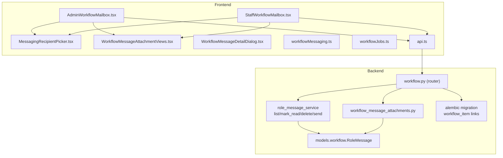
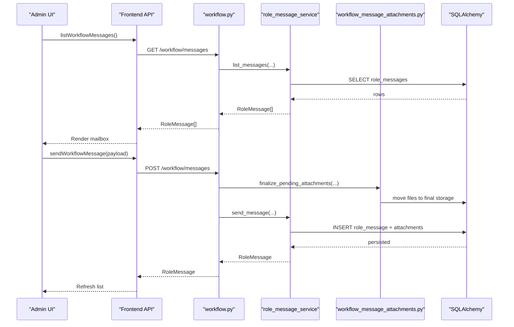
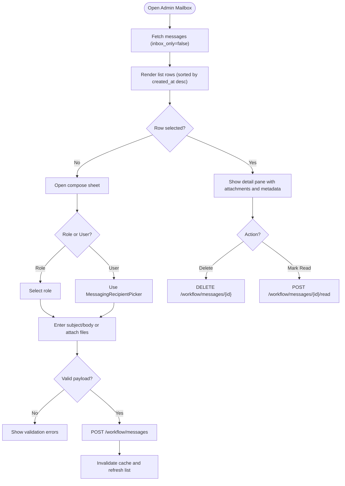
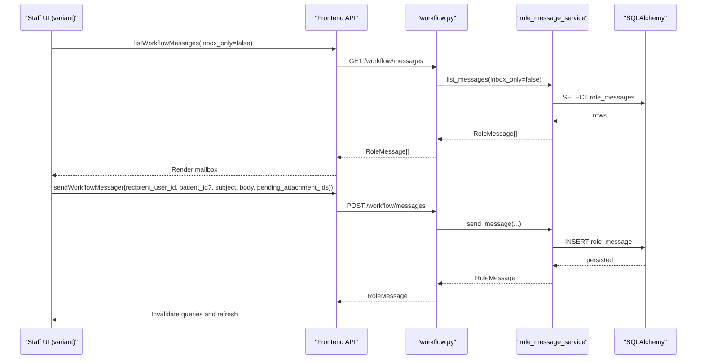
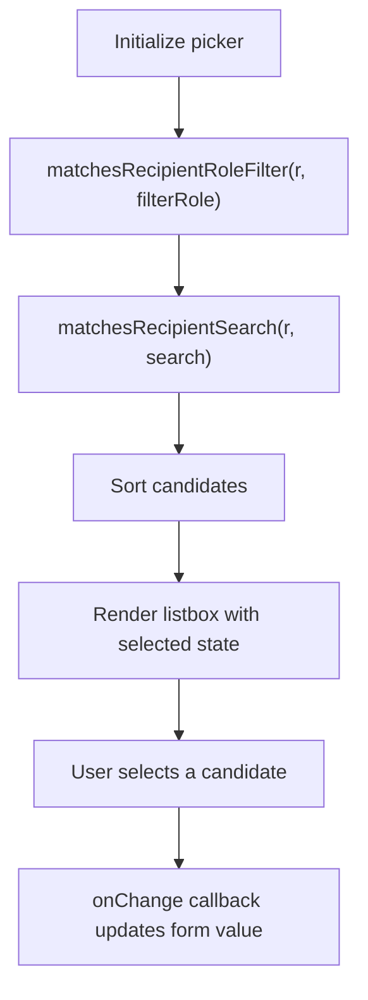
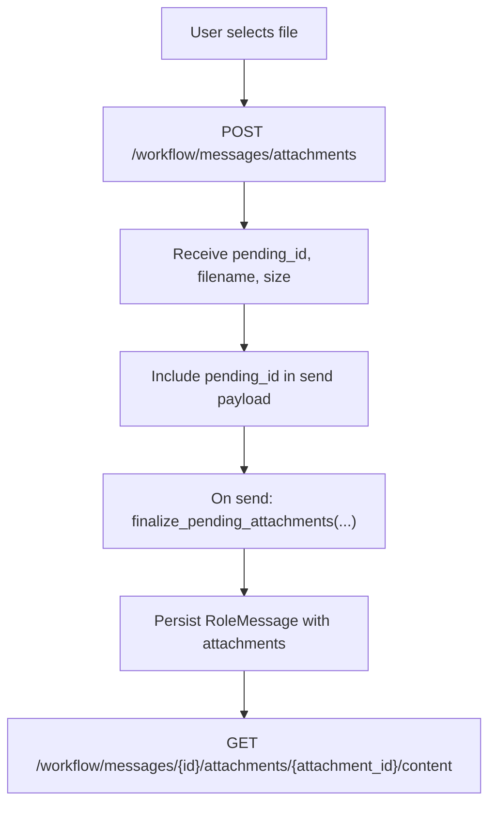
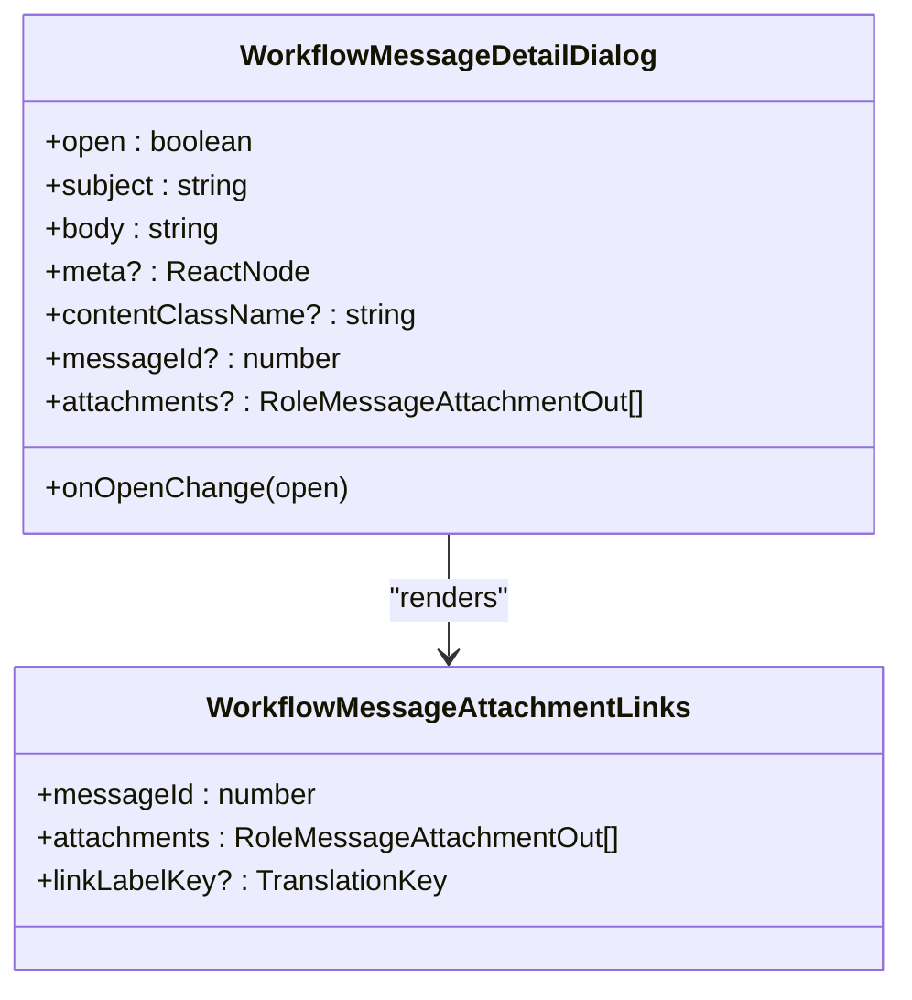
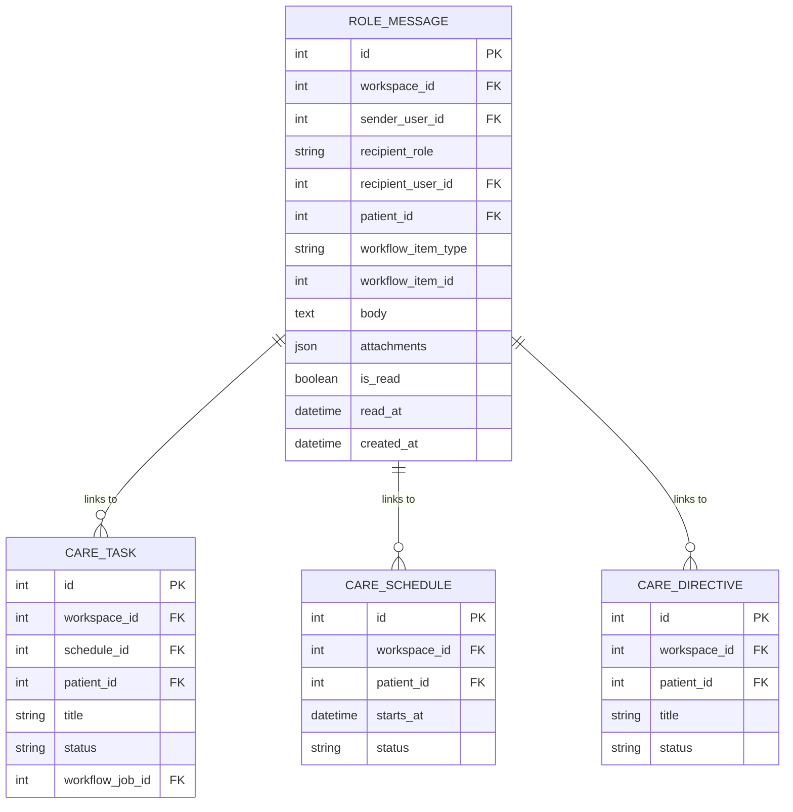
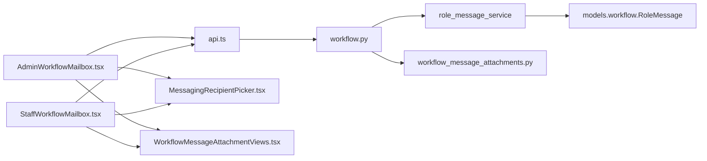

# Workflow Messaging & Communication

<cite>
**Referenced Files in This Document**
- [AdminWorkflowMailbox.tsx](file://frontend/components/messaging/AdminWorkflowMailbox.tsx)
- [MessagingRecipientPicker.tsx](file://frontend/components/messaging/MessagingRecipientPicker.tsx)
- [WorkflowMessageAttachmentViews.tsx](file://frontend/components/messaging/WorkflowMessageAttachmentViews.tsx)
- [WorkflowMessageDetailDialog.tsx](file://frontend/components/messaging/WorkflowMessageDetailDialog.tsx)
- [StaffWorkflowMailbox.tsx](file://frontend/components/messaging/StaffWorkflowMailbox.tsx)
- [workflowMessaging.ts](file://frontend/lib/workflowMessaging.ts)
- [workflowJobs.ts](file://frontend/lib/workflowJobs.ts)
- [api.ts](file://frontend/lib/api.ts)
- [AdminMessagesPage.tsx](file://frontend/app/admin/messages/page.tsx)
- [SupervisorMessagesPage.tsx](file://frontend/app/supervisor/messages/page.tsx)
- [workflow.py](file://server/app/api/endpoints/workflow.py)
- [workflow_message_attachments.py](file://server/app/services/workflow_message_attachments.py)
- [workflow.py (models)](file://server/app/models/workflow.py)
- [workflow_jobs migration](file://server/alembic/versions/m7n8o9p0q1r2_add_workflow_message_item_links.py)
- [test_workflow_domains.py](file://server/tests/test_workflow_domains.py)
</cite>

## Table of Contents
1. [Introduction](#introduction)
2. [Project Structure](#project-structure)
3. [Core Components](#core-components)
4. [Architecture Overview](#architecture-overview)
5. [Detailed Component Analysis](#detailed-component-analysis)
6. [Dependency Analysis](#dependency-analysis)
7. [Performance Considerations](#performance-considerations)
8. [Troubleshooting Guide](#troubleshooting-guide)
9. [Conclusion](#conclusion)
10. [Appendices](#appendices)

## Introduction
This document describes the Workflow Messaging and Communication system in the Admin Dashboard. It covers the administrative messaging interface, workflow message management, recipient selection, attachment handling, message threading, and the admin workflow mailbox. It also explains the role-based communication patterns, message routing, audit trail integration, and how messages link to workflow jobs and items. Practical examples illustrate managing workflow communications, coordinating care team messages, and maintaining workflow documentation.

## Project Structure
The messaging system spans frontend React components and backend FastAPI endpoints with SQLAlchemy models and services. The Admin Dashboard integrates a dedicated workflow mailbox, a staff workflow mailbox, and shared utilities for attachments and recipient selection.

**Diagram sources**
- [AdminWorkflowMailbox.tsx:110-688](file://frontend/components/messaging/AdminWorkflowMailbox.tsx#L110-L688)
- [StaffWorkflowMailbox.tsx:153-723](file://frontend/components/messaging/StaffWorkflowMailbox.tsx#L153-L723)
- [MessagingRecipientPicker.tsx:68-155](file://frontend/components/messaging/MessagingRecipientPicker.tsx#L68-L155)
- [WorkflowMessageAttachmentViews.tsx:1-142](file://frontend/components/messaging/WorkflowMessageAttachmentViews.tsx#L1-L142)
- [WorkflowMessageDetailDialog.tsx:28-70](file://frontend/components/messaging/WorkflowMessageDetailDialog.tsx#L28-L70)
- [workflowMessaging.ts:1-21](file://frontend/lib/workflowMessaging.ts#L1-L21)
- [workflowJobs.ts:1-11](file://frontend/lib/workflowJobs.ts#L1-L11)
- [api.ts:881-919](file://frontend/lib/api.ts#L881-L919)
- [workflow.py:261-403](file://server/app/api/endpoints/workflow.py#L261-L403)
- [workflow_message_attachments.py:52-202](file://server/app/services/workflow_message_attachments.py#L52-L202)
- [workflow.py (models):67-89](file://server/app/models/workflow.py#L67-L89)
- [workflow_jobs migration:20-54](file://server/alembic/versions/m7n8o9p0q1r2_add_workflow_message_item_links.py#L20-L54)

**Section sources**
- [AdminWorkflowMailbox.tsx:110-688](file://frontend/components/messaging/AdminWorkflowMailbox.tsx#L110-L688)
- [StaffWorkflowMailbox.tsx:153-723](file://frontend/components/messaging/StaffWorkflowMailbox.tsx#L153-L723)
- [workflow.py:261-403](file://server/app/api/endpoints/workflow.py#L261-L403)

## Core Components
- Admin Workflow Mailbox: Centralized inbox/sent/all view with compose sheet, role/user recipient targeting, search, read/unread indicators, and deletion controls.
- Staff Workflow Mailbox: Role-specific mailboxes for head nurse, supervisor, and observer with patient scoping and compose validation.
- Messaging Recipient Picker: Role-filtered, searchable picker for selecting recipients from workspace users.
- Attachment Views: Pending attachment management and rendered attachment links with size metadata.
- Workflow Message Detail Dialog: Read-only dialog for viewing message content and attachments.
- Utilities: Attachment URL helpers, deletion permission checks, and constants for limits.

**Section sources**
- [AdminWorkflowMailbox.tsx:110-688](file://frontend/components/messaging/AdminWorkflowMailbox.tsx#L110-L688)
- [StaffWorkflowMailbox.tsx:153-723](file://frontend/components/messaging/StaffWorkflowMailbox.tsx#L153-L723)
- [MessagingRecipientPicker.tsx:68-155](file://frontend/components/messaging/MessagingRecipientPicker.tsx#L68-L155)
- [WorkflowMessageAttachmentViews.tsx:1-142](file://frontend/components/messaging/WorkflowMessageAttachmentViews.tsx#L1-L142)
- [WorkflowMessageDetailDialog.tsx:28-70](file://frontend/components/messaging/WorkflowMessageDetailDialog.tsx#L28-L70)
- [workflowMessaging.ts:1-21](file://frontend/lib/workflowMessaging.ts#L1-L21)

## Architecture Overview
The system uses a REST-like API with cookie-authenticated endpoints. Frontend components orchestrate queries and mutations via a typed API client. Backend enforces role-based access, validates recipients, and persists messages with optional attachments. Attachments are staged temporarily and finalized upon message creation.

**Diagram sources**
- [AdminWorkflowMailbox.tsx:129-177](file://frontend/components/messaging/AdminWorkflowMailbox.tsx#L129-L177)
- [api.ts:895-914](file://frontend/lib/api.ts#L895-L914)
- [workflow.py:261-325](file://server/app/api/endpoints/workflow.py#L261-L325)
- [workflow_message_attachments.py:94-153](file://server/app/services/workflow_message_attachments.py#L94-L153)
- [workflow.py (models):67-89](file://server/app/models/workflow.py#L67-L89)

## Detailed Component Analysis

### Admin Workflow Mailbox
The Admin mailbox provides:
- Tabs: Inbox, Sent, All with counts and filtering.
- Search across subject, body, and recipient label.
- Compose sheet supporting role-based or user-based recipients.
- Attachment staging with size/type constraints.
- Read/unread indicators and mark-as-read actions.
- Deletion with permission checks.

**Diagram sources**
- [AdminWorkflowMailbox.tsx:110-688](file://frontend/components/messaging/AdminWorkflowMailbox.tsx#L110-L688)
- [MessagingRecipientPicker.tsx:68-155](file://frontend/components/messaging/MessagingRecipientPicker.tsx#L68-L155)
- [WorkflowMessageAttachmentViews.tsx:26-103](file://frontend/components/messaging/WorkflowMessageAttachmentViews.tsx#L26-L103)
- [workflowMessaging.ts:8-17](file://frontend/lib/workflowMessaging.ts#L8-L17)

**Section sources**
- [AdminWorkflowMailbox.tsx:110-688](file://frontend/components/messaging/AdminWorkflowMailbox.tsx#L110-L688)
- [workflowMessaging.ts:8-17](file://frontend/lib/workflowMessaging.ts#L8-L17)

### Staff Workflow Mailbox (Head Nurse, Supervisor, Observer)
The staff mailboxes share a common implementation with variant-specific configuration:
- Role-scoped compose with recipient filtering.
- Patient scoping for messages.
- Validation via zod schema.
- Unified query keys and invalidation patterns.

**Diagram sources**
- [StaffWorkflowMailbox.tsx:153-723](file://frontend/components/messaging/StaffWorkflowMailbox.tsx#L153-L723)
- [api.ts:895-914](file://frontend/lib/api.ts#L895-L914)
- [workflow.py:315-325](file://server/app/api/endpoints/workflow.py#L315-L325)

**Section sources**
- [StaffWorkflowMailbox.tsx:153-723](file://frontend/components/messaging/StaffWorkflowMailbox.tsx#L153-L723)

### Messaging Recipient Picker
The picker supports:
- Role filtering aligned with workspace user kinds.
- Free-text search across display name, username, role, employee code, and linked name.
- Candidate list rendering with selection state.

**Diagram sources**
- [MessagingRecipientPicker.tsx:21-48](file://frontend/components/messaging/MessagingRecipientPicker.tsx#L21-L48)
- [MessagingRecipientPicker.tsx:68-155](file://frontend/components/messaging/MessagingRecipientPicker.tsx#L68-L155)

**Section sources**
- [MessagingRecipientPicker.tsx:21-48](file://frontend/components/messaging/MessagingRecipientPicker.tsx#L21-L48)
- [MessagingRecipientPicker.tsx:68-155](file://frontend/components/messaging/MessagingRecipientPicker.tsx#L68-L155)

### Attachment Handling
Attachment lifecycle:
- Staging: Upload file to backend to obtain a pending ID.
- Composition: Include pending IDs in message payload.
- Finalization: Move files to final storage and persist metadata.
- Retrieval: Download via authenticated endpoint with filename and content-type.

**Diagram sources**
- [WorkflowMessageAttachmentViews.tsx:69-79](file://frontend/components/messaging/WorkflowMessageAttachmentViews.tsx#L69-L79)
- [workflowMessaging.ts:4-6](file://frontend/lib/workflowMessaging.ts#L4-L6)
- [workflow.py:345-384](file://server/app/api/endpoints/workflow.py#L345-L384)
- [workflow_message_attachments.py:52-153](file://server/app/services/workflow_message_attachments.py#L52-L153)

**Section sources**
- [WorkflowMessageAttachmentViews.tsx:1-142](file://frontend/components/messaging/WorkflowMessageAttachmentViews.tsx#L1-L142)
- [workflowMessaging.ts:4-6](file://frontend/lib/workflowMessaging.ts#L4-L6)
- [workflow.py:345-384](file://server/app/api/endpoints/workflow.py#L345-L384)
- [workflow_message_attachments.py:52-153](file://server/app/services/workflow_message_attachments.py#L52-L153)

### Message Detail Dialog
A reusable dialog for viewing message content and attachments with optional metadata header.

**Diagram sources**
- [WorkflowMessageDetailDialog.tsx:17-37](file://frontend/components/messaging/WorkflowMessageDetailDialog.tsx#L17-L37)
- [WorkflowMessageAttachmentViews.tsx:111-141](file://frontend/components/messaging/WorkflowMessageAttachmentViews.tsx#L111-L141)

**Section sources**
- [WorkflowMessageDetailDialog.tsx:28-70](file://frontend/components/messaging/WorkflowMessageDetailDialog.tsx#L28-L70)
- [WorkflowMessageAttachmentViews.tsx:111-141](file://frontend/components/messaging/WorkflowMessageAttachmentViews.tsx#L111-L141)

### Role-Based Communication and Routing
- Recipients:
  - Role-based: broadcast to all users with a given role in the workspace.
  - User-based: direct message to a specific user account.
- Access control:
  - Read: allowed to recipients (user or role) and message sender.
  - Delete: allowed to admins/head nurses, or the sender/recipient when applicable.
- Patient scoping:
  - Staff mailboxes optionally associate messages with a patient.

**Section sources**
- [AdminWorkflowMailbox.tsx:144-162](file://frontend/components/messaging/AdminWorkflowMailbox.tsx#L144-L162)
- [StaffWorkflowMailbox.tsx:226-243](file://frontend/components/messaging/StaffWorkflowMailbox.tsx#L226-L243)
- [workflow.py:105-108](file://server/app/api/endpoints/workflow.py#L105-L108)
- [workflowMessaging.ts:8-17](file://frontend/lib/workflowMessaging.ts#L8-L17)

### Audit Trail Integration
- Workflow item detail view aggregates:
  - Messages linked to the item (ordered chronologically).
  - Audit events scoped to the item’s entity type and ID.
- This enables contextual documentation and traceability for care workflows.

**Section sources**
- [workflow.py:546-663](file://server/app/api/endpoints/workflow.py#L546-L663)

### Workflow Job Linking and Cross-Role Communication
- Messages can be associated with workflow items (task, schedule, directive) via two indexed columns.
- This allows cross-role communication around specific workflow contexts, enabling threaded discussions and coordinated care.

**Diagram sources**
- [workflow.py (models):67-89](file://server/app/models/workflow.py#L67-L89)
- [workflow_jobs migration:20-54](file://server/alembic/versions/m7n8o9p0q1r2_add_workflow_message_item_links.py#L20-L54)

**Section sources**
- [workflow_jobs migration:20-54](file://server/alembic/versions/m7n8o9p0q1r2_add_workflow_message_item_links.py#L20-L54)
- [workflow.py (models):67-89](file://server/app/models/workflow.py#L67-L89)

## Dependency Analysis
- Frontend dependencies:
  - Admin and Staff mailboxes depend on the shared recipient picker and attachment views.
  - Both rely on the typed API client for list, send, read, and delete operations.
- Backend dependencies:
  - Endpoints depend on services for message listing, sending, marking read, and deleting.
  - Attachment service manages staging and finalization.
  - Models define the schema for messages and their attachments.

**Diagram sources**
- [AdminWorkflowMailbox.tsx:110-688](file://frontend/components/messaging/AdminWorkflowMailbox.tsx#L110-L688)
- [StaffWorkflowMailbox.tsx:153-723](file://frontend/components/messaging/StaffWorkflowMailbox.tsx#L153-L723)
- [MessagingRecipientPicker.tsx:68-155](file://frontend/components/messaging/MessagingRecipientPicker.tsx#L68-L155)
- [WorkflowMessageAttachmentViews.tsx:1-142](file://frontend/components/messaging/WorkflowMessageAttachmentViews.tsx#L1-L142)
- [api.ts:881-919](file://frontend/lib/api.ts#L881-L919)
- [workflow.py:261-403](file://server/app/api/endpoints/workflow.py#L261-L403)
- [workflow_message_attachments.py:52-202](file://server/app/services/workflow_message_attachments.py#L52-L202)
- [workflow.py (models):67-89](file://server/app/models/workflow.py#L67-L89)

**Section sources**
- [AdminWorkflowMailbox.tsx:110-688](file://frontend/components/messaging/AdminWorkflowMailbox.tsx#L110-L688)
- [StaffWorkflowMailbox.tsx:153-723](file://frontend/components/messaging/StaffWorkflowMailbox.tsx#L153-L723)
- [api.ts:881-919](file://frontend/lib/api.ts#L881-L919)
- [workflow.py:261-403](file://server/app/api/endpoints/workflow.py#L261-L403)

## Performance Considerations
- Pagination and limits: Queries support a configurable limit to prevent oversized payloads.
- Refetch intervals: Automatic polling keeps lists fresh without manual refresh.
- Sorting and filtering: Client-side sorting by created time and lightweight search reduce server load.
- Attachment constraints: Limits on count and size prevent excessive resource usage.

[No sources needed since this section provides general guidance]

## Troubleshooting Guide
Common issues and resolutions:
- Cannot delete message: Verify user role or relationship to sender/recipient per permission logic.
- No recipients available: Ensure the compose sheet is opened while enabling the recipients query.
- Attachment errors:
  - Too large or unsupported type: Enforced by frontend and backend limits.
  - Unknown/expired pending ID: Re-upload and retry.
- Read/unread not updating: Confirm the mark-read mutation completes and cache invalidation runs.

**Section sources**
- [workflowMessaging.ts:8-17](file://frontend/lib/workflowMessaging.ts#L8-L17)
- [AdminWorkflowMailbox.tsx:135-140](file://frontend/components/messaging/AdminWorkflowMailbox.tsx#L135-L140)
- [WorkflowMessageAttachmentViews.tsx:73-76](file://frontend/components/messaging/WorkflowMessageAttachmentViews.tsx#L73-L76)
- [workflow_message_attachments.py:60-67](file://server/app/services/workflow_message_attachments.py#L60-L67)
- [workflow.py:387-403](file://server/app/api/endpoints/workflow.py#L387-L403)

## Conclusion
The Workflow Messaging and Communication system provides a robust, role-aware, and auditable pathway for administrative and staff messaging. It supports flexible recipient targeting, secure attachment handling, and contextual linkage to workflow items. The modular frontend components and backend services enable scalable maintenance and extension for evolving care coordination needs.

## Appendices

### Examples and Workflows
- Managing workflow communications:
  - Use the Admin mailbox to broadcast role-based notices and coordinate care teams.
  - Compose targeted messages to specific users and attach evidence or reports.
- Coordinating care team messages:
  - Head nurse/supervisor/observer mailboxes allow role-scoped messaging with optional patient context.
  - Use the detail dialog to review message threads and attachments.
- Maintaining workflow documentation:
  - Link messages to workflow items (task/schedule/directive) to preserve a chronological record.
  - Combine message threads with audit trail events for compliance-ready documentation.

[No sources needed since this section summarizes usage patterns]