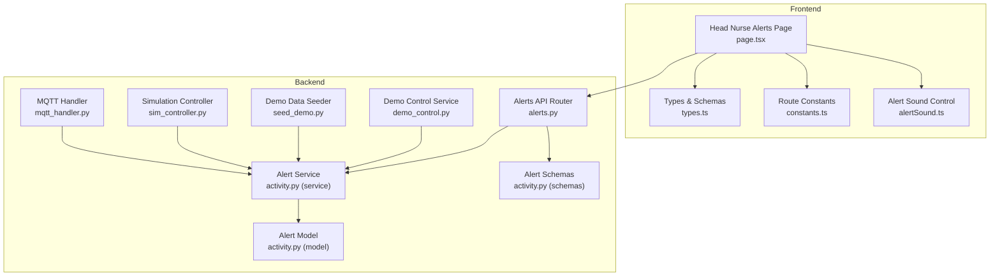
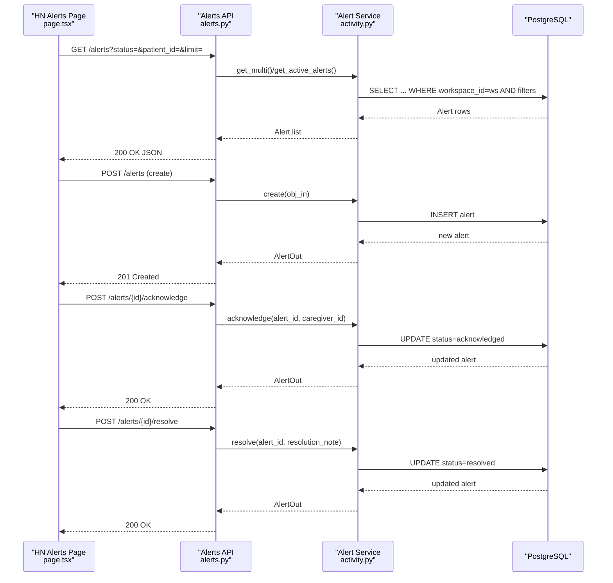
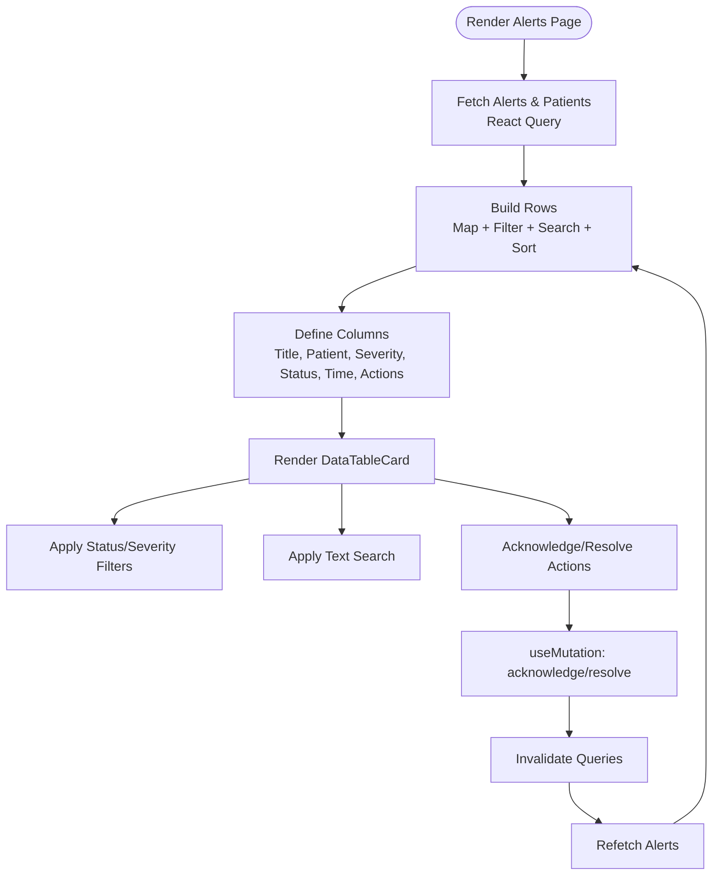
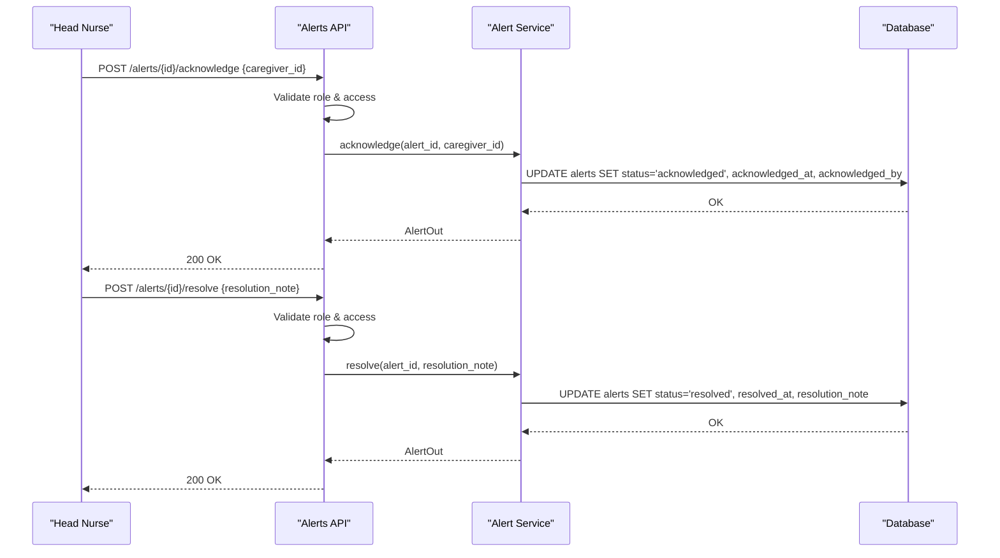
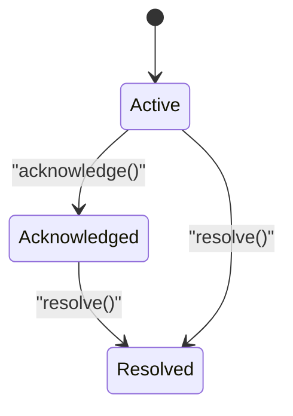
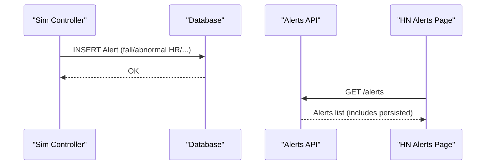
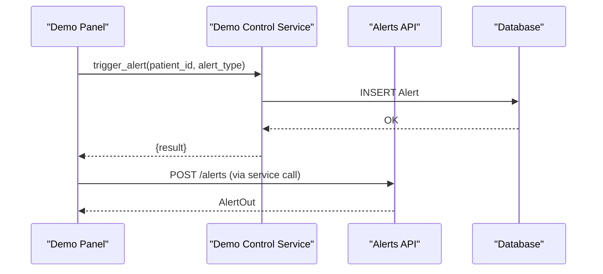
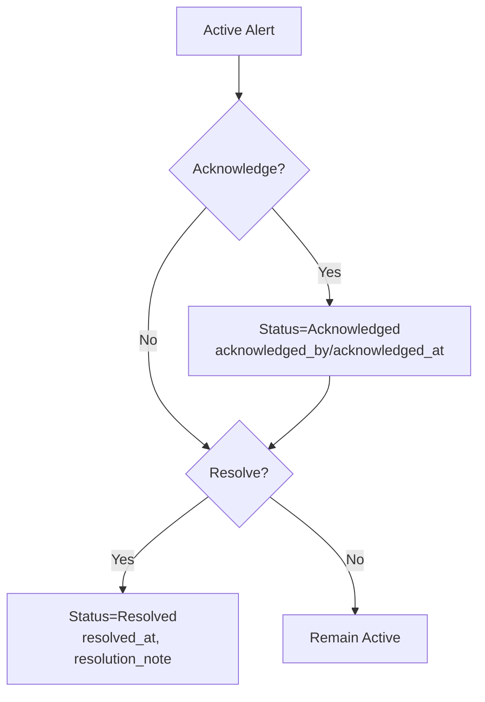
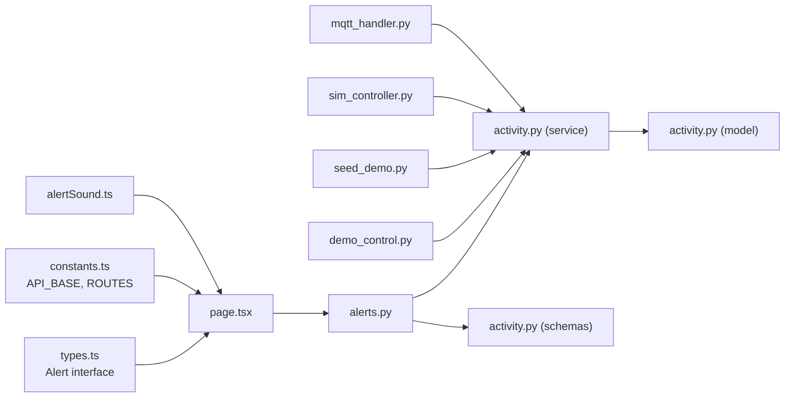

# Alerts Management

<cite>
**Referenced Files in This Document**
- [page.tsx](file://frontend/app/head-nurse/alerts/page.tsx)
- [types.ts](file://frontend/lib/types.ts)
- [constants.ts](file://frontend/lib/constants.ts)
- [alertSound.ts](file://frontend/lib/alertSound.ts)
- [alerts.py](file://server/app/api/endpoints/alerts.py)
- [activity.py](file://server/app/models/activity.py)
- [activity.py](file://server/app/services/activity.py)
- [activity.py](file://server/app/schemas/activity.py)
- [demo_control.py](file://server/app/services/demo_control.py)
- [seed_demo.py](file://server/scripts/seed_demo.py)
- [sim_controller.py](file://server/sim_controller.py)
- [mqtt_handler.py](file://server/app/mqtt_handler.py)
</cite>

## Table of Contents
1. [Introduction](#introduction)
2. [Project Structure](#project-structure)
3. [Core Components](#core-components)
4. [Architecture Overview](#architecture-overview)
5. [Detailed Component Analysis](#detailed-component-analysis)
6. [Dependency Analysis](#dependency-analysis)
7. [Performance Considerations](#performance-considerations)
8. [Troubleshooting Guide](#troubleshooting-guide)
9. [Conclusion](#conclusion)

## Introduction
This document describes the Head Nurse Alerts Management system. It covers the alert monitoring interface for viewing, categorizing, and responding to clinical alerts; severity and status semantics; triage workflows; filtering, sorting, and search; integration with device telemetry for automatic alert generation and manual alert creation; resolution and escalation; and audit trail logging. It also lists example alert types and response actions, and documents integration with the messaging system for alert notifications.

## Project Structure
The Alerts Management system spans the frontend Next.js application and the backend FastAPI server:
- Frontend: a dedicated Head Nurse alerts page with filtering, search, sorting, and inline actions (acknowledge/resolved).
- Backend: REST endpoints for listing, creating, acknowledging, and resolving alerts; SQLAlchemy models and Pydantic schemas; services implementing alert lifecycle; and integrations for telemetry-driven alerts and demo/manual triggers.

**Diagram sources**
- [page.tsx:48-324](file://frontend/app/head-nurse/alerts/page.tsx#L48-L324)
- [types.ts:241-258](file://frontend/lib/types.ts#L241-L258)
- [constants.ts:1-27](file://frontend/lib/constants.ts#L1-L27)
- [alertSound.ts:1-49](file://frontend/lib/alertSound.ts#L1-L49)
- [alerts.py:1-134](file://server/app/api/endpoints/alerts.py#L1-L134)
- [activity.py:35-75](file://server/app/services/activity.py#L35-L75)
- [activity.py:49-90](file://server/app/models/activity.py#L49-L90)
- [activity.py:36-70](file://server/app/schemas/activity.py#L36-L70)
- [demo_control.py:450-488](file://server/app/services/demo_control.py#L450-L488)
- [seed_demo.py:897-946](file://server/scripts/seed_demo.py#L897-L946)
- [sim_controller.py:895-1195](file://server/sim_controller.py#L895-L1195)
- [mqtt_handler.py:327-342](file://server/app/mqtt_handler.py#L327-L342)

**Section sources**
- [page.tsx:1-324](file://frontend/app/head-nurse/alerts/page.tsx#L1-L324)
- [alerts.py:1-134](file://server/app/api/endpoints/alerts.py#L1-L134)

## Core Components
- Frontend Alerts Page
  - Fetches alerts and patients via React Query, renders a table with severity badges and status badges, supports live refresh, inline actions (acknowledge, resolve), and highlights a specific alert via URL parameter.
  - Implements filtering by status and severity, and text-based search across title, type, description, and patient name.
  - Provides quick navigation to patient detail and displays a footer count of active alerts.
- Backend Alert API
  - Lists alerts with optional status and patient filters; supports pagination; enforces role-based access and visibility constraints.
  - Creates alerts with explicit roles; patients can create alerts for themselves under constraints.
  - Acknowledge and resolve endpoints enforce roles and patient access checks; updates timestamps and resolution notes.
- Alert Model, Schemas, and Service
  - Alert model defines fields for type, severity, status, timestamps, and resolution metadata.
  - Pydantic schemas define request/response shapes for create/read/update operations.
  - AlertService implements lifecycle transitions: active → acknowledged → resolved, with validation and persistence.
- Telemetry and Manual Triggers
  - Simulation controller generates alerts from vitals and fall detection and persists them.
  - MQTT handler conditionally creates fall alerts from acceleration/velocity thresholds and persists them.
  - Demo control service and seed script create demo alerts for testing and training.

**Section sources**
- [page.tsx:48-324](file://frontend/app/head-nurse/alerts/page.tsx#L48-L324)
- [alerts.py:29-134](file://server/app/api/endpoints/alerts.py#L29-L134)
- [activity.py:49-90](file://server/app/models/activity.py#L49-L90)
- [activity.py:36-70](file://server/app/schemas/activity.py#L36-L70)
- [activity.py:35-75](file://server/app/services/activity.py#L35-L75)
- [demo_control.py:450-488](file://server/app/services/demo_control.py#L450-L488)
- [seed_demo.py:897-946](file://server/scripts/seed_demo.py#L897-L946)
- [sim_controller.py:895-1195](file://server/sim_controller.py#L895-L1195)
- [mqtt_handler.py:327-342](file://server/app/mqtt_handler.py#L327-L342)

## Architecture Overview
The system follows a clean separation of concerns:
- Frontend: declarative UI with React Query for data fetching and caching, Lucide icons, and Tailwind-based components.
- Backend: FastAPI endpoints backed by SQLAlchemy ORM and Pydantic validation; services encapsulate business logic; models define persistence.
- Integrations: simulation and MQTT feed real-time telemetry-derived alerts; demo and seed scripts populate test data.

**Diagram sources**
- [page.tsx:58-104](file://frontend/app/head-nurse/alerts/page.tsx#L58-L104)
- [alerts.py:29-134](file://server/app/api/endpoints/alerts.py#L29-L134)
- [activity.py:35-75](file://server/app/services/activity.py#L35-L75)

## Detailed Component Analysis

### Frontend: Head Nurse Alerts Page
- Data fetching and caching
  - Uses React Query to fetch alerts and patients, with periodic refetching for near-real-time updates.
- Filtering and search
  - Status filter: all, active, acknowledged, resolved.
  - Severity filter: all, critical, warning, info.
  - Text search: title, alert type, description, and patient name.
- Sorting and presentation
  - Sorts by timestamp descending; severity/status badges reflect criticality and state.
- Actions and UX
  - Inline buttons to acknowledge or resolve active/acknowledged alerts.
  - Navigation to patient detail; footer shows active alert count.
  - Row highlighting for a specific alert identified by URL parameter.

**Diagram sources**
- [page.tsx:58-136](file://frontend/app/head-nurse/alerts/page.tsx#L58-L136)

**Section sources**
- [page.tsx:48-324](file://frontend/app/head-nurse/alerts/page.tsx#L48-L324)

### Backend: Alerts API Endpoints
- Endpoint coverage
  - GET /alerts: list with optional status and patient filters; enforces roles and visibility.
  - POST /alerts: create alert; patient role constrained to self.
  - GET /alerts/{id}: read single alert with access checks.
  - POST /alerts/{id}/acknowledge: acknowledge with caregiver context.
  - POST /alerts/{id}/resolve: resolve with resolution note.
- Access control
  - Roles permitted to create vary by endpoint; acknowledgment requires head nurse-level roles.
  - Patient access checks ensure users can only access alerts for visible patients.

**Diagram sources**
- [alerts.py:91-132](file://server/app/api/endpoints/alerts.py#L91-L132)
- [activity.py:47-71](file://server/app/services/activity.py#L47-L71)

**Section sources**
- [alerts.py:29-134](file://server/app/api/endpoints/alerts.py#L29-L134)

### Alert Lifecycle and Data Model
- Lifecycle
  - Active → Acknowledged → Resolved; service enforces state transitions and timestamps.
- Model fields
  - Type, severity, status, timestamps, resolution metadata, and optional patient/device linkage.
- Schemas
  - AlertCreate, AlertOut, AlertAcknowledge, AlertResolve define request/response contracts.

**Diagram sources**
- [activity.py:74-88](file://server/app/models/activity.py#L74-L88)
- [activity.py:47-71](file://server/app/services/activity.py#L47-L71)

**Section sources**
- [activity.py:49-90](file://server/app/models/activity.py#L49-L90)
- [activity.py:36-70](file://server/app/schemas/activity.py#L36-L70)
- [activity.py:35-75](file://server/app/services/activity.py#L35-L75)

### Alert Types, Severity, and Status
- Example alert types
  - Automatic: fall, abnormal HR, low SpO2, device offline, zone violation, missed medication, no movement.
  - Manual/demo: fall, abnormal HR, low battery, device offline, manual test.
- Severity levels
  - Info, warning, critical.
- Status management
  - Active, acknowledged, resolved.

**Section sources**
- [activity.py:70-72](file://server/app/models/activity.py#L70-L72)
- [sim_controller.py:353-383](file://server/sim_controller.py#L353-L383)
- [demo_control.py:452-474](file://server/app/services/demo_control.py#L452-L474)

### Integration with Device Telemetry
- Simulation controller
  - Generates vitals-based alerts (abnormal HR, low SpO2) and fall events; persists alerts to the database.
- MQTT handler
  - Detects fall conditions from acceleration and velocity thresholds and persists alerts.
- Both flows populate the alerts table for triage by head nurses.

**Diagram sources**
- [sim_controller.py:895-1195](file://server/sim_controller.py#L895-L1195)
- [mqtt_handler.py:327-342](file://server/app/mqtt_handler.py#L327-L342)
- [alerts.py:29-55](file://server/app/api/endpoints/alerts.py#L29-L55)
- [page.tsx:58-62](file://frontend/app/head-nurse/alerts/page.tsx#L58-L62)

**Section sources**
- [sim_controller.py:895-1195](file://server/sim_controller.py#L895-L1195)
- [mqtt_handler.py:327-342](file://server/app/mqtt_handler.py#L327-L342)

### Manual Alert Creation Workflows
- Demo control service
  - Creates alerts for a given patient with selected types and severity mapping.
- Demo panel
  - Provides a selector to choose alert types and triggers creation.
- Seed script
  - Seeds a variety of alerts with statuses and severities for testing.

**Diagram sources**
- [demo_control.py:452-488](file://server/app/services/demo_control.py#L452-L488)
- [seed_demo.py:897-946](file://server/scripts/seed_demo.py#L897-L946)

**Section sources**
- [demo_control.py:452-488](file://server/app/services/demo_control.py#L452-L488)
- [seed_demo.py:897-946](file://server/scripts/seed_demo.py#L897-L946)

### Alert Resolution Process and Escalation
- Resolution
  - Head nurse or supervisor acknowledges and resolves alerts; resolution note stored.
- Escalation
  - Not modeled in the referenced code; escalation would typically involve messaging and role-based routing outside the scope shown here.

**Diagram sources**
- [activity.py:47-71](file://server/app/services/activity.py#L47-L71)
- [alerts.py:91-132](file://server/app/api/endpoints/alerts.py#L91-L132)

**Section sources**
- [activity.py:47-71](file://server/app/services/activity.py#L47-L71)
- [alerts.py:91-132](file://server/app/api/endpoints/alerts.py#L91-L132)

### Audit Trail Logging
- Demo control logs an audit trail event when triggering alerts, capturing actor, action, entity, and details.

**Section sources**
- [demo_control.py:476-486](file://server/app/services/demo_control.py#L476-L486)

### Integration with Messaging System
- Messaging integration is not present in the referenced code for alert notifications; the system focuses on alert persistence and triage UI.

[No sources needed since this section doesn't analyze specific files]

## Dependency Analysis
- Frontend depends on:
  - API base constant for route construction.
  - Types for Alert shape and status/severity enums.
  - Alert sound module for user gesture priming and chime playback.
- Backend depends on:
  - Alert model and service for persistence and lifecycle.
  - Schemas for request/response validation.
  - Integrations (simulation, MQTT, demo, seed) for alert generation.

**Diagram sources**
- [types.ts:241-258](file://frontend/lib/types.ts#L241-L258)
- [constants.ts:1-27](file://frontend/lib/constants.ts#L1-L27)
- [alertSound.ts:1-49](file://frontend/lib/alertSound.ts#L1-L49)
- [page.tsx:48-324](file://frontend/app/head-nurse/alerts/page.tsx#L48-L324)
- [alerts.py:1-134](file://server/app/api/endpoints/alerts.py#L1-L134)
- [activity.py:35-75](file://server/app/services/activity.py#L35-L75)
- [activity.py:49-90](file://server/app/models/activity.py#L49-L90)
- [activity.py:36-70](file://server/app/schemas/activity.py#L36-L70)
- [demo_control.py:450-488](file://server/app/services/demo_control.py#L450-L488)
- [seed_demo.py:897-946](file://server/scripts/seed_demo.py#L897-L946)
- [sim_controller.py:895-1195](file://server/sim_controller.py#L895-L1195)
- [mqtt_handler.py:327-342](file://server/app/mqtt_handler.py#L327-L342)

**Section sources**
- [types.ts:241-258](file://frontend/lib/types.ts#L241-L258)
- [constants.ts:1-27](file://frontend/lib/constants.ts#L1-L27)
- [alertSound.ts:1-49](file://frontend/lib/alertSound.ts#L1-L49)
- [page.tsx:48-324](file://frontend/app/head-nurse/alerts/page.tsx#L48-L324)
- [alerts.py:1-134](file://server/app/api/endpoints/alerts.py#L1-L134)

## Performance Considerations
- Frontend
  - Periodic refetch interval balances freshness vs. network load; consider adaptive intervals or server-sent events for push updates.
  - Client-side filtering and sorting are efficient for moderate datasets; pagination and server-side filtering recommended for larger volumes.
- Backend
  - Indexes on workspace_id, patient_id, and timestamp improve query performance for alerts.
  - Limit parameters and visibility checks prevent excessive data transfer.

[No sources needed since this section provides general guidance]

## Troubleshooting Guide
- Common issues
  - Access denied: ensure the user role permits alert operations and has access to the targeted patient.
  - Alert not found: verify alert ID and workspace context.
  - Action errors: check mutation error handling and retry after correcting inputs.
- Frontend diagnostics
  - Inspect actionError state and console logs for API failures.
  - Confirm refetch intervals and query keys invalidate correctly after actions.
- Backend diagnostics
  - Review endpoint logs and database state for lifecycle transitions.
  - Validate alert creation parameters and severity mapping.

**Section sources**
- [page.tsx:98-104](file://frontend/app/head-nurse/alerts/page.tsx#L98-L104)
- [alerts.py:38-40](file://server/app/api/endpoints/alerts.py#L38-L40)
- [activity.py:47-71](file://server/app/services/activity.py#L47-L71)

## Conclusion
The Head Nurse Alerts Management system provides a robust, role-aware interface for triaging actionable alerts derived from telemetry and manual inputs. It supports comprehensive filtering, search, and inline actions, integrates with device telemetry for automatic alert generation, and offers pathways for manual creation and demo seeding. The backend enforces access control, maintains lifecycle state, and persists audit events for traceability.