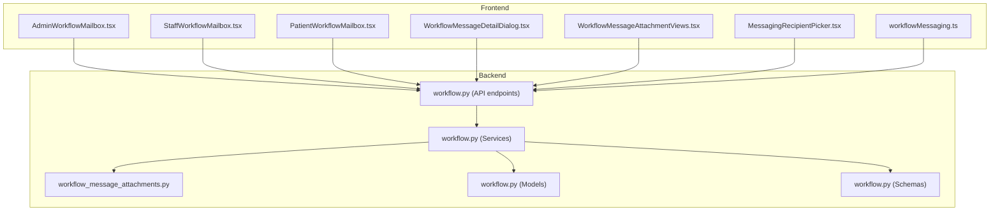
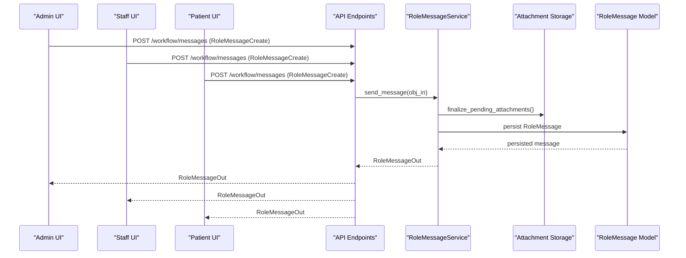
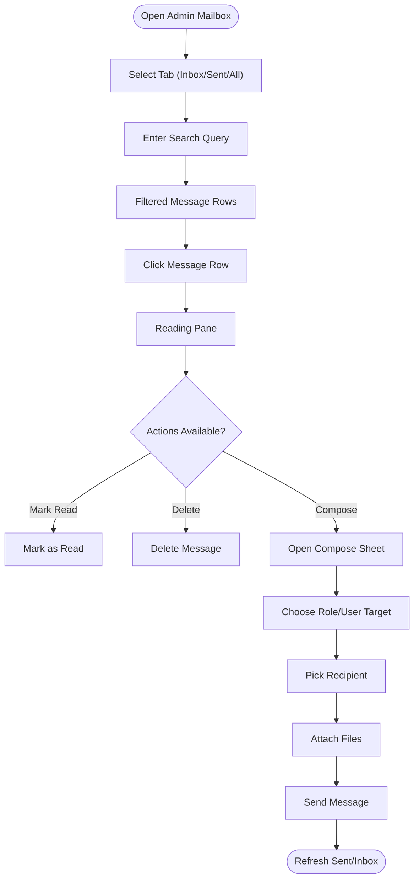
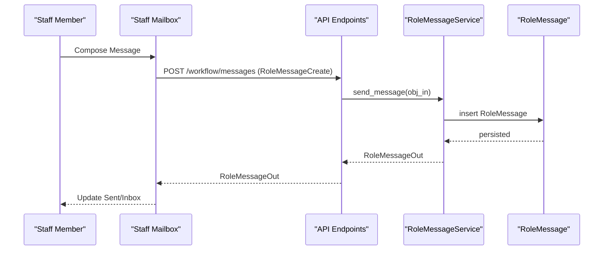
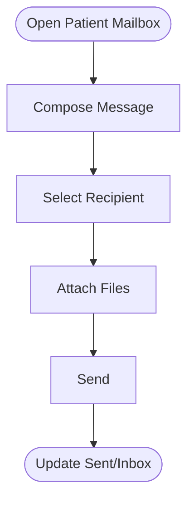
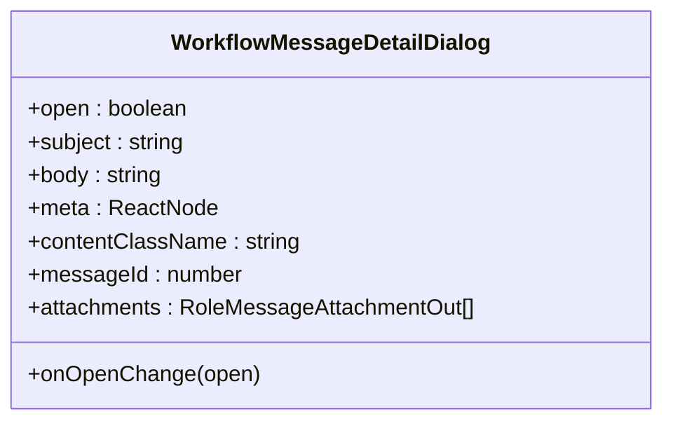
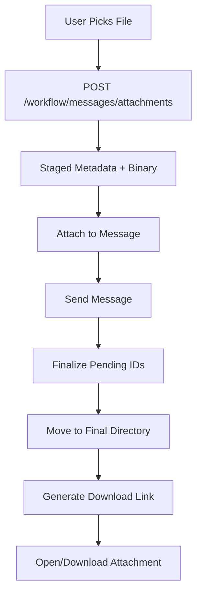
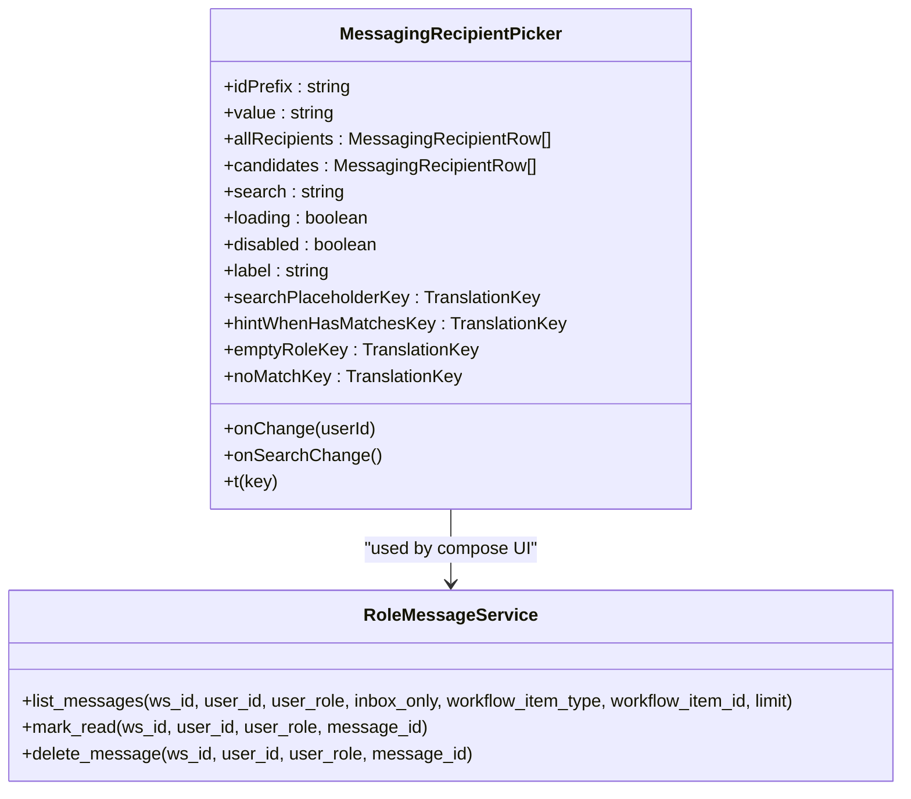
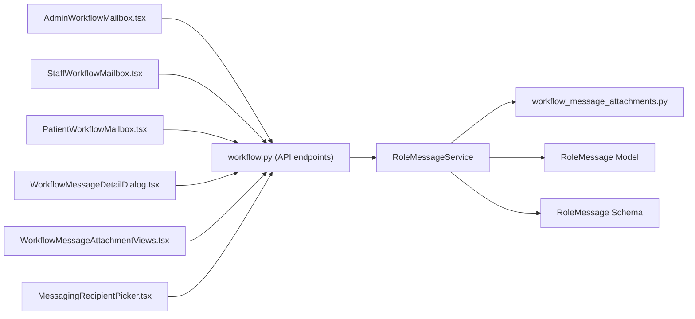

# Communication System

<cite>
**Referenced Files in This Document**
- [AdminWorkflowMailbox.tsx](file://frontend/components/messaging/AdminWorkflowMailbox.tsx)
- [StaffWorkflowMailbox.tsx](file://frontend/components/messaging/StaffWorkflowMailbox.tsx)
- [PatientWorkflowMailbox.tsx](file://frontend/components/messaging/PatientWorkflowMailbox.tsx)
- [WorkflowMessageDetailDialog.tsx](file://frontend/components/messaging/WorkflowMessageDetailDialog.tsx)
- [WorkflowMessageAttachmentViews.tsx](file://frontend/components/messaging/WorkflowMessageAttachmentViews.tsx)
- [MessagingRecipientPicker.tsx](file://frontend/components/messaging/MessagingRecipientPicker.tsx)
- [workflowMessaging.ts](file://frontend/lib/workflowMessaging.ts)
- [workflow.py](file://server/app/models/workflow.py)
- [workflow.py](file://server/app/schemas/workflow.py)
- [workflow.py](file://server/app/services/workflow.py)
- [workflow.py](file://server/app/api/endpoints/workflow.py)
- [workflow_message_attachments.py](file://server/app/services/workflow_message_attachments.py)
</cite>

## Table of Contents
1. [Introduction](#introduction)
2. [Project Structure](#project-structure)
3. [Core Components](#core-components)
4. [Architecture Overview](#architecture-overview)
5. [Detailed Component Analysis](#detailed-component-analysis)
6. [Dependency Analysis](#dependency-analysis)
7. [Performance Considerations](#performance-considerations)
8. [Troubleshooting Guide](#troubleshooting-guide)
9. [Conclusion](#conclusion)
10. [Appendices](#appendices)

## Introduction
This document describes the Head Nurse Communication System, focusing on the workflow messaging interface for staff communication, message threading, and workflow integration. It covers:
- Admin workflow mailbox for system-wide announcements and administrative communications
- Staff workflow mailbox for team coordination and care team messaging
- Patient workflow mailbox for patient-to-staff communication
- Workflow message detail dialogs, attachment handling, and message routing between roles
- Integration with workflow jobs, task assignments, and care directives
- Examples of communication workflows, message templates, escalation procedures, and integration with external communication channels

## Project Structure
The communication system spans frontend React components and backend FastAPI services:
- Frontend messaging UI components and utilities
- Backend models, schemas, services, and API endpoints for workflow messaging
- Attachment storage and retrieval services



**Diagram sources**
- [AdminWorkflowMailbox.tsx:110-688](file://frontend/components/messaging/AdminWorkflowMailbox.tsx#L110-L688)
- [StaffWorkflowMailbox.tsx:153-723](file://frontend/components/messaging/StaffWorkflowMailbox.tsx#L153-L723)
- [PatientWorkflowMailbox.tsx:71-517](file://frontend/components/messaging/PatientWorkflowMailbox.tsx#L71-L517)
- [WorkflowMessageDetailDialog.tsx:28-102](file://frontend/components/messaging/WorkflowMessageDetailDialog.tsx#L28-L102)
- [WorkflowMessageAttachmentViews.tsx:26-142](file://frontend/components/messaging/WorkflowMessageAttachmentViews.tsx#L26-L142)
- [MessagingRecipientPicker.tsx:68-155](file://frontend/components/messaging/MessagingRecipientPicker.tsx#L68-L155)
- [workflowMessaging.ts:1-21](file://frontend/lib/workflowMessaging.ts#L1-L21)
- [workflow.py:261-404](file://server/app/api/endpoints/workflow.py#L261-L404)
- [workflow.py:945-1105](file://server/app/services/workflow.py#L945-L1105)
- [workflow_message_attachments.py:52-202](file://server/app/services/workflow_message_attachments.py#L52-L202)
- [workflow.py:67-89](file://server/app/models/workflow.py#L67-L89)
- [workflow.py:124-197](file://server/app/schemas/workflow.py#L124-L197)

**Section sources**
- [AdminWorkflowMailbox.tsx:110-688](file://frontend/components/messaging/AdminWorkflowMailbox.tsx#L110-L688)
- [StaffWorkflowMailbox.tsx:153-723](file://frontend/components/messaging/StaffWorkflowMailbox.tsx#L153-L723)
- [PatientWorkflowMailbox.tsx:71-517](file://frontend/components/messaging/PatientWorkflowMailbox.tsx#L71-L517)
- [WorkflowMessageDetailDialog.tsx:28-102](file://frontend/components/messaging/WorkflowMessageDetailDialog.tsx#L28-L102)
- [WorkflowMessageAttachmentViews.tsx:26-142](file://frontend/components/messaging/WorkflowMessageAttachmentViews.tsx#L26-L142)
- [MessagingRecipientPicker.tsx:68-155](file://frontend/components/messaging/MessagingRecipientPicker.tsx#L68-L155)
- [workflowMessaging.ts:1-21](file://frontend/lib/workflowMessaging.ts#L1-L21)
- [workflow.py:261-404](file://server/app/api/endpoints/workflow.py#L261-L404)
- [workflow.py:945-1105](file://server/app/services/workflow.py#L945-L1105)
- [workflow_message_attachments.py:52-202](file://server/app/services/workflow_message_attachments.py#L52-L202)
- [workflow.py:67-89](file://server/app/models/workflow.py#L67-L89)
- [workflow.py:124-197](file://server/app/schemas/workflow.py#L124-L197)

## Core Components
- Admin workflow mailbox: Allows administrators to broadcast to roles or send direct messages to staff/patients, with compose sheet, recipient picker, and attachment support.
- Staff workflow mailbox: Enables head nurses, supervisors, and observers to communicate with other staff members and optionally tie messages to specific patients and workflow items.
- Patient workflow mailbox: Provides patients with a simplified interface to send messages to staff, with recipient selection and attachments.
- Message detail dialog: Unified modal for viewing message content, metadata, and attachments.
- Attachment views: Compose-time attachment chips and read-only attachment links with size and type metadata.
- Recipient picker: Role-aware search and selection for messaging recipients.
- Utility helpers: Attachment URL generation, deletion permissions, and limits.

**Section sources**
- [AdminWorkflowMailbox.tsx:110-688](file://frontend/components/messaging/AdminWorkflowMailbox.tsx#L110-L688)
- [StaffWorkflowMailbox.tsx:153-723](file://frontend/components/messaging/StaffWorkflowMailbox.tsx#L153-L723)
- [PatientWorkflowMailbox.tsx:71-517](file://frontend/components/messaging/PatientWorkflowMailbox.tsx#L71-L517)
- [WorkflowMessageDetailDialog.tsx:28-102](file://frontend/components/messaging/WorkflowMessageDetailDialog.tsx#L28-L102)
- [WorkflowMessageAttachmentViews.tsx:26-142](file://frontend/components/messaging/WorkflowMessageAttachmentViews.tsx#L26-L142)
- [MessagingRecipientPicker.tsx:68-155](file://frontend/components/messaging/MessagingRecipientPicker.tsx#L68-L155)
- [workflowMessaging.ts:1-21](file://frontend/lib/workflowMessaging.ts#L1-L21)

## Architecture Overview
The system integrates frontend UI with backend services through typed APIs and schemas. Messages can be addressed to roles or individual users, optionally linked to workflow items (tasks, schedules, directives). Attachments are staged and finalized via dedicated services.



**Diagram sources**
- [workflow.py:315-325](file://server/app/api/endpoints/workflow.py#L315-L325)
- [workflow.py:945-1018](file://server/app/services/workflow.py#L945-L1018)
- [workflow_message_attachments.py:94-153](file://server/app/services/workflow_message_attachments.py#L94-L153)
- [workflow.py:67-89](file://server/app/models/workflow.py#L67-L89)

## Detailed Component Analysis

### Admin Workflow Mailbox
- Purpose: System-wide announcements and administrative messaging to roles or individuals.
- Features:
  - Tabbed inbox/sent/all views
  - Search across subjects, bodies, and recipient labels
  - Compose sheet supporting role or user targets
  - Recipient filtering by role and search
  - Attachments with upload and preview
  - Read/unread indicators and actions
  - Delete permission enforcement



**Diagram sources**
- [AdminWorkflowMailbox.tsx:110-688](file://frontend/components/messaging/AdminWorkflowMailbox.tsx#L110-L688)

**Section sources**
- [AdminWorkflowMailbox.tsx:110-688](file://frontend/components/messaging/AdminWorkflowMailbox.tsx#L110-L688)

### Staff Workflow Mailbox (Head Nurse, Supervisor, Observer)
- Purpose: Team coordination and care team messaging with optional patient association.
- Features:
  - Role-specific compose sheet with recipient role filter
  - Patient association dropdown
  - Message list with patient name and timestamps
  - Read/unread indicators and mark-read action
  - Attachment previews and downloads
  - Delete permission enforcement



**Diagram sources**
- [StaffWorkflowMailbox.tsx:153-723](file://frontend/components/messaging/StaffWorkflowMailbox.tsx#L153-L723)
- [workflow.py:315-325](file://server/app/api/endpoints/workflow.py#L315-L325)
- [workflow.py:945-1018](file://server/app/services/workflow.py#L945-L1018)

**Section sources**
- [StaffWorkflowMailbox.tsx:153-723](file://frontend/components/messaging/StaffWorkflowMailbox.tsx#L153-L723)

### Patient Workflow Mailbox
- Purpose: Patient-to-staff communication with recipient selection.
- Features:
  - Recipient selection from workspace users
  - Subject/body composition
  - Attachment uploads
  - Inbox/sent tabs and search
  - Mark-as-read for incoming messages



**Diagram sources**
- [PatientWorkflowMailbox.tsx:71-517](file://frontend/components/messaging/PatientWorkflowMailbox.tsx#L71-L517)

**Section sources**
- [PatientWorkflowMailbox.tsx:71-517](file://frontend/components/messaging/PatientWorkflowMailbox.tsx#L71-L517)

### Workflow Message Detail Dialog
- Purpose: Unified modal for viewing message content, metadata, and attachments.
- Features:
  - Subject header
  - Optional metadata bar
  - Attachment links with file sizes
  - Scrollable content area



**Diagram sources**
- [WorkflowMessageDetailDialog.tsx:28-102](file://frontend/components/messaging/WorkflowMessageDetailDialog.tsx#L28-L102)

**Section sources**
- [WorkflowMessageDetailDialog.tsx:28-102](file://frontend/components/messaging/WorkflowMessageDetailDialog.tsx#L28-L102)

### Attachment Handling
- Pending uploads: Files uploaded to a temporary staging area with metadata.
- Finalization: Pending IDs are resolved into final storage with secure filenames and content-type normalization.
- Retrieval: Signed URLs or cookie-authenticated endpoints serve attachments.
- Limits: Maximum attachment count and size enforced on both client and server.



**Diagram sources**
- [WorkflowMessageAttachmentViews.tsx:26-142](file://frontend/components/messaging/WorkflowMessageAttachmentViews.tsx#L26-L142)
- [workflow.py:345-385](file://server/app/api/endpoints/workflow.py#L345-L385)
- [workflow_message_attachments.py:52-202](file://server/app/services/workflow_message_attachments.py#L52-L202)

**Section sources**
- [WorkflowMessageAttachmentViews.tsx:26-142](file://frontend/components/messaging/WorkflowMessageAttachmentViews.tsx#L26-L142)
- [workflow.py:345-385](file://server/app/api/endpoints/workflow.py#L345-L385)
- [workflow_message_attachments.py:52-202](file://server/app/services/workflow_message_attachments.py#L52-L202)

### Recipient Picker and Routing
- Role-aware filtering: Staff vs patient accounts; supports role and search filters.
- Dynamic candidate lists: Real-time matching against display name, username, role, and identifiers.
- Routing: Messages can target a role (broadcast) or a specific user; workflow items can be linked to tasks, schedules, or directives.



**Diagram sources**
- [MessagingRecipientPicker.tsx:68-155](file://frontend/components/messaging/MessagingRecipientPicker.tsx#L68-L155)
- [workflow.py:1019-1056](file://server/app/services/workflow.py#L1019-L1056)

**Section sources**
- [MessagingRecipientPicker.tsx:68-155](file://frontend/components/messaging/MessagingRecipientPicker.tsx#L68-L155)
- [workflow.py:1019-1056](file://server/app/services/workflow.py#L1019-L1056)

### Integration with Workflow Jobs, Tasks, and Directives
- Workflow linkage: Messages can be associated with workflow items (task, schedule, directive) via type and ID.
- Automatic handoff messaging: When tasks or schedules are reassigned, the system automatically sends a message to the target role/user.
- Audit trail: Messaging actions are logged for compliance and traceability.

```mermaid
sequenceDiagram
participant Actor as "Actor"
participant API as "API"
participant SVC as "CareTaskService"
participant MSG as "RoleMessageService"
participant DB as "DB"
Actor->>API : PATCH /tasks/{id} or handoff
API->>SVC : handoff(...)
SVC->>MSG : send_message(RoleMessageCreate)
MSG->>DB : insert RoleMessage
DB-->>MSG : persisted
MSG-->>API : RoleMessageOut
API-->>Actor : Updated Task + Message
```

**Diagram sources**
- [workflow.py:778-793](file://server/app/api/endpoints/workflow.py#L778-L793)
- [workflow.py:901-917](file://server/app/services/workflow.py#L901-L917)
- [workflow.py:945-1018](file://server/app/services/workflow.py#L945-L1018)

**Section sources**
- [workflow.py:778-793](file://server/app/api/endpoints/workflow.py#L778-L793)
- [workflow.py:901-917](file://server/app/services/workflow.py#L901-L917)
- [workflow.py:945-1018](file://server/app/services/workflow.py#L945-L1018)

## Dependency Analysis
- Frontend depends on:
  - API client for workflow messaging endpoints
  - React Query for caching and refetching
  - i18n for localized labels
  - Utility helpers for attachment URLs and permissions
- Backend depends on:
  - SQLAlchemy models for persistence
  - Pydantic schemas for validation and serialization
  - Attachment service for storage lifecycle
  - Audit service for compliance logging



**Diagram sources**
- [AdminWorkflowMailbox.tsx:110-688](file://frontend/components/messaging/AdminWorkflowMailbox.tsx#L110-L688)
- [StaffWorkflowMailbox.tsx:153-723](file://frontend/components/messaging/StaffWorkflowMailbox.tsx#L153-L723)
- [PatientWorkflowMailbox.tsx:71-517](file://frontend/components/messaging/PatientWorkflowMailbox.tsx#L71-L517)
- [WorkflowMessageDetailDialog.tsx:28-102](file://frontend/components/messaging/WorkflowMessageDetailDialog.tsx#L28-L102)
- [WorkflowMessageAttachmentViews.tsx:26-142](file://frontend/components/messaging/WorkflowMessageAttachmentViews.tsx#L26-L142)
- [MessagingRecipientPicker.tsx:68-155](file://frontend/components/messaging/MessagingRecipientPicker.tsx#L68-L155)
- [workflow.py:261-404](file://server/app/api/endpoints/workflow.py#L261-L404)
- [workflow.py:945-1105](file://server/app/services/workflow.py#L945-L1105)
- [workflow_message_attachments.py:52-202](file://server/app/services/workflow_message_attachments.py#L52-L202)
- [workflow.py:67-89](file://server/app/models/workflow.py#L67-L89)
- [workflow.py:124-197](file://server/app/schemas/workflow.py#L124-L197)

**Section sources**
- [AdminWorkflowMailbox.tsx:110-688](file://frontend/components/messaging/AdminWorkflowMailbox.tsx#L110-L688)
- [StaffWorkflowMailbox.tsx:153-723](file://frontend/components/messaging/StaffWorkflowMailbox.tsx#L153-L723)
- [PatientWorkflowMailbox.tsx:71-517](file://frontend/components/messaging/PatientWorkflowMailbox.tsx#L71-L517)
- [WorkflowMessageDetailDialog.tsx:28-102](file://frontend/components/messaging/WorkflowMessageDetailDialog.tsx#L28-L102)
- [WorkflowMessageAttachmentViews.tsx:26-142](file://frontend/components/messaging/WorkflowMessageAttachmentViews.tsx#L26-L142)
- [MessagingRecipientPicker.tsx:68-155](file://frontend/components/messaging/MessagingRecipientPicker.tsx#L68-L155)
- [workflow.py:261-404](file://server/app/api/endpoints/workflow.py#L261-L404)
- [workflow.py:945-1105](file://server/app/services/workflow.py#L945-L1105)
- [workflow_message_attachments.py:52-202](file://server/app/services/workflow_message_attachments.py#L52-L202)
- [workflow.py:67-89](file://server/app/models/workflow.py#L67-L89)
- [workflow.py:124-197](file://server/app/schemas/workflow.py#L124-L197)

## Performance Considerations
- Pagination and limits: API endpoints enforce maximum record counts to prevent heavy queries.
- Refetch intervals: Admin mailbox refreshes periodically to keep the UI up to date.
- Caching: React Query caches message lists and recipient data to reduce network load.
- Attachment size limits: Enforced on both client and server to avoid oversized requests.
- Sorting and indexing: Backend sorts by creation time and indexes recipient fields for efficient filtering.

[No sources needed since this section provides general guidance]

## Troubleshooting Guide
Common issues and resolutions:
- Cannot delete message: Deletion is restricted to sender, recipient, or admins/head nurses; verify user role and ownership.
- Cannot mark as read: Only intended recipients can mark messages as read; check role/recipient conditions.
- No recipients found: Ensure the compose sheet is opened while enabling recipient queries; verify role filters and search terms.
- Attachment errors: Confirm file type and size limits; check pending IDs and finalize process.
- Access denied: Some operations require specific roles or visibility into related workflow items.

**Section sources**
- [workflow.py:933-943](file://server/app/services/workflow.py#L933-L943)
- [workflow.py:1057-1080](file://server/app/services/workflow.py#L1057-L1080)
- [workflow.py:282-313](file://server/app/api/endpoints/workflow.py#L282-L313)
- [workflow_message_attachments.py:52-81](file://server/app/services/workflow_message_attachments.py#L52-L81)

## Conclusion
The Head Nurse Communication System provides a robust, role-aware messaging infrastructure integrated with workflow items. Administrators can broadcast system-wide updates, staff can coordinate care with team members and patients, and patients can reach out to staff securely. Attachments are handled consistently, and integrations with tasks, schedules, and directives streamline care coordination. The system enforces permissions, maintains audit trails, and offers responsive UIs with search, filtering, and read/unread tracking.

[No sources needed since this section summarizes without analyzing specific files]

## Appendices

### Communication Workflows and Templates
- System-wide announcement:
  - Sender: Administrator
  - Target: Role (e.g., head_nurse, supervisor)
  - Content: Standardized subject/body with optional attachments
  - Outcome: Broadcast to all users in the selected role
- Team coordination:
  - Sender: Head nurse/supervisor/observer
  - Target: User or role
  - Optional: Patient association and workflow item linkage
  - Outcome: Message delivered to recipient(s) with read tracking
- Patient inquiry:
  - Sender: Patient
  - Target: Staff member
  - Outcome: Message appears in staff inbox with read/unread indicators

[No sources needed since this section provides general guidance]

### Escalation Procedures
- Role-based escalation: Messages can be sent to higher roles (e.g., supervisor/head_nurse) for oversight.
- Automatic handoff: When tasks/schedules change ownership, a message is automatically sent to the new assignee.
- Directive acknowledgment: Care directives can be acknowledged by the responsible party, with audit trail logging.

**Section sources**
- [workflow.py:901-917](file://server/app/services/workflow.py#L901-L917)
- [workflow.py:1324-1385](file://server/app/services/workflow.py#L1324-L1385)

### External Communication Channels
- MCP tool integration: Messages can be sent programmatically via MCP tools with explicit scope requirements.
- Audit events: All messaging actions are recorded for compliance and monitoring.

**Section sources**
- [workflow.py:1075-1118](file://server/app/api/endpoints/workflow.py#L1075-L1118)
- [workflow.py:997-1017](file://server/app/services/workflow.py#L997-L1017)