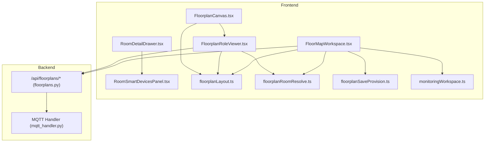
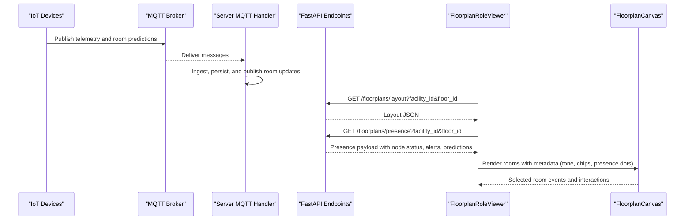
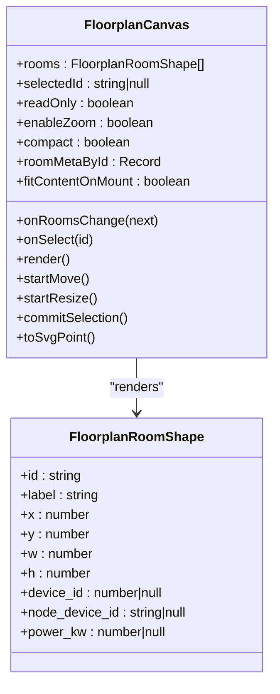
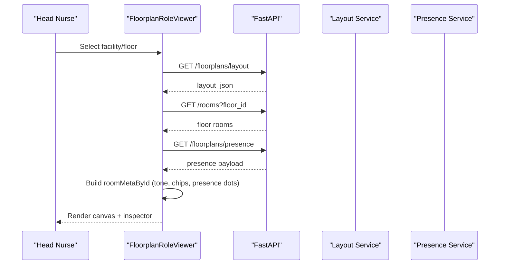
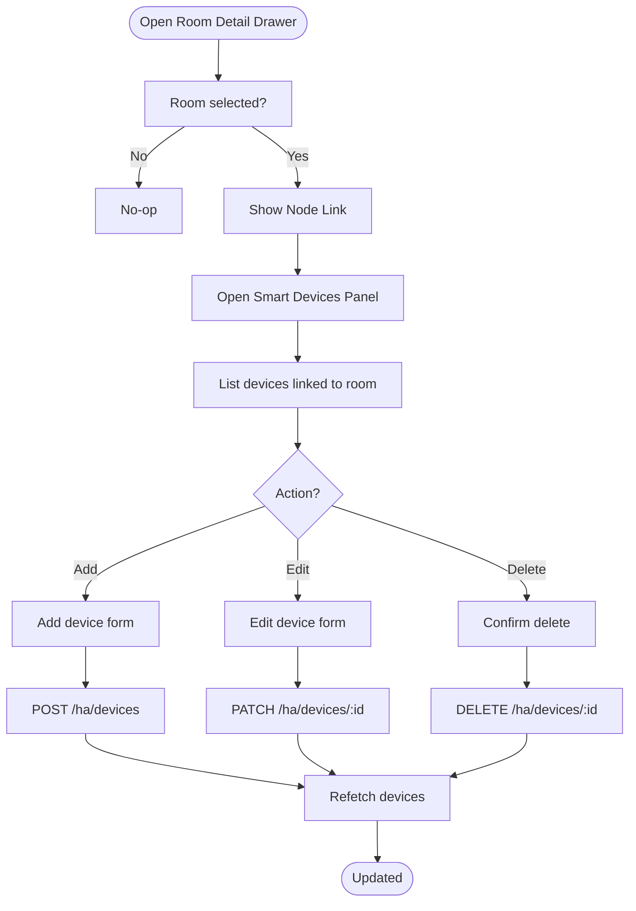
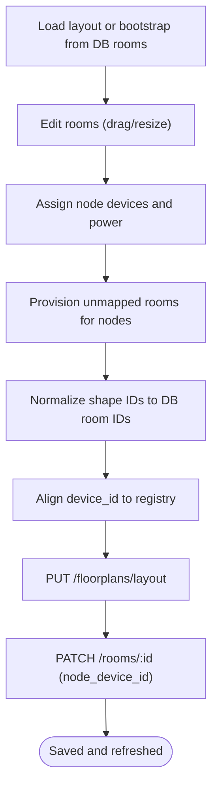
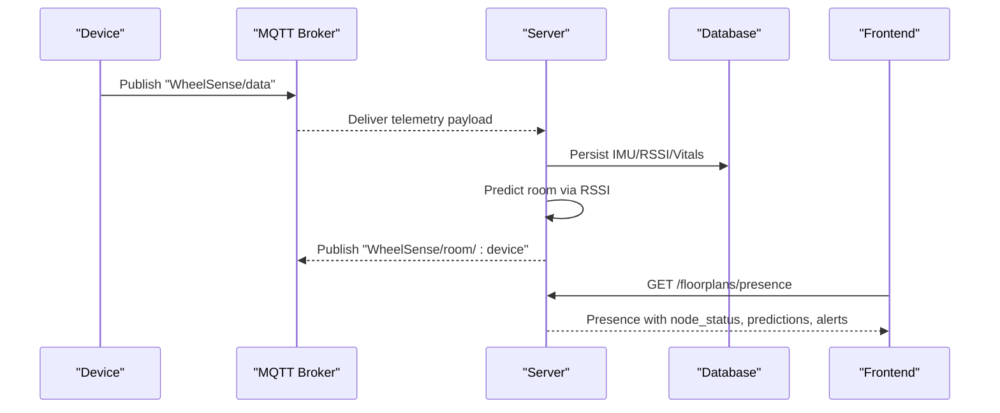
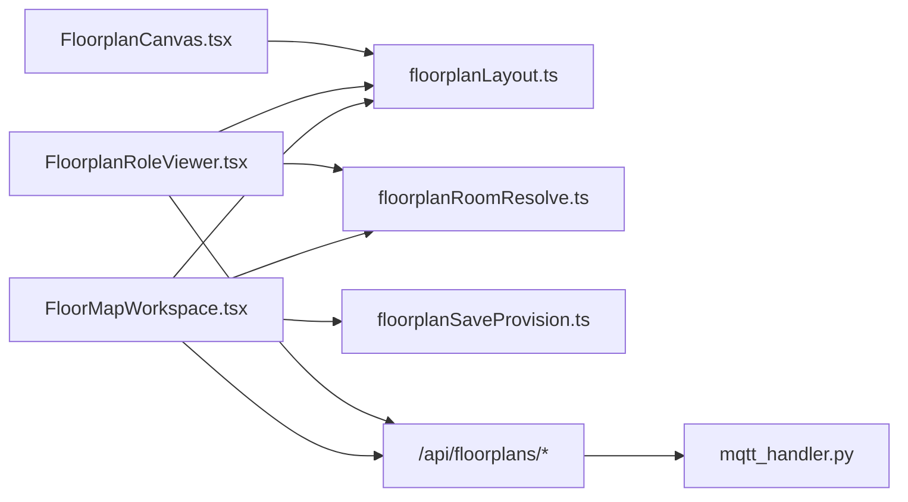

# Floorplan Monitoring

<cite>
**Referenced Files in This Document**
- [FloorplanCanvas.tsx](file://frontend/components/floorplan/FloorplanCanvas.tsx)
- [FloorplanRoleViewer.tsx](file://frontend/components/floorplan/FloorplanRoleViewer.tsx)
- [floorplanLayout.ts](file://frontend/lib/floorplanLayout.ts)
- [floorplanRoomResolve.ts](file://frontend/lib/floorplanRoomResolve.ts)
- [floorplanSaveProvision.ts](file://frontend/lib/floorplanSaveProvision.ts)
- [monitoringWorkspace.ts](file://frontend/lib/monitoringWorkspace.ts)
- [FloorMapWorkspace.tsx](file://frontend/components/admin/monitoring/FloorMapWorkspace.tsx)
- [RoomDetailDrawer.tsx](file://frontend/components/admin/monitoring/RoomDetailDrawer.tsx)
- [RoomSmartDevicesPanel.tsx](file://frontend/components/admin/monitoring/RoomSmartDevicesPanel.tsx)
- [mqtt_handler.py](file://server/app/mqtt_handler.py)
- [floorplans.py](file://server/app/api/endpoints/floorplans.py)
</cite>

## Table of Contents
1. [Introduction](#introduction)
2. [Project Structure](#project-structure)
3. [Core Components](#core-components)
4. [Architecture Overview](#architecture-overview)
5. [Detailed Component Analysis](#detailed-component-analysis)
6. [Dependency Analysis](#dependency-analysis)
7. [Performance Considerations](#performance-considerations)
8. [Troubleshooting Guide](#troubleshooting-guide)
9. [Conclusion](#conclusion)
10. [Appendices](#appendices)

## Introduction
This document describes the Head Nurse Floorplan Monitoring interface, focusing on the interactive SVG-based floorplan visualization that displays real-time patient locations, device status, and room occupancy. It explains the floorplan canvas implementation, role-based viewing modes, room detail panels, device status indicators, occupancy monitoring, MQTT telemetry integration, and floorplan layout management. It also provides examples of customization, room assignment workflows, and spatial analytics for ward management.

## Project Structure
The floorplan monitoring feature spans frontend components and libraries, plus backend endpoints and MQTT ingestion:
- Frontend:
  - Floorplan canvas and role viewer
  - Layout normalization and room resolution utilities
  - Admin floor map workspace and room detail panels
- Backend:
  - Floorplan endpoints for layout and presence
  - MQTT handler for real-time telemetry and room predictions

**Diagram sources**
- [FloorplanCanvas.tsx:183-617](file://frontend/components/floorplan/FloorplanCanvas.tsx#L183-L617)
- [FloorplanRoleViewer.tsx:567-1143](file://frontend/components/floorplan/FloorplanRoleViewer.tsx#L567-L1143)
- [FloorMapWorkspace.tsx:77-734](file://frontend/components/admin/monitoring/FloorMapWorkspace.tsx#L77-L734)
- [RoomDetailDrawer.tsx:20-88](file://frontend/components/admin/monitoring/RoomDetailDrawer.tsx#L20-L88)
- [RoomSmartDevicesPanel.tsx:16-239](file://frontend/components/admin/monitoring/RoomSmartDevicesPanel.tsx#L16-L239)
- [floorplanLayout.ts:1-103](file://frontend/lib/floorplanLayout.ts#L1-L103)
- [floorplanRoomResolve.ts:1-108](file://frontend/lib/floorplanRoomResolve.ts#L1-L108)
- [floorplanSaveProvision.ts:1-64](file://frontend/lib/floorplanSaveProvision.ts#L1-L64)
- [monitoringWorkspace.ts:1-146](file://frontend/lib/monitoringWorkspace.ts#L1-L146)
- [floorplans.py:135-242](file://server/app/api/endpoints/floorplans.py#L135-L242)
- [mqtt_handler.py:73-137](file://server/app/mqtt_handler.py#L73-L137)

**Section sources**
- [FloorplanCanvas.tsx:1-617](file://frontend/components/floorplan/FloorplanCanvas.tsx#L1-L617)
- [FloorplanRoleViewer.tsx:1-1143](file://frontend/components/floorplan/FloorplanRoleViewer.tsx#L1-L1143)
- [FloorMapWorkspace.tsx:1-734](file://frontend/components/admin/monitoring/FloorMapWorkspace.tsx#L1-L734)
- [RoomDetailDrawer.tsx:1-88](file://frontend/components/admin/monitoring/RoomDetailDrawer.tsx#L1-L88)
- [RoomSmartDevicesPanel.tsx:1-239](file://frontend/components/admin/monitoring/RoomSmartDevicesPanel.tsx#L1-L239)
- [floorplanLayout.ts:1-103](file://frontend/lib/floorplanLayout.ts#L1-L103)
- [floorplanRoomResolve.ts:1-108](file://frontend/lib/floorplanRoomResolve.ts#L1-L108)
- [floorplanSaveProvision.ts:1-64](file://frontend/lib/floorplanSaveProvision.ts#L1-L64)
- [monitoringWorkspace.ts:1-146](file://frontend/lib/monitoringWorkspace.ts#L1-L146)
- [floorplans.py:1-242](file://server/app/api/endpoints/floorplans.py#L1-L242)
- [mqtt_handler.py:1-667](file://server/app/mqtt_handler.py#L1-L667)

## Core Components
- FloorplanCanvas: An SVG-based interactive canvas for rendering rooms, presence dots, and status chips; supports dragging, resizing, panning, and zooming.
- FloorplanRoleViewer: A role-aware floorplan viewer that fetches layout and presence, computes room metadata, and renders a room inspector panel.
- Layout utilities: Normalize coordinates, bootstrap rooms from DB, and resolve layout shapes to DB rooms.
- Admin Floor Map Workspace: Allows editing floorplan layouts, assigning node devices, provisioning unmapped rooms, and saving layouts.
- Room detail panels: Drawers and panels for room properties, node links, and smart device associations.

**Section sources**
- [FloorplanCanvas.tsx:183-617](file://frontend/components/floorplan/FloorplanCanvas.tsx#L183-L617)
- [FloorplanRoleViewer.tsx:567-1143](file://frontend/components/floorplan/FloorplanRoleViewer.tsx#L567-L1143)
- [floorplanLayout.ts:55-103](file://frontend/lib/floorplanLayout.ts#L55-L103)
- [floorplanRoomResolve.ts:63-108](file://frontend/lib/floorplanRoomResolve.ts#L63-L108)
- [FloorMapWorkspace.tsx:355-441](file://frontend/components/admin/monitoring/FloorMapWorkspace.tsx#L355-L441)
- [RoomDetailDrawer.tsx:20-88](file://frontend/components/admin/monitoring/RoomDetailDrawer.tsx#L20-L88)
- [RoomSmartDevicesPanel.tsx:16-239](file://frontend/components/admin/monitoring/RoomSmartDevicesPanel.tsx#L16-L239)

## Architecture Overview
The system integrates real-time telemetry from MQTT into backend services, which expose floorplan layout and presence via FastAPI endpoints. The frontend composes role-aware views and interactive canvases to visualize occupancy, device status, and room analytics.

**Diagram sources**
- [mqtt_handler.py:139-325](file://server/app/mqtt_handler.py#L139-L325)
- [floorplans.py:135-177](file://server/app/api/endpoints/floorplans.py#L135-L177)
- [FloorplanRoleViewer.tsx:682-702](file://frontend/components/floorplan/FloorplanRoleViewer.tsx#L682-L702)
- [FloorplanCanvas.tsx:484-611](file://frontend/components/floorplan/FloorplanCanvas.tsx#L484-L611)

## Detailed Component Analysis

### Interactive Floorplan Canvas
The canvas renders rooms as SVG rectangles with foreignObject overlays for labels, occupancy chips, and presence dots. It supports:
- Drag-to-move and corner resize for editing (when not read-only)
- Pan and zoom with keyboard and controls
- Grid snapping and bounds clamping
- Presence face avatars or initials
- Compact mode for dashboards

**Diagram sources**
- [FloorplanCanvas.tsx:183-617](file://frontend/components/floorplan/FloorplanCanvas.tsx#L183-L617)
- [floorplanLayout.ts:1-11](file://frontend/lib/floorplanLayout.ts#L1-L11)

**Section sources**
- [FloorplanCanvas.tsx:207-475](file://frontend/components/floorplan/FloorplanCanvas.tsx#L207-L475)
- [FloorplanCanvas.tsx:484-611](file://frontend/components/floorplan/FloorplanCanvas.tsx#L484-L611)
- [floorplanLayout.ts:1-11](file://frontend/lib/floorplanLayout.ts#L1-L11)

### Role-Based Floorplan Viewer
The role viewer aggregates:
- Facilities and floors selection
- Saved floorplan layout or DB-backed bootstrap
- Live presence data (occupancy, alerts, staleness, predictions)
- Room inspector with occupants, telemetry, smart devices, and camera snapshots
- Capability to trigger room captures and refresh presence

**Diagram sources**
- [FloorplanRoleViewer.tsx:596-702](file://frontend/components/floorplan/FloorplanRoleViewer.tsx#L596-L702)
- [floorplans.py:135-177](file://server/app/api/endpoints/floorplans.py#L135-L177)
- [floorplanLayout.ts:55-72](file://frontend/lib/floorplanLayout.ts#L55-L72)
- [floorplanRoomResolve.ts:63-82](file://frontend/lib/floorplanRoomResolve.ts#L63-L82)

**Section sources**
- [FloorplanRoleViewer.tsx:567-800](file://frontend/components/floorplan/FloorplanRoleViewer.tsx#L567-L800)
- [floorplans.py:135-177](file://server/app/api/endpoints/floorplans.py#L135-L177)

### Room Detail Panels and Device Status Indicators
- Room detail drawer shows node linkage and opens the smart devices panel.
- Smart devices panel lists HA devices linked to the room, supports adding/editing/deleting entries.
- Device status is derived from presence and node telemetry (online/stale/offline/unmapped).

**Diagram sources**
- [RoomDetailDrawer.tsx:20-88](file://frontend/components/admin/monitoring/RoomDetailDrawer.tsx#L20-L88)
- [RoomSmartDevicesPanel.tsx:16-239](file://frontend/components/admin/monitoring/RoomSmartDevicesPanel.tsx#L16-L239)

**Section sources**
- [RoomDetailDrawer.tsx:20-88](file://frontend/components/admin/monitoring/RoomDetailDrawer.tsx#L20-L88)
- [RoomSmartDevicesPanel.tsx:16-239](file://frontend/components/admin/monitoring/RoomSmartDevicesPanel.tsx#L16-L239)

### Floorplan Layout Management
The admin workspace enables:
- Loading layout from DB or bootstrapping from DB rooms
- Editing rooms (add/remove/resize/move)
- Assigning node devices and power ratings
- Provisioning unmapped rooms for nodes in the layout
- Saving layout with device alignment and node link updates

**Diagram sources**
- [FloorMapWorkspace.tsx:204-226](file://frontend/components/admin/monitoring/FloorMapWorkspace.tsx#L204-L226)
- [FloorMapWorkspace.tsx:355-441](file://frontend/components/admin/monitoring/FloorMapWorkspace.tsx#L355-L441)
- [floorplanSaveProvision.ts:33-63](file://frontend/lib/floorplanSaveProvision.ts#L33-L63)
- [floorplanRoomResolve.ts:90-107](file://frontend/lib/floorplanRoomResolve.ts#L90-L107)

**Section sources**
- [FloorMapWorkspace.tsx:77-734](file://frontend/components/admin/monitoring/FloorMapWorkspace.tsx#L77-L734)
- [floorplanSaveProvision.ts:1-64](file://frontend/lib/floorplanSaveProvision.ts#L1-L64)
- [floorplanRoomResolve.ts:63-108](file://frontend/lib/floorplanRoomResolve.ts#L63-L108)

### Real-Time Telemetry Integration (MQTT)
The server subscribes to telemetry topics, persists readings, predicts rooms, publishes room updates, and maintains node status snapshots. The frontend consumes presence endpoints to reflect live occupancy and device health.

**Diagram sources**
- [mqtt_handler.py:139-325](file://server/app/mqtt_handler.py#L139-L325)
- [floorplans.py:160-177](file://server/app/api/endpoints/floorplans.py#L160-L177)

**Section sources**
- [mqtt_handler.py:73-137](file://server/app/mqtt_handler.py#L73-L137)
- [mqtt_handler.py:139-325](file://server/app/mqtt_handler.py#L139-L325)
- [floorplans.py:160-177](file://server/app/api/endpoints/floorplans.py#L160-L177)

## Dependency Analysis
- FloorplanCanvas depends on floorplanLayout for coordinate normalization and room shapes.
- FloorplanRoleViewer depends on floorplanLayout and floorplanRoomResolve to map presence to rooms and build metadata.
- Admin FloorMapWorkspace depends on floorplanSaveProvision to provision rooms and align shapes to registry devices.
- Backend endpoints depend on services that assemble presence and layout data.

**Diagram sources**
- [FloorplanCanvas.tsx:1-617](file://frontend/components/floorplan/FloorplanCanvas.tsx#L1-L617)
- [FloorplanRoleViewer.tsx:1-1143](file://frontend/components/floorplan/FloorplanRoleViewer.tsx#L1-L1143)
- [FloorMapWorkspace.tsx:1-734](file://frontend/components/admin/monitoring/FloorMapWorkspace.tsx#L1-L734)
- [floorplanLayout.ts:1-103](file://frontend/lib/floorplanLayout.ts#L1-L103)
- [floorplanRoomResolve.ts:1-108](file://frontend/lib/floorplanRoomResolve.ts#L1-L108)
- [floorplanSaveProvision.ts:1-64](file://frontend/lib/floorplanSaveProvision.ts#L1-L64)
- [floorplans.py:1-242](file://server/app/api/endpoints/floorplans.py#L1-L242)
- [mqtt_handler.py:1-667](file://server/app/mqtt_handler.py#L1-L667)

**Section sources**
- [FloorplanCanvas.tsx:1-617](file://frontend/components/floorplan/FloorplanCanvas.tsx#L1-L617)
- [FloorplanRoleViewer.tsx:1-1143](file://frontend/components/floorplan/FloorplanRoleViewer.tsx#L1-L1143)
- [FloorMapWorkspace.tsx:1-734](file://frontend/components/admin/monitoring/FloorMapWorkspace.tsx#L1-L734)
- [floorplanLayout.ts:1-103](file://frontend/lib/floorplanLayout.ts#L1-L103)
- [floorplanRoomResolve.ts:1-108](file://frontend/lib/floorplanRoomResolve.ts#L1-L108)
- [floorplanSaveProvision.ts:1-64](file://frontend/lib/floorplanSaveProvision.ts#L1-L64)
- [floorplans.py:1-242](file://server/app/api/endpoints/floorplans.py#L1-L242)
- [mqtt_handler.py:1-667](file://server/app/mqtt_handler.py#L1-L667)

## Performance Considerations
- Canvas rendering uses SVG with foreignObject overlays; keep room counts reasonable for smooth pointer interactions.
- Presence polling is interval-driven; tune intervals based on floor size and device density.
- Coordinate normalization scales efficiently; avoid excessive layout updates to minimize re-renders.
- Device provisioning batches room creation and shape normalization to reduce API churn.

## Troubleshooting Guide
Common issues and resolutions:
- Rooms not appearing in presence:
  - Verify node_device_id mapping and that the room is linked in the layout.
  - Check backend presence aggregation and that the room exists in the DB for the selected floor.
- Stale or offline node status:
  - Confirm device registration and status payloads; ensure MQTT broker connectivity.
  - Review backend node status snapshots and staleness thresholds.
- Layout edits not persisting:
  - Ensure device_id alignment and that each device is assigned to at most one room.
  - Confirm shape ID normalization to canonical room IDs.
- Camera snapshots unavailable:
  - Trigger room capture via the inspector and verify device capability and availability.

**Section sources**
- [FloorMapWorkspace.tsx:355-441](file://frontend/components/admin/monitoring/FloorMapWorkspace.tsx#L355-L441)
- [RoomSmartDevicesPanel.tsx:16-239](file://frontend/components/admin/monitoring/RoomSmartDevicesPanel.tsx#L16-L239)
- [mqtt_handler.py:431-483](file://server/app/mqtt_handler.py#L431-L483)
- [floorplans.py:202-242](file://server/app/api/endpoints/floorplans.py#L202-L242)

## Conclusion
The Head Nurse Floorplan Monitoring interface combines an interactive SVG canvas with role-aware presence and device insights. It leverages MQTT telemetry for real-time updates, robust layout management for customization, and integrated room detail panels for operational workflows. Together, these components deliver a comprehensive, spatially aware monitoring solution for ward management.

## Appendices

### Examples and Workflows
- Customizing the floorplan:
  - Use the admin Floor Map Workspace to add rooms, drag/resize, assign node devices, and save the layout.
  - Provision unmapped rooms for nodes that appear in the layout but lack DB rows.
- Room assignment workflows:
  - Enable assignment mode in the admin workspace to assign patients to rooms directly from the floorplan.
- Spatial analytics:
  - Monitor occupancy trends via presence counts, alert summaries, and prediction confidence metrics exposed by the role viewer.

**Section sources**
- [FloorMapWorkspace.tsx:443-457](file://frontend/components/admin/monitoring/FloorMapWorkspace.tsx#L443-L457)
- [FloorplanRoleViewer.tsx:782-800](file://frontend/components/floorplan/FloorplanRoleViewer.tsx#L782-L800)
- [monitoringWorkspace.ts:140-146](file://frontend/lib/monitoringWorkspace.ts#L140-L146)