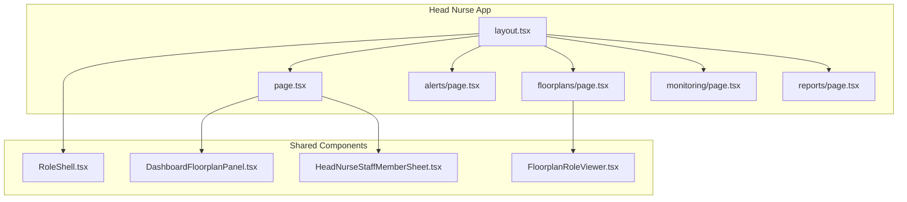
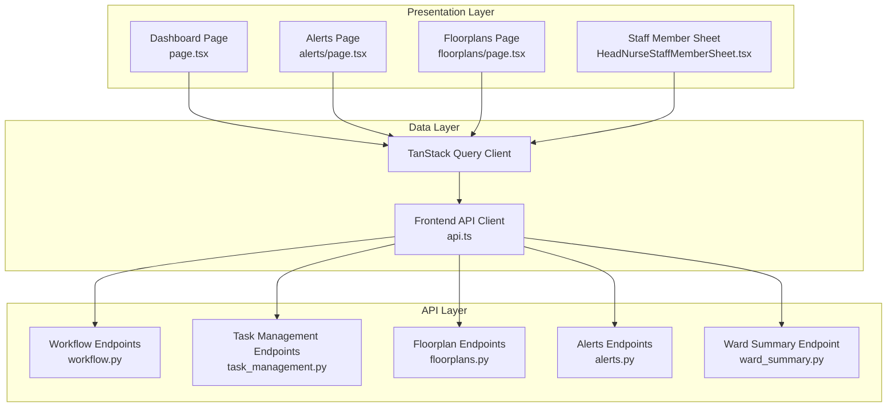
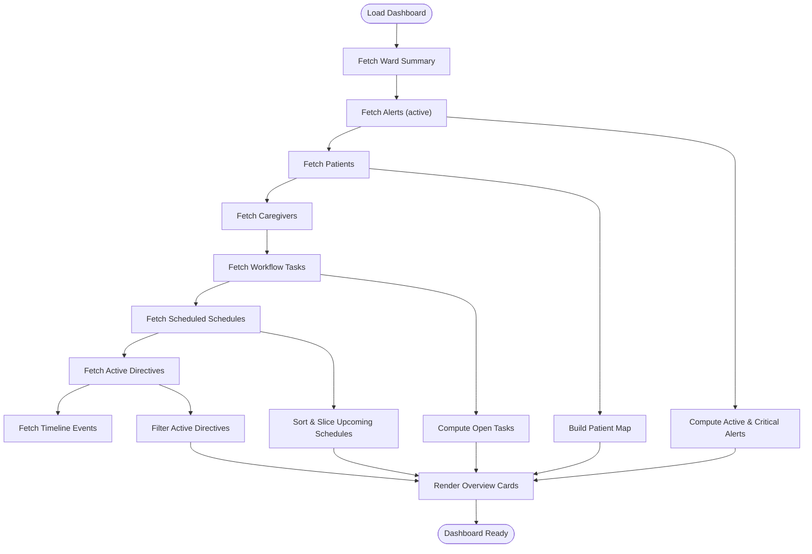
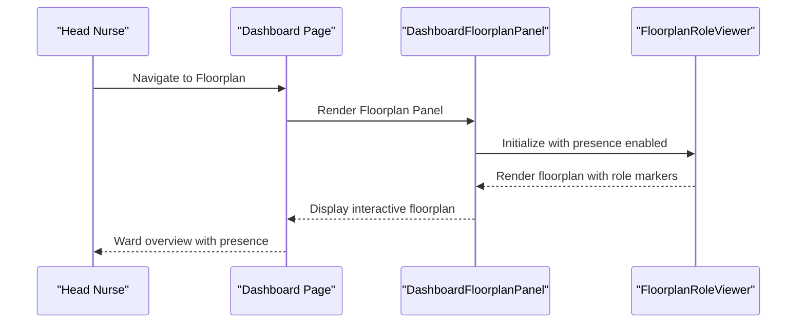
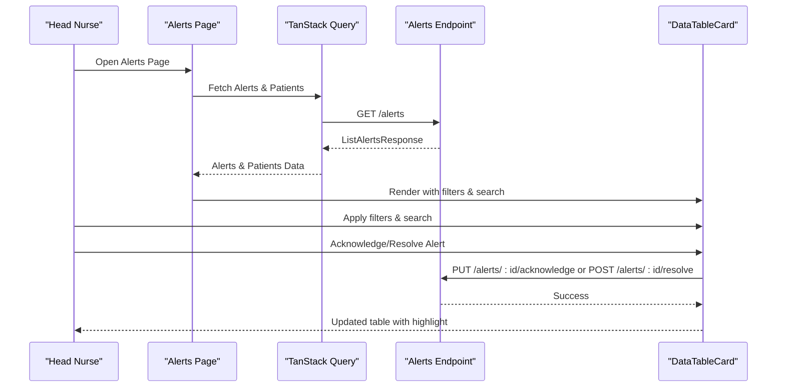
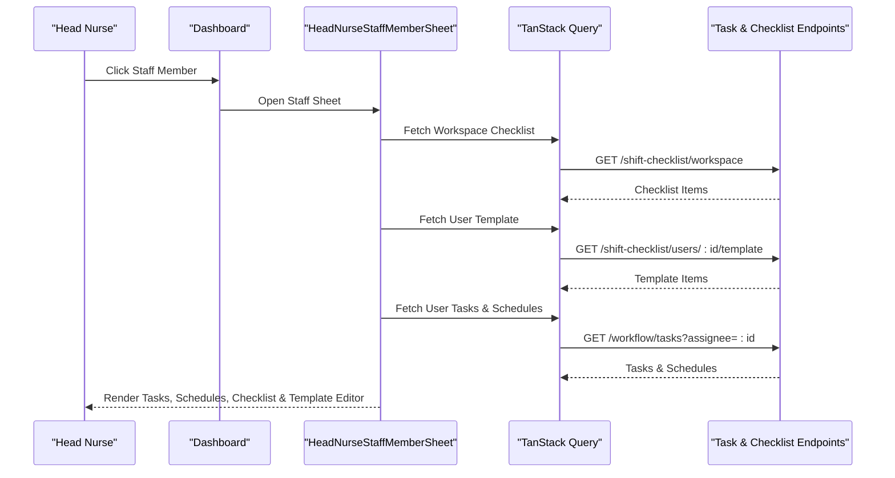
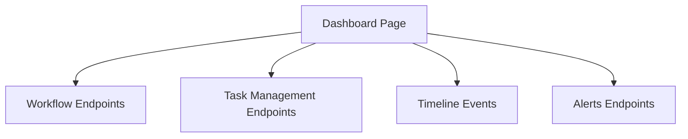
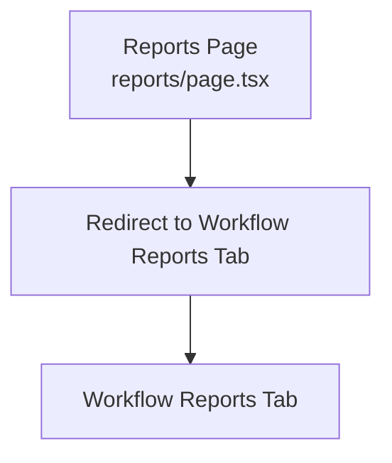
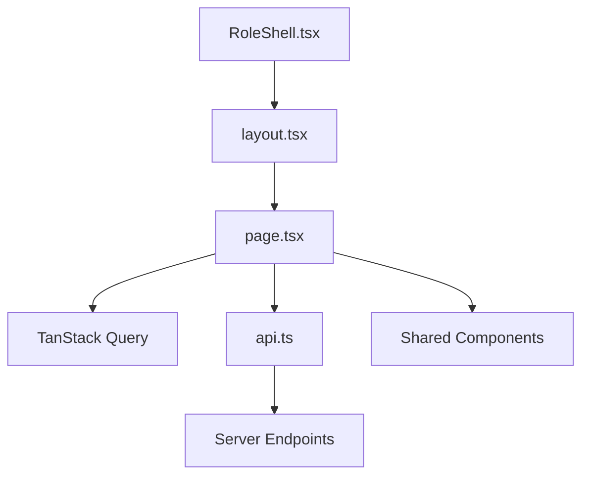

# Head Nurse Dashboard

<cite>
**Referenced Files in This Document**
- [layout.tsx](file://frontend/app/head-nurse/layout.tsx)
- [page.tsx](file://frontend/app/head-nurse/page.tsx)
- [alerts/page.tsx](file://frontend/app/head-nurse/alerts/page.tsx)
- [floorplans/page.tsx](file://frontend/app/head-nurse/floorplans/page.tsx)
- [monitoring/page.tsx](file://frontend/app/head-nurse/monitoring/page.tsx)
- [reports/page.tsx](file://frontend/app/head-nurse/reports/page.tsx)
- [HeadNurseStaffMemberSheet.tsx](file://frontend/components/head-nurse/HeadNurseStaffMemberSheet.tsx)
- [DashboardFloorplanPanel.tsx](file://frontend/components/dashboard/DashboardFloorplanPanel.tsx)
- [FloorplanRoleViewer.tsx](file://frontend/components/floorplan/FloorplanRoleViewer.tsx)
- [RoleShell.tsx](file://frontend/components/RoleShell.tsx)
- [api.ts](file://frontend/lib/api.ts)
- [routes.ts](file://frontend/lib/routes.ts)
- [sidebarConfig.ts](file://frontend/lib/sidebarConfig.ts)
- [workflowTaskBoard.ts](file://frontend/lib/workflowTaskBoard.ts)
- [workflowJobs.ts](file://frontend/lib/workflowJobs.ts)
- [workflowMessaging.ts](file://frontend/lib/workflowMessaging.ts)
- [workflow.ts](file://server/app/api/endpoints/workflow.py)
- [task_management.py](file://server/app/api/endpoints/task_management.py)
- [floorplans.py](file://server/app/api/endpoints/floorplans.py)
- [patients.py](file://server/app/api/endpoints/patients.py)
- [alerts.py](file://server/app/api/endpoints/alerts.py)
- [ward_summary.py](file://server/app/api/endpoints/ward_summary.py)
</cite>

## Table of Contents
1. [Introduction](#introduction)
2. [Project Structure](#project-structure)
3. [Core Components](#core-components)
4. [Architecture Overview](#architecture-overview)
5. [Detailed Component Analysis](#detailed-component-analysis)
6. [Dependency Analysis](#dependency-analysis)
7. [Performance Considerations](#performance-considerations)
8. [Troubleshooting Guide](#troubleshooting-guide)
9. [Conclusion](#conclusion)
10. [Appendices](#appendices)

## Introduction
The Head Nurse Dashboard in the WheelSense Platform provides a comprehensive supervisory interface for ward management, staff coordination, patient monitoring, task orchestration, and reporting. It consolidates real-time operational insights, enabling head nurses to oversee clinical workflows, manage staff schedules and checklists, monitor alerts and patient conditions, and coordinate care activities across the ward. This document explains the dashboard's navigation patterns, team management features, and clinical oversight tools, and details the implementation of key components including the patient routine manager, role tasks page, routine task manager, task command bar, and task kanban board. It also covers dashboard features such as alerts management, floorplan monitoring, patient tracking, staff member sheets, and reporting tools, with practical workflows for managing ward operations.

## Project Structure
The Head Nurse application is structured as a Next.js app-router module under the frontend with dedicated pages for dashboard, alerts, floorplans, monitoring, and reports. The layout wraps child pages with a role shell to apply role-specific routing and navigation. Shared components provide reusable UI elements for floorplan monitoring, staff sheets, and workflow task management.

**Diagram sources**
- [layout.tsx:1-12](file://frontend/app/head-nurse/layout.tsx#L1-L12)
- [page.tsx:1-595](file://frontend/app/head-nurse/page.tsx#L1-L595)
- [alerts/page.tsx:1-324](file://frontend/app/head-nurse/alerts/page.tsx#L1-L324)
- [floorplans/page.tsx:1-26](file://frontend/app/head-nurse/floorplans/page.tsx#L1-L26)
- [monitoring/page.tsx:1-6](file://frontend/app/head-nurse/monitoring/page.tsx#L1-L6)
- [reports/page.tsx:1-6](file://frontend/app/head-nurse/reports/page.tsx#L1-L6)
- [RoleShell.tsx](file://frontend/components/RoleShell.tsx)
- [DashboardFloorplanPanel.tsx](file://frontend/components/dashboard/DashboardFloorplanPanel.tsx)
- [FloorplanRoleViewer.tsx](file://frontend/components/floorplan/FloorplanRoleViewer.tsx)
- [HeadNurseStaffMemberSheet.tsx:1-514](file://frontend/components/head-nurse/HeadNurseStaffMemberSheet.tsx#L1-L514)

**Section sources**
- [layout.tsx:1-12](file://frontend/app/head-nurse/layout.tsx#L1-L12)
- [page.tsx:1-595](file://frontend/app/head-nurse/page.tsx#L1-L595)

## Core Components
This section outlines the primary building blocks of the Head Nurse Dashboard and their responsibilities:

- Dashboard overview cards: Total patients, active alerts, open tasks, and upcoming schedules.
- Floorplan panel: Real-time ward visualization with presence indicators.
- On-duty staff strip: Compact view of current staff coverage.
- Alerts and tasks grids: Priority-driven lists with quick actions.
- Staff member sheet: Detailed view of assigned tasks, schedules, and shift checklists per staff member.
- Alerts management page: Filterable table for alert acknowledgment and resolution.
- Floorplan monitoring page: Role-aware floorplan viewer with presence tracking.
- Reporting redirection: Centralized access to workflow reports.

Implementation highlights:
- Dashboard page orchestrates multiple data queries and mutations for ward metrics, alerts, tasks, schedules, directives, and timeline events.
- Staff member sheet integrates shift checklist templates, user-linked tasks, and schedules with real-time progress tracking.
- Alerts page provides filtering, search, and inline actions to acknowledge or resolve alerts.

**Section sources**
- [page.tsx:58-595](file://frontend/app/head-nurse/page.tsx#L58-L595)
- [HeadNurseStaffMemberSheet.tsx:253-514](file://frontend/components/head-nurse/HeadNurseStaffMemberSheet.tsx#L253-L514)
- [alerts/page.tsx:48-324](file://frontend/app/head-nurse/alerts/page.tsx#L48-L324)
- [floorplans/page.tsx:7-26](file://frontend/app/head-nurse/floorplans/page.tsx#L7-L26)

## Architecture Overview
The Head Nurse Dashboard follows a layered architecture:
- Presentation layer: Next.js app-router pages and shared components.
- Data layer: TanStack Query for caching, refetching, and optimistic updates.
- API layer: Frontend API client interacting with backend endpoints for workflows, tasks, floorplans, alerts, and ward summaries.
- Backend endpoints: Python FastAPI endpoints serving data for the dashboard and related domains.

**Diagram sources**
- [page.tsx:64-104](file://frontend/app/head-nurse/page.tsx#L64-L104)
- [alerts/page.tsx:58-67](file://frontend/app/head-nurse/alerts/page.tsx#L58-L67)
- [floorplans/page.tsx](file://frontend/app/head-nurse/floorplans/page.tsx#L3)
- [HeadNurseStaffMemberSheet.tsx:264-280](file://frontend/components/head-nurse/HeadNurseStaffMemberSheet.tsx#L264-L280)
- [api.ts](file://frontend/lib/api.ts)
- [workflow.py](file://server/app/api/endpoints/workflow.py)
- [task_management.py](file://server/app/api/endpoints/task_management.py)
- [floorplans.py](file://server/app/api/endpoints/floorplans.py)
- [alerts.py](file://server/app/api/endpoints/alerts.py)
- [ward_summary.py](file://server/app/api/endpoints/ward_summary.py)

## Detailed Component Analysis

### Dashboard Overview Cards
The dashboard presents four key overview cards:
- Total patients and on-duty staff count
- Active alerts with critical count
- Open tasks and active directives
- Upcoming schedules within the next 24 hours

These cards aggregate data from multiple queries and provide quick visibility into ward status. Sorting and filtering logic ensures priority items appear prominently.

**Diagram sources**
- [page.tsx:64-104](file://frontend/app/head-nurse/page.tsx#L64-L104)
- [page.tsx:107-214](file://frontend/app/head-nurse/page.tsx#L107-L214)

**Section sources**
- [page.tsx:264-340](file://frontend/app/head-nurse/page.tsx#L264-L340)
- [page.tsx:107-214](file://frontend/app/head-nurse/page.tsx#L107-L214)

### Floorplan Monitoring
The dashboard integrates a floorplan panel for real-time ward monitoring. The floorplan page delegates to a role-aware viewer that displays presence and roles across the facility.

**Diagram sources**
- [page.tsx](file://frontend/app/head-nurse/page.tsx#L344)
- [floorplans/page.tsx](file://frontend/app/head-nurse/floorplans/page.tsx#L3)
- [DashboardFloorplanPanel.tsx](file://frontend/components/dashboard/DashboardFloorplanPanel.tsx)
- [FloorplanRoleViewer.tsx](file://frontend/components/floorplan/FloorplanRoleViewer.tsx)

**Section sources**
- [page.tsx:343-390](file://frontend/app/head-nurse/page.tsx#L343-L390)
- [floorplans/page.tsx:7-26](file://frontend/app/head-nurse/floorplans/page.tsx#L7-L26)

### Alerts Management
The alerts page provides a searchable and filterable table of alerts with inline actions to acknowledge or resolve. It supports highlighting specific alerts via URL parameters and integrates with the alert row highlight hook for visual emphasis.

**Diagram sources**
- [alerts/page.tsx:58-104](file://frontend/app/head-nurse/alerts/page.tsx#L58-L104)
- [alerts/page.tsx:136-236](file://frontend/app/head-nurse/alerts/page.tsx#L136-L236)
- [alerts.py](file://server/app/api/endpoints/alerts.py)

**Section sources**
- [alerts/page.tsx:48-324](file://frontend/app/head-nurse/alerts/page.tsx#L48-L324)

### Staff Member Sheet
The staff member sheet provides a comprehensive view of a selected staff member’s assigned tasks, schedules, and shift checklist progress. It includes:
- Assigned tasks with status, priority, and due dates
- Assigned schedules with types and start times
- Workspace checklist progress with category grouping
- User-specific checklist template editor with validation and persistence

**Diagram sources**
- [HeadNurseStaffMemberSheet.tsx:264-280](file://frontend/components/head-nurse/HeadNurseStaffMemberSheet.tsx#L264-L280)
- [HeadNurseStaffMemberSheet.tsx:500-505](file://frontend/components/head-nurse/HeadNurseStaffMemberSheet.tsx#L500-L505)
- [task_management.py](file://server/app/api/endpoints/task_management.py)
- [workflow.py](file://server/app/api/endpoints/workflow.py)

**Section sources**
- [HeadNurseStaffMemberSheet.tsx:253-514](file://frontend/components/head-nurse/HeadNurseStaffMemberSheet.tsx#L253-L514)

### Task Orchestration Components
The Head Nurse Dashboard integrates with workflow task management and job orchestration systems. While dedicated task pages are not present in the current frontend structure, the dashboard leverages workflow endpoints for tasks, schedules, directives, and timeline events. These components enable head nurses to:
- View open tasks and prioritize by severity and due date
- Acknowledge and resolve alerts
- Monitor timeline events for contextual awareness
- Coordinate with floorplan presence for staff deployment

**Diagram sources**
- [page.tsx:85-104](file://frontend/app/head-nurse/page.tsx#L85-L104)
- [workflow.py](file://server/app/api/endpoints/workflow.py)
- [task_management.py](file://server/app/api/endpoints/task_management.py)
- [alerts.py](file://server/app/api/endpoints/alerts.py)

**Section sources**
- [page.tsx:85-104](file://frontend/app/head-nurse/page.tsx#L85-L104)

### Reporting Tools
Reporting is accessed via a redirect from the reports page to the workflow reports tab. This centralizes reporting capabilities within the workflow domain while maintaining a clean navigation surface for the head nurse.

**Diagram sources**
- [reports/page.tsx:1-6](file://frontend/app/head-nurse/reports/page.tsx#L1-L6)

**Section sources**
- [reports/page.tsx:1-6](file://frontend/app/head-nurse/reports/page.tsx#L1-L6)

## Dependency Analysis
The Head Nurse Dashboard depends on:
- RoleShell for role-based routing and layout
- TanStack Query for data fetching, caching, and mutations
- Frontend API client for backend integration
- Shared components for floorplan monitoring and staff sheets
- Backend endpoints for workflows, tasks, floorplans, alerts, and ward summaries

**Diagram sources**
- [RoleShell.tsx](file://frontend/components/RoleShell.tsx)
- [layout.tsx:1-12](file://frontend/app/head-nurse/layout.tsx#L1-L12)
- [page.tsx:1-595](file://frontend/app/head-nurse/page.tsx#L1-L595)
- [api.ts](file://frontend/lib/api.ts)

**Section sources**
- [layout.tsx:1-12](file://frontend/app/head-nurse/layout.tsx#L1-L12)
- [page.tsx:1-595](file://frontend/app/head-nurse/page.tsx#L1-L595)
- [api.ts](file://frontend/lib/api.ts)

## Performance Considerations
- Efficient data fetching: Queries are scoped to specific dashboard sections with appropriate refetch intervals for live data like alerts and timeline events.
- Client-side sorting and filtering: Reduce server load by precomputing derived data (e.g., active alerts, open tasks) on the client.
- Optimistic updates: Mutations for task completion and alert actions update the UI immediately and reconcile with the server asynchronously.
- Component-level caching: TanStack Query caches responses to minimize redundant network requests during navigation.

## Troubleshooting Guide
Common issues and resolutions:
- Alerts not updating: Verify refetch intervals and network connectivity; check for API errors in the console.
- Staff sheet not loading checklist: Confirm user linkage and template availability; ensure checklist date selection is valid.
- Floorplan presence missing: Validate floorplan provisioning and role viewer configuration.
- Task completion failures: Review mutation error handling and retry logic; confirm task ownership and status transitions.

**Section sources**
- [alerts/page.tsx:94-104](file://frontend/app/head-nurse/alerts/page.tsx#L94-L104)
- [HeadNurseStaffMemberSheet.tsx:71-101](file://frontend/components/head-nurse/HeadNurseStaffMemberSheet.tsx#L71-L101)
- [page.tsx:72-73](file://frontend/app/head-nurse/page.tsx#L72-L73)

## Conclusion
The Head Nurse Dashboard consolidates ward supervision, staff coordination, patient monitoring, and task orchestration into a cohesive interface. Through real-time dashboards, floorplan monitoring, staff sheets, and integrated alert management, head nurses can efficiently oversee daily operations and make informed decisions. The modular component architecture and robust data layer ensure scalability and maintainability as the platform evolves.

## Appendices

### Head Nurse Navigation Patterns
- Dashboard: Primary overview with quick links to patients, staff, tasks, and alerts.
- Alerts: Filterable table with inline actions for acknowledgment and resolution.
- Floorplans: Role-aware floorplan viewer with presence indicators.
- Monitoring: Redirect to dashboard for consolidated monitoring.
- Reports: Redirect to workflow reports tab for clinical reporting.

**Section sources**
- [page.tsx:244-261](file://frontend/app/head-nurse/page.tsx#L244-L261)
- [alerts/page.tsx:254-290](file://frontend/app/head-nurse/alerts/page.tsx#L254-L290)
- [floorplans/page.tsx:10-23](file://frontend/app/head-nurse/floorplans/page.tsx#L10-L23)
- [monitoring/page.tsx:1-6](file://frontend/app/head-nurse/monitoring/page.tsx#L1-L6)
- [reports/page.tsx:1-6](file://frontend/app/head-nurse/reports/page.tsx#L1-L6)

### Team Management Features
- On-duty staff strip: Compact preview of current coverage with role badges.
- Staff member sheet: Detailed view of tasks, schedules, and shift checklists.
- Checklist templates: User-specific editable templates with validation and persistence.

**Section sources**
- [page.tsx:391-452](file://frontend/app/head-nurse/page.tsx#L391-L452)
- [HeadNurseStaffMemberSheet.tsx:253-514](file://frontend/components/head-nurse/HeadNurseStaffMemberSheet.tsx#L253-L514)

### Clinical Workflow Oversight Tools
- Priority alerts and tasks grids: Sort by severity and due date for timely interventions.
- Timeline events: Contextual awareness of recent ward activities.
- Ward summary: Consolidated metrics for quick situational assessment.

**Section sources**
- [page.tsx:454-591](file://frontend/app/head-nurse/page.tsx#L454-L591)
- [page.tsx:100-104](file://frontend/app/head-nurse/page.tsx#L100-L104)

### Head Nurse Workflows
- Managing ward operations:
  - Review overview cards for total patients, active alerts, open tasks, and upcoming schedules.
  - Navigate to alerts for immediate action on critical incidents.
  - Use floorplan monitoring to locate staff and resources.
- Coordinating staff activities:
  - Open staff member sheets to review assigned tasks and schedules.
  - Adjust shift checklists and templates to align with operational needs.
- Overseeing patient care routines:
  - Access patient pages from alerts or timeline events for detailed care context.
  - Coordinate with floorplan presence to deploy staff to patient locations.
- Generating clinical reports:
  - Use the reports redirect to access workflow reports for performance and compliance tracking.

**Section sources**
- [page.tsx:226-595](file://frontend/app/head-nurse/page.tsx#L226-L595)
- [alerts/page.tsx:48-324](file://frontend/app/head-nurse/alerts/page.tsx#L48-L324)
- [HeadNurseStaffMemberSheet.tsx:253-514](file://frontend/components/head-nurse/HeadNurseStaffMemberSheet.tsx#L253-L514)
- [reports/page.tsx:1-6](file://frontend/app/head-nurse/reports/page.tsx#L1-L6)