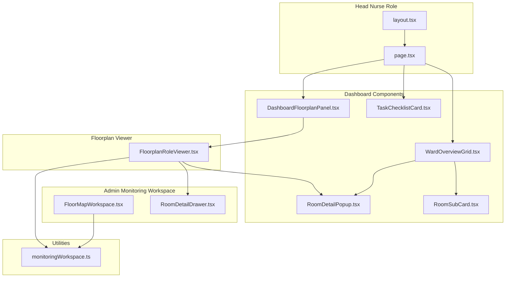
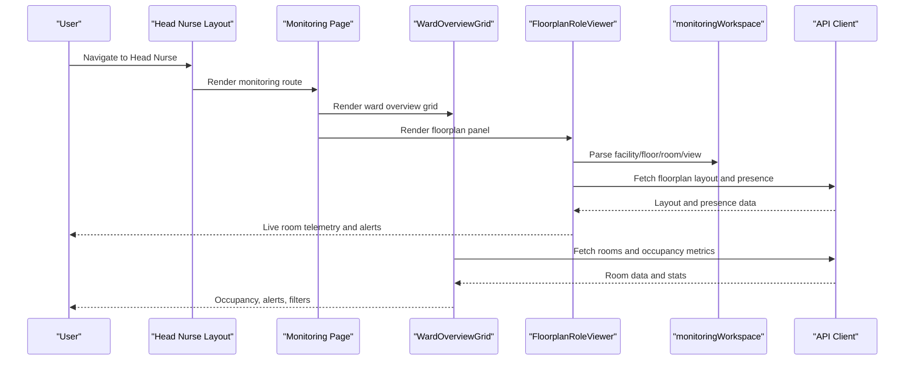
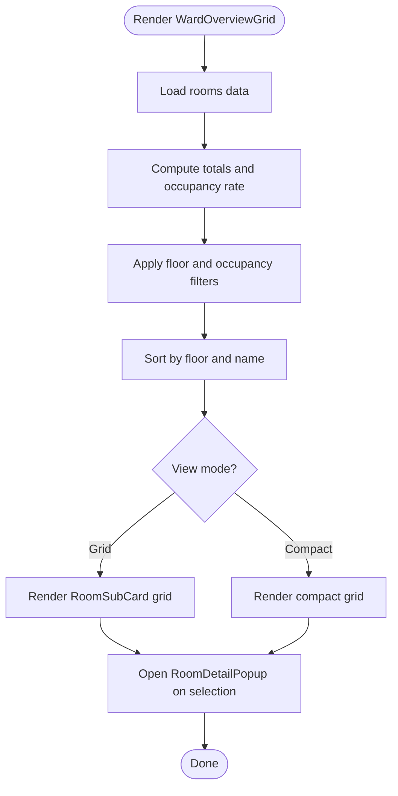
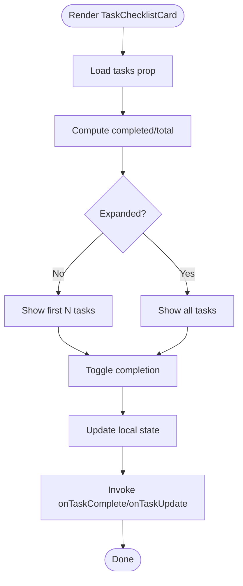
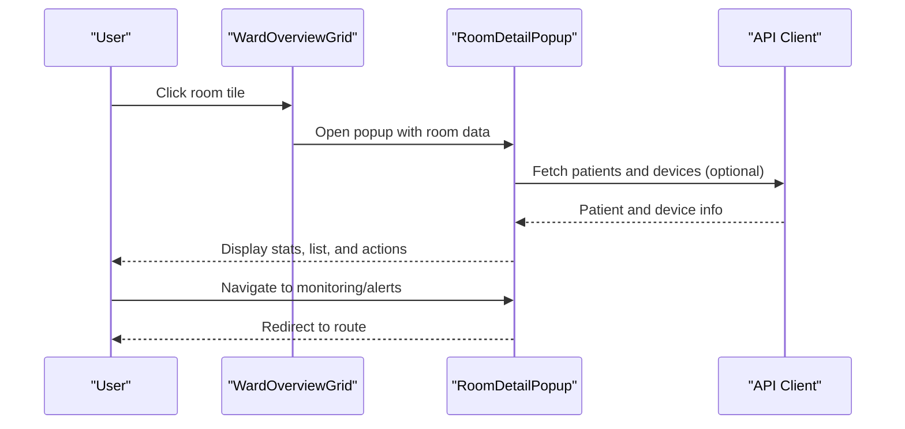
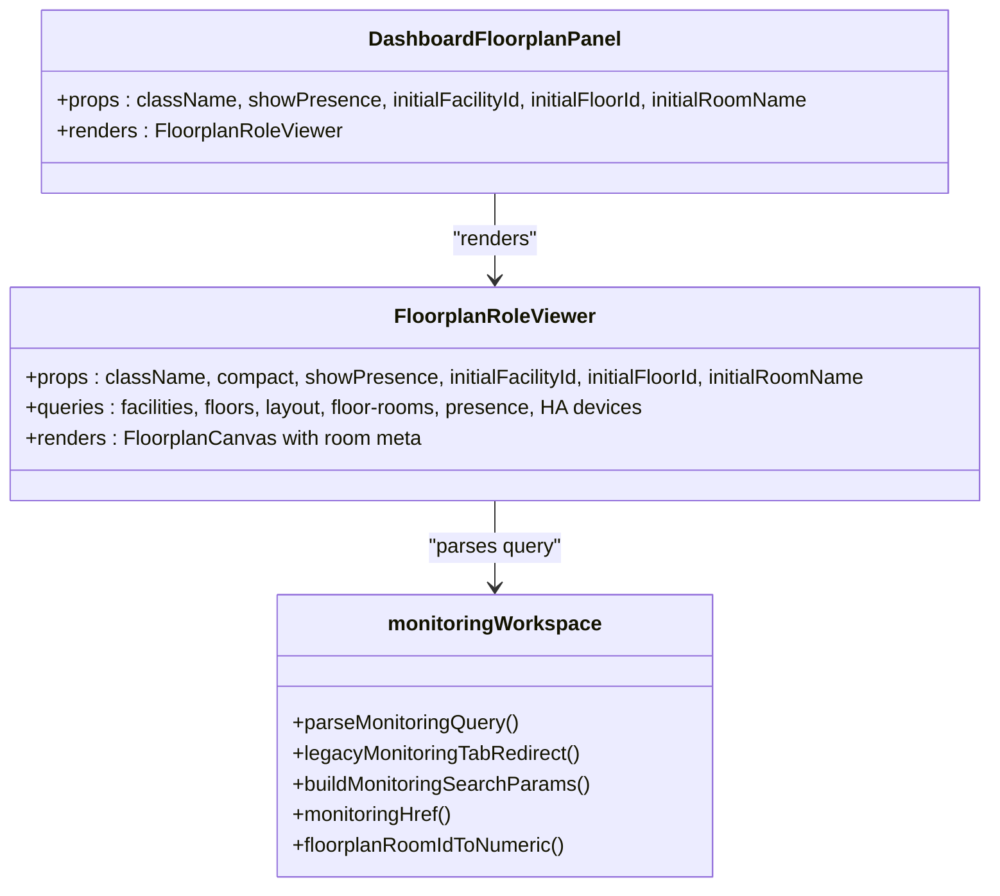
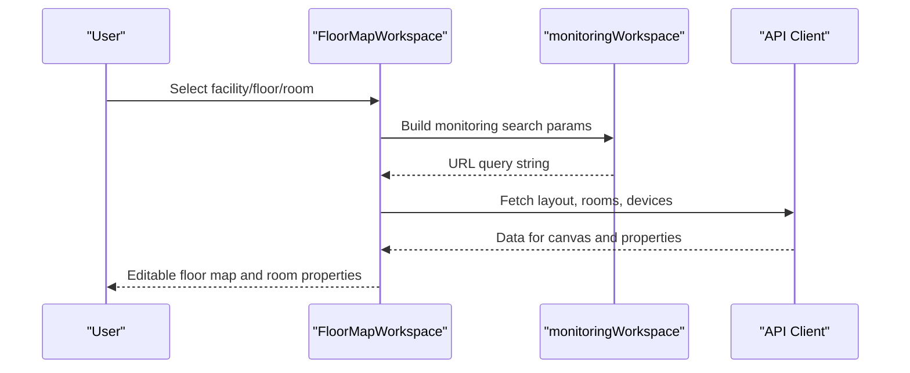
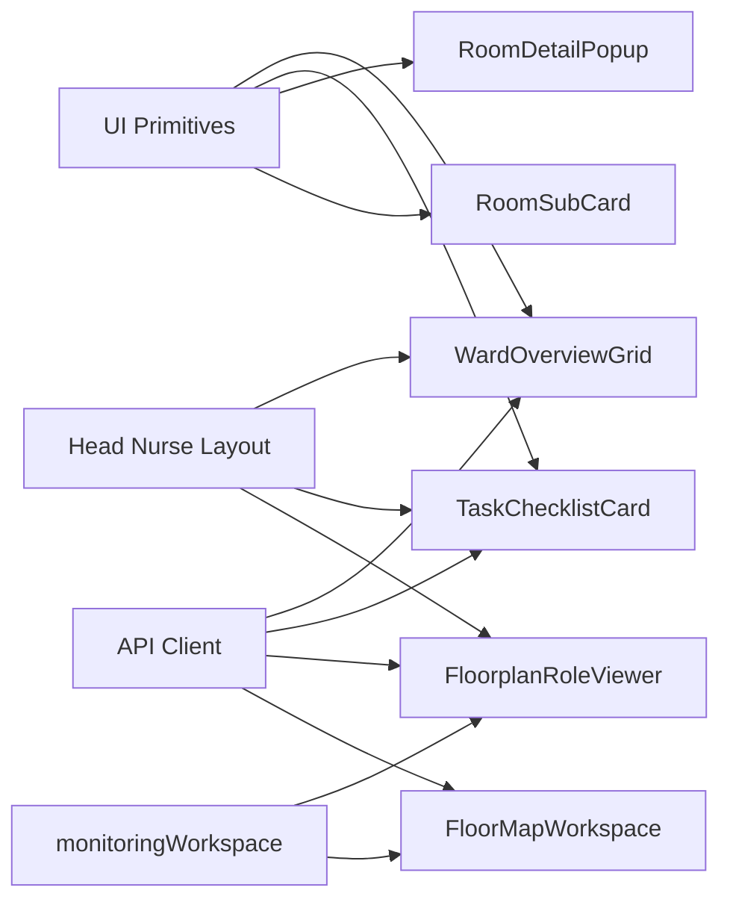

# Monitoring Dashboard

<cite>
**Referenced Files in This Document**
- [page.tsx](file://frontend/app/head-nurse/monitoring/page.tsx)
- [layout.tsx](file://frontend/app/head-nurse/layout.tsx)
- [WardOverviewGrid.tsx](file://frontend/components/dashboard/WardOverviewGrid.tsx)
- [TaskChecklistCard.tsx](file://frontend/components/dashboard/TaskChecklistCard.tsx)
- [RoomDetailPopup.tsx](file://frontend/components/dashboard/RoomDetailPopup.tsx)
- [RoomSubCard.tsx](file://frontend/components/dashboard/RoomSubCard.tsx)
- [DashboardFloorplanPanel.tsx](file://frontend/components/dashboard/DashboardFloorplanPanel.tsx)
- [FloorplanRoleViewer.tsx](file://frontend/components/floorplan/FloorplanRoleViewer.tsx)
- [monitoringWorkspace.ts](file://frontend/lib/monitoringWorkspace.ts)
- [FloorMapWorkspace.tsx](file://frontend/components/admin/monitoring/FloorMapWorkspace.tsx)
- [RoomDetailDrawer.tsx](file://frontend/components/admin/monitoring/RoomDetailDrawer.tsx)
- [types.ts](file://frontend/lib/types.ts)
- [api.ts](file://frontend/lib/api.ts)
</cite>

## Table of Contents
1. [Introduction](#introduction)
2. [Project Structure](#project-structure)
3. [Core Components](#core-components)
4. [Architecture Overview](#architecture-overview)
5. [Detailed Component Analysis](#detailed-component-analysis)
6. [Dependency Analysis](#dependency-analysis)
7. [Performance Considerations](#performance-considerations)
8. [Troubleshooting Guide](#troubleshooting-guide)
9. [Conclusion](#conclusion)
10. [Appendices](#appendices)

## Introduction
This document describes the Head Nurse Monitoring Dashboard interface, focusing on the comprehensive monitoring view that displays ward operations, patient status, and workflow metrics. It explains the ward overview grid for room-by-room status, occupancy rates, and resource utilization; the task checklist cards for operational checklists and quality assurance procedures; the monitoring workspace integration and real-time data visualization; and the integration with analytics systems, alert triggers, and performance indicators. It also provides examples of monitoring workflows, dashboard customization, and integration with external monitoring systems.

## Project Structure
The monitoring dashboard is implemented as a role-specific view under the Head Nurse role. The layout integrates the role shell, while the monitoring page redirects to the primary dashboard route. Real-time floorplan visualization and room-level details are provided via dedicated components and utilities for URL-driven workspace navigation.

**Diagram sources**
- [layout.tsx:1-12](file://frontend/app/head-nurse/layout.tsx#L1-L12)
- [page.tsx:1-6](file://frontend/app/head-nurse/monitoring/page.tsx#L1-L6)
- [WardOverviewGrid.tsx:1-269](file://frontend/components/dashboard/WardOverviewGrid.tsx#L1-L269)
- [TaskChecklistCard.tsx:1-261](file://frontend/components/dashboard/TaskChecklistCard.tsx#L1-L261)
- [RoomDetailPopup.tsx:1-276](file://frontend/components/dashboard/RoomDetailPopup.tsx#L1-L276)
- [RoomSubCard.tsx:1-138](file://frontend/components/dashboard/RoomSubCard.tsx#L1-L138)
- [DashboardFloorplanPanel.tsx:1-30](file://frontend/components/dashboard/DashboardFloorplanPanel.tsx#L1-L30)
- [FloorplanRoleViewer.tsx:1-1143](file://frontend/components/floorplan/FloorplanRoleViewer.tsx#L1-L1143)
- [FloorMapWorkspace.tsx:1-734](file://frontend/components/admin/monitoring/FloorMapWorkspace.tsx#L1-L734)
- [RoomDetailDrawer.tsx:1-88](file://frontend/components/admin/monitoring/RoomDetailDrawer.tsx#L1-L88)
- [monitoringWorkspace.ts:1-146](file://frontend/lib/monitoringWorkspace.ts#L1-L146)

**Section sources**
- [layout.tsx:1-12](file://frontend/app/head-nurse/layout.tsx#L1-L12)
- [page.tsx:1-6](file://frontend/app/head-nurse/monitoring/page.tsx#L1-L6)

## Core Components
- Ward Overview Grid: Provides a high-level overview of rooms with occupancy, alerts, and filtering by floor and status. Supports grid and compact view modes and opens a room detail popup.
- Task Checklist Card: Summarizes assigned care tasks with completion progress, due dates, priorities, and quick actions to view or manage tasks.
- Room Detail Popup: Presents detailed room information including patients, device status, and quick actions to navigate to monitoring or alerts.
- Room Sub Card: Displays a single room’s status, occupancy, and alert counts in a compact tile.
- Dashboard Floorplan Panel: Embeds a floorplan viewer tailored for the Head Nurse role, enabling presence-aware room inspection.
- Monitoring Workspace Utilities: Define URL query contracts and helpers for facility/floor/room/view navigation and legacy tab redirection.

**Section sources**
- [WardOverviewGrid.tsx:1-269](file://frontend/components/dashboard/WardOverviewGrid.tsx#L1-L269)
- [TaskChecklistCard.tsx:1-261](file://frontend/components/dashboard/TaskChecklistCard.tsx#L1-L261)
- [RoomDetailPopup.tsx:1-276](file://frontend/components/dashboard/RoomDetailPopup.tsx#L1-L276)
- [RoomSubCard.tsx:1-138](file://frontend/components/dashboard/RoomSubCard.tsx#L1-L138)
- [DashboardFloorplanPanel.tsx:1-30](file://frontend/components/dashboard/DashboardFloorplanPanel.tsx#L1-L30)
- [monitoringWorkspace.ts:1-146](file://frontend/lib/monitoringWorkspace.ts#L1-L146)

## Architecture Overview
The monitoring dashboard integrates role-aware floorplan visualization, real-time presence data, and curated widgets for ward operations and workflow metrics. The workspace utilities standardize navigation across facilities, floors, rooms, and view modes. The admin monitoring workspace complements the role viewer with editing capabilities for floor layouts and device assignments.

**Diagram sources**
- [layout.tsx:1-12](file://frontend/app/head-nurse/layout.tsx#L1-L12)
- [page.tsx:1-6](file://frontend/app/head-nurse/monitoring/page.tsx#L1-L6)
- [WardOverviewGrid.tsx:1-269](file://frontend/components/dashboard/WardOverviewGrid.tsx#L1-L269)
- [DashboardFloorplanPanel.tsx:1-30](file://frontend/components/dashboard/DashboardFloorplanPanel.tsx#L1-L30)
- [FloorplanRoleViewer.tsx:567-800](file://frontend/components/floorplan/FloorplanRoleViewer.tsx#L567-L800)
- [monitoringWorkspace.ts:32-84](file://frontend/lib/monitoringWorkspace.ts#L32-L84)
- [api.ts:1-200](file://frontend/lib/api.ts#L1-L200)

## Detailed Component Analysis

### Ward Overview Grid
The Ward Overview Grid aggregates room-level data to compute occupancy rates, total patients, and active alerts. It supports filtering by floor and occupancy status, toggling between grid and compact view modes, and opening a room detail popup for deeper inspection.

**Diagram sources**
- [WardOverviewGrid.tsx:58-112](file://frontend/components/dashboard/WardOverviewGrid.tsx#L58-L112)
- [WardOverviewGrid.tsx:221-265](file://frontend/components/dashboard/WardOverviewGrid.tsx#L221-L265)
- [RoomSubCard.tsx:1-138](file://frontend/components/dashboard/RoomSubCard.tsx#L1-L138)
- [RoomDetailPopup.tsx:1-276](file://frontend/components/dashboard/RoomDetailPopup.tsx#L1-L276)

**Section sources**
- [WardOverviewGrid.tsx:1-269](file://frontend/components/dashboard/WardOverviewGrid.tsx#L1-L269)
- [RoomSubCard.tsx:1-138](file://frontend/components/dashboard/RoomSubCard.tsx#L1-L138)
- [RoomDetailPopup.tsx:1-276](file://frontend/components/dashboard/RoomDetailPopup.tsx#L1-L276)

### Task Checklist Card
The Task Checklist Card presents assigned care tasks with priority and due-date indicators, completion progress, and expandable views. It supports inline completion toggles and navigation to task details.

**Diagram sources**
- [TaskChecklistCard.tsx:76-118](file://frontend/components/dashboard/TaskChecklistCard.tsx#L76-L118)

**Section sources**
- [TaskChecklistCard.tsx:1-261](file://frontend/components/dashboard/TaskChecklistCard.tsx#L1-L261)

### Room Detail Popup
The Room Detail Popup consolidates room statistics, patient lists, device status, and quick actions. It surfaces alert counts and provides navigation to monitoring and alerts for the selected room.

**Diagram sources**
- [WardOverviewGrid.tsx:257-265](file://frontend/components/dashboard/WardOverviewGrid.tsx#L257-L265)
- [RoomDetailPopup.tsx:53-276](file://frontend/components/dashboard/RoomDetailPopup.tsx#L53-L276)

**Section sources**
- [RoomDetailPopup.tsx:1-276](file://frontend/components/dashboard/RoomDetailPopup.tsx#L1-L276)

### Dashboard Floorplan Panel and Floorplan Role Viewer
The Dashboard Floorplan Panel embeds a role-aware floorplan viewer that renders room chips with presence and alert indicators. It integrates with the monitoring workspace utilities to parse and apply facility/floor/room/view parameters.

**Diagram sources**
- [DashboardFloorplanPanel.tsx:1-30](file://frontend/components/dashboard/DashboardFloorplanPanel.tsx#L1-L30)
- [FloorplanRoleViewer.tsx:567-800](file://frontend/components/floorplan/FloorplanRoleViewer.tsx#L567-L800)
- [monitoringWorkspace.ts:32-145](file://frontend/lib/monitoringWorkspace.ts#L32-L145)

**Section sources**
- [DashboardFloorplanPanel.tsx:1-30](file://frontend/components/dashboard/DashboardFloorplanPanel.tsx#L1-L30)
- [FloorplanRoleViewer.tsx:1-1143](file://frontend/components/floorplan/FloorplanRoleViewer.tsx#L1-L1143)
- [monitoringWorkspace.ts:1-146](file://frontend/lib/monitoringWorkspace.ts#L1-L146)

### Admin Monitoring Workspace Integration
The admin monitoring workspace provides advanced editing capabilities for floor layouts, device assignments, and room provisioning. It leverages the same monitoring workspace utilities for URL-driven navigation and maintains consistency with the role viewer.

**Diagram sources**
- [FloorMapWorkspace.tsx:77-250](file://frontend/components/admin/monitoring/FloorMapWorkspace.tsx#L77-L250)
- [monitoringWorkspace.ts:86-138](file://frontend/lib/monitoringWorkspace.ts#L86-L138)
- [api.ts:1-200](file://frontend/lib/api.ts#L1-L200)

**Section sources**
- [FloorMapWorkspace.tsx:1-734](file://frontend/components/admin/monitoring/FloorMapWorkspace.tsx#L1-L734)
- [monitoringWorkspace.ts:1-146](file://frontend/lib/monitoringWorkspace.ts#L1-L146)

## Dependency Analysis
The dashboard components depend on:
- Shared UI primitives (cards, buttons, badges, dialogs) for consistent presentation.
- API client for fetching floorplan layouts, presence data, rooms, and devices.
- Monitoring workspace utilities for URL parsing and building navigation parameters.
- Role shell layout for routing and context.

**Diagram sources**
- [WardOverviewGrid.tsx:1-269](file://frontend/components/dashboard/WardOverviewGrid.tsx#L1-L269)
- [TaskChecklistCard.tsx:1-261](file://frontend/components/dashboard/TaskChecklistCard.tsx#L1-L261)
- [RoomDetailPopup.tsx:1-276](file://frontend/components/dashboard/RoomDetailPopup.tsx#L1-L276)
- [RoomSubCard.tsx:1-138](file://frontend/components/dashboard/RoomSubCard.tsx#L1-L138)
- [FloorplanRoleViewer.tsx:567-800](file://frontend/components/floorplan/FloorplanRoleViewer.tsx#L567-L800)
- [FloorMapWorkspace.tsx:77-250](file://frontend/components/admin/monitoring/FloorMapWorkspace.tsx#L77-L250)
- [monitoringWorkspace.ts:32-138](file://frontend/lib/monitoringWorkspace.ts#L32-L138)
- [layout.tsx:1-12](file://frontend/app/head-nurse/layout.tsx#L1-L12)
- [api.ts:1-200](file://frontend/lib/api.ts#L1-L200)

**Section sources**
- [WardOverviewGrid.tsx:1-269](file://frontend/components/dashboard/WardOverviewGrid.tsx#L1-L269)
- [TaskChecklistCard.tsx:1-261](file://frontend/components/dashboard/TaskChecklistCard.tsx#L1-L261)
- [RoomDetailPopup.tsx:1-276](file://frontend/components/dashboard/RoomDetailPopup.tsx#L1-L276)
- [RoomSubCard.tsx:1-138](file://frontend/components/dashboard/RoomSubCard.tsx#L1-L138)
- [FloorplanRoleViewer.tsx:567-800](file://frontend/components/floorplan/FloorplanRoleViewer.tsx#L567-L800)
- [FloorMapWorkspace.tsx:77-250](file://frontend/components/admin/monitoring/FloorMapWorkspace.tsx#L77-L250)
- [monitoringWorkspace.ts:1-146](file://frontend/lib/monitoringWorkspace.ts#L1-L146)
- [layout.tsx:1-12](file://frontend/app/head-nurse/layout.tsx#L1-L12)
- [api.ts:1-200](file://frontend/lib/api.ts#L1-L200)

## Performance Considerations
- Polling and caching: Presence and device queries use polling intervals and stale times to balance freshness and performance. Adjust intervals based on facility size and alert urgency.
- Memoization: Components leverage useMemo to avoid unnecessary recalculations for filtered rooms, stats, and room metadata.
- Lazy rendering: Large lists (rooms, tasks) render only visible items and expand on demand to reduce DOM overhead.
- Network efficiency: Batched queries and URL-driven navigation minimize redundant requests across views.

[No sources needed since this section provides general guidance]

## Troubleshooting Guide
Common issues and resolutions:
- No rooms displayed after applying filters: Verify floor and occupancy filters; clear filters to restore visibility.
- Outdated presence data: Trigger manual refresh in the floorplan viewer; ensure network connectivity and polling intervals are configured.
- Navigation anomalies: Use monitoring workspace utilities to rebuild URLs; legacy tab redirection is handled internally for compatibility.
- Device or room provisioning failures: Confirm device assignments and room mappings; re-save layout and retry.

**Section sources**
- [WardOverviewGrid.tsx:155-219](file://frontend/components/dashboard/WardOverviewGrid.tsx#L155-L219)
- [FloorplanRoleViewer.tsx:682-702](file://frontend/components/floorplan/FloorplanRoleViewer.tsx#L682-L702)
- [monitoringWorkspace.ts:52-84](file://frontend/lib/monitoringWorkspace.ts#L52-L84)
- [FloorMapWorkspace.tsx:355-441](file://frontend/components/admin/monitoring/FloorMapWorkspace.tsx#L355-L441)

## Conclusion
The Head Nurse Monitoring Dashboard combines a high-level ward overview with real-time floorplan insights and actionable task management. Its modular components, robust workspace utilities, and integration with analytics and alert systems enable efficient oversight of ward operations, patient status, and workflow metrics.

[No sources needed since this section summarizes without analyzing specific files]

## Appendices

### Monitoring Workflows
- Ward overview workflow: Select facility/floor, apply occupancy filters, review occupancy and alert stats, and drill into a room for details.
- Task management workflow: Review task progress, toggle completion, and navigate to task details for further action.
- Floorplan inspection workflow: Choose view mode, inspect room chips, review presence and alerts, and capture snapshots when available.

**Section sources**
- [WardOverviewGrid.tsx:1-269](file://frontend/components/dashboard/WardOverviewGrid.tsx#L1-L269)
- [TaskChecklistCard.tsx:1-261](file://frontend/components/dashboard/TaskChecklistCard.tsx#L1-L261)
- [FloorplanRoleViewer.tsx:567-800](file://frontend/components/floorplan/FloorplanRoleViewer.tsx#L567-L800)

### Dashboard Customization
- View modes: Switch between grid and compact room views for different density preferences.
- Filters: Narrow down rooms by floor and occupancy status to focus on areas of interest.
- Navigation: Use monitoring workspace utilities to construct URLs for deep linking to facilities, floors, rooms, and view modes.

**Section sources**
- [WardOverviewGrid.tsx:155-219](file://frontend/components/dashboard/WardOverviewGrid.tsx#L155-L219)
- [monitoringWorkspace.ts:86-138](file://frontend/lib/monitoringWorkspace.ts#L86-L138)

### Integration with Analytics and External Systems
- Presence and telemetry: Floorplan viewer consumes presence and device telemetry to reflect live room status and alerts.
- Device ecosystem: Integrates with Home Assistant devices for room telemetry and snapshot capture.
- Data contracts: Types and API client define standardized contracts for rooms, devices, and analytics summaries.

**Section sources**
- [FloorplanRoleViewer.tsx:567-800](file://frontend/components/floorplan/FloorplanRoleViewer.tsx#L567-L800)
- [types.ts:92-200](file://frontend/lib/types.ts#L92-L200)
- [api.ts:1-200](file://frontend/lib/api.ts#L1-L200)