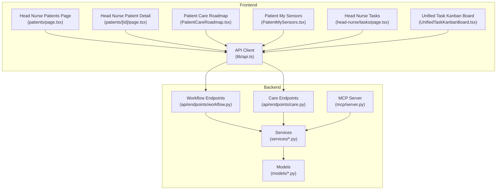
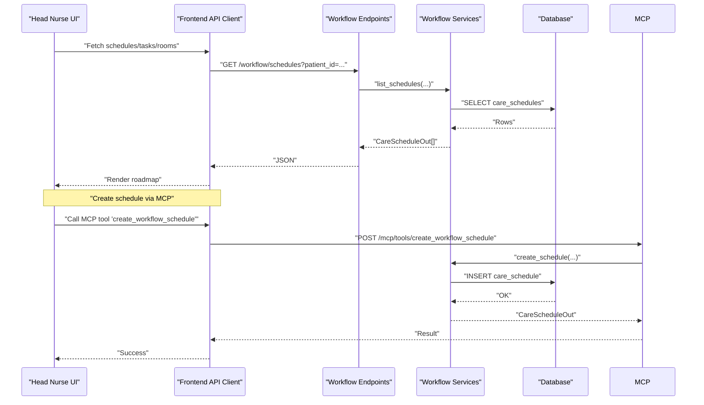
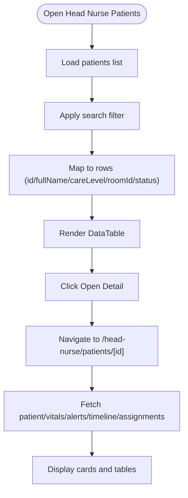
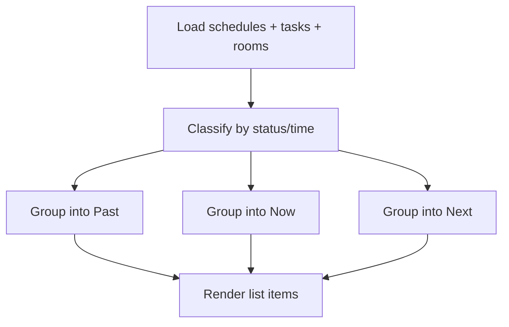
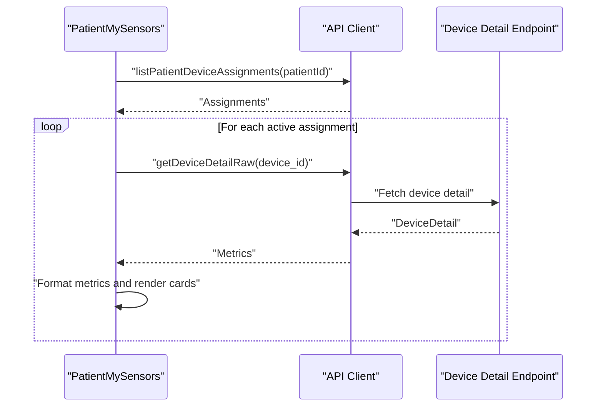
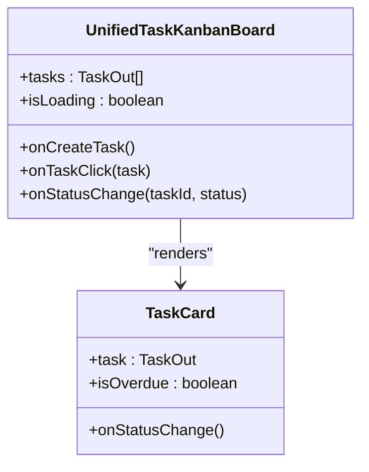
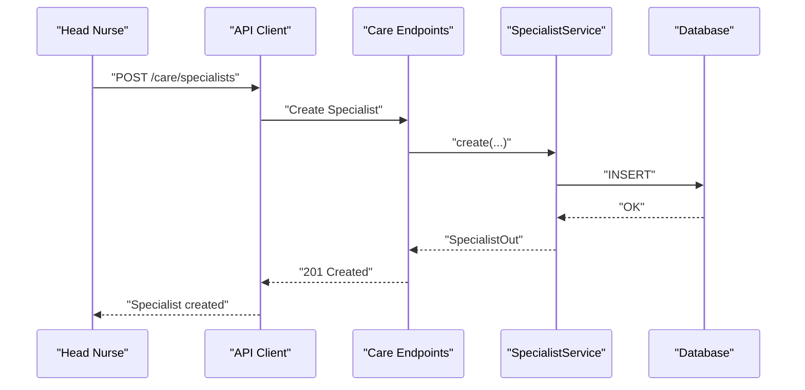
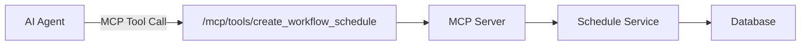
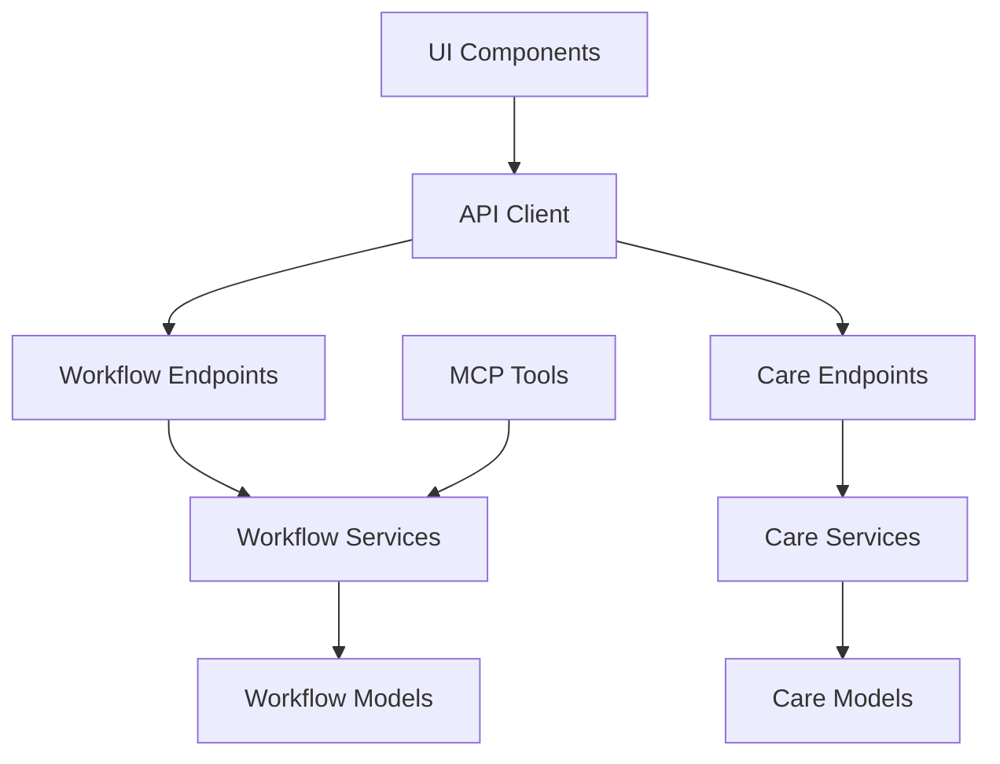

# Patient Care Coordination

<cite>
**Referenced Files in This Document**
- [frontend/app/head-nurse/patients/page.tsx](file://frontend/app/head-nurse/patients/page.tsx)
- [frontend/app/head-nurse/patients/[id]/page.tsx](file://frontend/app/head-nurse/patients/[id]/page.tsx)
- [frontend/components/patient/PatientCareRoadmap.tsx](file://frontend/components/patient/PatientCareRoadmap.tsx)
- [frontend/components/patient/PatientMySensors.tsx](file://frontend/components/patient/PatientMySensors.tsx)
- [frontend/app/head-nurse/tasks/page.tsx](file://frontend/app/head-nurse/tasks/page.tsx)
- [frontend/components/head-nurse/tasks/UnifiedTaskKanbanBoard.tsx](file://frontend/components/head-nurse/tasks/UnifiedTaskKanbanBoard.tsx)
- [frontend/lib/api.ts](file://frontend/lib/api.ts)
- [server/app/api/endpoints/care.py](file://server/app/api/endpoints/care.py)
- [server/app/services/care.py](file://server/app/services/care.py)
- [server/app/models/care.py](file://server/app/models/care.py)
- [server/app/api/endpoints/workflow.py](file://server/app/api/endpoints/workflow.py)
- [server/app/models/workflow.py](file://server/app/models/workflow.py)
- [server/app/mcp/server.py](file://server/app/mcp/server.py)
- [docs/adr/0001-fastmcp-sse-for-ai-integration.md](file://docs/adr/0001-fastmcp-sse-for-ai-integration.md)
</cite>

## Table of Contents
1. [Introduction](#introduction)
2. [Project Structure](#project-structure)
3. [Core Components](#core-components)
4. [Architecture Overview](#architecture-overview)
5. [Detailed Component Analysis](#detailed-component-analysis)
6. [Dependency Analysis](#dependency-analysis)
7. [Performance Considerations](#performance-considerations)
8. [Troubleshooting Guide](#troubleshooting-guide)
9. [Conclusion](#conclusion)

## Introduction
This document describes the Head Nurse Patient Care Coordination system, focusing on:
- Patient management: viewing records, care plans, and treatment progress
- Patient care roadmap: care directives, scheduled treatments, and progress tracking
- Patient sensor monitoring dashboard: real-time health metrics and device connectivity
- Patient assignment workflows, room management, and care team coordination
- Integration with care directives, medication schedules, and specialist appointments
- Example workflows, emergency response procedures, and care plan adjustments

The system combines a React-based frontend with a FastAPI backend, exposing REST endpoints for care and workflow domains, and integrating AI agents via MCP.

## Project Structure
The system is organized into:
- Frontend (Next.js app) with role-specific pages and shared components
- Backend (FastAPI) with endpoints for care, workflow, and device-related domains
- Shared API client and typed schemas for frontend-backend contracts
- ADRs documenting AI integration via MCP

**Diagram sources**
- [frontend/app/head-nurse/patients/page.tsx:153-167](file://frontend/app/head-nurse/patients/page.tsx#L153-L167)
- [frontend/app/head-nurse/patients/[id]/page.tsx](file://frontend/app/head-nurse/patients/[id]/page.tsx#L71-L504)
- [frontend/components/patient/PatientCareRoadmap.tsx:65-293](file://frontend/components/patient/PatientCareRoadmap.tsx#L65-L293)
- [frontend/components/patient/PatientMySensors.tsx:83-328](file://frontend/components/patient/PatientMySensors.tsx#L83-L328)
- [frontend/app/head-nurse/tasks/page.tsx:14-123](file://frontend/app/head-nurse/tasks/page.tsx#L14-L123)
- [frontend/components/head-nurse/tasks/UnifiedTaskKanbanBoard.tsx:300-557](file://frontend/components/head-nurse/tasks/UnifiedTaskKanbanBoard.tsx#L300-L557)
- [frontend/lib/api.ts:1-200](file://frontend/lib/api.ts#L1-L200)
- [server/app/api/endpoints/workflow.py:110-200](file://server/app/api/endpoints/workflow.py#L110-L200)
- [server/app/api/endpoints/care.py:21-59](file://server/app/api/endpoints/care.py#L21-L59)
- [server/app/mcp/server.py:1637-1657](file://server/app/mcp/server.py#L1637-L1657)

**Section sources**
- [frontend/app/head-nurse/patients/page.tsx:1-167](file://frontend/app/head-nurse/patients/page.tsx#L1-L167)
- [frontend/app/head-nurse/patients/[id]/page.tsx](file://frontend/app/head-nurse/patients/[id]/page.tsx#L71-L504)
- [frontend/components/patient/PatientCareRoadmap.tsx:65-293](file://frontend/components/patient/PatientCareRoadmap.tsx#L65-L293)
- [frontend/components/patient/PatientMySensors.tsx:83-328](file://frontend/components/patient/PatientMySensors.tsx#L83-L328)
- [frontend/app/head-nurse/tasks/page.tsx:14-123](file://frontend/app/head-nurse/tasks/page.tsx#L14-L123)
- [frontend/components/head-nurse/tasks/UnifiedTaskKanbanBoard.tsx:300-557](file://frontend/components/head-nurse/tasks/UnifiedTaskKanbanBoard.tsx#L300-L557)
- [frontend/lib/api.ts:1-200](file://frontend/lib/api.ts#L1-L200)
- [server/app/api/endpoints/workflow.py:110-200](file://server/app/api/endpoints/workflow.py#L110-L200)
- [server/app/api/endpoints/care.py:21-59](file://server/app/api/endpoints/care.py#L21-L59)
- [server/app/mcp/server.py:1637-1657](file://server/app/mcp/server.py#L1637-L1657)

## Core Components
- Head Nurse Patients Roster: lists patients with care level, room, and status; navigates to detail view.
- Patient Detail: displays vitals, alerts, timeline events, and device assignments.
- Patient Care Roadmap: aggregates schedules and tasks into “Past,” “Now,” and “Next” columns.
- Patient My Sensors: shows real-time metrics per active device assignment (wheelchair, mobile, Polar).
- Head Nurse Tasks: unified kanban board for tasks with filtering, status quick-change, and creation.
- Specialist Management: endpoints to list/create/update specialists, with synchronization from caregivers.

**Section sources**
- [frontend/app/head-nurse/patients/page.tsx:32-151](file://frontend/app/head-nurse/patients/page.tsx#L32-L151)
- [frontend/app/head-nurse/patients/[id]/page.tsx](file://frontend/app/head-nurse/patients/[id]/page.tsx#L71-L494)
- [frontend/components/patient/PatientCareRoadmap.tsx:65-293](file://frontend/components/patient/PatientCareRoadmap.tsx#L65-L293)
- [frontend/components/patient/PatientMySensors.tsx:83-328](file://frontend/components/patient/PatientMySensors.tsx#L83-L328)
- [frontend/app/head-nurse/tasks/page.tsx:14-123](file://frontend/app/head-nurse/tasks/page.tsx#L14-L123)
- [frontend/components/head-nurse/tasks/UnifiedTaskKanbanBoard.tsx:300-557](file://frontend/components/head-nurse/tasks/UnifiedTaskKanbanBoard.tsx#L300-L557)
- [server/app/api/endpoints/care.py:21-59](file://server/app/api/endpoints/care.py#L21-L59)

## Architecture Overview
The system integrates REST APIs with a shared typed contract and reactive UI. The MCP server exposes tools for AI agents to create workflow schedules and coordinate care.

**Diagram sources**
- [frontend/components/patient/PatientCareRoadmap.tsx:68-81](file://frontend/components/patient/PatientCareRoadmap.tsx#L68-L81)
- [server/app/api/endpoints/workflow.py:110-134](file://server/app/api/endpoints/workflow.py#L110-L134)
- [server/app/mcp/server.py:1637-1657](file://server/app/mcp/server.py#L1637-L1657)

## Detailed Component Analysis

### Patient Management Interface
- Patients Roster: paginated list with search, care level badges, room info, and status; opens detail per patient ID.
- Patient Detail: shows demographics, room quick info, summary stats, vitals table, alerts table, timeline, and device assignments.

**Diagram sources**
- [frontend/app/head-nurse/patients/page.tsx:32-151](file://frontend/app/head-nurse/patients/page.tsx#L32-L151)
- [frontend/app/head-nurse/patients/[id]/page.tsx](file://frontend/app/head-nurse/patients/[id]/page.tsx#L80-L136)

**Section sources**
- [frontend/app/head-nurse/patients/page.tsx:32-151](file://frontend/app/head-nurse/patients/page.tsx#L32-L151)
- [frontend/app/head-nurse/patients/[id]/page.tsx](file://frontend/app/head-nurse/patients/[id]/page.tsx#L71-L494)

### Patient Care Roadmap
- Aggregates care schedules and tasks for a patient into three columns:
  - Past: completed or expired entries
  - Now: in-progress or currently due
  - Next: upcoming scheduled activities
- Uses classification logic to place items based on status and due time.

**Diagram sources**
- [frontend/components/patient/PatientCareRoadmap.tsx:92-132](file://frontend/components/patient/PatientCareRoadmap.tsx#L92-L132)

**Section sources**
- [frontend/components/patient/PatientCareRoadmap.tsx:65-293](file://frontend/components/patient/PatientCareRoadmap.tsx#L65-L293)
- [server/app/models/workflow.py:21-55](file://server/app/models/workflow.py#L21-L55)

### Patient Sensor Monitoring Dashboard
- Lists active device assignments for a patient and fetches live metrics per device type.
- Supports wheelchair metrics (distance, velocity, acceleration), mobile metrics (steps, Polar connection), and Polar HR metrics (heart rate, PPG, sensor battery).
- Displays battery percentage with progress indicator.

**Diagram sources**
- [frontend/components/patient/PatientMySensors.tsx:83-328](file://frontend/components/patient/PatientMySensors.tsx#L83-L328)

**Section sources**
- [frontend/components/patient/PatientMySensors.tsx:83-328](file://frontend/components/patient/PatientMySensors.tsx#L83-L328)

### Head Nurse Tasks and Team Coordination
- Unified Kanban board with columns: Pending, In Progress, Completed, Skipped.
- Filtering by task type (routine/specific) and priority; quick status change via dropdown on hover.
- Task creation and reset routines actions.

**Diagram sources**
- [frontend/components/head-nurse/tasks/UnifiedTaskKanbanBoard.tsx:300-557](file://frontend/components/head-nurse/tasks/UnifiedTaskKanbanBoard.tsx#L300-L557)

**Section sources**
- [frontend/app/head-nurse/tasks/page.tsx:14-123](file://frontend/app/head-nurse/tasks/page.tsx#L14-L123)
- [frontend/components/head-nurse/tasks/UnifiedTaskKanbanBoard.tsx:300-557](file://frontend/components/head-nurse/tasks/UnifiedTaskKanbanBoard.tsx#L300-L557)

### Specialist Appointments and Care Team Coordination
- Specialist endpoints support listing, creating, and updating specialists.
- Service synchronizes supervisors’ profiles into specialists with notes indicating source.
- Head Nurse can manage specialists and coordinate care team roles.

**Diagram sources**
- [server/app/api/endpoints/care.py:37-59](file://server/app/api/endpoints/care.py#L37-L59)
- [server/app/services/care.py:20-95](file://server/app/services/care.py#L20-L95)
- [server/app/models/care.py:10-25](file://server/app/models/care.py#L10-L25)

**Section sources**
- [server/app/api/endpoints/care.py:21-59](file://server/app/api/endpoints/care.py#L21-L59)
- [server/app/services/care.py:20-95](file://server/app/services/care.py#L20-L95)
- [server/app/models/care.py:10-25](file://server/app/models/care.py#L10-L25)

### Integration with Care Directives, Medication Schedules, and AI Agents
- Workflow endpoints expose schedules and tasks; schedules include care directives and room assignments.
- MCP server exposes tools for AI agents to create workflow schedules programmatically.
- ADR documents the decision to mount FastMCP with SSE transport inside the FastAPI app.

**Diagram sources**
- [server/app/mcp/server.py:1637-1657](file://server/app/mcp/server.py#L1637-L1657)
- [docs/adr/0001-fastmcp-sse-for-ai-integration.md:13-22](file://docs/adr/0001-fastmcp-sse-for-ai-integration.md#L13-L22)

**Section sources**
- [server/app/api/endpoints/workflow.py:110-185](file://server/app/api/endpoints/workflow.py#L110-L185)
- [server/app/mcp/server.py:1637-1657](file://server/app/mcp/server.py#L1637-L1657)
- [docs/adr/0001-fastmcp-sse-for-ai-integration.md:13-22](file://docs/adr/0001-fastmcp-sse-for-ai-integration.md#L13-L22)

## Dependency Analysis
- Frontend components depend on the shared API client for typed requests to workflow and care endpoints.
- Workflow endpoints depend on services and models for schedules and tasks.
- MCP tools depend on services to create schedules and integrate with the workflow domain.

**Diagram sources**
- [frontend/lib/api.ts:1-200](file://frontend/lib/api.ts#L1-L200)
- [server/app/api/endpoints/workflow.py:110-200](file://server/app/api/endpoints/workflow.py#L110-L200)
- [server/app/api/endpoints/care.py:21-59](file://server/app/api/endpoints/care.py#L21-L59)
- [server/app/models/workflow.py:21-55](file://server/app/models/workflow.py#L21-L55)
- [server/app/models/care.py:10-25](file://server/app/models/care.py#L10-L25)
- [server/app/mcp/server.py:1637-1657](file://server/app/mcp/server.py#L1637-L1657)

**Section sources**
- [frontend/lib/api.ts:1-200](file://frontend/lib/api.ts#L1-L200)
- [server/app/api/endpoints/workflow.py:110-200](file://server/app/api/endpoints/workflow.py#L110-L200)
- [server/app/api/endpoints/care.py:21-59](file://server/app/api/endpoints/care.py#L21-L59)
- [server/app/models/workflow.py:21-55](file://server/app/models/workflow.py#L21-L55)
- [server/app/models/care.py:10-25](file://server/app/models/care.py#L10-L25)
- [server/app/mcp/server.py:1637-1657](file://server/app/mcp/server.py#L1637-L1657)

## Performance Considerations
- Client-side caching and pagination: limits for schedules/tasks reduce payload sizes.
- Efficient rendering: virtualized lists and memoization minimize re-renders.
- Real-time metrics: polling interval configured per device detail query.
- Database access: workflow endpoints enforce visibility and patient access checks to avoid unnecessary loads.

[No sources needed since this section provides general guidance]

## Troubleshooting Guide
- Invalid patient ID: detail page shows an error state and a back-to-list action.
- No active alerts: roadmap highlights critical alerts for immediate attention.
- Device assignment issues: dashboard surfaces errors for device detail fetch failures and indicates empty states when no assignments exist.
- Task reset failures: UI shows error toast when resetting routine tasks fails.

**Section sources**
- [frontend/app/head-nurse/patients/[id]/page.tsx](file://frontend/app/head-nurse/patients/[id]/page.tsx#L377-L389)
- [frontend/components/patient/PatientCareRoadmap.tsx:134-143](file://frontend/components/patient/PatientCareRoadmap.tsx#L134-L143)
- [frontend/components/patient/PatientMySensors.tsx:115-139](file://frontend/components/patient/PatientMySensors.tsx#L115-L139)
- [frontend/app/head-nurse/tasks/page.tsx:22-31](file://frontend/app/head-nurse/tasks/page.tsx#L22-L31)

## Conclusion
The Head Nurse Patient Care Coordination system provides a cohesive interface for managing patients, schedules, tasks, and sensors. It integrates REST endpoints for workflow and care domains with an MCP layer for AI-assisted scheduling. The UI emphasizes actionable insights through the care roadmap, real-time sensor dashboards, and a unified task board, enabling efficient care team coordination and timely care plan adjustments.