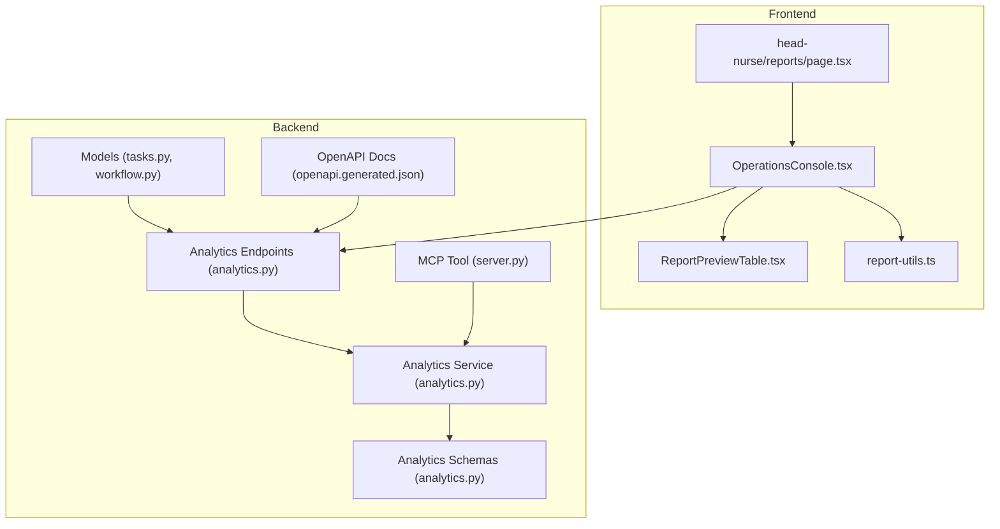
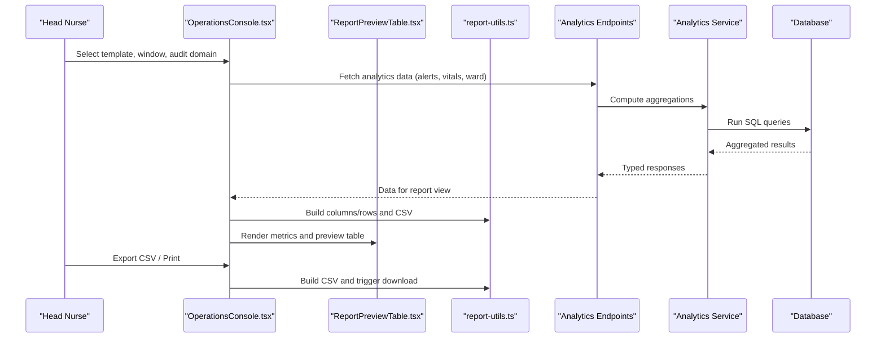
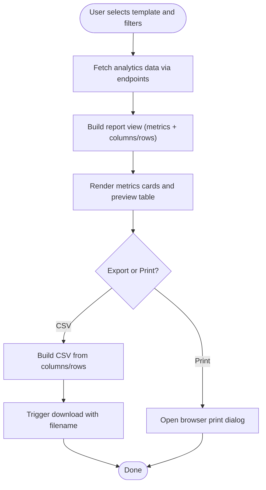
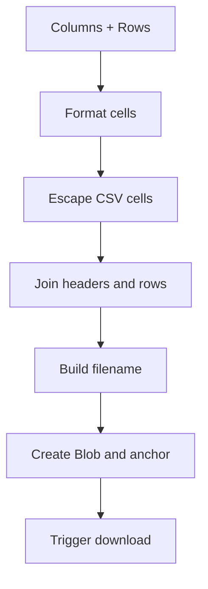
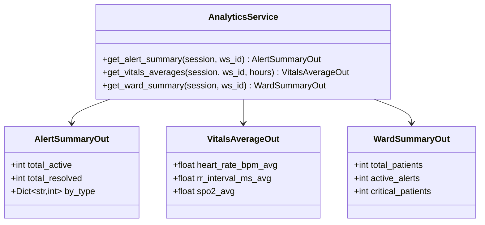
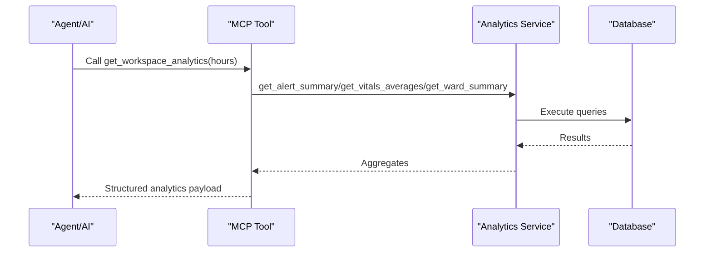
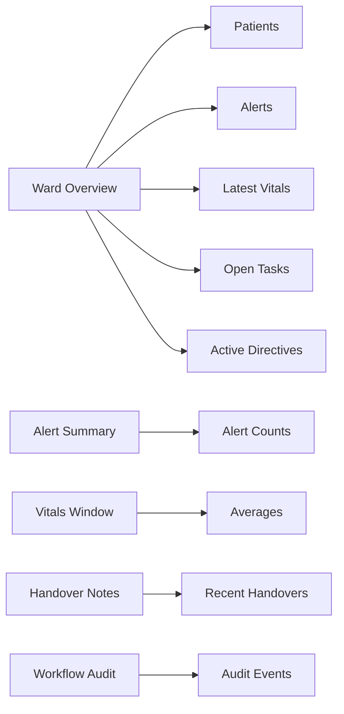
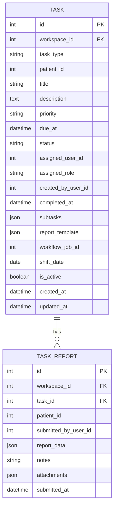
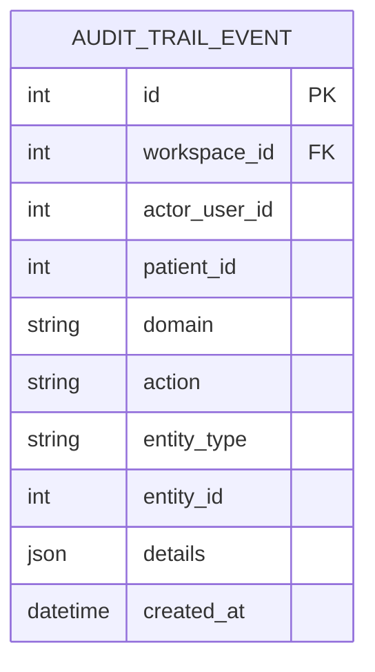
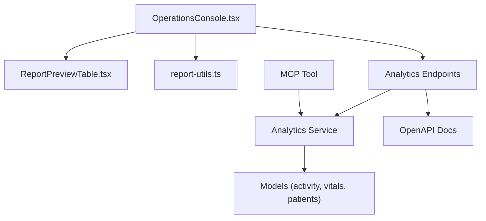

# Reports & Analytics

<cite>
**Referenced Files in This Document**
- [ReportPreviewTable.tsx](file://frontend/components/reports/ReportPreviewTable.tsx)
- [report-utils.ts](file://frontend/components/reports/report-utils.ts)
- [page.tsx](file://frontend/app/head-nurse/reports/page.tsx)
- [OperationsConsole.tsx](file://frontend/components/workflow/OperationsConsole.tsx)
- [analytics.py](file://server/app/services/analytics.py)
- [analytics.py](file://server/app/api/endpoints/analytics.py)
- [analytics.py](file://server/app/schemas/analytics.py)
- [tasks.py](file://server/app/models/tasks.py)
- [workflow.py](file://server/app/models/workflow.py)
- [server.py](file://server/app/mcp/server.py)
- [openapi.generated.json](file://server/openapi.generated.json)
- [api.ts](file://frontend/lib/api.ts)
</cite>

## Table of Contents
1. [Introduction](#introduction)
2. [Project Structure](#project-structure)
3. [Core Components](#core-components)
4. [Architecture Overview](#architecture-overview)
5. [Detailed Component Analysis](#detailed-component-analysis)
6. [Dependency Analysis](#dependency-analysis)
7. [Performance Considerations](#performance-considerations)
8. [Troubleshooting Guide](#troubleshooting-guide)
9. [Conclusion](#conclusion)
10. [Appendices](#appendices)

## Introduction
This document describes the Head Nurse Reports & Analytics system, focusing on the reporting interface, trend analysis, and performance metrics. It explains how users generate clinical reports, preview data in customizable tables, export to CSV, and integrate with analytics services for real-time insights. It also covers report templates, scheduling and distribution workflows, and extensibility for custom report creation.

## Project Structure
The Reports & Analytics feature spans the frontend and backend:

- Frontend:
  - Reporting UI: a reusable table component and utilities for CSV export and filenames
  - Operations Console: interactive report builder with templates, time windows, and export/print actions
  - Navigation: redirects to the Reports tab within the Head Nurse workflow console

- Backend:
  - Analytics endpoints: alert summaries, vitals averages, and ward summaries
  - Analytics service: SQL-backed aggregations and averages
  - OpenAPI: documented analytics endpoints
  - MCP tool: workspace analytics aggregation for AI/agent integrations
  - Models: task report schema and workflow audit trail for audit-based reports

**Diagram sources**
- [OperationsConsole.tsx:2450-2556](file://frontend/components/workflow/OperationsConsole.tsx#L2450-L2556)
- [ReportPreviewTable.tsx:1-67](file://frontend/components/reports/ReportPreviewTable.tsx#L1-L67)
- [report-utils.ts:1-53](file://frontend/components/reports/report-utils.ts#L1-L53)
- [page.tsx:1-6](file://frontend/app/head-nurse/reports/page.tsx#L1-L6)
- [analytics.py:1-49](file://server/app/api/endpoints/analytics.py#L1-L49)
- [analytics.py:1-91](file://server/app/services/analytics.py#L1-L91)
- [analytics.py:1-25](file://server/app/schemas/analytics.py#L1-L25)
- [server.py:1159-1197](file://server/app/mcp/server.py#L1159-L1197)
- [tasks.py:1-123](file://server/app/models/tasks.py#L1-L123)
- [workflow.py:1-197](file://server/app/models/workflow.py#L1-L197)
- [openapi.generated.json:4780-4872](file://server/openapi.generated.json#L4780-L4872)

**Section sources**
- [OperationsConsole.tsx:2450-2556](file://frontend/components/workflow/OperationsConsole.tsx#L2450-L2556)
- [ReportPreviewTable.tsx:1-67](file://frontend/components/reports/ReportPreviewTable.tsx#L1-L67)
- [report-utils.ts:1-53](file://frontend/components/reports/report-utils.ts#L1-L53)
- [page.tsx:1-6](file://frontend/app/head-nurse/reports/page.tsx#L1-L6)
- [analytics.py:1-49](file://server/app/api/endpoints/analytics.py#L1-L49)
- [analytics.py:1-91](file://server/app/services/analytics.py#L1-L91)
- [analytics.py:1-25](file://server/app/schemas/analytics.py#L1-L25)
- [server.py:1159-1197](file://server/app/mcp/server.py#L1159-L1197)
- [tasks.py:1-123](file://server/app/models/tasks.py#L1-L123)
- [workflow.py:1-197](file://server/app/models/workflow.py#L1-L197)
- [openapi.generated.json:4780-4872](file://server/openapi.generated.json#L4780-L4872)

## Core Components
- ReportPreviewTable: renders a responsive, scrollable table with optional caption and empty state
- report-utils: defines typed report structures, cell formatting, CSV building, and filename generation
- Operations Console Reports Tab: template selector, time window picker, audit domain filter, CSV/print actions, metric cards, and preview table
- Analytics Endpoints: alert summary, vitals averages, and ward summary
- Analytics Service: SQL-backed aggregations and averages
- MCP Tool: workspace analytics aggregator for AI/agents
- Task Report Schema: structured report data for task completion
- Workflow Audit Trail: events for workflow audit report template

**Section sources**
- [ReportPreviewTable.tsx:1-67](file://frontend/components/reports/ReportPreviewTable.tsx#L1-L67)
- [report-utils.ts:1-53](file://frontend/components/reports/report-utils.ts#L1-L53)
- [OperationsConsole.tsx:2450-2556](file://frontend/components/workflow/OperationsConsole.tsx#L2450-L2556)
- [analytics.py:1-49](file://server/app/api/endpoints/analytics.py#L1-L49)
- [analytics.py:1-91](file://server/app/services/analytics.py#L1-L91)
- [server.py:1159-1197](file://server/app/mcp/server.py#L1159-L1197)
- [tasks.py:83-123](file://server/app/models/tasks.py#L83-L123)
- [workflow.py:180-197](file://server/app/models/workflow.py#L180-L197)

## Architecture Overview
The system integrates frontend report builders with backend analytics services and models. Users configure report templates and time windows, the frontend builds a view with metrics and a preview table, and actions export CSV or print. Backend endpoints expose analytics, while MCP tools aggregate workspace-level insights for AI/agents.

**Diagram sources**
- [OperationsConsole.tsx:2450-2556](file://frontend/components/workflow/OperationsConsole.tsx#L2450-L2556)
- [ReportPreviewTable.tsx:1-67](file://frontend/components/reports/ReportPreviewTable.tsx#L1-L67)
- [report-utils.ts:1-53](file://frontend/components/reports/report-utils.ts#L1-L53)
- [analytics.py:1-49](file://server/app/api/endpoints/analytics.py#L1-L49)
- [analytics.py:1-91](file://server/app/services/analytics.py#L1-L91)

## Detailed Component Analysis

### Reporting Interface and Preview Table
- Purpose: Present filtered, time-bounded analytics in a customizable table with export and print actions
- Features:
  - Template selection: ward overview, alert summary, vitals window, handover notes, workflow audit
  - Time window: 6/12/24/72 hours
  - Audit domain filter: all, task, schedule, directive, handover, messaging, alert
  - Metrics cards: counts with severity tones
  - Preview table: columns/rows with empty state and caption
  - Export: CSV download with standardized filename pattern
  - Print: browser print dialog

**Diagram sources**
- [OperationsConsole.tsx:2450-2556](file://frontend/components/workflow/OperationsConsole.tsx#L2450-L2556)
- [ReportPreviewTable.tsx:1-67](file://frontend/components/reports/ReportPreviewTable.tsx#L1-L67)
- [report-utils.ts:21-52](file://frontend/components/reports/report-utils.ts#L21-L52)

**Section sources**
- [OperationsConsole.tsx:2450-2556](file://frontend/components/workflow/OperationsConsole.tsx#L2450-L2556)
- [ReportPreviewTable.tsx:1-67](file://frontend/components/reports/ReportPreviewTable.tsx#L1-L67)
- [report-utils.ts:1-53](file://frontend/components/reports/report-utils.ts#L1-L53)

### Report Utilities: Data Aggregation, Filtering, and Export
- Types: ReportCell, ReportRow, ReportColumn
- Formatting: null/undefined/empty to dash, booleans to Yes/No
- CSV Builder: escapes cells, joins headers and rows
- Filename Builder: slugifies template label and appends hours window
- Download Helper: creates Blob, anchor, and triggers download

**Diagram sources**
- [report-utils.ts:11-52](file://frontend/components/reports/report-utils.ts#L11-L52)

**Section sources**
- [report-utils.ts:1-53](file://frontend/components/reports/report-utils.ts#L1-L53)

### Analytics Services and Endpoints
- Endpoints:
  - Alerts summary: total active/resolved and counts by type
  - Vitals averages: heart rate, RR interval, SpO2 over configurable hours
  - Ward summary: total patients and active alerts
- Service:
  - Uses SQLAlchemy to compute counts and averages within time bounds
  - Returns Pydantic models for type-safe responses
- Roles: endpoints require head nurse or supervisor roles

**Diagram sources**
- [analytics.py:16-91](file://server/app/services/analytics.py#L16-L91)
- [analytics.py:8-25](file://server/app/schemas/analytics.py#L8-L25)

**Section sources**
- [analytics.py:1-49](file://server/app/api/endpoints/analytics.py#L1-L49)
- [analytics.py:1-91](file://server/app/services/analytics.py#L1-L91)
- [analytics.py:1-25](file://server/app/schemas/analytics.py#L1-L25)

### Integration with MCP and AI Agents
- MCP Tool: get_workspace_analytics aggregates alert summary, vitals averages, and ward summary for a given hours window
- Access control: requires workspace.read scope
- Output: structured dictionary for downstream consumption

**Diagram sources**
- [server.py:1159-1197](file://server/app/mcp/server.py#L1159-L1197)
- [analytics.py:16-91](file://server/app/services/analytics.py#L16-L91)

**Section sources**
- [server.py:1159-1197](file://server/app/mcp/server.py#L1159-L1197)
- [analytics.py:1-91](file://server/app/services/analytics.py#L1-L91)

### Report Templates and Workflows
- Templates supported in the console:
  - Ward overview: patient-level metrics, vitals, alerts, tasks, directives
  - Alert summary: counts and breakdowns
  - Vitals window: averages over selected hours
  - Handover notes: recent handover records
  - Workflow audit: audit trail events filtered by domain
- Distribution and scheduling:
  - CSV export endpoint for routine logs and patient routines exists in the task management domain
  - Workflow jobs and schedules underpin recurring activities; audit trail supports audit report template

**Diagram sources**
- [OperationsConsole.tsx:571-761](file://frontend/components/workflow/OperationsConsole.tsx#L571-L761)

**Section sources**
- [OperationsConsole.tsx:571-761](file://frontend/components/workflow/OperationsConsole.tsx#L571-L761)
- [api.ts:1084-1088](file://frontend/lib/api.ts#L1084-L1088)

### Task Reports and Custom Report Creation
- Task model includes a JSON-based report template schema for structured forms
- TaskReport captures immutable completion data, notes, and attachments
- These enable custom report creation per task with controlled fields and validation

**Diagram sources**
- [tasks.py:22-123](file://server/app/models/tasks.py#L22-L123)

**Section sources**
- [tasks.py:22-123](file://server/app/models/tasks.py#L22-L123)

### Audit Trail for Trend Analysis
- AuditTrailEvent model captures domain, action, entity, and timestamps
- Used by the workflow audit report template to show recent activity across domains
- Supports trend analysis by grouping events over time windows

**Diagram sources**
- [workflow.py:180-197](file://server/app/models/workflow.py#L180-L197)

**Section sources**
- [workflow.py:180-197](file://server/app/models/workflow.py#L180-L197)

## Dependency Analysis
- Frontend depends on:
  - Analytics endpoints for data
  - report-utils for formatting and export
  - UI components for rendering metrics and tables
- Backend depends on:
  - SQLAlchemy models for data access
  - Pydantic schemas for typed responses
  - OpenAPI for API documentation and discovery

**Diagram sources**
- [OperationsConsole.tsx:2450-2556](file://frontend/components/workflow/OperationsConsole.tsx#L2450-L2556)
- [ReportPreviewTable.tsx:1-67](file://frontend/components/reports/ReportPreviewTable.tsx#L1-L67)
- [report-utils.ts:1-53](file://frontend/components/reports/report-utils.ts#L1-L53)
- [analytics.py:1-49](file://server/app/api/endpoints/analytics.py#L1-L49)
- [analytics.py:1-91](file://server/app/services/analytics.py#L1-L91)
- [openapi.generated.json:4780-4872](file://server/openapi.generated.json#L4780-L4872)
- [server.py:1159-1197](file://server/app/mcp/server.py#L1159-L1197)

**Section sources**
- [OperationsConsole.tsx:2450-2556](file://frontend/components/workflow/OperationsConsole.tsx#L2450-L2556)
- [ReportPreviewTable.tsx:1-67](file://frontend/components/reports/ReportPreviewTable.tsx#L1-L67)
- [report-utils.ts:1-53](file://frontend/components/reports/report-utils.ts#L1-L53)
- [analytics.py:1-49](file://server/app/api/endpoints/analytics.py#L1-L49)
- [analytics.py:1-91](file://server/app/services/analytics.py#L1-L91)
- [openapi.generated.json:4780-4872](file://server/openapi.generated.json#L4780-L4872)
- [server.py:1159-1197](file://server/app/mcp/server.py#L1159-L1197)

## Performance Considerations
- Time window selection impacts query cost; prefer narrower windows for frequent previews
- CSV export builds strings in memory; large datasets may benefit from server-side streaming exports
- Use pagination and limits where applicable (e.g., patient lists) to reduce payload sizes
- Cache frequently accessed analytics for short intervals to reduce database load

## Troubleshooting Guide
- CSV export does nothing:
  - Verify columns and rows are populated before export
  - Confirm filename and MIME type passed to download helper
- Empty preview table:
  - Check time window and audit domain filters
  - Ensure analytics endpoints return data for the selected workspace
- Endpoint errors:
  - Validate role permissions for analytics endpoints
  - Confirm workspace context and query parameters (e.g., hours)
- MCP tool failures:
  - Ensure workspace.read scope and valid hours parameter

**Section sources**
- [report-utils.ts:33-52](file://frontend/components/reports/report-utils.ts#L33-L52)
- [OperationsConsole.tsx:2450-2556](file://frontend/components/workflow/OperationsConsole.tsx#L2450-L2556)
- [analytics.py:17-49](file://server/app/api/endpoints/analytics.py#L17-L49)
- [server.py:1159-1197](file://server/app/mcp/server.py#L1159-L1197)

## Conclusion
The Head Nurse Reports & Analytics system provides a flexible, role-aware interface for generating and reviewing clinical reports. It combines customizable templates, time-bound analytics, and export capabilities with backend services that aggregate alerts, vitals, and ward statistics. Integrations with MCP and workflow models enable AI-assisted insights and audit-driven reporting, while task report schemas support custom, structured submissions.

## Appendices

### Example Report Types
- Admission reports: combine ward overview and vitals window to summarize recent admissions and trends
- Quality metrics: alert summary and workflow audit to track compliance and incident trends
- Staff productivity: handover notes and task metrics to assess workload and handoff efficiency

### Custom Report Creation
- Define a report template schema on tasks to collect structured data
- Use the task report submission flow to capture immutable completion data
- Reference task report models for data persistence and retrieval

**Section sources**
- [tasks.py:64-71](file://server/app/models/tasks.py#L64-L71)
- [tasks.py:83-123](file://server/app/models/tasks.py#L83-L123)

### Integration with External Systems
- CSV export endpoints exist for routine logs and patient routines; similar patterns can be extended for custom reports
- Use the MCP tool to surface analytics to external agents or AI systems

**Section sources**
- [api.ts:1084-1088](file://frontend/lib/api.ts#L1084-L1088)
- [server.py:1159-1197](file://server/app/mcp/server.py#L1159-L1197)