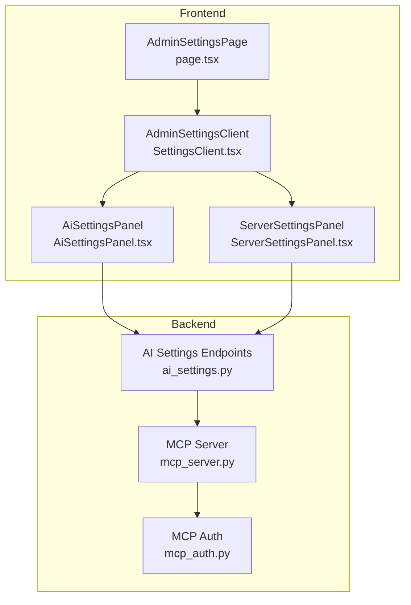
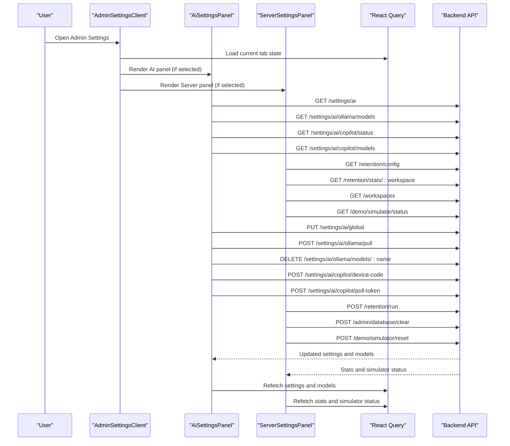
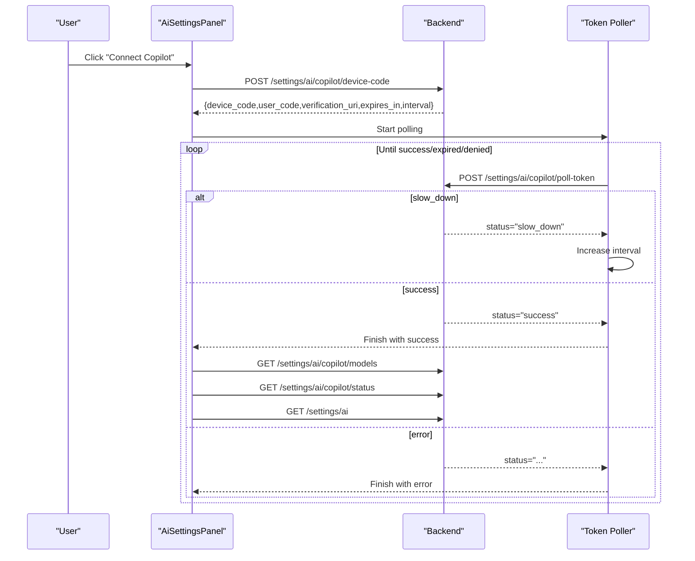
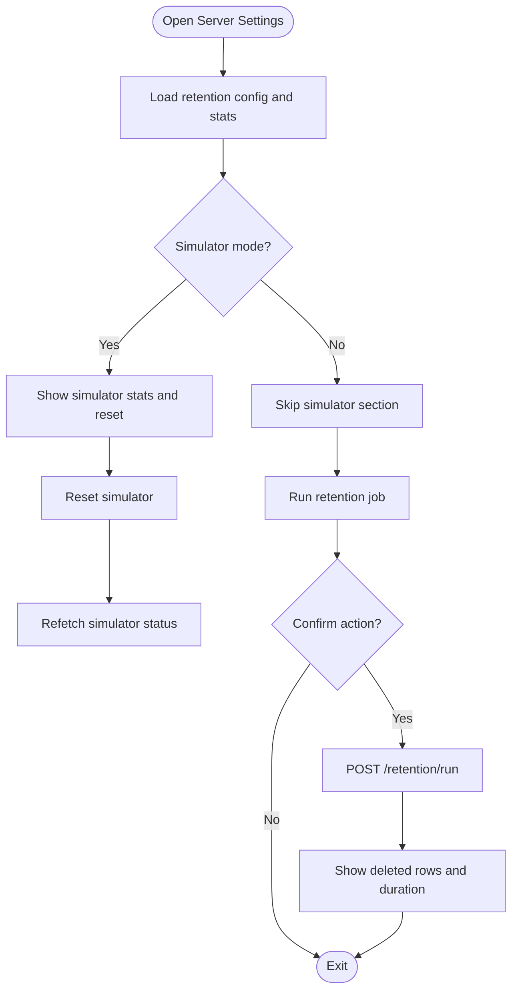
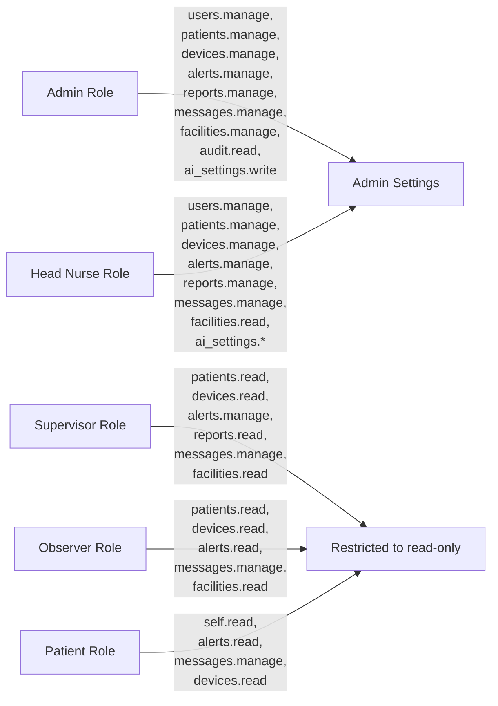
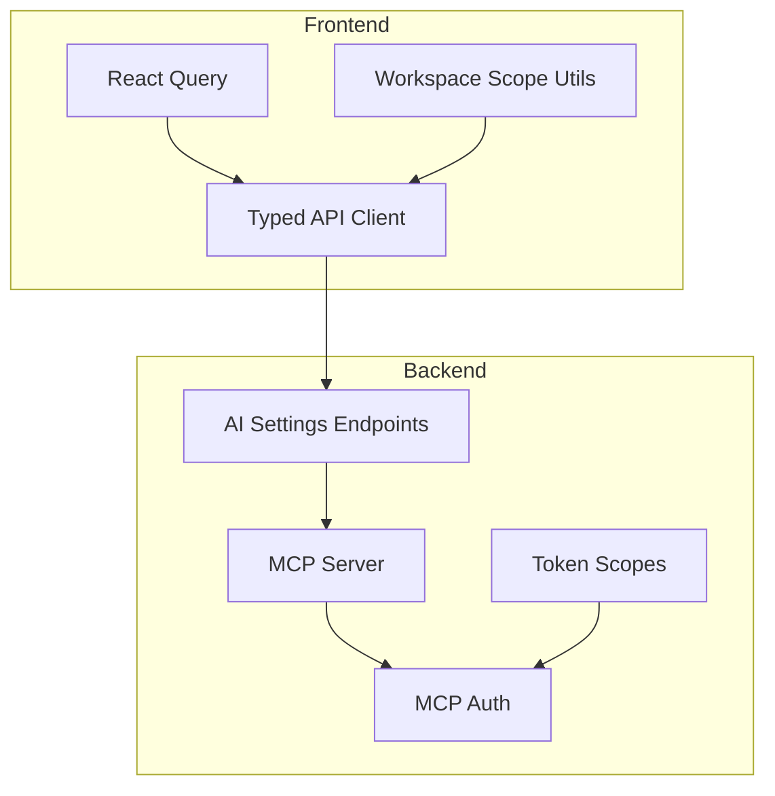

# Settings & Configuration

<cite>
**Referenced Files in This Document**
- [AiSettingsPanel.tsx](file://frontend/components/admin/settings/AiSettingsPanel.tsx)
- [ServerSettingsPanel.tsx](file://frontend/components/admin/settings/ServerSettingsPanel.tsx)
- [AdminSettingsClient.tsx](file://frontend/app/admin/settings/SettingsClient.tsx)
- [AdminSettingsPage.tsx](file://frontend/app/admin/settings/page.tsx)
- [HeadNurseSettingsRedirectPage.tsx](file://frontend/app/head-nurse/settings/page.tsx)
- [SupervisorSettingsRedirectPage.tsx](file://frontend/app/supervisor/settings/page.tsx)
- [permissions.ts](file://frontend/lib/permissions.ts)
- [dependencies.py](file://server/app/api/dependencies.py)
- [ai_settings.py](file://server/app/api/endpoints/ai_settings.py)
- [ai_settings.py (schema)](file://server/app/schemas/ai_settings.py)
- [ai_chat.py](file://server/app/services/ai_chat.py)
- [mcp_server.py](file://server/mcp_server.py)
- [mcp_auth.py](file://server/app/mcp/auth.py)
- [mcp_tokens.py](file://server/app/models/mcp_tokens.py)
- [mcp_tokens.py (schema)](file://server/app/schemas/mcp_tokens.py)
- [queryEndpointDefaults.ts](file://frontend/lib/queryEndpointDefaults.ts)
- [api.ts](file://frontend/lib/api.ts)
- [refetchOrThrow.ts](file://frontend/lib/refetchOrThrow.ts)
- [workspaceQuery.ts](file://frontend/lib/workspaceQuery.ts)
- [types.ts](file://frontend/lib/types.ts)
</cite>

## Table of Contents
1. [Introduction](#introduction)
2. [Project Structure](#project-structure)
3. [Core Components](#core-components)
4. [Architecture Overview](#architecture-overview)
5. [Detailed Component Analysis](#detailed-component-analysis)
6. [Dependency Analysis](#dependency-analysis)
7. [Performance Considerations](#performance-considerations)
8. [Troubleshooting Guide](#troubleshooting-guide)
9. [Conclusion](#conclusion)
10. [Appendices](#appendices)

## Introduction
This document describes the Settings & Configuration interface for administrators and authorized users. It covers:
- Administrative settings panel for system preferences, workflow parameters, and role-specific configurations
- AI settings panel for managing artificial intelligence features, tool integrations, and decision support systems
- Server settings panel for system configuration, integration settings, and performance tuning
- Workspace-specific settings, role permissions, and access controls
- Integration with backend configuration systems and real-time setting updates
- Example configuration workflows, backup procedures, and integration with system administration tools

## Project Structure
The Settings & Configuration feature is organized around a client-side tabbed interface with role-scoped panels:
- Admin settings page renders a client component that switches between Profile, AI, Server, Audit, and System tabs
- AI settings panel manages provider/model defaults, runtime connectivity, and local model operations
- Server settings panel manages retention policies, simulator controls, ML calibration, and destructive database actions
- Permissions and capabilities define who can access and modify settings
- Backend endpoints expose configuration APIs consumed by the frontend

**Diagram sources**
- [AdminSettingsPage.tsx:1-19](file://frontend/app/admin/settings/page.tsx#L1-L19)
- [AdminSettingsClient.tsx:1-114](file://frontend/app/admin/settings/SettingsClient.tsx#L1-L114)
- [AiSettingsPanel.tsx:1-1098](file://frontend/components/admin/settings/AiSettingsPanel.tsx#L1-L1098)
- [ServerSettingsPanel.tsx:1-405](file://frontend/components/admin/settings/ServerSettingsPanel.tsx#L1-L405)
- [ai_settings.py](file://server/app/api/endpoints/ai_settings.py)
- [mcp_server.py](file://server/mcp_server.py)
- [mcp_auth.py](file://server/app/mcp/auth.py)

**Section sources**
- [AdminSettingsPage.tsx:1-19](file://frontend/app/admin/settings/page.tsx#L1-L19)
- [AdminSettingsClient.tsx:1-114](file://frontend/app/admin/settings/SettingsClient.tsx#L1-L114)

## Core Components
- AdminSettingsClient: Tab controller and navigation for settings sections; redirects Profile to the Account page; exposes links to API docs
- AiSettingsPanel: Manages AI provider/model defaults, runtime connectivity checks, GitHub Copilot device flow, Ollama model pull/delete, and real-time status
- ServerSettingsPanel: Manages retention configuration and statistics, simulator controls, ML calibration access, and database clearing with confirmation

**Section sources**
- [AdminSettingsClient.tsx:15-114](file://frontend/app/admin/settings/SettingsClient.tsx#L15-L114)
- [AiSettingsPanel.tsx:311-1098](file://frontend/components/admin/settings/AiSettingsPanel.tsx#L311-L1098)
- [ServerSettingsPanel.tsx:64-405](file://frontend/components/admin/settings/ServerSettingsPanel.tsx#L64-L405)

## Architecture Overview
The Settings UI integrates with backend endpoints via typed queries and imperative actions. Real-time updates are achieved through React Query refetch helpers and polling defaults. Role-based access is enforced on both frontend and backend.

**Diagram sources**
- [AdminSettingsClient.tsx:25-114](file://frontend/app/admin/settings/SettingsClient.tsx#L25-L114)
- [AiSettingsPanel.tsx:311-1098](file://frontend/components/admin/settings/AiSettingsPanel.tsx#L311-L1098)
- [ServerSettingsPanel.tsx:64-405](file://frontend/components/admin/settings/ServerSettingsPanel.tsx#L64-L405)
- [ai_settings.py](file://server/app/api/endpoints/ai_settings.py)
- [queryEndpointDefaults.ts](file://frontend/lib/queryEndpointDefaults.ts)

## Detailed Component Analysis

### AI Settings Panel
The AI settings panel centralizes configuration for AI runtime providers and models, with workspace-scoped defaults and operational controls.

- Runtime summary displays current provider, model, runtime connectivity, and Ollama origin
- Workspace defaults allow selecting provider and model for new tasks/workflows
- GitHub Copilot device flow:
  - Initiates device code acquisition and polls for token
  - Handles slow_down, expired, denied, and backend errors
  - Auto-closes after successful connection
- Local model management:
  - Pull models from Ollama with streaming progress
  - Delete models with immediate backend update
- Provider/model selection:
  - Dynamically populates options from backend
  - Sanitizes disconnected Copilot model lists for UX

**Diagram sources**
- [AiSettingsPanel.tsx:595-639](file://frontend/components/admin/settings/AiSettingsPanel.tsx#L595-L639)
- [AiSettingsPanel.tsx:495-542](file://frontend/components/admin/settings/AiSettingsPanel.tsx#L495-L542)

Key behaviors and data flows:
- Workspace defaults saving updates global AI settings and refetches current settings
- Ollama pull streams NDJSON logs, parses errors, and updates progress
- Model deletion triggers immediate backend removal and UI refresh

**Section sources**
- [AiSettingsPanel.tsx:311-1098](file://frontend/components/admin/settings/AiSettingsPanel.tsx#L311-L1098)

### Server Settings Panel
The server settings panel provides operational controls and diagnostics for administrators.

- Connection info: shows current workspace and API proxy routing
- Simulator controls: displays statistics and reset action when in simulator mode
- Retention management:
  - Reads retention configuration and per-table statistics
  - Runs retention job with confirmation and reports deleted rows and duration
- ML calibration: navigates to ML calibration page
- Database clearing: requires password confirmation and performs destructive operation

**Diagram sources**
- [ServerSettingsPanel.tsx:64-405](file://frontend/components/admin/settings/ServerSettingsPanel.tsx#L64-L405)

Operational highlights:
- Workspace-aware endpoints using workspace scope
- Confirmation dialogs for destructive actions
- Real-time status updates via React Query polling defaults

**Section sources**
- [ServerSettingsPanel.tsx:64-405](file://frontend/components/admin/settings/ServerSettingsPanel.tsx#L64-L405)

### Settings Client and Navigation
The client component orchestrates tabbed navigation and delegates rendering to specialized panels. It also handles redirection for non-admin roles and provides quick access to API documentation.

- Tabs: Profile, AI, Server, Audit, System
- Profile tab redirects to Account page
- Audit tab loads the admin audit page component
- System tab opens ML calibration client

**Section sources**
- [AdminSettingsClient.tsx:15-114](file://frontend/app/admin/settings/SettingsClient.tsx#L15-L114)

### Role Permissions and Access Controls
Access to settings is governed by role capabilities and route-level guards:
- Frontend permissions module defines capabilities per role
- Backend dependency module mirrors capabilities and token scopes
- Route access is restricted to admin/head nurse for admin-related routes

**Diagram sources**
- [permissions.ts:26-109](file://frontend/lib/permissions.ts#L26-L109)
- [dependencies.py:200-311](file://server/app/api/dependencies.py#L200-L311)

**Section sources**
- [permissions.ts:26-109](file://frontend/lib/permissions.ts#L26-L109)
- [dependencies.py:200-311](file://server/app/api/dependencies.py#L200-L311)

## Dependency Analysis
- Frontend depends on:
  - React Query for caching and polling
  - Typed API client for backend calls
  - Workspace scoping utilities for workspace-aware endpoints
- Backend depends on:
  - AI settings endpoints for provider/model configuration
  - MCP server for AI tool routing and authentication
  - Token scopes for role-based access control

**Diagram sources**
- [queryEndpointDefaults.ts](file://frontend/lib/queryEndpointDefaults.ts)
- [api.ts](file://frontend/lib/api.ts)
- [workspaceQuery.ts](file://frontend/lib/workspaceQuery.ts)
- [ai_settings.py](file://server/app/api/endpoints/ai_settings.py)
- [mcp_server.py](file://server/mcp_server.py)
- [mcp_auth.py](file://server/app/mcp/auth.py)
- [dependencies.py:250-311](file://server/app/api/dependencies.py#L250-L311)

**Section sources**
- [queryEndpointDefaults.ts](file://frontend/lib/queryEndpointDefaults.ts)
- [api.ts](file://frontend/lib/api.ts)
- [workspaceQuery.ts](file://frontend/lib/workspaceQuery.ts)
- [dependencies.py:250-311](file://server/app/api/dependencies.py#L250-L311)

## Performance Considerations
- Use appropriate staleTime and refetchInterval to balance freshness and network load
- Stream model pulls to avoid blocking UI during long operations
- Debounce or throttle polling intervals for device flows
- Cache provider/model lists locally when feasible to reduce repeated requests

## Troubleshooting Guide
Common issues and resolutions:
- Copilot device flow fails:
  - Verify expiration and retry slow_down intervals
  - Check backend error messages and re-initiate device code
- Ollama pull failures:
  - Inspect streamed logs for parsing errors
  - Confirm network reachability and model name correctness
- Retention job errors:
  - Review reported duration and deleted counts
  - Re-run after addressing underlying data issues
- Database clearing:
  - Requires explicit confirmation and correct password
  - After clearing, refresh user context to reflect changes

**Section sources**
- [AiSettingsPanel.tsx:527-538](file://frontend/components/admin/settings/AiSettingsPanel.tsx#L527-L538)
- [AiSettingsPanel.tsx:641-717](file://frontend/components/admin/settings/AiSettingsPanel.tsx#L641-L717)
- [ServerSettingsPanel.tsx:138-153](file://frontend/components/admin/settings/ServerSettingsPanel.tsx#L138-L153)
- [ServerSettingsPanel.tsx:118-136](file://frontend/components/admin/settings/ServerSettingsPanel.tsx#L118-L136)

## Conclusion
The Settings & Configuration interface provides a comprehensive, role-aware system for managing AI runtime, server operations, and administrative controls. It leverages real-time updates, robust error handling, and strict access controls to ensure safe and efficient configuration management.

## Appendices

### Configuration Workflows
- Configure AI provider/model defaults:
  - Select provider and model in the AI panel
  - Save workspace defaults to apply to new workflows
- Connect GitHub Copilot:
  - Initiate device code and follow verification steps
  - Monitor polling status and auto-close on success
- Manage Ollama models:
  - Pull models with progress feedback
  - Delete models to free space
- Tune retention and run cleanup:
  - Adjust retention days and interval
  - Run retention job and review statistics
- Simulator reset:
  - Reset simulator state with confirmation
- Clear database (administrative):
  - Provide password and confirm destructive action

**Section sources**
- [AiSettingsPanel.tsx:582-593](file://frontend/components/admin/settings/AiSettingsPanel.tsx#L582-L593)
- [AiSettingsPanel.tsx:595-639](file://frontend/components/admin/settings/AiSettingsPanel.tsx#L595-L639)
- [AiSettingsPanel.tsx:641-727](file://frontend/components/admin/settings/AiSettingsPanel.tsx#L641-L727)
- [ServerSettingsPanel.tsx:138-174](file://frontend/components/admin/settings/ServerSettingsPanel.tsx#L138-L174)

### Backup Procedures
- Export OpenAPI specification for backend contract review
- Use retention configuration to manage historical data lifecycle
- Maintain secure backups of workspace-scoped configurations and tokens

**Section sources**
- [AdminSettingsClient.tsx:88-98](file://frontend/app/admin/settings/SettingsClient.tsx#L88-L98)
- [ai_settings.py](file://server/app/api/endpoints/ai_settings.py)

### Integration with System Administration Tools
- Use the embedded API documentation link for endpoint discovery
- Leverage MCP server and token scopes for AI tool routing and authentication
- Apply workspace scoping utilities for tenant isolation

**Section sources**
- [AdminSettingsClient.tsx:46-47](file://frontend/app/admin/settings/SettingsClient.tsx#L46-L47)
- [mcp_server.py](file://server/mcp_server.py)
- [mcp_auth.py](file://server/app/mcp/auth.py)
- [workspaceQuery.ts](file://frontend/lib/workspaceQuery.ts)