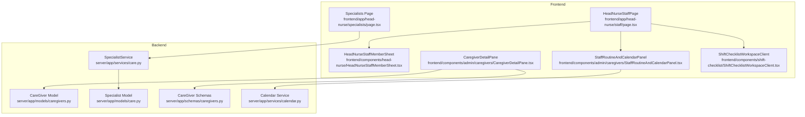
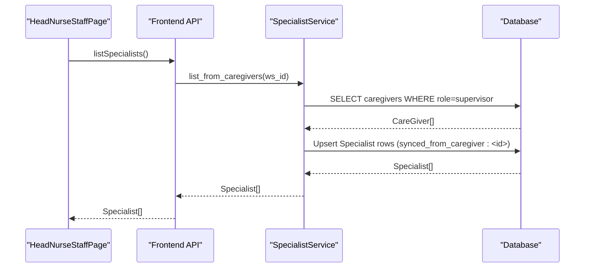
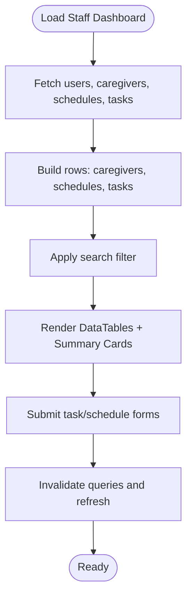
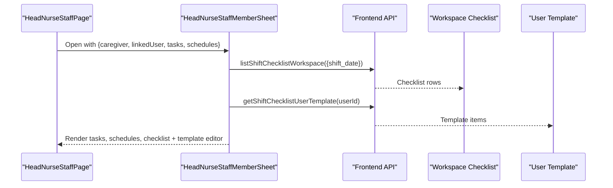
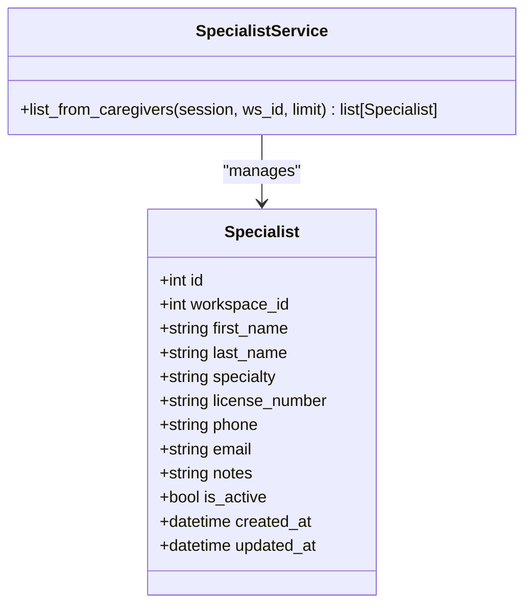
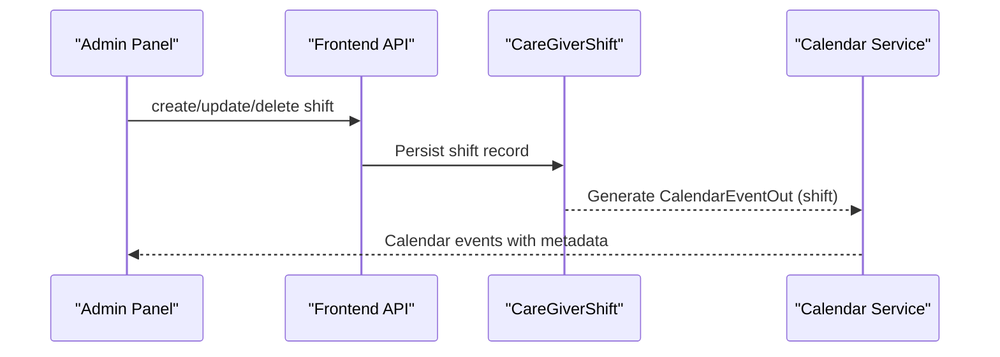
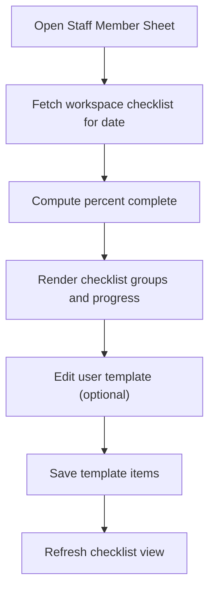
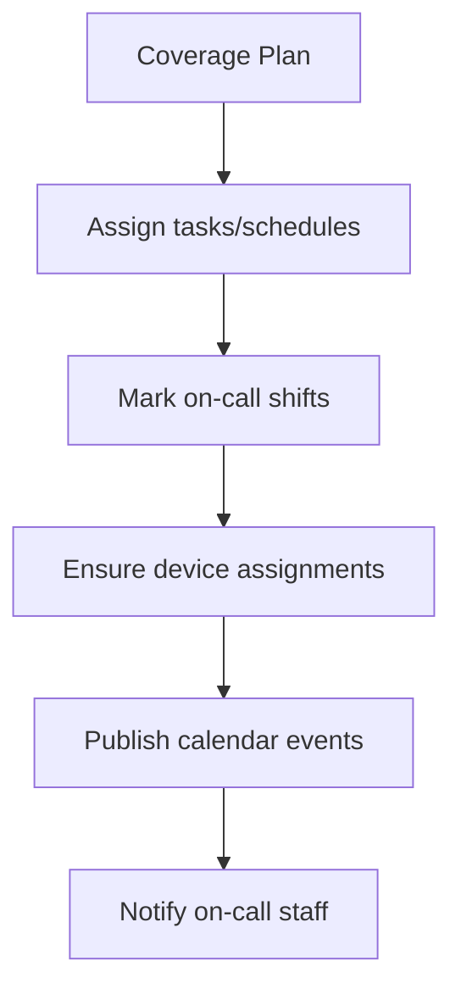
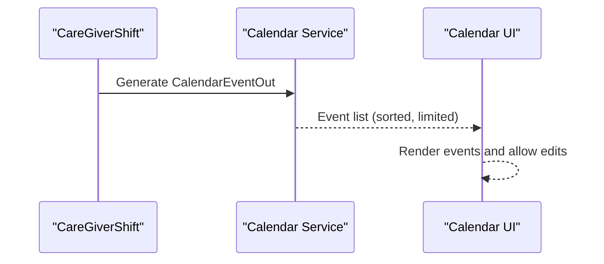
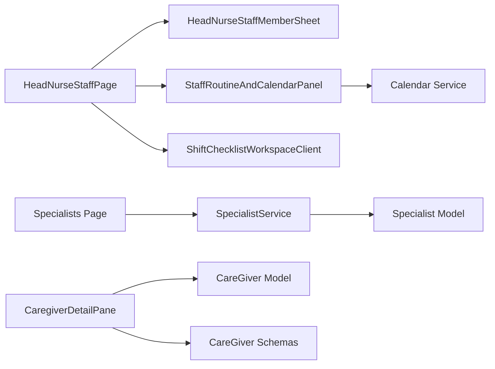

# Staff Supervision

<cite>
**Referenced Files in This Document**
- [page.tsx](file://frontend/app/head-nurse/staff/page.tsx)
- [HeadNurseStaffMemberSheet.tsx](file://frontend/components/head-nurse/HeadNurseStaffMemberSheet.tsx)
- [page.tsx](file://frontend/app/head-nurse/specialists/page.tsx)
- [caregivers.py](file://server/app/models/caregivers.py)
- [care.py](file://server/app/models/care.py)
- [caregivers.py](file://server/app/schemas/caregivers.py)
- [care.py](file://server/app/services/care.py)
- [calendar.py](file://server/app/services/calendar.py)
- [StaffRoutineAndCalendarPanel.tsx](file://frontend/components/admin/caregivers/StaffRoutineAndCalendarPanel.tsx)
- [CaregiverDetailPane.tsx](file://frontend/components/admin/caregivers/CaregiverDetailPane.tsx)
- [ShiftChecklistWorkspaceClient.tsx](file://frontend/components/shift-checklist/ShiftChecklistWorkspaceClient.tsx)
- [page.tsx](file://frontend/app/head-nurse/page.tsx)
</cite>

## Table of Contents
1. [Introduction](#introduction)
2. [Project Structure](#project-structure)
3. [Core Components](#core-components)
4. [Architecture Overview](#architecture-overview)
5. [Detailed Component Analysis](#detailed-component-analysis)
6. [Dependency Analysis](#dependency-analysis)
7. [Performance Considerations](#performance-considerations)
8. [Troubleshooting Guide](#troubleshooting-guide)
9. [Conclusion](#conclusion)

## Introduction
This document describes the Head Nurse Staff Supervision interface and the underlying staff roster management system. It explains how to view, add, and manage healthcare team members, how staff member sheets surface contact information, roles, certifications, and availability, and how the system coordinates specialists alongside daily caregiving staff. It also documents staff scheduling integration, shift management, coverage planning, performance monitoring via shift checklists, skill tracking, and competency verification. Finally, it outlines staff allocation workflows, emergency staffing procedures, and calendar integration for shift planning.

## Project Structure
The Staff Supervision feature spans frontend Next.js pages and components, and backend services and models:
- Frontend:
  - Head Nurse staff dashboard and staff member sheet
  - Specialists management page
  - Admin calendar and routine panels for schedules and checklists
- Backend:
  - Caregiver and specialist models and schemas
  - Services for syncing caregivers to specialists and calendar event generation
  - API endpoints for schedules, tasks, and checklists

**Diagram sources**
- [page.tsx:122-800](file://frontend/app/head-nurse/staff/page.tsx#L122-L800)
- [HeadNurseStaffMemberSheet.tsx:253-514](file://frontend/components/head-nurse/HeadNurseStaffMemberSheet.tsx#L253-L514)
- [page.tsx:61-278](file://frontend/app/head-nurse/specialists/page.tsx#L61-L278)
- [care.py:20-94](file://server/app/services/care.py#L20-L94)
- [caregivers.py:22-166](file://server/app/models/caregivers.py#L22-L166)
- [care.py:10-25](file://server/app/models/care.py#L10-L25)
- [caregivers.py:11-122](file://server/app/schemas/caregivers.py#L11-L122)
- [calendar.py:261-285](file://server/app/services/calendar.py#L261-L285)
- [StaffRoutineAndCalendarPanel.tsx:34-68](file://frontend/components/admin/caregivers/StaffRoutineAndCalendarPanel.tsx#L34-L68)
- [CaregiverDetailPane.tsx:1078-1154](file://frontend/components/admin/caregivers/CaregiverDetailPane.tsx#L1078-L1154)
- [ShiftChecklistWorkspaceClient.tsx:150-164](file://frontend/components/shift-checklist/ShiftChecklistWorkspaceClient.tsx#L150-L164)

**Section sources**
- [page.tsx:122-800](file://frontend/app/head-nurse/staff/page.tsx#L122-L800)
- [HeadNurseStaffMemberSheet.tsx:253-514](file://frontend/components/head-nurse/HeadNurseStaffMemberSheet.tsx#L253-L514)
- [page.tsx:61-278](file://frontend/app/head-nurse/specialists/page.tsx#L61-L278)
- [care.py:20-94](file://server/app/services/care.py#L20-L94)
- [caregivers.py:22-166](file://server/app/models/caregivers.py#L22-L166)
- [care.py:10-25](file://server/app/models/care.py#L10-L25)
- [caregivers.py:11-122](file://server/app/schemas/caregivers.py#L11-L122)
- [calendar.py:261-285](file://server/app/services/calendar.py#L261-L285)
- [StaffRoutineAndCalendarPanel.tsx:34-68](file://frontend/components/admin/caregivers/StaffRoutineAndCalendarPanel.tsx#L34-L68)
- [CaregiverDetailPane.tsx:1078-1154](file://frontend/components/admin/caregivers/CaregiverDetailPane.tsx#L1078-L1154)
- [ShiftChecklistWorkspaceClient.tsx:150-164](file://frontend/components/shift-checklist/ShiftChecklistWorkspaceClient.tsx#L150-L164)

## Core Components
- Head Nurse Staff Dashboard: Provides a searchable roster, quick-create task and schedule forms, and summary statistics for active staff, open schedules, and open tasks. It integrates with the staff member sheet for detailed views.
- Staff Member Sheet: Presents a worker’s assigned tasks, schedules, and shift checklist completion percentage, with a template editor for customizable checklist items.
- Specialists Management: Allows adding and viewing consultants and other healthcare professionals, including license numbers and contact info.
- Scheduling and Coverage: Admin panel for listing schedules and shifts, creating/editing shifts, and integrating with the calendar service to publish shift events.
- Performance Monitoring: Shift checklist workspace aggregates completion metrics per staff member and supports template customization per user.
- Integration Points: Calendar service converts shift records into calendar events; caregiver-to-specialist sync maintains aligned professional profiles.

**Section sources**
- [page.tsx:122-800](file://frontend/app/head-nurse/staff/page.tsx#L122-L800)
- [HeadNurseStaffMemberSheet.tsx:253-514](file://frontend/components/head-nurse/HeadNurseStaffMemberSheet.tsx#L253-L514)
- [page.tsx:61-278](file://frontend/app/head-nurse/specialists/page.tsx#L61-L278)
- [StaffRoutineAndCalendarPanel.tsx:34-68](file://frontend/components/admin/caregivers/StaffRoutineAndCalendarPanel.tsx#L34-L68)
- [CaregiverDetailPane.tsx:1078-1154](file://frontend/components/admin/caregivers/CaregiverDetailPane.tsx#L1078-L1154)
- [calendar.py:261-285](file://server/app/services/calendar.py#L261-L285)
- [care.py:20-94](file://server/app/services/care.py#L20-L94)

## Architecture Overview
The Staff Supervision interface is a client-driven dashboard backed by backend services and models. The frontend queries caregivers, schedules, tasks, and specialists, and renders them in unified views. The staff member sheet consolidates work items and checklist data for a selected caregiver. Backend services maintain data integrity and derive derived artifacts such as calendar events and synced specialist records.

**Diagram sources**
- [page.tsx:122-150](file://frontend/app/head-nurse/staff/page.tsx#L122-L150)
- [care.py:20-94](file://server/app/services/care.py#L20-L94)
- [caregivers.py:22-44](file://server/app/models/caregivers.py#L22-L44)
- [care.py:10-25](file://server/app/models/care.py#L10-L25)

## Detailed Component Analysis

### Staff Roster and Quick Actions
- Purpose: View and filter caregivers, create tasks and schedules, and monitor open workload.
- Key features:
  - Search across names, roles, phone, and email.
  - Quick-create forms for tasks (with optional schedule and assigned user) and schedules (with recurrence).
  - Summary cards for active staff, open schedules, and open tasks.
  - Open staff member sheet for a selected caregiver.
- Data sources:
  - Users, caregivers, schedules, and tasks are fetched via React Query and transformed into sortable, filterable rows.

**Diagram sources**
- [page.tsx:122-800](file://frontend/app/head-nurse/staff/page.tsx#L122-L800)

**Section sources**
- [page.tsx:122-800](file://frontend/app/head-nurse/staff/page.tsx#L122-L800)

### Staff Member Sheet: Work Items, Schedules, Checklist
- Purpose: Consolidated view for a selected caregiver’s assigned tasks, schedules, and shift checklist progress.
- Key features:
  - Assigned tasks: title, description, priority, status, due date.
  - Assigned schedules: title, type, start time.
  - Shift checklist: grouped categories, completion percentage, date picker, and template editor.
  - Template editor: add/remove rows, preview labels, save template per user.
- Integration:
  - Uses workspace checklist data and per-user template.
  - Linked user is used to scope tasks, schedules, and checklist items.

**Diagram sources**
- [HeadNurseStaffMemberSheet.tsx:253-514](file://frontend/components/head-nurse/HeadNurseStaffMemberSheet.tsx#L253-L514)

**Section sources**
- [HeadNurseStaffMemberSheet.tsx:253-514](file://frontend/components/head-nurse/HeadNurseStaffMemberSheet.tsx#L253-L514)

### Specialists Coordination
- Purpose: Manage consultants and other healthcare professionals with specialties, licenses, and contact info.
- Key features:
  - Form to add specialists with validation.
  - Table view with status badges and contact details.
  - Sync caregivers with supervisor role to specialists automatically.

**Diagram sources**
- [care.py:10-25](file://server/app/models/care.py#L10-L25)
- [care.py:20-94](file://server/app/services/care.py#L20-L94)

**Section sources**
- [page.tsx:61-278](file://frontend/app/head-nurse/specialists/page.tsx#L61-L278)
- [care.py:10-25](file://server/app/models/care.py#L10-L25)
- [care.py:20-94](file://server/app/services/care.py#L20-L94)

### Staff Scheduling Integration and Coverage Planning
- Purpose: Create, edit, and delete shifts; integrate with calendar; plan coverage.
- Key features:
  - Admin panel lists schedules and allows creating/editing shifts for caregivers.
  - Shifts are converted into calendar events with metadata for editing and display.
  - Coverage planning supported by assigning schedules and users.

**Diagram sources**
- [CaregiverDetailPane.tsx:1078-1154](file://frontend/components/admin/caregivers/CaregiverDetailPane.tsx#L1078-L1154)
- [calendar.py:261-285](file://server/app/services/calendar.py#L261-L285)
- [caregivers.py:112-129](file://server/app/models/caregivers.py#L112-L129)

**Section sources**
- [StaffRoutineAndCalendarPanel.tsx:34-68](file://frontend/components/admin/caregivers/StaffRoutineAndCalendarPanel.tsx#L34-L68)
- [CaregiverDetailPane.tsx:1078-1154](file://frontend/components/admin/caregivers/CaregiverDetailPane.tsx#L1078-L1154)
- [calendar.py:261-285](file://server/app/services/calendar.py#L261-L285)
- [caregivers.py:112-129](file://server/app/models/caregivers.py#L112-L129)

### Staff Performance Monitoring, Skill Tracking, and Competency Verification
- Purpose: Track completion of shift checklist items, customize templates per user, and monitor progress.
- Mechanism:
  - Workspace checklist aggregates items per user and computes completion percentage.
  - Head Nurse can edit per-user templates to reflect required competencies and skills.
  - Integration with checklist workspace client enables per-sheet template editing.

**Diagram sources**
- [HeadNurseStaffMemberSheet.tsx:264-280](file://frontend/components/head-nurse/HeadNurseStaffMemberSheet.tsx#L264-L280)
- [ShiftChecklistWorkspaceClient.tsx:150-164](file://frontend/components/shift-checklist/ShiftChecklistWorkspaceClient.tsx#L150-L164)

**Section sources**
- [HeadNurseStaffMemberSheet.tsx:253-514](file://frontend/components/head-nurse/HeadNurseStaffMemberSheet.tsx#L253-L514)
- [ShiftChecklistWorkspaceClient.tsx:150-164](file://frontend/components/shift-checklist/ShiftChecklistWorkspaceClient.tsx#L150-L164)

### Staff Allocation Workflows and Emergency Staffing Procedures
- Staff allocation:
  - Assign tasks and schedules to users or roles.
  - Use the “assign” column to target either a specific user or a role.
- Emergency staffing:
  - On-call shifts are supported via shift_type.
  - Caregiver device assignments enable mobile or gateway connectivity for on-call staff.
  - Calendar integration publishes on-call events for visibility.

**Diagram sources**
- [caregivers.py:112-129](file://server/app/models/caregivers.py#L112-L129)
- [caregivers.py:130-166](file://server/app/models/caregivers.py#L130-L166)
- [calendar.py:261-285](file://server/app/services/calendar.py#L261-L285)

**Section sources**
- [caregivers.py:112-129](file://server/app/models/caregivers.py#L112-L129)
- [caregivers.py:130-166](file://server/app/models/caregivers.py#L130-L166)
- [calendar.py:261-285](file://server/app/services/calendar.py#L261-L285)

### Integration with Calendar System for Shift Planning
- Shifts are converted into calendar events with metadata including caregiver ID and shift type.
- Events are sorted and limited to improve rendering performance.
- Admins can view and edit shifts through the calendar panel.

**Diagram sources**
- [calendar.py:261-285](file://server/app/services/calendar.py#L261-L285)

**Section sources**
- [calendar.py:261-285](file://server/app/services/calendar.py#L261-L285)
- [StaffRoutineAndCalendarPanel.tsx:34-68](file://frontend/components/admin/caregivers/StaffRoutineAndCalendarPanel.tsx#L34-L68)

## Dependency Analysis
- Frontend depends on:
  - React Query for data fetching and caching.
  - Zod forms for validation.
  - UI components for tables, forms, and sheets.
- Backend depends on:
  - SQLAlchemy models for persistence.
  - Pydantic schemas for serialization.
  - Services encapsulating business logic (specialist sync, calendar generation).

**Diagram sources**
- [page.tsx:122-800](file://frontend/app/head-nurse/staff/page.tsx#L122-L800)
- [HeadNurseStaffMemberSheet.tsx:253-514](file://frontend/components/head-nurse/HeadNurseStaffMemberSheet.tsx#L253-L514)
- [page.tsx:61-278](file://frontend/app/head-nurse/specialists/page.tsx#L61-L278)
- [care.py:20-94](file://server/app/services/care.py#L20-L94)
- [care.py:10-25](file://server/app/models/care.py#L10-L25)
- [caregivers.py:22-166](file://server/app/models/caregivers.py#L22-L166)
- [caregivers.py:11-122](file://server/app/schemas/caregivers.py#L11-L122)
- [calendar.py:261-285](file://server/app/services/calendar.py#L261-L285)
- [StaffRoutineAndCalendarPanel.tsx:34-68](file://frontend/components/admin/caregivers/StaffRoutineAndCalendarPanel.tsx#L34-L68)
- [CaregiverDetailPane.tsx:1078-1154](file://frontend/components/admin/caregivers/CaregiverDetailPane.tsx#L1078-L1154)

**Section sources**
- [page.tsx:122-800](file://frontend/app/head-nurse/staff/page.tsx#L122-L800)
- [HeadNurseStaffMemberSheet.tsx:253-514](file://frontend/components/head-nurse/HeadNurseStaffMemberSheet.tsx#L253-L514)
- [page.tsx:61-278](file://frontend/app/head-nurse/specialists/page.tsx#L61-L278)
- [care.py:20-94](file://server/app/services/care.py#L20-L94)
- [care.py:10-25](file://server/app/models/care.py#L10-L25)
- [caregivers.py:22-166](file://server/app/models/caregivers.py#L22-L166)
- [caregivers.py:11-122](file://server/app/schemas/caregivers.py#L11-L122)
- [calendar.py:261-285](file://server/app/services/calendar.py#L261-L285)
- [StaffRoutineAndCalendarPanel.tsx:34-68](file://frontend/components/admin/caregivers/StaffRoutineAndCalendarPanel.tsx#L34-L68)
- [CaregiverDetailPane.tsx:1078-1154](file://frontend/components/admin/caregivers/CaregiverDetailPane.tsx#L1078-L1154)

## Performance Considerations
- Query keys and invalidation: Queries are invalidated after mutations to keep views fresh without unnecessary reloads.
- Sorting and filtering: Rows are computed client-side; keep limits reasonable (e.g., 200–400 items) to avoid heavy re-renders.
- Checklist computation: Percent complete is derived from checklist items; ensure date scoping to reduce dataset size.
- Calendar events: Events are sorted and capped to improve rendering performance.

[No sources needed since this section provides general guidance]

## Troubleshooting Guide
- Request failures:
  - Parse and display error messages returned by API calls for tasks, schedules, and specialists.
- Shift management:
  - Confirm shift existence before editing/deleting; ensure correct caregiver ownership.
- Checklist template:
  - Validate uniqueness of row IDs and presence of label keys before saving templates.
- Dashboard state:
  - Use React Query devtools to inspect query states and refetch triggers.

**Section sources**
- [page.tsx:94-98](file://frontend/app/head-nurse/staff/page.tsx#L94-L98)
- [CaregiverDetailPane.tsx:1118-1154](file://frontend/components/admin/caregivers/CaregiverDetailPane.tsx#L1118-L1154)
- [HeadNurseStaffMemberSheet.tsx:71-101](file://frontend/components/head-nurse/HeadNurseStaffMemberSheet.tsx#L71-L101)

## Conclusion
The Head Nurse Staff Supervision interface provides a comprehensive toolkit for managing healthcare teams: viewing and filtering staff, allocating tasks and schedules, coordinating specialists, and monitoring performance via shift checklists. The system integrates scheduling with the calendar, supports emergency staffing via on-call shifts and device assignments, and offers robust data flows between frontend dashboards and backend services. These capabilities enable efficient coverage planning, performance oversight, and streamlined workflows across wards.