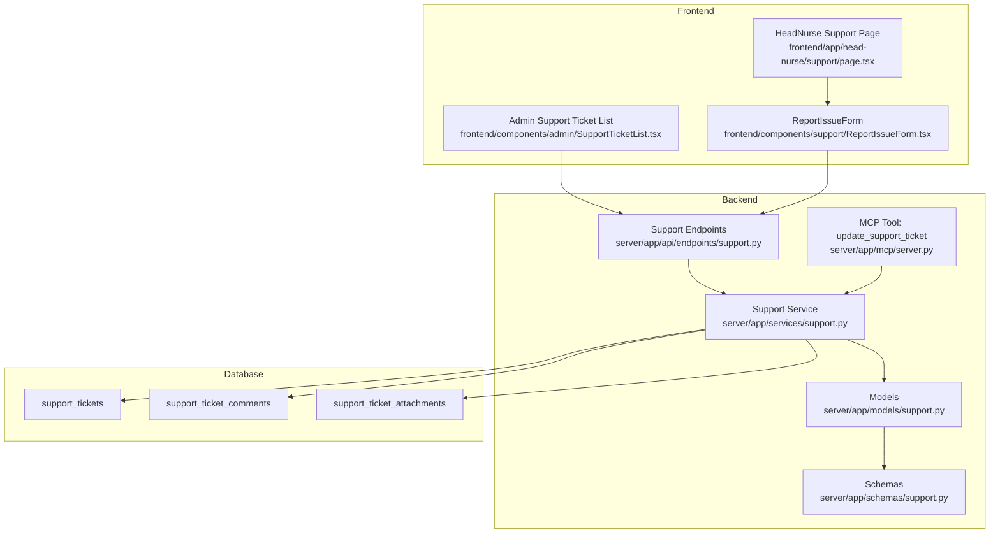
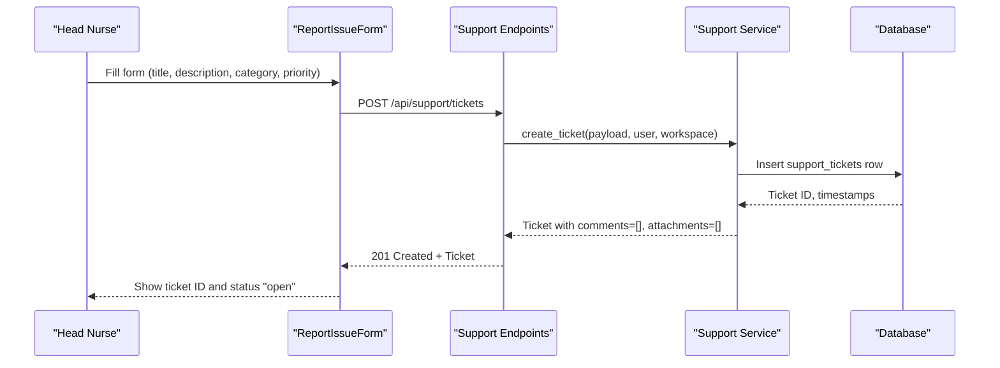
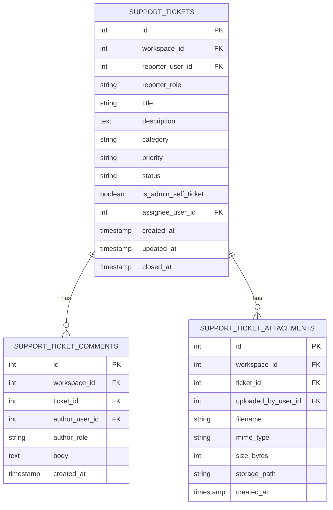
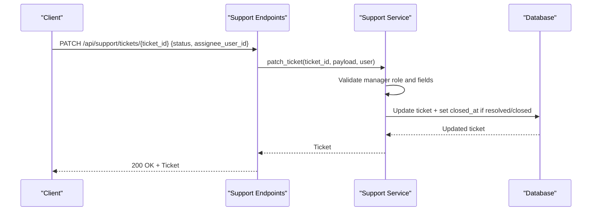
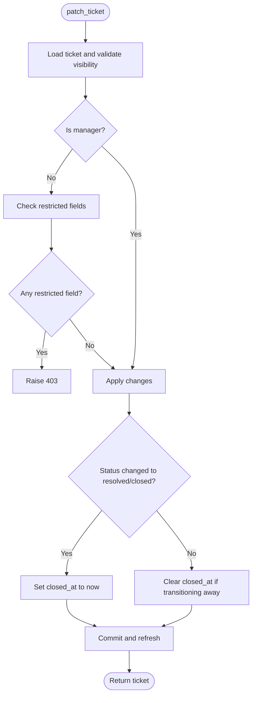
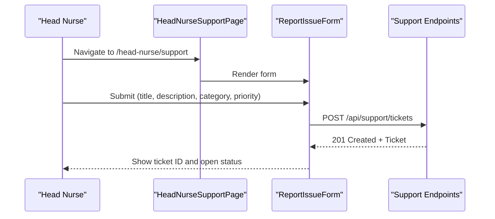
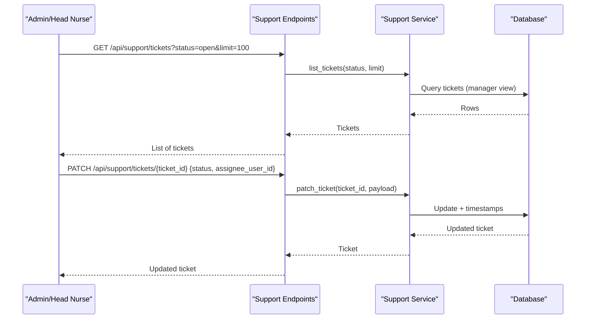
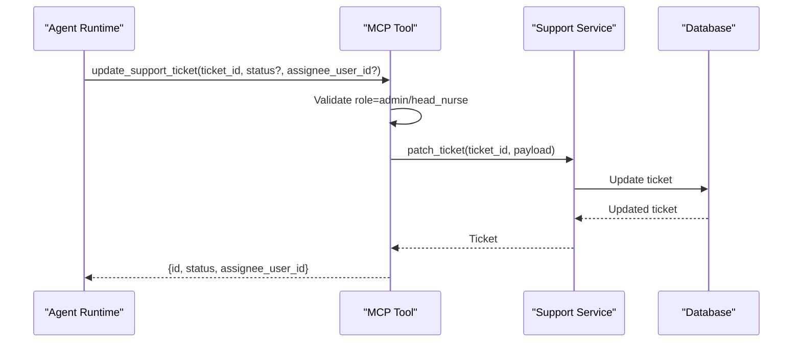
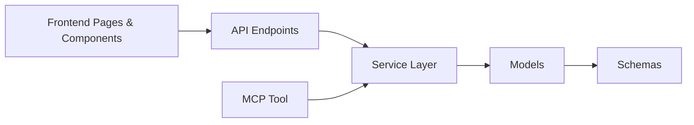

# Support Resources

<cite>
**Referenced Files in This Document**
- [o9p0q1r2s3t4_add_support_ticket_domain.py](file://server/alembic/versions/o9p0q1r2s3t4_add_support_ticket_domain.py)
- [support.py](file://server/app/models/support.py)
- [support.py](file://server/app/schemas/support.py)
- [support.py](file://server/app/api/endpoints/support.py)
- [support.py](file://server/app/services/support.py)
- [server.py](file://server/app/mcp/server.py)
- [page.tsx](file://frontend/app/head-nurse/support/page.tsx)
- [ReportIssueForm.tsx](file://frontend/components/support/ReportIssueForm.tsx)
- [SupportTicketList.tsx](file://frontend/components/admin/SupportTicketList.tsx)
</cite>

## Table of Contents
1. [Introduction](#introduction)
2. [Project Structure](#project-structure)
3. [Core Components](#core-components)
4. [Architecture Overview](#architecture-overview)
5. [Detailed Component Analysis](#detailed-component-analysis)
6. [Dependency Analysis](#dependency-analysis)
7. [Performance Considerations](#performance-considerations)
8. [Troubleshooting Guide](#troubleshooting-guide)
9. [Conclusion](#conclusion)
10. [Appendices](#appendices)

## Introduction
This document describes the Head Nurse Support Resources interface and the underlying support ticket system. It explains how users can report issues, request assistance, and track support requests. It also documents categorization, priority levels, escalation procedures, integration with support workflows and ticket management systems, response tracking, self-service resources, knowledge base integration, FAQ systems, support analytics, response time tracking, and satisfaction metrics. The documentation includes examples of support workflows, escalation procedures, and integrations with external support systems.

## Project Structure
The support system spans frontend pages and components, backend API endpoints, service layer, and database models. The frontend exposes role-specific support pages and a shared issue reporting form. The backend defines the support domain, validates requests, persists data, and exposes REST endpoints. An MCP tool integrates administrative updates into agent workflows.

**Diagram sources**
- [page.tsx:1-5](file://frontend/app/head-nurse/support/page.tsx#L1-L5)
- [ReportIssueForm.tsx](file://frontend/components/support/ReportIssueForm.tsx)
- [SupportTicketList.tsx](file://frontend/components/admin/SupportTicketList.tsx)
- [support.py:1-170](file://server/app/api/endpoints/support.py#L1-L170)
- [support.py:1-292](file://server/app/services/support.py#L1-L292)
- [support.py:1-98](file://server/app/models/support.py#L1-L98)
- [support.py:1-76](file://server/app/schemas/support.py#L1-L76)
- [server.py:2187-2199](file://server/app/mcp/server.py#L2187-L2199)

**Section sources**
- [page.tsx:1-5](file://frontend/app/head-nurse/support/page.tsx#L1-L5)
- [support.py:1-170](file://server/app/api/endpoints/support.py#L1-L170)
- [support.py:1-292](file://server/app/services/support.py#L1-L292)
- [support.py:1-98](file://server/app/models/support.py#L1-L98)
- [support.py:1-76](file://server/app/schemas/support.py#L1-L76)
- [server.py:2187-2199](file://server/app/mcp/server.py#L2187-L2199)

## Core Components
- Support ticket domain: tickets, comments, and attachments with workspace scoping and role-based visibility.
- REST endpoints for listing, creating, retrieving, updating tickets, adding comments, and uploading attachments.
- Service layer enforcing role-based access, workflow restrictions, and storage policies.
- Frontend pages and components for Head Nurse self-service reporting and administrative oversight.
- MCP tool enabling authorized agents to update ticket status or assignees.

Key capabilities:
- Issue reporting form with title, description, category, and priority.
- Visibility and workflow controls: reporters can view own tickets; admins/head nurses manage workflow fields.
- Attachment upload with size limits and secure storage paths.
- Commenting to track responses and collaboration.
- Administrative ticket list for oversight.

**Section sources**
- [support.py:10-98](file://server/app/models/support.py#L10-L98)
- [support.py:10-76](file://server/app/schemas/support.py#L10-L76)
- [support.py:62-170](file://server/app/api/endpoints/support.py#L62-L170)
- [support.py:124-292](file://server/app/services/support.py#L124-L292)
- [page.tsx:1-5](file://frontend/app/head-nurse/support/page.tsx#L1-L5)
- [ReportIssueForm.tsx](file://frontend/components/support/ReportIssueForm.tsx)
- [SupportTicketList.tsx](file://frontend/components/admin/SupportTicketList.tsx)
- [server.py:2187-2199](file://server/app/mcp/server.py#L2187-L2199)

## Architecture Overview
The system follows a layered architecture:
- Presentation: Role-specific pages and shared form component.
- API: FastAPI endpoints validating inputs and orchestrating service operations.
- Service: Business logic for access control, workflow updates, storage, and persistence.
- Persistence: SQLAlchemy models mapped to database tables with indices and foreign keys.
- Integration: MCP tool for agent-driven updates.

**Diagram sources**
- [support.py:89-98](file://server/app/api/endpoints/support.py#L89-L98)
- [support.py:154-177](file://server/app/services/support.py#L154-L177)
- [support.py:10-42](file://server/app/models/support.py#L10-L42)

**Section sources**
- [support.py:89-98](file://server/app/api/endpoints/support.py#L89-L98)
- [support.py:154-177](file://server/app/services/support.py#L154-L177)
- [support.py:10-42](file://server/app/models/support.py#L10-L42)

## Detailed Component Analysis

### Support Domain Models
The domain consists of three tables:
- support_tickets: core ticket metadata, ownership, and lifecycle.
- support_ticket_comments: threaded conversations per ticket.
- support_ticket_attachments: file uploads with metadata and storage path.

**Diagram sources**
- [o9p0q1r2s3t4_add_support_ticket_domain.py:20-145](file://server/alembic/versions/o9p0q1r2s3t4_add_support_ticket_domain.py#L20-L145)
- [support.py:10-98](file://server/app/models/support.py#L10-L98)

**Section sources**
- [o9p0q1r2s3t4_add_support_ticket_domain.py:20-145](file://server/alembic/versions/o9p0q1r2s3t4_add_support_ticket_domain.py#L20-L145)
- [support.py:10-98](file://server/app/models/support.py#L10-L98)

### API Endpoints and Request/Response Contracts
Endpoints expose:
- GET /api/support/tickets: list tickets with optional filters and pagination.
- POST /api/support/tickets: create a new ticket.
- GET /api/support/tickets/{ticket_id}: retrieve a single ticket with comments and attachments.
- PATCH /api/support/tickets/{ticket_id}: update ticket fields (restricted for non-managers).
- POST /api/support/tickets/{ticket_id}/comments: add a comment.
- POST /api/support/tickets/{ticket_id}/attachments: upload an attachment.
- GET /api/support/tickets/{ticket_id}/attachments/{attachment_id}/content: download an attachment.

Validation and constraints:
- Pydantic schemas define allowed categories, priorities, statuses, and lengths.
- Access control ensures only reporters or managers can access tickets.
- Managers can update workflow fields (status, assignee); reporters cannot.

**Diagram sources**
- [support.py:111-122](file://server/app/api/endpoints/support.py#L111-L122)
- [support.py:179-206](file://server/app/services/support.py#L179-L206)

**Section sources**
- [support.py:62-170](file://server/app/api/endpoints/support.py#L62-L170)
- [support.py:10-76](file://server/app/schemas/support.py#L10-L76)
- [support.py:179-206](file://server/app/services/support.py#L179-L206)

### Service Layer and Access Control
The service enforces:
- Manager roles: admin and head_nurse can update workflow fields and view all tickets.
- Reporter visibility: non-managers can only view tickets they reported.
- Restricted fields: status and assignee_user_id are protected.
- Attachment policies: size limit, safe filenames, and secure storage paths.
- Timestamp updates: comments and attachments refresh updated_at on change.

**Diagram sources**
- [support.py:179-206](file://server/app/services/support.py#L179-L206)

**Section sources**
- [support.py:124-292](file://server/app/services/support.py#L124-L292)

### Frontend: Head Nurse Support Reporting
The Head Nurse support page renders the shared ReportIssueForm component, enabling users to submit tickets with title, description, category, and priority. The form posts to the backend via the tickets endpoint.

**Diagram sources**
- [page.tsx:1-5](file://frontend/app/head-nurse/support/page.tsx#L1-L5)
- [ReportIssueForm.tsx](file://frontend/components/support/ReportIssueForm.tsx)
- [support.py:89-98](file://server/app/api/endpoints/support.py#L89-L98)

**Section sources**
- [page.tsx:1-5](file://frontend/app/head-nurse/support/page.tsx#L1-L5)
- [ReportIssueForm.tsx](file://frontend/components/support/ReportIssueForm.tsx)
- [support.py:89-98](file://server/app/api/endpoints/support.py#L89-L98)

### Administrative Oversight and Ticket Management
Administrators and Head Nurses can manage tickets through:
- Listing tickets filtered by status and paginated.
- Updating workflow fields (status, assignee) via the PATCH endpoint.
- Viewing and downloading attachments and reading comments.

**Diagram sources**
- [support.py:62-86](file://server/app/api/endpoints/support.py#L62-L86)
- [support.py:111-122](file://server/app/api/endpoints/support.py#L111-L122)
- [support.py:126-140](file://server/app/services/support.py#L126-L140)
- [support.py:179-206](file://server/app/services/support.py#L179-L206)

**Section sources**
- [support.py:62-122](file://server/app/api/endpoints/support.py#L62-L122)
- [support.py:126-206](file://server/app/services/support.py#L126-L206)

### Integration with Agent Workflows (MCP)
The MCP tool allows authorized agents to update tickets programmatically:
- Name: update_support_ticket
- Description: Update a support ticket status or assign it. Admin / Head Nurse only.
- Inputs: ticket_id, status (optional), assignee_user_id (optional).
- Behavior: Validates actor role, constructs a patch payload, and calls the service.

**Diagram sources**
- [server.py:2187-2199](file://server/app/mcp/server.py#L2187-L2199)
- [support.py:179-206](file://server/app/services/support.py#L179-L206)

**Section sources**
- [server.py:2187-2199](file://server/app/mcp/server.py#L2187-L2199)
- [support.py:179-206](file://server/app/services/support.py#L179-L206)

## Dependency Analysis
The support system exhibits clear separation of concerns:
- Models define persistence contracts.
- Schemas define validation contracts.
- Endpoints depend on services for orchestration.
- Services depend on models and enforce business rules.
- Frontend depends on API contracts.
- MCP tool depends on service layer.

**Diagram sources**
- [support.py:1-170](file://server/app/api/endpoints/support.py#L1-L170)
- [support.py:1-292](file://server/app/services/support.py#L1-L292)
- [support.py:1-98](file://server/app/models/support.py#L1-L98)
- [support.py:1-76](file://server/app/schemas/support.py#L1-L76)
- [server.py:2187-2199](file://server/app/mcp/server.py#L2187-L2199)

**Section sources**
- [support.py:1-170](file://server/app/api/endpoints/support.py#L1-L170)
- [support.py:1-292](file://server/app/services/support.py#L1-L292)
- [support.py:1-98](file://server/app/models/support.py#L1-L98)
- [support.py:1-76](file://server/app/schemas/support.py#L1-L76)
- [server.py:2187-2199](file://server/app/mcp/server.py#L2187-L2199)

## Performance Considerations
- Pagination and filtering: The list endpoint supports status filtering and a configurable limit to control payload sizes.
- Indexes: Database tables include indexes on workspace_id, reporter_user_id, assignee_user_id, and created_at to optimize queries.
- Attachment storage: Secure, isolated directories per workspace and ticket; file URLs are generated client-side for downloads.
- Concurrency: Asynchronous session usage in endpoints and services supports concurrent operations.

[No sources needed since this section provides general guidance]

## Troubleshooting Guide
Common issues and resolutions:
- Ticket not found: Ensure the ticket_id exists in the current workspace and the user has permission to access it.
- Access denied: Non-managers cannot update workflow fields; only admin/head_nurse can modify status and assignee.
- Attachment errors: Verify file size does not exceed the limit and the file is not empty; check storage path existence.
- Download failure: Confirm the attachment exists and the file path is valid.

**Section sources**
- [support.py:53-80](file://server/app/services/support.py#L53-L80)
- [support.py:245-246](file://server/app/services/support.py#L245-L246)
- [support.py:157-169](file://server/app/api/endpoints/support.py#L157-L169)

## Conclusion
The Head Nurse Support Resources interface provides a robust, role-aware support ticketing system with clear workflows for reporting, managing, and tracking support requests. The backend enforces access control and workflow restrictions, while the frontend offers a streamlined reporting experience. Integrations via MCP enable automated updates within agent workflows. The system’s design supports scalability, maintainability, and compliance with role-based governance.

[No sources needed since this section summarizes without analyzing specific files]

## Appendices

### Issue Reporting Form: Fields and Validation
- Title: Required, length constraints enforced by schema.
- Description: Optional with length constraints.
- Category: Defaults to a predefined value; validated against allowed values.
- Priority: Enumerated values with strict pattern validation.
- Reporter role and workspace: Automatically derived from the authenticated user and current workspace.

**Section sources**
- [support.py:10-16](file://server/app/schemas/support.py#L10-L16)

### Escalation Procedures
Escalation pathways:
- Internal escalation: Assign ticket to a higher authority or specialized team via assignee updates.
- Status transitions: Move tickets from open to in_progress to resolved/closed; closed_at timestamp captures resolution time.
- Manager visibility: Admin/head_nurse can view and act on any ticket within the workspace.

**Section sources**
- [support.py:18-25](file://server/app/schemas/support.py#L18-L25)
- [support.py:199-202](file://server/app/services/support.py#L199-L202)

### Self-Service Resources, Knowledge Base, and FAQ
- Self-service: Users can view their tickets, add comments, and upload attachments.
- Knowledge base integration: Not implemented in the referenced code; future enhancements could surface KB articles within comments or as external links.
- FAQ systems: Not implemented in the referenced code; future enhancements could integrate FAQ content into the UI.

[No sources needed since this section provides general guidance]

### Support Analytics, Response Time Tracking, and Satisfaction Metrics
- Analytics: The system tracks created_at, updated_at, and closed_at timestamps for each ticket, enabling basic SLA and throughput calculations.
- Response time: Can be computed as time-to-first-comment or time-to-resolution using timestamps.
- Satisfaction: Not implemented in the referenced code; future enhancements could include surveys or feedback collection integrated into the UI.

[No sources needed since this section provides general guidance]