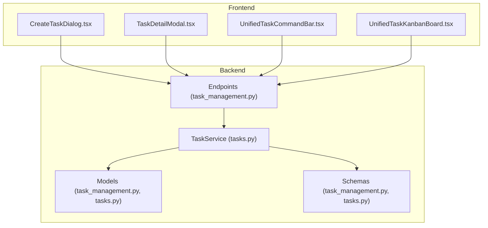
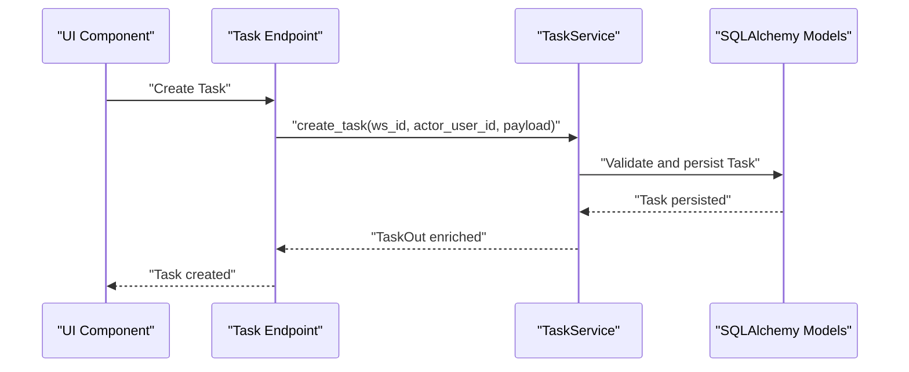
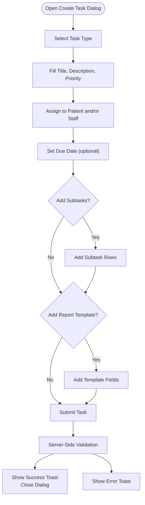
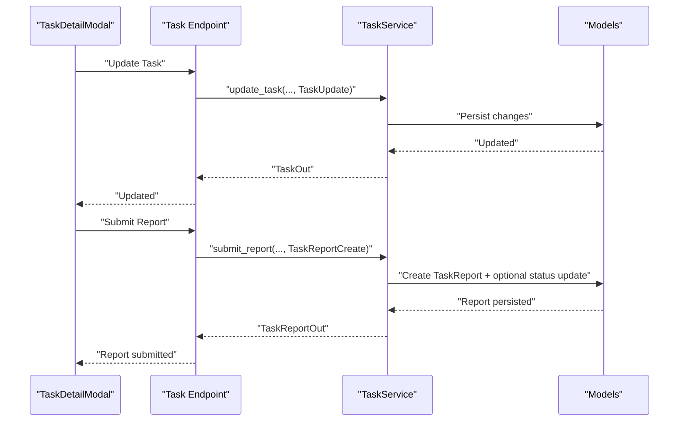
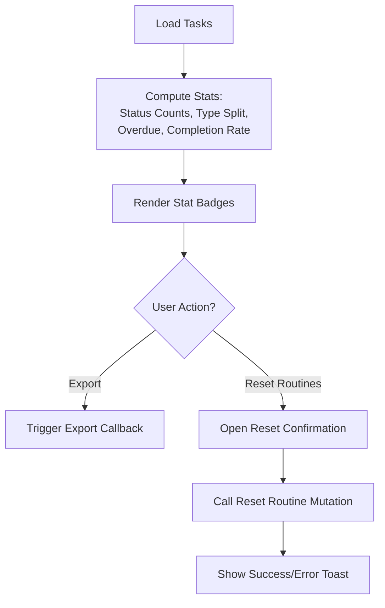
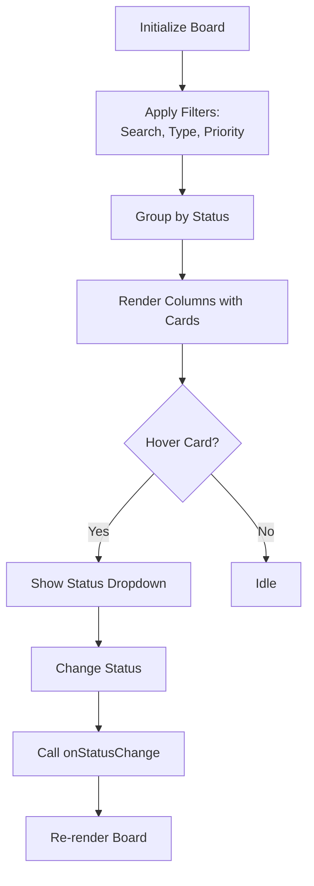
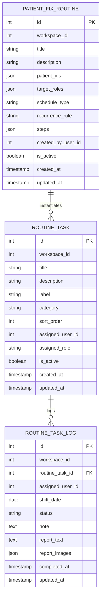
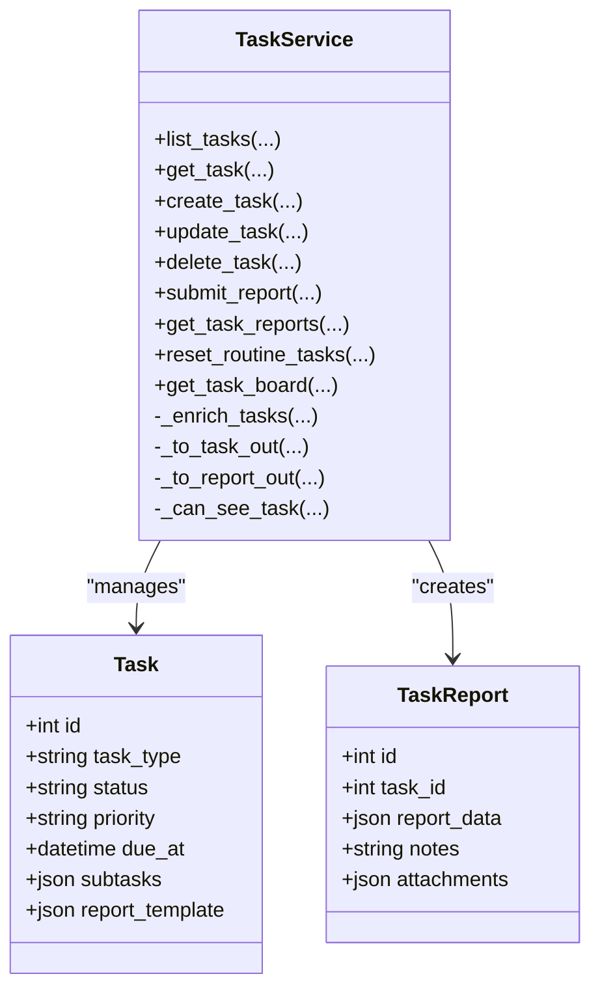
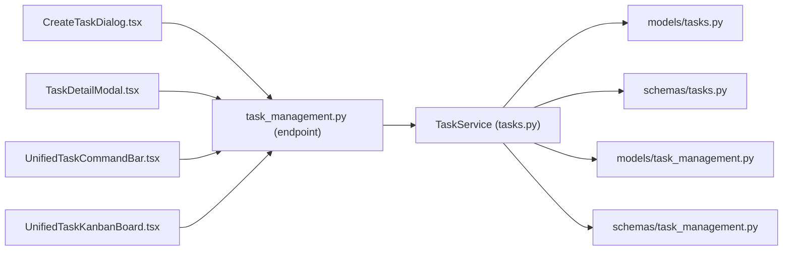

# Task Management

<cite>
**Referenced Files in This Document**
- [CreateTaskDialog.tsx](file://frontend/components/head-nurse/tasks/CreateTaskDialog.tsx)
- [TaskDetailModal.tsx](file://frontend/components/head-nurse/tasks/TaskDetailModal.tsx)
- [UnifiedTaskCommandBar.tsx](file://frontend/components/head-nurse/tasks/UnifiedTaskCommandBar.tsx)
- [UnifiedTaskKanbanBoard.tsx](file://frontend/components/head-nurse/tasks/UnifiedTaskKanbanBoard.tsx)
- [task_management.py](file://server/app/models/task_management.py)
- [task_management.py](file://server/app/schemas/task_management.py)
- [tasks.py](file://server/app/services/tasks.py)
- [task_management.py](file://server/app/models/tasks.py)
- [task_management.py](file://server/app/schemas/tasks.py)
- [task_management.py](file://server/app/api/endpoints/task_management.py)
</cite>

## Table of Contents
1. [Introduction](#introduction)
2. [Project Structure](#project-structure)
3. [Core Components](#core-components)
4. [Architecture Overview](#architecture-overview)
5. [Detailed Component Analysis](#detailed-component-analysis)
6. [Dependency Analysis](#dependency-analysis)
7. [Performance Considerations](#performance-considerations)
8. [Troubleshooting Guide](#troubleshooting-guide)
9. [Conclusion](#conclusion)
10. [Appendices](#appendices)

## Introduction
This document describes the Head Nurse Task Management system, focusing on the workflow task management interface, patient routine management, role-specific task queues, automated care scheduling, and the task command bar. It explains how tasks are created, assigned, tracked, and completed; how routine care is scheduled and reset; and how the kanban board supports visual workflow management and prioritization. It also outlines integration points with care directives and patient monitoring timelines.

## Project Structure
The task management system spans frontend React components and backend Python services:
- Frontend components under the Head Nurse shell provide task creation, viewing, filtering, and kanban visualization.
- Backend services implement task lifecycle operations, reporting, and routine task management.
- Database models define persistent entities for tasks, reports, and routine templates/logs.

**Diagram sources**
- [CreateTaskDialog.tsx:1-472](file://frontend/components/head-nurse/tasks/CreateTaskDialog.tsx#L1-L472)
- [TaskDetailModal.tsx:1-1053](file://frontend/components/head-nurse/tasks/TaskDetailModal.tsx#L1-L1053)
- [UnifiedTaskCommandBar.tsx:1-334](file://frontend/components/head-nurse/tasks/UnifiedTaskCommandBar.tsx#L1-L334)
- [UnifiedTaskKanbanBoard.tsx:1-557](file://frontend/components/head-nurse/tasks/UnifiedTaskKanbanBoard.tsx#L1-L557)
- [tasks.py:1-690](file://server/app/services/tasks.py#L1-L690)
- [task_management.py:1-129](file://server/app/models/task_management.py#L1-L129)
- [task_management.py:1-166](file://server/app/schemas/task_management.py#L1-L166)
- [task_management.py](file://server/app/api/endpoints/task_management.py)

**Section sources**
- [CreateTaskDialog.tsx:1-472](file://frontend/components/head-nurse/tasks/CreateTaskDialog.tsx#L1-L472)
- [TaskDetailModal.tsx:1-1053](file://frontend/components/head-nurse/tasks/TaskDetailModal.tsx#L1-L1053)
- [UnifiedTaskCommandBar.tsx:1-334](file://frontend/components/head-nurse/tasks/UnifiedTaskCommandBar.tsx#L1-L334)
- [UnifiedTaskKanbanBoard.tsx:1-557](file://frontend/components/head-nurse/tasks/UnifiedTaskKanbanBoard.tsx#L1-L557)
- [tasks.py:1-690](file://server/app/services/tasks.py#L1-L690)
- [task_management.py:1-129](file://server/app/models/task_management.py#L1-L129)
- [task_management.py:1-166](file://server/app/schemas/task_management.py#L1-L166)

## Core Components
- Task creation dialog with validation, subtasks, and configurable report templates.
- Task detail modal supporting updates, subtask toggles, and report submission.
- Unified command bar aggregating task metrics and actions (export, reset routines).
- Kanban board for drag-and-drop status updates, filtering, and overdue highlighting.
- Backend services implementing task CRUD, reporting, routine reset, and board aggregation.

**Section sources**
- [CreateTaskDialog.tsx:32-137](file://frontend/components/head-nurse/tasks/CreateTaskDialog.tsx#L32-L137)
- [TaskDetailModal.tsx:185-338](file://frontend/components/head-nurse/tasks/TaskDetailModal.tsx#L185-L338)
- [UnifiedTaskCommandBar.tsx:74-129](file://frontend/components/head-nurse/tasks/UnifiedTaskCommandBar.tsx#L74-L129)
- [UnifiedTaskKanbanBoard.tsx:300-554](file://frontend/components/head-nurse/tasks/UnifiedTaskKanbanBoard.tsx#L300-L554)
- [tasks.py:123-294](file://server/app/services/tasks.py#L123-L294)

## Architecture Overview
The system follows a layered architecture:
- UI layer: React components manage user interactions and present task data.
- Service layer: TaskService orchestrates business logic, enforces permissions, and coordinates persistence.
- Persistence layer: SQLAlchemy models and Pydantic schemas define data contracts and storage.

**Diagram sources**
- [tasks.py:123-207](file://server/app/services/tasks.py#L123-L207)
- [task_management.py](file://server/app/api/endpoints/task_management.py)

## Detailed Component Analysis

### Task Creation Dialog
- Purpose: Create specific or routine tasks with optional subtasks and report templates.
- Features:
  - Form validation via Zod schema.
  - Dynamic subtasks and report template fields.
  - Assignment to a patient and/or staff member.
  - Priority selection and due date.
- Integration: Submits to backend endpoint; success triggers toast and resets form.

**Diagram sources**
- [CreateTaskDialog.tsx:72-137](file://frontend/components/head-nurse/tasks/CreateTaskDialog.tsx#L72-L137)

**Section sources**
- [CreateTaskDialog.tsx:32-137](file://frontend/components/head-nurse/tasks/CreateTaskDialog.tsx#L32-L137)

### Task Detail Modal
- Purpose: View and edit task details, manage subtasks, and submit reports.
- Features:
  - Tabbed interface for Details, Subtasks, Reports.
  - Editable fields for title, description, priority, status, due date.
  - Subtask creation, toggling, and removal.
  - Structured report submission with dynamic schema derived from template.
  - Audit trail and timeline integration on report submission.
- Permissions: Editing and deletion restricted to head nurse/admin; execution allowed for assignees.

**Diagram sources**
- [TaskDetailModal.tsx:238-338](file://frontend/components/head-nurse/tasks/TaskDetailModal.tsx#L238-L338)
- [tasks.py:209-296](file://server/app/services/tasks.py#L209-L296)
- [tasks.py:296-396](file://server/app/services/tasks.py#L296-L396)

**Section sources**
- [TaskDetailModal.tsx:185-338](file://frontend/components/head-nurse/tasks/TaskDetailModal.tsx#L185-L338)
- [tasks.py:209-296](file://server/app/services/tasks.py#L209-L296)
- [tasks.py:296-396](file://server/app/services/tasks.py#L296-L396)

### Unified Task Command Bar
- Purpose: Provide at-a-glance metrics and actions for task management.
- Features:
  - Completion rate, counts per status, task type breakdown, overdue count, and report submissions.
  - Export action placeholder and reset routines action (head nurse/admin).
  - Responsive stat badges with color-coded emphasis.
- Data: Aggregated from current task list; recalculated on load.

**Diagram sources**
- [UnifiedTaskCommandBar.tsx:74-129](file://frontend/components/head-nurse/tasks/UnifiedTaskCommandBar.tsx#L74-L129)

**Section sources**
- [UnifiedTaskCommandBar.tsx:74-334](file://frontend/components/head-nurse/tasks/UnifiedTaskCommandBar.tsx#L74-L334)

### Unified Task Kanban Board
- Purpose: Visualize tasks across statuses with quick actions and filters.
- Features:
  - Columns: Pending, In Progress, Completed, Skipped.
  - Task cards show priority, type, patient/assignee, due date, subtask progress, and report count.
  - Hover quick status menu for authorized users.
  - Search, task type, and priority filters; clear filters.
  - Empty states and “Create Task” CTA for Pending column.
  - Overdue highlighting based on due date and status.
- Interactions: Click task to open detail; status dropdown to move tasks.

**Diagram sources**
- [UnifiedTaskKanbanBoard.tsx:300-554](file://frontend/components/head-nurse/tasks/UnifiedTaskKanbanBoard.tsx#L300-L554)

**Section sources**
- [UnifiedTaskKanbanBoard.tsx:40-242](file://frontend/components/head-nurse/tasks/UnifiedTaskKanbanBoard.tsx#L40-L242)
- [UnifiedTaskKanbanBoard.tsx:300-554](file://frontend/components/head-nurse/tasks/UnifiedTaskKanbanBoard.tsx#L300-L554)

### Routine Task Manager and Automated Scheduling
- Purpose: Manage daily routine templates, logs, and fixed-schedule routines for patients.
- Entities:
  - RoutineTask: Template for daily tasks with category, label, sort order, and assignment.
  - RoutineTaskLog: Per-shift completion records with status and reports.
  - PatientFixRoutine: Fixed schedule templates for groups of patients and roles.
- Operations:
  - Bulk reset of routine tasks for a shift date (head nurse/admin).
  - Daily board aggregation per user with completion metrics.

**Diagram sources**
- [task_management.py:22-129](file://server/app/models/task_management.py#L22-L129)

**Section sources**
- [task_management.py:22-129](file://server/app/models/task_management.py#L22-L129)
- [task_management.py:11-166](file://server/app/schemas/task_management.py#L11-L166)

### Backend Task Service and Endpoints
- Responsibilities:
  - List, get, create, update, delete tasks with visibility checks.
  - Submit structured reports with validation against template schema.
  - Aggregate task board per user with counts and percentages.
  - Reset routine tasks for a given shift date.
- Security:
  - Head nurse/admin can update/delete tasks and reset routines.
  - Visibility scoped by workspace and optionally by visible patients.

**Diagram sources**
- [tasks.py:44-689](file://server/app/services/tasks.py#L44-L689)
- [task_management.py](file://server/app/models/tasks.py)
- [task_management.py](file://server/app/schemas/tasks.py)

**Section sources**
- [tasks.py:44-689](file://server/app/services/tasks.py#L44-L689)

## Dependency Analysis
- Frontend components depend on:
  - Hooks for task mutations and queries.
  - UI primitives (Dialog, Tabs, Select, Badge, Button).
  - Translation utilities and toast notifications.
- Backend depends on:
  - SQLAlchemy ORM for persistence.
  - Pydantic for serialization and validation.
  - Audit trail and activity timeline services.
- Cross-cutting concerns:
  - Workspace scoping and RBAC enforcement.
  - Visibility constraints for patients and roles.

**Diagram sources**
- [CreateTaskDialog.tsx:1-472](file://frontend/components/head-nurse/tasks/CreateTaskDialog.tsx#L1-L472)
- [TaskDetailModal.tsx:1-1053](file://frontend/components/head-nurse/tasks/TaskDetailModal.tsx#L1-L1053)
- [UnifiedTaskCommandBar.tsx:1-334](file://frontend/components/head-nurse/tasks/UnifiedTaskCommandBar.tsx#L1-L334)
- [UnifiedTaskKanbanBoard.tsx:1-557](file://frontend/components/head-nurse/tasks/UnifiedTaskKanbanBoard.tsx#L1-L557)
- [task_management.py](file://server/app/api/endpoints/task_management.py)
- [tasks.py:1-690](file://server/app/services/tasks.py#L1-L690)
- [task_management.py](file://server/app/models/tasks.py)
- [task_management.py](file://server/app/schemas/tasks.py)
- [task_management.py](file://server/app/models/task_management.py)
- [task_management.py](file://server/app/schemas/task_management.py)

**Section sources**
- [tasks.py:1-690](file://server/app/services/tasks.py#L1-L690)

## Performance Considerations
- Filtering and grouping: Kanban board computes grouped tasks and overdue flags client-side; keep lists reasonably sized to avoid heavy re-renders.
- Enrichment: Backend enriches tasks with names and report counts; pagination or limits can be applied at the API level if needed.
- Audit logging: Frequent status changes and report submissions trigger audit events; batch operations should consider throttling UI updates.
- Images and attachments: Report images stored as JSON arrays; large payloads can increase response sizes; consider lazy-loading or CDN integration.

## Troubleshooting Guide
- Task creation fails:
  - Verify required fields and constraints (title length, priority enum).
  - Ensure selected patient and assignee belong to the workspace and are active.
- Report submission rejected:
  - Required fields missing or extra fields present according to template.
  - Only assigned user or head nurse/admin can submit reports.
- Reset routines not working:
  - Requires head nurse/admin role.
  - Target shift date defaults to current UTC date if not provided.
- Kanban status not updating:
  - Ensure user has permission to change status; verify onStatusChange handler wired correctly.
- Overdue highlighting incorrect:
  - Overdue applies only when due date exists, task is not completed/skipped, and past due.

**Section sources**
- [CreateTaskDialog.tsx:108-137](file://frontend/components/head-nurse/tasks/CreateTaskDialog.tsx#L108-L137)
- [TaskDetailModal.tsx:322-338](file://frontend/components/head-nurse/tasks/TaskDetailModal.tsx#L322-L338)
- [tasks.py:130-155](file://server/app/services/tasks.py#L130-L155)
- [tasks.py:296-396](file://server/app/services/tasks.py#L296-L396)
- [tasks.py:418-473](file://server/app/services/tasks.py#L418-L473)
- [UnifiedTaskKanbanBoard.tsx:370-376](file://frontend/components/head-nurse/tasks/UnifiedTaskKanbanBoard.tsx#L370-L376)

## Conclusion
The Head Nurse Task Management system integrates robust UI components with a secure, workspace-scoped backend service. It supports flexible task creation, granular reporting, visual kanban management, and automated routine scheduling. The design emphasizes role-based permissions, auditability, and extensibility for future integrations with care directives and monitoring systems.

## Appendices

### Example Workflows and Patterns
- Task creation and assignment:
  - Open Create Task dialog, select type, fill metadata, assign patient/staff, set due date, optionally add subtasks and report template, submit.
- Task execution and reporting:
  - Open Task Detail, mark subtasks complete, submit structured report using template schema, status updates to completed.
- Escalation and delegation:
  - Head nurse/admin can update task ownership and status; use status filters to identify bottlenecks.
- Routine reset:
  - Head nurse/admin triggers reset routines for a shift date; clears non-pending routine tasks.

[No sources needed since this section summarizes patterns without analyzing specific files]