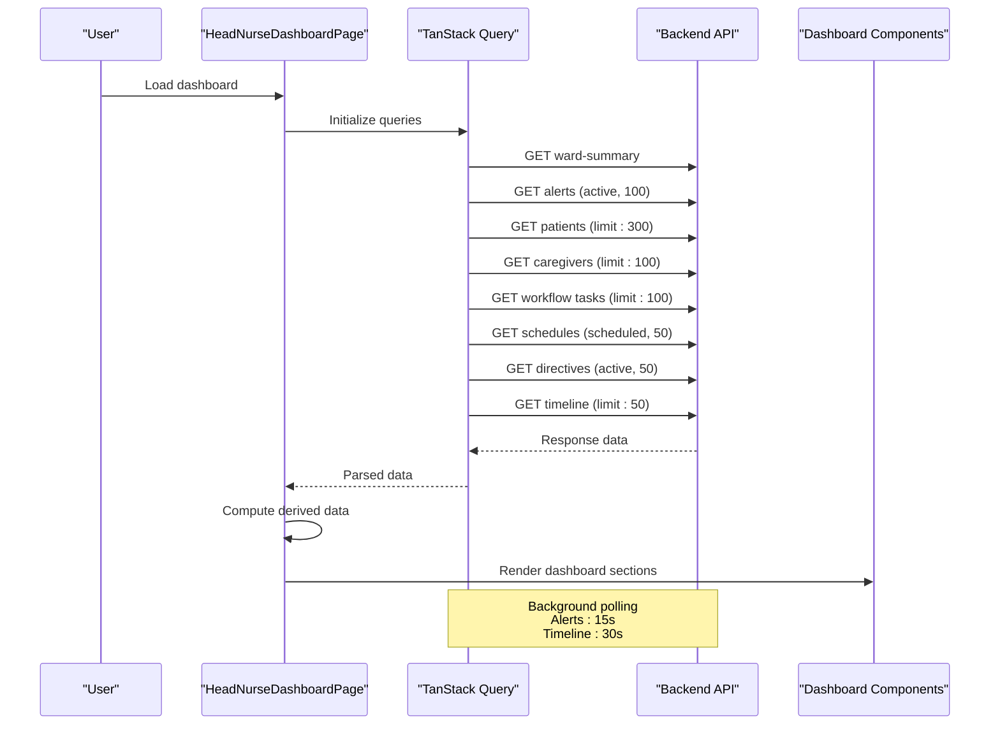
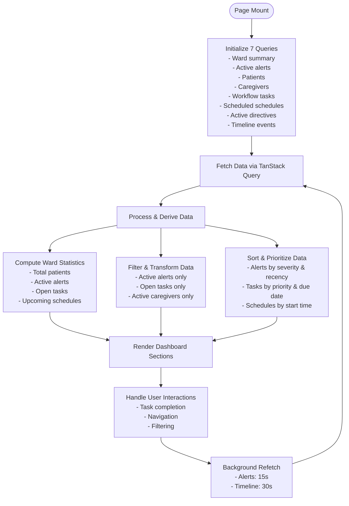
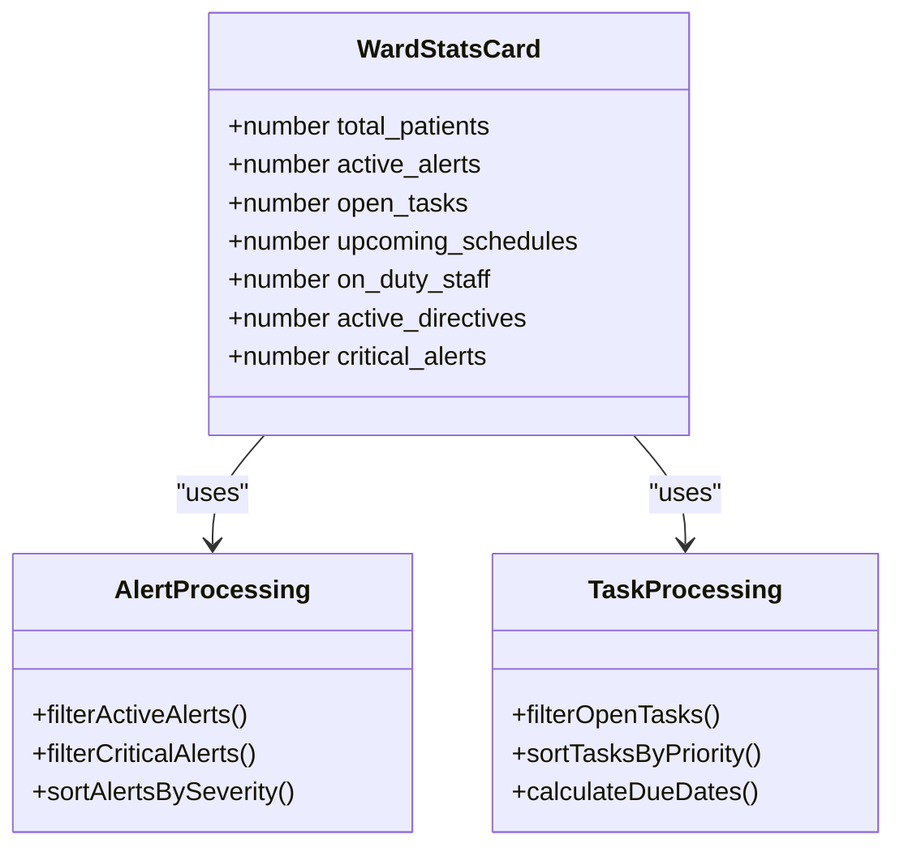
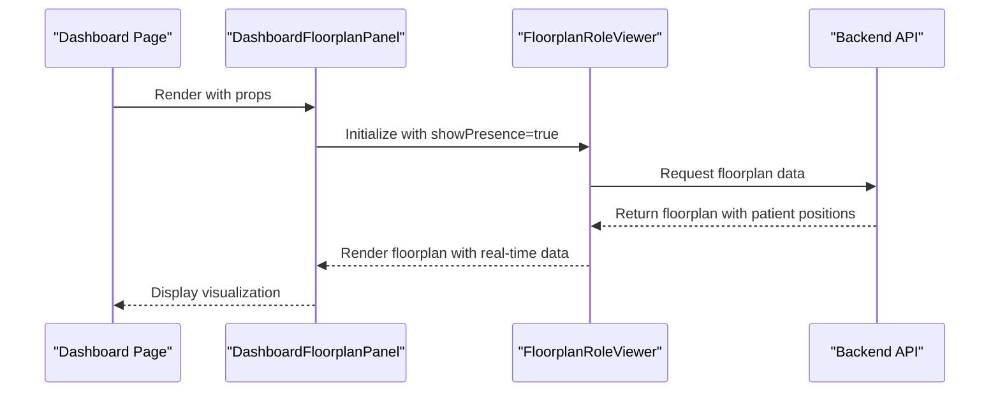
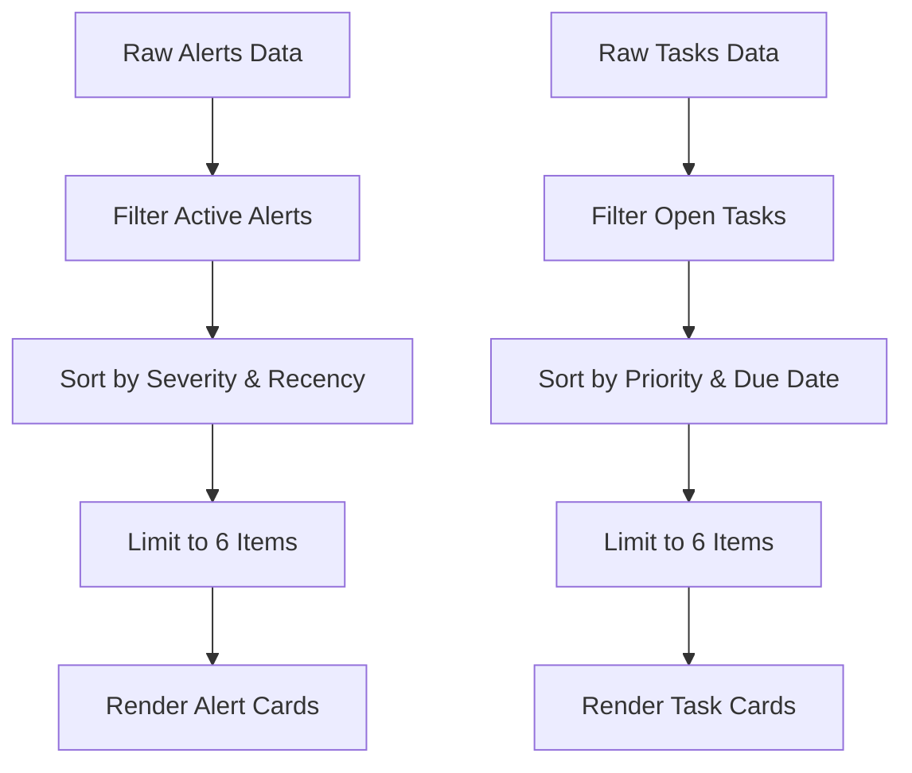
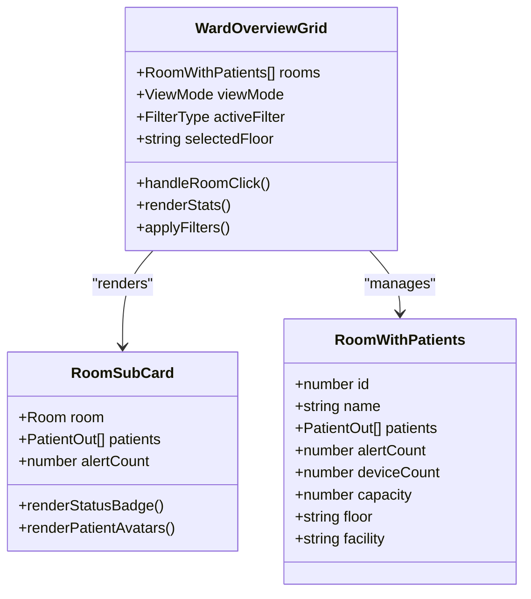
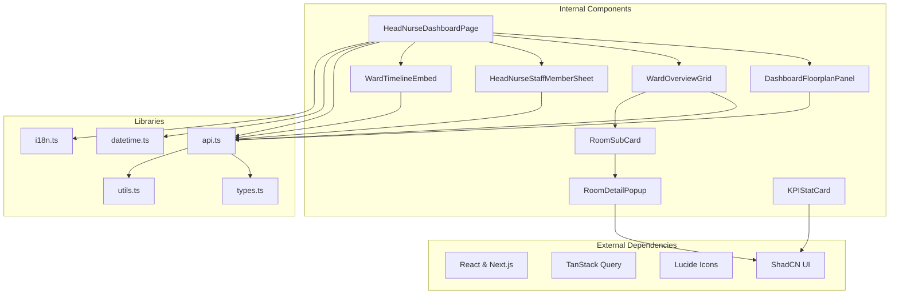

# Ward Overview Dashboard

<cite>
**Referenced Files in This Document**
- [HeadNurseDashboardPage](file://frontend/app/head-nurse/page.tsx)
- [DashboardFloorplanPanel](file://frontend/components/dashboard/DashboardFloorplanPanel.tsx)
- [WardOverviewGrid](file://frontend/components/dashboard/WardOverviewGrid.tsx)
- [RoomSubCard](file://frontend/components/dashboard/RoomSubCard.tsx)
- [RoomDetailPopup](file://frontend/components/dashboard/RoomDetailPopup.tsx)
- [KPIStatCard](file://frontend/components/dashboard/KPIStatCard.tsx)
- [HeadNurseStaffMemberSheet](file://frontend/components/head-nurse/HeadNurseStaffMemberSheet.tsx)
- [FloorplanRoleViewer](file://frontend/components/floorplan/FloorplanRoleViewer.tsx)
- [WardTimelineEmbed](file://frontend/components/timeline/WardTimelineEmbed.tsx)
- [api.ts](file://frontend/lib/api.ts)
- [types.ts](file://frontend/lib/types.ts)
</cite>

## Table of Contents
1. [Introduction](#introduction)
2. [Project Structure](#project-structure)
3. [Core Components](#core-components)
4. [Architecture Overview](#architecture-overview)
5. [Detailed Component Analysis](#detailed-component-analysis)
6. [Dependency Analysis](#dependency-analysis)
7. [Performance Considerations](#performance-considerations)
8. [Troubleshooting Guide](#troubleshooting-guide)
9. [Conclusion](#conclusion)

## Introduction
The Head Nurse Ward Overview Dashboard is a centralized operational interface designed to provide real-time visibility into ward operations. It aggregates key performance indicators, displays live patient locations and room occupancy, showcases on-duty staff, and presents priority alerts and workflow tasks. Built with React and Next.js, the dashboard leverages TanStack Query for data fetching and caching, and integrates with backend APIs for ward summaries, alerts, tasks, schedules, and timeline events.

## Project Structure
The dashboard is implemented as a Next.js page component that orchestrates multiple specialized UI components:
- Main dashboard page: coordinates data fetching, processing, and rendering of all dashboard sections
- Floorplan visualization: embedded floorplan viewer for real-time patient presence
- Ward overview grid: room-level occupancy and alert visualization
- Staff display: on-duty staff preview and quick access to full roster
- Priority alerts and tasks: critical incident and workflow task queues
- Timeline integration: recent events for situational awareness

```mermaid
graph TB
subgraph "Dashboard Page"
HNPage["HeadNurseDashboardPage<br/>Main orchestration"]
end
subgraph "Visualization Panels"
FloorPanel["DashboardFloorplanPanel<br/>Real-time floorplan"]
WardGrid["WardOverviewGrid<br/>Room occupancy grid"]
end
subgraph "Staff & Context"
StaffStrip["Staff Member Sheet<br/>On-duty preview"]
end
subgraph "Priority Workflows"
Alerts["Priority Alerts Grid"]
Tasks["Priority Tasks Grid"]
end
subgraph "Timeline"
Timeline["WardTimelineEmbed<br/>Recent events"]
end
subgraph "Backend Integration"
API["api.ts<br/>HTTP client"]
Types["types.ts<br/>Type definitions"]
end
HNPage --> FloorPanel
HNPage --> WardGrid
HNPage --> StaffStrip
HNPage --> Alerts
HNPage --> Tasks
HNPage --> Timeline
HNPage --> API
FloorPanel --> API
WardGrid --> API
StaffStrip --> API
Alerts --> API
Tasks --> API
Timeline --> API
API --> Types
```

**Diagram sources**
- [HeadNurseDashboardPage:58-595](file://frontend/app/head-nurse/page.tsx#L58-L595)
- [DashboardFloorplanPanel:1-30](file://frontend/components/dashboard/DashboardFloorplanPanel.tsx#L1-L30)
- [WardOverviewGrid:1-269](file://frontend/components/dashboard/WardOverviewGrid.tsx#L1-L269)
- [HeadNurseStaffMemberSheet](file://frontend/components/head-nurse/HeadNurseStaffMemberSheet.tsx)
- [WardTimelineEmbed](file://frontend/components/timeline/WardTimelineEmbed.tsx)
- [api.ts](file://frontend/lib/api.ts)
- [types.ts](file://frontend/lib/types.ts)

**Section sources**
- [HeadNurseDashboardPage:58-595](file://frontend/app/head-nurse/page.tsx#L58-L595)

## Core Components
The dashboard comprises several reusable components that handle specific aspects of the interface:

- KPIStatCard: Generic card component for displaying key metrics with optional trend indicators and status coloring
- RoomSubCard: Individual room tile showing occupancy status, patient count, and alert indicators
- RoomDetailPopup: Modal dialog providing detailed room information, patient lists, and device status
- WardOverviewGrid: Grid-based room overview with filtering, sorting, and view mode controls
- DashboardFloorplanPanel: Wrapper around the floorplan viewer for dashboard-specific configuration

**Section sources**
- [KPIStatCard:1-104](file://frontend/components/dashboard/KPIStatCard.tsx#L1-L104)
- [RoomSubCard:1-138](file://frontend/components/dashboard/RoomSubCard.tsx#L1-L138)
- [RoomDetailPopup:1-276](file://frontend/components/dashboard/RoomDetailPopup.tsx#L1-L276)
- [WardOverviewGrid:1-269](file://frontend/components/dashboard/WardOverviewGrid.tsx#L1-L269)
- [DashboardFloorplanPanel:1-30](file://frontend/components/dashboard/DashboardFloorplanPanel.tsx#L1-L30)

## Architecture Overview
The dashboard follows a reactive architecture pattern:
- Data fetching: TanStack Query manages API calls with automatic caching and refetching
- Data processing: React.memoized computations transform raw API responses into dashboard-ready structures
- Real-time updates: Background polling refreshes critical data at configured intervals
- Component composition: Specialized components render different aspects of the dashboard



**Diagram sources**
- [HeadNurseDashboardPage:64-104](file://frontend/app/head-nurse/page.tsx#L64-L104)

**Section sources**
- [HeadNurseDashboardPage:64-104](file://frontend/app/head-nurse/page.tsx#L64-L104)

## Detailed Component Analysis

### Main Dashboard Page
The central dashboard orchestrates all data flows and renders the complete interface. It manages multiple concurrent queries with different refresh intervals and processes the data through computed derivations.

Key responsibilities:
- Coordinating 7 simultaneous data queries for comprehensive ward visibility
- Implementing real-time refresh mechanisms for critical data streams
- Transforming raw API responses into dashboard-specific data structures
- Managing local state for interactive elements like task completion



**Diagram sources**
- [HeadNurseDashboardPage:107-214](file://frontend/app/head-nurse/page.tsx#L107-L214)

**Section sources**
- [HeadNurseDashboardPage:58-595](file://frontend/app/head-nurse/page.tsx#L58-L595)

### Dashboard Cards Implementation
The dashboard features four primary KPI cards that display ward statistics:

#### Total Patients Card
Displays current patient count with staff on-duty indicator. Uses the ward summary endpoint when available, falls back to patient list length otherwise.

#### Active Alerts Card
Shows total active alerts with prominent highlighting for critical alerts. Implements severity-based prioritization with color-coded badges.

#### Open Tasks Card
Displays pending and in-progress workflow tasks with active directive count. Integrates with task completion mutations.

#### Upcoming Schedules Card
Shows scheduled activities for the next 24 hours with time-based filtering and sorting.



**Diagram sources**
- [HeadNurseDashboardPage:139-205](file://frontend/app/head-nurse/page.tsx#L139-L205)

**Section sources**
- [HeadNurseDashboardPage:264-340](file://frontend/app/head-nurse/page.tsx#L264-L340)

### Floorplan Visualization Panel
The floorplan panel provides real-time patient location and room occupancy visualization through an integrated floorplan viewer.

Implementation highlights:
- Wraps FloorplanRoleViewer with dashboard-specific props
- Supports presence indicators for current patient locations
- Allows navigation to specific facilities, floors, or rooms
- Maintains consistent styling with dashboard design system



**Diagram sources**
- [DashboardFloorplanPanel:13-28](file://frontend/components/dashboard/DashboardFloorplanPanel.tsx#L13-L28)
- [FloorplanRoleViewer](file://frontend/components/floorplan/FloorplanRoleViewer.tsx)

**Section sources**
- [DashboardFloorplanPanel:1-30](file://frontend/components/dashboard/DashboardFloorplanPanel.tsx#L1-L30)

### Staff On-Duty Display
The staff display component provides a compact view of currently on-duty personnel with role-based identification and quick access to the full staff roster.

Features:
- Role-based staff strips with initials badges
- Active status indicators
- Quick navigation to full staff management
- Responsive layout with preview and full views

**Section sources**
- [HeadNurseDashboardPage:346-452](file://frontend/app/head-nurse/page.tsx#L346-L452)

### Priority Alerts and Tasks Grid
The priority alerts and tasks sections present critical incidents and workflow items requiring immediate attention.

#### Priority Alerts Grid
- Severity-based sorting (critical → warning → low)
- Timestamp-based secondary sorting for recency
- Patient association with contextual links
- Color-coded severity indicators

#### Priority Tasks Grid
- Priority-based sorting (critical → high → normal → low)
- Due date prioritization for time-sensitive tasks
- Task completion workflow with optimistic updates
- Patient context and due date information



**Diagram sources**
- [HeadNurseDashboardPage:177-205](file://frontend/app/head-nurse/page.tsx#L177-L205)

**Section sources**
- [HeadNurseDashboardPage:454-591](file://frontend/app/head-nurse/page.tsx#L454-L591)

### Ward Overview Grid
The Ward Overview Grid provides a comprehensive room-level view with filtering, sorting, and occupancy visualization capabilities.

Key features:
- Multi-level filtering (floor, occupancy status)
- Dual view modes (grid and compact layouts)
- Real-time occupancy calculations
- Interactive room selection with detailed popups



**Diagram sources**
- [WardOverviewGrid:37-91](file://frontend/components/dashboard/WardOverviewGrid.tsx#L37-L91)
- [RoomSubCard:22-58](file://frontend/components/dashboard/RoomSubCard.tsx#L22-L58)

**Section sources**
- [WardOverviewGrid:1-269](file://frontend/components/dashboard/WardOverviewGrid.tsx#L1-L269)

### Room Detail Popup
The Room Detail Popup provides comprehensive information about selected rooms, including patient lists, device status, and quick action buttons.

Capabilities:
- Detailed patient listings with navigation
- Device status monitoring (online/offline)
- Quick actions for monitoring and alert viewing
- Responsive modal design with scrollable content

**Section sources**
- [RoomDetailPopup:1-276](file://frontend/components/dashboard/RoomDetailPopup.tsx#L1-L276)

## Dependency Analysis
The dashboard exhibits clear separation of concerns with well-defined dependencies:



**Diagram sources**
- [HeadNurseDashboardPage:1-50](file://frontend/app/head-nurse/page.tsx#L1-L50)
- [DashboardFloorplanPanel:1-30](file://frontend/components/dashboard/DashboardFloorplanPanel.tsx#L1-L30)
- [WardOverviewGrid:1-30](file://frontend/components/dashboard/WardOverviewGrid.tsx#L1-L30)
- [RoomSubCard:1-30](file://frontend/components/dashboard/RoomSubCard.tsx#L1-L30)
- [RoomDetailPopup:1-30](file://frontend/components/dashboard/RoomDetailPopup.tsx#L1-L30)
- [KPIStatCard:1-35](file://frontend/components/dashboard/KPIStatCard.tsx#L1-L35)
- [api.ts](file://frontend/lib/api.ts)
- [types.ts](file://frontend/lib/types.ts)

**Section sources**
- [HeadNurseDashboardPage:1-50](file://frontend/app/head-nurse/page.tsx#L1-L50)
- [DashboardFloorplanPanel:1-30](file://frontend/components/dashboard/DashboardFloorplanPanel.tsx#L1-L30)
- [WardOverviewGrid:1-30](file://frontend/components/dashboard/WardOverviewGrid.tsx#L1-L30)

## Performance Considerations
The dashboard implements several performance optimization strategies:

- **Efficient Data Fetching**: TanStack Query handles caching, deduplication, and background refetching
- **Memoized Computations**: React.useMemo prevents unnecessary recalculations during re-renders
- **Selective Rendering**: Only visible data is processed and rendered
- **Optimized Sorting**: Custom comparison functions minimize computational overhead
- **Lazy Loading**: Components render progressively as data becomes available

Recommendations for further optimization:
- Implement virtual scrolling for large datasets
- Add debounced filtering for improved responsiveness
- Consider pagination for unlimited result sets
- Optimize image loading for patient and staff avatars

## Troubleshooting Guide
Common issues and solutions:

**Data Not Refreshing**
- Verify refetch intervals are properly configured
- Check network connectivity and API response times
- Monitor TanStack Query cache status

**Performance Issues**
- Review computed data complexity
- Ensure proper use of React.memo and useMemo
- Check for excessive re-renders in child components

**API Integration Problems**
- Validate API endpoint configurations
- Check authentication tokens and permissions
- Monitor error boundaries and fallback states

**Section sources**
- [HeadNurseDashboardPage:64-104](file://frontend/app/head-nurse/page.tsx#L64-L104)
- [api.ts](file://frontend/lib/api.ts)

## Conclusion
The Head Nurse Ward Overview Dashboard provides a comprehensive, real-time view of ward operations through a well-architected combination of visualization panels, interactive grids, and priority-focused workflows. Its modular design enables maintainability and extensibility while the reactive architecture ensures responsive user experiences. The dashboard successfully balances information density with usability, providing essential insights for effective ward management.