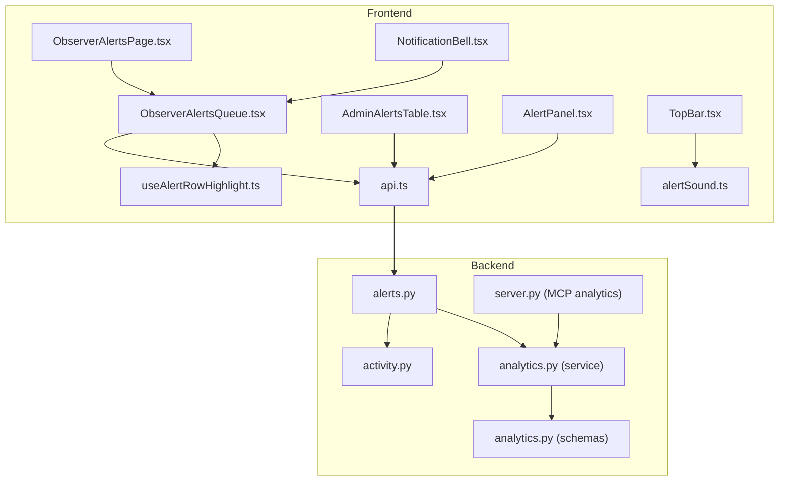
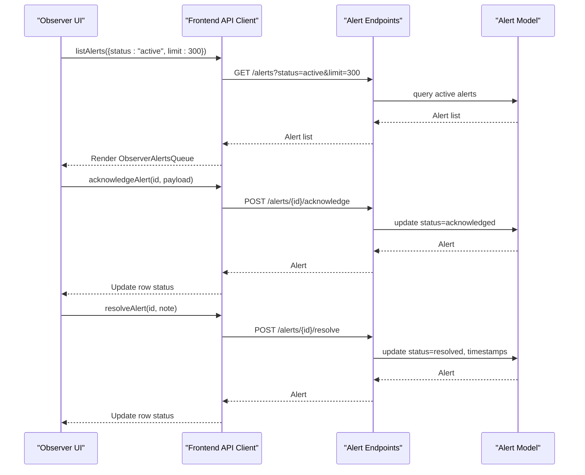
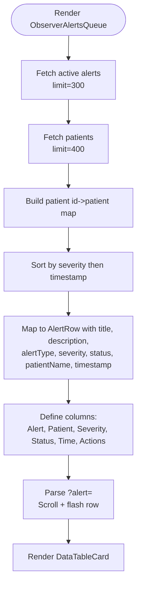
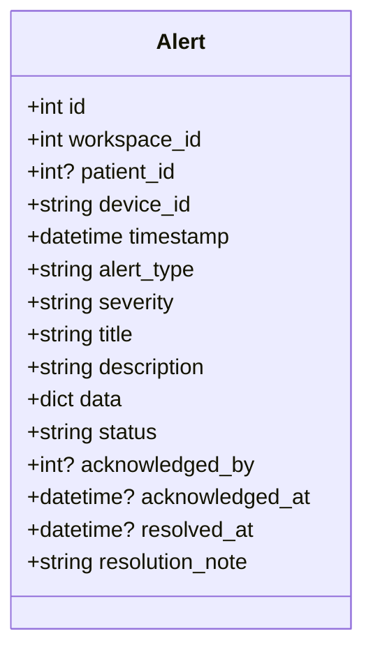
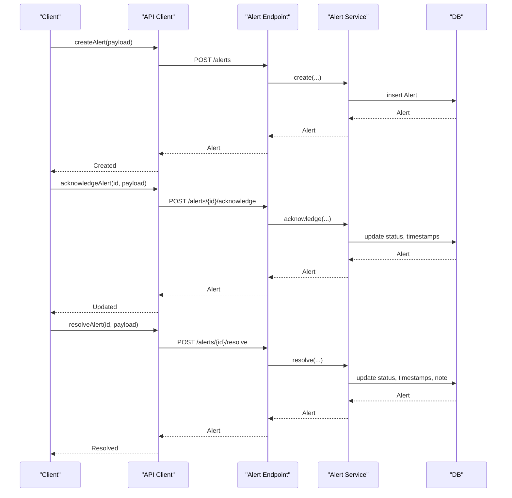
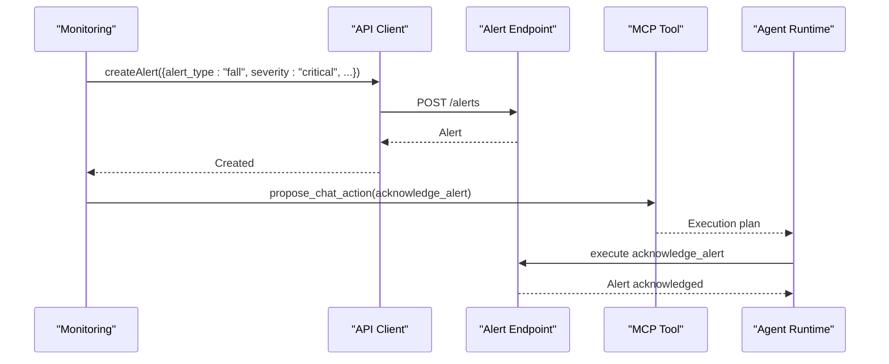
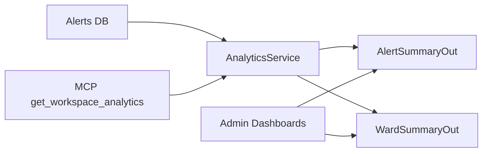
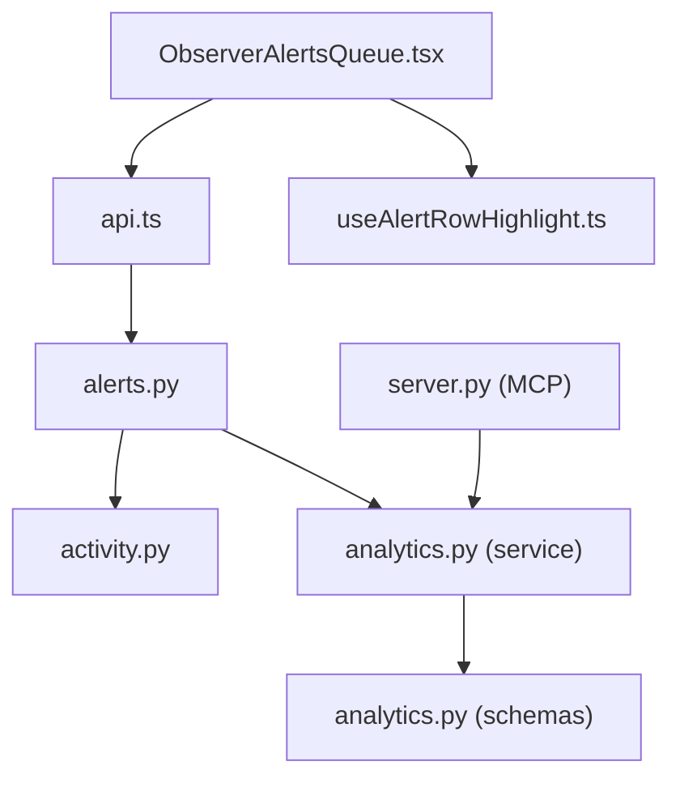

# Alerts Management

<cite>
**Referenced Files in This Document**
- [ObserverAlertsQueue.tsx](file://frontend/app/observer/alerts/ObserverAlertsQueue.tsx)
- [ObserverAlertsPage.tsx](file://frontend/app/observer/alerts/page.tsx)
- [AdminAlertsTable.tsx](file://frontend/components/admin/alerts/AdminAlertsTable.tsx)
- [AlertPanel.tsx](file://frontend/components/shared/AlertPanel.tsx)
- [api.ts](file://frontend/lib/api.ts)
- [alerts.py](file://server/app/api/endpoints/alerts.py)
- [activity.py](file://server/app/models/activity.py)
- [analytics.py](file://server/app/services/analytics.py)
- [analytics.py](file://server/app/schemas/analytics.py)
- [useAlertRowHighlight.ts](file://frontend/hooks/useAlertRowHighlight.ts)
- [alertSound.ts](file://frontend/lib/alertSound.ts)
- [TopBar.tsx](file://frontend/components/TopBar.tsx)
- [NotificationBell.tsx](file://frontend/components/NotificationBell.tsx)
- [seed_demo.py](file://server/scripts/seed_demo.py)
- [test_activity.py](file://server/tests/test_services/test_activity.py)
- [test_agent_runtime_extended.py](file://server/tests/test_agent_runtime_extended.py)
- [test_chat_actions_integration.py](file://server/tests/test_chat_actions_integration.py)
- [server.py](file://server/app/mcp/server.py)
</cite>

## Table of Contents
1. [Introduction](#introduction)
2. [Project Structure](#project-structure)
3. [Core Components](#core-components)
4. [Architecture Overview](#architecture-overview)
5. [Detailed Component Analysis](#detailed-component-analysis)
6. [Dependency Analysis](#dependency-analysis)
7. [Performance Considerations](#performance-considerations)
8. [Troubleshooting Guide](#troubleshooting-guide)
9. [Conclusion](#conclusion)
10. [Appendices](#appendices)

## Introduction
This document describes the Observer Alerts Management system in the WheelSense Platform. It covers the ObserverAlertsQueue component for real-time alert display, alert queue management, severity filtering, prioritization, and response action integration. It also documents alert types, severity levels, resolution processes, and integration with the overall monitoring dashboard. Examples of alert scenarios, response procedures, escalation workflows, and alert analytics are included to guide quality improvement.

## Project Structure
The Alerts Management system spans the frontend React application and the backend FastAPI service:
- Frontend pages and components render the alert queue, handle user actions, and integrate with analytics.
- Backend endpoints manage alert lifecycle (list, create, acknowledge, resolve) and expose analytics summaries.
- Shared models define alert types, severity, and status; services compute analytics.

**Diagram sources**
- [ObserverAlertsPage.tsx:20-35](file://frontend/app/observer/alerts/page.tsx#L20-L35)
- [ObserverAlertsQueue.tsx:31-187](file://frontend/app/observer/alerts/ObserverAlertsQueue.tsx#L31-L187)
- [AdminAlertsTable.tsx:53-230](file://frontend/components/admin/alerts/AdminAlertsTable.tsx#L53-L230)
- [AlertPanel.tsx:19-151](file://frontend/components/shared/AlertPanel.tsx#L19-L151)
- [api.ts:491-576](file://frontend/lib/api.ts#L491-L576)
- [useAlertRowHighlight.ts:9-34](file://frontend/hooks/useAlertRowHighlight.ts#L9-L34)
- [alertSound.ts:1-49](file://frontend/lib/alertSound.ts#L1-L49)
- [TopBar.tsx:132-158](file://frontend/components/TopBar.tsx#L132-L158)
- [NotificationBell.tsx:1-46](file://frontend/components/NotificationBell.tsx#L1-L46)
- [alerts.py:29-134](file://server/app/api/endpoints/alerts.py#L29-L134)
- [activity.py:49-90](file://server/app/models/activity.py#L49-L90)
- [analytics.py:16-91](file://server/app/services/analytics.py#L16-L91)
- [analytics.py:8-25](file://server/app/schemas/analytics.py#L8-L25)
- [server.py:1159-1197](file://server/app/mcp/server.py#L1159-L1197)

**Section sources**
- [ObserverAlertsPage.tsx:20-35](file://frontend/app/observer/alerts/page.tsx#L20-L35)
- [ObserverAlertsQueue.tsx:31-187](file://frontend/app/observer/alerts/ObserverAlertsQueue.tsx#L31-L187)
- [alerts.py:29-134](file://server/app/api/endpoints/alerts.py#L29-L134)

## Core Components
- ObserverAlertsQueue: Real-time alert queue for observers with severity-aware sorting, patient linkage, and action integration.
- AdminAlertsTable: Administrative overview with filtering, status badges, and summary cards.
- AlertPanel: Generic panel for alerts with status filters and inline actions.
- API client: Typed methods for listing alerts, acknowledging, resolving, and analytics.
- Alert endpoints: Lifecycle management (list/create/get/acknowledge/resolve) with role-based access.
- Analytics service: Computes alert summaries and ward metrics.
- Utilities: Row highlighting for targeted alerts, sound toggling, and notification bell.

**Section sources**
- [ObserverAlertsQueue.tsx:31-187](file://frontend/app/observer/alerts/ObserverAlertsQueue.tsx#L31-L187)
- [AdminAlertsTable.tsx:53-230](file://frontend/components/admin/alerts/AdminAlertsTable.tsx#L53-L230)
- [AlertPanel.tsx:19-151](file://frontend/components/shared/AlertPanel.tsx#L19-L151)
- [api.ts:491-576](file://frontend/lib/api.ts#L491-L576)
- [alerts.py:29-134](file://server/app/api/endpoints/alerts.py#L29-L134)
- [analytics.py:16-91](file://server/app/services/analytics.py#L16-L91)

## Architecture Overview
The Observer Alerts Management system follows a clear separation of concerns:
- Frontend queries alerts and renders a prioritized table with severity and status.
- Backend enforces role-based access and maintains alert state transitions.
- Analytics service supports dashboards and MCP integrations.

**Diagram sources**
- [ObserverAlertsQueue.tsx:35-39](file://frontend/app/observer/alerts/ObserverAlertsQueue.tsx#L35-L39)
- [api.ts:571-576](file://frontend/lib/api.ts#L571-L576)
- [alerts.py:91-132](file://server/app/api/endpoints/alerts.py#L91-L132)
- [activity.py:74-88](file://server/app/models/activity.py#L74-L88)

## Detailed Component Analysis

### ObserverAlertsQueue: Real-time Alert Display and Prioritization
- Fetches active alerts with periodic refresh and patient metadata.
- Sorts by severity (critical > warning > info) and recency.
- Renders severity badges, status badges, timestamps, and action buttons.
- Highlights a specific alert via URL parameter and scroll-to effect.

**Diagram sources**
- [ObserverAlertsQueue.tsx:35-82](file://frontend/app/observer/alerts/ObserverAlertsQueue.tsx#L35-L82)
- [ObserverAlertsQueue.tsx:84-155](file://frontend/app/observer/alerts/ObserverAlertsQueue.tsx#L84-L155)
- [ObserverAlertsQueue.tsx:157-187](file://frontend/app/observer/alerts/ObserverAlertsQueue.tsx#L157-L187)
- [useAlertRowHighlight.ts:9-34](file://frontend/hooks/useAlertRowHighlight.ts#L9-L34)

**Section sources**
- [ObserverAlertsQueue.tsx:31-187](file://frontend/app/observer/alerts/ObserverAlertsQueue.tsx#L31-L187)
- [useAlertRowHighlight.ts:9-34](file://frontend/hooks/useAlertRowHighlight.ts#L9-L34)

### Alert Types, Severity Levels, and Status
- Alert types include fall, abnormal_hr, low_battery, device_offline, zone_violation, missed_medication, no_movement.
- Severity levels: info, warning, critical.
- Status lifecycle: active → acknowledged → resolved.

**Diagram sources**
- [activity.py:49-90](file://server/app/models/activity.py#L49-L90)

**Section sources**
- [activity.py:70-88](file://server/app/models/activity.py#L70-L88)

### Alert Lifecycle and Response Workflows
- Create: Allowed for admins, head nurses, supervisors, observers, and patients (subject to access checks).
- Acknowledge: Requires head nurse role; updates status and timestamps.
- Resolve: Requires head nurse role; adds resolution note and timestamps.

**Diagram sources**
- [alerts.py:57-132](file://server/app/api/endpoints/alerts.py#L57-L132)
- [activity.py:74-88](file://server/app/models/activity.py#L74-L88)

**Section sources**
- [alerts.py:26-132](file://server/app/api/endpoints/alerts.py#L26-L132)
- [test_activity.py:91-118](file://server/tests/test_services/test_activity.py#L91-L118)

### Critical Alert Handling and Escalation
- Critical alerts are prioritized during sorting and rendered with prominent severity badges.
- Escalation occurs through role-based acknowledgment/resolution and workflow directives/messages.
- Agent runtime and MCP tooling support automated triage and execution plans.

**Diagram sources**
- [alerts.py:57-112](file://server/app/api/endpoints/alerts.py#L57-L112)
- [test_chat_actions_integration.py:233-270](file://server/tests/test_chat_actions_integration.py#L233-L270)
- [test_agent_runtime_extended.py:616-640](file://server/tests/test_agent_runtime_extended.py#L616-L640)
- [server.py:1159-1197](file://server/app/mcp/server.py#L1159-L1197)

**Section sources**
- [ObserverAlertsQueue.tsx:56-65](file://frontend/app/observer/alerts/ObserverAlertsQueue.tsx#L56-L65)
- [test_chat_actions_integration.py:233-270](file://server/tests/test_chat_actions_integration.py#L233-L270)
- [test_agent_runtime_extended.py:616-640](file://server/tests/test_agent_runtime_extended.py#L616-L640)

### Alert Analytics and Quality Improvement
- Analytics service computes alert summaries and ward metrics.
- MCP exposes workspace analytics including alert totals and vitals averages.
- Admin dashboards leverage analytics for visibility and trend analysis.

**Diagram sources**
- [analytics.py:16-91](file://server/app/services/analytics.py#L16-L91)
- [analytics.py:8-25](file://server/app/schemas/analytics.py#L8-L25)
- [server.py:1159-1197](file://server/app/mcp/server.py#L1159-L1197)

**Section sources**
- [analytics.py:16-91](file://server/app/services/analytics.py#L16-L91)
- [analytics.py:8-25](file://server/app/schemas/analytics.py#L8-L25)
- [server.py:1159-1197](file://server/app/mcp/server.py#L1159-L1197)

## Dependency Analysis
- ObserverAlertsQueue depends on:
  - API client for listing alerts and patients.
  - Sorting and mapping logic for rows.
  - Highlight hook for focused rows.
- API client depends on:
  - Backend endpoints for CRUD and analytics.
- Backend endpoints depend on:
  - Alert model for persistence.
  - Analytics service for summaries.
- Analytics service depends on:
  - SQLAlchemy ORM and schemas.

**Diagram sources**
- [ObserverAlertsQueue.tsx:31-187](file://frontend/app/observer/alerts/ObserverAlertsQueue.tsx#L31-L187)
- [api.ts:491-576](file://frontend/lib/api.ts#L491-L576)
- [alerts.py:29-134](file://server/app/api/endpoints/alerts.py#L29-L134)
- [activity.py:49-90](file://server/app/models/activity.py#L49-L90)
- [analytics.py:16-91](file://server/app/services/analytics.py#L16-L91)
- [analytics.py:8-25](file://server/app/schemas/analytics.py#L8-L25)
- [server.py:1159-1197](file://server/app/mcp/server.py#L1159-L1197)

**Section sources**
- [ObserverAlertsQueue.tsx:31-187](file://frontend/app/observer/alerts/ObserverAlertsQueue.tsx#L31-L187)
- [api.ts:491-576](file://frontend/lib/api.ts#L491-L576)
- [alerts.py:29-134](file://server/app/api/endpoints/alerts.py#L29-L134)

## Performance Considerations
- ObserverAlertsQueue uses periodic polling with a 20-second interval to balance freshness and load.
- Pagination and limits (e.g., limit=300 for alerts, limit=400 for patients) prevent excessive payloads.
- Sorting is client-side after fetching; keep lists bounded to maintain responsiveness.
- Consider debounced search and virtualized tables for very large datasets.

[No sources needed since this section provides general guidance]

## Troubleshooting Guide
- No alerts displayed:
  - Verify API connectivity and authentication.
  - Confirm role-based access to patients and alerts.
- Stale or missing critical alerts:
  - Check polling interval and network latency.
  - Inspect backend filtering for active alerts.
- Acknowledge/Resolve failures:
  - Ensure caller has required roles (head nurse).
  - Validate alert existence and patient access checks.
- Sound not playing:
  - Enable sound preference and trigger user gesture to resume audio context.
- Notification bell anomalies:
  - Verify unread count computation and pulse animation logic.

**Section sources**
- [ObserverAlertsQueue.tsx:35-39](file://frontend/app/observer/alerts/ObserverAlertsQueue.tsx#L35-L39)
- [alerts.py:38-49](file://server/app/api/endpoints/alerts.py#L38-L49)
- [alerts.py:98-112](file://server/app/api/endpoints/alerts.py#L98-L112)
- [alertSound.ts:15-24](file://frontend/lib/alertSound.ts#L15-L24)
- [TopBar.tsx:132-158](file://frontend/components/TopBar.tsx#L132-L158)
- [NotificationBell.tsx:21-46](file://frontend/components/NotificationBell.tsx#L21-L46)

## Conclusion
The Observer Alerts Management system integrates a responsive frontend queue with a robust backend lifecycle and analytics. Observers benefit from prioritized, severity-aware displays and direct actions, while administrators gain comprehensive oversight and reporting. The system’s modular design supports escalation, automation, and continuous quality improvement through analytics.

[No sources needed since this section summarizes without analyzing specific files]

## Appendices

### Example Alert Scenarios and Procedures
- Scenario: Fall detected
  - Trigger: Monitoring detects fall; create alert with critical severity.
  - Procedure: Observer acknowledges; escalate to head nurse; resolve after intervention.
- Scenario: Low battery device
  - Trigger: Device reports low battery; create alert with warning severity.
  - Procedure: Observer resolves after battery replacement; verify device online.
- Scenario: Abnormal vital signs
  - Trigger: Abnormal HR alert; create alert with warning severity.
  - Procedure: Observer acknowledges; escalate to head nurse; resolve after stabilization.

**Section sources**
- [seed_demo.py:897-929](file://server/scripts/seed_demo.py#L897-L929)
- [activity.py:70-73](file://server/app/models/activity.py#L70-L73)
- [test_activity.py:91-118](file://server/tests/test_services/test_activity.py#L91-L118)

### Integration with Monitoring Dashboard
- Admin dashboards consume analytics summaries for total active/resolved alerts and type breakdowns.
- MCP tooling provides workspace-level analytics for integrated workflows.

**Section sources**
- [AdminAlertsTable.tsx:209-230](file://frontend/components/admin/alerts/AdminAlertsTable.tsx#L209-L230)
- [analytics.py:16-42](file://server/app/services/analytics.py#L16-L42)
- [server.py:1159-1197](file://server/app/mcp/server.py#L1159-L1197)